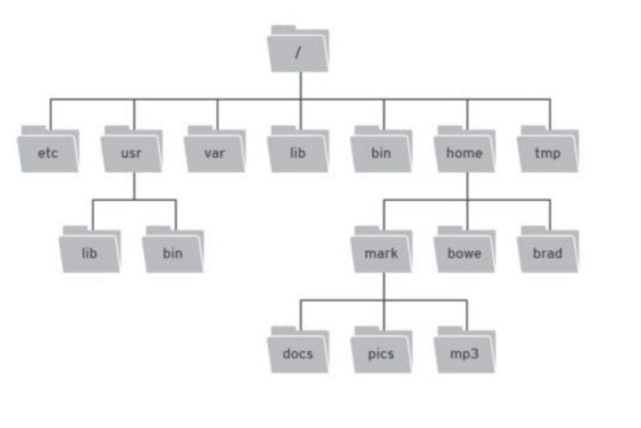

# Linux

## Linux 操作系统的核心组成结构

内核（Kernel）

- 这是 Linux 最核心的部分，负责管理系统的硬件资源
- 主要功能包括:
  - 内存管理
  - 进程调度
  - 设备驱动
  - 文件系统管理
  - 网络通信

Shell（命令解释器）

- 作为用户与内核之间的接口
- 接收用户命令，并将其转换为内核能够理解的指令
- 常见的 Shell 包括:
  - Bash (最常用)
  - Zsh
  - Fish
  - Ksh

文件系统

- 采用树形层次结构，从根目录(/)开始
- 重要目录及其作用：
  - /bin: 存放基本命令
  - /etc: 系统配置文件
  - /home: 用户主目录
  - /lib: 系统库文件
  - /root: 超级用户目录
  - /usr: 应用程序和数据

系统工具和应用程序

- 包括各种命令行工具
- 系统管理工具
- 开发工具
- 文本编辑器等应用程序

图形用户界面（GUI）

- X Window System（显示服务器）
- 桌面环境，如：
  - GNOME
  - KDE
  - XFCE
- 窗口管理器

**其中内核负责硬件资源的直接管理，作用有五大功能：**

1. 进程管理：涉及进程的创建、调度和通信，就是一个执行或者是运行起来的应用程序

2. 内存管理: 负责内存分配、回收和地址映射

3. 设备管理: 鼠标，键盘，显示屏.....包括中断处理、I/O操作

4. 网络管理: 管理网络连接，允许应用进行网络通信，有线 无线

5. 文件系统：管理磁盘数据，处理文件的存储、访问和保护。

###  Linux 的层级结构

硬件层（最底层）

- 包括 CPU、内存、硬盘、网卡等物理设备
- 为整个系统提供基础的硬件支持

内核层

- 直接与硬件交互
- 提供最基础的功能：
  - 内存管理和进程调度
  - 设备驱动程序
  - 文件系统管理
  - 网络协议栈

系统调用接口层

- 作为内核与上层应用程序的桥梁
- 提供标准的系统调用 API
- 例如：open()、read()、write() 等函数

Shell 和系统库层

- 系统库（如 glibc）：封装系统调用，提供更高级的编程接口
- Shell：为用户提供命令行界面，处理用户输入的命令

应用程序层（最顶层）

- 用户层面的应用程序
- 分为两类：
  - 命令行应用程序（如 vim、gcc）
  - 图形界面应用程序（如浏览器、办公软件）

信息流向：

- 自上而下：用户在应用程序层发出指令，经过层层传递最终到达硬件层
- 自下而上：硬件产生的信号，经过层层处理最终反馈给用户

这种层级结构的优势：

- 模块化设计，每层功能清晰
- 良好的安全性，通过权限控制保护系统
- 便于维护和升级，各层相对独立

### 隶属关系

内核（Kernel）

- 属于内核层
- 直接与硬件交互
- 提供所有核心功能和底层支持

Shell（命令解释器）

- 属于 Shell 和系统库层
- 作为用户与内核之间的中间层
- **处理用户输入的命令并转换为系统调用**

文件系统

- 跨越多个层次：
  - 在内核层：实现基本的文件系统功能
  - 在系统调用接口层：提供文件操作的系统调用
  - 在 Shell 层：提供文件管理命令

系统工具和应用程序

- 属于应用程序层
- 包括各种命令行工具和应用软件
- **通过系统调用接口与底层交互**

图形用户界面（GUI）

- 属于应用程序层
- X Window System 作为显示服务器
- 桌面环境和窗口管理器都运行在此层

### **所有的命令都是通过系统调用与内核交流的？**

基本上是的,但不是所有命令都直接使用系统调用。让我详细解释一下:

**系统调用的使用方式：**

- 直接系统调用：一些底层程序直接使用系统调用
- 通过库函数：大多数程序通过 C 标准库(如 glibc)间接使用系统调用
- Shell 内置命令：一些命令直接由 Shell 解释器处理

举个例子，当你执行 `ls` 命令时：

```
用户输入 ls
   ↓
Shell 解析命令
   ↓
执行 ls 程序
   ↓
ls 程序调用 glibc 库函数(如 opendir、readdir)
   ↓
glibc 库函数转换为系统调用(如 sys_open、sys_getdents)
   ↓
内核执行相应操作
```

特殊情况：

- Shell 内置命令(如 cd、pwd)：直接由 Shell 处理，可能使用也可能不使用系统调用
- 一些简单的命令可能完全在用户空间执行，不需要系统调用
- **复杂的应用程序可能会使用多个不同的系统调用**

**所以准确地说，是所有需要访问系统资源（如文件、网络、进程等）的操作最终都要通过系统调用与内核交互。**


**再进一步总结为： 用户只能在应用程序层或者shell输入命令，可能经过系统库层的库函数转换为系统调用，此时内核就能够识别指令了，开始执行对应的操作。 这么做的原因是为了保证操作系统的稳定运行。用户不能随意执行任何命令？**

用户权限分级

- 普通用户: 只能在应用层和用户空间操作
- root用户: 有更高权限,**但仍然需要通过系统调用访问内核**
- 内核空间: **只有内核代码能直接访问**

这种设计的安全保障

- **防止用户直接访问硬件**
- **避免恶意程序破坏系统**
- 保护内存管理和进程管理
- 实现资源访问控制

具体体现

- 文件权限控制(读/写/执行)
- 进程权限控制
- 内存访问限制
- 系统调用的权限检查

```
用户想删除系统文件:
- 普通用户执行 rm /etc/passwd → 失败(权限不足)
- root用户执行 rm /etc/passwd → 成功(有足够权限)
两种情况都需要通过系统调用,区别在于权限检查的结果
```

## Linux相比对于嵌入式开发有哪一些优势？

**Linux对于嵌入式开发意味着什么？ Linux相比windows的优势在哪里？**

### Linux对于嵌入式开发意味着什么？

Linux 在嵌入式开发中扮演着至关重要的角色，它不仅是一个操作系统，更是一个强大的开发平台和生态系统。嵌入式系统通常是为特定功能设计的计算机系统，例如智能手机、路由器、工业控制设备等。Linux 凭借其独特的特性，成为嵌入式开发者的首选操作系统。以下是 Linux 在嵌入式开发中的具体意义：

1. **开源与免费**
    Linux 是开源的操作系统，其源代码对所有人开放，开发者可以自由获取、修改和分发。**这不仅降低了开发成本，还赋予了开发者根据项目需求定制系统的能力。**
2. **高度可定制性**
    Linux 内核和系统组件可以**根据嵌入式设备的需求进行裁剪和优化，去除不必要的功能，从而减小系统体积并提升运行效率。这在资源受限的嵌入式设备中尤为重要。**
3. **广泛的跨平台支持**
    Linux 支持多种硬件架构，包括 ARM、MIPS、x86 等，几乎覆盖了所有主流嵌入式处理器。这使得开发者能够为不同平台开发应用。
4. **丰富的软件生态系统**
    Linux 拥有庞大的开源软件库和工具链（如 GCC、GDB 等），开发者可以利用这些资源快速构建和部署应用，缩短开发周期。
5. **强大的社区支持**
    Linux 拥有全球活跃的开发者社区，提供了丰富的文档、教程和论坛支持，帮助开发者解决问题并学习新技术。
6. **安全性和稳定性**
    Linux 经过多年的发展和广泛应用，具备成熟的安全机制和稳定性，非常适合需要长时间运行的嵌入式设备。

综上所述，Linux 对于嵌入式开发意味着一个开源、灵活、可定制且具备强大支持的开发平台，能够显著提升开发效率并满足多样化的硬件和应用需求。

### Linux 相比 Windows 的优势在哪里？

与 Windows 相比，Linux 在嵌入式开发中具有显著的优势，这些优势使其更适合嵌入式系统的开发和部署。以下是具体的对比：

1. **成本**
    Linux 是免费的，无需支付许可费用，而 Windows 通常需要购买许可证。**对于大规模部署的嵌入式系统来说，Linux 可以显著降低成本。**
2. **可定制性**
    Linux 允许开发者深度定制操作系统，去除不需要的功能以优化性能和资源占用。而 Windows 相对封闭，定制性较差，难以满足嵌入式设备的特定需求。
3. **实时性**
    Linux 提供多种实时扩展和补丁（如 PREEMPT_RT），使其能够满足需要快速响应和确定性延迟的嵌入式应用。Windows 虽然也有实时版本，但选择较少且成本较高。
4. **硬件支持**
    **Linux 支持广泛的硬件平台，特别是嵌入式领域常用的低功耗、高性能处理器（如 ARM、MIPS 等），而 Windows 主要针对 x86 和部分 ARM 平台，适用范围较窄。**
5. **开发工具**
    **Linux 提供丰富的免费开源工具链，如 GCC（编译器）、GDB（调试器）等。而 Windows 的开发工具（如 Visual Studio）虽然功能强大，但通常需要付费。**
6. **网络和连接性**
    **Linux 原生支持 TCP/IP 协议栈，并提供丰富的网络工具和库，非常适合需要网络功能的嵌入式设备**。Windows 在这方面的灵活性稍逊一筹。
7. **文件系统支持**
    Linux 支持多种文件系统（如 ext4、NFS、FAT 等），为嵌入式系统提供了灵活的存储选择，而 Windows 的文件系统支持相对有限。
8. **多任务和多线程**
    **Linux 内核原生支持高效的多任务和多线程处理，能够满足嵌入式应用中复杂的并发需求。Windows 虽然也支持多任务，但优化程度不如 Linux。**
9. **驱动程序支持**
    **Linux 社区为大量硬件设备提供了开源驱动程序，开发者可以直接使用或修改，加速开发进程。**而 Windows 的驱动开发通常依赖厂商支持，灵活性较低。
10. **跨平台开发**
     **Linux 上的开发工具和环境支持跨平台开发，开发者可以在 PC 上开发和调试应用，然后无缝部署到嵌入式设备上。Windows 的跨平台能力相对有限。**

------

### 总结

Linux 在嵌入式开发中的意义在于其开源性、可定制性以及强大的生态支持，使其成为一个灵活、高效的开发平台。相比 Windows，Linux 在成本、定制性、硬件支持、开发工具和实时性等方面具有明显优势，因此成为**嵌入式系统开发者的首选操作系统。**

## freertos与Linux

FreeRTOS与Linux是两种在嵌入式开发中常用的操作系统，它们在设计目标、功能特性及适用场景等方面存在显著差异，远不仅是“体量”上的区别。以下是对两者区别的详细比较：

### **设计目标与系统架构**

- FreeRTOS

  FreeRTOS 是一个轻量级的实时操作系统（RTOS），专为资源受限的微控制器（MCU）设计。它的核心目标是提供高效的任务调度和实时响应。

  - **架构**：采用微内核设计，内核小巧，功能精简，主要包括任务管理、调度、同步和通信等基本模块。开发者可根据需求裁剪功能，以减少资源占用。
  - **适用场景**：适合实时性要求高、硬件资源有限的嵌入式系统，例如工业控制、物联网设备和传感器网络

- Linux

  Linux 是一个功能强大的通用操作系统，旨在支持多任务处理、网络功能、文件系统等复杂需求。

  - **架构**：采用宏内核设计，集成了丰富的功能模块，如进程管理、内存管理、网络协议栈等，内核较为庞大。
  - **适用场景**：适合资源充足、需要复杂功能的嵌入式系统，例如智能手机、路由器和智能家居设备。

### **实时性**

- FreeRTOS

  FreeRTOS 提供硬实时特性，能够确保任务在严格的时间约束内完成。其调度算法和中断处理机制经过优化，特别适合需要快速响应的场景。

  - **优势**：适用于汽车电子、医疗设备等对实时性要求极高的应用。

- Linux

  标准 Linux 内核是软实时系统，调度延迟较大，不适合时间要求苛刻的场景。不过，通过 PREEMPT_RT 补丁，Linux 可以实现接近硬实时的性能。

  - **优势**：适合实时性要求不严格但需要复杂功能的系统。

### **资源占用**

- FreeRTOS

  FreeRTOS 的内核极小，通常只需几 KB 的 RAM 和 ROM，非常适合低功耗、低成本的设备。

  - **优势**：在资源受限的嵌入式系统中表现出色。

- Linux

  Linux 需要较大的资源支持，内核和基本用户空间组件通常占用几十 MB 的 RAM 和存储空间。

  - **优势**：适合硬件资源较丰富的平台，能充分发挥复杂功能。

### **开发复杂度**

- FreeRTOS

  FreeRTOS 的 API 简单直观，学习曲线平缓，开发者可以快速上手并专注于应用开发。

  - **优势**：适合嵌入式开发新手或需要快速开发原型的项目。

- Linux

  Linux 的开发环境复杂，需要开发者熟悉其工具链和系统知识，学习和掌握成本较高。

  - **优势**：提供丰富的开发工具和调试支持，适合复杂项目。

### **生态系统与支持**

- FreeRTOS

  FreeRTOS 的生态系统较小，但社区活跃，提供丰富的示例代码和文档。

  - **优势**：官方和社区支持能快速解决技术问题。

- Linux

  Linux 拥有庞大的开源社区，支持几乎所有主流编程语言和工具，资源和文档极为丰富。

  - **优势**：开发者可以轻松找到所需软件和库。

### **许可与成本**

- FreeRTOS

  采用 MIT 许可，完全免费，可自由使用、修改和分发。

  - **优势**：非常适合低成本项目。

- Linux

  内核采用 GPLv2 许可，用户空间组件采用多种开源许可，通常免费，但某些商业支持可能收费。

  - **优势**：开源生态提供大量免费资源。

### 总结：不仅仅是体量

FreeRTOS 和 Linux 的区别远不止体量大小。

- **FreeRTOS**：轻量级、实时性强、资源占用低，适合资源有限、对时间要求严格的嵌入式系统。
- **Linux**：功能丰富、生态系统强大，适合资源充足、需要复杂功能和网络支持的场景。

选择哪种系统取决于你的项目需求：如果需要低成本、高实时性，FreeRTOS 是优选；如果需要高级功能和广泛支持，Linux 更合适。两者各有千秋，关键在于匹配硬件资源和应用场景。

## Linux系统编程与系统调用的关系

Linux系统编程是指**在Linux环境下，利用操作系统提供的接口（如库函数和系统调用）开发程序**，以实现特定功能的过程。**这些接口是用户程序与Linux内核交互的桥梁**，主要包括：

- **库函数**：由Linux的C标准库（如libc或glibc）提供，是**一组封装了系统调用的高级接口**。它们为开发者提供了更易用的编程方式，例如opendir()、readdir()等函数，用于目录操作。
- **系统调用**：Linux内核直接提供的底层接口，**允许用户态程序请求内核执行特权操作**，如文件读写（open()、read()）、进程管理（fork()、exec()）等。

系统编程的核心在于**通过这些接口控制和操作Linux系统**。**系统调用是内核与用户程序之间的直接通道**，而**库函数则是在系统调用之上封装的更高层次抽象，使得编程更加方便**。开发者可以选择直接调用系统调用以获得更细粒度的控制，或者使用库函数来简化开发。

### 用户的Shell命令如何转换为系统调用并由内核执行

用户的Shell命令（如ls、cp）在执行时，会经历以下步骤，最终转换为系统调用并由内核完成相应操作：

1. **输入Shell命令**：用户在Shell（如bash）中输入命令，例如ls。
2. **Shell解析命令**：Shell解释器解析输入，识别出要执行的程序（例如/bin/ls）。
3. **加载并执行程序**：Shell通过exec系统调用加载并运行/bin/ls程序。/bin/ls是用C语言编写的可执行程序。
4. **调用库函数**：在/bin/ls程序中，开发者使用了C语言的库函数（如opendir()、readdir()）来实现列出目录的功能。
5. **转换为系统调用**：这些库函数内部会调用相应的系统调用（如open()、read()），向内核请求执行底层操作。
6. **内核执行操作**：内核接收到系统调用后，执行对应的特权操作（例如打开目录、读取文件列表），并将结果返回给用户程序。
7. **结果返回用户**：库函数处理内核返回的数据，最终通过程序输出到终端，完成命令的执行。

整个过程可以总结为以下链条：

**Shell命令 → 执行程序 → 库函数 → 系统调用 → 内核操作**

因此，用户输入的Shell命令确实是先转换为Linux操作系统提供的库函数，再由库函数转换为系统调用，最终由内核执行对应的操作。

### 库函数是C语言写的吗？

是的，Linux系统中使用的库函数通常是用C语言编写的。例如，Linux的C标准库（如glibc）是一个广泛使用的库，它提供了大量的函数（如printf()、malloc()、open()等），这些函数都是用C语言实现的。库函数的作用是为开发者提供一个便捷的接口，封装了系统调用的复杂性，使得程序员无需直接处理底层细节。

### Linux是C语言写的吗？

是的，Linux操作系统主要是用C语言编写的。Linux内核、标准库（如glibc）以及大多数系统工具（如Shell、文件系统工具等）都使用C语言开发。C语言因其以下特性成为操作系统开发的首选语言：

- **高效性**：C语言生成的代码运行效率高，适合性能敏感的系统开发。
- **接近硬件**：C语言允许开发者直接操作内存和硬件资源，非常适合编写内核和底层工具。
- **灵活性**：C语言提供了足够的控制能力，满足操作系统开发的复杂需求。

虽然Linux中也包含少量汇编语言代码（通常用于特定硬件相关的初始化或优化），但绝大部分代码是用C语言完成的。

### 总结

- **Linux系统编程与系统调用的关系**：系统编程通过库函数和系统调用实现与Linux内核的交互，系统调用是底层接口，库函数是其高层封装。
- **Shell命令的转换过程**：用户的Shell命令先转换为库函数，再由库函数调用系统调用，最终由内核执行操作。
- **库函数的语言**：库函数通常是用C语言编写的，如glibc中的实现。
- **Linux的语言**：Linux操作系统主要用C语言编写，包括内核和系统工具。

### 补充

**那其实用户可以直接使用系统调用请求内核执行操作的？只不过太麻烦了，在系统调用之上再封装了一层，这就是库函数？**

用户确实可以直接使用系统调用来请求内核执行操作，但由于直接使用系统调用比较麻烦且复杂，因此在系统调用之上封装了一层更友好的接口，这就是库函数。

#### 用户可以直接使用系统调用吗？

可以，用户程序完全有能力直接调用Linux内核提供的系统调用。例如，在C语言中，可以通过特定的机制（如syscall()函数或汇编代码）直接调用系统调用，比如：

```c
#include <unistd.h>
#include <sys/syscall.h>

int main() {
    // 直接调用 write 系统调用（编号 1），将字符串输出到标准输出
    syscall(1, 1, "Hello, World!\n", 14);
    return 0;
}
```

在这个例子中：

- syscall() 是一个辅助函数，用于直接触发系统调用。
- 参数 1 是 write 系统调用的编号（在Linux中，每个系统调用有唯一的编号）。
- 后续参数 1（文件描述符，标准输出）、"Hello, World!\n"（要写入的数据）、14（数据长度）是 write 系统调用的具体参数。

运行这段代码，内核会直接执行 write 操作，将字符串输出到终端。这种方式绕过了库函数，直接与内核交互。

#### 为什么直接使用系统调用麻烦？

虽然直接调用系统调用是可行的，但它有以下缺点：

1. **接口复杂**
    系统调用的参数和调用方式通常是底层的，直接操作需要开发者熟悉内核的实现细节。例如，传递文件描述符、缓冲区指针和长度等参数时，必须手动管理内存和错误处理。
2. **跨平台不一致**
    系统调用的编号和参数在不同操作系统或架构上可能不同。例如，write 的编号在x86上是1，但在ARM上可能是不同的值。直接调用系统调用会导致代码的可移植性变差。
3. **缺乏抽象**
    系统调用提供的功能非常原始，开发者需要自己处理许多细节。例如，读取目录内容时，直接使用 getdents 系统调用需要手动解析返回的目录项数据结构，而不像库函数 readdir() 那样简单易用。
4. **调试困难**
    系统调用的错误返回通常是简单的错误码（如 -errno），开发者需要手动检查和处理，而库函数通常会提供更人性化的错误信息。

#### 库函数是什么？为什么需要它？

库函数（如C标准库 glibc 中的函数）就是在系统调用之上封装的一层抽象接口。它的作用是：

1. **简化开发**
    库函数将复杂的系统调用封装成更易用的函数。例如，printf() 内部会调用 write 系统调用，但开发者只需传递格式化字符串，无需关心底层细节。
2. **提高可移植性**
    **库函数屏蔽了不同平台间系统调用的差异**。例如，open() 函数在Linux和UNIX系统上的行为一致，而底层的系统调用实现可能不同。
3. **提供附加功能**
    **库函数不仅仅是简单转发系统调用，还可能添加额外的逻辑。例如，fopen() 不仅调用 open 系统调用，还提供了缓冲区管理和文件模式解析等功能。**
4. **统一错误处理**
    库函数通常会设置全局变量 errno 并返回友好的错误提示，方便开发者调试。

比较直接使用系统调用和库函数的写文件操作：

```c
直接系统调用：
syscall(2, "file.txt", O_WRONLY | O_CREAT, 0644); // 打开文件
syscall(1, fd, "data", 4); // 写入数据

使用库函数：
FILE *f = fopen("file.txt", "w");
fwrite("data", 1, 4, f);
```

#### 系统调用与库函数的关系

可以说，库函数是系统调用的“包装器”（wrapper）。大部分库函数（如 open()、read()、write()）直接对应某个系统调用，但有些复杂功能的库函数可能会组合多个系统调用。例如：

- printf() 内部调用了 write 系统调用，还处理了格式化逻辑。
- malloc() 可能调用 brk 或 mmap 系统调用来分配内存。

在Linux中，C标准库（如 glibc）是最常用的库函数实现，它为开发者提供了从系统调用到高级功能的完整过渡层。

#### 总结

- **可以直接使用系统调用**：是的，用户程序可以直接调用系统调用与内核交互。
- **为什么封装库函数**：直接调用系统调用麻烦、低效且不友好，库函数通过封装提供了简洁、可移植和高层次的接口。
- **本质**：库函数是系统调用的上层抽象，目的是降低开发难度，提升开发效率。

所以，库函数的存在并不是必须的，但它极大地方便了开发者的工作。直接使用系统调用更像是“硬核模式”，适合需要极致控制或优化的场景，而库函数则是日常开发的“便捷模式”。

## Linux文件和目录

**Linux系统中，一切皆文件,Linux系统把设备（硬盘、软驱、光驱等）都看作文件，文件夹也看作文件?**

“Linux系统中，一切皆文件”意味着 Linux 通过文件这一抽象概念，将各种资源（普通文件、目录、设备、管道、系统信息等）统一表示和操作。具体到你的描述：

- **设备（硬盘、软驱、光驱等）被看作文件**：它们以设备文件的形式出现在 /dev 中，可以用文件操作接口访问。
- **文件夹也看作文件**：目录是存储元数据的特殊文件，与普通文件共享底层机制。

这种设计简化了系统编程，增强了灵活性，是 Linux（以及 UNIX）哲学的重要体现。通过“一切皆文件”，Linux 提供了一个优雅而一致的资源管理模型。

### 什么是“一切皆文件”？

在 Linux 中，“文件”不仅仅指存储在磁盘上的数据文件，而是一个更广义的概念，几乎所有的系统资源都被抽象为“文件”，并通过文件系统的接口来操作。这种设计让开发者可以用一致的方式（例如 open()、read()、write()、close() 等系统调用）来访问和管理不同的资源，**而无需为每种资源设计一套独立的接口。**

具体来说：

- **普通文件**：如文本文件、图片等，存储在磁盘上的数据。
- **目录**：文件夹也被看作一种特殊的文件，里面存储的是文件和子目录的元数据。
- **设备**：硬件设备（如硬盘、键盘、鼠标、打印机等）被抽象为文件，通常位于 /dev 目录下。
- **管道和套接字**：进程间通信的机制（如命名管道或网络socket）也被表示为文件。
- **符号链接**：指向其他文件的特殊文件。

### “Linux系统把设备（硬盘、软驱、光驱等）都看作文件”的含义

在 Linux 中，硬件设备被抽象为文件系统中的“设备文件”（device file），通常存放在 /dev 目录下。这些设备文件分为两种类型：

1. **字符设备文件**（character device）：以字符流方式操作的设备，例如键盘（/dev/tty）、鼠标或串口。
2. **块设备文件**（block device）：以数据块为单位操作的设备，例如硬盘（/dev/sda）、光驱（/dev/cdrom）。

例如：

- 如果你想向终端输出数据，可以通过 write() 系统调用操作 /dev/tty，就像操作普通文件一样。
- 如果你想读取硬盘的数据，可以用 read() 读取 /dev/sda，就像读取普通文件。

这种抽象的优点是：

- **统一性**：**开发者无需学习特殊的设备操作API，只需用文件操作的通用接口即可。**
- **灵活性**：**可以用 Shell 命令（如 cat、echo）直接操作设备文件**。例如，echo "hello" > /dev/tty 会将 "hello" 输出到终端。

### “文件夹也看作文件”的含义

在 Linux 中，目录（文件夹）也被视为一种特殊的文件。目录文件的内容不是普通数据，而是文件系统元数据（如文件名、索引节点号等），用于组织和管理其他文件。

例如：

- 你可以用 ls -l 查看目录的属性，**会发现它被标记为 d（directory），但本质上它仍是一个“文件”。**
- **使用 cat 命令尝试读取目录文件会失败，因为它的内容不是普通数据，但可以用 readdir() 等函数读取其条目。**

这种设计的意义在于：

- **一致性**：目录和普通文件都可以用文件描述符表示，都支持基本的文件操作（如 open()、close()）。
- **递归性**：文件系统是一个树形结构，目录作为“文件”可以嵌套其他目录和文件，逻辑上更加统一。

### 如何理解“一切皆文件”？

从操作系统的角度看，这种设计的核心思想是**抽象和简化**：

1. **抽象层**：将复杂的硬件设备、目录结构等抽象成文件，隐藏底层实现的差异。
2. **统一接口**：通过文件描述符和标准系统调用（如 read()、write()），用户可以用相同的方式操作各种资源。
3. **模块化**：这种设计让内核的实现更加模块化，便于扩展和维护。

举个例子：

- 写入数据到文件：echo "test" > file.txt
- 写入数据到设备：echo "test" > /dev/tty
- 这两个操作在 Shell 中几乎相同，**背后都依赖文件系统的统一接口**。

### 更广义的“一切皆文件”

除了设备和目录，Linux 还将一些抽象资源表示为文件，例如：

- **/proc 文件系统**：虚拟文件系统，提供进程信息和系统状态。例如，/proc/cpuinfo 是一个“文件”，读取它可以获取 CPU 信息。
- **/sys 文件系统**：用于访问硬件设备的属性。例如，/sys/class/leds 下的文件可以控制 LED 灯的状态。

这些虚拟文件并不是存储在磁盘上的实体，而是内核动态生成的，但它们仍然可以用文件操作的方式访问。

```c
Linux系统中文件的类型
  		块设备文件：  b
  		字符设备文件：c
     	目录文件：    d
        普通文件：    -
		链接文件：    l 
        套接字文件：  s
        管道文件：    p
        
Linux文件属性
		蓝色：目录
		绿色：可执行
	    浅蓝色：链接
  		红色：压缩
  		灰色：其他
```

### 从用户命令来看“一切皆为文件”

在Linux中，几乎“所有的东西都是文件”，这包括了shell中的命令，它们通常以**可执行文件**的形式存在。当你在shell中输入一个命令时，**系统会根据PATH查找到相应的可执行文件，然后加载并运行这个程序。**

在这个执行过程中，程序内部往往会调用C标准库（如glibc）提供的函数，而这些库函数大多数是对Linux内核提供的系统调用的封装。例如，文件操作函数（如fopen、read、write）和进程控制函数（如fork、execve）都是通过库函数间接调用内核的系统调用。这样做有两个主要原因：

- **抽象和易用性：** 库函数为开发者提供了更高层次、更友好的接口，屏蔽了底层系统调用的复杂性，使编程更加简单直观。
- **额外的处理：** 除了简单封装系统调用外，库函数还可能在用户态进行一些额外的处理，比如缓冲、格式化、错误检查等，这些处理能提高性能和稳定性。

不过需要注意，并非所有库函数都是直接对应于一个单一的系统调用，有些库函数可能会调用多个系统调用或者在用户态进行复杂的逻辑处理。

## 文件系统目录结构



Linux 文件系统的结构遵循一种层次化的目录树设计，每个目录都有其特定的用途和功能。这种设计不仅逻辑清晰，还能帮助用户和开发者快速定位文件和资源。

### 文件系统结构及各个目录的作用

**/**

- **含义**：根目录，是 Linux 文件系统的起点，所有其他目录和文件都从这里派生出来。
- **作用**：作为整个文件系统的“入口”，它是**所有目录的父目录。所有的路径（绝对路径）都从 / 开始。**
- **示例**：/bin、/etc 等都是根目录下的子目录。

**/bin**

- **含义**：存放基本系统命令（binary 的缩写）。
- **作用**：**包含系统运行所需的最基本的可执行文件，普通用户和管理员都可以使用**。与 /usr/bin 类似，但 /bin 下的命令更基础，通常在系统启动或单用户模式下也能使用。
- **典型文件**：ls、cat、cp、mv、rm 等。
- **备注**：**这些命令是系统核心功能的基础，例如文件操作和查看。**

**/boot**

- **含义**：**存放系统启动相关文件。**
- **作用**：包含 Linux 内核镜像文件、启动加载程序（如 GRUB）的配置文件等，**用于系统启动过程。**
- **典型文件**：vmlinuz（内核镜像）、initrd.img（初始 RAM 磁盘）、grub/grub.cfg（GRUB 配置文件）。
- **备注**：如果这个目录损坏，系统可能无法启动。

**/dev**

- **含义**：设备文件存储目录（device 的缩写）。
- **作用**：**Linux 将所有硬件设备抽象为文件，存放在这里。通过这些文件，程序可以与设备交互。**
- **典型文件**：/dev/sda（硬盘）、/dev/tty（终端）、/dev/null（空设备）。
- **备注**：可以用 lsblk 查看块设备，或者 cat /dev/urandom 生成随机数据。

**/etc**

- **含义**：存放系统配置文件（可能源自 "editable text configuration"）。
- **作用**：几乎所有系统服务的配置文件都在这里，是系统管理的核心。
- **典型文件**：/etc/passwd（用户信息）、/etc/fstab（文件系统挂载表）、/etc/hosts（主机名解析）。
- **备注**：修改这些文件需要管理员权限（root）。

**/home**

- **含义**：普通用户的主目录。
- **作用**：每个普通用户在这里都有一个子目录，**用于存储个人文件和配置。**
- **典型文件**：/home/user1、/home/user2（用户的个人目录）。
- **备注**：例如，~/.bashrc（用户 Shell 配置）就存放在用户的子目录中。

**/root**

- **含义**：超级用户（root）的主目录。
- **作用**：与 /home 类似，但专属于 root 用户，避免与普通用户混淆。
- **典型文件**：root 用户的配置文件和私人文件。
- **备注**：普通用户无法访问此目录。

**/lib**

- **含义**：库文件和内核模块存放目录（library 的缩写）。
- **作用**：存放系统和程序运行所需的共享库文件，以及内核模块。
- **典型文件**：libc.so（C标准库）、/lib/modules（内核模块目录）。
- **备注**：类似 /usr/lib，但 /lib 更基础，**常用于系统启动**。

**/media**

- **含义**：**即插即用设备的自动挂载点。**
- **作用**：当插入 U盘、CD/DVD 等设备时，系统会自动挂载到此目录下的子目录。
- **典型文件**：/media/user/usb1（U盘挂载点）。
- **备注**：与 /mnt 类似，但更专注于自动挂载。

**/mnt**

- **含义**：临时文件系统的挂载点（mount 的缩写）。
- **作用**：用于手动挂载临时文件系统（如硬盘分区、网络文件系统）。
- **典型文件**：/mnt/disk1（手动挂载的分区）。
- **备注**：与 /media 的区别在于，/mnt 通常由用户手动操作。

**/tmp**

- **含义**：临时文件目录。
- **作用**：存放程序或系统运行时生成的临时文件，通常在重启后清空。
- **典型文件**：临时日志、下载缓存等。
- **备注**：任何用户都可以在此创建文件，但要注意权限。

**/usr**

- **含义**：用户应用程序和数据的存放目录（Unix System Resources 的缩写）。
- **作用**：包含用户使用的命令、库文件、文档等非系统核心的部分。
- 典型子目录：
  - /usr/bin：用户命令（如 gcc、python）。
  - /usr/lib：用户程序的库文件。
  - /usr/share：共享数据（如帮助文件、图标）。
- **备注**：当你不知道某个命令时，可以在 /usr/bin 查看可执行文件。

**/var**

- **含义**：存放经常变动的数据（variable 的缩写）。
- **作用**：保存日志、邮件、缓存等动态内容。
- 典型子目录：
  - /var/log：系统日志（如 /var/log/syslog）。
  - /var/mail：用户邮件。
  - /var/cache：缓存文件。
- **备注**：监控系统状态时常查看 /var/log。

**/opt**

- **含义**：第三方软件的存放目录（optional 的缩写）。
- **作用**：用于安装非包管理器管理的软件，例如手动下载的应用程序。
- **典型文件**：/opt/google-chrome（Chrome 浏览器）。
- **备注**：便于与系统自带软件区分。

**/sbin**

- **含义**：系统维护命令目录（system binary 的缩写）。
- **作用**：存放系统管理相关的命令，通常只有超级用户（root）能执行。
- **典型文件**：ifconfig、reboot、fdisk。
- **备注**：与 /bin 不同，/sbin 的命令更偏向系统管理。

**/srv**

- **含义**：服务数据目录（service 的缩写）。
- **作用**：存放服务器启动后需要访问的数据，例如网站文件。
- **典型文件**：/srv/www（Web 服务数据）。
- **备注**：常用于服务器环境，普通桌面系统可能为空。

### 如何利用这些知识？

了解这些目录的作用后，你可以更高效地学习和使用 Linux：

- **查找命令**：如果不知道某个命令，可以去 /bin 或 /usr/bin 查看可执行文件，用 man 查看帮助。
- **配置文件管理**：需要调整系统设置时，直接定位到 /etc。
- **日志排查**：系统出问题时，检查 /var/log 下的日志文件。
- **设备操作**：想与硬件交互，可以操作 /dev 下的设备文件。
- **学习资源**：/usr/share 可能包含文档或示例，帮助你深入学习。

### 如何记忆斜杠和反斜杠？

记住斜杠和反斜杠可以通过以下几种方法：

1. **观察形状和倾斜方向**
   - 斜杠（/）向右下倾斜，可以联想到“向前”或“前进”的方向。
   - 反斜杠（\）向左下倾斜，好像在“回头”或“退后”。
2. **联想记忆法**
   - 想象“正斜杠”就像顺着路向前走的方向；而“反斜杠”则表示反方向或返回。
   - 或者把“/”看作一个人迈步向前，“\”则像这个人回过头来。
3. **实际应用场景**
   - **在网址（URL）中和Unix/Linux系统路径中常用正斜杠（/）；**
   - **而在Windows系统的文件路径中则使用反斜杠（\）。**
     记住它们在不同场景下的用途也有助于加深印象。

## Linux文件系统和Windows文件系统的区别

下面是对Linux和Windows文件系统主要区别的总结：

- **根目录**
  - **Linux：** 使用“/”作为根目录，代表整个文件系统的起点。
  - **Windows：** 使用盘符（例如“C:\”），根目录一般以反斜杠“\”开头。
- **命令大小写区分**
  - **Linux：** 命令及文件名区分大小写。
  - **Windows：** 命令及文件名不区分大小写。
- **结构管理**
  - **Linux：** 采用逻辑结构管理物理结构，在格式化过程中将磁盘划分为许多的文件块区。
    - 文件区分用途
  - **Windows：** 采用物理结构管理逻辑结构，先进行分区，然后格式化建立文件系统结构。
    - 盘符区分用途

