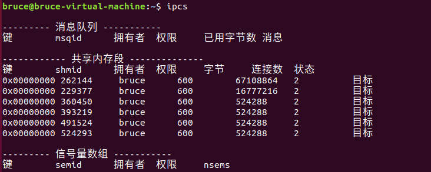

# P10_进程间通信之消息队列与共享内存

## IPC通信相关的命令

`ipcs` 命令是一个用于查看 Linux 系统中进程间通信 (IPC) 状态的工具。 它主要用来显示 **System V IPC 机制**的信息，这些机制包括：

1. **共享内存段 (Shared Memory Segments)**：允许多个进程访问同一块物理内存区域，是进程间高效共享数据的方式。
2. **消息队列 (Message Queues)**：允许进程以消息的形式进行异步通信，消息被存储在队列中，进程可以发送和接收消息。
3. **信号量集 (Semaphore Sets)**：用于控制多个进程对共享资源的并发访问，实现进程间的同步和互斥。

`ipcs` 命令主要用于查看 System V IPC 机制（共享内存、消息队列、信号量）的状态。 **它不显示信号和管道（包括匿名管道和命名管道）的信息。**



补充：**ipcs -q  ipcs -m  ipcs -s** 分别对应的显示消息队列，共享内存，信号量

要删除某个共享内存和消息队列的话，可以使用相应的命令

- 用法1： ipcrm  -M/-Q/-S key
  - 功能： **基于key值**删除IPC对象

- 用法2： ipcrm  -m/-q/-s id
  - 功能： **基于key值**删除IPC对象

## 内存映射

内存映射是一种**将文件或其他资源直接映射到进程虚拟地址空间**的技术。

Linux提供一个mmap机制，是一种内存映射文件的方法，实现这样的映射关系后，**进程就可以采用指针的方式读写操作这一段内存，而系统会自动回写到对应的文件磁盘上**，即完成了对文件的操作而不必再调用read、write等系统调用函数。相反，内核空间对这段区域的修改也直接反映用户空间，从而可以实现不同进程间的文件共享。效率高，操作简便。

**在Linux中，文件IO也能利用页缓存cache啊和使用了内存映射再利用页缓存cache的差异在哪里？ 页缓存cache不是都能加速访问吗？把可能访问到的数据存入内存**

文件IO和内存映射在Linux中虽然都利用cache来加速访问，但它们的工作方式和效率有一些重要差异：

1. 访问方式不同：
   - 传统文件IO (read/write系统调用)：**需要在用户空间和内核空间之间复制数据**
   - 内存映射(mmap)：**直接将文件映射到进程的地址空间，访问就像访问内存一样**
2. 系统调用开销：
   - 文件IO：每次读写都需要进行系统调用
   - 内存映射：映射建立后，访问不需要额外的系统调用
3. 数据复制：
   - 文件IO：从内核缓冲区复制到用户空间缓冲区
   - 内存映射：无需复制，**直接在页缓存上操作**
4. 页缓存使用：
   - 两者都使用Linux的页缓存(page cache)
   - **但内存映射是直接操作页缓存，而文件IO需要额外复制**
5. 适用场景：
   - 内存映射更适合：随机访问、多次读写、多进程共享同一文件
   - 文件IO更适合：顺序访问、一次性读写、小文件操作

虽然两者都利用了Linux的页缓存机制来加速访问，但内存映射通过消除用户空间和内核空间的数据复制以及减少系统调用，在某些场景下能提供更高的性能。当需要频繁、随机地访问大文件时，内存映射通常会更有效率。

### 总结

**也就是说文件IO利用cache之后，还是需要从内存中复制数据到用户空间中。 而内存映射利用cache之后，建立了用户空间与内存空间的映射关系，不需要复制，直接操作内存？**

两者的主要区别就在于数据的访问方式：

1. 传统文件IO (read/write)：
   - 文件数据会被加载到内核空间的**页缓存(page cache)**中
   - 当应用程序读取数据时，需要将数据从内核空间的页缓存复制到用户空间的缓冲区
   - 这个复制操作会导致额外的CPU和内存开销
2. 内存映射(mmap)：
   - 同样使用页缓存，但建立了页缓存与用户虚拟地址空间的直接映射关系
   - **应用程序可以直接通过指针访问映射区域，实际上直接操作的就是页缓存**
   - 避免了内核空间到用户空间的数据复制

这就是为什么在需要频繁访问文件数据时，尤其是随机访问场景下，内存映射通常会比传统文件IO更高效 - 它消除了数据复制的开销，并减少了系统调用的次数。

当然，两种方式各有适用场景，内存映射虽然减少了复制开销，但建立和维护映射关系也有一定的开销，所以对于小文件或一次性读取的情况，传统IO可能更简单高效。

### 计算机的IO结构层次重新梳理

**为了解决CPU与硬盘的速度不匹配问题，才引入内存。 后面为了解决硬盘与内存的速度不匹配问题，又引入了页缓存cache。 CPU与内存的速度不匹配问题，又引入了高速缓存cache。 这一些架构，并不是一开始就有的。是随着技术的发展而来**

这确实反映了计算机架构随着技术发展而不断演化的历史：

1. 内存引入：
   - 最初解决了CPU与硬盘速度不匹配的问题
   - 早期计算机直接从储存介质(磁带、卡片等)读取指令和数据
2. 页缓存引入：
   - 解决内存与硬盘速度差异问题
   - **在主内存中缓存常用的磁盘数据**
   - 由操作系统管理，是现代操作系统的核心组件
3. CPU高速缓存引入：
   - 解决CPU与内存速度不匹配问题
   - 随着CPU速度大幅提升而内存速度增长较慢，这个差距越来越明显("内存墙")
   - 先有L1缓存，后来随着技术发展和需求增加，又出现了L2、L3缓存

这些技术确实是随着计算机硬件技术发展而逐步演进的，每一项创新都是为了解决当时最突出的性能瓶颈。随着某一组件(如CPU)性能的突飞猛进，其他组件相对变慢，需要新的架构设计来平衡。

这种分层缓存架构仍在不断发展，比如近年来出现的非易失性内存(NVDIMM)技术，正在尝试弥合内存和存储之间的鸿沟，为未来计算机架构带来新的可能性。

### 两者的优劣势

**之前文件IO每一次操作文件都要系统调用，这总会从内存中（如果页缓存中有数据的话）复制一份到用户空间。这保护了内存中的数据。 使用内存映射之后，可以直接操作内存中页缓存的数据。如果都映射同一块空间的话，就变成所谓的共享内存了？ 我感觉传统文件IO反而保护的内存中的数据，因为每个进程拿到的都是一样的。不会数据混乱。**

**传统文件IO (read/write)**

- **数据复制机制**：确实是从内核空间的页缓存复制到各进程的用户空间
- **数据保护**：**每个进程获得的是数据的独立副本，进程对数据的修改不会直接影响其他进程或内核中的原始数据**
- **隔离性**：强，各进程操作自己的数据副本
- **一致性**：**需要显式地写回文件(write系统调用)才能同步更改**

**内存映射 (mmap)**

- **直接访问机制**：直接映射到页缓存的内容
- 共享模式：
  - MAP_SHARED：多个进程可以映射同一文件，形成共享内存，**一个进程的修改对其他进程可见**
  - MAP_PRIVATE：创建私有映射，修改不会影响原文件或其他进程
- **数据保护**：在共享模式下确实存在一定风险，**进程可能意外修改被其他进程正在使用的数据**
  - **后面可以加文件锁**

- **一致性**：**在MAP_SHARED模式下，修改直接应用于页缓存，对所有映射该文件的进程可见**

您的观察非常正确 - 传统IO通过复制提供了更强的隔离性，防止了数据混乱，特别是在多进程环境中。内存映射在提高性能的同时，确实引入了潜在的数据共享挑战，**需要更谨慎的并发控制**。

这就是为什么在多进程需要协同工作时，内存映射(MAP_SHARED模式)成为实现共享内存的常用技术，但同时也需要适当的同步机制(如信号量、互斥锁等)来协调访问，避免数据混乱。

## 内存映射相关系统调用介绍

### mmap:内存映射函数

函数原型: void *mmap(void* addr, size_t length, int prot, int flags,int fd, off_t offset);

函数功能:内存映射

头文件: #include <sys/mman.h>

形参:

- addr: 映射地址，如果非NULL，表示由用户指定最后的映射地址，**当为NULL时候表示由内核自动选择一个可用地址。一般情况下都传递NULL，由内核分配地址**

- length:映射的内存大小---单位字节

- prot:期望做的操作

  - PROT_EXEC映射区可被执行

  - PROT_READ映射区可被读取

  - PROT_WRITE映射区可被写入

  - PROT_NONE映射区不可访问

- flags:

  - MAP_SHARED：以共享方式进行映射，内存数据会同步到文件中。(**进程通信就必须使用这一个值**)
    - 如果需要共享修改，可以使用 MAP_SHARED 选项，**这样对映射区域的修改会直接影响到原文件和其他映射该文件的进程。**
  - MAP_PRIVATE：创建私有映射，修改不会影响原文件或其他进程
    - **即使跟传统文件IO一样需要复制但是还是快**
    - 初始访问更快（不需要先复制整个文件到缓冲区）
    - 内存访问更直接（可以像访问内存数组一样操作文件）
    - 系统调用更少（减少了 read/write 系统调用的开销）
    - 只有实际修改的页面才会被复制（粒度更细）

- fd:待映射文件的文件描述符

  - 在 `mmap` 系统调用时，你需要指定 **文件描述符 (file descriptor)**，而不是传递 `-1` (匿名映射)。  操作系统会将指定的文件映射到进程的虚拟地址空间。

- offset: 从文件的这个位置开始映射length字节到进程虚拟内存中。**一般情况在文件的0位置开始映射**。

返回值:

- **成功返回映射成功后的虚拟空间地址** 
- 失败：(void *) -1 或使用 MAP_FAILED


**使用*mmap，参数还是要拿到fd，还是要使用open()函数啊？* 区别在于后续如果想要再使用可以直接使用指针即可。但是如果是传统文件IO的话，还是要再次open对吗？**

使用 mmap() 时确实需要先通过 open() 获取文件描述符 fd，这一步与传统文件 I/O 相同。关键区别在于后续的操作方式：

1. mmap() 映射建立后：
   - **获得一个直接指向文件内容的内存指针**
   - 可以像操作内存一样直接通过指针访问/修改文件内容
   - 不需要重复调用 read()/write() 系统调用
   - **映射建立后，甚至可以关闭原始文件描述符（映射依然有效）**
2. 传统文件 I/O：
   - 每次需要读写文件时必须调用 read()/write() 系统调用
   - 如果关闭了文件，再次使用时必须重新 open()
   - 文件内容与程序内存是分离的，每次都需要在两者之间复制数据

**所以您总结得很到位：mmap 的主要优势是映射建立后，可以通过内存指针直接操作文件，而不需要重复进行系统调用或重新打开文件（假设映射仍然有效）。这在需要频繁访问文件或在不同部分之间跳转读写时特别有优势。**

### munmap----取消内存映射

函数原型: int munmap(void *addr, size_t length);

函数功能:取消内存映射

头文件: #include <sys/mman.h>

形参:

- addr: 取消虚拟地址首地址

- length:映射的内存大小---单位字节

### memcpy---数据复制

函数原型: void *memcpy(void *dest, const void *src, size_t n);

函数功能: 数据复制 从存储区src复制n个字节到存储区dest

头文件: #include <string.h>

形参:

- 从存储区src复制n个字节到存储区dest

- 返回值: 返回一个指向目标存储区 str1 的指针

### memset---往内存空间写数据  一般用于清零

函数原型: void *memset(void *s, int c, size_t n);

函数功能:向s指向的空间写入n个c

头文件: #include <string.h>

形参: 向s指向的空间写入n个c

### 内存映射编程示例

内存映射可以用于普通文件的读写操作，也可以用于进程间的通信，以下分别介绍这两种应用编程如何实现。

示例1：使用内存映射操作普通文件（把一个文件映射到进程空间中）

创建2.txt，文件大小为1024字节

**将整个文件映射到虚拟地址空间**

通过虚拟地址对文件进行写数据操作

C 代码示例 (mmap_file_write.c):

```c
#include <sys/mman.h>
#include <sys/types.h>
#include <sys/stat.h>
#include <fcntl.h>
#include <unistd.h>
#include <stdio.h>
#include <stdlib.h>
#include <string.h>
#include <errno.h>

#define FILE_NAME "2.txt"
#define FILE_SIZE 1024

int main() {
    int fd;
    char *map_addr;
    const char *data_to_write = "Hello, Memory Mapping!"; // 要写入的数据

    // 1. 打开或创建文件
    fd = open(FILE_NAME, O_RDWR | O_CREAT, 0666); // O_RDWR: 读写模式, O_CREAT: 文件不存在则创建, 0666: 读写权限
    if (fd == -1) {
        perror("open");
        exit(EXIT_FAILURE);
    }

    // 2. 设置文件大小为 1024 字节
    if (ftruncate(fd, FILE_SIZE) == -1) {
        perror("ftruncate");
        close(fd);
        exit(EXIT_FAILURE);
    }

    // 3. 将文件映射到虚拟地址空间
    map_addr = (char *)mmap(NULL, FILE_SIZE, PROT_READ | PROT_WRITE, MAP_SHARED, fd, 0);
    if (map_addr == MAP_FAILED) {
        perror("mmap");
        close(fd);
        exit(EXIT_FAILURE);
    }

    // 4. 通过映射地址写入数据
    if (memcpy(map_addr, data_to_write, strlen(data_to_write)) == NULL) {
        perror("memcpy");
        munmap(map_addr, FILE_SIZE); // 错误处理时需要先解除映射
        close(fd);
        exit(EXIT_FAILURE);
    }
    printf("Data '%s' written to mapped memory address.\n", data_to_write);


    //  **重要:**  虽然数据已经写入映射区，但可能还在页缓存中，尚未完全同步到磁盘。
    //  如果需要确保数据立即写入磁盘，可以调用 msync() 或 fsync()。
    //  在本示例中，为了简化，我们省略了显式同步，依赖内核后台的刷盘机制。


    // 5. 解除内存映射
    if (munmap(map_addr, FILE_SIZE) == -1) {
        perror("munmap");
        close(fd);
        exit(EXIT_FAILURE);
    }

    // 6. 关闭文件描述符
    if (close(fd) == -1) {
        perror("close");
        exit(EXIT_FAILURE);
    }

    printf("File '%s' successfully memory mapped, data written, and unmapped.\n", FILE_NAME);
    return 0;
}
```

## 内存映射是如何实现的？

核心思想： `MAP_SHARED` + 同一文件 (或共享资源)  ->  内核识别共享意图 ->  映射到同一块物理内存 (页缓存)

**详细步骤和机制：**

1. **`MAP_SHARED` 标志：**  当进程调用 `mmap` 时，传入 `MAP_SHARED` 标志，这明确地告诉 Linux 内核，该进程希望创建一个 **共享映射**。  这是实现进程间共享内存的**首要条件**。
2. **“同一文件” 的识别： 文件描述符 (fd) 和 inode:**
   - 多个进程需要通过 `open()` 系统调用打开 **同一个文件路径**，从而获得 **各自的文件描述符 (fd)，fd为进程级的**。  虽然 fd 的数值在不同进程中是不同的，但关键在于，**这些 fd 都指向文件系统上同一个文件的 inode (索引节点)**。
   - **内核不是通过文件描述符 fd 的数值来判断是否是“同一个文件”，  而是通过 fd 所指向的 inode。**  Inode 是文件在文件系统层面的唯一标识。
   - **重点：  只要 fd 指向 同一个 inode，  内核就认为它们操作的是“同一个文件”。**
3. **内核维护共享映射结构：基于 inode 的共享管理:**
   - 当 **第一个进程**  使用 `MAP_SHARED` 映射某个文件 (通过 fd 和 inode) 时，内核会创建一个 **共享映射数据结构**， 并将它与 **该文件的 inode** 关联起来。  **这个数据结构记录了共享映射的信息，包括映射的物理内存页 (页缓存)。**
     - **从文件的什么位置开始映射，映射了多少字节，物理内存的页缓存中映射了文件多少内容**
   - **后续的进程**  如果也使用 `MAP_SHARED` 映射 **指向 同一个 inode的文件描述符** 时， 内核会 **检测到已经存在与该 inode 关联的共享映射结构**。
   - **内核会重用已有的共享映射结构，  而 不是创建新的映射。** 这意味着， 内核会将 **新进程的虚拟地址空间**也关联到已有的共享映射结构以及它所指向的 **物理内存页 (页缓存)**。
     - **创建新的映射可能根据映射字节和文件起始位置再去硬盘中读取**
4. **页缓存 (Page Cache): 共享物理内存的实体:**
   - **共享映射最终映射到的 “同一块内存区域”，  实际上就是页缓存中分配的物理内存页。**
   - 当第一个进程创建共享映射时，内核会在页缓存中为文件数据分配页框。
   - 后续进程映射到 *同一个文件* 时， 它们最终都映射到 **同一个页缓存区**，  也就是相同的物理内存。

5. **虚拟地址不同， 物理内存相同： 实现共享:**

   - 虽然每个进程通过 `mmap` 获得的 **虚拟地址**  在各自的进程地址空间内是 **不同的** （局部变量的特性），  但由于它们都通过 `MAP_SHARED` 和指向 *同一 inode* 的 fd 进行映射， **内核确保了它们各自的虚拟地址最终都映射到 相同的物理内存区域 (页缓存)**。

   - 因此， 进程 A 通过其虚拟地址写入的数据，进程 B 可以通过其不同的虚拟地址， 但仍然映射到 **同一物理内存区域** 的地址读取到。  这样就实现了进程间的共享内存通信。

### 共享映射的深刻理解（重点）

**只要fd指向同一个文件，以及使用MAP_SHARED 方式映射。 那么映射参数中，比如映射的字节数和起始位置重叠的部分是可以共享的，而且修改都可见。 映射不重叠的部分就是专属于这个进程的？**

**核心结论：`MAP_SHARED` 方式下的 `mmap` 共享机制**

1. **必要条件：同一文件 + `MAP_SHARED`**
   - **同一文件 (Same File):**  这是共享的基础。  无论进程如何打开文件（不同的 `fd`，不同的路径，甚至不同的进程），只要它们最终操作的是 **同一个 inode 代表的文件**，共享的前提就成立。内核通过 inode 来识别文件是否是同一个。
   - **`MAP_SHARED` 标志:**  必须在 `mmap` 调用时指定 `MAP_SHARED` 标志。这是明确告知内核你想创建的是一个共享映射。
2. **共享区域：重叠部分**
   - **映射参数 (字节数和起始位置):**  当多个进程使用 `MAP_SHARED` 映射同一个文件时，它们可以指定不同的映射起始位置（偏移量 `offset`）和不同的映射大小 (`length`)。
   - 重叠区域 (Overlapping Regions):关键在于这些映射的区域在文件中是否存在重叠
     - **如果存在重叠:**  这些重叠的内存区域是 **共享的**。  一个进程对重叠区域的修改，**立即对所有其他映射了相同重叠区域的进程可见**。  这种可见性是通过内核的内存管理机制（例如页表同步和缓存一致性）来保证的。
     - **如果没有重叠:**  即使都映射了同一个文件，但是映射的区域在文件中 **完全不重叠**，那么这些区域之间 **不直接共享数据**。 进程 A 修改其映射区域，不会直接立即影响到进程 B 的映射区域（如果它们不重叠）。
3. **非重叠区域：进程专属，但不绝对独立**
   - "专属于这个进程的" (Belonging Exclusively to the Process):你说的 "映射不重叠的部分就是专属于这个进程的"  理解基本正确。  对于 不与其他进程映射区域重叠的部分：
     - **进程私有视角:** 从内存共享的角度来看，这部分映射的内存区域主要是这个进程自己操作，其他进程 **不会通过 `mmap` 共享机制直接看到** 对这部分区域的修改。
     - 并非完全隔离:但需要强调的是，即使是非重叠区域，它仍然是 文件的一部分。
       - **数据最终会写入文件:**  任何通过 `MAP_SHARED` 映射进行的修改，最终都会 **反映到磁盘上的原始文件** 中。
       - **后续进程可能读取到:**  如果另一个进程 **之后** 也映射了包含这部分区域的文件范围，或者直接读取文件，它将会 **看到之前进程的修改**，因为修改已经写回到了文件。

**举例强化理解**

假设文件 `data.txt` 内容为空。

- **进程 A:**
  - `mmap(..., offset=0, length=100, MAP_SHARED, ...)` 映射文件前 100 字节 (区域 1)。
  - 在 区域 1 的偏移量 20 处写入数据 "AAAA"。
- **进程 B:**
  - `mmap(..., offset=50, length=100, MAP_SHARED, ...)` 映射文件 50 字节开始的 100 字节 (区域 2)。
- **分析：**
  - **重叠区域:** 区域 1 (0-100) 和 区域 2 (50-150)  在文件中的 `50-100` 字节范围 **重叠**。
  - **共享效果:**  进程 A 在 区域 1 的偏移量 20 处写入 "AAAA"，实际上对应的是文件中的偏移量 20。由于区域 1 和区域 2 在 `50-100` 字节范围重叠， 并且区域 1 的 `50-100` 部分  和  区域 2 的 `50-100` 部分  都映射了文件中的  `50-100` 字节， 因此 **进程 B 通过区域 2 的映射窗口，可以看到 进程 A 在 `50-100` 重叠区域内的修改** (但看不到进程 A 在 `0-50` 范围内的修改，如果进程B的映射范围不包含 `0-50` 的话)。
  - **非重叠区域:** 区域 1 的 `0-50` 部分 和 区域 2 的 `100-150` 部分 是 **非重叠区域**。  进程 A 在区域 1 的 `0-50` 范围内的修改，**不会直接通过 `mmap` 共享机制  让进程 B 在区域 2 的 `100-150` 范围内看到**。  但是，所有修改最终都会写入 `data.txt` 文件。


### 私有映射的原理

**`MAP_PRIVATE`： 私有映射 - 独享与隔离**

当你在 `mmap` 系统调用中使用 `MAP_PRIVATE` 标志时， 你告诉内核你希望创建一个 **私有的、写时复制 (Copy-on-Write, COW) 的映射**。  即使多个进程映射到同一个文件， `MAP_PRIVATE` 的目标是保证每个进程都拥有 **独立、隔离** 的内存映射视图， 并且对映射区域的修改 **不会互相影响，也不会影响原始文件**。

**`MAP_PRIVATE` 的关键步骤和机制：**

1. **步骤相似，意图不同：**  如同 `MAP_SHARED`， 使用 `MAP_PRIVATE` 映射文件时， 也需要打开文件 (`open`) 并获取文件描述符 (`fd`)， 然后调用 `mmap(NULL, length, PROT_READ | PROT_WRITE, MAP_PRIVATE, fd, offset)`。  **关键的区别在于 `MAP_PRIVATE` 这个标志， 它向内核明确表达了 非共享的意图。**

2. **新建独立的映射结构：**  即使多个进程使用 `MAP_PRIVATE` 映射 **同一个文件 (通过指向同一 inode 的 fd)**，  内核也会为 **每个进程都创建一个全新、独立的映射结构**。 内核 **不会** 像 `MAP_SHARED` 那样去查找和重用已有的映射结构。  每个 `MAP_PRIVATE` 映射都是一个独立的实体。

3. **初始共享页缓存 (只读优化)：**  **在最初读取数据时，  `MAP_PRIVATE` 映射为了效率， 可能会暂时与其他 `MAP_PRIVATE` 映射 (或者与原始文件本身)  共享页缓存中的物理页。**  这意味着， 如果多个进程都 *只读* 访问 `MAP_PRIVATE` 映射区域， 它们可能会共享相同的页缓存页， 从而节省内存。

   **写时复制 (Copy-on-Write, COW)：隔离修改的关键**

   - **首次写入触发复制：**  当进程 **首次尝试 写入 `MAP_PRIVATE` 映射区域的 **某个页面时， **写时复制 (COW)** 机制就会被触发。
   - **内核创建私有副本：**  内核会为 **当前进程**  创建该页面的一个 **私有副本**。  这个副本会分配在 **进程私有的内存空间** 中。
   - **修改操作作用于副本：**  进程后续对 **该页面** 的 **所有写入操作**，  都会作用于这个 **私有副本**，  而 **不再会影响原始的页缓存页或原始文件**。
   - **其他进程不受影响：**  其他进程的 `MAP_PRIVATE` 映射仍然可能指向 **原始的页缓存页** (直到它们也尝试写入同一个页面，触发各自的 COW)。  每个进程都拥有自己的私有副本， 修改互不干扰。

4. **修改互不影响，不影响原文件：**  由于写时复制机制， 每个进程对 `MAP_PRIVATE` 映射区域的修改都只发生在 **各自的私有副本** 上。

   - **进程间修改隔离：**  进程 A 对其 `MAP_PRIVATE` 映射的修改， **完全不会影响进程 B 的 `MAP_PRIVATE` 映射**， 反之亦然。  每个进程都操作的是自己独立的内存区域。
   - **不影响原始文件：**  `MAP_PRIVATE` 映射区域的所有修改，  都 **不会同步回原始文件**。  无论进程对 `MAP_PRIVATE` 映射做了多少修改， 原始文件在磁盘上的内容始终保持不变。

**`MAP_SHARED` vs `MAP_PRIVATE` 的关键区别：**

| 特性           | `MAP_SHARED` (共享映射)      | `MAP_PRIVATE` (私有映射)        |
| -------------- | ---------------------------- | ------------------------------- |
| **共享性**     | 进程间共享修改可见           | 进程间修改完全隔离              |
| **修改影响**   | 修改同步回文件，进程间共享   | 修改不影响文件，进程私有        |
| **写操作**     | 直接修改页缓存，其他进程可见 | 写时复制，创建私有副本          |
| **进程间通信** | 常用于进程间共享内存通信     | 不用于进程间通信 (隔离性)       |
| **应用场景**   | 共享数据，进程协作           | 私有数据副本，隔离操作，COW优化 |

**`MAP_SHARED` 和 `MAP_PRIVATE` 的核心区别总结：**

**1. 映射目标和共享性：**

- **`MAP_SHARED` (共享映射):  直接映射到共享的页缓存。**  多个进程的 `MAP_SHARED` 映射都直接连接到**同一块页缓存区域 (相同的物理内存)**。  因此，对映射区域的修改是 **进程间共享的、互相可见的，并且会同步回原始文件**。  其核心目的是**实现进程间的数据共享和协作**。
- **`MAP_PRIVATE` (私有映射):  映射到进程私有的内存区域 (基于写时复制)。**  虽然初始读取时可能会利用现有的页缓存 (作为优化)， 但一旦进程尝试 **修改** 映射区域的某个页面，就会触发 **写时复制 (COW)**， 内核会为该进程 **创建私有的页缓存副本**， 并将该进程的映射关系指向这个 **私有副本**。  其他进程的 `MAP_PRIVATE` 映射不受影响， 仍然可能指向原始的页缓存页或它们自己的私有副本。 `MAP_PRIVATE` 的核心目的是 **实现进程数据的隔离和独享**。

**2.页缓存的角色：**

- **`MAP_SHARED`：页缓存是 共享的内存区域本身。**  **映射直接建立在页缓存之上， 所有操作直接操作页缓存。**
- **`MAP_PRIVATE`：页缓存是 初始数据来源 和 潜在的共享优化 (只读时)。**`MAP_PRIVATE` 初始可能从页缓存读取数据，  但在写入时会创建私有副本， 后续操作都在私有副本上进行， 与页缓存脱离关系。

### 总结

我们可以将 **页缓存 (Page Cache)**  想象成一个 **公共的“文件数据中转站”**，它位于内存中，用于缓存磁盘文件的内容，以提高 I/O 效率。 而 **内存映射** 就是在 **进程的地址空间** 和 **页缓存** 之间建立起一座 **“桥梁”**。

**共享映射 (`MAP_SHARED`)  ——  公共桥梁，直达页缓存**

- **桥梁类型：公共、直接通道**共享映射建立的 "桥梁" 是一座 **公共桥梁**，它 **直接连接到页缓存**。 就像一条公共通道，所有获得 "桥梁通行证" (成功进行 `mmap(MAP_SHARED)`) 的进程都可以通过这座桥梁 **直接访问页缓存中的文件数据**。
- **数据操作：直达页缓存，修改可见**  当一个进程通过共享映射的 "桥梁" 读取文件数据时，它实际上是从 **页缓存** 中读取数据。  当进程通过这座 "桥梁"  **修改数据** 时，**修改会直接作用于页缓存**。  由于页缓存是公共的，**其他任何也通过 *共享映射桥梁* 连接到 *同一文件* 的进程，都会立即 *看到这些修改* ** (从它们的映射区域读取时)。
- **进程隔离性：低**  由于共享映射直接操作公共的页缓存，多个进程实际上是 **直接共享同一份数据** (在页缓存中)。  进程之间的隔离性较低，一个进程的修改会直接影响到其他进程。
- **持久性与回写：最终写回磁盘**  通过共享映射对页缓存的修改，最终会 **回写到磁盘上的文件** (由操作系统在后台异步进行，或者通过 `msync` 等系统调用强制同步)。 这保证了数据的 **持久性**。
- **比喻总结：**  **共享映射就像在进程和页缓存之间建立了一条 公共、双向、直接的桥梁。  所有通过这座桥梁的进程，都像是在同一个大厅（页缓存）里操作同一个文件。  修改是实时的，共享的，最终会影响到磁盘上的原始文件。**

**私有映射 (`MAP_PRIVATE`)  ——  私有桥梁，页缓存副本**

- **桥梁类型：私有、通往副本**  私有映射建立的 "桥梁" 是一座 **进程私有的桥梁**。  它 **不是直接连接到公共的页缓存**，而是在 **页缓存的基础上，为每个进程创建一个 *私有的副本* ** (Copy-on-Write, COW)。 这座桥梁连接的是 **进程地址空间** 和 **页缓存的 *私有副本* **。
- **数据操作：操作副本，修改隔离**  当进程通过私有映射的 "桥梁"  **首次读取数据** 时，数据会从 **页缓存复制到进程私有的副本** 中。  后续进程通过这座 "桥梁"  **读取数据**，都是从 **私有副本** 中读取。  当进程通过这座 "桥梁"  **修改数据** 时，**修改只会作用于 *进程的私有副本* **，而 **不会影响到原始的页缓存**，更 **不会影响到磁盘上的文件**，以及 **其他进程的私有副本**。
- **进程隔离性：高**  由于私有映射操作的是 **进程私有的页缓存副本**，每个进程都拥有自己独立的数据副本，进程之间是 **完全隔离的**。  一个进程对私有映射区域的修改，不会被其他进程看到，也不会影响其他进程的操作。
- **持久性与回写：不回写磁盘**  默认情况下，通过私有映射对页缓存副本的修改，**不会回写到磁盘上的原始文件**。  私有映射主要用于 **只读访问文件** 或者 **在内存中私有地修改文件内容，而不需要将修改持久化到磁盘或与其他进程共享** 的场景。  (虽然某些情况下，私有映射的修改也可以通过特定方式同步回写，但这不是其主要用途和默认行为)。
- **写时复制 (Copy-on-Write, COW)：延迟复制，节省资源**  私有映射使用了 **写时复制 (Copy-on-Write, COW)**  技术。  **最初，私有映射并不立即复制整个页缓存，而是 \*共享\*  原始的页缓存页。  只有当进程 \*试图写入\* 私有映射区域的 \*某个页面\* 时，才会触发复制操作 (Copy-on-Write)。**  这时，操作系统会为该页面创建一个 **私有副本**，并将进程的写操作重定向到副本页面。  对于 **只读访问** 的页面，进程仍然共享原始的页缓存页，从而 **延迟复制，节省内存资源**。
- 比喻总结：  私有映射就像在进程和 页缓存的私有副本之间建立了一条 私有、单向（主要用于读取）、通往副本的桥梁。  每个通过这座桥梁的进程，都像是在操作 页缓存的一个独立副本。  修改是私有的，隔离的，不会影响原始页缓存或其他进程的副本，**通常也不会写回磁盘**。  写时复制机制就像是，只有当你想要 修改某个页面时，才会真正为你 复制一份副本，否则就一直 共享原始页面的只读视图，从而提高效率。

 **(共享映射 vs. 私有映射):**

| 特性               | 共享映射 (`MAP_SHARED`)                                  | 私有映射 (`MAP_PRIVATE`)                                     |
| ------------------ | -------------------------------------------------------- | ------------------------------------------------------------ |
| **桥梁类型**       | 公共桥梁，直达页缓存                                     | 私有桥梁，通往页缓存副本                                     |
| **数据操作对象**   | 页缓存 (Page Cache)                                      | 页缓存的进程私有副本 (Copy-on-Write)                         |
| **数据共享性**     | 多个进程共享同一份页缓存数据，修改互相可见               | 进程间数据完全隔离，每个进程拥有独立的副本                   |
| **进程隔离性**     | 低                                                       | 高                                                           |
| **数据持久性**     | 修改最终写回磁盘，数据持久                               | 默认不回写磁盘，修改进程私有，非持久 (通常)                  |
| **写时复制 (COW)** | 不使用                                                   | 使用 (延迟复制，节省资源)                                    |
| **适用场景**       | 进程间需要共享文件数据，协同工作，需要将修改持久化到磁盘 | 进程需要读取文件，或者需要私有地修改文件内容，不需要共享或持久化 |

## 匿名映射共享内存

使用匿名映射修改的数据不会回写硬盘。因为**匿名**代表不与任何硬盘文件建立关联。只是从内存中取出一块空间进行共享。

匿名映射共享内存，多个进程映射到同一块内存空间， **关键在于  `MAP_ANONYMOUS | MAP_SHARED`  参数组合 指示内核  创建共享内存， 并由内核负责协调和管理共享区域，  确保多个进程映射到同一块物理内存。**

`fd = -1` (或结合 `MAP_ANONYMOUS`)  只是指明是 *匿名映射*，  `MAP_SHARED`  才是 *共享语义*  的核心。

**需要共享内存的进程需要 协作，  都发出 类似的  `mmap` 请求 (使用相同的标志)，  内核会协调这些请求，  并提供共享的内存区域。**  并非简单地 “所有这么调用的进程都自动映射到同一块内存空间”。

**匿名共享映射 (`MAP_ANONYMOUS | MAP_SHARED`)**:  解除映射的进程自身不能再访问， *其他进程通常不能直接共享*这个映射，**其他进程 \*通常\* 不能直接访问：**  对于 **其他 \*不相关\* 的进程 (进程 B, C, ...)**，它们 *默认情况下*  **无法直接“找到”和访问** 进程 A  创建的这块匿名内存区域。  这是因为：

- **匿名性：**  匿名映射不与文件名或任何全局命名空间关联。  **进程 A  创建的这块匿名内存区域，没有一个全局可见的标识符可以让其他不相关的进程 “找到” 它**。  不像 System V 共享内存那样有键值 (key)，也不像 POSIX 共享内存那样有名字 (在 `/dev/shm` 下的文件名)。
- **进程地址空间隔离：**  每个进程都有自己独立的地址空间。 进程 A  的匿名映射区域位于进程 A  的地址空间内。 其他进程 B, C, ...  无法直接“穿透”进程地址空间的边界，访问进程 A  地址空间中的内存区域。

**父子进程 fork 前匿名共享映射：有效！**  父进程在 `fork()` 前创建匿名共享映射，子进程可以通过 *继承*  父进程的映射关系，使用 *相同的虚拟地址*  来共享这块内存。

**`fork()`  是关键：地址空间复制和写时复制机制**  `fork()`  的地址空间复制 (尤其是写时复制)  是实现父子进程匿名共享内存的基础。  它使得子进程能够 *继承*  父进程的映射，并 *共享* (至少在初始状态下)  同一块物理内存。

**虚拟地址是 “共同钥匙”：**  `mmap` 返回的虚拟地址成为父子进程访问共享内存的共同入口点。

**匿名映射 + `fork()`：经典 IPC 模式**  这种模式是构建多进程程序中**父子进程高效通信的常用手段**。

**“进程级别” 但父子共享是特例：**  匿名映射 *本质上是进程级别的*，一般难以被不相关进程访问。  但父子进程的 *继承关系*  构成了一个重要的 *例外*，使得匿名映射可以在父子进程之间实现高效共享。

## 内存映射的共享与匿名总结

- 共享映射就是所有进程直接操作内存中的页缓存文件数据（修改全局可见，可回写）。私有映射就是各进程操作内存中的页缓存文件数据的副本互不干扰（修改仅当前进程可见，通常不回写）。

- 匿名映射 *本质上是进程级别的*，一般难以被不相关进程访问。  但父子进程的 *继承关系*  构成了一个重要的 *例外*，使得匿名映射可以在父子进程之间实现高效共享。

## 共享内存（System V）

### 内存映射与共享内存的关系

Linux提供了多种实现共享内存的机制，其中最主要的包括：

1. **System V 共享内存:** 这是Unix System V标准定义的共享内存机制，使用 `shmget()`、`shmat()`、`shmdt()`、`shmctl()` 等系统调用来管理共享内存段。
   - `shmget()`: 创建或获取一个共享内存段。
   - `shmat()`: 将共享内存段连接到进程的地址空间。
   - `shmdt()`: 将共享内存段从进程的地址空间分离。
   - `shmctl()`: 控制共享内存段，例如删除。
   - **缺点:** System V 共享内存的管理相对复杂，并且需要使用键值来标识共享内存段，管理不当容易造成资源泄露。
2. **POSIX 共享内存 (基于文件映射的共享内存):**  POSIX标准定义了一种更现代的共享内存方式，它**基于内存映射**来实现。
   - 使用 `shm_open()` 创建或打开一个**特殊的文件对象** (在 `/dev/shm` 目录下)，这个文件对象实际上代表了共享内存区域。
   - 然后使用 `mmap()` 将这个文件对象映射到进程的地址空间。
   - 使用 `shm_unlink()` 删除共享内存对象。
   - **优点:**  管理更加简单，使用文件描述符和文件路径来标识共享内存，更符合Unix文件操作的习惯。**实际上，POSIX 共享内存的底层实现通常就是基于匿名共享内存映射 (`MAP_ANONYMOUS | MAP_SHARED`)。**  `/dev/shm` 目录下的文件并不是真正的磁盘文件，而是驻留在内存中的特殊文件。
3. **匿名共享内存映射 (`MAP_ANONYMOUS | MAP_SHARED`)：**  如前面所述，使用 `mmap()` 系统调用，并指定 `MAP_ANONYMOUS` 和 `MAP_SHARED` 标志，可以直接创建一块匿名共享内存区域。
   - **适用场景:**  通常用于**父子进程**或者**相关联的进程**之间共享内存。例如，父进程创建共享内存，然后 `fork()` 出子进程，子进程就可以直接继承父进程的共享内存映射。对于**不相关的进程**，匿名共享内存映射本身**不直接提供跨进程共享的机制**（除非结合文件描述符传递等额外手段，但这会变得复杂）。
   - **更常使用 POSIX 共享内存或 System V 共享内存来实现不相关进程间的共享。**

**核心关系:**  **内存映射是实现共享内存的一种重要且高效的方式。**

- **内存映射可以实现共享内存:**  特别是 **匿名共享内存映射 (`MAP_ANONYMOUS | MAP_SHARED`)** 和 **POSIX 共享内存 (基于文件映射，但底层通常也是匿名共享内存映射)**，都是通过内存映射技术来创建和管理进程间共享的内存区域的。

- **共享内存的概念更广泛:**  "共享内存" 是一个更通用的概念，指的是允许多个进程访问同一块内存区域的机制。而 "内存映射" 是一种实现这种机制的**技术手段**。  除了内存映射，可能还有其他理论上实现共享内存的方式（虽然在现代操作系统中，内存映射已经成为主流和高效的方式）。

- **POSIX 共享内存是内存映射的典型应用:**  **POSIX 共享内存机制实际上就是构建在内存映射之上的**。它使用 `shm_open` 创建一个类似文件的对象，但这个对象完全存在于内存中，然后使用 `mmap` 将其映射到进程地址空间，从而实现共享内存。

- **System V 共享内存与内存映射的区别:**  System V 共享内存是更早期的共享内存机制，它**不直接基于文件映射**。  System V 共享内存段是**由操作系统内核直接管理的**，进程通过 `shmat` 连接到共享内存段的地址空间。  虽然 System V 共享内存的实现细节可能也涉及到虚拟内存管理和页表操作，但它**在API层面与文件映射是分离的**。  **现代Linux系统中，即使是 System V 共享内存的底层实现，也可能会利用到类似内存映射的机制来管理物理内存和虚拟地址空间的关联。**

#### 总结

- **内存映射是实现共享内存的一种 主要 和 高效 的方式。**

- **匿名共享内存映射 (`MAP_ANONYMOUS | MAP_SHARED`)  是直接创建共享内存区域的关键技术。**

- **POSIX 共享内存机制 就是\基于内存映射来实现的，它是一种更方便、更符合Unix风格的共享内存接口。**

- **System V 共享内存是另一种独立的共享内存机制，虽然在概念上与内存映射有所不同，但在现代操作系统中，其底层实现也可能借鉴或利用了内存映射的一些思想和技术。**
- **System V 共享内存本身并不能直接实现基于文件的共享**，它与内存映射 (Memory Mapping) 在文件共享方面有着本质的区别

### system V的原理

system V IPC机制下的共享内存本质是由操作系统分配一块物理内存，允许多个进程直接访问。进程间需要共享的数据被放在该共享内存区域中，**所有需要访问该共享区域的进程都要把该共享区域映射到本进程的地址空间中去。**

进程对象对于共享内存的访问通过key（键）来控制，同时通过key进行访问权限的检查。

特点：

- 共享内存是进程间通信最快的方式。

- 共享内存**没有保护机制，需要信号量控制。**

- 共享内存的基本单位是页，即大小最小是4K，且是向上取整数页的。
- 共享内存的**生命周期是随内核的：如果创建了共享内存，只要系统运行，它就一直存在，除非你手动删除它或者系统重启内容会被删除。**

### 相关函数

#### ftok --- 创建关键字（可选？）

函数原型: key_t ftok(char * fname, int id);

函数功能:创建关键字

头文件:

- #include <sys/types.h> 

- #include <sys/ipc.h>

形参:

- fname---带路径的文件名

-  id----标识符 

返回值:

- 关键字---- fname id组合的

#### key的作用

`shmget` 的 `key` 参数既可以使用 `ftok` 函数创建，也可以直接使用你自定义的整数。  这两种方法都可以用来获取共享内存段的 ID，但是它们之间有一些重要的区别，以及适用场景上的不同。

**`shmget` 函数和 `key` 参数的核心作用**

`shmget` 函数是 Linux 系统中用于创建或访问共享内存段的系统调用。  它的主要作用是：

1. **创建新的共享内存段:**  如果指定的 `key` 对应的共享内存段不存在，并且 `shmflg` 参数中包含了 `IPC_CREAT` 标志，则 `shmget` 会创建一个新的共享内存段。
2. **访问已存在的共享内存段:** 如果指定的 `key` 对应的共享内存段已经存在，`shmget` 会返回该共享内存段的 ID，以便进程可以连接到该共享内存段并进行数据共享。

**`key` 参数就是用来标识和查找共享内存段的**。  系统通过 `key` 值来区分不同的共享内存段。  你可以把 `key` 理解为共享内存段的名字或者身份证号码。

**两种 `key` 的创建方式**

1. **使用 `ftok()` 函数创建 `key`**
   - **`ftok(const char \*pathname, int proj_id);` 函数:**  `ftok` 函数通常用于生成一个在系统中 **相对唯一** 的 `key` 值，以便多个 **相关的进程** 可以通过相同的 `key` 值来找到并共享同一个共享内存段。
   - **`ftok()` 的工作原理:**
     - `ftok` 函数接收两个参数：
       - `pathname`:  一个已存在的 **文件路径名**。 这个文件路径名必须是 **可访问的**。  `ftok` 函数会使用这个文件的 **inode 号** 和 **设备号** 作为生成 `key` 的种子。
       - `proj_id`:  一个 **项目 ID**，通常是一个 8 位的整数 (0-255)。 这个参数可以用来进一步区分不同的项目，即使它们使用了相同的文件路径名。
     - `ftok` 函数会根据 `pathname` 和 `proj_id`，通过一定的算法（通常是结合 inode 号、设备号和 `proj_id` 进行位运算），生成一个 `key_t` 类型的 `key` 值。
   - **使用 `ftok()` 的优点:**
     - **相对唯一性:**  使用 `ftok` 可以生成一个在 **同一系统内** 相对唯一的 `key` 值。 只要你确保不同的项目使用不同的 `pathname` 或 `proj_id`，就可以降低 `key` 值冲突的可能性。
     - **方便进程组共享:**  使用相同 `pathname` 和 `proj_id` 的 `ftok` 调用会生成相同的 `key` 值。 这使得 **一组相关的进程** (例如，属于同一个应用程序的不同组件) 可以**很容易地约定好一个共享的 `key` 值，并以此来共享内存。**
   - **使用 `ftok()` 的缺点:**
     - **依赖文件系统:** `ftok` 的工作依赖于文件系统。 **你需要提供一个有效的文件路径名。 如果文件被删除或者文件系统发生变化，可能会影响 `key` 值的生成。**
     - **并非绝对唯一:**  `ftok` 并非保证绝对的全局唯一性。 在非常复杂的系统环境下，仍然有可能出现 `key` 冲突的情况，尤其是在不同的、不相关的程序之间。  虽然概率较低，但理论上是存在的。
     - **可预测性:**  由于 `key` 是基于文件属性和 `proj_id` 生成的，如果攻击者能够猜测到你使用的 `pathname` 和 `proj_id`，理论上可以预测出 `key` 值，从而可能非法访问共享内存段。  当然，实际攻击难度较高。
   - **重要提示:**  你需要确保 `SHM_FILE` ("shm_file" 在这个例子中) 文件是存在的，并且进程有权限访问它。 你可以手动创建一个空文件，例如 `touch shm_file`。
2. **直接使用自定义整数作为 `key`**
   - **直接使用整数:** 你可以直接使用一个整数值 (通常是 `key_t` 类型，本质上通常是 `long int` 或 `int`) 作为 `shmget` 的 `key` 参数。  例如，`key = 12345;` 或者 `key = 0x12345678;`
   - **使用自定义整数的优点:**
     - **简单直接:**  **使用起来非常简单，不需要依赖文件系统，也不需要调用额外的函数。**
     - **可控性强:**  你可以完全自定义 `key` 的值，更容易在程序中硬编码或者通过配置文件来管理 `key` 值。
   - **使用自定义整数的缺点:**
     - **容易冲突:**  如果你直接使用一个简单的整数， **很容易与其他不相关的程序使用的 `key` 值冲突**。  这意味着，如果另一个程序也使用了相同的整数 `key` 值，并且尝试创建或访问共享内存，可能会意外地连接到你创建的共享内存段，或者反之，你的程序可能会连接到其他程序创建的共享内存段，导致数据混乱或安全问题。
     - **缺乏命名空间隔离:**  使用整数 `key` 时，所有进程都在同一个全局的 IPC 命名空间中竞争 `key` 值。 容易发生意外的互相干扰。
   - **使用自定义整数的适用场景:**
     - **小型、隔离的应用:**  在一些小型、测试性的应用，或者在 **高度隔离的环境** (例如，嵌入式系统，或者容器内部)，如果你能 **非常确定** 不会与其他程序发生 `key` 冲突，可以使用自定义整数 `key`。
     - **进程间通信紧密耦合:**  在某些情况下，如果一组进程 **非常紧密地耦合在一起**，例如，同一个父进程 `fork` 出来的子进程，或者使用 `exec` 启动的相关进程，并且它们之间 **约定好了固定的 `key` 值**， 并且你 **完全控制这些进程的部署和运行环境**， 可以考虑使用自定义整数。  但这仍然需要谨慎。

#### shmget-----创建共享内存

```c
#include <sys/ipc.h>
#include <sys/shm.h>

int shmget(key_t key, size_t size, int shmflg);
```

**参数**：

- key：共享内存段的键值。这是一个 key_t类型的值，用于标识共享内存段。
  - 可以使用 `ftok` 函数从路径名生成一个 `key_t` 值。例如 `key = ftok("/tmp/myshmfile", 'a');`。
  - 也可以使用 `IPC_PRIVATE` 宏作为 `key`，表示创建一个私有的共享内存段，通常与 `fork` 子进程一起使用。
  - 还可以使用固定的数值作为 `key`，例如 `key = 1234;`，但需要确保键值的唯一性，避免与其他共享内存段冲突。
- `size`：新建的共享内存大小，以字节为单位 以页为单位  一页4096
- shmflg：标志参数，用于指定创建共享内存段的权限和行为。可以使用以下标志进行组合（使用 | 运算符）：
  - `IPC_CREAT`：如果指定的 `key` 对应的共享内存段不存在，则创建新的共享内存段。如果已存在，则打开已有的共享内存段。
  - `IPC_EXCL`：与 `IPC_CREAT` 一起使用。如果指定的 `key` 对应的共享内存段已存在，则 `shmget` 调用失败。这可以防止意外地打开已有的共享内存段。
  - 权限标志：用于设置共享内存段的访问权限，类似于文件权限。例如 0666 表示所有用户都可读写。常用的权限标志包括：
    - `S_IRUSR`：属主读权限
    - `S_IWUSR`：属主写权限
    - `S_IRGRP`：属组读权限
    - `S_IWGRP`：属组写权限
    - `S_IROTH`：其他用户读权限
    - `S_IWOTH`：其他用户写权限

**返回值**：

- 成功：返回新创建或已存在共享内存段的 ID （非负整数）。这个 ID 是后续操作共享内存段的关键。
- 失败：返回 -1，并设置 errno错误代码。常见的错误代码包括：
  - `EACCES`：权限不足。
  - `EEXIST`：使用了 `IPC_CREAT | IPC_EXCL`，但指定的 `key` 对应的共享内存段已存在。
  - `EINVAL`：无效的参数，例如 `size` 小于 0 或超过系统限制。
  - `ENOMEM`：系统内存不足，无法创建共享内存段。
  - `ENOENT`：使用了 `IPC_CREAT` 但 `key` 对应的共享内存段不存在，并且也没有使用 `IPC_CREAT` 标志。

#### **`shmat` 函数**：将共享内存段连接到进程的地址空间

```c
#include <sys/types.h>
#include <sys/shm.h>

void *shmat(int shmid, const void *shmaddr, int shmflg);
```

**参数**：

- `shmid`：共享内存段的 ID，由 `shmget` 函数返回。
- shmaddr：指定共享内存段连接到进程地址空间的起始地址。
  - 如果 `shmaddr` 为 `NULL`，则由系统自动选择一个合适的地址。这是推荐的做法。
  - 如果 `shmaddr` 不为 `NULL`，则表示用户希望将共享内存段连接到指定的地址。但这通常不推荐，因为可能与进程已使用的地址空间冲突。
- shmflg：标志参数，用于指定连接的方式和权限。可以使用以下标志：
  - `SHM_RDONLY`：以只读方式连接共享内存段。如果没有指定此标志，则以读写方式连接。

**返回值**：

- 成功：返回共享内存段在进程地址空间中的起始地址（`void *` 类型）。进程可以通过这个地址来访问共享内存。
- 失败：返回 (void *) -1，并设置 errno错误代码。常见的错误代码包括：
  - `EINVAL`：无效的 `shmid` 或 `shmaddr`。
  - `EACCES`：权限不足，无法以指定的模式连接共享内存段。
  - `ENOMEM`：系统内存不足。

#### **`shmdt` 函数**：进程和共享内存断开链接

```c
#include <sys/types.h>
#include <sys/shm.h>

int shmdt(const void *shmaddr);
```

- **参数**：
  - `shmaddr`：共享内存段在进程地址空间中的起始地址，由 `shmat` 函数返回。
- **返回值**：
  - 成功：返回 0。
  - 失败：返回 -1，并设置 errno错误代码。常见的错误代码包括：
    - `EINVAL`：无效的 `shmaddr`。

**注意**：`shmdt` 只是将共享内存段从进程的地址空间分离，并不会删除共享内存段本身。其他进程仍然可以访问该共享内存段，直到它被显式地删除。

#### **`shmctl` 函数**：控制共享内存段，例如删除共享内存段、获取共享内存段的信息等

```c
#include <sys/ipc.h>
#include <sys/shm.h>

int shmctl(int shmid, int cmd, struct shmid_ds *buf);
```

- **参数**：
  - `shmid`：共享内存段的 ID，由 `shmget` 函数返回。
  - cmd：控制命令，指定要执行的操作。常用的命令包括：
    - `IPC_STAT`：获取共享内存段的当前状态，并将状态信息存储到 `buf` 指向的 `struct shmid_ds` 结构体中。
    - `IPC_SET`：设置共享内存段的某些属性，例如用户 ID、组 ID、权限等。新的属性值从 `buf` 指向的 `struct shmid_ds` 结构体中获取。只有超级用户或共享内存段的属主或属组才能执行此命令。
    - `IPC_RMID`：标记共享内存段为删除。当所有连接到该共享内存段的进程都分离后，系统会自动删除该共享内存段。只有超级用户或共享内存段的属主或属组才能执行此命令。
  - buf：一个指向 struct shmid_ds 结构体的指针。根据 cmd参数的不同，buf的作用也不同：
    - `cmd` 为 `IPC_STAT` 时，用于接收共享内存段的状态信息。
    - `cmd` 为 `IPC_SET` 时，用于提供新的属性值。
    - `cmd` 为 `IPC_RMID` 时，`buf` 通常为 `NULL`。
- **返回值**：
  - 成功：返回 0。
  - 失败：返回 -1，并设置 errno错误代码。常见的错误代码包括：
    - `EINVAL`：无效的 `shmid` 或 `cmd`。
    - `EPERM`：权限不足，无法执行指定的命令。

**`struct shmid_ds` 结构体**

`struct shmid_ds` 结构体用于描述共享内存段的状态信息。它通常包含以下字段（具体定义可能因系统而异）：

```c
struct shmid_ds {
    struct ipc_perm shm_perm;    // 权限信息
    size_t          shm_segsz;   // 共享内存段的大小（字节）
    time_t          shm_atime;   // 上次连接到进程的时间
    time_t          shm_dtime;   // 上次分离进程的时间
    time_t          shm_ctime;   // 创建时间
    __pid_t         shm_cpid;    // 创建进程的 PID
    __pid_t         shm_lpid;    // 上次连接或分离进程的 PID
    shmatt_t        shm_nattch;  // 当前连接到该共享内存段的进程数量
    ...
};
```

其中 `struct ipc_perm` 结构体又包含更详细的权限信息，例如属主 ID、属组 ID、权限位等。

### 使用 System V 共享内存的示例代码 (C 语言)

`writer.c` (写数据进程)

```c
#include <stdio.h>
#include <stdlib.h>
#include <string.h>
#include <sys/ipc.h>
#include <sys/shm.h>
#include <unistd.h>

#define SHM_KEY 1234
#define SHM_SIZE 1024

int main() {
    int shmid;
    char *shm_ptr;
    char message[] = "Hello from writer process!";

    // 1. 创建共享内存段
    shmid = shmget(SHM_KEY, SHM_SIZE, IPC_CREAT | 0666);
    if (shmid == -1) {
        perror("shmget failed");
        exit(1);
    }
    printf("Shared memory created, shmid = %d\n", shmid);

    // 2. 连接共享内存段到进程地址空间
    shm_ptr = (char *)shmat(shmid, NULL, 0);
    if (shm_ptr == (void *) -1) {
        perror("shmat failed");
        exit(1);
    }
    printf("Shared memory attached at address %p\n", shm_ptr);

    // 3. 向共享内存写入数据
    strcpy(shm_ptr, message);
    printf("Message written to shared memory: %s\n", message);

    printf("Writer process finished.\n");
    pause(); // 保持进程运行，等待 reader 进程读取数据

    // 4. 分离共享内存段 (可选，但通常在进程结束前执行)
    if (shmdt(shm_ptr) == -1) {
        perror("shmdt failed");
        exit(1);
    }
    printf("Shared memory detached.\n");

    // 5. 删除共享内存段 (可选，根据需求决定何时删除)
    // 可以由 writer 或 reader 进程在合适的时机删除
    // shmctl(shmid, IPC_RMID, NULL);
    // printf("Shared memory removed.\n");

    return 0;
}
```

`reader.c` (读数据进程)

```c
#include <stdio.h>
#include <stdlib.h>
#include <string.h>
#include <sys/ipc.h>
#include <sys/shm.h>
#include <unistd.h>

#define SHM_KEY 1234
#define SHM_SIZE 1024

int main() {
    int shmid;
    char *shm_ptr;
    char buffer[SHM_SIZE];

    // 1. 获取已存在的共享内存段
    shmid = shmget(SHM_KEY, SHM_SIZE, 0); // 注意这里没有 IPC_CREAT 标志
    if (shmid == -1) {
        perror("shmget failed");
        exit(1);
    }
    printf("Shared memory found, shmid = %d\n", shmid);

    // 2. 连接共享内存段到进程地址空间
    shm_ptr = (char *)shmat(shmid, NULL, SHM_RDONLY); // 只读方式连接
    if (shm_ptr == (void *) -1) {
        perror("shmat failed");
        exit(1);
    }
    printf("Shared memory attached at address %p (read-only)\n", shm_ptr);

    // 3. 从共享内存读取数据
    strcpy(buffer, shm_ptr);
    printf("Message read from shared memory: %s\n", buffer);

    // 4. 分离共享内存段
    if (shmdt(shm_ptr) == -1) {
        perror("shmdt failed");
        exit(1);
    }
    printf("Shared memory detached.\n");

    // 5. 删除共享内存段 (可选，例如由 reader 进程在读取完成后删除)
    shmctl(shmid, IPC_RMID, NULL);
    printf("Shared memory removed.\n");

    printf("Reader process finished.\n");
    return 0;
}
```

**保持 `writer` 进程存活：**  `pause()` 函数会让进程进入睡眠状态，直到进程接收到信号才会恢复运行。在示例代码中，我们 **没有显式地发送任何信号给 `writer` 进程**。这意味着 `writer` 进程在执行到 `pause()` 函数时会 **一直阻塞（睡眠）**，不会自动结束。

**方便观察共享内存：**  `writer` 进程在创建共享内存、写入数据后，如果立即结束，共享内存段可能很快被标记为删除（如果没有任何进程连接）。为了让我们能够 **手动启动 `reader` 进程去读取数据**，并 **观察到数据共享的过程**，以及 **验证共享内存的持久性** (即使 `writer` 进程已经完成写入并处于暂停状态，共享内存依然存在)，使用 `pause()` 让 `writer` 进程暂停是非常方便的。

**模拟更真实的场景 (简化版)：** 在一些更复杂的场景中，可能会有一个 **长期运行的 "生产者" 进程 (类似这里的 `writer`)**，持续地向共享内存写入数据，而 **"消费者" 进程 (类似这里的 `reader`)** 则在需要的时候读取数据。 `pause()` 在这里可以看作是 **模拟了 `writer` 进程完成一次写入操作后，进入等待下一次写入的 "空闲" 状态**，虽然实际应用中不会直接使用 `pause()`，但其目的类似。

### 共享内存使用步骤

- // ftok创建key ---- 不是必选项

- shmget创建共享共建

- shmat  启动共享内存

- 内存读写数据操作

- shmdt / shmctl 删除

#### 使用共享内存实现进程通信

​	有亲缘关系进程间通信

​	父亲进程写数据，子进程接收数据（操作流程如下）

​	主进程使用 shmget 创建共享内存

父进程：

​	使用shmat 关联共享内存

​	strncpy数据进共享内存

​	wait等待子进程结束并清理

​	删除共享内存

子进程：

​	延时确保父进程有时间写入

​	使用shmat 关联共享内存

​	子进程读取共享内存数据

```c
#include <stdio.h>
#include <stdlib.h>
#include <string.h>
#include <sys/types.h>
#include <sys/stat.h>
#include <unistd.h>
#include <fcntl.h>
#include <sys/wait.h>
#include <signal.h>
#include <sys/mman.h>
#include <sys/shm.h>
#include <sys/ipc.h> 

int main(int argc,const char *argv[])
{
		pid_t pid;
		int shmid=shmget(IPC_PRIVATE, 4096,S_IRUSR|S_IWUSR);
		pid = fork();
		if (pid > 0)
		{
			char* addr=shmat(shmid, NULL,0);
			strncpy(addr,"hello",5);
			wait(NULL);
			shmctl(shmid, IPC_RMID,NULL);
		}
		else if (pid == 0)
		{
			sleep(3);//确保父进程有时间写完
			char* addr = shmat(shmid, NULL, 0);
			printf("addr=%s\r\n",addr);
		}
		return 0;
}
```

### 内存映射和共享内存比较

| 特性         | 内存映射 (mmap)                                              | System V 共享内存 (shmget)                                   |
| ------------ | ------------------------------------------------------------ | ------------------------------------------------------------ |
| **主要目的** | 文件I/O优化、进程间共享内存（次要）、多种用途                | 专为进程间数据共享设计                                       |
| **关联对象** | 通常与文件或设备关联（也支持匿名映射）                       | 独立于文件系统                                               |
| **系统调用** | `mmap()`, `munmap()`                                         | `shmget()`, `shmat()`, `shmdt()`, `shmctl()`                 |
| **IPC键值**  | 无（文件描述符或地址）                                       | 有（IPC Key，用于进程间识别）                                |
| **权限控制** | 基于文件权限（文件映射）或创建进程的权限（匿名映射）         | 基于 System V IPC 权限模型                                   |
| **生命周期** | 文件映射的生命周期与文件和进程相关，匿名映射与进程相关       | 独立于创建进程，需显式删除 ( `shmctl(IPC_RMID)` )            |
| **持久性**   | 文件映射取决于文件，匿名映射通常非持久（除非使用交换空间）   | 通常非持久，存在于内存中，重启后丢失                         |
| **复杂性**   | 相对简单，特别是匿名映射                                     | 相对复杂，需要管理IPC Key，权限和生命周期                    |
| **使用场景** | 文件I/O密集型应用、简单进程间共享                            | 高性能进程间通信、复杂系统、需要精细控制的共享内存管理       |
| **性能**     | **文件映射可能因缺页中断带来延迟（首次访问），后续访问速度快** | 访问速度快，专为共享内存优化                                 |
| **同步机制** | 需要进程自行实现同步机制（例如，互斥锁、信号量、条件变量等） | 需要进程自行实现同步机制（例如，互斥锁、信号量、条件变量等） |
| **资源释放** | 文件描述符关闭，进程退出时自动释放映射，映射结构还在页缓存中，其他进程可以复用重叠的部分 | 需要显式删除 ( `shmctl(IPC_RMID)` )，否则可能成为僵尸共享内存段 |

## 消息队列（System V）

### 消息队列的特点

1. 消息队列是基于fifo(先进先出)的一种通信，但是**必须读写两端都打开才可能通信**，消息队列可以先把数据存放到内存中，需要时候再取出。
   1. **跟命名管道的读端和写端都需要被进程正确 "打开" 并连接起来，才能进行有效的同步和数据传输。**
2. 消息队列上传消息之后，除非消息被接收或消息被删除，否则消息不会消失。
3. 每个消息都有自己的一个消息编号
4. 消息队列可以顺序取出，还可以按照类型顺序取出。

### 消息队列执行的步骤

- 第一步：进程先打开消息队列----（如果消息队列不存在--那么可以创建）--创建消息队列

- 第二步：进程往消息队列里面，上传消息或读消息 ，实现通信—发送函数API 接收函数API

- 第三步：进程通信结束，删除队列

### 消息队列相关函数

#### `msgget()` 函数

**功能:**  `msgget()` 函数用于创建一个新的消息队列，或者访问一个已经存在的消息队列。

**函数原型:**

```c
#include <sys/types.h>
#include <sys/ipc.h>
#include <sys/msg.h>

int msgget(key_t key, int msgflg);
```

**参数:**

- key:  key_t类型，消息队列的键值。它是消息队列的标识符。
  - 可以是 `IPC_PRIVATE` (通常为 `0`)：用于创建一个私有的消息队列。这种队列只能由创建它的进程及其子进程访问。
  - 也可以是一个由 `ftok()` 函数生成的或用户自定义的 `key_t` 值。 相同 `key` 值的不同进程可以访问同一个消息队列。  使用自定义键值时，需要确保不同进程使用相同的键值来访问同一个队列。
- msgflg:  int类型，标志位，用于指定创建或访问消息队列的方式和权限。它可以是以下标志的按位或：
  - `IPC_CREAT`:  如果消息队列不存在，则创建它。如果消息队列已经存在，则返回已存在的队列的标识符。
  - `IPC_EXCL`: 与 `IPC_CREAT` 一起使用。如果消息队列已经存在，则 `msgget()` 失败并返回错误 `EEXIST`。这确保了操作是创建一个新的队列，而不是访问已有的。
  - 权限标志 (如 0666):  用于设置消息队列的访问权限。这些权限位与文件权限类似，分别代表所有者、所属组和其他用户的读、写权限。常用的权限模式包括：
    - `0600`:  仅创建者有读写权限。
    - `0666`:  所有用户都有读写权限。
    - `0644`:  创建者有读写权限，所属组和其他用户只有读权限。

**返回值:**

- 成功时，返回一个非负整数，表示新创建或已存在消息队列的消息队列标识符 (msqid)。
- 失败时，返回 -1，并设置 errno来指示错误类型。常见的错误包括：
  - `EACCES`:  权限被拒绝，无法访问已存在的消息队列。
  - `EEXIST`:  `IPC_CREAT` 和 `IPC_EXCL` 同时指定，但消息队列已经存在。
  - `ENOSPC`:  系统消息队列资源耗尽。
  - `ENOMEM`:  系统内存不足。
  - `ENOENT`:  消息队列不存在，且 `IPC_CREAT` 没有被指定。

```c
#include <stdio.h>
#include <sys/ipc.h>
#include <sys/msg.h>
#include <stdlib.h>
#include <errno.h>

int main() {
    key_t key;
    int msqid;

    // 使用ftok生成key
    key = ftok(".", 'm');
    if (key == -1) {
        perror("ftok");
        exit(EXIT_FAILURE);
    }

    // 创建消息队列，如果已存在则返回已存在的队列ID，权限设置为0666
    msqid = msgget(key, IPC_CREAT | 0666);
    if (msqid == -1) {
        perror("msgget");
        exit(EXIT_FAILURE);
    }

    printf("消息队列创建成功，msqid = %d\n", msqid);

    return 0;
}
```

#### `msgsnd()` 函数

**功能:**  `msgsnd()` 函数用于向消息队列发送一条消息。

**函数原型:**

```c
#include <sys/types.h>
#include <sys/ipc.h>
#include <sys/msg.h>

int msgsnd(int msqid, const void *msgp, size_t msgsz, int msgflg);
```

**参数:**

- `msqid`:  `int` 类型，消息队列标识符，由 `msgget()` 函数返回。

- msgp:  const void *类型，指向要发送的消息的指针。

  - **重要:** `msgp` 指向的结构体必须以一个 `long int` 类型的成员开始，这个成员表示消息的类型 (message type)。消息类型必须是一个大于 0 的整数。消息类型可以被接收进程用来选择性地接收特定类型的消息。

- 消息结构体的定义通常如下所示：

  - ```c
    struct msgbuf {
        long mtype;       /* 消息类型, 必须大于 0 */
        char mtext[1];    /* 消息数据 (实际使用时根据需要定义大小) */
    };
    ```

- `msgsz`:  `size_t` 类型，表示要发送的消息数据的大小 (以字节为单位)，**不包括** `mtype` 成员的大小。

- msgflg:  int类型，标志位，用于控制发送操作的行为。常见的标志包括：

  - `IPC_NOWAIT`:  非阻塞发送。如果消息队列已满，或者系统资源不足以立即发送消息，`msgsnd()` 将立即返回 `EAGAIN` 错误，而不会阻塞调用进程。 如果不指定此标志，**默认是阻塞发送，即进程会阻塞直到消息可以被发送。**

**返回值:**

- 成功时，返回 0。
- 失败时，返回 -1，并设置 errno来指示错误类型。常见的错误包括：
  - `EAGAIN`:  `IPC_NOWAIT` 被指定，但消息队列已满，无法立即发送消息。
  - `EACCES`:  没有向消息队列发送消息的权限。
  - `EIDRM`:  消息队列已被移除。
  - `EINTR`:  发送消息的过程中被信号中断。
  - `EINVAL`:  `msqid` 无效，或者 `msgsz` 小于 0 或大于系统限制。
  - `ENOMEM`:  系统内存不足，无法复制消息到消息队列。

```c
#include <stdio.h>
#include <stdlib.h>
#include <string.h>
#include <sys/ipc.h>
#include <sys/msg.h>
#include <errno.h>

#define MAX_TEXT 512

struct msgbuf {
    long mtype;
    char mtext[MAX_TEXT];
};

int main() {
    key_t key;
    int msqid;
    struct msgbuf sndbuf;
    size_t msgsz;

    key = ftok(".", 'm');
    if (key == -1) {
        perror("ftok");
        exit(EXIT_FAILURE);
    }

    msqid = msgget(key, 0666 | IPC_CREAT);
    if (msqid == -1) {
        perror("msgget");
        exit(EXIT_FAILURE);
    }

    sndbuf.mtype = 1; // 设置消息类型为 1
    strcpy(sndbuf.mtext, "这是一条测试消息");
    msgsz = strlen(sndbuf.mtext) + 1; // +1 for null terminator

    if (msgsnd(msqid, &sndbuf, msgsz, IPC_NOWAIT) == -1) {
        perror("msgsnd");
        exit(EXIT_FAILURE);
    }

    printf("消息已发送: %s\n", sndbuf.mtext);

    return 0;
}
```

#### `msgrcv()` 函数

**功能:**  `msgrcv()` 函数用于从消息队列接收一条消息。

**函数原型:**

```c
#include <sys/types.h>
#include <sys/ipc.h>
#include <sys/msg.h>

ssize_t msgrcv(int msqid, void *msgp, size_t msgsz, long msgtyp, int msgflg);
```

**参数:**

- `msqid`:  `int` 类型，消息队列标识符，由 `msgget()` 函数返回。
- msgp:  void *类型，指向接收消息的缓冲区指针。
  - **重要:**  与 `msgsnd()` 类似，`msgp` 指向的结构体也必须以 `long int mtype` 成员开始。 接收到的消息类型会被写入这个成员。 消息数据会紧随其后写入。
- `msgsz`:  `size_t` 类型，表示接收缓冲区 `msgp` 所能容纳的最大消息数据大小 (以字节为单位)，不包括 `mtype` 成员的大小。 如果实际接收到的消息数据大小超过 `msgsz`，则行为取决于 `msgflg` 中的 `MSG_NOERROR` 标志。
- msgtyp:  long int类型，指定要接收的消息类型。
  - `msgtyp = 0`:  接收队列中的**第一个**消息，无论消息类型是什么。
  - `msgtyp > 0`:  接收消息类型为 `msgtyp` 的**第一个**消息。
  - `msgtyp < 0`:  接收消息类型**小于或等于** `msgtyp` 绝对值的**类型值最小**的消息。 例如，如果 `msgtyp = -2`，则会接收类型为 1 或 2 的消息中类型值最小的那个 (优先接收类型为 1 的消息)。
- msgflg:  int类型，标志位，用于控制接收操作的行为。常见的标志包括：
  - `IPC_NOWAIT`:  非阻塞接收。如果消息队列中没有指定类型的消息，`msgrcv()` 将立即返回 `ENOMSG` 错误，而不会阻塞调用进程。 如果不指定此标志，默认是阻塞接收，即进程会阻塞直到接收到指定类型的消息。
  - `MSG_NOERROR`:  如果接收到的消息数据大小超过 `msgsz`，则将消息截断为 `msgsz` 字节，并成功返回，不会设置错误。 默认情况下，如果消息过大，`msgrcv()` 会失败并返回 `E2BIG` 错误。

**返回值:**

- 成功时，返回实际接收到的消息数据大小 (以字节为单位)，不包括 `mtype` 成员的大小。
- 失败时，返回 -1，并设置 errno来指示错误类型。常见的错误包括：
  - `E2BIG`:  接收到的消息数据大小超过了 `msgsz`，且 `MSG_NOERROR` 没有被指定。
  - `EACCES`:  没有从消息队列接收消息的权限。
  - `EIDRM`:  消息队列已被移除。
  - `EINTR`:  接收消息的过程中被信号中断。
  - `EINVAL`:  `msqid` 无效，或者 `msgsz` 小于 0。
  - `ENOMSG`:  `IPC_NOWAIT` 被指定，但消息队列中没有指定类型的消息可以接收。

```c
#include <stdio.h>
#include <stdlib.h>
#include <string.h>
#include <sys/ipc.h>
#include <sys/msg.h>
#include <errno.h>

#define MAX_TEXT 512

struct msgbuf {
    long mtype;
    char mtext[MAX_TEXT];
};

int main() {
    key_t key;
    int msqid;
    struct msgbuf rcvbuf;
    long msgtype = 0; // 接收类型为 0 的消息，即队列中的第一个消息

    key = ftok(".", 'm');
    if (key == -1) {
        perror("ftok");
        exit(EXIT_FAILURE);
    }

    msqid = msgget(key, 0666 | IPC_CREAT);
    if (msqid == -1) {
        perror("msgget");
        exit(EXIT_FAILURE);
    }

    // 接收消息
    if (msgrcv(msqid, &rcvbuf, MAX_TEXT, msgtype, 0) == -1) {
        perror("msgrcv");
        exit(EXIT_FAILURE);
    }

    printf("接收到的消息类型: %ld\n", rcvbuf.mtype);
    printf("接收到的消息内容: %s\n", rcvbuf.mtext);

    return 0;
}
```

#### `msgctl()` 函数

**功能:**  `msgctl()` 函数用于控制消息队列，执行各种管理操作，例如获取消息队列的状态信息、设置消息队列的属性、删除消息队列等。

**函数原型:**

```c
#include <sys/types.h>
#include <sys/ipc.h>
#include <sys/msg.h>

int msgctl(int msqid, int cmd, struct msqid_ds *buf);
```

**参数:**

- `msqid`:  `int` 类型，消息队列标识符，由 `msgget()` 函数返回。

- cmd:  int类型，控制命令，指定要执行的操作。常见的命令包括：

  - `IPC_STAT`:  获取消息队列的当前状态信息。 将状态信息写入到 `buf` 指向的 `msqid_ds` 结构体中。
  - `IPC_SET`:  设置消息队列的属性。  允许修改 `buf` 指向的 `msqid_ds` 结构体中的 `msg_perm.uid`, `msg_perm.gid`, 和 `msg_qbytes` 成员的值，以设置消息队列的属主、属组和最大队列长度 (以字节为单位)。 调用进程必须是消息队列的属主或超级用户。
  - `IPC_RMID`:  立即删除消息队列。  队列中的所有消息都会被丢弃，队列资源会被释放。 调用进程必须是消息队列的创建者或超级用户。

- buf:  struct msqid_ds *类型，一个指向 msqid_ds结构体的指针。

  - 当 `cmd` 为 `IPC_STAT` 时，`buf` 用于接收消息队列的状态信息。
  - 当 `cmd` 为 `IPC_SET` 时，`buf` 用于设置消息队列的新属性。  只有 `msg_perm.uid`, `msg_perm.gid`, 和 `msg_qbytes` 字段会被使用。
  - 当 `cmd` 为 `IPC_RMID` 时，`buf` 通常被设置为 `NULL` (忽略)。

- `msqid_ds` 结构体:

  - ```c
    struct msqid_ds {
        struct ipc_perm msg_perm;     // 消息队列的操作权限结构体
        time_t          msg_stime;    // 最后一次发送消息的时间
        time_t          msg_rtime;    // 最后一次接收消息的时间
        time_t          msg_ctime;    // 最后一次修改消息队列的时间 (创建或使用 IPC_SET, IPC_RMID 修改)
        unsigned long   __msg_cbytes; // 队列中消息的当前总字节数 (非标准，Linux 特有)
        msgqnum_t       msg_qnum;     // 队列中当前的消息数量
        msglen_t        msg_qbytes;   // 队列的最大字节数限制 (可由 IPC_SET 修改)
        pid_t           msg_lspid;    // 最后一次发送消息的进程 PID
        pid_t           msg_lrpid;    // 最后一次接收消息的进程 PID
    };
    ```

- **返回值:**

  - 成功时，返回 0。
  - 失败时，返回 -1，并设置 errno来指示错误类型。常见的错误包括：
    - `EACCES` 或 `EPERM`:  权限不足，无法执行指定的操作。
    - `EIDRM`:  消息队列已被移除。
    - `EINVAL`:  `msqid` 无效，或者 `cmd` 无效。
    - `EFAULT`:  `buf` 指针指向无效的内存地址。

```c
#include <stdio.h>
#include <stdlib.h>
#include <sys/ipc.h>
#include <sys/msg.h>
#include <errno.h>

int main() {
    key_t key;
    int msqid;

    key = ftok(".", 'm');
    if (key == -1) {
        perror("ftok");
        exit(EXIT_FAILURE);
    }

    msqid = msgget(key, 0666 | IPC_CREAT);
    if (msqid == -1) {
        perror("msgget");
        exit(EXIT_FAILURE);
    }

    // 删除消息队列
    if (msgctl(msqid, IPC_RMID, 0) == -1) {
        perror("msgctl - IPC_RMID");
        exit(EXIT_FAILURE);
    }

    printf("消息队列已删除，msqid = %d\n", msqid);

    return 0;
}
```

### 示例

`sender.c` (发送者程序):

```c
#include <stdio.h>
#include <stdlib.h>
#include <string.h>
#include <sys/ipc.h>
#include <sys/msg.h>
#include <errno.h>

#define MSG_FILE "msg_queue_example.temp" // 用于 ftok 的文件，需要存在
#define MSG_ID 123                     // 用于 ftok 的 ID
#define MSG_TYPE 1                      // 消息类型

#define MAX_TEXT 512

struct msgbuf {
    long mtype;
    char mtext[MAX_TEXT];
};

int main() {
    key_t key;
    int msqid;
    struct msgbuf sndbuf;
    size_t msgsz;

    // 1. 生成 Key
    key = ftok(MSG_FILE, MSG_ID);
    if (key == -1) {
        perror("ftok");
        exit(EXIT_FAILURE);
    }

    // 2. 获取消息队列 ID
    msqid = msgget(key, 0666 | IPC_CREAT); // 创建队列，如果已存在则打开
    if (msqid == -1) {
        perror("msgget");
        exit(EXIT_FAILURE);
    }

    // 3. 准备要发送的消息
    sndbuf.mtype = MSG_TYPE;
    strcpy(sndbuf.mtext, "你好，接收者！这是一条来自发送者的消息。");
    msgsz = strlen(sndbuf.mtext) + 1;

    // 4. 发送消息
    if (msgsnd(msqid, &sndbuf, msgsz, IPC_NOWAIT) == -1) {
        perror("msgsnd");
        exit(EXIT_FAILURE);
    }

    printf("发送者: 消息已发送到消息队列，msqid = %d，类型 = %ld，内容 = '%s'\n",
           msqid, sndbuf.mtype, sndbuf.mtext);

    return 0;
}
```

`receiver.c` (接收者程序):

```c
#include <stdio.h>
#include <stdlib.h>
#include <string.h>
#include <sys/ipc.h>
#include <sys/msg.h>
#include <errno.h>

#define MSG_FILE "msg_queue_example.temp" // 用于 ftok 的文件，需要与发送者一致
#define MSG_ID 123                     // 用于 ftok 的 ID，需要与发送者一致
#define MSG_TYPE 1                      // 消息类型，需要与发送者发送的类型一致

#define MAX_TEXT 512

struct msgbuf {
    long mtype;
    char mtext[MAX_TEXT];
};

int main() {
    key_t key;
    int msqid;
    struct msgbuf rcvbuf;
    long msgtype = MSG_TYPE; // 接收指定类型的消息

    // 1. 生成 Key (与发送者使用相同的 Key)
    key = ftok(MSG_FILE, MSG_ID);
    if (key == -1) {
        perror("ftok");
        exit(EXIT_FAILURE);
    }

    // 2. 获取消息队列 ID (不需要 IPC_CREAT，因为希望队列已存在)
    msqid = msgget(key, 0666);
    if (msqid == -1) {
        perror("msgget");
        exit(EXIT_FAILURE);
    }

    printf("接收者: 尝试接收消息，消息队列 msqid = %d, 类型 = %ld...\n", msqid, msgtype);

    // 3. 接收消息
    if (msgrcv(msqid, &rcvbuf, MAX_TEXT, msgtype, 0) == -1) {
        perror("msgrcv");
        exit(EXIT_FAILURE);
    }

    printf("接收者: 接收到消息! 类型 = %ld, 内容 = '%s'\n", rcvbuf.mtype, rcvbuf.mtext);

    // 4. 删除消息队列 (可选，根据需要决定是否删除)
    if (msgctl(msqid, IPC_RMID, 0) == -1) {
        perror("msgctl - IPC_RMID");
        exit(EXIT_FAILURE);
    }

    printf("接收者: 消息队列已删除，msqid = %d\n", msqid);

    return 0;
}
```

**编译和运行步骤：**

1. **创建 `MSG_FILE` 指定的文件:**  在你的工作目录下创建一个空文件，文件名与 `MSG_FILE` 宏定义一致，例如 `msg_queue_example.temp`。  这个文件只需要存在即可，内容不重要。

2. ```
   touch msg_queue_example.temp
   ```

3. **先运行 `receiver` 程序**，让它等待接收消息。程序会阻塞在 `msgrcv()` 函数调用处，等待消息到达。

4. **在另一个终端窗口中运行 `sender` 程序**，发送消息。

**代码解释:**

- **`#define` 宏定义:**
  - `MSG_FILE`, `MSG_ID`:  用于 `ftok()` 函数生成唯一的 Key。  发送者和接收者必须使用相同的这两个宏定义值才能访问同一个消息队列。
  - `MSG_TYPE`:  定义了消息的类型。  发送者发送的消息类型是 `1`，接收者也指定接收类型为 `1` 的消息。
  - `MAX_TEXT`:  定义了消息文本的最大长度。
- **`struct msgbuf`:**  定义了消息缓冲区结构体。 必须以 `long mtype` 开头，后面是实际的消息数据 `mtext`。
- **`sender.c`:**
  - 使用 `ftok()` 基于 `MSG_FILE` 和 `MSG_ID` 生成 Key。
  - 使用 `msgget()` 创建或打开消息队列，权限设置为 `0666`，并使用 `IPC_CREAT` 标志，表示如果队列不存在则创建它。
  - 填充 `sndbuf` 结构体，设置消息类型 `mtype` 为 `MSG_TYPE`，复制消息文本到 `mtext`。
  - 使用 `msgsnd()` 发送消息到消息队列，`IPC_NOWAIT` 标志表示非阻塞发送（如果队列满立即返回错误，这里为了简化示例使用了非阻塞，实际应用中可能需要根据情况选择阻塞或非阻塞）。
  - 打印发送成功的消息。
- **`receiver.c`:**
  - 使用相同的 `ftok()` 参数生成与发送者相同的 Key。
  - 使用 `msgget()` 获取消息队列 ID，**不使用 `IPC_CREAT` 标志**，因为期望消息队列已经由发送者或之前的运行创建。
  - 使用 `msgrcv()` 接收消息。 `msgtype` 设置为 `MSG_TYPE`，表示只接收类型为 `1` 的消息。  如果设置为 `0`，则接收队列中的第一个消息，无论类型是什么。  `0` 标志表示阻塞接收，即如果没有指定类型的消息，程序会一直等待，直到接收到消息。
  - 打印接收到的消息类型和内容。
  - 使用 `msgctl()` 和 `IPC_RMID` 命令删除消息队列。 这通常在接收者处理完消息后进行，以清理系统资源。  注意，如果接收者程序没有成功运行到删除队列的代码，或者被意外终止，消息队列可能仍然存在，需要手动删除（可以使用 `ipcrm -q <msqid>` 命令，需要先使用 `ipcs -q` 找到 `msqid`）。
  - 打印消息队列删除成功的消息。

**注意事项:**

- **Key 的一致性:**  `ftok()` 函数的使用和 `MSG_FILE`、`MSG_ID` 宏定义确保了发送者和接收者程序使用相同的 Key，从而访问同一个消息队列。 确保这两个程序中使用相同的宏定义值。
- **错误处理:**  示例代码包含了基本的错误检查，实际应用中应该进行更完善的错误处理，例如检查 `errno` 的具体值并进行相应的处理。
- **消息类型:**  消息类型 `mtype` 是消息队列非常重要的特性，允许接收者选择性地接收特定类型的消息。  在这个例子中，我们使用了 `MSG_TYPE` 为 `1`，发送者和接收者都针对这个类型进行操作。
- **消息队列的持久性:**  System V 消息队列是内核持久的，即使创建队列的进程结束，队列仍然存在，直到被显式删除或系统重启。 这意味着如果接收者程序没有成功删除队列，下次运行时可能需要先手动删除旧的队列，或者修改程序逻辑来处理已存在的队列。
- **文件 `msg_queue_example.temp`:**  `ftok()` 函数需要一个已存在的文件路径作为参数来生成 Key。  这个文件本身的内容并不重要，只需要确保文件存在，并且发送者和接收者程序都使用相同的文件路径。

## 进程间通信的两套API接口

| 特性             | System V IPC                                        | POSIX IPC                                         |
| ---------------- | --------------------------------------------------- | ------------------------------------------------- |
| **起源**         | System V UNIX                                       | POSIX 标准                                        |
| **API 设计**     | 相对简单，历史悠久                                  | 更现代化，更灵活，更强大                          |
| **对象标识**     | 整数键值 (Key-based)                                | 路径名 (Pathname-based) 或描述符                  |
| **命名空间**     | 全局键值命名空间，可能存在冲突                      | 文件系统路径名命名空间，更清晰，避免冲突          |
| **持久性**       | 内核持久化                                          | 可选择持久化或非持久化                            |
| **消息队列功能** | 基本的消息队列功能                                  | 功能更丰富，支持优先级，异步通知等                |
| **信号量功能**   | 计数信号量，功能较基础                              | 提供命名和未命名信号量，功能更强大                |
| **共享内存**     | 基于 `shmget`, `shmat` 等 API                       | 基于文件映射和 `mmap` API                         |
| **可移植性**     | 早期 Unix 系统，可移植性相对较差                    | 更好的跨 Unix-like 系统可移植性                   |
| **现代性**       | 相对过时，新的开发通常倾向于 POSIX IPC              | 更现代，更符合现代 Unix 编程风格，更常用于新开发  |
| **适用场景**     | 遗留系统，简单 IPC 需求，对性能有较高要求的共享内存 | 新开发，更复杂的同步和通信需求，多线程/多进程应用 |

## 三者区别

**内存映射、System V 共享内存和消息队列的对比表格**

| 特性             | 内存映射 (Memory Mapping)                 | System V 共享内存 (Shared Memory)    | System V 消息队列 (Message Queue) |
| ---------------- | ----------------------------------------- | ------------------------------------ | --------------------------------- |
| **数据共享方式** | 直接内存映射                              | 共享内存段                           | 消息队列 (基于消息的传递)         |
| **数据结构**     | 灵活，任何数据结构                        | 灵活，任何数据结构                   | 结构化消息 (消息类型 + 数据)      |
| **性能**         | 非常高                                    | 高                                   | 相对较低                          |
| **同步机制**     | 需要额外的同步机制 (如互斥锁、信号量)     | 通常需要额外的同步机制 (如信号量)    | 内置同步 (接收操作阻塞直到有消息) |
| **持久性**       | 可持久 (若映射文件) 或非持久 (若匿名映射) | 持久 (除非显式删除或系统重启)        | 持久 (除非显式删除或系统重启)     |
| **生命周期**     | 随映射关系存在而存在                      | 独立于创建进程的生命周期             | 独立于创建进程的生命周期          |
| **地址空间**     | 共享相同的物理内存页                      | 共享独立的物理内存段                 | 消息队列存在于内核空间            |
| **使用场景**     | 大量数据共享，文件 I/O，高性能 IPC        | 进程间共享数据，需要持久化的共享内存 | 进程间传递结构化消息，异步通信    |
| **设置复杂度**   | 相对简单                                  | 稍复杂                               | 相对简单                          |
| **内核参与度**   | 较低 (主要在建立映射时)                   | 较高 (内存段管理，权限控制)          | 较高 (消息排队，消息传递，同步)   |

**数据共享方式:**

- **内存映射:**  将文件或匿名内存区域直接映射到多个进程的地址空间。进程可以直接读写映射区域，数据共享是通过直接访问内存完成的，效率非常高。
- **System V 共享内存:**  内核创建一个独立的共享内存段，多个进程可以将该内存段映射到自己的地址空间。数据共享也是通过直接访问共享内存段完成的。
- **System V 消息队列:**  数据以消息的形式在进程之间传递。发送进程将消息放入消息队列，接收进程从消息队列中取出消息。数据共享是通过消息的复制和传递完成的。

**数据结构:**

- **内存映射和 System V 共享内存:** 由于是直接的内存区域，你可以将任何数据结构 (例如：数组、结构体、对象等) 放在共享内存中，非常灵活。
- **System V 消息队列:**  消息队列传递的是结构化的消息，每个消息通常包含一个消息类型 (用于消息过滤) 和实际的数据部分。结构相对固定。

**性能:**

- **内存映射:**  性能最高，因为数据共享是通过直接内存访问实现的，避免了数据复制，内核参与度低。
- **System V 共享内存:**  性能也很高，仅次于内存映射。虽然需要内核管理共享内存段，但数据访问仍然是直接内存访问。
- **System V 消息队列:**  性能相对较低，因为消息的发送和接收需要内核进行数据复制和队列管理，内核参与度较高。

**同步机制:**

- **内存映射和 System V 共享内存:**  自身不提供同步机制。如果多个进程同时访问共享内存，需要开发者自行使用额外的同步机制，例如互斥锁 (mutex)、信号量 (semaphore) 等来保证数据的一致性和避免竞态条件。
- **System V 消息队列:**  提供了内置的同步机制。当进程尝试从空队列接收消息时，`msgrcv` 系统调用会默认阻塞进程，直到队列中有新的消息到达。这可以简化某些同步场景的编程。

**持久性:**

- **内存映射:**  如果映射的是文件，则数据是持久的 (因为文件本身是持久的)。如果使用匿名映射 (`MAP_ANONYMOUS` 或 `MAP_PRIVATE|MAP_ANONYMOUS`)，则数据是非持久的，只存在于内存中。
- **System V 共享内存和消息队列:**  都是持久的。即使创建共享内存段或消息队列的进程终止，它们仍然存在于系统中，直到被显式删除 (使用 `ipcrm` 命令或相应的系统调用) 或者系统重启。

**生命周期:**

- **内存映射:**  内存映射的生命周期取决于映射关系的存在。当所有进程解除映射，或者映射的文件被删除，内存映射关系也就结束了。
- **System V 共享内存和消息队列:**  它们的生命周期独立于创建它们的进程。即使创建进程终止，共享内存段和消息队列仍然存在。这允许进程在不同的时间点创建并访问共享资源。

**地址空间:**

- **内存映射和 System V 共享内存:**  进程将共享内存区域映射到自己的用户地址空间。多个进程共享相同的物理内存页 (内存映射) 或物理内存段 (共享内存)。
- **System V 消息队列:**  消息队列本身存在于内核空间，进程通过系统调用与内核中的消息队列进行交互。

**使用场景:**

- **内存映射:**  适用于需要共享大量数据，或者需要进行高性能 I/O 操作的场景，例如大型数据库、多媒体处理等。也常用于实现零拷贝的文件传输。
- **System V 共享内存:**  适用于进程间需要共享数据，并且共享数据需要在进程结束后仍然存在的场景。常用于服务器程序、缓存系统等。
- **System V 消息队列:**  适用于进程间需要传递结构化消息，或者需要进行异步通信的场景。常用于进程间命令传递、事件通知、任务分发等。

**设置复杂度:**

- **内存映射和 System V 消息队列:**  设置和使用相对简单。
- **System V 共享内存:**  设置稍复杂一些，需要获取共享内存段的键值，创建和附加共享内存段，以及处理权限等问题。

**内核参与度:**

- **内存映射:**  内核主要在建立内存映射关系时参与，后续的数据访问几乎完全由硬件完成，内核参与度较低。
- **System V 共享内存和消息队列:**  内核参与度较高。内核负责共享内存段和消息队列的管理、权限控制、以及消息的排队和传递等操作。
