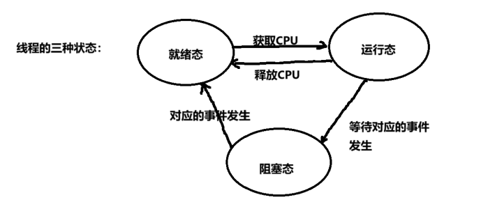

# P13_多线程

## 线程介绍

进程：是操作系统（OS）进行**资源**（CPU、内存、磁盘、IO、带宽等）**分配的最小单位**；

- 是OS对正在运行的程序的一种抽象，是应用程序的**执行**实例;

- 每个进程是由私有的虚拟地址空间、代码、数据和其它各种系统资源组成。不同进程具有不同地址空间，堆、栈、数据等都是独立；进程切换开销大，但是资源隔离比较好从而不需要做过多保护，程序实现比较简单。

- 比如：打开一个浏览器、一个聊天窗口分别是一个进程。

- **进程可以有多个子任务，如聊天工具接收消息、发送消息，这些子任务是线程**。

线程：是**CPU调度和分配的基本单位**，也称为轻量级进程（轻进程），它出现就是**为了解决进程切换系统开销比较大的问题。**

- 一个进程可由多个线程组成，每个线程都运行在同一进程的上下文中，共享同样的代码和全局数据。

- 每个进程至少有一个主线程-main，它**无需由用户主动创建，一般由系统自动创建**。

- 系统创建好进程后，实际上就启动了主线程，**执行主线程以函数地址形式，即程序入口函数（如 main函数），将程序的启动点提供给操作系统。** 

- 主执行线程终止了，进程也就随之终止。

注意：

1. **单CPU**中进程只能是并发，**多CPU**计算机中进程可以并行。

2. **单CPU单核**中线程只能并发，**单CPU多核**中线程可以并行。

**在同一进程下，每个线程都有自己独立的ID,一般用tid表示。**

### 线程的状态



- 线程也有三种状态：就绪态  运行态  阻塞态

  - 同一个进程里面的多线程它们都是同时执行的。

  - 线程它是有自己的线程库的，编译的-pthread 

### 共享什么？

**Linux中，同一个进程可以有许多线程，共享同一个进程资源。  默认会创建一个主线程，也就是main。  但是各线程的是独立的吧？  main中的资源共享吗？还是main外的变量共享？还是都不共享？**

**进程（Process）**

- 进程是操作系统进行资源分配和调度的基本单位。
- 每个进程都有自己独立的地址空间、内存空间、文件描述符等资源。
- **进程之间相互独立，一个进程崩溃通常不会影响其他进程。**

**线程（Thread）**

- 线程是进程中执行的最小单元，也被称为轻量级进程。
- 线程存在于进程之中，一个进程可以包含一个或多个线程。
- 同一个进程中的所有线程共享该进程的资源，例如：
  - **进程的地址空间**：所有线程都可以访问进程的同一块内存区域。
  - **打开的文件描述符**：线程可以共享同一个进程打开的文件。
  - **全局变量和静态变量**：这些变量存储在进程的数据段，所有线程都可以访问和修改。
  - **进程的当前工作目录、用户 ID 和组 ID** 等。

**主线程 (main thread)**

- 当一个程序启动时，操作系统会为其创建一个进程，并且在这个进程中默认创建一个线程，这个线程就是主线程，通常也称为 `main` 线程，因为程序的 `main()` 函数就是在这个线程中开始执行的。
- **主线程并没有什么特殊的地位**，它与其他线程一样，都共享进程的资源。  它仅仅是进程启动时第一个被创建的线程，程序执行的入口点。

**线程的独立性**

虽然线程共享进程的资源，但它们在以下方面是独立的：

- **线程 ID (TID)**：每个线程都有自己唯一的线程 ID，用于在进程内区分不同的线程。
- **栈 (Stack)**：每个线程拥有独立的栈空间，用于存储局部变量、函数调用信息等。这是线程能够独立执行的关键。
- **程序计数器 (PC)**：每个线程都有自己的程序计数器，记录当前线程执行到的指令位置。
- **寄存器集合**：每个线程有自己独立的寄存器集合，用于保存线程执行过程中的上下文信息。
- **线程局部存储 (Thread-local storage, TLS)**：某些特殊情况下，线程可能需要一些线程私有的数据，可以使用 TLS 来实现线程局部变量。

**全局变量和静态变量** (声明在 `main` 函数 **之外**)：

- 这些变量存储在进程的数据段或 BSS 段（未初始化的全局变量和静态变量）。
- **同一个进程的所有线程都共享这些变量**。这意味着，如果一个线程修改了全局变量或静态变量的值，其他线程立即可以看到修改后的值。

**局部变量** (声明在 `main` 函数 **内部** 或其他函数内部)：

- 局部变量存储在**线程的栈**空间中。
- **每个线程的栈是独立的，所以局部变量通常是线程私有的，不被其他线程直接共享。**

**静态局部变量** (声明在函数内部，但使用 `static` 关键字修饰)：

- 虽然声明在函数内部，但 `static` 关键字使得它的生命周期贯穿整个程序运行期间，存储位置通常在数据段。
- **对于同一个进程内的多个线程来说，静态局部变量是共享的**。  但是其作用域仍然限制在声明它的函数内部（或文件内部，如果是在全局作用域声明为 `static`）。
- **注意**：静态局部变量的使用场景相对较少，需要谨慎考虑其线程安全问题。

#### **总结**

- **同一个进程中的线程共享进程的资源，例如地址空间、全局变量、静态变量、文件描述符等。**
- **每个线程拥有独立的栈空间，用于存储局部变量，因此局部变量通常是线程私有的。**
- **主线程 (`main` 线程) 与其他线程一样，共享进程资源，并没有特殊的资源隔离。**
- **"main中的资源"（局部变量）通常不共享，"main外的变量"（全局变量、静态变量）是共享的。**

**线程安全**

由于线程共享进程的资源，特别是全局变量和静态变量，因此在多线程编程中需要特别注意 **线程安全** 问题。  **多个线程同时访问和修改共享资源可能会导致数据竞争和程序错误**。 为了保证线程安全，通常需要使用同步机制，例如：

- **互斥锁 (Mutex)**：保护临界区，确保同一时间只有一个线程可以访问共享资源。
- **条件变量 (Condition Variable)**：用于线程间的同步和通信。
- **信号量 (Semaphore)**：控制对共享资源的访问数量。
- **原子操作 (Atomic Operations)**：对一些简单的共享变量操作保证原子性。

### 线程创建的Linux实现

在 Linux 中，用户态线程通常是由 **pthread (POSIX Threads)** 库实现的。  `pthread` 库提供了一组 API，允许用户在用户空间创建和管理线程，而无需直接涉及内核线程的实现细节。

**Linux中，pthread库可以创建用户态线程。进程默认会创建主线程，那么他们的执行顺序有优先级吗？**

Linux中，pthread创建的用户态线程和进程主线程在默认情况下没有固定的优先级差异，它们由内核调度器以相对公平的方式进行调度。 线程的实际执行顺序受到多种因素的影响，包括调度算法、nice值、实时调度策略、系统负载和线程自身的行为。  **不应该依赖线程的优先级来保证程序的正确性，而应该使用线程同步机制来显式地控制并发程序的行为。**

- 在大多数用户态应用程序中，使用默认的调度策略和nice值即可。
- 只有在对时间有严格要求的特殊应用场景下，才考虑使用实时调度策略，并需要充分评估其影响和风险。
- **始终优先使用线程同步机制来保证多线程程序的正确性，而不是依赖不确定的线程执行顺序。**

## 相关API

### `pthread_self` - 获取线程自身ID

函数原型:

```c
pthread_t pthread_self(void);
```

**功能:**  返回调用线程自身的线程ID。

**参数:**

- 无参数。

**返回值:**

- 返回调用线程的 `pthread_t` 线程ID。

### `pthread_create` - 创建新线程

函数原型:

```
int pthread_create(pthread_t *thread, const pthread_attr_t *attr,
                   void *(*start_routine) (void *), void *arg);
```

**功能:**  创建一个新的线程。

**参数:**

- `pthread_t *thread`:  **输出参数**，指向 `pthread_t` 类型变量的指针。用于存储新创建线程的线程ID。`pthread_t` 类型在Linux中通常是一个无符号长整型，用于唯一标识一个线程。
- `const pthread_attr_t *attr`: 输入参数，指向 `pthread_attr_t`类型结构体的指针，用于设置线程的属性。如果为 `NULL`，则使用默认属性。线程属性可以控制线程的调度策略、堆栈大小、分离状态等。
  - 常用的属性设置函数包括：
    - `pthread_attr_init(pthread_attr_t *attr)`: 初始化线程属性对象。
    - `pthread_attr_destroy(pthread_attr_t *attr)`: 销毁线程属性对象。
    - `pthread_attr_setdetachstate(pthread_attr_t *attr, int detachstate)`: 设置线程的分离状态，`detachstate` 可以是 `PTHREAD_CREATE_DETACHED` (分离状态) 或 `PTHREAD_CREATE_JOINABLE` (非分离状态，默认值)。分离状态的线程在结束后会自动释放资源，而Joinable状态的线程需要被 `pthread_join` 函数显式地回收资源。
    - `pthread_attr_setstacksize(pthread_attr_t *attr, size_t stacksize)`: 设置线程堆栈大小。
    - `pthread_attr_setschedpolicy(pthread_attr_t *attr, int policy)`: 设置线程调度策略，例如 `SCHED_FIFO`, `SCHED_RR`, `SCHED_OTHER`。
    - `pthread_attr_setschedparam(pthread_attr_t *attr, const struct sched_param *param)`: 设置线程调度参数，例如优先级，通常与调度策略一起使用。
- `void *(*start_routine) (void *)`: 输入参数，函数指针，**指向线程的入口函数（线程要执行的函数）**。
  - 返回类型必须是 `void *`。
  - 参数类型必须是 `void *`。
  - 线程启动后会执行这个函数。
- `void *arg`: **输入参数**，传递给 `start_routine` 函数的参数。可以传递任何类型的数据指针，在 `start_routine` 函数内部需要将其转换为实际类型使用。如果不需要传递参数，可以设置为 `NULL`。

**返回值:**

- 成功时返回 0。
- 失败时返回错误码 (非零整数)，可以通过 `strerror(返回值)` 转换为错误信息字符串。

```c
#include <pthread.h>
#include <stdio.h>

void *thread_function(void *arg) {
    int thread_id = *(int *)arg;
    printf("Thread %d is running\n", thread_id);
    return NULL;
}

int main() {
    pthread_t thread1, thread2;
    int id1 = 1, id2 = 2;

    pthread_create(&thread1, NULL, thread_function, &id1);
    pthread_create(&thread2, NULL, thread_function, &id2);

    pthread_join(thread1, NULL); // 等待 thread1 结束
    pthread_join(thread2, NULL); // 等待 thread2 结束

    printf("Main thread finished\n");
    return 0;
}
```

### `pthread_join` - 等待线程结束

函数原型:

```c
int pthread_join(pthread_t thread, void **retval);
```

**功能:**  调用线程会阻塞，直到指定的线程 `thread` 结束运行。这通常用于等待子线程完成任务并回收资源 (对于非分离状态的线程)。  

**参数:**

- `pthread_t thread`: **输入参数**，要等待结束的线程的线程ID。
- `void **retval`: **输出参数**，指向 `void *` 指针的指针。如果非 `NULL`，则用于存储被等待线程的返回值。被等待线程可以通过 `pthread_exit` 函数返回一个 `void *` 指针作为返回值，或者在线程入口函数中使用 `return (void*)value;` 返回。如果不需要获取返回值，可以设置为 `NULL`。

**返回值:**

- 成功时返回 0。
- 失败时返回错误码。

### `pthread_exit` - 线程终止

函数原型:

```
void pthread_exit(void *retval);
```

**功能:**  线程主动终止自身。

**参数:**

- `void *retval`: **输入参数**，线程的返回值。这个返回值可以被 `pthread_join` 函数获取。

**返回值:**

- 无返回值 (void)。

**注意:**  如果线程只是从入口函数 `start_routine` 返回，也会隐式地调用 `pthread_exit`，返回值就是入口函数的返回值。

### `pthread_cancel` - 取消线程

函数原型:

```
int pthread_cancel(pthread_t thread);
```

**功能:**  请求取消指定的线程 `thread`。

**参数:**

- `pthread_t thread`: **输入参数**，要取消的线程的线程ID。

**返回值:**

- 成功时返回 0。
- 失败时返回错误码。

**注意:**  `pthread_cancel` 仅仅是发送一个取消请求，目标线程是否以及何时响应取消请求取决于线程自身的取消状态和取消类型设置。线程需要显式地设置允许取消 (`pthread_setcancelstate`) 和设置取消类型 (`pthread_setcanceltype`)，并在适当的位置检查取消请求 (通常是调用一些可能被取消点中断的函数，如 `sleep`, `pthread_join`, `pthread_mutex_lock`, `pthread_cond_wait` 等，或者显式调用 `pthread_testcancel`)。

### `pthread_detach` - 分离线程

函数原型:

```
int pthread_detach(pthread_t thread);
```

**功能:**  将线程设置为分离状态。分离状态的线程在结束后会自动释放资源，不需要其他线程使用 `pthread_join` 来回收资源。

**参数:**

- `pthread_t thread`: **输入参数**，要设置为分离状态的线程的线程ID。

**返回值:**

- 成功时返回 0。
- 失败时返回错误码。

**注意:**  已经分离的线程不能再被 `pthread_join`。 通常在创建线程时通过设置线程属性为 `PTHREAD_CREATE_DETACHED` 或者在线程创建后调用 `pthread_detach` 将线程分离。

## 主线程调用各函数和各线程执行各函数的区别在哪里？

**Linux中，进程会默认创建一个主线程，主线程的入口是main（）； 那么使用pthread时，创建一个线程是不是也有指定一个函数？作为线程的任务。 那其实跟在main中直接调用的区别是什么呢？ main中是顺序执行的，如果使用线程的话，是可以并发执行的？**

使用 `pthread` 创建线程时，确实需要指定一个函数作为新线程的入口点，就像 `main()` 函数是主线程的入口点一样。 您提出的关于与在 `main()` 函数中直接调用的区别，以及线程是否能够并发执行的问题，也都触及了线程的核心概念。

### **`pthread_create` 和线程入口函数**

当您使用 `pthread_create` 创建一个新的线程时，您需要传递以下关键信息：

- **线程标识符（`pthread_t \*thread`）:**  这是一个用于标识新创建线程的变量。`pthread_create` 函数会将新线程的唯一标识符写入这个变量中。

- **线程属性（`const pthread_attr_t \*attr`）:**  用于设置线程的属性，例如堆栈大小、调度策略等。如果您不需要特殊的属性，可以设置为 `NULL`，表示使用默认属性。

- 线程入口函数（`void *(*start_routine) (void *)`）:

  这就是您需要指定的函数！

   这个函数将作为新线程的执行体。新线程启动后，就会开始执行这个函数。

  - 这个函数的类型是 `void *(*start_routine) (void *)`，这意味着它必须是一个**返回 `void \*` 类型**，**并且接受一个 `void \*` 类型的参数**的函数。
  - 您可以将任何您希望在新线程中执行的任务封装在这个函数中。

- **传递给线程入口函数的参数（`void \*arg`）:**  您可以将数据通过这个参数传递给线程入口函数。如果不需要传递参数，可以设置为 `NULL`。

**简而言之，`pthread_create` 的作用就是创建一个新的执行流（线程），并指定从哪个函数开始执行这个新的执行流。**  这就像进程启动时，操作系统会创建一个主线程并让它从 `main()` 函数开始执行一样。

### **与在 `main()` 中直接调用的区别**

在 `main()` 函数中直接调用函数和使用线程执行函数的 **核心区别在于执行方式：顺序执行 vs. 并发执行。**

- **在 `main()` 中直接调用函数：顺序执行**

  当您在 `main()` 函数中直接调用一个函数时，程序会按照代码的顺序，先执行完当前函数，然后才会继续执行后面的代码。  **整个过程是在同一个线程（主线程）中顺序发生的。**

  ```c
  #include <stdio.h>
  
  void function1() {
      printf("Function 1 started\n");
      // ... function 1 tasks ...
      printf("Function 1 finished\n");
  }
  
  void function2() {
      printf("Function 2 started\n");
      // ... function 2 tasks ...
      printf("Function 2 finished\n");
  }
  
  int main() {
      printf("Main thread started\n");
      function1(); // 直接调用 function1
      function2(); // 然后直接调用 function 2
      printf("Main thread finished\n");
      return 0;
  }
  ```

- **使用线程执行函数：并发执行**

  当您使用 `pthread_create` 创建一个线程并让它执行一个函数时，**新线程会与主线程（以及可能存在的其他线程）同时执行。**  这意味着多个任务可以“同时”进行，**即使是在单核处理器上，也能通过时间片轮转实现“伪并发”。而在多核处理器上，则可以实现真正的并行执行。**

  ```c
  #include <stdio.h>
  #include <pthread.h>
  #include <unistd.h> // 引入 sleep() 函数
  
  void* thread_function(void* arg) {
      printf("Thread started\n");
      sleep(2); // 模拟线程执行一段时间
      printf("Thread finished\n");
      return NULL;
  }
  
  int main() {
      pthread_t thread;
  
      printf("Main thread started\n");
  
      if (pthread_create(&thread, NULL, thread_function, NULL) != 0) {
          perror("Failed to create thread");
          return 1;
      }
  
      printf("Main thread continues to execute\n");
      sleep(1); // 主线程也执行一段时间
  
      // 等待线程结束 (可选，但通常建议等待)
      if (pthread_join(thread, NULL) != 0) {
          perror("Failed to join thread");
          return 1;
      }
  
      printf("Main thread finished\n");
      return 0;
  }
  ```

  在这个例子中，主线程创建了一个新线程来执行 `thread_function()`。  主线程和新线程会**并发**执行。  输出结果可能会是（由于并发执行，输出顺序可能会略有不同）。

### **并发执行的意义**

使用线程进行并发执行的主要意义在于：

- **提高程序响应速度:**  对于需要执行耗时操作的任务，如果放在主线程中顺序执行，可能会导致程序界面卡顿，用户体验差。 将耗时操作放到单独的线程中，可以避免阻塞主线程，保持程序界面的响应性。
- **提高资源利用率 (尤其是在多核处理器上):**  在多核处理器上，不同的线程可以真正地在不同的处理器核心上同时执行，充分利用硬件资源，提高程序的运行效率。
- **更好地处理并发任务:**  例如，一个网络服务器需要同时处理多个客户端的请求。 使用多线程可以为每个客户端请求创建一个线程，并发地处理这些请求，提高服务器的并发处理能力。

## 综合示例程序

```c
#include <stdio.h>
#include <stdlib.h>
#include <pthread.h>
#include <unistd.h> // 为了使用 sleep 函数

// 工作线程函数
void *worker_thread_func(void *arg);

int main() {
    pthread_t main_thread_id = pthread_self(); // 获取主线程 ID
    printf("主线程 (ID: %lu) 开始执行。\n", main_thread_id);

    pthread_t worker_threads[3]; // 创建 3 个工作线程
    int thread_ids[3] = {0, 1, 2}; // 工作线程的 ID 标识

    // 创建工作线程
    for (int i = 0; i < 3; ++i) {
        if (pthread_create(&worker_threads[i], NULL, worker_thread_func, &thread_ids[i]) != 0) {
            perror("创建线程失败");
            return 1;
        }
    }

    // 主线程也执行一些任务，体现并发性
    for (int i = 0; i < 5; ++i) {
        printf("主线程 (ID: %lu) 计数: %d\n", main_thread_id, i);
        sleep(1); // 模拟主线程工作
    }

    // 等待特定的线程结束
    printf("主线程等待 Worker 线程 0 和 1 结束。\n");
    pthread_join(worker_threads[0], NULL); // 等待线程 0 结束
    pthread_join(worker_threads[1], NULL); // 等待线程 1 结束
    printf("Worker 线程 0 和 1 已结束，主线程继续执行。\n");

    // 分离线程，主线程不再等待线程 2
    printf("主线程分离 Worker 线程 2。\n");
    pthread_detach(worker_threads[2]); // 分离线程 2
    printf("Worker 线程 2 分离后，主线程不再需要等待其结束。\n");

    // 主线程执行结束
    printf("主线程 (ID: %lu) 执行结束。\n", main_thread_id);
    pthread_exit(NULL); // 主线程退出

    return 0;
}

// 工作线程函数
void *worker_thread_func(void *arg) {
    int thread_id = *((int *)arg); // 获取线程 ID 标识
    pthread_t self_id = pthread_self(); // 获取当前线程 (工作线程) 的 ID
    printf("Worker 线程 %d (ID: %lu) 开始执行。\n", thread_id, self_id);

    // 工作线程执行一些任务
    for (int i = 0; i < 5; ++i) {
        printf("Worker 线程 %d (ID: %lu) 计数: %d\n", thread_id, self_id, i);
        sleep(1); // 模拟工作线程工作
    }

    printf("Worker 线程 %d (ID: %lu) 执行结束。\n", thread_id, self_id);
    pthread_exit(NULL); // 工作线程退出
    return NULL;
}
```

**程序解释:**

1. **包含头文件:**
   - `stdio.h`: 标准输入输出库，用于 `printf` 等函数。
   - `stdlib.h`: 标准库，包含 `exit`, `malloc`, `free` 等函数。
   - `pthread.h`:  pthread 线程库，提供了线程相关的 API。
   - `unistd.h`:  Unix 标准库，包含了 `sleep` 函数，用于线程休眠。
2. **`worker_thread_func` 函数:**
   - 这是工作线程的入口函数。每个被创建的工作线程都会从这个函数开始执行。
   - `void *arg`:  接受一个 `void*` 类型的参数，这是在 `pthread_create` 中传递给线程的参数。在本例中，我们传递了线程的 ID 标识。
   - `pthread_self()`:  获取当前线程自身的线程 ID，并打印出来，以便区分不同的线程。
   - 循环打印计数信息并 `sleep(1)` 一秒，模拟工作线程正在执行任务。
   - 最后打印线程结束信息，并调用 `pthread_exit(NULL)` 终止线程。`pthread_exit` 是线程安全的退出方式。
3. **`main` 函数:**
   - `pthread_t main_thread_id = pthread_self();`: 获取主线程的线程 ID，并打印出来。
   - `pthread_t worker_threads[3];`:  声明一个 `pthread_t` 类型的数组，用于存储创建的 3 个工作线程的线程 ID。
   - `int thread_ids[3] = {0, 1, 2};`:  创建一个整型数组，用于给每个工作线程分配一个 ID 标识。
   - 创建工作线程循环:
     - `pthread_create(&worker_threads[i], NULL, worker_thread_func, &thread_ids[i])`:  创建新的工作线程。
       - `&worker_threads[i]`:  指向 `pthread_t` 变量的指针，用于存储新线程的 ID。
       - `NULL`:  线程属性，`NULL` 表示使用默认属性。
       - `worker_thread_func`:  线程入口函数，新线程将从这个函数开始执行。
       - `&thread_ids[i]`:  传递给线程函数的参数，这里传递的是线程的 ID 标识。
     - 错误处理:  检查 `pthread_create` 的返回值，如果返回值不为 0，表示线程创建失败，打印错误信息并退出程序。
   - 主线程执行任务循环:
     - 主线程也进行一个简单的计数循环，并 `sleep(1)` 一秒，模拟主线程和工作线程同时执行任务，体现并发性。
   - 等待线程结束:
     - `pthread_join(worker_threads[0], NULL);`:  主线程调用 `pthread_join` 等待 `worker_threads[0]` 线程结束。主线程会阻塞在这里，直到 `worker_threads[0]` 线程执行完毕。
     - `pthread_join(worker_threads[1], NULL);`:  主线程等待 `worker_threads[1]` 线程结束。
     - `printf("Worker 线程 0 和 1 已结束，主线程继续执行。\n");`:  当 `pthread_join` 返回时，表示等待的线程已经结束，主线程继续执行。
   - 分离线程:
     - `pthread_detach(worker_threads[2]);`:  主线程调用 `pthread_detach` 分离 `worker_threads[2]` 线程。
     - `printf("Worker 线程 2 分离后，主线程不再需要等待其结束。\n");`:  线程被分离后，当线程结束运行时，系统会自动回收线程资源，主线程不再需要，也不能使用 `pthread_join` 等待分离的线程结束。这在某些场景下很有用，例如，当主线程不需要关心工作线程的结束状态，或者工作线程的生命周期可能比主线程长时。
   - 主线程退出:
     - `printf("主线程 (ID: %lu) 执行结束。\n");`:  打印主线程结束信息。
     - `pthread_exit(NULL);`:  主线程调用 `pthread_exit(NULL)` 正常退出。虽然 `main` 函数返回也可以退出主线程，但使用 `pthread_exit` 在多线程程序中是更规范的做法，尤其是在主线程需要显式结束并且可能需要返回一个退出状态码时。

### 疑问

**默认创建线程后，主线程一定需要使用pthread_join等待结束吗？**

不一定。默认情况下，使用 `pthread_create` 创建的线程是**可结合的（joinable）**。对于可结合的线程，主线程**不一定**需要总是使用 `pthread_join` 等待其结束，但这取决于你的程序需求和对线程资源管理的方式。

让我们详细解释一下：

**1. 默认创建的线程是可结合的 (Joinable)**

- 当你使用 `pthread_create` 创建线程时，默认情况下，新线程被创建为**可结合的 (joinable)**。
- 这意味着，当一个可结合的线程执行结束后，它的资源（例如线程ID，堆栈等）并不会立即被系统回收，而是会处于一种“僵尸”状态，等待另一个线程（通常是创建它的线程，也就是主线程）来**结合 (join)** 它。
- **资源回收责任：** 对于可结合的线程，资源回收的责任落在另一个线程身上，通常是通过调用 `pthread_join` 来完成。

**2. `pthread_join` 的作用**

- `pthread_join(thread, retval)`函数的主要作用有两个：
  - **等待线程结束：** 调用 `pthread_join` 的线程（例如主线程）会阻塞，直到指定的线程 `thread` 结束运行。
  - **回收线程资源：**  `pthread_join` 会回收已结束线程 `thread` 的资源，包括线程 ID 和 堆栈等，避免资源泄漏。
  - **获取线程返回值（可选）：**  如果 `retval` 不是 `NULL`，`pthread_join` 还可以接收被等待线程的返回值（线程通过 `pthread_exit` 或 `return` 返回的值）。

**3. 不使用 `pthread_join` 会发生什么 (对于可结合线程)**

- **资源泄漏的风险：** 如果你创建了可结合的线程，但没有使用 `pthread_join` 来等待并回收资源，那么当线程结束后，它的资源可能不会被立即释放，导致**资源泄漏**。虽然在许多简单的程序中，这种泄漏可能不明显或不会立即造成问题，但在长时间运行的程序或创建大量线程的情况下，可能会逐渐耗尽系统资源。
- **线程状态未清理：** 线程的状态会一直保持到被结合为止。这在某些情况下可能影响系统对线程的管理和调度。
- **无法获取线程返回值：**  如果你需要获取线程的返回值（例如，工作线程的计算结果），就必须使用 `pthread_join`。

**4. 何时可以不使用 `pthread_join`？**

虽然默认线程是可结合的，但在某些特定情况下，你可以选择不使用 `pthread_join`，但这通常需要配合 **分离线程 (`pthread_detach`)** 使用。

- **分离线程 (Detached Thread)**
  - 你可以使用 `pthread_detach(thread)` 函数将一个可结合的线程设置为**分离状态 (detached)**。
  - 一旦线程被设置为分离状态，它在执行结束后，其资源将由系统自动回收，而不需要其他线程显式地调用 `pthread_join`。
  - **资源自动回收：** 分离线程执行完毕后，系统会自动回收其资源，不需要其他线程干预。
  - **无法再次结合：**  一旦线程被分离，就无法再使用 `pthread_join` 来等待它结束或获取其返回值。
- **场景：不需要等待线程结束，也不关心返回值**
  - 如果你创建了一些工作线程，主线程不需要等待这些工作线程完成任务才能继续执行，也不需要获取工作线程的任何返回值，那么你可以将这些工作线程设置为**分离状态**。
  - **例子：**  日志记录线程、守护线程等。这些线程通常在后台运行，执行一些辅助性任务，主程序的主逻辑并不依赖于它们的完成。

## 线程终止清理

Posix的线程终止有两种情况：正常终止和非正常终止。

- 正常退出：线程主动调用pthread_exit()或者从线程函数中return都将使线程正常退出。

- 非正常终止：线程在其他线程的干预下，或者由于自身运行出错（比如访问非法地址）而退出。

无论是哪种方式导致线程退出，都会存在资源释放的问题，在不考虑因运行出错而退出的前提下，如何保证线程终止时能顺利的释放掉自己所占用的资源，**特别是锁资源，就是一个必须考虑解决的问题。** 

最常见的情形有两种：

一是资源独占锁的使用：线程为了访问临界共享资源而为其加上锁，**但在访问过程中该线程被外界取消，或者发生了中断，则该临界资源将永远处于锁定状态得不到释放。**

二是线程中动态分配空间malloc的释放问题

### 疑问

**Linux中，不是有pthread_join和pthread_detach两个API可以回收线程资源吗？  为什么还有以上场景？**

仅靠 `pthread_join` 和 `pthread_detach` API 是无法完全解决线程资源回收问题的场景。  你的理解是正确的：  除了线程自身的退出状态和线程ID这些资源之外， 线程在运行过程中还可能占用其他类型的资源，  例如锁和动态分配的内存。  在线程终止时， 妥善地释放这些资源至关重要。

**`pthread_join` 和 `pthread_detach` 的作用和局限性**

- **`pthread_join(pthread_t thread, void \**retval)`**:  此函数主要用于**同步**和**回收已终止线程的资源**。 调用 `pthread_join` 的线程会阻塞，直到目标线程 `thread` 终止。 当目标线程终止后，  `pthread_join`  会做两件事：
  1. **回收目标线程的退出状态**:  如果 `retval`  不为 `NULL`，  它将指向目标线程的退出返回值 (通过 `pthread_exit` 或线程函数 `return` 返回)。
  2. **回收目标线程的线程ID等系统资源**:  操作系统会回收与该线程ID关联的内核资源， 使得该线程ID可以被重用。
- **`pthread_detach(pthread_t thread)`**:  此函数将目标线程 `thread`  设置为**分离状态**。  分离状态的线程在终止后，  其资源会由系统自动回收，  不需要其他线程显式地调用 `pthread_join`。  调用 `pthread_detach`  后，  你不能再对该线程调用 `pthread_join`。

**局限性**:  `pthread_join` 和 `pthread_detach` 主要处理的是**线程自身**的**控制块资源**和**退出状态**。  它们并**不负责**回收线程在运行过程中**动态申请的资源**， 例如：

- **锁 (Mutex, Semaphore, Read-Write Lock 等)**:  如果线程在持有锁的情况下异常终止 (例如被取消)， 锁可能不会被自动释放，  导致其他线程永远无法获得该锁， 造成死锁或资源饥饿。
- **动态分配的内存 (malloc, new 等)**:  如果线程使用 `malloc`  或 `new`  动态分配了内存，  并且在线程终止前没有显式地使用 `free`  或 `delete`  释放这些内存，  就会造成内存泄漏。
- **文件句柄、网络连接、其他系统资源**:  线程可能打开了文件， 创建了网络连接，  或者占用了其他类型的系统资源。  如果线程在终止前没有正确地关闭文件句柄或释放网络连接，  这些资源也可能无法被及时回收。

**资源独占锁的使用 (锁资源问题)**

**问题描述**: 线程为了访问共享资源而加锁 (例如互斥锁)。  如果线程在持有锁的过程中被取消 (pthread_cancel) 或者发生中断 (例如信号)， 并且没有妥善处理锁的释放，  那么这个锁将一直处于被占用状态， 其他线程将永远无法访问被保护的共享资源。  这会导致：

- **死锁 (Deadlock)**:  其他线程因为等待这个永远无法释放的锁而被永久阻塞。
- **资源饥饿 (Resource Starvation)**:  共享资源一直被锁定， 其他需要该资源的线程永远无法获得资源， 导致程序功能异常。

**线程中动态分配空间 malloc 的释放问题 (内存泄漏问题)**

**问题描述**: 线程使用 `malloc`  (或 `calloc`, `realloc`)  动态分配了内存。  如果线程在释放这些内存之前异常终止 (例如被取消或发生错误)，  并且没有妥善处理内存释放，  就会造成内存泄漏。  长时间运行的程序如果存在内存泄漏，  会消耗越来越多的内存，  最终可能导致系统崩溃。

### 解决

`pthread_cleanup_push` 和 `pthread_cleanup_pop` 这两个 API 正是为了解决你之前描述的线程资源释放问题，特别是针对线程被取消 (pthread_cancel) 或非正常终止的场景而引入的。

在 C 语言的 Posix 线程库 (pthread) 中，  `pthread_cleanup_push` 和 `pthread_cleanup_pop`  是**标准且核心的机制**， 用于确保在线程被取消时， 能够可靠地执行一些清理操作， 以释放线程占用的资源， 例如：

- **解锁互斥锁 (Mutex)**：  防止死锁。
- **释放动态分配的内存 (malloc/free)**：  防止内存泄漏。
- **关闭文件描述符、网络连接等**：  释放其他系统资源。

**简而言之， `pthread_cleanup_push` 和 `pthread_cleanup_pop` 的作用就是为线程提供一种在特定情况下（例如线程被取消）自动执行清理工作的机制， 从而避免资源泄漏和程序状态混乱。**

**何时会执行清理处理程序？**

注册的清理处理程序会在以下三种情况下被执行：

1. **线程调用 `pthread_exit()` 退出时**：  当线程调用 `pthread_exit()`  主动退出时，  所有通过 `pthread_cleanup_push`  注册的清理处理程序会按照**注册顺序的逆序**被执行。
2. **线程被取消 (pthread_cancel) 时**：  当线程被其他线程调用 `pthread_cancel()` 取消时，  所有已注册的清理处理程序同样会按照**注册顺序的逆序**被执行。
3. **当 `pthread_cleanup_pop(execute)` 的 `execute` 参数为非零值时**：  如前所述，  如果 `pthread_cleanup_pop(1)` 被调用，  即使线程没有被取消或调用 `pthread_exit()`，  与其配对的清理函数也会被执行。  这种情况通常用于确保在代码的某个特定点执行清理操作。

**重要注意事项:**

- **清理处理程序是栈式结构**:  `pthread_cleanup_push`  注册的清理处理程序会被组织成一个栈。  当需要执行清理操作时，  会按照 **后进先出 (LIFO)** 的顺序执行，  也就是**注册顺序的逆序**。  这允许你在嵌套的代码块中注册多个清理处理程序，  并确保它们按照正确的顺序执行。
- **非局部跳转 (例如 `goto`, `longjmp`) 会触发清理**:  如果在 `pthread_cleanup_push` 和配对的 `pthread_cleanup_pop` 之间的代码块中使用了非局部跳转语句 (例如 `goto`, `longjmp`)，  并且跳出了这个代码块，  那么在跳转发生时，  也会触发清理处理程序的执行。  这确保了即使程序控制流意外跳出，  资源也能得到清理。  但是，  过度使用非局部跳转通常被认为是不好的编程实践，  应尽量避免。

### 总结

**清理程序** 的确是需要 **你自己编写** 的，  `pthread_cleanup_push` 和 `pthread_cleanup_pop` 这两个 API 的作用 **并非替你实现清理逻辑**，  而是提供了一种 **注册和管理清理程序的机制**，  使得你编写的清理程序能够在 **特定条件下被自动执行**。

### `pthread_cleanup_push` API

**作用:**  `pthread_cleanup_push` 宏用于 **注册一个清理处理程序** 到当前线程的清理栈中。

声明 (宏定义):

```c
#include <pthread.h>

void pthread_cleanup_push(void (*routine)(void *arg), void *arg);
```

**参数:**

1. **`void (\*routine)(void \*arg)`  (函数指针)**:
   - **类型:** 函数指针，指向你 **自定义的清理函数**。
   - **作用:**  `routine` 参数指定了 **实际执行清理操作的函数**。 当满足特定条件 (例如线程被取消) 时，pthread 库会自动调用你提供的这个函数。
   - 函数签名:`void (*routine)(void *arg)`表示 `routine`必须指向一个函数，该函数：
     - **返回值类型为 `void` (无返回值)**。
     - **接受一个 `void \*` 类型的参数** (`arg`)。
2. **`void \*arg`  (通用指针)**:
   - **类型:**  `void *` 指针，即通用指针，可以指向任何类型的数据。
   - 作用:arg参数是 传递给清理函数 `routine` 的参数。你可以使用 arg向清理函数传递任何你需要的信息，例如：
     - **指向需要释放的内存块的指针**。
     - **指向需要解锁的互斥锁的指针**。
     - **指向需要关闭的文件描述符的指针**。
     - **任何其他需要在清理函数中使用的上下文信息**。
   - 由于 `arg` 是 `void *` 类型，你需要在清理函数 `routine` 内部将其 **强制类型转换** 为实际需要的指针类型，才能正确地使用它。  如果不需要传递参数，通常可以传递 `NULL`。

**使用方法和注意事项:**

- **成对使用:** `pthread_cleanup_push` 必须总是与 `pthread_cleanup_pop` **成对出现**，并且它们之间必须是一个 **代码块** (通常用花括号 `{}`)。 这种成对使用的方式是语法上的要求，也是为了保证清理逻辑的正确性。
- **代码块限制:**  `pthread_cleanup_push` 和 `pthread_cleanup_pop` 必须在 **同一个函数作用域内，并且在同一个代码块内**。  不能跨函数或跨代码块使用。  典型的用法是在函数内部使用 `{}` 创建一个代码块，并在代码块的开始处使用 `pthread_cleanup_push`，在代码块的结束处使用 `pthread_cleanup_pop`。
- **注册到清理栈:**  每次调用 `pthread_cleanup_push` 都会将你指定的清理处理程序 (函数 `routine` 和参数 `arg`)  **压入当前线程的清理处理程序栈**。  线程可以注册多个清理处理程序，它们会被 **后进先出 (LIFO)** 的顺序执行 (即注册顺序的逆序)。

### `pthread_cleanup_pop` API

**作用:**  `pthread_cleanup_pop` 宏用于 **取消最近一次通过 `pthread_cleanup_push` 注册的清理处理程序**，并且可以选择是否立即执行该清理处理程序。

**声明 (宏定义):**

```c
#include <pthread.h>

void pthread_cleanup_pop(int execute);
```

**参数:**

1. `int execute` (整数):
   - **类型:**  整数类型 (`int`)。
   - **作用:**  `execute` 参数决定了在调用 `pthread_cleanup_pop` 时是否 **立即执行**  与其配对的 `pthread_cleanup_push` 注册的清理处理程序。
   - 取值和含义:
     - **`execute` 为非零值 (通常是 `1`):**  表示在调用 `pthread_cleanup_pop` 时，**立即执行** 与其配对的 `pthread_cleanup_push` 注册的清理函数。  执行完成后，该清理处理程序会从清理栈中移除。  这种情况通常用于在 **正常的代码执行路径上**  主动触发清理操作，例如在临界区代码执行完毕后，确保解锁互斥锁。
     - **`execute` 为零值 (`0`):**  表示在调用 `pthread_cleanup_pop` 时，**不执行** 与其配对的 `pthread_cleanup_push` 注册的清理函数。  只是简单地将该清理处理程序从清理栈中 **移除**。  在这种情况下，清理函数仍然可以在其他情况下被执行，例如线程被取消或调用 `pthread_exit()` 时。  这种情况通常用于 **仅仅是解除清理程序的注册，而不需要立即执行清理操作**。

**使用方法和注意事项:**

- **必须与 `pthread_cleanup_push` 配对:**  `pthread_cleanup_pop` 必须总是与 `pthread_cleanup_push` **成对出现**，且在同一个代码块内。  `pthread_cleanup_pop` 负责 **结束**  由 `pthread_cleanup_push` 开始的清理处理程序的作用域。
- **代码块结束:**  `pthread_cleanup_pop`  通常放在与 `pthread_cleanup_push` 配对的代码块的 **末尾**，  表示该代码块是需要进行清理保护的区域。
- **控制清理函数执行:**  通过 `pthread_cleanup_pop` 的 `execute` 参数，你可以 **灵活地控制清理函数的执行时机**。  `execute` 为 `1`  时立即执行， `execute` 为 `0` 时仅取消注册，等待其他条件触发执行。
- **清理栈操作:**  `pthread_cleanup_pop`  会从当前线程的清理处理程序栈中 **移除栈顶的清理处理程序** (即最近一次 `pthread_cleanup_push` 注册的)。  如果 `execute` 为 `1`，  还会先执行该清理处理程序。

### 示例

```c
#include <stdio.h>
#include <stdlib.h>
#include <pthread.h>
#include <unistd.h>
#include <fcntl.h>
#include <errno.h>

// 清理处理函数，用于关闭文件描述符
void cleanup_handler(void *arg) {
    int fd = *(int *)arg; // 获取文件描述符
    printf("清理处理程序被执行，正在关闭文件描述符 %d\n", fd);
    if (close(fd) == -1) {
        perror("关闭文件描述符失败");
    } else {
        printf("文件描述符 %d 已成功关闭\n", fd);
    }
    free(arg); // 释放分配的文件描述符指针的内存
}

void *thread_function(void *arg) {
    const char *filename = "test_cleanup.txt";
    int fd = -1;
    int *fd_ptr = malloc(sizeof(int)); // 为文件描述符指针分配内存
    if (fd_ptr == NULL) {
        perror("malloc 失败");
        pthread_exit(NULL);
    }

    // 打开文件
    fd = open(filename, O_WRONLY | O_CREAT | O_TRUNC, 0666);
    if (fd == -1) {
        perror("打开文件失败");
        free(fd_ptr); // 释放已分配的内存
        pthread_exit(NULL);
    }
    *fd_ptr = fd; // 存储文件描述符到指针

    printf("线程开始执行，文件描述符 %d 已打开\n", fd);

    // 注册清理处理程序，当线程被取消时，cleanup_handler 将会被调用
    pthread_cleanup_push(cleanup_handler, fd_ptr);

    // 模拟线程工作一段时间
    printf("线程工作中...\n");
    sleep(5); // 线程休眠 5 秒钟，等待取消信号

    // 注意：如果线程没有被取消而是正常执行到这里，cleanup_handler 将不会被自动调用，
    // 需要通过 pthread_cleanup_pop(0) 来弹出而不执行，或者 pthread_cleanup_pop(1) 弹出并执行。
    // 在本例中，我们期望线程被取消，因此 pthread_cleanup_pop(0) 确保在正常退出时不会执行清理。
    pthread_cleanup_pop(0); // 参数 0 表示不执行清理处理程序，只是弹出

    printf("线程正常退出，清理处理程序未执行 (因为 pthread_cleanup_pop(0))\n");
    return NULL;
}

int main() {
    pthread_t thread;
    int ret;

    // 创建线程
    ret = pthread_create(&thread, NULL, thread_function, NULL);
    if (ret != 0) {
        perror("创建线程失败");
        return EXIT_FAILURE;
    }

    sleep(2); // 主线程休眠 2 秒钟，给子线程一些执行时间

    printf("主线程尝试取消子线程...\n");
    ret = pthread_cancel(thread); // 取消子线程
    if (ret != 0) {
        perror("取消线程失败");
        return EXIT_FAILURE;
    }

    // 等待线程结束
    ret = pthread_join(thread, NULL);
    if (ret != 0) {
        perror("等待线程结束失败");
        return EXIT_FAILURE;
    }

    printf("主线程：子线程已取消并清理\n");

    return EXIT_SUCCESS;
}
```

#### 为什么不直接使用变量的地址传递而是malloc的内存地址？

**`fd` (文件描述符) 作为函数局部变量：**  在一个线程函数内部打开的文件描述符 `fd`，或者更准确地说，**用来存储 `fd` 值的变量（即使是简单的 `int fd_val`），通常是在栈上分配的。**  当 `pthread_cleanup_push` 使用栈上变量的地址时，问题就出在这里。

**线程取消后，栈内存可能被释放：** 当线程被取消时，如果线程函数已经退出（即使是由于取消而提前退出），那么该函数在栈上分配的内存 (栈帧) 就可能被系统回收或覆盖。  这意味着，之前注册的清理程序尝试访问的**栈内存地址**可能已经**无效**，或者已经被重新用于其他目的，导致访问错误。

- 栈上的变量和值都被释放了，fd变量保存的值都没有了，**但是值指向的文件描述符还在**，没有值就找不到对应的文件描述符
- **准确来说是保存值的地址被释放了，既不能通过变量名访问也不能通过地址访问到值**

**`malloc` 堆内存的持久性：** 使用 `malloc` 在堆上动态分配内存，这块内存的生命周期不再受函数作用域的限制。**堆内存会一直存在，直到程序显式调用 `free` 函数来释放它。**

- **malloc的变量也会被释放，但是分配的内存空间不会被释放，所以保存的值是在的。**
- **注册清理函数时，传递的是地址。这个是堆内存地址不是栈内存地址。虽然不能通过变量名访问了但是可以通过堆内存地址访问到**

**堆内存确保清理程序可以访问 `fd` 值：** 因此，通过 `malloc` 分配一块堆内存来存储文件描述符 `fd` 的值（或者文件描述符指针），并将指向这块堆内存的指针传递给 `pthread_cleanup_push`。 即使线程在清理程序执行之前就被取消并退出了，**这块堆内存仍然有效，清理程序可以安全地通过指针访问到 `fd` 的值，并执行 `close(fd)` 操作。**

**`free` 手动释放内存：**  最后，在清理程序中调用 `free(arg)` (`arg` 指向的是 `malloc` 分配的堆内存) 是**至关重要的**。 必须手动释放 `malloc` 分配的堆内存，以避免内存泄漏。  与栈内存不同，堆内存不会自动回收，必须显式释放。

**更完善和更精细的补充：**

1. **异步取消和时间窗口：**  核心问题是线程取消是**异步的**。`pthread_cancel` 只是发送一个取消信号，线程何时真正响应取消请求并执行清理程序，与线程函数本身的执行流程是不同步的。  **在清理程序真正运行时，线程函数本身可能已经执行完毕并退出，其栈帧是否还有效是无法保证的。**
2. **栈内存的不可靠性：** 栈内存是为**函数调用**服务的，它的生命周期由函数调用栈管理。一旦函数退出，其栈帧就可能被回收。  依赖栈内存来传递需要在异步取消场景下使用的资源信息是不可靠的。
3. **堆内存的可靠性：**  堆内存是**程序动态分配**的内存，生命周期完全由程序员控制。  使用 `malloc` 分配的堆内存，可以**跨越函数作用域和线程的生命周期**，只要不 `free`，它就一直存在，这保证了清理程序在任何时候执行都能安全访问到数据。
4. **不仅仅是 `fd`，而是资源句柄：**  虽然例子中使用的是文件描述符 `fd`，但这个原理适用于各种需要在线程取消时清理的**资源句柄**，例如：
   - 动态分配的内存块 (使用 `malloc`, `calloc` 等分配的内存)
   - 打开的文件描述符
   - 数据库连接
   - 网络 socket
   - 锁 (虽然锁的清理通常有更专门的机制，但概念上也是类似的)
   - 任何需要在线程异常终止时进行 "回滚" 或 "清理" 的状态
5. **`pthread_cleanup_push/pop` 的配对使用：**  始终要记住 `pthread_cleanup_push` 和 `pthread_cleanup_pop` 必须**成对出现**，并且在词法作用域上要匹配。  `pthread_cleanup_pop` 的参数（0 或 非0）决定了在正常执行流中是否要执行清理程序。在取消场景下，清理程序由取消动作触发，与 `pthread_cleanup_pop` 的参数无关。

## 线程的互斥

### 前置

**Linux中，进程间对共享资源有互斥需求，同一个进程内的线程彼此之间也有互斥需求。 前者可以使用信号量，后者有专门的互斥锁？**

在Linux中，进程之间以及同一个进程内的线程之间，对于共享资源的互斥需求确实需要不同的同步机制来处理。

**进程间互斥 (Inter-Process Mutual Exclusion)**

- **信号量 (Semaphores)** 的确是用于进程间互斥的常用且有效的机制。**由于进程之间通常拥有独立的地址空间，它们之间的通信和同步需要依赖于操作系统提供的进程间通信 (IPC) 机制。信号量就是一种经典的IPC机制，用于控制多个进程对共享资源的并发访问。**

  - **工作原理:** 信号量本质上是一个计数器，用于控制对共享资源的访问。可以将其想象成停车场的停车位数量。

    - P 操作 (Proberen/Wait):

        当一个进程想要访问共享资源时，它会对信号量执行 P 操作（也称为 wait 操作）。P 操作会尝试将信号量的值减 1。

      - 如果信号量的值大于等于 1，则操作成功，进程可以继续访问资源。
      - 如果信号量的值变为 0，表示资源已经被其他进程占用完或者达到限制，则执行 P 操作的进程会被阻塞（进入等待队列），直到信号量的值大于 0 为止。

    - V 操作 (Verhogen/Signal):

       当一个进程完成对共享资源的访问后，它会对信号量执行 V 操作（也称为 signal 操作）。V 操作会将信号量的值加 1。

      - 如果此时有进程因为 P 操作而被阻塞在等待队列中，操作系统可能会唤醒其中一个或多个等待进程，让它们重新尝试 P 操作。

  - **适用场景:** 进程间互斥主要应用于以下情况：

    - **控制对共享内存区域的访问:** 多个进程可能需要访问同一块共享内存区域，为了避免数据竞争和数据不一致，需要使用信号量来互斥地访问。
    - **限制并发访问数量:** 例如，限制同时访问数据库服务器的进程数量，可以使用信号量来控制并发连接数。
    - **资源同步:**  例如，在生产者-消费者模型中，可以使用信号量来同步生产者进程和消费者进程，确保生产者生产数据后，消费者才能消费数据。

  - **Linux 中的信号量类型:**  Linux 提供了多种信号量实现，常见的有：

    - **System V 信号量:**  较老的标准，通过 `semget()`, `semop()`, `semctl()` 等系统调用进行操作。
    - **POSIX 信号量:**  更现代的标准，分为命名信号量和未命名信号量，通过 `sem_open()`, `sem_wait()`, `sem_post()`, `sem_close()`, `sem_unlink()` (命名信号量) 和 `sem_init()`, `sem_destroy()` (未命名信号量) 等函数进行操作。POSIX 信号量更加灵活和易用。

**线程间互斥 (Intra-Process Mutual Exclusion)**

- **互斥锁 (Mutex Locks)** 是**专门为线程间互斥设计的同步机制**。由于同一个进程内的多个线程共享相同的内存空间（包括代码段、数据段、堆等），它们之间的资源共享和同步更加高效和轻量级。互斥锁就是一种非常适合线程间互斥的同步原语。
  - **工作原理:** 互斥锁本质上是一个二进制的信号量（取值只能是 0 或 1，或者说锁定和未锁定两种状态），用于保护临界区（Critical Section），即多个线程可能同时访问的共享资源代码段。
    - 加锁 (Lock/Acquire):当一个线程想要访问临界区时，它会尝试获取互斥锁（加锁操作）。
      - **如果互斥锁当前处于未锁定状态（解锁状态），则线程获取锁成功，互斥锁变为锁定状态，线程可以进入临界区执行代码。**
      - **如果互斥锁当前处于锁定状态，表示已经有其他线程持有该锁，则尝试加锁的线程会被阻塞（进入等待队列），直到持有锁的线程释放锁为止。**
    - **解锁 (Unlock/Release):** 当持有互斥锁的线程完成对临界区的访问后，它会释放互斥锁（解锁操作），将互斥锁变为未锁定状态。此时，如果有其他线程因为尝试加锁而被阻塞，操作系统可能会唤醒其中一个等待线程，让其尝试重新获取锁。
  - **适用场景:** 线程间互斥主要应用于以下情况：
    - **保护共享变量:** **多个线程需要读写同一个全局变量或静态变量时，为了避免数据竞争，需要使用互斥锁来保护对这些变量的访问。**
    - **保护共享数据结构:** **例如，多个线程需要同时操作同一个链表、队列、哈希表等数据结构时，需要使用互斥锁来保证数据结构的完整性和一致性。**
    - **保护临界代码段:** 任何一段可能被多个线程同时执行的代码，如果涉及到共享资源的访问，都需要使用互斥锁来保护，确保同一时刻只有一个线程能够执行该代码段。
  - **Linux 中的互斥锁类型:**  Linux 中线程互斥锁主要通过 POSIX 线程库 (`pthread`) 提供：
    - **pthread_mutex_t 类型:**  定义互斥锁变量。
    - **pthread_mutex_init() 函数:**  初始化互斥锁。
    - **pthread_mutex_lock() 函数:**  加锁操作。
    - **pthread_mutex_unlock() 函数:**  解锁操作。
    - **pthread_mutex_destroy() 函数:**  销毁互斥锁。

### 概念

​	因为多个线程共用进程的资源，要访问的是公共数据时（全局变量），当一个线程访问的时候，需要加上锁以防止另外的线程对它进行访问，以实现资源的独占。

​	在一个时刻只能有一个线程掌握某个互斥锁，拥有上锁状态的线程才能够对共享资源进行操作。

​	互斥锁有三种类型：快速锁（普通锁），嵌套锁（递归锁），检错锁。

互斥锁有两种创建（初始化）方法：静态方式（使用宏）和动态方式（用函数创建）。

互斥锁有五个函数：创建（初始化）锁，加锁，解锁 ，测试加锁，销毁锁。

### 相关API

#### `pthread_mutex_init`（动态）

`pthread_mutex_init` 函数用于**动态初始化一个互斥锁（mutex）**。  在多线程编程中，互斥锁是实现线程同步和互斥访问共享资源的关键工具。动态初始化意味着互斥锁是在程序运行时创建和初始化的，而不是在编译时静态分配的。

函数原型：

```c
#include <pthread.h>

int pthread_mutex_init(pthread_mutex_t *mutex, const pthread_mutexattr_t *attr);
```

**`pthread_mutex_t \*mutex` (输出参数):**

- 这是一个指向 `pthread_mutex_t` 类型变量的指针。
- `pthread_mutex_t` 是一个**结构体类型**，用来**表示互斥锁**。  你需要先声明一个 `pthread_mutex_t` 类型的变量，然后将该变量的地址传递给 `pthread_mutex_init` 函数，**以便函数能够在这个变量所代表的内存区域初始化互斥锁。**
- **重要：**  `pthread_mutex_t` 变量本身需要**先被声明**，通常声明为全局变量、静态局部变量，或者动态分配在堆上。  `pthread_mutex_init` 函数会**修改**这个变量的内容，将其初始化为一个可用的互斥锁。

声明 `pthread_mutex_t` 变量的例子：

```c
pthread_mutex_t my_mutex; // 声明一个 pthread_mutex_t 类型的变量，名字叫 my_mutex

// 或者，如果要在堆上动态分配互斥锁：
pthread_mutex_t *mutex_ptr = (pthread_mutex_t*)malloc(sizeof(pthread_mutex_t));
if (mutex_ptr == NULL) {
    // 错误处理：内存分配失败
}
// 后续使用 mutex_ptr 指向的互斥锁
```

**`const pthread_mutexattr_t \*attr` (输入参数):**

- 这是一个指向 `pthread_mutexattr_t` 类型变量的**常量指针**。
- `pthread_mutexattr_t` 是一个**结构体类型**，用来**定义互斥锁的属性**。  通过互斥锁属性，你可以更细致地控制互斥锁的行为。
- **`attr` 参数允许你自定义互斥锁的特性。** 如果你对互斥锁的默认行为满意，可以将 `attr` 参数设置为 `NULL`。  设置为 `NULL` 时，会使用**默认的互斥锁属性**。

**返回值：**

`pthread_mutex_init` 函数的返回值是一个 `int` 类型的值，用于指示函数执行是否成功：

- **成功：**  返回 **`0`** 。

- **失败：** 返回**非零错误代码**，常见的错误代码包括：

  - **`ENOMEM`:**  表示系统**内存不足**，无法分配互斥锁所需的资源。
  - **`EINVAL`:**  表示传入的 `attr` 参数**无效** (例如，指向的属性对象已被销毁或者属性值不合法)，或者 `mutex` 参数指向的互斥锁已经被初始化过了。
  - 其他错误代码，请参考 `pthread_mutex_init` 的 man 手册。

  **务必检查返回值**，根据返回值判断互斥锁是否成功初始化，并进行相应的错误处理。

##### 注意事项

**`pthread_mutex_t` 是一个结构体**，需要占用内存空间来存储互斥锁的状态信息。

**动态初始化需要您预先提供这块内存空间** (通过声明 `pthread_mutex_t` 变量或动态分配内存)。

**`pthread_mutex_init` 函数负责在这个预留的内存空间中，初始化互斥锁结构**，使其成为一个可用的互斥锁。

**`pthread_mutex_init` 的第一个参数 `pthread_mutex_t \*mutex`  就是用来传递这个预留的内存空间的地址**，让函数知道在哪里进行初始化操作。

**第二个参数 `const pthread_mutexattr_t \*attr`  是用来设置互斥锁的属性**，例如互斥锁的类型 (普通锁、递归锁、错误检查锁等)。

##### 示例

```c
#include <pthread.h>
#include <stdio.h> // 为了使用 perror 和 fprintf
#include <stdlib.h> // 为了使用 EXIT_FAILURE

int main() {
    pthread_mutex_t my_mutex; // 声明互斥锁变量
    int ret;

    // 初始化互斥锁
    ret = pthread_mutex_init(&my_mutex, NULL);
    if (ret != 0) {
        perror("pthread_mutex_init"); // 使用 perror 输出错误信息，更详细
        fprintf(stderr, "互斥锁初始化失败，错误代码: %d\n", ret); // 也可以使用 fprintf 输出更定制化的错误信息
        return EXIT_FAILURE; // 返回错误代码，表示程序执行失败
    }

    // ... 在这里可以添加使用互斥锁的代码，例如 pthread_mutex_lock 和 pthread_mutex_unlock

    // 当互斥锁不再需要时，应该销毁它
    ret = pthread_mutex_destroy(&my_mutex);
    if (ret != 0) {
        perror("pthread_mutex_destroy");
        fprintf(stderr, "互斥锁销毁失败，错误代码: %d\n", ret);
        return EXIT_FAILURE; // 销毁失败也应该返回错误代码，虽然程序可能可以继续运行，但资源管理上是不正确的
    }

    printf("互斥锁成功创建和销毁。\n");
    return 0; // 返回 0 表示程序执行成功
}
```

#### 静态创建互斥锁

**那么静态创建互斥锁的API呢？是不是也要提前预留一块空间呢？那么两者的区别是什么？**

静态创建互斥锁也**需要提前预留一块空间**，就像动态创建一样。 关键在于理解 "预留空间" 的含义在静态和动态初始化中是如何体现的，以及两者的本质区别。

**静态创建互斥锁的 API：`PTHREAD_MUTEX_INITIALIZER`**

静态创建互斥锁使用的不是一个函数，而是一个**宏**： `PTHREAD_MUTEX_INITIALIZER`。

**使用方法：**

在声明 `pthread_mutex_t` 类型的互斥锁变量时，直接使用 `PTHREAD_MUTEX_INITIALIZER` 进行初始化。  **通常用于全局变量或静态变量** 的互斥锁。

```c
#include <pthread.h>

pthread_mutex_t my_static_mutex = PTHREAD_MUTEX_INITIALIZER; // 静态初始化互斥锁
```

**预留空间：静态初始化也需要空间**

- **是的，静态初始化** 同样需要一块内存空间来存储 `pthread_mutex_t` 结构体。
- 关键区别在于 "如何" 预留空间：
  - **动态初始化 (`pthread_mutex_init`)：**  您需要**显式地** 声明一个 `pthread_mutex_t` 变量（例如 `pthread_mutex_t my_mutex;`），或者使用 `malloc` 等函数**动态分配** 一块内存，并将这块内存的地址传递给 `pthread_mutex_init` 函数进行初始化。  **空间的预留是发生在运行时 (run-time)**，需要您手动管理内存分配。
  - **静态初始化 (`PTHREAD_MUTEX_INITIALIZER`)：**  您在**编译时** 声明一个 `pthread_mutex_t` 类型的**全局变量或静态变量** （例如 `static pthread_mutex_t my_static_mutex;`）。 **编译器** 会在**编译阶段** 为这个全局或静态变量**自动分配** 好内存空间。  **空间的预留是发生在编译时 (compile-time)**，由编译器自动处理。

**静态初始化和动态初始化的主要区别：**

| 特性                | 静态初始化 (`PTHREAD_MUTEX_INITIALIZER`)                     | 动态初始化 (`pthread_mutex_init`)                            |
| ------------------- | ------------------------------------------------------------ | ------------------------------------------------------------ |
| **初始化方式**      | 使用宏 `PTHREAD_MUTEX_INITIALIZER`                           | 使用函数 `pthread_mutex_init`                                |
| **空间预留时间**    | **编译时 (Compile-time)** 编译器自动分配                     | **运行时 (Run-time)**  程序员显式声明或分配                  |
| **适用变量类型**    | 通常用于 **全局变量** 和 **静态变量**                        | 可用于 **任何类型的 `pthread_mutex_t` 变量**  (全局、静态、局部、动态分配) |
| **互斥锁属性**      | **默认属性 (通常是快速互斥锁 `PTHREAD_MUTEX_NORMAL`)**       | **可自定义属性** 通过 `pthread_mutexattr_t` 设置 (例如递归锁、错误检查锁) |
| **错误处理**        | **没有显式的错误返回值** (编译时错误会被编译器捕捉，运行时错误很难检测) | **有显式的错误返回值** (`int` 类型返回值)，可以检查初始化是否成功并进行错误处理 |
| **灵活性**          | 相对 **不灵活**，只能使用默认属性                            | 相对 **更灵活**，可以根据需要设置不同的属性                  |
| **资源管理 (销毁)** | **无需显式销毁**，程序结束时自动释放资源                     | **需要显式销毁** 使用 `pthread_mutex_destroy` 释放资源       |
| **代码简洁性**      | 代码更简洁                                                   | 代码稍微复杂一些 (需要调用函数)                              |

##### 示例

```c
#include <pthread.h>
#include <stdio.h> // 为了使用 printf

// 静态初始化互斥锁
pthread_mutex_t static_mutex = PTHREAD_MUTEX_INITIALIZER;

int main() {
    int ret;

    // ... 在这里可以添加使用互斥锁的代码，例如 pthread_mutex_lock 和 pthread_mutex_unlock

    printf("静态互斥锁已成功声明和初始化。\n");

    // 对于静态初始化的互斥锁，在程序结束前通常不需要显式销毁，
    // 但为了代码规范和资源管理的严谨性，仍然建议销毁。
    ret = pthread_mutex_destroy(&static_mutex);
    if (ret != 0) {
        perror("pthread_mutex_destroy");
        fprintf(stderr, "静态互斥锁销毁失败，错误代码: %d\n", ret);
        return 1; // 返回错误代码
    }

    printf("静态互斥锁也已成功销毁 (虽然通常不是必须的)。\n");
    return 0;
}
```


#### 修改互斥锁类型

`pthread_mutexattr_settype` 函数用于**设置互斥锁属性对象（`pthread_mutexattr_t`）的 "互斥锁类型" 属性**。  简单来说，就是用来指定你创建的互斥锁是哪种类型的，例如是普通锁、递归锁还是错误检查锁等等。

```c
#include <pthread.h>

int pthread_mutexattr_settype(pthread_mutexattr_t *attr, int type);
```

1. **`pthread_mutexattr_t \*attr` (输入/输出参数):**
   - 这是一个指向 `pthread_mutexattr_t` 类型变量的**指针**。
   - `pthread_mutexattr_t`  是**互斥锁属性对象**，它是一个结构体，用来存储互斥锁的各种属性设置。
   - **重要：**  在使用 `pthread_mutexattr_settype` 之前，你**必须先调用 `pthread_mutexattr_init` 函数来初始化 `attr` 指向的 `pthread_mutexattr_t` 结构体**。  `pthread_mutexattr_settype` 函数会**修改**这个属性对象，设置其中的 "互斥锁类型" 属性。
2. **`int type` (输入参数):**
   - 这是一个 `int` 类型的整数，用来**指定互斥锁的类型**。
   - `type` 参数可以取以下预定义的宏常量，每种常量代表一种不同的互斥锁类型，它们在行为和特性上有所区别：
     - **`PTHREAD_MUTEX_NORMAL` 或 `PTHREAD_MUTEX_DEFAULT` (普通互斥锁，默认类型):**
       - **特性:** 这是最常见的互斥锁类型，也被称为**快速互斥锁**。
       - 行为:
         - 如果一个线程尝试**再次锁定**一个**已经被它自己锁定**的 `PTHREAD_MUTEX_NORMAL` 类型的互斥锁，会导致**死锁**。  线程会永久阻塞等待，因为永远无法释放它自己已经持有的锁。
         - 如果一个线程尝试**解锁**一个**不是由它自己锁定**的互斥锁，或者尝试**解锁一个已经处于解锁状态**的互斥锁，行为是 **未定义的** （通常会导致程序崩溃或不可预测的行为）。
       - **性能:**  通常性能最高，因为实现简单，开销较小。
       - **适用场景:**  适用于大多数简单的互斥场景，要求线程在访问共享资源时遵循严格的加锁和解锁顺序，避免重入和错误解锁。
     - **`PTHREAD_MUTEX_RECURSIVE` (递归互斥锁):**
       - **特性:**  允许**同一个线程**对同一个 `PTHREAD_MUTEX_RECURSIVE` 类型的互斥锁**多次加锁**，而不会造成死锁。
       - 行为:
         - 当一个线程成功对递归互斥锁加锁后，可以再次对同一个锁加锁，加锁操作会成功。
         - 互斥锁内部会维护一个**加锁计数器**。 每次同一个线程成功加锁，计数器会递增。
         - 只有当同一个线程对互斥锁**解锁相同次数**后（即解锁次数等于加锁次数），互斥锁才会被真正释放，变为未锁定状态，允许其他线程加锁。
         - 如果尝试解锁一个不由自己锁定的互斥锁，行为是未定义的。
       - **应用场景:**  适用于**递归函数**或者**复杂的函数调用链**，在这些场景下，同一个线程可能需要在不同的函数中多次获取同一个互斥锁。  例如，一个递归函数可能在递归调用的不同层级都需要访问同一个共享资源，这时使用递归互斥锁可以避免死锁。
       - **注意:**  虽然递归锁可以避免死锁，但也可能**隐藏更深层次的程序设计问题**。  过度使用递归锁可能表明你的代码结构需要重新审视，或许可以尝试重新设计代码逻辑，减少对递归锁的依赖。
     - **`PTHREAD_MUTEX_ERRORCHECK` (错误检查互斥锁):**
       - **特性:**  提供了**错误检查机制**，可以帮助开发者在开发和调试阶段尽早发现互斥锁使用中的错误。
       - 错误检测行为:
         - 如果一个线程尝试对一个**已经被同一个线程锁定**的 `PTHREAD_MUTEX_ERRORCHECK` 类型的互斥锁**再次加锁**，`pthread_mutex_lock` 函数会**返回错误代码 `EDEADLK` (死锁)**，而不是像 `PTHREAD_MUTEX_NORMAL` 那样永久阻塞。
         - 如果一个线程尝试**解锁**一个**不是由它自己锁定**的互斥锁，`pthread_mutex_unlock` 函数会**返回错误代码 `EPERM` (权限错误)**。
         - 如果一个线程尝试**解锁一个已经解锁**的互斥锁，`pthread_mutex_unlock` 函数也会**返回错误代码 `EPERM`**。
       - **性能:**  性能通常比 `PTHREAD_MUTEX_NORMAL` 稍差，因为需要额外的错误检查开销。
       - **调试利器:**  在开发和调试阶段非常有用，可以帮助你快速定位互斥锁使用错误，避免一些隐蔽的 bug。  在生产环境中，为了追求更高的性能，可以考虑使用 `PTHREAD_MUTEX_NORMAL` 类型。
     - **`PTHREAD_MUTEX_ADAPTIVE_NP` (自适应互斥锁，非 POSIX 标准):**
       - **特性:**  这是一种 **非 POSIX 标准** 的互斥锁类型，在某些 Linux 系统 (特别是早期的 NPTL 实现) 中可能存在，但 **不保证跨平台兼容性**。  `_NP` 后缀通常表示 "Non-Portable"。
       - **行为:**  其行为是**实现定义的**，通常是一种尝试 **优化性能** 的互斥锁。  在某些实现中，自适应互斥锁可能在线程尝试加锁时，**首先进行短时间的自旋 (spin)**，即忙等待，而不是立即进入阻塞状态。 如果在自旋期间锁被释放，则线程可以立即获取锁，避免线程上下文切换的开销。  如果自旋一段时间后仍然没有获取到锁，则线程会进入阻塞状态。
       - **适用场景:**  适用于**临界区代码执行时间非常短**，并且**锁竞争不激烈**的场景。  自旋可以减少线程上下文切换的开销，提高性能。  但如果临界区执行时间过长或者锁竞争激烈，自旋会消耗 CPU 资源，降低系统整体性能。
       - **不推荐使用:**  由于 `PTHREAD_MUTEX_ADAPTIVE_NP`  是非标准的，可移植性差，并且现代 Linux 系统中通常有更高效的默认互斥锁实现，因此 **不推荐在新的代码中使用 `PTHREAD_MUTEX_ADAPTIVE_NP`**。  应该优先使用标准的 `PTHREAD_MUTEX_NORMAL`, `PTHREAD_MUTEX_RECURSIVE`, `PTHREAD_MUTEX_ERRORCHECK` 类型。
     - **`PTHREAD_MUTEX_DEFAULT`:**  POSIX 标准定义了这个类型，但其具体行为是 **实现定义的**。  在大多数 Linux 系统中，`PTHREAD_MUTEX_DEFAULT` 的行为通常 **等同于 `PTHREAD_MUTEX_NORMAL`**。 为了代码的跨平台兼容性和清晰性，建议 **避免直接使用 `PTHREAD_MUTEX_DEFAULT`**，而是明确使用 `PTHREAD_MUTEX_NORMAL` 或其他明确的类型。

**返回值：**

`pthread_mutexattr_settype` 函数的返回值是一个 `int` 类型的值，用于指示函数执行是否成功：

- **成功：**  返回 **`0`** 。

- **失败：** 返回**非零错误代码**，常见的错误代码包括：

  - **`EINVAL`:**  表示传入的 `attr` 参数 **无效** (例如，`attr` 为 `NULL`，或者指向的属性对象未被初始化)，或者 `type` 参数指定的互斥锁类型 **无效** 或 **不支持**。
  - 其他错误代码，请参考 `pthread_mutexattr_settype` 的 man 手册。

  **务必检查返回值**，根据返回值判断互斥锁类型是否设置成功，并进行相应的错误处理。

##### 注意事项

**如果你想设置互斥锁的类型 (或其他属性)，必须按照正确的顺序操作：**

1. **声明属性对象:**  `pthread_mutexattr_t mutex_attr;`
2. **初始化属性对象:** `pthread_mutexattr_init(&mutex_attr);`  (必须先初始化属性对象)
3. **设置属性 (例如类型):**  `pthread_mutexattr_settype(&mutex_attr, PTHREAD_MUTEX_RECURSIVE);`  (使用 `pthread_mutexattr_settype` 等函数设置你需要的属性)
4. **使用属性对象初始化互斥锁:**  `pthread_mutex_init(&my_mutex, &mutex_attr);`  (将设置好的属性对象传递给 `pthread_mutex_init`)

**这个顺序不能颠倒！**  如果在 `pthread_mutex_init`  之后再调用  `pthread_mutexattr_settype`，  是 **没有任何作用的**，  已经创建的互斥锁的类型不会被改变。

##### 示例

**使用默认互斥锁属性**

- **场景:**  最常见的情况，你只需要一个普通的互斥锁，使用默认行为即可，例如 `PTHREAD_MUTEX_NORMAL` 类型（或者系统默认类型）。

- ```c
  #include <pthread.h>
  #include <stdio.h>
  #include <stdlib.h>
  
  int main() {
      pthread_mutex_t my_default_mutex;
      int ret;
  
      // 使用默认属性初始化互斥锁，第二个参数直接传递 NULL
      ret = pthread_mutex_init(&my_default_mutex, NULL);
      if (ret != 0) {
          perror("pthread_mutex_init (默认属性)");
          return EXIT_FAILURE;
      }
  
      printf("使用默认属性的互斥锁已成功创建。\n");
  
       // ... 在这里可以添加使用互斥锁的代码，例如 pthread_mutex_lock 和 pthread_mutex_unlock
  
      // 销毁互斥锁
      ret = pthread_mutex_destroy(&my_default_mutex);
      if (ret != 0) {
          perror("pthread_mutex_destroy (默认属性)");
          return EXIT_FAILURE;
      }
  
      printf("使用默认属性的互斥锁已成功销毁。\n");
      return 0;
  }
  ```

- 在 `pthread_mutex_init(&my_default_mutex, NULL);`  这一行，第二个参数直接使用了 `NULL`。 这告诉 `pthread_mutex_init` 函数使用默认的互斥锁属性进行初始化。  系统会根据默认配置创建一个互斥锁，通常是 `PTHREAD_MUTEX_NORMAL` 类型。

**使用自定义互斥锁属性 (例如，设置为递归锁)**

- **场景:** 你需要使用特定类型的互斥锁，例如递归锁 (`PTHREAD_MUTEX_RECURSIVE`)，允许同一个线程多次获取同一个锁，以避免在递归函数中出现死锁。

- ```c
  #include <pthread.h>
  #include <stdio.h>
  #include <stdlib.h>
  
  int main() {
      pthread_mutex_t my_recursive_mutex;//声明互斥锁对象
      pthread_mutexattr_t mutex_attr; // 声明互斥锁属性对象
      int ret;
  
      // 1. 初始化互斥锁属性对象
      ret = pthread_mutexattr_init(&mutex_attr);
      if (ret != 0) {
          perror("pthread_mutexattr_init");
          return EXIT_FAILURE;
      }
  
      // 2. 设置互斥锁类型为 递归锁
      ret = pthread_mutexattr_settype(&mutex_attr, PTHREAD_MUTEX_RECURSIVE);
      if (ret != 0) {
          perror("pthread_mutexattr_settype");
          goto attr_destroy; // 使用 goto 处理错误
      }
  
      // 3. 使用设置好的属性对象初始化互斥锁
      ret = pthread_mutex_init(&my_recursive_mutex, &mutex_attr);
      if (ret != 0) {
          perror("pthread_mutex_init (递归锁)");
          goto attr_destroy; // 使用 goto 处理错误
      }
  
      printf("递归锁已成功创建。\n");
  
      // ... 在这里添加使用互斥锁的代码 (例如，演示递归锁特性) ...
  
      // 4. 销毁互斥锁
  mutex_destroy:
      ret = pthread_mutex_destroy(&my_recursive_mutex);
      if (ret != 0) {
          perror("pthread_mutex_destroy (递归锁)");
          goto attr_destroy; // 即使互斥锁销毁失败，也尝试销毁属性
      }
  
      // 5. 销毁互斥锁属性对象
  attr_destroy:
      ret = pthread_mutexattr_destroy(&mutex_attr);
      if (ret != 0) {
          perror("pthread_mutexattr_destroy");
          return EXIT_FAILURE;
      }
  
      printf("递归锁和其属性对象已成功销毁。\n");
      return 0;
  }
  ```

#### 总结

**好像无论是初始化互斥锁还是初始化互斥锁的属性。 都需要声明对应的变量保存互斥锁的结构或者互斥锁的属性。 使用对应init函数初始化对应的结构与属性。 最后还要销毁这一些内存空间？**

**为什么需要初始化？**  与任何其他类型的变量类似，结构体类型的变量在声明后，其内存中的值是 **不确定的**。  对于互斥锁和互斥锁属性这种复杂的结构，必须通过专门的 `init` 函数进行 **初始化**，才能将其设置为 **有效且可用** 的状态。  初始化过程会完成必要的内部设置和资源分配，确保后续的操作能够正确进行。  **未初始化的互斥锁或互斥锁属性对象是不能直接使用的，会导致程序行为不可预测甚至崩溃。**

**为什么需要销毁？**

- **资源管理：**  在程序运行时，操作系统会为互斥锁和互斥锁属性分配一定的系统资源，例如内存、内核对象等。  如果不及时销毁不再使用的互斥锁和属性对象，这些资源就 **不会被释放**，可能导致 **资源泄漏**。  长时间运行的程序中，资源泄漏会逐渐累积，最终可能导致系统资源耗尽，程序性能下降，甚至程序崩溃。
- **代码规范和严谨性：**  良好的编程习惯是，程序分配的资源，在不再使用时，应该主动释放。  即使在某些简单程序中，不销毁互斥锁和属性对象可能看似没有问题（因为程序很快结束，操作系统会自动回收进程资源），但在更复杂的程序中，**显式地销毁资源是一个良好的编程习惯，能够提高代码的健壮性和可维护性。**

**完整生命周期流程**

无论是动态创建还是静态创建（对于互斥锁），线程互斥锁和互斥锁属性的生命周期通常都包含以下几个阶段：

1. **声明变量：**  声明 `pthread_mutex_t` 和 `pthread_mutexattr_t` 类型的变量。
2. 初始化：
   - **互斥锁属性初始化** (**如果需要自定义属性**)： 调用 `pthread_mutexattr_init` 初始化属性对象。并使用 `pthread_mutexattr_settype` 等函数设置属性。
   - **互斥锁初始化：**  调用 `pthread_mutex_init` 初始化互斥锁，可以传递 `NULL` 使用默认属性，或者传递已配置好的属性对象使用自定义属性。  对于静态互斥锁，可以使用 `PTHREAD_MUTEX_INITIALIZER` 宏进行静态初始化 (编译时初始化)。
3. **使用互斥锁：**  在多线程程序中使用 `pthread_mutex_lock` 获取锁，保护临界区，使用 `pthread_mutex_unlock` 释放锁。
4. 销毁：
   - **销毁互斥锁：**  调用 `pthread_mutex_destroy` 销毁动态创建的互斥锁 (推荐也销毁静态互斥锁，虽然不是强制的)。
   - **销毁互斥锁属性：**  调用 `pthread_mutexattr_destroy` 销毁动态创建的互斥锁属性对象 (如果使用了属性对象)。

```c
#include <pthread.h>
#include <stdio.h>
#include <stdlib.h>

pthread_mutex_t my_mutex; // 全局互斥锁变量

void* thread_function(void* arg) {
    printf("线程 [%lu] 尝试获取锁...\n", pthread_self());
    if (pthread_mutex_lock(&my_mutex) == 0) {
        printf("线程 [%lu] 成功获取锁，进入临界区...\n", pthread_self());
        // ----- 临界区代码 -----
        sleep(2); // 模拟临界区操作
        printf("线程 [%lu] 离开临界区，准备释放锁...\n", pthread_self());
        if (pthread_mutex_unlock(&my_mutex) != 0) {
            perror("pthread_mutex_unlock");
        }
        printf("线程 [%lu] 成功释放锁。\n", pthread_self());
        // ----- 临界区代码结束 -----
    } else {
        perror("pthread_mutex_lock");
    }
    return NULL;
}

int main() {
    pthread_t thread1, thread2;
    int ret;

    // 1. 初始化互斥锁 (使用默认属性)
    ret = pthread_mutex_init(&my_mutex, NULL);
    if (ret != 0) {
        perror("pthread_mutex_init");
        return EXIT_FAILURE;
    }
    printf("互斥锁已成功初始化。\n");

    // 2. 创建两个线程
    if (pthread_create(&thread1, NULL, thread_function, NULL) != 0) {
        perror("pthread_create thread1");
        goto mutex_destroy; // 使用 goto 跳转到互斥锁销毁部分
    }
    if (pthread_create(&thread2, NULL, thread_function, NULL) != 0) {
        perror("pthread_create thread2");
        goto thread1_join; // 使用 goto 跳转到线程1 join 部分
    }

    // 3. 等待线程结束
thread1_join:
    pthread_join(thread1, NULL);
thread2_join:
    pthread_join(thread2, NULL);

    // 4. 销毁互斥锁
mutex_destroy:
    ret = pthread_mutex_destroy(&my_mutex);
    if (ret != 0) {
        perror("pthread_mutex_destroy");
        return EXIT_FAILURE;
    }
    printf("互斥锁已成功销毁。\n");

    printf("程序执行结束。\n");
    return 0;
}
```

#### 其他API

**三个 API 的关键区别和选择**

| API 函数                | 功能                   | 阻塞行为 | 获取锁失败时的行为       | 常用场景                                                     |
| ----------------------- | ---------------------- | -------- | ------------------------ | ------------------------------------------------------------ |
| `pthread_mutex_lock`    | 阻塞式获取互斥锁       | 是       | 线程阻塞等待，直到获取锁 | **主要用于保护临界区，确保独占访问，需要严格的互斥控制。**  例如：更新共享数据结构，访问文件或网络资源等。 |
| `pthread_mutex_unlock`  | 释放互斥锁             | 否       | -                        | **必须与 `pthread_mutex_lock` 或 `pthread_mutex_trylock` 成对使用。**  在临界区代码执行完毕后释放锁，允许其他等待线程进入。 |
| `pthread_mutex_trylock` | 非阻塞式尝试获取互斥锁 | 否       | 立即返回 `EBUSY` 错误    | **避免死锁，实现超时机制，非临界区代码优先。**  适用于需要尝试获取锁，但不希望无限期等待的场景。 例如：在复杂的同步逻辑中，或者需要实现带超时的操作。 |

**选择建议：**

- **大多数情况下，`pthread_mutex_lock` 和 `pthread_mutex_unlock`  足以满足需求。**  它们提供了最基本的互斥同步机制，适用于保护临界区，确保线程安全。
- **只有在需要处理特定同步问题 (例如避免死锁、实现超时等) 时，才需要考虑使用 `pthread_mutex_trylock`。**  `pthread_mutex_trylock`  通常用于更高级的同步策略和错误处理。
- **务必注意，无论使用哪个 API 获取锁，都必须确保在临界区结束后调用 `pthread_mutex_unlock` 释放锁，避免死锁和资源泄漏。**  并且要始终遵循  `pthread_mutex_unlock`  只能由持有锁的线程调用的规则。

### 注意事项

**线程取消与互斥锁：避免死锁，使用清理处理程序**

- **问题:**  当线程在持有互斥锁 (已加锁) 的情况下被取消 (pthread_cancel)，如果从加锁到解锁之间的代码段 (临界区) 存在取消点，线程可能在解锁前就被强制终止，导致互斥锁永远无法释放，形成**死锁**。其他线程将永久阻塞等待该锁。
- **关键概念：取消点**  临界区内如果调用了可能成为取消点的函数 (如 `sleep()`, `pthread_join()`, `read()` 等)，就存在线程被取消的风险。
- **解决方案：清理处理程序 (`pthread_cleanup_push`/`pthread_cleanup_pop`)**
  - 在临界区入口处使用 `pthread_cleanup_push` 压入一个 **解锁互斥锁的清理函数**。
  - 在临界区出口处使用 `pthread_cleanup_pop(1)` 弹出并**执行清理函数 (解锁)**。
  - 即使线程在临界区内被取消，清理函数也会被自动调用，**确保互斥锁被释放，避免死锁**。
  - `pthread_cleanup_push` 和 `pthread_cleanup_pop` 必须**成对使用**。

**信号处理函数中避免使用互斥锁：异步信号不安全，可能导致死锁**

- **问题:** 在信号处理函数中**直接使用互斥锁 (如 `pthread_mutex_lock`, `pthread_mutex_unlock`) 是非常危险的，容易导致死锁或其他未定义行为。**  这是因为互斥锁操作通常**不是异步信号安全的**。
- **关键概念：异步信号安全**  异步信号安全函数可以在信号处理函数中安全调用，不会导致问题。互斥锁操作通常**不是**异步信号安全的。
- **死锁风险：**  如果主线程 (或其他线程) 已经持有某个互斥锁，并且在临界区内运行时被信号中断，信号处理函数又尝试获取**同一个互斥锁**，就会发生**死锁**。
- **推荐做法：**  **绝对避免在信号处理函数中直接使用互斥锁以及其他非异步信号安全的函数** (例如 `malloc`, `free`, 标准 I/O 函数如 `printf` 等)。
- **替代方案 (信号处理函数中需要同步或访问共享资源时):**
  1. **原子操作 (Atomic Operations):**  对于简单的同步，如设置标志位。
  2. **`sig_atomic_t` 类型变量:** 用于原子访问和修改简单变量，功能有限。
  3. **信号管道 (Signal Pipe) + `select/poll` 或 `epoll`:**  信号处理函数向管道写入数据，主线程监听管道事件，延迟处理信号逻辑到主线程。
  4. **`signalfd` (Linux 特有):** 将信号描述符化，主线程像处理文件描述符一样处理信号，避免信号处理函数中复杂操作。

### 综合示例

假设我们有一个全局变量 `global_counter`，初始值为 0。我们创建多个线程，每个线程的任务是多次循环地**增加**这个 `global_counter` 的值。  由于多个线程同时访问和修改同一个全局变量，如果不进行互斥保护，就会出现**竞态条件 (Race Condition)**，导致最终的 `global_counter` 值不正确。  我们将使用互斥锁来保护对 `global_counter` 的访问，确保每次只有一个线程能够修改它，从而保证数据的一致性。

```c
#include <stdio.h>
#include <stdlib.h>
#include <pthread.h>
#include <unistd.h> // for sleep()

// 全局变量，所有线程共享
int global_counter = 0;

// 互斥锁
pthread_mutex_t counter_mutex;

// 线程函数
void *thread_function(void *thread_id) {
    long tid = (long)thread_id;
    int i;
    int increment_times = 1000; // 每个线程增加 global_counter 的次数

    printf("Thread %ld: Start running...\n", tid);

    for (i = 0; i < increment_times; i++) {
        // 1. 加锁 - 进入临界区前先获取锁
        if (pthread_mutex_lock(&counter_mutex) != 0) {
            perror("Mutex lock failed");
            pthread_exit(NULL); // 线程退出，可以考虑更完善的错误处理
        }

        // 2. 临界区 - 访问和修改全局变量 global_counter
        int current_value = global_counter;
        printf("Thread %ld: Before increment, counter = %d\n", tid, current_value);
        global_counter = current_value + 1;

        // 模拟一些工作，放大竞态条件发生的可能性 (实际应用中可能不需要)
        usleep(100); // 微秒级睡眠，让线程切换更频繁

        printf("Thread %ld: After increment, counter = %d\n", tid, global_counter);

        // 3. 解锁 - 退出临界区后释放锁，允许其他线程进入
        if (pthread_mutex_unlock(&counter_mutex) != 0) {
            perror("Mutex unlock failed");
            pthread_exit(NULL); // 线程退出，可以考虑更完善的错误处理
        }

        // 临界区外可以做一些其他操作，不影响互斥锁的保护
        // ...
    }

    printf("Thread %ld: Finished, incremented %d times.\n", tid, increment_times);
    pthread_exit(NULL);
}

int main() {
    pthread_t threads[5]; // 创建 5 个线程
    long thread_ids[5];
    int num_threads = 5;
    int i;

    // 1. 初始化互斥锁 - 在使用前必须先初始化
    if (pthread_mutex_init(&counter_mutex, NULL) != 0) {
        perror("Mutex initialization failed");
        return 1; // 主线程退出，程序异常
    }

    printf("Main thread: Mutex initialized.\n");

    // 2. 创建多个线程
    for (i = 0; i < num_threads; i++) {
        thread_ids[i] = i; // 线程 ID
        if (pthread_create(&threads[i], NULL, thread_function, (void *)thread_ids[i]) != 0) {
            perror("Thread creation failed");
            // 可以考虑更完善的错误处理，例如销毁已创建的线程和互斥锁
            pthread_mutex_destroy(&counter_mutex); // 销毁互斥锁
            return 1; // 主线程退出，程序异常
        }
        printf("Main thread: Created thread %d.\n", i);
    }

    // 3. 等待所有线程结束
    for (i = 0; i < num_threads; i++) {
        if (pthread_join(threads[i], NULL) != 0) {
            perror("Thread join failed");
            // 错误处理，可以考虑是否继续等待其他线程，以及销毁互斥锁
        }
        printf("Main thread: Joined thread %d.\n", i);
    }

    // 4. 销毁互斥锁 - 在不再使用时需要销毁，释放资源
    if (pthread_mutex_destroy(&counter_mutex) != 0) {
        perror("Mutex destruction failed");
        return 1; // 主线程退出，程序异常
    }

    printf("Main thread: Mutex destroyed.\n");

    // 打印最终的全局变量值
    printf("\nMain thread: Final global_counter value = %d\n", global_counter);

    return 0; // 主线程正常退出
}
```

**代码解释和要点:**

1. **全局变量 `global_counter`:**  这是所有线程共享的资源，我们需要保护对它的并发访问。
2. 互斥锁 `counter_mutex`:
   - **`pthread_mutex_t counter_mutex;`**:  声明一个互斥锁变量。
   - **`pthread_mutex_init(&counter_mutex, NULL);`**: 初始化互斥锁。 `NULL` 表示使用默认的互斥锁属性。  初始化通常在主线程中、线程创建之前进行。
   - **`pthread_mutex_destroy(&counter_mutex);`**:  销毁互斥锁。在不再需要互斥锁时调用，释放相关资源。 通常在主线程中、所有线程结束后进行。
3. 线程函数 `thread_function`:
   - `pthread_mutex_lock(&counter_mutex);`: 加锁操作。线程尝试获取 `counter_mutex`锁。
     - 如果锁当前**未被其他线程持有**，则该线程成功获取锁，可以进入临界区。
     - 如果锁当前**已被其他线程持有**，则该线程会被**阻塞 (挂起等待)**，直到持有锁的线程释放锁。
   - **临界区:**  `pthread_mutex_lock()` 和 `pthread_mutex_unlock()` 之间的代码段就是临界区。  在本例中，临界区代码是对 `global_counter` 的读取和修改操作。 **任何对共享变量的修改都应该放在临界区内受到互斥锁的保护。**
   - **`pthread_mutex_unlock(&counter_mutex);`**: **解锁操作**。  线程释放 `counter_mutex` 锁，允许其他等待该锁的线程继续执行。  **务必保证在临界区代码执行完毕后及时解锁。**  忘记解锁会导致死锁。
4. `main` 函数:
   - **创建多个线程 (`pthread_create`)**: 启动多个线程并发执行 `thread_function`。
   - **等待线程结束 (`pthread_join`)**:  主线程等待所有子线程执行完毕后再继续执行。 这是一个良好的编程习惯，确保程序在所有任务完成后才退出。

**关键验证点:**

- **最终的 `global_counter` 值应为 5000**:  由于有 5 个线程，每个线程增加 1000 次，总共应该增加 5000 次。  使用互斥锁后，可以保证结果的正确性。
  - **每个线程对全局变量的读取，修改，写入。是原子性的。所以每个线程的访问都是并发的，但是单次操作是原子性的。**
- **运行多次结果一致性:**  多次运行程序，最终的 `global_counter` 值都应该稳定在 5000。 如果没有互斥锁保护，每次运行结果可能会不同，且很可能小于 5000。

## 线程同步：信号量

### 前置

**进程使用的信号量与线程使用的信号量的API怎么不相同？有什么区别吗？**

- 进程间的API学习的是system标准的接口。

- 线程间的API学习的是posix标准的接口。

### `sem_init()` - 初始化信号量

**功能:**  `sem_init()` 函数用于初始化一个信号量对象。它必须在任何其他信号量操作（如 `sem_wait`, `sem_post`）之前调用。

```c
#include <semaphore.h>

int sem_init(sem_t *sem, int pshared, unsigned int value);
```

**参数:**

- `sem`:  **`sem_t \*sem`** -  指向要初始化的信号量变量的指针。 `sem_t` 是在 `<semaphore.h>` 中定义的不透明数据类型，用来表示信号量。 你需要先声明一个 `sem_t` 类型的变量，然后将它的地址传递给 `sem_init()`。
  - 跟前面差不多，声明一个变量来存放信号量。
- `pshared`: `int pshared` \-  指定信号量的共享范围。
  - **`pshared == 0`**:  信号量是**线程私有**的。这意味着该信号量只能在**同一进程内的线程**之间共享。 信号量通常分配在进程的私有内存区域。
  - **`pshared != 0` (通常设置为非零值，例如 1)**: 信号量是**进程共享**的。这意味着该信号量可以被**多个进程**共享。 这通常需要信号量分配在进程间共享的内存区域，例如通过 `mmap()` 创建的共享内存区域。 使用进程共享信号量时，相关的进程必须能够访问信号量所在的共享内存区域。
- `value`: **`unsigned int value`** - 信号量的初始值。 这是一个非负整数，它代表了信号量初始可用的资源数量，或者允许并发访问的线程（或进程）数量。  初始值必须是非负的。

**返回值:**

- **成功时:** 返回 `0`。
- 失败时:返回 -1，并设置 errno来指示错误。 常见的错误包括：
  - `EINVAL`:  `sem` 无效地址，或者 `pshared` 的值无效。
  - `ENOMEM`:  系统内存不足，无法初始化信号量。

**使用场景:** 在创建线程或进程同步机制之前，必须先使用 `sem_init()` 初始化信号量。  根据需要，选择 `pshared` 参数来决定信号量的共享范围。

### `sem_destroy()` - 销毁信号量

**功能:**  `sem_destroy()` 函数用于销毁一个已经初始化的信号量对象，并释放它占用的资源。

```c
#include <semaphore.h>

int sem_destroy(sem_t *sem);
```

**参数:**

- `sem`: **`sem_t \*sem`** - 指向要销毁的信号量变量的指针。

**返回值:**

- **成功时:** 返回 `0`。
- 失败时:返回 -1，并设置 errno来指示错误。 常见的错误包括：
  - `EINVAL`: `sem` 无效地址，或者信号量不是由 `sem_init()` 初始化的。
  - `EBUSY`:  有线程正在等待或使用该信号量。  **重要提示:**  在销毁信号量之前，必须确保没有任何线程还在等待或使用这个信号量。 销毁一个正在被使用的信号量会导致未定义的行为。

**使用场景:** 当信号量不再需要使用时，应该调用 `sem_destroy()` 来释放资源。 这通常在程序退出，或者不再需要同步机制的时候进行。

### `sem_wait()` - 阻塞等待信号量

**功能:**  `sem_wait()` 函数尝试获取（或 "等待") 信号量。它也被称为 "P 操作" 或 "减一操作"。

- 如果信号量的值大于 0，`sem_wait()` 会原子地将信号量的值减 1，然后立即返回成功。
- 如果信号量的值为 0，`sem_wait()` 会**阻塞调用线程** (将线程挂起)，直到信号量的值变为大于 0 为止。 当信号量值变为大于 0 时，被阻塞的线程会被唤醒，并尝试再次获取信号量 (仍然会原子地减 1)。

```c
#include <semaphore.h>

int sem_wait(sem_t *sem);
```

**参数:**

- `sem`: **`sem_t \*sem`** - 指向要操作的信号量变量的指针。

**返回值:**

- **成功时:** 返回 `0`。
- 失败时:返回 -1，并设置 errno来指示错误。 常见的错误包括：
  - `EINTR`:  等待过程中被信号中断。
  - `EINVAL`: `sem` 无效地址，或者信号量不是由 `sem_init()` 初始化的。
  - `EDEADLK`:  检测到死锁。 (虽然 `sem_wait` 本身不太直接导致死锁，但在复杂的同步场景中可能出现)

**使用场景:**  `sem_wait()` 通常用于保护临界区资源或限制并发访问的数量。  当线程需要访问某个受信号量保护的资源时，它会首先调用 `sem_wait()`。  只有当信号量的值为正数时，线程才能成功获取信号量并继续执行，否则会被阻塞等待。

### `sem_trywait()` - 非阻塞等待信号量

**功能:**  `sem_trywait()` 函数尝试以**非阻塞**的方式获取信号量。

- 如果信号量的值大于 0， `sem_trywait()` 的行为与 `sem_wait()` 类似： 它会原子地将信号量的值减 1，并立即返回成功。
- **如果信号量的值为 0， `sem_trywait()` 不会阻塞调用线程。** 它会立即返回一个错误代码，指示信号量当前不可用。

```c
#include <semaphore.h>

int sem_trywait(sem_t *sem);
```

**参数:**

- `sem`: **`sem_t \*sem`** - 指向要操作的信号量变量的指针。

**返回值:**

- **成功时:** 返回 `0`。
- 失败时:返回 -1，并设置 errno来指示错误。 常见的错误包括：
  - `EAGAIN` 或 `EWOULDBLOCK`: 信号量当前不可用 (值为 0)。 这是 `sem_trywait()` 特有的错误，表示尝试获取信号量失败，但调用者不需要阻塞等待。
  - 其他错误 (如 `EINVAL`, `EINTR`, `EDEADLK`) 与 `sem_wait()` 类似。

**使用场景:**  `sem_trywait()` 适用于需要在不阻塞的情况下尝试获取信号量的场景。 例如，在一个循环中，线程可能需要周期性地检查某个资源是否可用，但又不希望在资源不可用时一直阻塞。 可以使用 `sem_trywait()` 进行尝试，如果失败则执行其他操作，稍后再试。

### `sem_post()` - 释放信号量 (增加信号量值)

**功能:** `sem_post()` 函数用于释放信号量，也被称为 "V 操作" 或 "加一操作"。 它会原子地将信号量的值加 1。  如果此时有线程因为调用 `sem_wait()` 而被阻塞等待该信号量， `sem_post()` 的操作可能会唤醒其中一个等待线程，让它可以继续执行。

```c
#include <semaphore.h>

int sem_post(sem_t *sem);
```

**参数:**

- `sem`: **`sem_t \*sem`** - 指向要操作的信号量变量的指针。

**返回值:**

- **成功时:** 返回 `0`。
- 失败时: 返回 -1，并设置 errno来指示错误。 常见的错误包括：
  - `EINVAL`: `sem` 无效地址，或者信号量不是由 `sem_init()` 初始化的。
  - `EOVERFLOW`: 信号量的最大值已达到，继续增加会导致溢出。 POSIX 标准规定信号量的最大值至少为 `SEM_VALUE_MAX` (通常很大)。

**使用场景:**  `sem_post()` 通常在线程完成对临界区资源的访问后，或者当资源变得可用时被调用。 例如，在生产者-消费者模型中，当生产者生产了一个新的产品后，它会调用 `sem_post()` 来通知消费者有新的产品可用。  在互斥锁的场景中，线程完成对临界区的访问后，需要调用 `sem_post()` 来释放锁，允许其他线程进入临界区。

### `sem_getvalue()` - 获取信号量当前值

**功能:** `sem_getvalue()` 函数用于获取信号量当前的数值。

```c
#include <semaphore.h>

int sem_getvalue(sem_t *sem, int *sval);
```

**参数:**

- `sem`: **`sem_t \*sem`** - 指向要查询的信号量变量的指针。
- `sval`: **`int \*sval`** - 指向一个 `int` 类型变量的指针。 函数会将信号量的当前值写入到这个变量中。

**返回值:**

- **成功时:** 返回 `0`。
- 失败时:返回-1 ，并设置 errno来指示错误。 常见的错误包括：
  - `EINVAL`: `sem` 无效地址，或者信号量不是由 `sem_init()` 初始化的。

**使用场景:**  `sem_getvalue()` 可以用于调试和监控，或者在某些特殊情况下，程序需要获取信号量的当前值来做一些判断和处理。  **需要注意的是，信号量的值可能会在 `sem_getvalue()` 返回后立即被其他线程的操作改变，因此获取到的值可能不是绝对实时的。**  通常情况下，程序不应该依赖于 `sem_getvalue()` 获取的值来进行同步控制。

### 综合示例

使用 POSIX 线程信号量和 System V 共享内存的线程同步综合示例，它将创建一个进程，主线程创建共享内存和两个线程（写线程和读线程）进行数据交换，并使用信号量确保读线程在写线程完成写入后才能读取数据。

```c
#include <stdio.h>
#include <stdlib.h>
#include <string.h>
#include <pthread.h>
#include <semaphore.h>
#include <sys/ipc.h>
#include <sys/shm.h>
#include <unistd.h>
#include <errno.h>

#define SHM_SIZE 1024  // 共享内存大小
#define SHM_KEY 1234   // 共享内存键值 (不使用ftok可以自定义)

// 共享数据结构
typedef struct {
    char data[SHM_SIZE];
    sem_t sem_write_done; // 信号量，用于通知写操作完成
    sem_t sem_read_ready; // 信号量，用于通知可以开始读操作
} SharedData;

SharedData *shared_data = NULL; // 共享数据指针
int shmid;                       // 共享内存 ID

// 写线程函数
void *writer_thread_func(void *arg) {
    const char *message = "Hello from writer thread!";
    printf("Writer thread started.\n");

    // 模拟写操作前的准备时间
    sleep(1);

    // 写入数据到共享内存
    strncpy(shared_data->data, message, SHM_SIZE - 1);
    printf("Writer thread wrote data: \"%s\"\n", shared_data->data);

    // 通知读线程，写操作已完成 (信号量值 +1)
    //不用二进制信号量，直接把初始信号量设置为0不就行了。。。
    if (sem_post(&shared_data->sem_write_done) != 0) {
        perror("sem_post (sem_write_done) failed");
        pthread_exit(NULL);
    }
    printf("Writer thread signaled 'write done'.\n");

    pthread_exit(NULL);
}

// 读线程函数
void *reader_thread_func(void *arg) {
    printf("Reader thread started.\n");

    // 等待写线程完成写操作 (信号量值 -1，如果为0则阻塞等待)
    printf("Reader thread waiting for 'write done' signal...\n");
    if (sem_wait(&shared_data->sem_write_done) != 0) {
        perror("sem_wait (sem_write_done) failed");
        pthread_exit(NULL);
    }
    printf("Reader thread received 'write done' signal.\n");

    // 读取共享内存中的数据
    printf("Reader thread read data: \"%s\"\n", shared_data->data);

    // 通知主线程，读操作已完成 (可选，本例中未使用，可以用于更复杂的同步)
    // if (sem_post(&shared_data->sem_read_ready) != 0) {
    //     perror("sem_post (sem_read_ready) failed");
    //     pthread_exit(NULL);
    // }
    // printf("Reader thread signaled 'read ready'.\n");

    pthread_exit(NULL);
}

int main() {
    pthread_t writer_thread, reader_thread;

    // 1. 创建共享内存
    shmid = shmget(SHM_KEY, sizeof(SharedData), IPC_CREAT | 0666);
    if (shmid == -1) {
        perror("shmget failed");
        return 1;
    }
    printf("Shared memory created with ID: %d\n", shmid);

    // 2. 映射共享内存到进程地址空间
    //返回的虚拟地址强转为SharedData *类型的，就可以使用结构体了。。。
    shared_data = (SharedData *)shmat(shmid, NULL, 0);
    if (shared_data == (SharedData *)-1) {
        perror("shmat failed");
        shmctl(shmid, IPC_RMID, NULL); // 清理共享内存
        return 1;
    }
    printf("Shared memory attached at address: %p\n", shared_data);

    // 3. 初始化信号量
    // sem_write_done 初始值为 0，表示初始状态下写操作未完成
    //使用共享空间中的结构体存储信号量。。。
    if (sem_init(&shared_data->sem_write_done, 1, 0) != 0) {
        perror("sem_init (sem_write_done) failed");
        shmdt(shared_data);        // 解除映射
        shmctl(shmid, IPC_RMID, NULL); // 清理共享内存
        return 1;
    }
    printf("Semaphore 'sem_write_done' initialized.\n");

    // sem_read_ready 初始值为 0，本例中未使用，如果需要双向同步可以使用
    if (sem_init(&shared_data->sem_read_ready, 1, 0) != 0) {
        perror("sem_init (sem_read_ready) failed");
        sem_destroy(&shared_data->sem_write_done); // 清理已初始化的信号量
        shmdt(shared_data);        // 解除映射
        shmctl(shmid, IPC_RMID, NULL); // 清理共享内存
        return 1;
    }
    printf("Semaphore 'sem_read_ready' initialized.\n");


    // 4. 创建写线程
    if (pthread_create(&writer_thread, NULL, writer_thread_func, NULL) != 0) {
        perror("pthread_create (writer_thread) failed");
        sem_destroy(&shared_data->sem_write_done);
        sem_destroy(&shared_data->sem_read_ready);
        shmdt(shared_data);
        shmctl(shmid, IPC_RMID, NULL);
        return 1;
    }
    printf("Writer thread created.\n");

    // 5. 创建读线程
    if (pthread_create(&reader_thread, NULL, reader_thread_func, NULL) != 0) {
        perror("pthread_create (reader_thread) failed");
        pthread_cancel(writer_thread); // 取消写线程 (如果还没结束)
        pthread_join(writer_thread, NULL); // 等待写线程结束
        sem_destroy(&shared_data->sem_write_done);
        sem_destroy(&shared_data->sem_read_ready);
        shmdt(shared_data);
        shmctl(shmid, IPC_RMID, NULL);
        return 1;
    }
    printf("Reader thread created.\n");

    // 6. 等待线程结束
    pthread_join(writer_thread, NULL);
    printf("Writer thread joined.\n");
    pthread_join(reader_thread, NULL);
    printf("Reader thread joined.\n");

    // 7. 销毁信号量
    if (sem_destroy(&shared_data->sem_write_done) != 0) {
        perror("sem_destroy (sem_write_done) failed");
    }
    printf("Semaphore 'sem_write_done' destroyed.\n");
    if (sem_destroy(&shared_data->sem_read_ready) != 0) {
        perror("sem_destroy (sem_read_ready) failed");
    }
     printf("Semaphore 'sem_read_ready' destroyed.\n");


    // 8. 解除共享内存映射
    if (shmdt(shared_data) == -1) {
        perror("shmdt failed");
    }
    printf("Shared memory detached.\n");

    // 9. 删除共享内存
    if (shmctl(shmid, IPC_RMID, NULL) == -1) {
        perror("shmctl (IPC_RMID) failed");
    }
    printf("Shared memory removed.\n");

    printf("Main thread finished.\n");
    return 0;
}
```

#### 疑问

- 共享内存返回的虚拟地址还可以强行转换为结构体类型的指针，方便数据储存操作？ 

-  信号量还可以声明在共享内存的结构体中？
  - **这样的话，共享内存的不同进程内的线程之间可以实现同步**
  - **如果修改为进程独有全局变量的话，就是单个进程内的线程同步**

**共享内存返回的虚拟地址强行转换为结构体指针**

- **完全可行且非常方便！**  当你使用 `shmat()` (或类似的函数) 将共享内存段映射到进程的地址空间时，它返回的是一个 `void *` 类型的指针，指向共享内存区域的起始地址。  由于 `void *` 可以隐式或显式地转换为任何其他指针类型，因此**将它强制转换为指向你预定义的结构体类型的指针是完全安全且合法的**。
- **为什么这样做方便？**
  - **结构化访问数据:** 共享内存本身只是一块原始的字节区域。  如果你想在其中存储复杂的数据结构，例如包含多个字段的数据记录，最自然和高效的方式就是将这块内存解释为一个结构体。 通过将共享内存地址转换为结构体指针，你可以像访问普通结构体一样，使用结构体成员运算符 (`.`, `->`) 来直接读写结构体中的各个字段，而无需手动计算偏移量和进行字节级别的操作。 这大大提高了代码的可读性和可维护性，并降低了出错的可能性。
  - **代码更清晰易懂:** 使用结构体指针可以使代码的意图更加清晰。  例如，如果你的共享内存用于存储用户信息，定义一个 `UserInfo` 结构体，并将共享内存地址转换为 `UserInfo *`，那么代码 `userInfoPtr->userName = "Alice";`  比  `memcpy(sharedMemPtr + offset_userName, "Alice", ...);`  更加直观易懂。
  - **当时我以为只能顺序写入，然后顺序读取。不能结构化呢。。。**

- ```c
  #include <stdio.h>
  #include <stdlib.h>
  #include <sys/ipc.h>
  #include <sys/shm.h>
  
  #define SHM_KEY 1234
  #define SHM_SIZE 1024
  
  // 定义一个结构体类型，用于存储在共享内存中
  typedef struct {
      int id;
      char name[50];
      float value;
  } MyData;
  
  int main() {
      int shmid;
      void *shared_memory;
      MyData *data_ptr; // 声明结构体指针
  
      // 1. 创建共享内存
      shmid = shmget(SHM_KEY, SHM_SIZE, IPC_CREAT | 0666);
      if (shmid == -1) {
          perror("shmget failed");
          exit(1);
      }
  
      // 2. 映射共享内存
      shared_memory = shmat(shmid, NULL, 0);
      if (shared_memory == (void *)-1) {
          perror("shmat failed");
          shmctl(shmid, IPC_RMID, NULL); // 清理
          exit(1);
      }
  
      // 3. 强制类型转换：将 void* 转换为 MyData*
      data_ptr = (MyData *)shared_memory;
  
      // 4. 使用结构体指针操作共享内存
      data_ptr->id = 100;
      strcpy(data_ptr->name, "Example Data");
      data_ptr->value = 3.14f;
  
      printf("Data in shared memory:\n");
      printf("ID: %d\n", data_ptr->id);
      printf("Name: %s\n", data_ptr->name);
      printf("Value: %.2f\n", data_ptr->value);
  
      // ... (后续操作，例如其他进程读取数据) ...
  
      // 5. 解除映射和删除共享内存 (在适当的时候)
      shmdt(shared_memory);
      shmctl(shmid, IPC_RMID, NULL);
  
      return 0;
  }
  ```


**信号量声明在共享内存的结构体中**

- **完全可以！ 而且这是实现进程间同步的常用方法！**  POSIX 信号量 (使用 `sem_init`, `sem_wait`, `sem_post` 等 API)  可以被创建为**进程共享**的，这意味着多个进程可以操作同一个信号量。  为了让多个进程能够访问同一个信号量，信号量本身需要存储在**进程间共享的内存区域**，而共享内存就是理想的场所。
- **为什么信号量可以声明在共享内存结构体中？**
  - **进程共享信号量的特性：**  当你在使用 `sem_init()` 初始化信号量时，将 `pshared` 参数设置为非零值 (通常为 1)，就创建了一个进程共享的信号量。  进程共享的信号量可以被任何能够访问到它所在内存区域的进程使用。
  - **共享内存的可见性：**  共享内存被映射到多个进程的地址空间，使得这些进程都能够访问同一块物理内存区域。  因此，如果我们将信号量变量声明在一个共享内存结构体中，那么所有映射了这块共享内存的进程都可以访问到这个信号量，并使用信号量 API 对其进行操作，从而实现进程间的同步与互斥。

#### 修改为进程内的线程同步

将共享内存方式改为使用进程的全局变量，并确保读线程在写线程赋值完成后才能读取数据。

```c
#include <stdio.h>
#include <stdlib.h>
#include <string.h>
#include <pthread.h>
#include <semaphore.h>
#include <unistd.h>
#include <errno.h>

#define SHM_SIZE 1024  // 共享数据大小 (这里依然沿用 SHM_SIZE 宏定义)

// 共享数据结构 (现在是全局变量)
typedef struct {
    char data[SHM_SIZE];
    sem_t sem_write_done; // 信号量，用于通知写操作完成
    sem_t sem_read_ready; // 信号量，用于通知可以开始读操作
} SharedData;

SharedData shared_data; // 全局变量，代替共享内存
//int shmid;          // 共享内存 ID (不再需要)

// 写线程函数
void *writer_thread_func(void *arg) {
    const char *message = "Hello from writer thread!";
    printf("Writer thread started.\n");

    // 模拟写操作前的准备时间
    sleep(1);

    // 写入数据到全局变量
    strncpy(shared_data.data, message, SHM_SIZE - 1);
    printf("Writer thread wrote data: \"%s\"\n", shared_data.data);

    // 通知读线程，写操作已完成 (信号量值 +1)
    if (sem_post(&(shared_data.sem_write_done)) != 0) {
        perror("sem_post (sem_write_done) failed");
        pthread_exit(NULL);
    }
    printf("Writer thread signaled 'write done'.\n");

    pthread_exit(NULL);
}

// 读线程函数
void *reader_thread_func(void *arg) {
    printf("Reader thread started.\n");

    // 等待写线程完成写操作 (信号量值 -1，如果为0则阻塞等待)
    printf("Reader thread waiting for 'write done' signal...\n");
    if (sem_wait(&(shared_data.sem_write_done)) != 0) {
        perror("sem_wait (sem_write_done) failed");
        pthread_exit(NULL);
    }
    printf("Reader thread received 'write done' signal.\n");

    // 读取全局变量中的数据
    printf("Reader thread read data: \"%s\"\n", shared_data.data);

    pthread_exit(NULL);
}

int main() {
    pthread_t writer_thread, reader_thread;

    // 1. 不再需要创建共享内存

    // 2. 不再需要映射共享内存

    // 3. 初始化信号量
    // sem_write_done 初始值为 0，表示初始状态下写操作未完成
    // 注意这里直接使用全局变量 `shared_data`
    if (sem_init(&(shared_data.sem_write_done), 0, 0) != 0) {
        perror("sem_init (sem_write_done) failed");
        return 1;
    }
    printf("Semaphore 'sem_write_done' initialized.\n");

    // sem_read_ready 初始值为 0，本例中未使用
    if (sem_init(&(shared_data.sem_read_ready), 0, 0) != 0) {
        perror("sem_init (sem_read_ready) failed");
        sem_destroy(&(shared_data.sem_write_done)); // 清理已初始化的信号量
        return 1;
    }
    printf("Semaphore 'sem_read_ready' initialized.\n");


    // 4. 创建写线程
    if (pthread_create(&writer_thread, NULL, writer_thread_func, NULL) != 0) {
        perror("pthread_create (writer_thread) failed");
        sem_destroy(&(shared_data.sem_write_done));
        sem_destroy(&(shared_data.sem_read_ready));
        return 1;
    }
    printf("Writer thread created.\n");

    // 5. 创建读线程
    if (pthread_create(&reader_thread, NULL, reader_thread_func, NULL) != 0) {
        perror("pthread_create (reader_thread) failed");
        pthread_cancel(writer_thread); // 取消写线程 (如果还没结束)
        pthread_join(writer_thread, NULL); // 等待写线程结束
        sem_destroy(&(shared_data.sem_write_done));
        sem_destroy(&(shared_data.sem_read_ready));
        return 1;
    }
    printf("Reader thread created.\n");

    // 6. 等待线程结束
    pthread_join(writer_thread, NULL);
    printf("Writer thread joined.\n");
    pthread_join(reader_thread, NULL);
    printf("Reader thread joined.\n");

    // 7. 销毁信号量
    if (sem_destroy(&(shared_data.sem_write_done)) != 0) {
        perror("sem_destroy (sem_write_done) failed");
    }
    printf("Semaphore 'sem_write_done' destroyed.\n");
    if (sem_destroy(&(shared_data.sem_read_ready)) != 0) {
        perror("sem_destroy (sem_read_ready) failed");
    }
    printf("Semaphore 'sem_read_ready' destroyed.\n");


    // 8. 9. 不再需要解除映射和删除共享内存

    printf("Main thread finished.\n");
    return 0;
}
```

