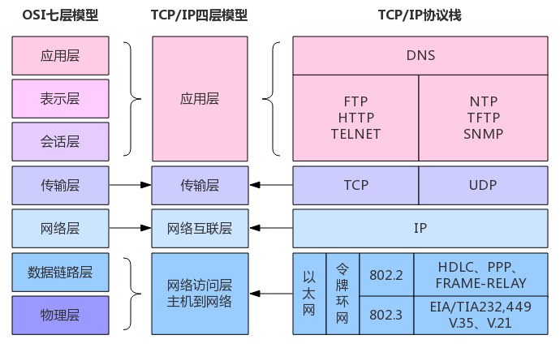
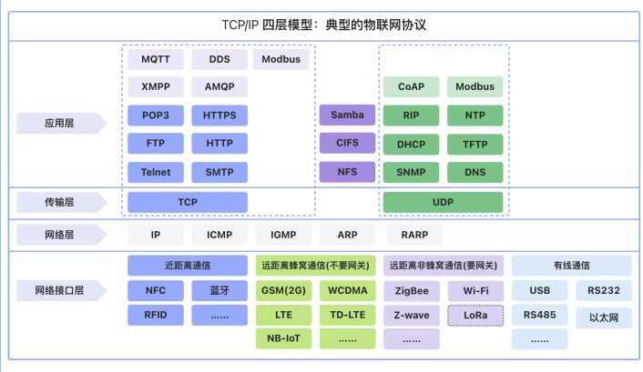
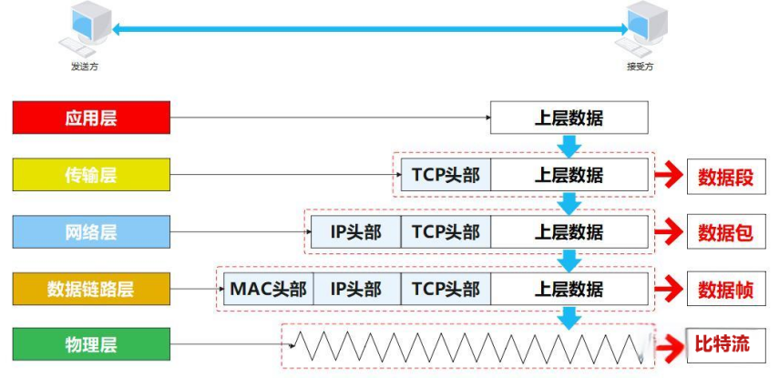
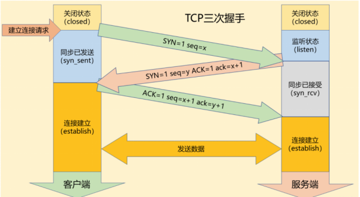
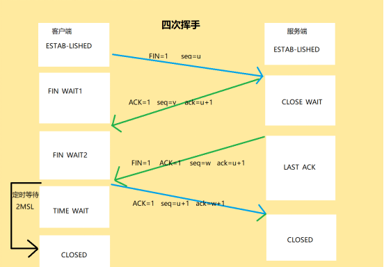
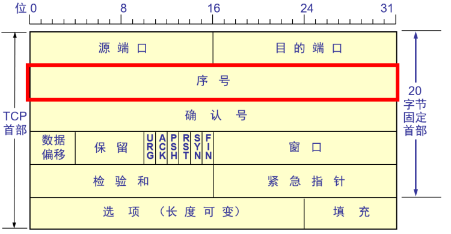
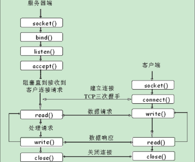

# P14_网络编程

## 网络编程介绍

### OSI参考模型及TCP/IP参考模型

OSI（Open System Interconnent）开放式系统互联，一般OSI参考模型，1985国际标准化组织研究这个网络，互联模型，主要是为了解决主机之间网络通信。全球都使用统一的标准。



- **OSI模型** 像是一个精心设计的理论蓝图，力求完美和通用，但过于复杂，实际应用较少，更多的是作为网络理论的框架。

- **TCP/IP模型**  则更像是一个在实践中不断发展壮大的工程成果，虽然结构相对简单，但实用性强，是互联网成功的基石。

在今天的网络世界中，我们实际使用的是TCP/IP协议族，但OSI模型仍然具有重要的理论价值，它可以帮助我们更好地理解网络通信的原理和层次结构。在学习网络知识时，通常会结合两个模型进行学习，以便更全面地掌握网络通信的各个方面。

**OSI 七层模型 (由下往上)**

1. **物理层 (Physical Layer):**  定义物理媒介（例如电缆、光纤、无线电波）上的比特流传输。
2. **数据链路层 (Data Link Layer):**  在物理层之上提供可靠的数据传输，处理MAC地址寻址，成帧、差错检测和纠正。常分为 MAC 子层（介质访问控制）和 LLC 子层（逻辑链路控制）。
3. **网络层 (Network Layer):**  处理逻辑地址（IP地址），路由选择，将数据包从源端传输到目的端，实现跨网络的数据传输。
4. **传输层 (Transport Layer):**  提供端到端的可靠或不可靠数据传输服务，进行流量控制、拥塞控制、端口号寻址，例如 TCP 和 UDP 协议。
5. **会话层 (Session Layer):**  建立、管理和终止会话连接，控制应用程序之间的对话。
6. **表示层 (Presentation Layer):**  处理数据格式、加密、压缩等，确保应用层的数据可以被另一系统理解。
7. **应用层 (Application Layer):**  为应用程序提供网络服务接口，例如 HTTP, FTP, DNS, SMTP 等协议。

**TCP/IP 模型 (常见的四层模型，也有五层模型的说法)**

- **四层 TCP/IP 模型 (由下往上):**
  1. **网络接口层 (Network Interface Layer) 或 网络接入层 (Network Access Layer) 或 链路层 (Link Layer):**  对应 OSI 的物理层和数据链路层的功能。负责物理介质上的数据传输，以及数据链路层的成帧、寻址等。
  2. **网际层 (Internet Layer) 或 网络层 (Network Layer):** 对应 OSI 的网络层。主要协议是 IP 协议，负责逻辑地址寻址和路由选择。
  3. **传输层 (Transport Layer):**  对应 OSI 的传输层。主要协议是 TCP 和 UDP，提供端到端的数据传输服务。
  4. **应用层 (Application Layer):**  对应 OSI 的会话层、表示层和应用层的功能。包含各种应用协议，例如 HTTP, FTP, DNS 等。
- **五层 TCP/IP 模型 (由下往上):**  为了更清晰地与 OSI 模型对应，有时会将 TCP/IP 模型细分为五层：
  1. **物理层 (Physical Layer):**  与 OSI 物理层相同。
  2. **数据链路层 (Data Link Layer):**  与 OSI 数据链路层相同。
  3. **网络层 (Network Layer):**  与 OSI 网络层相同。
  4. **传输层 (Transport Layer):**  与 OSI 传输层相同。
  5. **应用层 (Application Layer):**  对应 OSI 的会话层、表示层和应用层的功能。

### TCP层次解析

**1.物理层 (Physical Layer)**

- **核心功能:**  **传输原始比特流**。  负责在物理介质（网线、光纤、无线电波等）上传输代表数据的二进制信号（0 和 1）。
- **关键概念:**  比特 (bit)、物理介质、电压、频率、接口标准。
- **形象比喻:**  **修路**。  铺设物理道路，提供数据传输的物理通道。
- **设备例子:**  网线、光纤、无线网卡、**集线器 (Hub)**  （虽然集线器是物理层设备，但现代网络中已基本淘汰，交换机替代了集线器在局域网中的地位）。

**2. 数据链路层 (Data Link Layer)**

- **核心功能:**  **局域网内可靠的数据帧传输**。  将物理层传输的比特流组织成 **数据帧 (Data Frame)**，  进行 **MAC地址寻址**、**差错检测**、**介质访问控制** 等，  保证在同一局域网内设备之间可靠地传输数据帧。
- **关键概念:**  数据帧 (Frame)、MAC地址、MAC层协议、差错检测 (CRC)、介质访问控制 (CSMA/CD)。
- **形象比喻:**  **交通规则 + 局域网内道路管理**。  制定交通规则 (MAC协议)，  管理局域网内的交通，确保车辆 (数据帧) 在局域网内有序、可靠地传输，避免碰撞 (冲突)，并能发现和纠正一些传输错误。
- **设备例子:**  **网卡 (NIC)**、**交换机 (Switch)**、**网桥 (Bridge)**。

**3. 网络层 (Network Layer)**

- **核心功能:**  **跨网络 IP 寻址和路由**。  将数据链路层的数据帧封装成 **IP数据包 (IP Packet)**，  使用 **IP地址** 进行逻辑寻址，  并根据 **路由算法** 选择最佳路径，通过 **路由器** 将数据包转发到目标网络，实现跨网络的数据传输。
- **关键概念:**  IP地址、IP数据包、IP协议、路由、路由表、路由算法。
- **形象比喻:**  **全球交通导航系统 + 高速公路网络**。  建立全球交通导航系统 (IP寻址)，  构建高速公路网络 (互联网)，  路由器相当于交通枢纽， 指引车辆 (IP数据包)  从一个城市到达另一个城市。
- **设备例子:**  **路由器 (Router)**。

**4. 传输层 (Transport Layer)**

- **核心功能:**  **端到端可靠或不可靠的数据传输 + 端口号寻址**。  为 **应用程序进程之间** 提供 **可靠的 TCP 传输** (面向连接，保证数据可靠、有序、无差错) 或 **不可靠的 UDP 传输** (无连接，快速但不保证可靠性)。  使用 **端口号**  区分同一主机上的不同应用程序进程。
- **关键概念:**  TCP协议、UDP协议、端口号、端到端连接、数据段 (Segment)、数据报 (Datagram)、可靠传输 (序号、确认、重传、流量控制、拥塞控制)。
- **形象比喻:**  **物流公司 (TCP: 可靠物流， UDP: 快递)**。  物流公司负责将货物 (数据)  从发货人 (源应用程序) 送到收货人 (目标应用程序)。  TCP 提供可靠的物流服务，确保货物安全送达； UDP 提供快速快递服务，但不保证货物一定安全到达。  端口号相当于区分不同的收发货人。
- **协议例子:**  **TCP协议、UDP协议**。

**5. 应用层 (Application Layer)**

- **核心功能:**  **为应用程序提供网络服务接口**。  直接与应用程序交互，通过各种 **应用层协议**  为应用程序提供不同的网络服务，例如网页浏览 (HTTP)、文件传输 (FTP)、电子邮件 (SMTP/POP3/IMAP)、域名解析 (DNS) 等。  应用程序通过 **端口号**  来接收和提供网络服务。
- **关键概念:**  应用层协议 (HTTP, FTP, DNS, SMTP等)、端口号、API (Socket API)。
- **形象比喻:**  **各种服务行业 (银行、商店、邮局等)**。  提供各种各样的服务 (网络应用)，  用户通过这些服务来完成不同的网络任务。
- **协议例子:**  **HTTP、FTP、SMTP、DNS、DHCP、Telnet、SSH** 等。

**总结表格:**

| TCP/IP 五层模型 | 核心功能                               | 关键概念                                 | 形象比喻                             | 设备/协议例子                              |
| --------------- | -------------------------------------- | ---------------------------------------- | ------------------------------------ | ------------------------------------------ |
| **物理层**      | 传输原始比特流                         | 比特、物理介质、接口标准                 | 修路                                 | 网线、光纤、网卡 (物理层部分)              |
| **数据链路层**  | 局域网内可靠数据帧传输                 | 数据帧、MAC地址、MAC协议、差错检测、MAC  | 交通规则 + 局域网道路管理            | 网卡 (数据链路层部分)、交换机、网桥        |
| **网络层**      | 跨网络 IP 寻址和路由                   | IP地址、IP数据包、IP协议、路由、路由算法 | 全球交通导航系统 + 高速公路网络      | 路由器                                     |
| **传输层**      | 端到端可靠/不可靠数据传输 + 端口号寻址 | TCP、UDP、端口号、可靠传输、流量控制     | 物流公司 (TCP: 可靠物流， UDP: 快递) | TCP协议、UDP协议                           |
| **应用层**      | 为应用程序提供网络服务接口             | 应用层协议、端口号、API                  | 各种服务行业 (银行、商店、邮局等)    | HTTP、FTP、DNS、SMTP、DHCP、Telnet、SSH 等 |

### TCP/IP常见协议



### 不同主机间发送消息的过程



## TCP协议

TCP是面向连接的可靠通信协议，利用TCP和目标机器之间的通信，目的主机必须同意，否则TCP连接无法建立。

### 三次握手

为了确保TCP连接的成功建立，TCP采用了一种称为三次握手的方式使得“序号/确认号”系统能够正常工作，从而使它们的序号达成同步。

三次握手是指建立TCP连接协议时，需要在客户端和服务器之间发送三个数据包。这三次握手的主要目的是为了确认双方的**接收能力和发送能力是否正常，并同步连接双方的序列号和确认号，交换TCP窗口大小信息**，以便为后续的可靠数据传输做准备。



**步骤 1：第一次握手 (SYN)**

- **阶段:**  **客户端发起连接请求**
- **报文段类型:**  **SYN 报文段 (SYN Segment)**
  - **客户端的行为：**  客户端的 TCP 进程会创建一个特殊的 TCP 报文段，称为 **SYN 报文段**。
  - **SYN 标志位:**  在 TCP 首部中的 **控制位**  部分，客户端会将 **SYN (Synchronize Sequence Numbers)**  标志位设置为 **1**。  这表示这是一个 **连接请求**  报文段。
  - **初始序列号 (Initial Sequence Number, ISN):**  客户端会**随机生成**一个 **初始序列号 (client_isn)**，  并将其放在 TCP 首部中的 **序列号 (Sequence Number, seq)**  字段中。  **这个序列号用于标识客户端发送的第一个数据字节的序号，后续客户端发送的数据的序号将基于这个初始序列号递增。**
  - **其他字段:**  可能还会包含其他 TCP 首部字段，例如窗口大小等， 但**最关键的是 SYN 标志位和初始序列号。**
  - **目的端口号:**  SYN 报文段的目的端口号设置为 **服务器监听的端口号** (例如，Web 服务器通常监听 80 端口)。
  - **源端口号:**  源端口号是客户端动态选择的一个 **临时端口号** (通常是 1024~65535 范围内的未被使用的端口号)。
  - **发送报文:**  客户端将这个 SYN 报文段封装在 IP 数据包中，发送给服务器。
- **形象比喻:**  客户端向服务器 **发送请求信件**，  信件中表明 “我想和你建立连接，我的起始编号是 X (client_isn)”。


**步骤 2：第二次握手 (SYN-ACK)**

- **阶段:**  **服务器接收请求并确认应答**
- **报文段类型:**  **SYN-ACK 报文段 (SYN-ACK Segment)**
  - **服务器的行为：**  服务器的 TCP 进程接收到客户端发送的 SYN 报文段后，  会进行如下操作：
  - **确认客户端的 SYN 请求:**  服务器会 **确认**  客户端的 SYN 请求报文段已到达。  它会将 TCP 首部中的 **ACK (Acknowledgement)**  标志位设置为 **1**，  并在 **确认号 (Acknowledgement Number, ack)**  字段中填入  `client_isn + 1`。  这意味着服务器告诉客户端： “我收到了你发送的 SYN 连接请求， 期望你接下来发送的报文段的序号是 client_isn + 1”。
  - **同时发起自己的 SYN 请求:**  服务器也需要 **同步自己的序列号**。  服务器会生成自己的 **初始序列号 (server_isn)**，  并将 TCP 首部中的 **SYN 标志位**  也设置为 **1**。  这表示服务器也向客户端发起一个 SYN 请求 (**虽然是作为应答的一部分， 但本质上服务器也需要同步自己的序列号**)。
  - **SYN 和 ACK 标志位都置位：**  由于服务器需要同时进行确认应答和发起自己的同步请求，  因此发送的报文段称为 **SYN-ACK 报文段**，  其 SYN 和 ACK 标志位都被设置为 1。
  - **序列号 (seq):**  SYN-ACK 报文段的 **序列号 (seq)**  字段设置为服务器自己的 **初始序列号 (server_isn)**。
  - **源端口号:**  源端口号是 **服务器监听的端口号** (例如 80 端口)。
  - **目的端口号:**  目的端口号是客户端在第一次握手时使用的 **临时端口号**。
  - **发送报文:**  服务器将这个 SYN-ACK 报文段封装在 IP 数据包中，  发送回客户端。
- **形象比喻:**  服务器收到客户端的信件后，  **回复信件**，  信件中表明 “我收到了你的连接请求，  你说的起始编号我已经收到了， 期望你下次发信件的时候编号从 Y (client_isn + 1) 开始，  同时， 我也想和你建立连接， 我的起始编号是 Z (server_isn)”。


**步骤 3：第三次握手 (ACK)**

- **阶段:**  **客户端确认服务器的应答**
- **报文段类型:**  **ACK 报文段 (ACK Segment)**
  - **客户端的行为：**  客户端 TCP 进程接收到服务器发送的 SYN-ACK 报文段后，  会进行如下操作：
  - **确认服务器的 SYN-ACK 应答:**  客户端会 **确认**  服务器的 SYN-ACK 报文段已到达，  并且服务器也同意建立连接。  客户端会将 TCP 首部中的 **ACK 标志位**  设置为 **1**。
  - **确认号 (ack):**  在 **确认号 (ack)**  字段中填入  `server_isn + 1`。  这意味着客户端告诉服务器： “我收到了你发送的 SYN-ACK 报文段， 期望你接下来发送的报文段的序号是 server_isn + 1”。
  - **序列号 (seq):**  ACK 报文段的 **序列号 (seq)**  字段设置为  `client_isn + 1`。  注意， 这里客户端发送的 ACK 报文段本身 **不携带新的数据** (只是一个确认报文)，  因此其序列号仍然沿用之前客户端发送的最后一个报文段 (第一次握手的 SYN 报文段) 的序列号，  并在其基础上加 1 (即 `client_isn + 1`)。  也可以理解为， 虽然是第三次握手，但对于数据传输的序列号来说， 仍然是基于客户端的初始序列号。
  - **目的端口号:**  目的端口号是 **服务器监听的端口号** (例如 80 端口)。
  - **源端口号:**  源端口号是客户端在第一次握手时使用的 **临时端口号**。
  - **发送报文:**  客户端将这个 ACK 报文段封装在 IP 数据包中，  发送给服务器。
- **形象比喻:**  客户端收到服务器的回复信件后，  **再次回复信件**，  信件中表明 “我收到了你的回复，  你说的起始编号我也收到了，  期望你下次发信件的时候编号从 Z (server_isn + 1) 开始。  我这边准备好了，  可以开始正式通信了！”。


**三次握手完成，连接建立！**

- **连接状态:**  当服务器收到客户端发送的第三次握手 ACK 报文段后，  客户端和服务器都认为 **TCP 连接已经建立成功**，  此时连接进入 **ESTABLISHED (已建立连接)**  状态。
- **数据传输:**  连接建立之后，  客户端和服务器之间就可以开始进行 **双向的数据传输** 了。  **后续的数据传输报文段中， SYN 和 ACK 标志位通常都为 0 (除非是进行连接释放或重置等控制操作)。**


### **三次握手关键点总结**

- **SYN 标志位:**  用于发起连接请求和同步序列号。
- **ACK 标志位:**  用于**确认收到报文段**。
- **序列号 (seq):**  用于标识发送数据字节流的序号，保证数据有序到达和可靠传输。
- **确认号 (ack):**  期望接收到的下一个报文段的序列号，用于确认已成功接收到的数据段。
- **初始序列号 (ISN):**  连接建立时，双方随机生成的起始序列号，后续数据传输的序列号都基于 ISN 递增。
- **三次握手的必要性:**  三次握手是为了 **确保双方都具备发送和接收能力**，  **同步初始序列号**，  **协商参数** (例如窗口大小)，  从而建立一个 **可靠的双向连接**。  少于三次握手无法保证连接的可靠建立。

### 四次挥手

当 TCP 通信双方完成数据传输后，需要主动释放已经建立的 TCP 连接。  TCP 的连接释放过程需要通过四次挥手来完成，目的是 **确保全双工通信的可靠终止**。  由于 TCP 连接是全双工的 (双方都可以同时发送和接收数据)，  因此关闭连接需要双方分别确认自己的发送和接收方向的数据传输已经完成，才能最终安全地关闭连接。



四次挥手是客户端 (Client) 和服务器 (Server) 之间交换四个 TCP 报文段 (Segment) 的过程。  连接的关闭可以由客户端或服务器任何一方发起，我们这里假设由 **客户端主动发起关闭连接**。

**步骤 1：第一次挥手 (FIN)**

- **阶段:**  **客户端发起终止连接请求**
- **报文段类型:**  **FIN 报文段 (FIN Segment)**
  - **客户端的行为：**  当客户端应用程序完成数据发送后，想要关闭连接时，客户端的 TCP 进程会创建一个特殊的 TCP 报文段，称为 **FIN 报文段**。
  - **FIN 标志位:**  客户端会将 TCP 首部中的 **FIN (Finish)** 标志位设置为 **1**。  这表示客户端 **主动关闭连接**，  并且告诉服务器： “我已经没有数据要再发送给你了， 我请求关闭从客户端到服务器方向的连接”。  但此时客户端仍然可以接收来自服务器的数据。
  - **序列号 (Sequence Number, seq):**  FIN 报文段也需要占用一个序列号。  通常情况下， 客户端会将当前已经发送的最后一个数据字节的 **序号 (client_seq)**  作为 FIN 报文段的序列号。  或者，如果在 FIN 之前没有数据发送，则使用初始序列号 (ISN) 也可以。
  - **确认号 (Acknowledgement Number, ack):**  由于此时是连接释放的开始阶段， 通常  **确认号 (ack)**  字段的值是上次接收到服务器报文段的确认号的值 (**可能不需要特别关注， 关键在于后续的确认过程**)。
  - **发送报文:**  客户端将这个 FIN 报文段封装在 IP 数据包中，发送给服务器。
  - **客户端状态改变:**  客户端发送 FIN 报文段后，  客户端的 TCP 连接进入 **FIN_WAIT_1 (终止等待 1)**  状态。  这意味着客户端已经发出了 FIN 报文，等待服务器的确认。

- **形象比喻:**  客户端对服务器说： “我已经说完了，  我这边要挂电话了 (请求单方面关闭客户端到服务器的通话通道)。”


**步骤 2：第二次挥手 (ACK)**

- **阶段:**  **服务器确认客户端的终止请求**
- **报文段类型:**  **ACK 报文段 (ACK Segment)**
  - **服务器的行为：**  服务器的 TCP 进程接收到客户端发送的 FIN 报文段后，  会进行如下操作：
  - **确认客户端的 FIN 请求:**  服务器会 **确认**  客户端的 FIN 报文段已到达。  服务器会发送一个 **ACK 报文段**  给客户端。
  - **ACK 标志位:**  服务器会将 TCP 首部中的 **ACK (Acknowledgement)**  标志位设置为 **1**。
  - **确认号 (Acknowledgement Number, ack):**  在 **确认号 (ack)**  字段中填入  `client_seq + 1`。  与三次握手类似，  服务器用确认号来告知客户端： “我收到了你发送的 FIN 报文， 期望你接下来发送的报文段的序号是 client_seq + 1”。  这样就 **确认了客户端 FIN 报文段的到达**。
  - **序列号 (seq):**  ACK 报文段的 **序列号 (seq)**  字段值，  通常是服务器端上次发送给客户端的最后一个报文段的序列号之后的值，  或者可以理解为，  对于没有数据传输的纯 ACK 报文段，  可以沿用之前的序列号。
  - **源端口号 和 目的端口号:**  与接收到的 FIN 报文段的源和目的端口号互换。
  - **发送报文:**  服务器将这个 ACK 报文段封装在 IP 数据包中，  发送回客户端。
  - **服务器状态改变:**  服务器发送 ACK 报文段后，  服务器的 TCP 连接进入 **CLOSE_WAIT (关闭等待)**  状态。  这意味着服务器已经收到了客户端的 FIN 请求，  并进行了确认，  但是 **从服务器到客户端方向的连接**  可能还有数据要继续发送 (虽然通常情况下服务器也很少会在收到 FIN 后还发送大量数据，但 TCP 协议需要考虑到这种情况)，  或者服务器应用程序可能还需要做一些 **连接关闭前的准备工作** (例如， 清理资源，  记录日志等)。  此时，  服务器会等待应用程序完成数据发送或准备工作后，  再真正开始关闭服务器到客户端方向的连接。
  - **客户端状态改变:**  客户端接收到服务器发送的 ACK 报文段后，  客户端的 TCP 连接从 **FIN_WAIT_1**  状态进入 **FIN_WAIT_2 (终止等待 2)**  状态。  这意味着客户端已经成功接收到服务器对 FIN 报文段的确认，  客户端到服务器方向的连接已经半关闭 (Half-Close)。  客户端会继续等待服务器发送 FIN 报文段，  以完成双向连接的完全关闭。
- **形象比喻:**  服务器回复客户端说： “好的，  我知道你要挂电话了，  我这边知道了 (确认收到客户端的挂断请求)。”  但此时服务器可能还在处理一些事情，  还没有完全准备好挂电话。  服务器进入 “等待处理完手头工作” 的状态。


**步骤 3：第三次挥手 (FIN)**

- **阶段:**  **服务器发起终止连接请求**
- **报文段类型:**  **FIN 报文段 (FIN Segment)**
  - **服务器的行为：**  当服务器完成数据发送，  或者服务器应用程序也准备好关闭连接时，  服务器的 TCP 进程会 **再次发送一个 FIN 报文段**  给客户端。
  - **FIN 标志位:**  服务器会将 TCP 首部中的 **FIN (Finish)** 标志位设置为 **1**。  这表示服务器 **主动关闭连接**，  并且告诉客户端： “我这边也没有数据要再发送给你了，  我也请求关闭从服务器到客户端方向的连接”。  服务器也请求关闭 **从服务器到客户端方向** 的连接。
  - **序列号 (Sequence Number, seq):**  类似于客户端， 服务器也会将当前服务器端已经发送的最后一个数据字节的 **序号 (server_seq)**  作为 FIN 报文段的序列号，  或者使用初始序列号也可以。
  - **确认号 (Acknowledgement Number, ack):**  **注意，  这里服务器也需要对客户端之前的请求进行确认！**  服务器发送的 FIN 报文段，  其实是 **第二次挥手 (ACK)**  和  **第三次挥手 (FIN)**  的 **合并**。  服务器在发送 FIN 报文段的同时，  也会 **顺便确认**  客户端之前发送的 FIN 请求 (第一次挥手)。  因此，  在 TCP 首部中，  **ACK 标志位**  也会被设置为 **1**，  并且 **确认号 (ack)**  字段的值为  `client_seq + 1` (与第二次挥手相同)。  也就是说，  服务器的第三次挥手 (FIN)  同时 **确认了客户端的 FIN 请求**  (ACK)，  并 **发起了服务器自己的 FIN 请求**  (FIN)。  这在某些情况下可以优化挥手过程，  但为了更清晰地理解四次挥手的逻辑，  我们通常还是将其视为独立的第三次挥手 (FIN)。  更精确地说，  这里的 ACK 主要是对客户端第二次挥手 (ACK) 的应答，  而 FIN 是服务器自身发起的连接终止请求。  为了简化理解， 可以认为服务器的第三次挥手 **同时包含了 ACK 确认和 FIN 终止请求**  两个含义。
  - **源端口号 和 目的端口号:**  与之前的报文段保持一致。
  - **发送报文:**  服务器将这个 FIN 报文段封装在 IP 数据包中，  发送给客户端。
  - **服务器状态改变:**  服务器发送 FIN 报文段后，  服务器的 TCP 连接进入 **LAST_ACK (最后确认)**  状态。  这意味着服务器已经发出了 FIN 报文，  等待客户端对自己的 FIN 报文段进行最后的确认。
- **形象比喻:**  服务器处理完手头工作后，  对客户端说： “我也说完了，  我也要挂电话了 (请求单方面关闭服务器到客户端的通话通道)。”  **注意：**  此时服务器的 “挂电话” 请求，  实际上隐含了对客户端之前 “挂电话请求” 的 **最终确认**  的意味。


**步骤 4：第四次挥手 (ACK)**

- **阶段:**  **客户端确认服务器的终止请求**

- **报文段类型:**  **ACK 报文段 (ACK Segment)**

  - **客户端的行为：**  客户端 TCP 进程接收到服务器发送的 FIN 报文段后，  会进行如下操作：

  - **确认服务器的 FIN 请求:**  客户端会 **确认**  服务器的 FIN 报文段已到达。  客户端会发送一个 **ACK 报文段**  给服务器。

  - **ACK 标志位:**  客户端会将 TCP 首部中的 **ACK (Acknowledgement)**  标志位设置为 **1**。

  - **确认号 (Acknowledgement Number, ack):**  在 **确认号 (ack)**  字段中填入  `server_seq + 1`。  客户端告知服务器： “我收到了你发送的 FIN 报文，  期望你接下来发送的报文段的序号是 server_seq + 1”。  这样就 **确认了服务器 FIN 报文段的到达**。

  - **序列号 (seq):**  ACK 报文段的 **序列号 (seq)**  字段值，  通常可以沿用客户端上次发送的序号 (例如，  可以与第三次握手最后的 ACK 报文段的序列号相同，  或者在其基础上递增也可以，  因为这里只是一个最终的确认报文，  不携带新的数据)。

  - **源端口号 和 目的端口号:**  与之前的报文段保持一致。

  - **发送报文:**  客户端将这个 ACK 报文段封装在 IP 数据包中，  发送给服务器。

  - 客户端状态改变:客户端发送 ACK 报文段后，  客户端的 TCP 连接进入 TIME_WAIT (时间等待)状态。  

    注意，  客户端在发送完第四次挥手的 ACK 报文段后，  并不会立即进入 CLOSED 状态，  而是会先进入 TIME_WAIT 状态，  并 **等待一个 2MSL (Maximum Segment Lifetime，最长报文段寿命) 的时间**。  MSL  是指报文段在网络中可以存活的最长时间。  TIME_WAIT  状态的目的是为了：

    - **可靠地终止连接:**  确保最后一次发送的 ACK 报文段能够到达服务器。  如果最后一次 ACK 报文段丢失，服务器可能没有收到 ACK 确认，  会重新发送 FIN 报文段 (第三次挥手)。  客户端在 TIME_WAIT  状态等待一段时间，  如果在这段时间内又收到了服务器重发的 FIN 报文段，  客户端可以再次发送 ACK 报文段进行确认，  并重新进入 TIME_WAIT 状态。  这样可以 **避免由于最后一个 ACK 报文段丢失而导致连接无法正常关闭** 的情况。
    - **防止 “已失效的连接请求报文段”  被误认为是新连接的报文段:**  在 TIME_WAIT  状态等待一段时间，  可以 **让旧连接在网络中残余的所有报文段都自然消失**，  从而避免在新的连接建立时，  收到来自旧连接的 “迟到” 的报文段 (例如，  SYN 报文段)，  导致连接混乱。  等待 2MSL  时间，  足以让报文段在网络中被丢弃或到达目的地。

  - **服务器状态改变:**  服务器接收到客户端发送的 ACK 报文段后，  服务器的 TCP 连接进入 **CLOSED (关闭)**  状态。  服务器端 **先进入 CLOSED 状态**，  意味着服务器端首先完成了连接的完全关闭。

- **形象比喻:**  客户端收到服务器的 “挂电话” 请求后，  回复服务器说： “好的，  我也知道你要挂电话了，  我这边也确认了 (确认收到服务器的挂断请求)。  再见！”。  然后， 客户端 **并没有立刻挂断电话**，  而是会 **等待一段时间 (TIME_WAIT)**，  以 **确保服务器真的收到了自己的 “再见”**，  并且 **避免之前通话过程中产生的一些残留信号干扰到新的通话**。  服务器收到客户端的 “再见” 后，  就 **真正挂断了电话** (进入 CLOSED 状态)。


**等待 2MSL 时间后：**

- **客户端状态改变:**  客户端在 **TIME_WAIT**  状态等待 **2MSL**  时间结束后，  客户端的 TCP 连接最终也进入 **CLOSED (关闭)**  状态。  客户端和服务器的 TCP 连接都完全关闭，  连接资源被释放。


### **四次挥手关键点总结**

- **FIN 标志位:**  用于发起连接终止请求， 表示自己不再发送数据。
- **ACK 标志位:**  用于确认收到报文段， 包括 FIN 报文段的确认。
- **CLOSE_WAIT 状态:**  服务器收到 FIN 后，  进入 CLOSE_WAIT 状态，  等待应用程序完成数据发送或准备工作。  此时服务器还可以继续向客户端发送数据。
- **LAST_ACK 状态:**  服务器发送 FIN 后， 进入 LAST_ACK 状态，  等待客户端的最后 ACK 确认。
- **TIME_WAIT 状态:**  客户端发送完最后 ACK 后，  进入 TIME_WAIT 状态，  等待 2MSL 时间，  确保可靠终止连接和防止旧连接报文段干扰新连接。
- **四次挥手的必要性:**  由于 TCP 连接是全双工的，  **关闭连接需要双方分别确认两个方向的连接都已关闭。  第二次挥手和第三次挥手之间存在时间间隔，  因为服务器收到 FIN 报文后，  可能还需要一段时间来处理未发送完的数据，  或者进行连接关闭前的准备工作。**  因此，  四次挥手是 **保证 TCP 连接可靠、完整关闭**  的关键步骤。


### TCP报头

TCP通信过程建立之后，发送对应的数据了。

**TCP数据是什么样的？**

- 源端口、目的端口：16位 表示源端口和目的端口的端口号。

- 序列号：32位长，表示发送数据报的顺序。

- 确认号：32位长，希望收到下一个数据的序列号。

- TCP头：4位长，表示TCP中包好多少个32位字。

- 校验和：16位长，是为了保证数据的可靠性。



## UDP协议

### 概述

**UDP 实际上是一种无连接的协议**。 与 TCP 面向连接的可靠通信方式截然不同，UDP 在通信前 **不建立专门的连接**。

**UDP 的 “无连接” 特性意味着：**

- **没有握手过程:**  UDP 通信不需要像 TCP 那样的三次握手来建立连接。
- **直接发送数据:**  UDP 发送方在发送数据之前，无需与接收方进行任何事先协商或确认，可以直接将数据包发送出去。
- **无需维护连接状态:**  UDP 协议本身不维护任何连接状态信息，例如连接状态表、序列号、确认号、窗口大小等。

**无需预先协商，直接发送数据包:**

- **目标地址和端口:**  当应用程序想要使用 UDP 发送数据时，只需要知道 **目标主机的 IP 地址** 和 **目标应用程序的 UDP 端口号**。  例如，如果应用程序要向运行在 IP 地址 `202.103.41.50` 的主机上的 DNS 服务器 (通常使用 UDP 端口 53) 发送 DNS 查询请求，它只需要指定目标 IP 地址 `202.103.41.50` 和目标端口号 `53`。
- **UDP 数据报封装:**  应用程序将要发送的数据交给 UDP 协议，UDP 协议会将数据封装成 **UDP 数据报 (UDP Datagram)**。
- **添加 UDP 首部:**  在数据前面添加 **UDP 首部 (UDP Header)**，  UDP 首部包含 **源端口号**、 **目的端口号**、 **数据报长度**、 **校验和**  等字段。
- **IP 封装和发送:**  UDP 数据报会被进一步封装在 IP 数据包中，  网络层会根据目标 IP 地址进行路由，最终将 IP 数据包发送到目标主机。
- **无需握手，一步到位:**  整个过程 **没有握手协商** 的步骤，  发送方直接将封装好的 UDP 数据报发送出去。

**数据包独立传输，无连接状态:**

- **每个数据包独立路由:**  每个 UDP 数据包都是一个独立的、离散的数据单元。  网络层 (IP 协议) 会 **独立地路由**  每个 UDP 数据包，  尽力将其发送到目标主机， 但 **不保证**  数据包一定能够到达，  也不保证数据包的到达顺序。
- **无连接状态维护:**  UDP 协议本身 **不记录任何连接状态信息**。  发送方发送完数据包后， 就不会再追踪这个数据包是否到达，  也不会维护与接收方之间的 “连接”。  接收方收到 UDP 数据包后， 也只是简单地接收和处理数据，  不会向发送方发送任何确认信息 (除非上层应用协议有自己的确认机制)。
- **无需连接建立和释放:**  由于 UDP 是无连接的， 因此 **没有 TCP 那样的连接建立 (三次握手) 和连接释放 (四次挥手) 过程**。

**接收方监听端口，接收数据包:**

- **服务器端监听端口:**  UDP 服务器端应用程序 (例如 DNS 服务器、视频流媒体服务器等)  需要 **绑定到一个特定的 UDP 端口号**  上 (例如 DNS 服务器绑定到 53 端口)。  这样， 操作系统内核才能将到达该端口号的 UDP 数据包交付给相应的应用程序。
- **接收数据包:**  当网络中有一个 UDP 数据包的目标端口号与服务器端监听的端口号一致时，  服务器主机的操作系统内核会将该 UDP 数据包 **交付给监听该端口号的应用程序**。
- **应用程序处理数据:**  服务器端应用程序接收到 UDP 数据包后，  会 **解析 UDP 数据报**，  提取出应用程序数据，并进行相应的处理。  例如， DNS 服务器接收到 DNS 查询请求数据包后，  会进行域名解析，  并将解析结果封装成 UDP 响应数据包发送回客户端。

**“会话”的概念 (Application Layer Session):**

- **应用层管理会话:**  虽然 UDP 协议本身是无连接的，  但 **某些基于 UDP 的应用程序**为了实现更复杂的功能 (例如，  流媒体会话、 游戏会话等)，  会在 **应用层**  自行设计和管理 **“会话 (Session)”** 的概念。
- **会话标识:**  应用程序可能会在 UDP 数据包的应用层数据部分  **添加一些会话标识信息**  (例如，会话 ID,  客户端 ID 等)，  以便在多个 UDP 数据包之间 **关联上下文信息**，  实现类似 “会话” 的效果。
- **应用层可靠性机制:**  一些基于 UDP 的应用，  为了提高可靠性，  可能会在应用层 **自行实现一些可靠性机制**，  例如 **确认 (Acknowledgement)**、 **重传 (Retransmission)**、 **序号 (Sequence Number)**  等。  例如，  QUIC 协议 (基于 UDP 的快速 UDP 互联网连接)  就是在 UDP 之上构建了可靠传输机制。

**与 TCP 的对比：**

| 特性         | TCP (传输控制协议)                                   | UDP (用户数据报协议)                                         |
| ------------ | ---------------------------------------------------- | ------------------------------------------------------------ |
| **连接性**   | 面向连接 (Connection-Oriented)                       | 无连接 (Connectionless)                                      |
| **可靠性**   | 可靠传输 (Reliable)                                  | 不可靠传输 (Unreliable)                                      |
| **有序性**   | 有序传输 (Ordered)                                   | 无序传输 (Unordered)                                         |
| **拥塞控制** | 提供拥塞控制 (Congestion Control)                    | 不提供拥塞控制 (No Congestion Control)                       |
| **流量控制** | 提供流量控制 (Flow Control)                          | 不提供流量控制 (No Flow Control)                             |
| **连接建立** | 三次握手 (Three-Way Handshake)                       | 无连接建立 (No Connection Establishment)                     |
| **连接释放** | 四次挥手 (Four-Way Wavehand)                         | 无连接释放 (No Connection Release)                           |
| **效率**     | 效率相对较低 (Lower Efficiency)                      | 效率较高 (Higher Efficiency)                                 |
| **适用场景** | 可靠性要求高的应用，例如网页浏览，文件传输，电子邮件 | 实时性要求高，可靠性要求相对较低的应用，例如视频/音频流媒体，在线游戏，DNS |

### 数据格式

**UDP 的数据格式确实比 TCP 简单得多。**  这种简洁性是 UDP 协议设计哲学的一个核心体现，也是 UDP 在某些场景下性能优于 TCP 的关键原因之一。

UDP 数据报由两个主要部分组成：**UDP 首部 (UDP Header)** 和 **用户数据 (User Data)**。

- **UDP 首部 (UDP Header):**  非常简洁，只有 **8 字节 (Bytes)** 固定长度，包含以下 **四个字段**，每个字段 **2 字节 (16 位)**：
  1. **源端口号 (Source Port):**  发送方应用程序使用的 UDP 端口号。  可选字段，如果发送方不想接收响应，可以设置为 0。
  2. **目的端口号 (Destination Port):**  接收方应用程序使用的 UDP 端口号。  必须字段，标识数据要发送给哪个应用程序。
  3. **长度 (Length):**  整个 UDP 数据报的长度，包括 UDP 首部和用户数据的总字节数。  最小值为 8 字节（仅首部）。
  4. **校验和 (Checksum):**  用于检测 UDP 数据报在传输过程中是否发生错误。  可选字段，发送方可以选择不计算和发送校验和，接收方可以选择忽略校验和。
- **用户数据 (User Data):**  应用程序要发送的实际数据。  长度是可变的，由 UDP 数据报的总长度和 UDP 首部长度（8 字节）决定。


### **复杂度对比总结**

**最大的差异的确在于头部**。  对于用户数据部分，从本质上来说，都是应用程序想要传输的实际数据内容，在 **数据内容本身** 上， TCP 和 UDP **并没有本质区别**。  但关键在于， **TCP 和 UDP 如何对待和处理这些用户数据**，这才是导致它们在功能和应用场景上产生巨大差异的根本原因，而这种“对待和处理方式” 的不同，就体现在它们各自的头部设计上。

| 特性             | UDP 数据报                                | TCP 报文段                                                   |
| ---------------- | ----------------------------------------- | ------------------------------------------------------------ |
| **首部长度**     | **固定 8 字节**                           | **可变，最小 20 字节，最大 60 字节**                         |
| **首部字段数量** | **4 个**                                  | **至少 10 个基本字段， 以及可变的选项字段**                  |
| **关键字段**     | 源端口、目的端口、长度、校验和            | 源端口、目的端口、序号、确认号、控制位、窗口大小、校验和、选项等 |
| **控制功能**     | **简单**，  仅有校验和， 基本没有控制功能 | **复杂**，  提供连接管理 (SYN, FIN, RST)、可靠传输 (序号、确认、重传)、流量控制、拥塞控制等 |
| **可靠性机制**   | **几乎没有**，  仅可选的校验和            | **完善的可靠性机制**，  通过序号、确认、重传等保证数据可靠到达 |
| **连接管理**     | **无连接**                                | **面向连接**，  需要三次握手建立连接，四次挥手释放连接       |
| **开销**         | **首部开销小**，  协议处理简单，开销小    | **首部开销 1 大**，  协议处理复杂，开销大                    |

## 套接字 (Sockets): 跨设备的进程间通信

Linux中网络编程中通过socket接口进行通信。作用：建立一个通信的通道。

socket是一种特殊的I/O接口，**它有自己的文件描述符--fd**。它一种常用的通信机制。

**应用方式：不仅能够在本地机器上进行通信，也可以在不同网络设备之间进行通信。**

套接字是一种更为通用的 IPC 机制，尤其擅长于 **跨设备** 的进程间通信，这也是它的核心优势所在。

### **套接字如何实现跨设备通信？**

套接字的核心概念是**网络编程接口**。它抽象了网络通信的复杂性，为应用程序提供了统一的接口来进行数据传输。

1. **网络协议栈的抽象:**  套接字接口屏蔽了底层复杂的网络协议栈，如 TCP/IP 协议族。**应用程序无需关心数据是如何在网络中路由和传输的，只需通过套接字接口发送和接收数据即可。**
2. **客户端-服务器模型:**  跨设备通信通常基于客户端-服务器模型。服务器端监听特定端口，等待客户端连接。客户端发起连接请求，一旦连接建立，客户端和服务器端就可以通过套接字进行双向数据传输。
3. **IP 地址和端口:**  为了实现跨设备通信，需要使用 IP 地址来标识网络上的设备，并使用端口号来标识设备上的应用程序。**套接字通信需要指定目标设备的 IP 地址和端口号。**
4. **网络介质:**  跨设备通信需要通过网络介质进行数据传输，如以太网、Wi-Fi、互联网等。**套接字通信建立在这些网络介质之上。**

#### 疑问

**感觉socket套接字网络编程节省了很多底层的实现，很大程度方便了不同设备进程间通信的难度。 socket套接字是属于那一层？在TCP/IP模型中？**

Socket 套接字确实极大地简化了网络编程，它为不同设备和进程之间的通信提供了便利的途径，屏蔽了很多底层实现的复杂。

**Socket 套接字是操作系统提供的一组接口，它允许应用程序通过网络进行数据交换。**  您可以把 Socket 想象成一个“插座”，应用程序可以通过这个插座连接到网络，并与其他应用程序进行通信。

**Socket 的主要作用:**

- **抽象网络通信细节:**  Socket 套接字隐藏了底层的网络协议（如 TCP、UDP）的复杂性。程序员无需直接处理如 IP 地址、端口号、数据包封装等细节，只需调用 Socket 提供的简单接口，即可实现网络数据传输。
- **进程间通信的桥梁:**  在网络编程中，通信的双方通常是不同设备上的进程。Socket 套接字充当了这些进程之间通信的桥梁，使得不同进程能够像操作本地文件一样进行数据交换。
- **支持多种协议:**  Socket 套接字可以支持多种传输层协议，最常用的包括 TCP (传输控制协议) 和 UDP (用户数据报协议)。程序员可以根据应用需求选择合适的协议。

**Socket 套接字主要工作在传输层和应用层之间。**  更精确地说，Socket 套接字是**传输层协议 (如 TCP、UDP) 对应用程序的接口。**

- **连接应用层:**  应用程序通过调用 Socket API (例如，`socket()`, `bind()`, `listen()`, `accept()`, `connect()`, `send()`, `recv()`, `close()`)  来使用 Socket 套接字。这些 API 是应用层程序与传输层协议栈交互的接口。
- **基于传输层协议:**  Socket 套接字的实现是建立在传输层协议之上的。当应用程序使用 Socket 发送数据时，Socket 会将数据交给底层的传输层协议 (例如 TCP 或 UDP) 进行处理。传输层协议会负责数据的分段、封装、可靠传输 (TCP)、或者尽力交付 (UDP) 等操作。然后数据包会进一步向下传递到网际层、网络接口层进行处理，最终通过物理介质发送到网络上。

### **套接字的类型**

套接字主要分为两种类型：

- **流式套接字 (Stream Sockets):** 基于 TCP (Transmission Control Protocol) 协议，提供 **可靠的、面向连接的** 数据传输服务。
  - 特点:
    - **可靠性:** 数据传输保证顺序、无丢失、无重复。
    - **面向连接:** 通信前需要先建立连接 (三次握手)，通信结束后需要断开连接 (四次挥手)。
    - **字节流:** 数据被视为连续的字节流，没有消息边界。
  - **适用场景:**  需要可靠数据传输的应用，例如：网页浏览 (HTTP)、文件传输 (FTP)、电子邮件 (SMTP) 等。
- **数据报套接字 (Datagram Sockets):** 基于 UDP (User Datagram Protocol) 协议，提供 **不可靠的、无连接的** 数据传输服务。
  - 特点:
    - **不可靠性:** 数据传输不保证顺序、不保证到达，可能丢失或重复。
    - **无连接:** 通信前无需建立连接，直接发送数据报。
    - **消息边界:** 数据以独立的数据报形式发送，保留消息边界。
  - **适用场景:**  对实时性要求高，但允许少量数据丢失的应用，例如：视频流、音频流、在线游戏、DNS 查询等。

**套接字的本地进程间通信**

虽然套接字主要用于跨设备通信，但它也可以用于同一设备上的进程间通信。例如，可以使用 Unix 域套接字 (Unix Domain Socket) 在本地进程之间进行高效通信。Unix 域套接字避免了网络协议栈的开销，效率更高。

- **同一个IP地址，不同端口即可。**

## TCP网络编程

### 流程图



### `socket()` 函数

`socket()` 系统调用用于创建一个新的套接字，并返回一个**套接字描述符**（socket descriptor），这个描述符是一个整数，可以被后续的socket API 调用使用，例如 `bind()`, `listen()`, `connect()`, `accept()`, `send()`, `recv()` 和 `close()` 等。

```c
#include <sys/types.h>
#include <sys/socket.h>

int socket(int domain, int type, int protocol);
```

`socket()` 函数接受三个参数，它们共同决定了创建的套接字的特性：

1. **`domain` (地址族/协议族)**：  这个参数指定了**通信协议族**，也就是你希望使用的地址类型。最常用的地址族是 `AF_INET` 和 `AF_INET6`，分别用于 IPv4 和 IPv6 网络。
   - **`AF_INET` (或 `PF_INET`)**:  用于 **IPv4** 地址族。**这是最常用的地址族，用于大多数互联网应用。**
   - **`AF_INET6` (或 `PF_INET6`)**: 用于 **IPv6** 地址族。用于下一代互联网协议 IPv6。
   - 其他地址族 (了解即可)：
     - `AF_UNIX` (或 `AF_LOCAL` 或 `PF_UNIX` 或 `PF_LOCAL`):  用于 **本地（同一主机）进程间通信** (IPC)，使用 Unix 域套接字，效率比网络套接字高，但不用于网络通信。
     - `AF_ROUTE`:  用于路由套接字，通常用于路由协议和网络接口信息。
     - `AF_PACKET`:  用于底层数据包访问，允许程序直接操作网络数据包，常用于网络抓包和底层协议分析。
   
   - **选择建议：**  大多数 TCP 网络编程，您应该选择 `AF_INET` (IPv4) 或 `AF_INET6` (IPv6)。  如果您不确定，或者目标网络环境主要还是 IPv4，选择 `AF_INET` 是一个安全的选择。如果需要支持 IPv6，则选择 `AF_INET6`。  如果你的程序只需要在同一台机器上运行进程间通信，可以考虑 `AF_UNIX`。
   
2. **`type` (套接字类型)**： 这个参数指定了套接字的**通信类型**，也就是数据传输的方式。**对于 TCP socket 编程，最重要的是 `SOCK_STREAM`。**
   - `SOCK_STREAM`:  提供可靠的、面向连接的字节流服务。这就是 TCP 套接字类型。
     - **可靠性**: 保证数据传输的可靠性，数据不会丢失，顺序不会错乱。
     - **面向连接**:  通信前需要先建立连接 (三次握手)，通信结束后需要断开连接 (四次挥手)。
     - **字节流**: 数据被视为无结构的字节流，没有消息边界。
   - `SOCK_DGRAM`: 提供无连接的、不可靠的数据报服务。 这是 UDP 套接字类型。
     - **不可靠性**:  不保证数据到达，可能会丢失，可能会乱序。
     - **无连接**:  不需要预先建立连接。
     - **数据报**: 数据以数据包（datagram）为单位传输，有消息边界。
   - **`SOCK_RAW`**:  提供**原始套接字**访问。  允许程序直接访问 IP 协议层，可以发送和接收原始 IP 数据包，常用于网络协议分析、安全工具开发等高级用途。  需要较高的权限 (通常是 root 权限)。
   - **`SOCK_SEQPACKET`**: 提供**可靠的、有序的、面向连接**的定长数据包服务 (Sequenced Packet Socket)，与 `SOCK_STREAM` 类似，但保留了消息边界，不常用。
   
   - **选择建议：**  对于 TCP socket 编程，**必须选择 `SOCK_STREAM`**。  如果您需要实现基于 UDP 的应用（例如 DNS 查询、视频流、实时游戏），则选择 `SOCK_DGRAM`。 `SOCK_RAW` 和 `SOCK_SEQPACKET` 通常用于更专业的网络编程场景。
   
3. **`protocol` (协议)**：  这个参数通常设置为 **0**，表示根据 `domain` 和 `type` 参数的组合，**自动选择默认的协议**。  在大多数情况下，设置为 0 即可。
- **`0`:  自动选择默认协议。 对于 `AF_INET` 和 `SOCK_STREAM` 组合，默认协议是 TCP (Transmission Control Protocol)。 对于 `AF_INET` 和 `SOCK_DGRAM` 组合，默认协议是 UDP (User Datagram Protocol)。**
   - **其他协议 (了解即可)**： 您也可以显式指定协议，例如 `IPPROTO_TCP` 表示 TCP 协议，`IPPROTO_UDP` 表示 UDP 协议，`IPPROTO_SCTP` 表示 SCTP 协议等。 这些常量定义在 `<netinet/in.h>` (或 Windows 下的 `Ws2def.h`) 等头文件中。
   
- **选择建议：**  通常情况下，将 `protocol` 参数设置为 **0** 是最简单和最常用的做法。  如果您有特殊的协议需求，可以查阅相关文档并显式指定协议。

**`socket()` 函数的返回值**

`socket()` 函数的返回值是一个整数，根据调用是否成功，返回值有不同的意义：

- **成功**:  返回一个**非负整数**，这就是新创建的**套接字描述符**（socket descriptor）。  **套接字描述符就像文件描述符一样，用于后续的 socket 操作**，例如 `bind()`, `listen()`, `connect()`, `send()`, `recv()` 和 `close()` 等。
- **失败**: 返回 **-1**，并设置全局变量 `errno` 来指示具体的错误原因。 您可以使用 `perror()` 函数或查看 `errno` 的值来获取错误信息。

**常见的 `socket()` 调用错误**

当 `socket()` 调用失败时，常见的错误码（可以通过 `errno` 获取）包括：

- **`EINVAL`**:  无效的参数，例如 `domain`, `type`, 或 `protocol` 参数的值不合法。
- **`EPROTONOSUPPORT`**:  指定的协议不支持，例如内核不支持指定的协议族或协议类型。
- **`EAFNOSUPPORT`**:  指定的地址族不支持，例如内核不支持指定的地址族。
- **`ENFILE`**:  系统级限制，进程打开的文件描述符数量超过系统限制。
- **`EMFILE`**:  进程级限制，进程打开的文件描述符数量超过进程限制。
- **`ENOMEM`**:  内存不足，内核无法分配足够的内存来创建新的套接字。

#### 示例

以下是一个更完整的 TCP Server 端代码片段，展示了 `socket()` 的使用，并包含了简单的错误处理：

```c
#include <stdio.h>
#include <stdlib.h>
#include <string.h>
#include <sys/socket.h>
#include <netinet/in.h>
#include <unistd.h>
#include <errno.h>

#define PORT 8080
#define BUFFER_SIZE 1024

int main() {
    int server_fd, new_socket, valread;
    struct sockaddr_in address;
    int opt = 1;
    socklen_t addrlen = sizeof(address);
    char buffer[BUFFER_SIZE] = {0};
    const char *hello = "Hello from server";

    // 创建 socket 文件描述符
    if ((server_fd = socket(AF_INET, SOCK_STREAM, 0)) == 0) {
        perror("socket failed");
        exit(EXIT_FAILURE);
    }

    // ... (省略 setsockopt, bind, listen 等后续步骤，专注于 socket()) ...

    printf("Server socket created successfully. Socket descriptor: %d\n", server_fd);

    // ... (后续代码：bind, listen, accept, 接收和发送数据, close) ...

    close(server_fd); // 关闭 server socket

    return 0;
}
```

### `bind()` 函数

在创建了套接字之后，对于**服务器端程序**来说，通常需要将套接字与一个**本地地址和端口号**绑定，这样客户端才能连接到这个地址和端口。`bind()` 函数正是用来完成这个任务的。

 **对于服务器程序来说，它必须绑定到一个众所周知的地址和端口，以便客户端可以连接到服务器。  对于客户端程序，通常不需要显式调用 `bind()`，操作系统会在 `connect()` 或 `sendto()` 等函数调用时，自动选择一个合适的本地地址和端口。**

```c
#include <sys/types.h>
#include <sys/socket.h>

int bind(int sockfd, const struct sockaddr *addr, socklen_t addrlen);
```

`bind()` 函数接受三个参数：

1. **`sockfd` (套接字描述符)**：

   - 这是 `bind()` 函数的第一个参数，它是一个**整数**，表示要进行绑定的**套接字描述符**。
   - 这个套接字描述符必须是之前通过 `socket()` 函数成功创建并返回的。  `bind()` 操作会在这个已创建的套接字上进行。

2. **`addr` (地址结构指针)**：

   - 这是 `bind()` 函数的第二个参数，它是一个指向 `struct sockaddr` 结构体的**指针**。

   - `struct sockaddr` 是一个**通用的**地址结构，可以用于各种协议族。  但是，在实际使用中，我们需要根据 `socket()` 函数创建套接字时指定的 `domain` 参数（地址族），使用**特定协议族**的地址结构，然后**强制类型转换**为 `struct sockaddr*` 传递给 `bind()`。

   - 对于 **TCP/IP (IPv4)** 编程，我们通常使用 `struct sockaddr_in` 结构体。

   - 对于 **TCP/IP (IPv6)** 编程，我们通常使用 `struct sockaddr_in6` 结构体。

   - ```c
     struct sockaddr {
         sa_family_t sa_family;    // 地址族 (Address Family)
         char        sa_data[14];  // 协议族特定的地址信息
     };
     ```

   - `sa_family`:  指定地址族，例如 `AF_INET` 或 `AF_INET6`，与 `socket()` 的 `domain` 参数保持一致。

   - `sa_data`:  用于存储协议族特定的地址信息，长度为 14 字节。  由于 `sa_data` 结构比较晦涩，通常不直接操作 `sockaddr` 结构体，而是使用特定协议族的地址结构。

   - `struct sockaddr_in` 结构体 (IPv4 地址结构)

     - ```c
       #include <netinet/in.h>
       
       struct sockaddr_in {
           sa_family_t    sin_family; /* 地址族，始终为 AF_INET */
           in_port_t      sin_port;   /* 端口号 (网络字节序) */
           struct in_addr sin_addr;   /* IPv4 地址 (网络字节序) */
           unsigned char  sin_zero[8]; /* 填充，通常设置为 0 */
       };
       ```

       - `sin_family`:  地址族，对于 IPv4，**必须设置为 `AF_INET`**。
       - `sin_port`:  **端口号**。  需要以 **网络字节序** (Network Byte Order) 存储。  通常使用 `htons()` 函数将主机字节序的端口号转换为网络字节序。
       - `sin_addr`:  **IPv4 地址**，类型为 `struct in_addr`。  也需要以 **网络字节序** 存储。  通常使用 `inet_addr()` 或 `inet_aton()` 函数将点分十进制的 IP 地址字符串转换为网络字节序的 `in_addr` 结构，或者使用更现代的 `inet_pton()` 函数。
       - `sin_zero[8]`:  填充字段，长度为 8 字节，**必须设置为 0**。  通常使用 `memset()` 函数清零。

   - `struct in_addr` 结构体 (IPv4 地址)

     - ```c
       #include <netinet/in.h>
       
       struct in_addr {
           in_addr_t s_addr; /* IPv4 地址 (网络字节序，32 位整数) */
       };
       ```

       - `s_addr`:  存储 32 位的 IPv4 地址，以 **网络字节序** 的整数形式存储。

   - `struct sockaddr_in6` 结构体 (IPv6 地址结构)

     - ```c
       #include <netinet/in.h>
       
       struct sockaddr_in6 {
           sa_family_t     sin6_family;   /* 地址族，始终为 AF_INET6 */
           in_port_t       sin6_port;     /* 端口号 (网络字节序) */
           uint32_t        sin6_flowinfo; /* IPv6 流信息 */
           struct in6_addr sin6_addr;     /* IPv6 地址 (网络字节序) */
           uint32_t        sin6_scope_id; /* Scope ID (例如，链路本地地址的接口索引) */
       };
       ```

       - `sin6_family`: 地址族，对于 IPv6，**必须设置为 `AF_INET6`**。
       - `sin6_port`:  **端口号**。  需要以 **网络字节序** 存储。  同样使用 `htons()` 函数进行转换。
       - `sin6_flowinfo`: IPv6 流信息，通常设置为 **0**。
       - `sin6_addr`:  **IPv6 地址**，类型为 `struct in6_addr`。  需要以 **网络字节序** 存储。  通常使用 `inet_pton()` 函数将 IPv6 地址字符串转换为网络字节序的 `in6_addr` 结构。
       - `sin6_scope_id`: Scope ID，对于链路本地地址等，需要指定接口索引，通常设置为 **0**。

     - `struct in6_addr` 结构体 (IPv6 地址)

       - ```c
         #include <netinet/in.h>
         
         struct in6_addr {
             unsigned char s6_addr[16]; /* IPv6 地址 (网络字节序，128 位，字节数组) */
         };
         ```

         - `s6_addr`:  存储 128 位的 IPv6 地址，以 **网络字节序** 的 16 字节数组形式存储。

3. **`addrlen` (地址结构长度)**：

   - 这是 `bind()` 函数的第三个参数，它是一个 `socklen_t` 类型的值，表示 `addr` 参数指向的地址结构的**长度**（大小）。
   - 对于 `struct sockaddr_in`，`addrlen` 应该设置为 `sizeof(struct sockaddr_in)`。
   - 对于 `struct sockaddr_in6`，`addrlen` 应该设置为 `sizeof(struct sockaddr_in6)`。
   - `socklen_t` 类型通常在 `<sys/socket.h>` 或 `<netinet/in.h>` 等头文件中定义，通常是 `unsigned int` 类型。

**`bind()` 函数的返回值**

`bind()` 函数的返回值是一个整数，根据调用是否成功，返回值有不同的意义：

- **成功**:  返回 **0**。  **表示套接字成功绑定到指定的地址和端口**。
- **失败**: 返回 **-1**，并设置全局变量 `errno` 来指示具体的错误原因。 您可以使用 `perror()` 函数或查看 `errno` 的值来获取错误信息。

**常见的 `bind()` 调用错误**

当 `bind()` 调用失败时，常见的错误码（可以通过 `errno` 获取）包括：

- **`EADDRINUSE` (Address already in use)**:  地址已被占用。  通常发生在尝试绑定到一个已被其他进程（或者同一个进程之前的套接字）绑定的端口号时。  在服务器程序重启时，如果之前的 socket 没有正确关闭，可能会遇到 `EADDRINUSE` 错误。  可以使用 `setsockopt(sockfd, SOL_SOCKET, SO_REUSEADDR, ...)` 设置套接字选项来允许地址重用。
- **`EADDRNOTAVAIL` (Cannot assign requested address)**:  请求的地址不可用。  可能的原因包括：尝试绑定到一个不存在的网络接口的地址，或者尝试绑定到一个本机不拥有的 IP 地址。  例如，在多网卡主机上，尝试绑定到一个未配置在任何网卡上的 IP 地址。
- **`EACCES` (Permission denied)**:  权限不足。  通常发生在尝试绑定到**特权端口**（端口号小于 1024）时，非 root 用户通常没有权限绑定到特权端口。
- **`EINVAL` (Invalid argument)**:  无效的参数。  例如，`sockfd` 不是一个有效的套接字描述符，或者 `addrlen` 的值不正确。
- **`ENOTSOCK` (Socket operation on non-socket)**:  `sockfd` 参数不是一个套接字描述符。

#### **重要的字节序转换函数**

- **`htons(uint16_t hostshort)`**:  "Host to Network Short" - 将**主机字节序** (通常是小端序) 的 16 位无符号整数 (例如端口号) 转换为 **网络字节序** (大端序)。
- **`htonl(uint32_t hostlong)`**:  "Host to Network Long" - 将**主机字节序** 的 32 位无符号整数 (例如 IPv4 地址) 转换为 **网络字节序**。 （虽然 `sin_addr.s_addr` 本身就是网络字节序，但在设置时，源地址字符串通常是主机字节序，需要转换）。
- **`ntohs(uint16_t netshort)`**:  "Network to Host Short" - 将**网络字节序** 的 16 位无符号整数转换为 **主机字节序**。  （通常用于接收到的端口号）。
- **`ntohl(uint32_t netlong)`**:  "Network to Host Long" - 将**网络字节序** 的 32 位无符号整数转换为 **主机字节序**。 （通常用于接收到的 IPv4 地址）。

#### **IP 地址转换函数**

- **`inet_aton(const char \*cp, struct in_addr \*inp)`**:  将点分十进制的 IPv4 地址字符串转换为 **网络字节序** 的 `struct in_addr` 结构，并将结果存储在 `inp` 指向的结构体中。  **函数返回值为 0 表示地址无效，非 0 表示地址有效**。
- **`inet_ntoa(struct in_addr in)`**:  将 **网络字节序** 的 `struct in_addr` 结构转换为 点分十进制的 IPv4 地址字符串。  **返回值指向静态分配的内存，不可修改，且非线程安全**。
- `inet_pton(int af, const char *src, void *dst)`:  "Presentation to Network" -  更现代的 IP 地址转换函数，支持 IPv4 和 IPv6。
  - `af`:  地址族，`AF_INET` 或 `AF_INET6`。
  - `src`:  IP 地址字符串 (IPv4 点分十进制 或 IPv6 格式)。
  - `dst`:  指向存储转换结果的缓冲区的指针，对于 IPv4，缓冲区类型是 `struct in_addr*`，对于 IPv6，缓冲区类型是 `struct in6_addr*`。
  - **返回值：成功返回 1，输入地址格式错误返回 0， 错误返回 -1 并设置 `errno`**。
- `inet_ntop(int af, const void *src, char *dst, socklen_t size)`: "Network to Presentation" -  更现代的 IP 地址转换函数，支持 IPv4 和 IPv6。
  - `af`:  地址族，`AF_INET` 或 `AF_INET6`。
  - `src`:  指向存储网络字节序 IP 地址的缓冲区的指针，对于 IPv4，缓冲区类型是 `struct in_addr*`，对于 IPv6，缓冲区类型是 `struct in6_addr*`。
  - `dst`:  指向存储转换后的 IP 地址字符串的缓冲区。
  - `size`:  `dst` 缓冲区的大小。  必须足够大，对于 IPv4，至少 `INET_ADDRSTRLEN` 字节，对于 IPv6，至少 `INET6_ADDRSTRLEN` 字节 (这些常量定义在 `<netinet/in.h>` 或 `<arpa/inet.h>` 中)。
  - **返回值：成功返回指向 `dst` 的指针，失败返回 `NULL` 并设置 `errno`**。

#### 示例

```c
#include <stdio.h>
#include <stdlib.h>
#include <string.h>
#include <sys/types.h>
#include <sys/socket.h>
#include <netinet/in.h>
#include <arpa/inet.h>
#include <unistd.h>

int main() {
    int sockfd;                // socket文件描述符
    struct sockaddr_in serv_addr; // 服务器地址结构体

    // 创建socket
    sockfd = socket(AF_INET, SOCK_STREAM, 0);
    if (sockfd < 0) {
        perror("socket创建失败");
        exit(EXIT_FAILURE);
    }

    // 初始化地址结构体
    memset(&serv_addr, 0, sizeof(serv_addr));   // 清零结构体
    serv_addr.sin_family = AF_INET;             // 设置地址族为IPv4
    serv_addr.sin_addr.s_addr = INADDR_ANY;     // 监听所有可用网络接口
    serv_addr.sin_port = htons(8080);           // 设置端口号为8080，转换为网络字节序

    // 调用bind()函数绑定socket
    if (bind(sockfd, (struct sockaddr *)&serv_addr, sizeof(serv_addr)) < 0) {
        perror("bind失败");
        exit(EXIT_FAILURE);
    }

    printf("Socket成功绑定到端口8080\n");

    // 关闭socket
    close(sockfd);

    return 0;
}
```

bind() 绑定了本机上所有的网络接口，端口为 8080。这意味着客户端可以通过服务器的任何一个 IP 地址的 8080 端口连接到该 socket。

**绑定所有网络接口**：

- 在使用 bind() 函数时，如果指定了 INADDR_ANY（通常表示为 0.0.0.0）作为 IP 地址，套接字会绑定到服务器上所有可用的网络接口。
- 例如，服务器可能有多个网络接口（如以太网接口 eth0、无线接口 wlan0、回环接口 lo 等），每个接口可能关联一个或多个 IP 地址（如 192.168.1.100、127.0.0.1 等）。
- 使用 INADDR_ANY，套接字会监听所有这些接口上的连接请求。

**端口号 8080**：

- 端口号是用来区分同一 IP 地址上不同服务的标识。
- 在这个例子中，bind() 将套接字绑定到端口 8080，因此客户端需要通过 8080 端口发起连接。

**客户端连接**：

- 由于套接字绑定了所有网络接口，客户端可以通过服务器的任何一个 IP 地址（例如 192.168.1.100:8080 或 127.0.0.1:8080）来连接到这个套接字。
- 只要端口号是 8080，客户端的连接请求就会被该套接字接收。

**为什么这么做？**

- 在服务器编程中，使用 INADDR_ANY 绑定所有网络接口是一种常见做法。这样，服务器无需为每个 IP 地址单独创建和绑定套接字，就能接受来自任何网络接口的连接请求，提高了灵活性和兼容性。

#### 注意事项

- 如果一台机器上的某个端口（例如 8080）已经被一个套接字绑定到所有网络接口（通过 INADDR_ANY），其他套接字通常无法再次绑定到该端口，除非使用了特殊选项（如 SO_REUSEADDR）。
- 如果你只想让套接字监听特定的 IP 地址（例如只监听 127.0.0.1），可以在 bind() 时明确指定该 IP 地址，而不是使用 INADDR_ANY。

#### bind的作用

- bind() 函数的主要作用是将一个套接字（socket）与一个特定的 IP 地址和端口号关联起来。通过这种绑定，套接字就有了明确的“身份”，外部的连接请求可以通过这个 IP 地址和端口号找到对应的套接字。

- 在网络通信中，IP 地址标识了设备，端口号则标识了设备上的具体应用程序。bind() 确保套接字绑定到一个本地地址（IP + 端口），这样外部的客户端才能通过这个地址准确地访问到服务器。

- 在服务器端，bind() 是必须的，因为服务器需要监听一个固定的 IP 地址和端口，以便客户端能够通过这个地址连接到它。

- 客户端通常不需要显式调用 bind()，因为在客户端连接服务器时，操作系统会自动为客户端套接字分配一个临时的 IP 地址和端口号。
  - 当客户端调用 connect() 函数连接服务器时，如果套接字没有显式绑定地址，操作系统会：
    1. 选择一个本地的 IP 地址（通常由网络接口决定）。
    2. 分配一个临时的端口号（通常是随机的 ephemeral port）。 这种自动分配的过程可以看作是“隐式绑定”，但实际上是由操作系统在 connect() 调用时完成的。
- 客户端显式 bind() 的特殊情况，虽然客户端一般不需要显式 bind()，但在某些场景下，客户端可能会选择显式绑定：
  - **使用特定本地 IP 地址：**
     如果客户端运行在有多张网卡的机器上，可能需要指定使用某个网卡的 IP 地址。
  - **使用特定端口：**
     在某些协议中，客户端需要使用固定的端口与服务器通信。
  - **实现方式：**
     在这种情况下，客户端可以在调用 connect() 之前显式调用 bind()，绑定到指定的 IP 和端口。

### `listen()` 函数

`listen()` 函数的作用

1. **将 Socket 转换为监听 Socket**:  调用 `listen()` 的 socket 必须是已经通过 `socket()` 函数创建，并且通过 `bind()` 函数绑定了 IP 地址和端口号的 socket。`listen()` 的作用就是**在这个已绑定的 socket 上开始监听连接。**
2. **创建连接队列（Backlog Queue）**:  当服务器开始监听后，操作系统会在内核中为这个监听 socket 创建一个连接请求队列，也称为 **backlog queue** 或 **SYN queue** (在 TCP 三次握手初期)。这个队列用于临时存放那些已经完成 TCP 三次握手的前两次握手（SYN, SYN-ACK），**但服务器端尚未调用 `accept()` 函数处理的连接请求。**

```c
#include <sys/socket.h>

int listen(int sockfd, int backlog);
```

**`sockfd` (Socket 文件描述符)**:

- **类型**: `int`
- **作用**: 这是由 `socket()` 系统调用创建的 socket 文件描述符。在调用 `listen()` 之前，这个 socket 通常需要先通过 `bind()` 系统调用绑定到一个本地地址和端口。
- **说明**:  `sockfd` 参数指定了**监听 socket** 是哪个。`listen()` 操作会在这个 socket 上生效，使其进入监听状态。

**`backlog` (积压连接数)**:

- **类型**: `int`
- **作用**:  `backlog` 参数定义了**内核为监听 socket 维护的连接请求队列的最大长度**。当服务器的监听 socket 接收到客户端的连接请求（完成 TCP 三次握手的前两次握手）时，这些连接请求会被放入到这个队列中。
- 说明:
  - **队列长度限制**: `backlog` 指定了**队列可以容纳的最大连接数。如果队列已满，并且有新的连接请求到达，服务器可能会拒绝新的连接（具体行为取决于操作系统，TCP 协议栈的实现）。**
  - **历史演变**: 早期 BSD 系统中，`backlog` 是已经完成三次握手，等待 `accept()` 取走的连接队列的长度限制。但现代系统，尤其 Linux，`backlog` 的确切含义更接近于 **SYN 队列** 的长度限制。  当 SYN 队列满时，服务器可能会忽略后续的 SYN 包，或者发送 RST 包给客户端，告知连接被拒绝。
  - 取值建议:  `backlog`的值应该根据服务器的负载情况和处理连接的能力来设置。
    - **小值**: 如果 `backlog` 设置得太小，在高并发场景下，可能会导致连接请求被拒绝，客户端无法连接到服务器。
    - **大值**:  `backlog` 值过大，虽然可以容纳更多等待连接的请求，但也会占用一定的系统资源（内存）。
    - **常用值**:  通常可以使用一个相对适中的值，例如 `128`，`256`，或者 `512`。 对于高负载的服务器，可能需要根据实际情况调整。
    - **`SOMAXCONN` 和 `LISTENQ`**:  在一些系统中，`backlog` 的最大值受到系统宏 `SOMAXCONN` (在 `<sys/socket.h>` 中定义) 或者 `LISTENQ` (在 `<netinet/tcp_var.h>` 或 `<linux/socket.h>` 中定义，老版本 Linux) 的限制。  `SOMAXCONN` 定义了 `backlog` 的上限值。  在 Linux 中，`SOMAXCONN` 的默认值通常比较大，例如在 `/proc/sys/net/core/somaxconn` 中可以查看和修改。你可以将 `backlog` 设置为 `SOMAXCONN`，表示使用系统允许的最大值。

`listen()` 函数的返回值

- **成功**:  如果函数调用成功，返回 `0`。
- 失败:  如果函数调用失败，返回 -1，并设置全局变量 errno来指示具体的错误原因。  常见的错误原因包括：
  - `EBADF`: `sockfd` 不是一个有效的文件描述符。
  - `ENOTSOCK`:  `sockfd` 描述符不是一个 socket。
  - `EOPNOTSUPP`:  `sockfd` 关联的 socket 类型不支持 `listen()` 操作（例如，数据报 socket，如 `SOCK_DGRAM`，通常不需要监听）。

#### `backlog`参数解析

listen() 函数中的 backlog 参数正是用来定义**已完成 TCP 三次握手但尚未被 accept() 处理的连接请求**的最大数量。这个数量指的是等待队列的大小。

- 具体含义：
  - 当客户端完成 TCP 三次握手后，连接就处于“已建立”状态，但服务器还没有调用 accept() 来处理它。
  - 这些连接请求会被放入一个等待队列中，队列的最大长度由 backlog 参数决定。
- 举例：
  - 如果 backlog 设置为 5，那么最多有 5 个已完成三次握手的连接请求可以排队等待 accept()。
  - 如果队列已满，新来的连接请求可能会被拒绝（客户端收到 RST 包）或被忽略（客户端超时）。
- 澄清：
  - backlog 限制的只是等待队列的大小，而不是服务器与客户端的总连接数。服务器实际能处理的连接数取决于系统资源和程序设计。

**调用 accept() 后，服务器会新建进程或线程与客户端通信吗？**

调用 accept() 后，服务器的具体行为取决于它的设计，但通常会有以下情况：

- 服务器行为：
  - 当调用 accept() 时，服务器会从等待队列中取出一个已完成的连接请求。
  - accept() 会返回一个**新的文件描述符**（socket），这个文件描述符专门用于与该客户端通信。
  - 原始的监听 socket（用于 listen() 的 socket）则继续保持监听状态，等待新的连接请求。
- 并发处理方式：
  - 多线程或多进程模型：
    - 服务器可能会为每个 accept() 返回的客户端连接创建一个新的线程或进程。
    - 这个线程或进程负责处理与该客户端的通信，例如读取请求、发送响应等。
    - 这种方式比较常见于简单的服务器设计，但资源消耗可能较高。
  - 事件驱动模型：
    - 服务器也可以使用单个线程或进程，通过事件循环（如 select()、poll() 或 epoll()）来处理多个客户端连接。
    - 在这种模型中，不需要为每个客户端新建线程或进程，而是通过事件机制管理所有连接。
    - 这种方式更高效，适合高并发场景。
- 是否必须新建进程或线程：
  - **不一定**。新建进程或线程只是一种常见的实现方式，具体取决于服务器的并发模型。你提到的“服务器会新创建一个进程或者线程”在多线程/多进程模型中是对的，但在事件驱动模型中则不适用。

**返回的文件描述符用于与客户端通信**

是的，accept() 返回的正是用于 socket 通信的**文件描述符**。

- 作用：
  - 这个文件描述符是服务器与特定客户端之间的专用通信通道。
  - 服务器可以通过这个文件描述符执行读写操作，例如使用 read()、write() 或 send()、recv() 与对应的客户端交换数据。
- 操作方式：
  - 你可以用这个文件描述符来接收客户端发送的数据（读操作），或者向客户端发送数据（写操作）。
  - 每个客户端连接都有一个独立的文件描述符，服务器通过这些文件描述符区分不同的客户端。


### `accept()`函数（阻塞）

`accept()` 函数主要用于**服务器端**，当服务器监听某个端口，并准备接受客户端连接时，`accept()` 函数被用来**实际接受一个客户端的连接请求**。

当一个客户端发起 TCP 连接请求（通过 `connect()` 函数）到服务器监听的端口时，服务器端的程序需要调用 `accept()` 函数来完成以下工作：

- **创建一个新的 socket 套接字：** `accept()` 函数会创建一个**新的 socket 套接字**，这个新的 socket 套接字**专门用于与发起连接请求的客户端进行通信**。  **原来的监听 socket** (通过 `socket()`, `bind()`, `listen()` 创建的) 仍然继续监听新的连接请求。
- **建立连接：**  `accept()` 函数会完成 TCP 三次握手的**最后一步**（在服务器端），正式建立起服务器与客户端之间的 TCP 连接。
- **返回新的 socket 文件描述符：** `accept()` 函数会返回一个**新的文件描述符**，这个文件描述符就是**新创建的、用于与客户端通信的 socket 套接字的文件描述符。服务器端程序可以使用这个新的文件描述符**，通过 `send()` 和 `recv()` 等函数与特定的客户端进行数据交换。

```c
#include <sys/socket.h> // Unix-like 系统

int accept(int sockfd, struct sockaddr *addr, socklen_t *addrlen);
```

**`sockfd` (int sockfd) - 监听 socket 的文件描述符 (输入参数)**

- **类型：**  `int` (整型文件描述符)
- **作用：**  这个参数是**监听 socket 的文件描述符**。它是之前通过 `socket()` 函数创建，并且通过 `bind()` 函数绑定了本地地址和端口，然后通过 `listen()` 函数设置为监听状态的 socket。
- **重要性：**  `accept()` 函数会从这个监听 socket 的**就绪连接队列**中取出一个已完成三次握手的客户端连接。
- **示例：**  如果您在服务器端创建了一个监听 socket 并将其文件描述符赋值给变量 `listen_fd`，那么这里 `sockfd` 参数就应该是 `listen_fd`。

**`addr` (struct sockaddr \*addr) - 客户端地址信息结构体指针 (输出参数，可以为 NULL)**

- **类型：** `struct sockaddr *` (通用 socket 地址结构体指针)
- **作用：**  这个参数是一个**指向 `struct sockaddr` 结构体的指针**，用于**接收客户端的地址信息**，例如客户端的 IP 地址和端口号。
- **`struct sockaddr`:** 这是一个通用的 socket 地址结构体，可以用于各种协议族。对于 IPv4，通常会强制转换为 `struct sockaddr_in *` 类型；对于 IPv6，则会转换为 `struct sockaddr_in6 *` 类型。
- **输出参数：**  `accept()` 函数成功返回时，会**填充 `addr` 指向的结构体**，包含连接到服务器的客户端的地址信息。
- **可以为 NULL：**  如果您不关心客户端的地址信息，可以将 `addr` 参数设置为 `NULL`。在这种情况下，`accept()` 不会返回客户端地址信息。
- **示例：**  您可以预先声明一个 `struct sockaddr_in` 类型的变量，例如 `client_addr`，然后将 `(struct sockaddr *)&client_addr` 作为 `addr` 参数传递给 `accept()`。

**`addrlen` (socklen_t \*addrlen) - `addr` 参数指向的结构体大小 (输入/输出参数，如果 `addr` 不为 NULL)**

- **类型：** `socklen_t *` (通常是 `unsigned int *` 或 `size_t *`)，注意是指针类型。
- **作用：**  这个参数是一个**指向 `socklen_t` 类型变量的指针**，用于**指定 `addr` 参数指向的结构体的大小**。
- **输入参数：**  在调用 `accept()` 之前，您需要**设置 `addrlen` 指向的变量的值**为 `addr` 指向的结构体的实际大小。例如，如果 `addr` 指向的是 `struct sockaddr_in` 结构体，那么您需要将 `addrlen` 指向的值设置为 `sizeof(struct sockaddr_in)`。
- **输出参数：**  `accept()` 函数成功返回时，`addrlen` 指向的变量的值**可能会被更新**为实际返回的地址结构体的长度 (虽然通常情况下不会改变，但最好按照规范处理)。
- **重要性：**  `addrlen` 参数用于防止缓冲区溢出，确保 `accept()` 函数不会向 `addr` 指向的内存区域写入超出其大小的数据。
- **如果 `addr` 为 NULL：**  如果 `addr` 参数设置为 `NULL`，那么 `addrlen` 参数也应该设置为 `NULL`，或者忽略其值，因为此时不需要传递地址结构体的大小信息。
- **示例：**  您可以声明一个 `socklen_t` 类型的变量，例如 `client_addr_len`，并将其初始化为 `sizeof(struct sockaddr_in)`，然后将 `&client_addr_len` 作为 `addrlen` 参数传递给 `accept()`。

**`accept()` API 的返回值**

`accept()` 函数的返回值是一个整型值：

- **成功返回值：**  如果 `accept()` 函数成功接受了一个客户端连接，它会返回一个**新的非负整数**，这个整数就是**新创建的 socket 套接字的文件描述符**。  这个新的文件描述符代表了服务器与客户端之间新建立的连接。服务器端程序可以使用这个新的文件描述符进行后续的数据收发操作 (例如使用 `send()` 和 `recv()` 函数)。
- **失败返回值：**  如果 `accept()` 函数调用失败 (例如，在等待连接的过程中发生错误，或者被信号中断)，它会返回 **-1**。  在这种情况下，您应该检查全局变量 `errno` 来获取具体的错误代码，以了解失败原因。

#### `accept()` API 的使用场景和步骤 (服务器端 TCP 程序)

`accept()` 函数通常在 TCP 服务器程序中使用，用于接受客户端的连接请求。  一个典型的 TCP 服务器程序使用 `accept()` 的流程大致如下：

1. **创建监听 socket：** 使用 `socket()` 函数创建一个监听 socket (通常是 TCP socket，即 `SOCK_STREAM` 类型)。
2. **绑定地址和端口：** 使用 `bind()` 函数将监听 socket 绑定到服务器的 IP 地址和端口号。
3. **开始监听：** 使用 `listen()` 函数将监听 socket 设置为监听状态，开始监听来自客户端的连接请求。同时，需要指定**等待连接队列的最大长度 (backlog)**。
   1. **监听绑定的地址与端口的连接请求**

4. 进入循环，接受连接：服务器程序通常会进入一个无限循环，在循环中调用 accept()函数。
   - **阻塞等待：** `accept()` 函数是一个**阻塞函数**。如果监听 socket 的就绪连接队列为空，`accept()` 函数会**阻塞**，直到有新的客户端完成 TCP 三次握手，或者发生错误。
   - **接受连接：** 当有新的客户端连接到达，并且完成三次握手后，`accept()` 函数会返回一个新的 socket 文件描述符，表示接受了一个新的客户端连接。
   - **处理客户端连接：**  获取到新的 socket 文件描述符后，服务器端程序就可以使用这个新的文件描述符与客户端进行通信 (例如使用 `send()` 和 `recv()` 函数进行数据交换)。通常，服务器会**为每个连接创建一个新的线程或进程**来处理与该客户端的通信，以便能够同时处理多个客户端的连接。
   - **循环继续：**  处理完当前客户端的连接后，服务器程序会返回循环的开始，继续调用 `accept()` 函数，等待并接受下一个客户端的连接。
5. **关闭连接：** 当服务器完成与客户端的通信后，应该**关闭与客户端通信的 socket (通过 `close()` 函数)**。  监听 socket 通常在服务器程序退出时才关闭。


**错误处理**

`accept()` 函数调用失败时 (返回 -1)，应该检查 `errno` 全局变量来确定具体的错误原因。  常见的错误包括：

- **`EAGAIN` 或 `EWOULDBLOCK`:**  如果监听 socket 被设置为非阻塞模式 (通过 `fcntl()` 或 `ioctl()` 设置 `O_NONBLOCK` 标志)，并且就绪连接队列中没有等待处理的连接，`accept()` 会立即返回错误，并将 `errno` 设置为 `EAGAIN` 或 `EWOULDBLOCK`。  在这种情况下，程序应该稍后重试 `accept()` 调用，或者使用 `select()` 或 `poll()` 等函数来监视监听 socket 的可读事件。
- **`EINTR`:**  如果 `accept()` 函数在阻塞等待连接的过程中被信号中断，会返回错误，并将 `errno` 设置为 `EINTR`。  如果程序需要处理信号，可能需要重新调用 `accept()`。
- **`ECONNABORTED`:**  如果连接在 `accept()` 完成之前被对端 (客户端) 中止，`accept()` 可能会返回 `ECONNABORTED` 错误。
- **其他错误:**  还可能出现其他错误，例如内存不足 (`ENOMEM`), 文件描述符耗尽 (`EMFILE`, `ENFILE`) 等。  详细错误代码可以参考系统文档或 `errno` 的定义。

#### 关于参数的具体使用

如果您不需要知道客户端的地址信息，可以将参数 addr 和 addrlen 设置为 NULL，并且仍然可以使用 accept() 返回的 socket 文件描述符与客户端进行通信。

如果需要知道呢？提前声明对应结构体变量接收即可

```c
#include <stdio.h>
#include <stdlib.h>
#include <string.h>
#include <sys/socket.h>
#include <netinet/in.h>
#include <arpa/inet.h>
#include <unistd.h>

int main() {
    int sockfd, newsockfd;                  // 监听socket和客户端socket
    struct sockaddr_in serv_addr, cli_addr; // 服务器和客户端地址结构体
    socklen_t cli_len;                      // 客户端地址长度

    // 创建监听socket
    sockfd = socket(AF_INET, SOCK_STREAM, 0);
    if (sockfd < 0) {
        perror("socket创建失败");
        exit(EXIT_FAILURE);
    }

    // 设置服务器地址
    memset(&serv_addr, 0, sizeof(serv_addr));
    serv_addr.sin_family = AF_INET;
    serv_addr.sin_addr.s_addr = INADDR_ANY;
    serv_addr.sin_port = htons(8080);

    // 绑定socket
    if (bind(sockfd, (struct sockaddr *)&serv_addr, sizeof(serv_addr)) < 0) {
        perror("bind失败");
        exit(EXIT_FAILURE);
    }

    // 开始监听
    if (listen(sockfd, 5) < 0) {
        perror("listen失败");
        exit(EXIT_FAILURE);
    }
    printf("服务器正在监听端口8080...\n");

    // 接受客户端连接并获取客户端信息
    cli_len = sizeof(cli_addr); // 初始化客户端地址长度
    newsockfd = accept(sockfd, (struct sockaddr *)&cli_addr, &cli_len);
    if (newsockfd < 0) {
        perror("accept失败");
        exit(EXIT_FAILURE);
    }

    // 将客户端IP地址和端口号转换为可读格式
    char cli_ip[INET_ADDRSTRLEN];
    inet_ntop(AF_INET, &(cli_addr.sin_addr), cli_ip, INET_ADDRSTRLEN);
    int cli_port = ntohs(cli_addr.sin_port);

    // 打印客户端信息
    printf("客户端连接成功！IP地址: %s, 端口号: %d\n", cli_ip, cli_port);

    // 简单的通信示例：发送欢迎消息
    char *msg = "欢迎连接到服务器！\n";
    send(newsockfd, msg, strlen(msg), 0);

    // 关闭socket
    close(newsockfd);
    close(sockfd);

    return 0;
}
```

### `recv()` 函数

`recv()` 函数是 socket 编程中用于**从已连接的套接字接收数据**的关键函数。它允许程序从网络连接的另一端读取信息。

`recv()` 函数的主要作用是从一个**已连接的套接字**（例如通过 `accept()` 接受的连接，或者是客户端通过 `connect()` 建立的连接）接收数据。它会尝试从套接字的接收缓冲区读取数据，并将数据复制到用户提供的缓冲区中。

**核心功能:**

- **接收数据:** 从已连接的 socket 套接字接收网络数据。
- **阻塞或非阻塞操作:** `recv()` **可以是阻塞的，也可以是非阻塞的**，取决于 socket 的设置方式。
- **多种标志 (flags):** 可以通过标志参数 `flags` 修改 `recv()` 的行为，例如查看数据但不移除、接收带外数据等。

```c
#include <sys/socket.h>

ssize_t recv(int sockfd, void *buf, size_t len, int flags);
```

**`sockfd` (int sockfd) - 套接字文件描述符 (输入参数)**

- **类型:** `int` (整型文件描述符)
- **作用:**  这是**已连接的套接字的文件描述符**，您希望从这个套接字接收数据。这个套接字必须是已经建立连接的，通常是 `accept()` 函数的返回值，或者是 `connect()` 成功建立连接的套接字。
- **重要性:**  `sockfd` 指定了数据来源的连接。
- **示例:** 如果您有一个已连接的套接字文件描述符存储在变量 `client_sockfd` 中，那么 `sockfd` 参数就应该是 `client_sockfd`。

**`buf` (void \*buf) - 接收缓冲区指针 (输出参数)**

- **类型:** `void *` (通用指针)
- **作用:**  这是一个**指向缓冲区的指针**，`recv()` 函数会**将接收到的数据复制到这个缓冲区中。您需要预先分配足够大的内存空间来存储接收到的数据。**
- **类型转换:** 由于是 `void *` 类型，您可以将任何类型的指针传递给 `buf`，例如 `char *`，`unsigned char *`，或者自定义结构体的指针。  通常，我们会使用 `char *` 或 `unsigned char *` 类型的缓冲区来接收原始字节数据。
- **输出参数:** `recv()` 函数会将接收到的数据写入到 `buf` 指向的内存区域。

**`len` (size_t len) - 接收缓冲区的最大长度 (输入参数)**

- **类型:** `size_t` (通常是无符号整型，例如 `unsigned long`)
- **作用:**  `len` 参数指定了**接收缓冲区的最大长度**，即 `buf` 指向的缓冲区的大小 (以字节为单位)。 `recv()` 函数最多只会接收 `len` 字节的数据到 `buf` 中，即使对端发送的数据超过了 `len` 字节。
- **最大接收量:**  `len` 限制了单次 `recv()` 调用能接收的最大字节数。如果对端发送的数据超过 `len`，您可能需要多次调用 `recv()` 才能接收完整的数据。
- **避免溢出:**  `len` 确保了 `recv()` 不会向 `buf` 指向的内存区域写入超出其大小的数据，防止缓冲区溢出。
- **示例:**  如果您定义了一个字符数组 `char recv_buffer[1024];`，那么 `len` 参数应该设置为 `sizeof(recv_buffer)`，即 `1024`。

**`flags` (int flags) - 标志 (输入参数)**

- **类型:** `int` (整型)

- **作用:**  `flags` 参数是一组**标志位**，用于**修改 `recv()` 函数的行为**。您可以通过使用 `OR` 运算符 (`|`) 组合多个标志。

- 常用标志 (flags):

  - **`**0`:  默认值，表示没有特殊标志，按照标准阻塞或非阻塞方式接收数据。**

  - **`MSG_PEEK`:**  **窥视数据**。接收数据，但是**不从接收队列中移除数据**。这意味着下次调用 `recv()` 时，仍然可以再次接收到相同的数据。  这常用于预先检查数据，但不实际处理。

  - `MSG_WAITALL`:

    等待接收所有数据。recv()函数会阻塞，直到接收到至少 len字节的数据，或者连接关闭，或者发生错误。 如果满足以下任一条件，函数可能仍然返回少于 len字节的数据：

    - 捕获到信号。
    - 连接被关闭。
    - 套接字发生错误。

  - **`MSG_OOB`:**  **接收带外数据 (Out-of-band data)**。接收紧急数据。带外数据是 TCP 协议中用于传输高优先级数据的机制（通常用于紧急信号）。

  - **`MSG_TRUNC`:**  当接收的数据报比提供的缓冲区 `buf` 要长时，**丢弃超出部分，但仍然返回实际接收到的数据长度**。 只有当套接字类型为 `SOCK_DGRAM` 时才有效。

  - **`MSG_DONTWAIT` (或 `O_NONBLOCK` 套接字标志):**  **非阻塞 I/O**。即使没有数据可接收，`recv()` 函数也会立即返回，不会阻塞等待。  如果此时没有数据可接收，`recv()` 将返回 `-1` 并设置 `errno` 为 `EAGAIN` 或 `EWOULDBLOCK`。  通常，如果套接字被设置为非阻塞模式 (通过 `fcntl()` 或 `socket()` 函数设置 `O_NONBLOCK` 标志)，即使 `flags` 参数为 0，`recv()` 也会以非阻塞方式工作。

  - **`MSG_ERRQUEUE` (Linux 特定):**  从套接字错误队列接收错误。这个标志主要用于接收异步发生的套接字错误。

**`recv()` API 的返回值**

`recv()` 函数的返回值类型是 `ssize_t` (带符号的 `size_t`)，表示返回接收到的字节数，或者错误指示。

- 返回值 > 0:

    表示成功接收到数据，返回值是实际接收到的字节数。**接收到的字节数可能小于 len参数指定的值，这并不一定是错误。 可能的原因包括：**

  - 网络传输的数据包小于 `len`。
  - 套接字的接收缓冲区中只有少于 `len` 字节的数据。
  - 信号中断了 `recv()` 调用 (如果使用了 `MSG_WAITALL` 标志，则会等待接收到 `len` 字节或发生错误)。

- **返回值 == 0:**  对于 **TCP 连接**，返回值 `0` 表示**连接已关闭 (Connection closed by peer)**。  这通常意味着对端 (发送数据的另一端) 已经**正常关闭了连接**（例如，对端调用了 `close()` 或 `shutdown()` 函数）。对于 **UDP 等无连接协议，返回值 0 没有特殊意义，不表示连接关闭**。

    - **这是在接收数据的情况下，数据个数为0的情况**

- 返回值 == -1:表示 recv()调用发生错误。您应该检查全局变量 errno来获取具体的错误代码，以了解失败原因。常见的 errno值包括：

  - **`EAGAIN` 或 `EWOULDBLOCK`:**  如果套接字被设置为非阻塞模式 (`O_NONBLOCK`)，并且此时没有数据可接收，`recv()` 会立即返回错误，并将 `errno` 设置为 `EAGAIN` 或 `EWOULDBLOCK`。 这不是真正的错误，表示操作会阻塞，但套接字是非阻塞的。  您应该稍后重试 `recv()` 调用，或者使用 `select()` 或 `poll()` 等函数来监视套接字的可读事件。
  - **`EINTR`:**  `recv()` 函数在等待数据到达期间被**信号中断**。 如果程序需要处理信号，可能需要重新调用 `recv()`。
  - **`ECONNRESET`:**  **连接被对端重置 (Connection reset by peer)**。  表示 TCP 连接被对方强制关闭。
  - **`ENOTCONN`:**  与描述符关联的套接字未连接 (对于 `SOCK_STREAM` 类型套接字)。
  - **`ENOTSOCK`:**  描述符不是一个套接字。
  - **`EBADF`:**  `sockfd` 不是一个有效的文件描述符。
  - **`EFAULT`:**  `buf` 指向的缓冲区地址无效，例如指向的内存不可访问。
  - 其他错误:  还可能出现其他错误，例如内存不足 (`ENOMEM`) 等。  详细错误代码可以参考系统文档或 `errno` 的定义。

**`recv()` API 的使用场景和步骤**

`recv()` 函数通常用于以下场景：

- **服务器端程序接收客户端发送的数据:**  在服务器程序中，通过 `accept()` 接受客户端连接后，可以使用 `recv()` 函数从客户端连接的套接字上接收客户端发送的请求或数据。
- **客户端程序接收服务器端发送的数据:**  在客户端程序中，通过 `connect()` 函数连接到服务器后，可以使用 `recv()` 函数从与服务器连接的套接字上接收服务器端发送的响应或数据。
- **任何需要接收网络数据的场景:**  只要建立了 socket 连接，并且需要从连接的另一端接收数据，都可以使用 `recv()` 函数。

### `send()` 函数

`send()` 函数的主要作用是**通过一个已连接的套接字发送数据**。它会将用户提供的缓冲区中的数据发送到套接字的发送缓冲区，然后由操作系统负责将数据通过网络传输到连接的另一端。

**核心功能:**

- **发送数据:** 通过已连接的 socket 套接字发送网络数据。
- **阻塞或非阻塞操作:** 与 `recv()` 类似，`send()` 可以是阻塞的，也可以是非阻塞的，取决于 socket 的设置。
- **多种标志 (flags):**  可以通过标志参数 `flags` 修改 `send()` 的行为，例如不使用路由、发送带外数据等。

```c
#include <sys/socket.h>

ssize_t send(int sockfd, const void *buf, size_t len, int flags);
```

`send()` 函数接受四个参数，这些参数与 `recv()` 的参数在功能上是对应的，只是方向相反 (发送而不是接收)。

### `connect()` 函数

`connect()` 函数是 socket 编程中**客户端程序**用来**主动与服务器建立连接**的关键 API。它是客户端发起 TCP 三次握手的操作，是客户端网络通信的起点。

**核心功能:**

- **建立连接 (TCP):** 对于 TCP 套接字 (`SOCK_STREAM`)，`connect()` 函数会**启动 TCP 三次握手过程**，尝试与指定的服务器建立可靠的连接。  客户端会发送 SYN 包，等待服务器的 SYN-ACK 响应，并最终发送 ACK 包完成握手。
- **设置连接端点 (UDP):** 对于 UDP 套接字 (`SOCK_DGRAM`)，`connect()` 函数并不会真正建立“连接” (UDP 是无连接协议)。  它的作用是**设置套接字的默认对端地址**。  之后，客户端可以使用 `send()` 和 `recv()` 函数与这个默认对端进行数据交换，而无需在每次发送和接收时都指定目标地址。  这样做的好处是可以简化 UDP 客户端的代码，并且在某些情况下可以获得轻微的性能提升 (例如，避免每次 `sendto()` 都进行路由查找)。  需要注意的是，UDP 的 `connect()` 并不像 TCP 那样进行连接状态的维护或错误检测，它仅仅是设置了默认的通信对象。
- **阻塞或非阻塞操作:**  `connect()` 默认是**阻塞**的，会一直等待连接建立成功或失败才返回。  也可以将套接字设置为非阻塞模式，使 `connect()` 立即返回，即使连接尚未建立完成。

```c
#include <sys/socket.h>

int connect(int sockfd, const struct sockaddr *addr, socklen_t addrlen);
```

**`sockfd` (int sockfd) - 套接字文件描述符 (输入参数)**

- **类型:** `int` (整型文件描述符)
- **作用:**  这是**客户端套接字的文件描述符**。  这个套接字必须是之前通过 `socket()` 函数创建的，并且通常是 **未连接** 的状态 (对于 TCP 客户端，在调用 `connect()` 之前，套接字处于未连接状态)。
- **重要性:**  `sockfd` 指定了客户端用于发起连接的套接字。
- **示例:**  如果您在客户端程序中创建了一个套接字并将其文件描述符赋值给变量 `client_fd`，那么 `sockfd` 参数就应该是 `client_fd`。

**`addr` (const struct sockaddr \*addr) - 服务器地址信息结构体指针 (输入参数)**

- **类型:** `const struct sockaddr *` (通用 socket 地址结构体常量指针)
- **作用:**  这个参数是一个**指向 `struct sockaddr` 结构体的指针**，用于**指定要连接的远程服务器的地址信息**，包括服务器的 IP 地址和端口号。
- **`struct sockaddr`:** 这是一个通用的 socket 地址结构体，可以用于各种协议族。  对于 IPv4，通常会强制转换为 `struct sockaddr_in *` 类型；对于 IPv6，则会转换为 `struct sockaddr_in6 *` 类型。
- **输入参数:**  您需要**预先填充 `addr` 指向的结构体**，设置要连接的服务器的 IP 地址和端口号。
- **示例 (IPv4):**  您可以声明一个 `struct sockaddr_in` 类型的变量，例如 `server_addr`，然后填充它的 `sin_family` (地址族，通常为 `AF_INET` for IPv4), `sin_port` (服务器端口号，需要使用 `htons()` 函数转换为网络字节序), 和 `sin_addr` (服务器 IP 地址，可以使用 `inet_pton()` 函数将点分十进制 IP 地址字符串转换为网络字节序的 IP 地址)。 然后将 `(const struct sockaddr *)&server_addr` 作为 `addr` 参数传递给 `connect()`。

**`addrlen` (socklen_t addrlen) - `addr` 参数指向的结构体大小 (输入参数)**

- **类型:** `socklen_t` (通常是 `unsigned int` 或 `size_t`)
- **作用:**  `addrlen` 参数指定了 **`addr` 参数指向的结构体的大小** (以字节为单位)。  这告诉 `connect()` 函数，`addr` 指向的内存区域有多大，以便正确解析地址信息。
- **输入参数:**  您需要**设置 `addrlen` 的值**为 `addr` 指向的结构体的实际大小。 例如，如果 `addr` 指向的是 `struct sockaddr_in` 结构体，那么 `addrlen` 就应该设置为 `sizeof(struct sockaddr_in)`。
- **重要性:**  `addrlen` 参数用于防止读取超出 `addr` 指向的内存区域，确保 `connect()` 函数能够正确处理地址信息。
- **示例:**  **如果 `server_addr` 是 `struct sockaddr_in` 类型的变量，那么 `addrlen` 参数就应该是 `sizeof(server_addr)`。**

**`connect()` API 的返回值**

`connect()` 函数的返回值是一个整型值，用于指示连接尝试的结果：

- **成功返回值：**  如果 `connect()` 函数成功与服务器建立了连接 (对于 TCP) 或者成功设置了 UDP 套接字的默认对端地址，**它会返回 0。  对于 TCP 客户端，返回 0 表示 TCP 三次握手已完成，连接已建立。**  客户端现在可以使用 `send()` 和 `recv()` 函数与服务器进行数据交换。

- 失败返回值：如果 connect()函数调用失败 (例如，无法连接到服务器、连接超时、服务器拒绝连接等)，它会返回 

  -1。  在这种情况下，您应该检查全局变量 errno来获取具体的错误代码，以了解失败原因。  常见的 errno值及其含义如下：

  - **`ECONNREFUSED`:**  **连接被拒绝 (Connection refused)**。  服务器主机存在，但指定端口上**没有服务器程序在监听**，或者服务器程序**明确拒绝了连接**。  这通常表示服务器端没有启动相应的服务，或者服务器防火墙阻止了连接。
  - **`ETIMEDOUT`:**  **连接超时 (Connection timed out)**。  `connect()` 函数在一段时间内**没有收到服务器的响应**，连接尝试超时失败。  这通常表示网络存在问题，例如服务器主机不可达、网络拥塞严重、或者服务器防火墙阻止了连接。
  - **`ENETUNREACH`:**  **网络不可达 (Network is unreachable)**。  表示**到达目标网络的路由不存在**。 这通常意味着客户端的网络配置有问题，或者目标服务器所在的网络与客户端网络不连通。
  - **`EHOSTUNREACH`:**  **主机不可达 (No route to host)**。  表示**到达目标主机的路由存在，但是目标主机不存在或者没有启动**。 这通常意味着服务器主机关机、网络连接断开、或者 IP 地址错误。
  - **`EINPROGRESS`:**  **操作正在进行中 (Operation now in progress)**。  这个错误通常只在**非阻塞套接字**的 `connect()` 调用中出现。 表示连接建立过程正在进行中，但尚未完成。  您需要使用 `select()` 或 `poll()` 等函数**轮询套接字的可写事件**，以判断连接是否建立成功或失败。  稍后会详细解释非阻塞 `connect()`。
  - **`EAGAIN` 或 `EWOULDBLOCK`:**  **资源暂时不可用 (Resource temporarily unavailable)**。  在某些情况下，如果系统资源暂时不足 (例如，socket 缓冲区满)，非阻塞 `connect()` 也可能返回这些错误。  您可以稍后重试 `connect()` 调用。
  - **`EISCONN`:**  **套接字已经连接 (Socket is already connected)**。  表示尝试在一个已经处于连接状态的套接字上再次调用 `connect()`。 这通常发生在编程逻辑错误时。
  - **`EINTR`:**  `connect()` 函数在等待连接建立期间被**信号中断**。 如果程序需要处理信号，可能需要重新调用 `connect()`。
  - **`EACCES` 或 `EPERM`:**  **权限被拒绝 (Permission denied)**。  在某些安全策略严格的环境下，客户端程序可能因为权限问题无法连接到目标服务器。
  - **`EAFNOSUPPORT` 或 `EPROTONOSUPPORT`:**  **地址族或协议不支持 (Address family not supported by protocol)**。  表示 `addr` 参数指定的地址族或协议与套接字创建时指定的协议族不兼容。  例如，尝试使用 IPv6 地址连接到只支持 IPv4 的套接字。
  - **`EADDRNOTAVAIL`:**  **本地地址不可用 (Cannot assign requested address)**。  在某些情况下，客户端可能尝试绑定一个本地地址，但该地址不可用。
  - **`ENOTSOCK`:**  描述符不是一个套接字。
  - **`EBADF`:**  `sockfd` 不是一个有效的文件描述符。
  - **`EFAULT`:**  `addr` 指向的地址无效，例如指向的内存不可访问。

#### 示例

```c
#include <stdio.h>
#include <stdlib.h>
#include <string.h>
#include <sys/socket.h>
#include <netinet/in.h>
#include <arpa/inet.h>
#include <unistd.h>

int main() {
    int sockfd;                     // 客户端socket文件描述符
    struct sockaddr_in serv_addr;   // 服务器地址结构体

    // 创建socket
    sockfd = socket(AF_INET, SOCK_STREAM, 0);
    if (sockfd < 0) {
        perror("socket创建失败");
        exit(EXIT_FAILURE);
    }

    // 初始化服务器地址结构体
    memset(&serv_addr, 0, sizeof(serv_addr));       // 清零结构体
    serv_addr.sin_family = AF_INET;                 // 设置地址族为IPv4
    serv_addr.sin_port = htons(8080);               // 设置服务器端口号为8080
    if (inet_pton(AF_INET, "127.0.0.1", &serv_addr.sin_addr) <= 0) { // 设置服务器IP地址
        perror("无效的IP地址");
        exit(EXIT_FAILURE);
    }

    // 调用connect()连接到服务器
    if (connect(sockfd, (struct sockaddr *)&serv_addr, sizeof(serv_addr)) < 0) {
        perror("connect失败");
        exit(EXIT_FAILURE);
    }

    printf("成功连接到服务器！\n");

    // 简单的通信示例：接收服务器消息
    char buffer[1024] = {0};
    int bytes_received = recv(sockfd, buffer, sizeof(buffer) - 1, 0);
    if (bytes_received < 0) {
        perror("recv失败");
    } else {
        printf("从服务器收到消息: %s\n", buffer);
    }

    // 关闭socket
    close(sockfd);

    return 0;
}
```


### `close()`函数

在 socket 网络编程中，`close()` API 是一个至关重要的函数。它是用来**关闭套接字**，释放与套接字相关的系统资源的关键操作。  如同其名，`close()` 的作用就像是关闭文件操作中的文件描述符一样，只不过这里是针对网络套接字。

**核心功能:**

- **关闭文件描述符:** 对于 socket 编程而言，就是关闭套接字的文件描述符。
- **释放资源:** 关闭套接字文件描述符后，操作系统会释放与该套接字关联的所有资源，例如内存缓冲区、端口占用、系统内核数据结构等等。
- **终止连接 (TCP):**  对于 **TCP 套接字**，`close()` 函数会**启动 TCP 连接的正常关闭过程**，通常是**四次挥手**。 这会通知连接的另一端您要关闭连接了。
- **解除绑定 (UDP):** 对于 **UDP 套接字**，`close()` 函数会**解除套接字与本地地址和端口的绑定** (如果之前使用 `bind()` 绑定过)。

```c
#include <unistd.h>

int close(int fd);
```

**`fd` (int fd) - 文件描述符 (输入参数)**

- **类型:** `int` (整型文件描述符)
- 作用:这个参数是要关闭的文件描述符。  在 socket 编程中，fd通常是套接字的文件描述符，例如：
  - **监听套接字的文件描述符:**  通过 `socket()`, `bind()`, `listen()` 创建的用于监听连接的套接字。
  - **已连接套接字的文件描述符:**  通过 `accept()` 函数返回的，用于与特定客户端通信的套接字，或者是客户端通过 `connect()` 建立连接的套接字。
- **重要性:**  `fd` 参数指定了要关闭哪个文件描述符，也就是要关闭哪个套接字或文件。
- **示例:** 如果您有一个套接字的文件描述符存储在变量 `sockfd` 中，那么 `fd` 参数就应该是 `sockfd`。

**`close()` API 的返回值**

`close()` 函数的返回值是一个整型值，用于指示操作的结果：

- **成功返回值：**  如果 `close()` 函数成功关闭了文件描述符，它会返回 **0**。  这表示套接字以及与其关联的资源已经被成功释放。
- 失败返回值：如果 close()函数调用失败 (例如，传入的文件描述符无效，或者发生其他错误)，它会返回 -1。  在这种情况下，您应该检查全局变量 errno来获取具体的错误代码，以了解失败原因。  常见的 errno值及其含义如下：
  - **`EBADF`:**  **文件描述符无效 (Bad file descriptor)**。  表示您尝试关闭的文件描述符 `fd` 不是一个有效的文件描述符，或者已经被关闭了。  这通常是由于编程逻辑错误，例如使用了未初始化的文件描述符，或者多次关闭了同一个文件描述符。
  - **`EINTR`:**  `close()` 函数在关闭文件描述符的过程中被**信号中断**。  如果程序需要处理信号，可能需要重新调用 `close()`。
  - **`EIO`:**  **I/O 错误 (Input/output error)**。  在某些情况下，例如在关闭网络文件系统上的文件时，可能会发生 I/O 错误。  对于 socket 套接字，`EIO` 错误通常比较少见。

### 地址长度参数的处理规则

**作为输出参数（或输入+输出参数）**

- **特点**：函数需要通过这个参数返回一些信息（例如实际的地址长度），因此参数类型通常是 socklen_t *（指针类型）。
- **典型函数**：accept()。
- 处理方式：
  - 需要声明一个 socklen_t 变量。
  - 初始化这个变量为地址结构体的最大长度（通常是 sizeof(struct sockaddr_in)）。
  - 将该变量的地址（&variable）传递给函数。

```c
 struct sockaddr_in cli_addr; //客户端地址结构体
    socklen_t cli_len;                      // 客户端地址长度
/ 接受客户端连接并获取客户端信息
    cli_len = sizeof(cli_addr); // 初始化客户端地址长度
    newsockfd = accept(sockfd, (struct sockaddr *)&cli_addr, &cli_len);
```

**原因**：函数会修改这个变量的值，因此不能直接用常量（如 sizeof(struct sockaddr_in)）。


**作为输入参数**

- **特点**：函数只需要知道地址结构体的长度，不需要修改这个值，因此参数类型是 socklen_t（值类型）。

- **典型函数**：connect()、bind()。

- **处理方式**：有两种可选写法：

  1. 直接用 sizeof(struct sockaddr_in)：

     - 最简洁的方式，不需要定义额外的变量。

     - ```c
       struct sockaddr_in serv_addr;   // 服务器地址结构体
       
       // 初始化服务器地址结构体
           memset(&serv_addr, 0, sizeof(serv_addr));       // 清零结构体
           serv_addr.sin_family = AF_INET;                 // 设置地址族为IPv4
           serv_addr.sin_port = htons(8080);               // 设置服务器端口号为8080
           if (inet_pton(AF_INET, "127.0.0.1", &serv_addr.sin_addr) <= 0) { // 设置服务器IP地址
               perror("无效的IP地址");
               exit(EXIT_FAILURE);
           }
       
       connect(sockfd, (struct sockaddr *)&serv_addr, sizeof(serv_addr))
       ```

     - **示例:**  **如果 `server_addr` 是 `struct sockaddr_in` 类型的变量，那么 `addrlen` 参数就应该是 `sizeof(server_addr)`。**

  2. 声明一个 socklen_t 变量并赋值为 sizeof(struct sockaddr_in) 或 sizeof(结构体变量)。

     - ```c
       socklen_t addr_len = sizeof(serv_addr);
       connect(sockfd, (struct sockaddr *)&serv_addr, addr_len);
       ```

## 总结

**上层应用之间进行数据交换是不是完全可以通过socket套接字网络编程实现，而不用关注底层的实现？**

对于绝大多数上层应用之间的数据交换，的确可以完全通过 Socket 套接字网络编程来实现，而无需过多关注底层的具体实现细节。

Socket 套接字的设计目的，正是为了 **在应用程序和复杂的底层网络协议栈之间建立一个抽象层**。  它就像一个“黑盒子”，屏蔽了网络通信的诸多繁琐细节，使得应用开发者可以专注于自身的业务逻辑，而无需深入研究底层的协议细节、硬件交互等等。

## 实例

将创建一个简单的“Hello, World!” 服务器和客户端应用。

- 服务器 (server.c):
  - 创建一个 socket 监听来自客户端的连接。
  - 接受客户端连接。
  - 接收客户端发送的消息。
  - 向客户端发送 "Hello from server!" 消息作为回应。
  - 关闭连接。
- 客户端 (client.c):
  - 创建一个 socket 并连接到服务器。
  - 向服务器发送 "Hello from client!" 消息。
  - 接收服务器的响应消息。
  - 关闭连接。

### 服务器端代码 (server.c)

```c
#include <stdio.h>
#include <stdlib.h>
#include <string.h>
#include <unistd.h>
#include <sys/socket.h>
#include <netinet/in.h>
#include <arpa/inet.h>

#define PORT 8080 // 定义端口号

int main() {
    int server_fd, new_socket, valread;
    struct sockaddr_in address;
    int opt = 1;
    socklen_t addrlen = sizeof(address);
    char buffer[1024] = {0}; // 接收数据的缓冲区
    char *hello = "Hello from server!"; // 服务器响应的消息

    // 1. 创建 socket 文件描述符
    if ((server_fd = socket(AF_INET, SOCK_STREAM, 0)) == 0) {
        perror("socket failed"); // 创建 socket 失败
        exit(EXIT_FAILURE);
    }

    // 2. 设置 socket 选项，允许地址重用，避免端口被占用
    if (setsockopt(server_fd, SOL_SOCKET, SO_REUSEADDR | SO_REUSEPORT, &opt, sizeof(opt))) {
        perror("setsockopt"); // 设置 socket 选项失败
        exit(EXIT_FAILURE);
    }

    address.sin_family = AF_INET; // 使用 IPv4
    address.sin_addr.s_addr = INADDR_ANY; // 监听所有可用的网络接口
    address.sin_port = htons(PORT); // 端口号转换为主机字节序到网络字节序

    // 3. 绑定 socket 到指定的地址和端口
    if (bind(server_fd, (struct sockaddr *)&address, sizeof(address)) < 0) {
        perror("bind failed"); // 绑定失败
        exit(EXIT_FAILURE);
    }

    // 4. 开始监听连接，最多允许 3 个连接在队列中等待
    if (listen(server_fd, 3) < 0) {
        perror("listen"); // 监听失败
        exit(EXIT_FAILURE);
    }

    printf("Server listening on port %d...\n", PORT);

    // 5. 接受客户端的连接
    //服务器通常会在一个 循环 中不断调用 accept()，以便能够 处理多个客户端的连接。 每当 accept() 返回一个新的 		       //client_sockfd，服务器就可以启动一个新的线程或进程来处理与该客户端的通信。
    //这里是实际只接收一个连接请求，程序不再阻塞急需往下走。
    if ((new_socket = accept(server_fd, (struct sockaddr *)&address, &addrlen)) < 0) {
        perror("accept"); // 接受连接失败
        exit(EXIT_FAILURE);
    }

    printf("Connection accepted from client.\n");

    // 6. 读取客户端发送的数据（这个好像也会阻塞，直到接收缓冲区有数据可以读取。）
    valread = read(new_socket, buffer, 1024);
    if (valread < 0) {
        perror("read"); // 读取数据失败
        exit(EXIT_FAILURE);
    }
    printf("Client says: %s\n", buffer); // 打印客户端发来的消息

    // 7. 向客户端发送响应消息
    if (send(new_socket, hello, strlen(hello), 0) < 0) {
        perror("send"); // 发送数据失败
        exit(EXIT_FAILURE);
    }
    printf("Hello message sent to client\n");

    // 8. 关闭 socket
    close(new_socket);
    close(server_fd);
    return 0;
}
```

### 客户端代码 (client.c)

```c
#include <stdio.h>
#include <stdlib.h>
#include <string.h>
#include <unistd.h>
#include <sys/socket.h>
#include <netinet/in.h>
#include <arpa/inet.h>

#define PORT 8080 // 定义端口号

int main() {
    int client_fd, valread;
    struct sockaddr_in serv_addr;
    char *hello = "Hello from client!"; // 客户端发送的消息
    char buffer[1024] = {0}; // 接收数据的缓冲区

    // 1. 创建 socket 文件描述符
    if ((client_fd = socket(AF_INET, SOCK_STREAM, 0)) < 0) {
        perror("socket failed"); // 创建 socket 失败
        exit(EXIT_FAILURE);
    }

    serv_addr.sin_family = AF_INET; // 使用 IPv4
    serv_addr.sin_port = htons(PORT); // 端口号转换为主机字节序到网络字节序

    // 2. 将 IPv4 地址从点分十进制转换为二进制形式
   //指定本机地址，客户端连接本机服务器
    if (inet_pton(AF_INET, "127.0.0.1", &serv_addr.sin_addr) <= 0) {
        perror("inet_pton failed"); // 地址转换失败
        exit(EXIT_FAILURE);
    }

    // 3. 连接到服务器
    if (connect(client_fd, (struct sockaddr *)&serv_addr, sizeof(serv_addr)) < 0) {
        perror("connect failed"); // 连接失败
        exit(EXIT_FAILURE);
    }

    // 4. 向服务器发送消息
    if (send(client_fd, hello, strlen(hello), 0) < 0) {
        perror("send failed"); // 发送数据失败
        exit(EXIT_FAILURE);
    }
    printf("Hello message sent to server\n");

    // 5. 接收服务器的响应消息
    valread = read(client_fd, buffer, 1024);
    if (valread < 0) {
        perror("read failed"); // 读取数据失败
        exit(EXIT_FAILURE);
    }
    printf("Server says: %s\n", buffer); // 打印服务器的响应

    // 6. 关闭 socket
    close(client_fd);
    return 0;
}
```

## 理解

**Linux，socket编程中，服务器端： socket()，bind(),listen(),accept(),这个几个步骤都在做什么？服务器端也必须要知道客户端的信息才能通信吗？**

当服务器在指定的地址和端口上启动监听服务时，这个“地址”通常指的是**服务器端运行的机器（也就是服务器本机）的网络地址**，而“端口”则是**服务器本机上的一个端口号**。

**服务器端的“地址”：服务器本机的网络地址**

- **网络接口卡 (NIC) 与 IP 地址:**  服务器通常会有一块或多块网络接口卡 (Network Interface Card, NIC)，例如以太网卡、无线网卡等。每一块网卡都可能被分配一个或多个 IP 地址。这些 IP 地址是服务器在网络中的身份标识。
- 服务器监听的地址:当服务器程序调用`bind()`函数时，它需要指定要绑定的地址。这个地址就是服务器希望监听连接请求的网络地址。
  - **绑定到特定的 IP 地址:**  服务器可以选择绑定到服务器本机的 **某个特定的 IP 地址**。例如，如果服务器有多个网卡，并且您希望服务器只响应通过某个特定网卡连接的请求，就可以绑定到该网卡的 IP 地址。
  - **绑定到通配地址 `INADDR_ANY` (0.0.0.0):**  更常见的情况是，服务器会绑定到特殊的地址 `INADDR_ANY` (在代码中通常使用 `0.0.0.0` 或宏定义 `INADDR_ANY`)。  **`INADDR_ANY` 代表 "所有可用的本地网络接口地址"**。  这意味着，如果服务器绑定到 `INADDR_ANY`，它将监听服务器本机上 **所有网络接口** 的连接请求。  无论客户端通过哪个网络接口（例如，通过服务器的以太网卡、无线网卡，或者通过本地回环地址）访问服务器，服务器都能接收到连接。 这通常是服务器程序最灵活和常用的绑定方式。
- **本地回环地址 (Loopback Address - 127.0.0.1):**  还有一个特殊的地址需要了解，那就是 **本地回环地址 `127.0.0.1`** (或者 `localhost`)。  这个地址是用于**本机内部进程间通信**的。  如果您将服务器程序绑定到 `127.0.0.1`，那么这个服务器将 **只能接受来自运行在服务器本机上的客户端程序的连接请求**。  外部网络中的客户端无法连接到这个服务器。  这种绑定方式通常用于开发测试环境，或者某些只允许本机访问的服务。

假设您的服务器机器有两个网卡：

- **网卡 eth0:**  分配的 IP 地址是 `192.168.1.100` (假设在局域网内)
- **网卡 wlan0:** 分配的 IP 地址是 `10.0.0.5` (假设连接到另一个网络)

如果您在服务器程序中：

- **绑定到 `192.168.1.100`:**  服务器将只监听发送到 `192.168.1.100` 这个 IP 地址的连接请求。 局域网内 IP 为 `192.168.1.X` 的客户端可以连接到服务器，但可能通过 `10.0.0.X` 或公网 IP 访问的客户端无法连接（除非有路由配置）。
- **绑定到 `10.0.0.5`:**  服务器将只监听发送到 `10.0.0.5` 这个 IP 地址的连接请求。  连接到 `10.0.0.X` 网络的客户端可以连接。
- **绑定到 `INADDR_ANY` (0.0.0.0):** 服务器将监听所有网络接口 (`192.168.1.100` 和 `10.0.0.5` 以及可能的其他接口) 的连接请求。  **无论客户端通过哪个网络路径到达服务器，只要网络是连通的，客户端就有可能连接到服务器。**
- **绑定到 `127.0.0.1`:**  服务器将只监听来自 **服务器本机** 的连接请求。  只有运行在服务器 **自身** 的客户端程序才能连接。

**服务器端的“端口”：服务器本机上的端口号**

- **端口号的作用:**  端口号是一个 16 位的数字 (0-65535)，用于在 **同一台机器上区分不同的网络应用程序或服务**。  您可以把端口号想象成楼房的房间号。  IP 地址就像楼房的地址，而端口号就像房间号。  当数据包到达服务器时，操作系统会根据数据包的目标 IP 地址和端口号，将数据包分发给 **监听在该 IP 地址和端口号上的应用程序**。
- **服务器监听的端口:**  服务器程序在调用 `bind()` 函数时，除了指定地址，还需要指定一个 **端口号**。  这个端口号就是服务器要监听连接请求的端口。  客户端程序在连接服务器时，也需要指定服务器的 IP 地址和端口号，才能找到正确的服务器程序。
- **端口号的选择:**  服务器程序通常会选择一个 **1024 以上的端口号**。  0-1023 是 **系统保留端口** (也称为 **知名端口** 或 **well-known ports**)，通常用于一些常见的、标准化的网络服务，例如 HTTP (80 端口), HTTPS (443 端口), FTP (21 端口), SSH (22 端口) 等。  自定义的应用程序为了避免冲突，应该使用 1024 及以上的端口号。  您可以选择任何未被其他程序占用的 1024-65535 范围内的端口号。

### 简单来讲

**服务器端使用socket相关API让socket监听本机某一个IP地址与本机端口的socket连接请求。此过程不需要知道任何客户端的信息。 相反客户端也是使用socket相关API让socket通过IP地址和端口主动与指定的服务器建立socket连接？**

服务器端的确是使用 Socket 相关的 API （`socket()`, `bind()`, `listen()`, `accept()`） 来创建一个 Socket，并让这个 Socket 监听 **服务器本机** 的 **某一个 IP 地址** （通常是 `INADDR_ANY` 或特定的服务器 IP） 和 **本机端口** 的 Socket 连接请求。

这个 **监听过程**  （`socket()`, `bind()`, `listen()`） **不需要预先知道任何客户端的信息**。 服务器的角色是被动等待连接，它只需要在指定的地址和端口上准备好接收连接即可。就像开店一样，店主只需要把店开在某个地址，并准备好商品和服务，不需要提前知道哪些顾客会来。


客户端也是使用 Socket 相关的 API （主要是 `socket()` 和 `connect()`） 来创建一个 Socket，并通过 **服务器的 IP 地址** 和 **端口号**  **主动** 与指定的服务器建立 Socket 连接。

**主动连接:**  客户端的角色是 **主动发起连接**。  客户端需要知道服务器的 IP 地址和端口号，才能准确地找到服务器并建立连接。  就像顾客去商店一样，顾客需要知道商店的地址才能前往。
