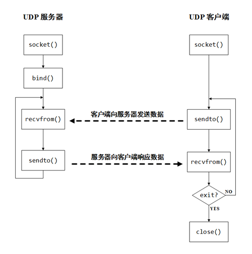

# P15_网络编程之UDP

## 流程图



**socket中TCP与UDP通信步骤有所不同，不同的是UDP服务器端还是使用bind绑定本机对应IP与端口后，直接就可以接收了。客户端使用socket后，就可以发送数据了。无连接协议好像通信更简洁**

**UDP 通信步骤**

UDP (User Datagram Protocol) 是一种无连接的协议。这意味着在通信开始之前，客户端和服务器端之间不需要建立专门的连接。每个数据包都是独立发送的，不保证顺序、可靠性和不重复。

**UDP 服务器端步骤:**

1. **创建 Socket (套接字):**  使用 `socket()` 函数创建一个 UDP socket。需要指定协议族 (如 `AF_INET` for IPv4) 和 socket 类型 (`SOCK_DGRAM` for UDP)。

```c
int sockfd = socket(AF_INET, SOCK_DGRAM, 0);
if (sockfd == -1) {
    perror("socket");
    exit(EXIT_FAILURE);
}
```

2. **绑定地址和端口 (Bind):** 使用 `bind()` 函数将 socket 绑定到服务器的 IP 地址和端口号。客户端将会向这个地址和端口发送数据。

```c
struct sockaddr_in server_addr;
memset(&server_addr, 0, sizeof(server_addr));
server_addr.sin_family = AF_INET;          // IPv4
server_addr.sin_addr.s_addr = INADDR_ANY; // 监听所有地址
server_addr.sin_port = htons(端口号);      // 服务器端口号 (例如 8888)

if (bind(sockfd, (struct sockaddr *)&server_addr, sizeof(server_addr)) == -1) {
    perror("bind");
    close(sockfd);
    exit(EXIT_FAILURE);
}
```

**`INADDR_ANY`**:  `INADDR_ANY` 是一个特殊的地址，表示服务器监听所有可用的网络接口（IP 地址）。这意味着服务器可以接收来自任何网络接口的数据。如果您想绑定到特定的 IP 地址，可以将 `server_addr.sin_addr.s_addr` 设置为相应的 IP 地址（例如使用 `inet_addr("192.168.1.100")`）。

**`htons()`**:  `htons()` 函数用于将主机字节序的端口号转换为网络字节序。网络通信中通常使用网络字节序（大端序）。

3. **接收数据 (Receive):**  使用 `recvfrom()` 函数接收来自客户端的数据。`recvfrom()` 会阻塞进程，直到收到数据为止。它不仅接收数据，还能获取发送端的地址信息（IP 地址和端口号）。

```c
struct sockaddr_in client_addr;
socklen_t client_addr_len = sizeof(client_addr);
char buffer[BUFFER_SIZE]; // 定义接收缓冲区，BUFFER_SIZE 需要根据实际情况定义
int recv_len;

recv_len = recvfrom(sockfd, buffer, BUFFER_SIZE, 0,
                       (struct sockaddr *)&client_addr, &client_addr_len);

if (recv_len == -1) {
    perror("recvfrom");
    close(sockfd);
    exit(EXIT_FAILURE);
}

printf("收到来自 %s:%d 的数据: %s\n",
       inet_ntoa(client_addr.sin_addr), ntohs(client_addr.sin_port), buffer);
```

**`recvfrom()`**:  `recvfrom()` 函数的参数包括 socket 文件描述符、接收缓冲区、缓冲区大小、标志位（通常为 0）、用于存储发送端地址信息的结构体指针和地址长度指针。

**`inet_ntoa()` 和 `ntohs()`**:  `inet_ntoa()` 函数将网络字节序的 IP 地址转换为点分十进制字符串（例如 "192.168.1.100"），方便打印和显示。`ntohs()` 函数将网络字节序的端口号转换为主机字节序。

4. **发送数据 (可选):**  如果服务器需要向客户端发送响应，可以使用 `sendto()` 函数。需要指定目标客户端的地址信息（在 `recvfrom()` 中已经获取）。

```c
const char *response = "服务器已收到数据!";
sendto(sockfd, response, strlen(response), 0,
       (struct sockaddr *)&client_addr, client_addr_len);
```

**`sendto()`**:  `sendto()` 函数的参数包括 socket 文件描述符、要发送的数据缓冲区、数据长度、标志位（通常为 0）、目标地址结构体指针和地址长度

5. **关闭 Socket (Close):**  通信结束后，使用 `close()` 函数关闭 socket。

```c
close(sockfd);
```

**UDP 客户端步骤:**

1. **创建 Socket (套接字):**  客户端也需要创建 UDP socket，步骤与服务器端相同。

```c
int sockfd = socket(AF_INET, SOCK_DGRAM, 0);
if (sockfd == -1) {
    perror("socket");
    exit(EXIT_FAILURE);
}
```

2. **发送数据 (Send):**  使用 `sendto()` 函数向服务器端发送数据。需要指定服务器端的地址信息（IP 地址和端口号）。

```c
struct sockaddr_in server_addr;
memset(&server_addr, 0, sizeof(server_addr));
server_addr.sin_family = AF_INET;             // IPv4
server_addr.sin_addr.s_addr = inet_addr("服务器IP地址"); // 服务器 IP 地址，例如 "127.0.0.1" 或公网 IP
server_addr.sin_port = htons(服务器端口号);         // 服务器端口号，例如 8888

const char *message = "Hello, UDP Server!";
sendto(sockfd, message, strlen(message), 0,
       (struct sockaddr *)&server_addr, sizeof(server_addr));
```

客户端通常 **不需要 `bind()`**  本地地址和端口。操作系统会自动为客户端分配一个临时的、可用的端口号。如果客户端需要绑定到特定的本地地址或端口（例如，需要使用固定的源端口进行通信），也可以使用 `bind()` 函数，但这在一般客户端程序中不常见。

3. **接收数据 (可选):**  如果客户端需要接收服务器端的响应，可以使用 `recvfrom()` 函数。

```c
char buffer[BUFFER_SIZE];
struct sockaddr_in server_addr_response; // 用于接收响应的地址信息 (可选，通常不需要)
socklen_t server_addr_len_response = sizeof(server_addr_response);
int recv_len;

recv_len = recvfrom(sockfd, buffer, BUFFER_SIZE, 0,
                       (struct sockaddr *)&server_addr_response, &server_addr_len_response);

if (recv_len == -1) {
    perror("recvfrom");
    close(sockfd);
    exit(EXIT_FAILURE);
}

printf("收到服务器响应: %s\n", buffer);
```

4. **关闭 Socket (Close):**  通信结束后，使用 `close()` 函数关闭 socket。

```c
close(sockfd);
```

## 相关API

### `sendto()` 函数

`sendto()` 函数是用于在无连接的套接字（例如 `SOCK_DGRAM` 类型的套接字，通常用于 UDP 协议）上发送数据报的系统调用。 与面向连接的套接字（例如 `SOCK_STREAM` 类型的套接字，通常用于 TCP 协议）使用的 `send()` 函数不同，`sendto()` 函数允许您在每次发送数据时指定目标地址。 这使得 `sendto()` 非常适合于 UDP 协议，因为 UDP 是无连接的，每个数据报都需要携带目标地址信息。

```c
#include <sys/types.h>
#include <sys/socket.h>

ssize_t sendto(int sockfd, const void *buf, size_t len, int flags,
                 const struct sockaddr *dest_addr, socklen_t addrlen);
```

**`sockfd` (套接字文件描述符)**:

- 类型： `int`
- 描述：  这是一个已创建的套接字的文件描述符。 您需要先使用 `socket()` 系统调用创建一个套接字，并确保其类型是 `SOCK_DGRAM` (或其他无连接类型)。  这个套接字将用于发送数据。

**`buf` (发送缓冲区)**:

- 类型： `const void *`
- 描述：  指向要发送数据的缓冲区的指针。  `sendto()` 将从这个缓冲区读取数据并发送出去。  您需要确保这个缓冲区包含了您想要发送的实际数据。 由于类型是 `const void *`， 它可以指向任何类型的数据，但您需要确保在 `len` 参数中指定了正确的长度。

**`len` (数据长度)**:

- 类型： `size_t`
- 描述：  指定要从 `buf` 缓冲区发送的数据的长度 (字节数)。  `sendto()` 将发送 `buf` 中从起始位置开始的 `len` 字节的数据。  请确保 `len` 的值不超过 `buf` 实际可用的数据长度。

**`flags` (标志)**:

- 类型： `int`

- 描述：  这是一个可选参数，用于修改 `sendto()` 操作的行为。  您可以将其设置为 0 或使用以下标志的组合 (通过按位或 `|` 运算)：

  - **`MSG_DONTROUTE`**:

    - 描述：  告诉 `sendto()` 不要使用通常的路由查找。  这通常用于将数据包发送到与本地网络直接连接的目标地址。  如果您确信目标主机与您在同一网络，并且您希望绕过路由表查找以提高效率或出于特定网络配置的目的，可以使用此标志。

  - **`MSG_CONFIRM`**:

    - 描述：  (Linux 2.3 及以上版本支持)  在发送数据之前，尝试执行网络层确认。  这通常用于检测死网关 (dead gateway)。  但是请注意，这个标志只是尽力而为的尝试，并不能保证可靠的确认。

  - **`MSG_DONTWAIT` (或 `O_NONBLOCK` 套接字标志)**:

    - 描述：  如果设置了这个标志，并且发送操作会阻塞 (例如，发送缓冲区已满)， `sendto()` 将立即返回 `EAGAIN` 或 `EWOULDBLOCK` 错误，而不是阻塞等待。 这对于非阻塞 I/O 操作非常有用。  您也可以在创建套接字时使用 `O_NONBLOCK` 标志来设置非阻塞模式，效果相同。

  - **`MSG_MORE`**:

    - 描述：  (Linux 2.4.4 及以上版本支持)  告诉内核，发

      送方还有更多数据要发送。  这通常用于优化 TCP_CORK 机制，但对于 UDP 协议，其效果可能不明显。  在某些情况下，它可以提高性能，尤其是在发送大量小数据包时。

        

  - **`MSG_NOSIGNAL`**:

    - 描述：  阻止在发生错误时不产生 `SIGPIPE` 信号。  当向已关闭的套接字写入数据时，默认行为是产生 `SIGPIPE` 信号，这可能导致程序终止。  使用 `MSG_NOSIGNAL` 可以防止这种情况发生，错误将作为 `sendto()` 的返回值返回，您可以进行错误处理。

- 通常情况下，如果您不需要特殊的行为，可以将 `flags` 参数设置为 `0`。

**`dest_addr` (目标地址结构)**:

- 类型： `const struct sockaddr *`
- 描述：  指向包含目标地址信息的 `sockaddr` 结构体的指针。  由于 `sendto()` 用于无连接的套接字，您需要在每次发送数据时指定目标地址。  `sockaddr` 结构体是一个通用的地址结构，您需要根据实际的网络协议 (例如 IPv4 或 IPv6) 使用其特定的子类型，例如 `sockaddr_in` (用于 IPv4) 或 `sockaddr_in6` (用于 IPv6)。

**`addrlen` (地址长度)**:

- 类型： `socklen_t`
- 描述：  指定 `dest_addr` 参数指向的地址结构体的长度 (字节数)。  您需要根据您使用的地址结构体类型 (例如 `sockaddr_in` 或 `sockaddr_in6`) 设置正确的长度。  可以使用 `sizeof(struct sockaddr_in)` 或 `sizeof(struct sockaddr_in6)` 来获取长度。

**返回值**

- **成功时**:  `sendto()` 函数返回实际发送出去的字节数。  这可能小于您在 `len` 参数中指定的长度，但只有在发生错误时才会发生这种情况。  在正常情况下，返回值应该等于 `len`。
- **错误时**:  `sendto()` 函数返回 `-1`，并设置全局变量 `errno` 来指示错误类型。  常见的 `errno` 值包括：
  - `EBADF`:  `sockfd` 不是一个有效的打开的文件描述符。
  - `EFAULT`:  `buf` 或 `dest_addr` 指向的地址无效 (例如，访问了进程的地址空间之外的内存)。
  - `EINVAL`:  参数无效。  例如，`addrlen` 的值对于地址族来说是无效的。
  - `EMSGSIZE`:  数据报太大，无法发送。  这通常发生在数据报加上 IP 和 UDP 头部后超过了网络的最大传输单元 (MTU)。
  - `ENETDOWN`:  网络接口已关闭。
  - `ENOMEM`:  内存不足。
  - `ENOSR`:  没有可用的 STREAMS 资源。
  - `EOPNOTSUPP`:  `flags` 参数中指定了不支持的标志。
  - `EPIPE` 或 `ECONNRESET`:  尝试向已关闭的连接的套接字发送数据 (虽然 `sendto()` 通常用于无连接的 UDP，但在某些特殊情况下也可能发生)。
  - `EAGAIN` 或 `EWOULDBLOCK`:  套接字被设置为非阻塞模式 (`O_NONBLOCK` 或 `MSG_DONTWAIT` 标志)，并且发送操作会阻塞。  在这种情况下，您应该稍后重试发送操作。
  - `ENETUNREACH`, `EHOSTUNREACH`, `EPROTOTYPE`:  网络不可达或协议错误。

#### 示例

演示如何使用 `sendto()` 函数通过 UDP 发送数据到一个指定的目标地址和端口。

```c
#include <stdio.h>
#include <stdlib.h>
#include <string.h>
#include <sys/types.h>
#include <sys/socket.h>
#include <arpa/inet.h>
#include <netinet/in.h>
#include <unistd.h>
#include <errno.h>

#define SERVER_IP   "127.0.0.1" // 目标服务器 IP 地址 (localhost)
#define SERVER_PORT 8888        // 目标服务器端口号
#define BUF_SIZE    1024

int main() {
    int sockfd;
    struct sockaddr_in server_addr;
    char buffer[BUF_SIZE] = "Hello, UDP Server!"; // 要发送的数据
    socklen_t server_addr_len = sizeof(server_addr);
    ssize_t bytes_sent;

    // 1. 创建 UDP 套接字
    sockfd = socket(AF_INET, SOCK_DGRAM, 0);
    if (sockfd < 0) {
        perror("socket() failed");
        exit(EXIT_FAILURE);
    }

    // 2. 设置服务器地址结构
    memset(&server_addr, 0, sizeof(server_addr));
    server_addr.sin_family = AF_INET;
    server_addr.sin_port = htons(SERVER_PORT); // 端口号，需要转换为网络字节序
    if (inet_pton(AF_INET, SERVER_IP, &server_addr.sin_addr) <= 0) { // IP 地址转换
        perror("inet_pton() failed");
        close(sockfd);
        exit(EXIT_FAILURE);
    }

    // 3. 使用 sendto() 发送数据
    bytes_sent = sendto(sockfd, buffer, strlen(buffer), 0,
                         (struct sockaddr *)&server_addr, server_addr_len);
    if (bytes_sent < 0) {
        perror("sendto() failed");
        close(sockfd);
        exit(EXIT_FAILURE);
    }

    printf("Sent %zd bytes to %s:%d\n", bytes_sent, SERVER_IP, SERVER_PORT);

    // 4. 关闭套接字
    close(sockfd);

    return 0;
}
```

#### 总结

**我发现UDP与TCP的socket通信的区别了： TCP客户端连接后，后续发送就不用指定目标地址与端口了。 但是UDP每次发送都要指定目标地址与端口 前置只需要使用文件描述符就可以实现发送与接收。 后者的话客户端和服务器端接收和发送都要指定目标地址与端口？**

**TCP (面向连接)**:

- **连接建立后，后续发送无需指定目标地址和端口**:  TCP 是面向连接的协议。在客户端和服务器端建立连接 (通过 `connect()` 系统调用) 之后，这个连接就唯一地确定了通信双方。  后续使用 `send()` 发送数据时，操作系统已经知道数据应该发送到哪个已连接的对端，因此 **不需要** 每次都指定目标地址和端口。
- **前置需要建立连接**:  TCP 通信 **必须** 先通过三次握手建立连接。这个连接建立的过程就包含了确定通信双方地址和端口的信息。

**UDP (无连接)**:

- **每次发送都要指定目标地址和端口**: UDP 是无连接的协议。 每次使用 `sendto()` 发送数据报时，都需要明确告诉操作系统，这个数据报要发往哪个目标地址和端口。因为 UDP 不维护连接状态，每次发送都是一个独立的操作，需要显式地指定目的地。
- **无需预先建立连接**: UDP 通信 **不需要** 像 TCP 那样先建立连接。客户端和服务器端可以直接发送和接收数据报。

**UDP 发送 (send):**

- **客户端发送 (Client to Server):**  **客户端每次使用 `sendto()` 发送数据到服务器时，都 \*必须\* 指定服务器的 IP 地址和端口。**  这是 UDP 无连接性的本质决定的。客户端需要告诉操作系统数据要发给谁。  就像您寄信，每次寄信都要写上收件人的地址。
- **服务器端发送 (Server to Client):**  **服务器端使用 `sendto()` 发送数据回客户端时，也 \*必须\* 指定客户端的 IP 地址和端口。**  服务器需要知道要把响应发送回哪个客户端。  这就像服务器回复您的信件，也需要写上您的地址才能寄回给您。

**UDP 接收 (receive):**

- **客户端接收 (Client receives from Server):**
  - 客户端通常使用 `recvfrom()` 函数来接收 UDP 数据报。
  - **`recvfrom()` 函数会返回发送端的地址和端口**:  当客户端使用 `recvfrom()` 接收到来自服务器的数据报时，**`recvfrom()` 函数会自动填充一个 `sockaddr_in` (或 `sockaddr_in6`) 结构体，其中包含了 \*发送端\* (即服务器端) 的 IP 地址和端口。**  客户端可以通过检查这个结构体来获取服务器端的地址信息。
  - **客户端接收时 \*不需要\* 预先指定服务器地址**:  客户端在调用 `recvfrom()` 时，**并不需要** 预先知道或指定数据会从哪个地址和端口发来。  `recvfrom()` 会接收任何发到客户端自己绑定的端口的数据报，并告知数据报的来源。
- **服务器端接收 (Server receives from Client):**
  - 服务器端也通常使用 `recvfrom()` 函数来接收 UDP 数据报。
  - **`recvfrom()` 函数会返回发送端的地址和端口**:  当服务器使用 `recvfrom()` 接收到来自客户端的数据报时，**`recvfrom()` 函数也会自动填充一个 `sockaddr_in` (或 `sockaddr_in6`) 结构体，其中包含了 \*发送端\* (即客户端) 的 IP 地址和端口。** 服务器可以通过检查这个结构体来获取客户端的地址信息。
  - **服务器端接收时 \*不需要\* 预先指定客户端地址**: 服务器在调用 `recvfrom()` 时，**也 \*不需要\* 预先知道或指定数据会从哪个地址和端口发来。**  服务器监听在某个端口，`recvfrom()` 会接收任何发到这个端口的数据报，并告知数据报的来源。

**总结 UDP 的地址端口指定：**

| 操作         | 发送 (send)                                                  | 接收 (receive)                                               | 是否需要指定目标/来源地址端口？                  |
| ------------ | ------------------------------------------------------------ | ------------------------------------------------------------ | ------------------------------------------------ |
| **客户端**   | `sendto()` -  **需要** 指定服务器的 IP 地址和端口            | `recvfrom()` - **不需要** 预先指定服务器地址，`recvfrom()` 返回发送端 (服务器) 地址端口 | 发送时需要，接收时 `recvfrom()` **自动获取来源** |
| **服务器端** | `sendto()` - **需要** 指定客户端的 IP 地址和端口 (通常从 `recvfrom()` 获取) | `recvfrom()` - **不需要** 预先指定客户端地址，`recvfrom()` 返回发送端 (客户端) 地址端口 | 发送时需要，接收时 `recvfrom()` **自动获取来源** |

**关键理解：**

- **UDP 是无连接的，所以每次发送数据都必须 “自包含” 目标地址信息。**
- **`recvfrom()` 函数的强大之处在于，它不仅接收数据，还 \*同时\* 告诉您数据是从哪里来的 (发送端的地址和端口)。**  这使得 UDP 服务器可以处理来自不同客户端的请求，并正确地将响应发送回对应的客户端，即使 UDP 是无连接的。

好的，当然，我很乐意继续为您详细介绍 Linux socket 网络编程中的 `recvfrom()` API 及其参数的使用。

### **`recvfrom()` 函数**

`recvfrom()` 函数是用于在无连接的套接字 (例如 `SOCK_DGRAM` 类型的套接字，通常用于 UDP 协议) 上接收数据报的系统调用。  与面向连接的套接字 (例如 `SOCK_STREAM` 类型的套接字，通常用于 TCP 协议) 使用的 `recv()` 函数不同，`recvfrom()` 函数不仅可以接收数据，还可以获取发送方的地址信息。 这对于无连接的协议 (如 UDP) 非常重要，因为每个接收到的数据报都可能来自不同的发送者。

```c
#include <sys/types.h>
#include <sys/socket.h>

ssize_t recvfrom(int sockfd, void *buf, size_t len, int flags,
                  struct sockaddr *src_addr, socklen_t *addrlen);
```

**`sockfd` (套接字文件描述符)**:

- 类型： `int`
- 描述：  这是一个已创建的套接字的文件描述符。  您需要先使用 `socket()` 系统调用创建一个套接字，并确保其类型是 `SOCK_DGRAM` (或其他无连接类型)。  这个套接字将用于接收数据。  通常，在服务器端，您会先 `bind()` 这个套接字到一个特定的本地地址和端口，以便监听来自客户端的数据。

**`buf` (接收缓冲区)**:

- 类型： `void *`
- 描述：  指向接收缓冲区的指针。  `recvfrom()` 将接收到的数据存储到这个缓冲区中。  您需要分配足够的内存空间来存储预期接收的数据。

**`len` (缓冲区长度)**:

- 类型： `size_t`
- 描述：  指定接收缓冲区的最大长度 (字节数)。  `recvfrom()` 最多会接收 `len` 字节的数据。  如果接收到的数据报长度超过 `len`， 剩余的数据可能会被截断 (取决于套接字类型和选项，对于 UDP 通常会被丢弃)。  因此，选择合适的 `len` 值非常重要，要确保它足够大以容纳您期望接收的数据报。

**`flags` (标志)**:

- 类型： `int`
- 描述：  这是一个可选参数，用于修改 `recvfrom()` 操作的行为。  您可以将其设置为 0 或使用以下标志的组合 (通过按位或 `|` 运算)：
  - **`MSG_PEEK`**:
    - 描述：  窥视接收到的数据。 如果指定了这个标志，`recvfrom()` 会返回数据报的内容，但是 **数据不会从接收队列中移除**。  也就是说，下次调用 `recvfrom()` 仍然可以再次接收到相同的数据报。  这对于在不实际读取数据的情况下检查数据报的内容非常有用。
  - **`MSG_TRUNC`**:
    - 描述：  (对于 `SOCK_DGRAM` 套接字)  即使实际接收到的数据报长度超过了 `buf` 的长度 `len`， 也返回数据报的真实长度。  通常情况下，如果数据报超过 `len`，多余的数据会被丢弃，并且 `recvfrom()` 返回实际复制到 `buf` 中的字节数。  使用 `MSG_TRUNC` 标志后，即使数据被截断，`recvfrom()` 的返回值仍然是完整的数据报长度。  您可以通过比较返回值和 `len` 来判断数据是否被截断。  请注意，即使使用了 `MSG_TRUNC`， 实际存入 `buf` 的数据仍然最多只有 `len` 字节。
  - **`MSG_WAITALL`**:
    - 描述：  阻塞操作，直到接收到请求的 `len` 字节数据 (对于 `SOCK_STREAM` 套接字，在数据流完整到达之前阻塞)。  但是，对于 `SOCK_DGRAM` 套接字，由于 UDP 是数据报协议， `recvfrom()` 通常一次接收一个完整的数据报，所以 `MSG_WAITALL` 对 `SOCK_DGRAM` 的影响可能有限。  它仍然会等待至少接收到一个完整的数据报，但不会等待凑够 `len` 字节，因为 UDP 数据是按数据报为单位发送和接收的。  如果接收过程中发生错误或连接断开，`recvfrom()` 可能会提前返回，即使没有接收到 `len` 字节。
  - **`MSG_DONTWAIT` (或 `O_NONBLOCK` 套接字标志)**:
    - 描述：  非阻塞 I/O 操作。  如果设置了这个标志，并且没有数据可接收，`recvfrom()` 将立即返回 `EAGAIN` 或 `EWOULDBLOCK` 错误，而不是阻塞等待。  这对于非阻塞 I/O 多路复用 (例如 `select`, `poll`, `epoll`) 非常有用。  您也可以在创建套接字时使用 `O_NONBLOCK` 标志来设置非阻塞模式，效果相同。
  - **`MSG_ERRQUEUE`**:
    - 描述：  (用于接收套接字错误队列中的错误信息)。  通常用于接收异步错误，例如来自网络协议栈的 ICMP 错误消息。  这通常用于高级网络编程和诊断。
  - **`MSG_CMSG_CLOEXEC`**:
    - 描述：  (与控制消息一起使用，例如 `SCM_RIGHTS` 传递文件描述符时)  在接收到控制消息中的文件描述符后，自动设置文件描述符的 close-on-exec 标志 (`FD_CLOEXEC`)。 这有助于防止子进程意外地继承父进程传递的文件描述符，增强安全性。

**`src_addr` (源地址结构)**:

- 类型： `struct sockaddr *`
- 描述：  指向一个 `sockaddr` 结构体的指针。  **这个结构体用于存储 \*发送方\* 的地址信息。**  当 `recvfrom()` 函数成功返回时，它会用发送数据报的源地址 (IP 地址和端口) 填充这个结构体。  您需要根据实际的网络协议 (例如 IPv4 或 IPv6) 使用其特定的子类型，例如 `sockaddr_in` (用于 IPv4) 或 `sockaddr_in6` (用于 IPv6)。  **在调用 `recvfrom()` 之前，您需要先分配 `sockaddr_in` 或 `sockaddr_in6` 结构体的内存空间，并将 `src_addr` 指向这块内存。**
  - `sockaddr`, `sockaddr_in`, `sockaddr_in6`, `in_addr`, `in6_addr` 结构体的定义与 `sendto()` 函数的参数 `dest_addr` 中的解释相同，请参考之前的说明。

**`addrlen` (地址长度)**:

- 类型： `socklen_t *`
- 描述：  指向一个 `socklen_t` 类型的变量的指针。  **在调用 `recvfrom()` 之前，您需要先设置 `addrlen` 指向的变量的值为 `src_addr` 指向的地址结构体的长度。**  例如，如果您使用 `sockaddr_in`， 则需要将 `*addrlen` 设置为 `sizeof(struct sockaddr_in)`。   **当 `recvfrom()` 函数成功返回时，内核会更新 `addrlen` 指向的值，将其设置为实际存储在 `src_addr` 结构体中的地址长度。**  虽然在大多数情况下，您设置的初始长度和返回的长度会相同， 但在某些特殊情况下 (例如，如果传递给 `recvfrom()` 的 `addrlen` 指向的长度太小)，返回的长度可能会有所不同。  因此，建议在调用 `recvfrom()` 前设置 `addrlen` 为预期长度，并在调用后检查其返回值，以确保地址信息被正确读取。

**返回值**

- **成功时**:  `recvfrom()` 函数返回实际接收到的字节数。  如果接收到 0 字节，表示对端正常关闭了连接 (但这在 UDP 中并不常见，因为 UDP 是无连接的。 返回 0 通常只发生在 TCP 连接中，表示连接已关闭)。  对于 UDP，如果接收到 0 字节，可能意味着接收缓冲区中没有数据。
- **错误时**:  `recvfrom()` 函数返回 `-1`，并设置全局变量 `errno` 来指示错误类型。  常见的 `errno` 值包括：
  - `EBADF`:  `sockfd` 不是一个有效的打开的文件描述符。
  - `EFAULT`:  `buf` 或 `src_addr` 或 `addrlen` 指向的地址无效。
  - `EINVAL`:  参数无效。
  - `ECONNREFUSED`:  尝试连接被拒绝 (虽然 `recvfrom()` 用于 UDP，但在某些情况下也可能发生，例如接收到 ICMP 端口不可达错误)。
  - `EINTR`:  接收操作被信号中断。
  - `EAGAIN` 或 `EWOULDBLOCK`:  套接字被设置为非阻塞模式 (`O_NONBLOCK` 或 `MSG_DONTWAIT` 标志)，并且没有数据可接收。  在这种情况下，您应该稍后重试接收操作。
  - `ENOMEM`:  内存不足。
  - `ENOSR`:  没有可用的 STREAMS 资源。
  - `ENOTCONN`:  尝试在未连接的套接字上进行面向连接的操作 (虽然 `recvfrom()` 用于无连接的 UDP，但在某些特殊情况下也可能发生)。
  - `ENOTSOCK`:  文件描述符不是一个套接字。

#### 示例

演示如何使用 `recvfrom()` 函数接收 UDP 数据，并获取发送方的地址和端口。  这个例子可以与之前的 `sendto()` 示例代码配合使用，构成一个简单的 UDP 客户端-服务器程序。

```c
#include <stdio.h>
#include <stdlib.h>
#include <string.h>
#include <sys/types.h>
#include <sys/socket.h>
#include <arpa/inet.h>
#include <netinet/in.h>
#include <unistd.h>
#include <errno.h>

#define SERVER_PORT 8888        // 服务器监听端口
#define BUF_SIZE    1024

int main() {
    int sockfd;
    struct sockaddr_in server_addr, client_addr;
    char buffer[BUF_SIZE];
    socklen_t client_addr_len = sizeof(client_addr);
    ssize_t bytes_received;

    // 1. 创建 UDP 套接字
    sockfd = socket(AF_INET, SOCK_DGRAM, 0);
    if (sockfd < 0) {
        perror("socket() failed");
        exit(EXIT_FAILURE);
    }

    // 2. 设置服务器地址结构 (绑定本地地址和端口)
    memset(&server_addr, 0, sizeof(server_addr));
    server_addr.sin_family = AF_INET;
    server_addr.sin_port = htons(SERVER_PORT); // 监听端口，需要转换为网络字节序
    server_addr.sin_addr.s_addr = INADDR_ANY; // 监听所有本地地址 (0.0.0.0)

    if (bind(sockfd, (struct sockaddr *)&server_addr, sizeof(server_addr)) < 0) {
        perror("bind() failed");
        close(sockfd);
        exit(EXIT_FAILURE);
    }

    printf("UDP server listening on port %d...\n", SERVER_PORT);

    while (1) {
        // 3. 使用 recvfrom() 接收数据
        bytes_received = recvfrom(sockfd, buffer, BUF_SIZE, 0,
                                     (struct sockaddr *)&client_addr, &client_addr_len);
        if (bytes_received < 0) {
            perror("recvfrom() failed");
            close(sockfd);
            exit(EXIT_FAILURE);
        }

        // 接收到 0 字节在 UDP 中通常不代表连接关闭，而是可能只是没有数据到达
        if (bytes_received == 0) {
            printf("No data received, or client might have closed (UDP is connectionless).\n");
            continue; // 继续等待接收
        }

        // 4. 获取客户端地址信息
        char client_ip_str[INET_ADDRSTRLEN]; // 用于存储点分十进制 IP 地址字符串
        inet_ntop(AF_INET, &client_addr.sin_addr, client_ip_str, INET_ADDRSTRLEN); // IP 地址转换

        unsigned short client_port = ntohs(client_addr.sin_port); // 端口号，从网络字节序转换为主机字节序

        printf("Received %zd bytes from %s:%d\n", bytes_received, client_ip_str, client_port);
        printf("Data: %.*s\n", (int)bytes_received, buffer); // 打印接收到的数据 (注意长度限制，防止缓冲区溢出)

        // 可以选择性地回复客户端 (使用 sendto()，目标地址和端口就是 client_addr 中获取的信息)
        // ... (回复客户端的代码，例如使用 sendto() 将 "Hello, Client!" 发送回 client_addr) ...

        memset(buffer, 0, BUF_SIZE); // 清空缓冲区，准备接收下一次数据
    }

    close(sockfd); // 实际上，这个循环通常不会退出，所以 close() 可能不会被执行到

    return 0;
}
```

## 综合示例

**Linux中，socket的UDP通信。 要实现客户端与服务器端双向通信，每个端是不是可以使用父子进程实现发送与接收？ 每一个端再开辟一个共享内存用于存档接收的数据？ 这个想法是最佳实践吗？**

你的想法是一个可行的方案，但要判断是否为“最佳实践”，我们需要更深入地分析，并了解其他的替代方案。

**你的想法概括：**

- **双向通信：**  客户端和服务器端都需要能够发送和接收数据。

- 父子进程：

   每个端（客户端和服务器端）都创建一个父进程和一个子进程。

  - **父进程:** 负责接收数据。
  - **子进程:** 负责发送数据。

- **共享内存:**  每个端开辟一块共享内存区域，用于存储接收到的数据。

**让我们逐步分析这个方案的优缺点，并探讨更优的实践方式。**

**1. 父子进程实现发送与接收的分析**

**缺点:**

- **进程创建和管理开销 (Overhead of Process Management):**  进程的创建、销毁和进程间通信 (IPC) 比线程开销更大，尤其是在需要频繁创建和销毁进程或者进程间通信频繁的场景下，系统资源消耗会比较明显。对于轻量级的通信需求，进程方式可能显得过于重量级。
- **进程间通信 (IPC) 复杂性 (Complexity of IPC):**  父子进程需要使用进程间通信机制（例如，共享内存、管道、消息队列等）来协调工作和共享数据。这增加了程序的复杂性，需要仔细设计和实现进程间同步和互斥，以避免数据竞争和死锁等问题。共享内存虽然高效，但也需要额外的同步机制来保证数据的一致性。
- **资源消耗 (Resource Consumption):**  每个进程都有独立的地址空间和系统资源，相比于线程，进程会占用更多的内存和系统资源。在高并发或者资源受限的环境下，过多的进程可能会成为性能瓶颈。

**2. 共享内存用于存档接收数据的分析**

**缺点:**

- **同步和互斥 (Synchronization and Mutual Exclusion):**  多个进程同时访问共享内存时，需要使用同步机制（例如，互斥锁、信号量等）来保护共享数据，避免数据竞争和不一致性问题。同步机制的引入增加了程序的复杂性，并且如果同步控制不当，可能会降低程序的并发性能，甚至导致死锁。
- **错误处理和数据一致性 (Error Handling and Data Consistency):**  当进程操作共享内存时发生错误，或者进程异常终止时，需要考虑如何保证共享内存数据的一致性和完整性。例如，需要考虑使用原子操作或者事务机制来更新共享内存中的数据，以避免数据损坏。
- **地址空间管理 (Address Space Management):**  使用共享内存需要进行地址空间的映射和管理，这涉及到操作系统层面的操作，相对来说比线程间共享数据要复杂一些。需要确保所有访问共享内存的进程都正确地映射了共享内存区域，并且在不再使用共享内存时正确地释放资源。

### 修改2

**简单来讲的话，我觉得可以使用一个进程中的多线程。比如主线程main创建两个线程。一个线程用于发送，一个线程用于接收。两者的缓冲区分别都使用两个进程的全局变量。 接收线程中使用while（1）实现循环接收。接收多少打印多少。发送线程也可以循环从标准输入流中读取数据实现一直发送？**

使用单进程多线程的方式来实现UDP双向通信，从概念上和实现上来说都更加简单和轻量级，对于很多应用场景来说，这确实是一个非常实用和常见的选择，甚至可以说更接近于“最佳实践”了，尤其是对于您描述的这种简单双向通信需求。

**使用单进程多线程的UDP双向通信方案：**

- **进程结构：**  程序运行在一个进程中。

- 线程结构：

  - **主线程 (main 线程)：**  负责程序的初始化工作，例如创建和管理接收线程和发送线程，以及可能的其他控制逻辑。
  - **接收线程 (Receiver Thread)：** 专职负责接收UDP数据报。在一个无限循环 `while(1)` 中不断监听UDP Socket，一旦接收到数据，就进行处理（例如，打印到控制台或者存储到全局缓冲区）。
  - **发送线程 (Sender Thread)：**  专职负责发送UDP数据报。可以从标准输入流（`stdin`）循环读取用户输入的数据，或者从全局缓冲区中读取待发送的数据，然后通过UDP Socket发送出去。

- 数据缓冲区：

    您提到使用全局变量作为缓冲区，这在单进程多线程环境中是可行的，因为全局变量在同一个进程的所有线程之间都是共享的。  可以设置两个全局缓冲区：

  - **接收缓冲区 (Receive Buffer)：** 用于接收线程存放接收到的UDP数据。
  - **发送缓冲区 (Send Buffer)：**  用于发送线程存放待发送的UDP数据（如果发送数据来源不仅仅是标准输入，可能需要发送缓冲区）。

**这种方案的优点：**

- **更简单：**  相比于父子进程方案，单进程多线程模型在程序结构上更简洁，进程间通信简化为线程间共享内存（全局变量），避免了复杂的进程间通信机制。
- **更轻量级：**  线程的创建、销毁和上下文切换开销远小于进程，资源消耗更低。
- **高效的数据共享：**  线程共享进程的地址空间，全局变量可以直接在线程间共享数据，数据访问效率高。
- **易于实现和维护：**  线程间的同步和互斥机制（例如，互斥锁、条件变量）相对进程间通信更容易理解和使用。

**实现细节和注意事项：**

1. **线程创建和管理 (pthread)：**  在Linux C中，可以使用 `pthread` 库来创建和管理线程。需要包含 `<pthread.h>` 头文件，并在编译时链接 `pthread` 库 (`-lpthread` 编译选项)。
2. **UDP Socket 的创建和绑定：**  需要在主线程或者接收线程中创建UDP Socket (`socket(AF_INET, SOCK_DGRAM, 0)`)，并进行绑定 (`bind()`)，监听指定的IP地址和端口。对于客户端，通常不需要 `bind()`，而是让操作系统自动分配端口。
3. **接收线程的循环接收：**  接收线程的主体是一个 `while(1)` 循环，循环内部调用 `recvfrom()` 函数来接收UDP数据。 `recvfrom()` 是阻塞函数，如果没有数据到达，线程会阻塞等待。一旦接收到数据，`recvfrom()` 返回，线程可以处理接收到的数据，然后继续下一次循环等待。
4. **发送线程的循环发送（从标准输入读取）：**  发送线程也可以使用 `while(1)` 循环，循环内部：
   - 从标准输入流 `stdin` 读取用户输入的数据，例如使用 `fgets()` 或者 `scanf()`。
   - 调用 `sendto()` 函数将读取到的数据通过UDP Socket发送出去。
5. **全局缓冲区的使用：**  全局变量可以作为接收缓冲区和发送缓冲区。
   - **接收缓冲区：** 接收线程在 `recvfrom()` 接收到数据后，可以将数据复制到接收缓冲区中。主线程或者其他线程可以读取接收缓冲区的数据进行进一步处理（例如，打印）。
   - **发送缓冲区：**  如果发送数据来源不仅仅是标准输入，而是需要程序内部产生或者从其他地方获取，可以使用发送缓冲区。发送线程从发送缓冲区读取数据并发送。
6. **线程同步和互斥 (如果需要)：**  在简单的示例中，如果接收线程只是打印数据，发送线程只是从标准输入读取并发送，可能不需要显式的线程同步和互斥。但是，如果：
   - 多个线程需要同时访问和修改全局缓冲区。
   - 需要保证接收缓冲区的数据在被打印或处理之前不被覆盖。
   - 发送缓冲区的数据在被发送线程读取之前不被修改。 那么，就需要使用互斥锁 (`pthread_mutex_t`) 来保护对共享资源的访问，避免数据竞争和不一致性问题。  对于您描述的简单场景，可能暂时不需要，但良好的编程习惯是在设计时就考虑到潜在的并发问题。
7. **错误处理：**  在Socket操作、线程创建、数据接收和发送等环节，都需要进行错误检查，例如检查 `socket()`、`bind()`、`recvfrom()`、`sendto()`、`pthread_create()` 等函数的返回值，并进行相应的错误处理，例如打印错误信息、退出程序等。

### 单进程多线程方案实现

服务器端代码 (server.c)

```c
#include <stdio.h>
#include <stdlib.h>
#include <string.h>
#include <unistd.h>
#include <arpa/inet.h>
#include <pthread.h>
#include <sys/socket.h>

#define BUFFER_SIZE 1024
#define SERVER_PORT 8888

int server_fd;                      // 服务器socket文件描述符
struct sockaddr_in client_addr;     // 客户端地址
socklen_t client_addr_len = sizeof(client_addr);

// 接收线程函数
void *recv_thread_func(void *arg) {
    char recv_buffer[BUFFER_SIZE];
    while (1) {
        // 接收客户端消息
        ssize_t recv_len = recvfrom(server_fd, recv_buffer, BUFFER_SIZE - 1, 0, 
                                   (struct sockaddr *)&client_addr, &client_addr_len);
        if (recv_len == -1) {
            perror("接收失败");
            continue;
        }
        recv_buffer[recv_len] = '\0'; // 确保字符串以空字符结尾
        printf("服务器接收线程收到: %s 来自 %s:%d\n", recv_buffer,inet_ntoa(client_addr.sin_addr), ntohs(client_addr.sin_port));
    }
    return NULL;
}

// 发送线程函数
void *send_thread_func(void *arg) {
    char send_buffer[BUFFER_SIZE];
    while (1) {
        // 如果还没有接收到客户端消息，等待
        if (client_addr.sin_addr.s_addr == 0) {
            printf("等待客户端连接...\n");
            sleep(1);
            continue;
        }

        // 从标准输入读取消息
        printf("请输入要发送的数据: ");
        fgets(send_buffer, BUFFER_SIZE, stdin);
        send_buffer[strcspn(send_buffer, "\n")] = 0; // 去掉换行符

        if (strlen(send_buffer) > 0) {
            // 发送消息给客户端
            ssize_t send_len = sendto(server_fd, send_buffer, strlen(send_buffer), 0, 
                                     (struct sockaddr *)&client_addr, client_addr_len);
            if (send_len == -1) {
                perror("发送失败");
            } else {
                printf("已发送: %s 到 %s:%d\n", send_buffer, 
                       inet_ntoa(client_addr.sin_addr), ntohs(client_addr.sin_port));
            }
        }
    }
    return NULL;
}

int main() {
    struct sockaddr_in server_addr;
    pthread_t recv_thread, send_thread;

    // 创建UDP socket
    server_fd = socket(AF_INET, SOCK_DGRAM, 0);
    if (server_fd == -1) {
        perror("socket创建失败");
        exit(EXIT_FAILURE);
    }

    // 设置服务器地址
    memset(&server_addr, 0, sizeof(server_addr));
    server_addr.sin_family = AF_INET;
    server_addr.sin_addr.s_addr = INADDR_ANY; // 绑定到本地所有接口
    server_addr.sin_port = htons(SERVER_PORT);

    // 绑定socket到地址
    if (bind(server_fd, (struct sockaddr *)&server_addr, sizeof(server_addr)) == -1) {
        perror("绑定失败");
        close(server_fd);
        exit(EXIT_FAILURE);
    }

    printf("UDP服务器启动，监听端口 %d...\n", SERVER_PORT);

    // 初始化客户端地址
    memset(&client_addr, 0, sizeof(client_addr));

    // 创建接收线程
    if (pthread_create(&recv_thread, NULL, recv_thread_func, NULL) != 0) {
        perror("接收线程创建失败");
        close(server_fd);
        exit(EXIT_FAILURE);
    }

    // 创建发送线程
    if (pthread_create(&send_thread, NULL, send_thread_func, NULL) != 0) {
        perror("发送线程创建失败");
        close(server_fd);
        exit(EXIT_FAILURE);
    }

    // 分离线程，让它们在后台运行
    pthread_detach(recv_thread);
    pthread_detach(send_thread);

    // 主线程保持运行
    while (1) {
        sleep(1);
    }

    close(server_fd);
    return 0;
}
```

客户端代码 (client.c)

```c
#include <stdio.h>
#include <stdlib.h>
#include <string.h>
#include <unistd.h>
#include <arpa/inet.h>
#include <pthread.h>
#include <sys/socket.h>

#define BUFFER_SIZE 1024
#define SERVER_IP "127.0.0.1"
#define SERVER_PORT 8888

int client_fd;                      // 客户端socket文件描述符
struct sockaddr_in server_addr;     // 服务器地址
socklen_t server_addr_len = sizeof(server_addr);

// 接收线程函数
void *recv_thread_func(void *arg) {
    char recv_buffer[BUFFER_SIZE];
    while (1) {
        // 接收服务器消息
        ssize_t recv_len = recvfrom(client_fd, recv_buffer, BUFFER_SIZE - 1, 0, (struct sockaddr *)&server_addr, &server_addr_len);
        if (recv_len == -1) {
            perror("接收失败");
            continue;
        }
        recv_buffer[recv_len] = '\0'; // 确保字符串以空字符结尾
        printf("客户端接收线程收到: %s 来自 %s:%d\n", recv_buffer,inet_ntoa(server_addr.sin_addr), ntohs(server_addr.sin_port));
    }
    return NULL;
}

// 发送线程函数
void *send_thread_func(void *arg) {
    char send_buffer[BUFFER_SIZE];
    while (1) {
        // 从标准输入读取消息
        printf("请输入要发送的数据: ");
        fgets(send_buffer, BUFFER_SIZE, stdin);
        send_buffer[strcspn(send_buffer, "\n")] = 0; // 去掉换行符

        if (strlen(send_buffer) > 0) {
            // 发送消息给服务器
            ssize_t send_len = sendto(client_fd, send_buffer, strlen(send_buffer), 0, 
                                     (struct sockaddr *)&server_addr, server_addr_len);
            if (send_len == -1) {
                perror("发送失败");
            } else {
                printf("已发送: %s\n", send_buffer);
            }
        }
    }
    return NULL;
}

int main() {
    pthread_t recv_thread, send_thread;

    // 创建UDP socket
    client_fd = socket(AF_INET, SOCK_DGRAM, 0);
    if (client_fd == -1) {
        perror("socket创建失败");
        exit(EXIT_FAILURE);
    }

    // 设置服务器地址
    memset(&server_addr, 0, sizeof(server_addr));
    server_addr.sin_family = AF_INET;
    server_addr.sin_addr.s_addr = inet_addr(SERVER_IP);
    server_addr.sin_port = htons(SERVER_PORT);

    printf("UDP客户端启动，连接到 %s:%d...\n", SERVER_IP, SERVER_PORT);

    // 创建接收线程
    if (pthread_create(&recv_thread, NULL, recv_thread_func, NULL) != 0) {
        perror("接收线程创建失败");
        close(client_fd);
        exit(EXIT_FAILURE);
    }

    // 创建发送线程
    if (pthread_create(&send_thread, NULL, send_thread_func, NULL) != 0) {
        perror("发送线程创建失败");
        close(client_fd);
        exit(EXIT_FAILURE);
    }

    // 分离线程，让它们在后台运行
    pthread_detach(recv_thread);
    pthread_detach(send_thread);

    // 主线程保持运行
    while (1) {
        sleep(1);
    }

    close(client_fd);
    return 0;
}
```

编译和运行

```
gcc -o server server.c -pthread
gcc -o client client.c -pthread
```

先启动服务器：

```
./server
```

再启动客户端：

```
./client
```

## 总结

**Linux，对于socket的UDP的双向通信来讲，服务器端在接收数据之前，是拿不到发送客户端的信息的。除非服务器一开始就知道客户端的信息，否则不可能主动发送数据到客户端？**

在Linux下，基于socket的UDP双向通信中，服务器端在接收数据之前确实无法获取客户端的信息。除非服务器端事先知道客户端的IP地址和端口号，否则它无法主动向客户端发送数据。以下是对这个问题的详细解释：

**UDP通信的特点**

UDP（User Datagram Protocol）是一种无连接的协议，与TCP不同，它不通过握手过程建立持久的连接。每次发送的数据包（称为数据报，datagram）都是独立的，发送方和接收方之间没有状态维持。  

- 发送数据：发送方通过sendto函数指定接收方的IP地址和端口号，将数据报发送出去。  
- 接收数据：接收方通过recvfrom函数接收数据，同时获取发送方的IP地址和端口号。


**服务器端在接收数据之前无法获取客户端信息**

在UDP通信中，服务器端只有在接收到客户端发送的数据后，才能知道客户端的地址信息。具体流程如下：  

- 接收数据的系统调用：服务器端使用recvfrom函数等待客户端的数据。当数据到达时，recvfrom不仅返回数据内容，还会填充一个sockaddr_in结构体，其中包含客户端的IP地址和端口号。  
- 无预先信息：在接收到数据之前，服务器端没有任何关于客户端的信息。因为UDP没有连接建立的过程，服务器无法提前获知谁会发送数据。

因此，服务器端在接收数据之前是完全“被动”的，无法主动获知客户端的身份。


**服务器端主动发送数据到客户端的前提**

如果服务器端想要在没有接收到客户端数据的情况下主动发送数据，它必须满足以下条件：  

- 预先知道客户端地址：服务器需要提前获取客户端的IP地址和端口号。这可以通过以下方式实现：  
  - 客户端注册：客户端在启动时主动向服务器发送一条消息，告知自己的地址。  
  - 配置文件或外部输入：服务器通过配置文件、数据库或其他外部机制获知客户端的地址。  
  - 广播或多播：服务器可以通过广播（发送到局域网内所有设备）或多播（发送到特定组）的方式发送数据，而无需知道具体客户端地址。但这种方式是特殊的，客户端仍需主动接收数据。
- 无预先知识的限制：在标准的UDP通信中，如果服务器端没有通过任何方式获取客户端的地址，它无法主动发送数据，因为它不知道数据应该发往哪里。


**典型的UDP通信流程**

在大多数UDP双向通信场景中，交互流程如下：  

1. 客户端发起通信：客户端首先向服务器发送数据，数据报中包含客户端的源IP地址和端口号。  
2. 服务器接收并记录：服务器通过recvfrom接收数据，同时获取客户端的地址信息。  
3. 服务器响应：服务器使用sendto函数向客户端的地址发送响应数据。

这种流程依赖于客户端的主动发起，服务器才能“反向”通信。

## 疑问

**在linux中，UDP的socket双向通信中，服务器端需要bind(),绑定IP和端口。以便客户端知道发送的目标与端口。**
**客户端发送时，系统会临时bind()分配一个ip和端口。这样的话服务器就可以通过接收函数得知数据来源了？**
**自此通讯双方都知道了彼此的ip和端口，就可以实现双向通信了？**

**服务器端的工作原理**

在Linux中，服务器端要实现UDP通信，首先需要通过bind()函数将socket绑定到一个特定的IP地址和端口上。绑定的作用是：

- **固定服务器的地址**：让服务器监听一个已知的IP和端口，客户端才能准确地将数据发送到这个地址。
- **接收客户端数据**：绑定后，服务器可以通过recvfrom()函数接收来自客户端的数据包。

recvfrom()函数不仅能获取数据内容，还会返回发送方的IP地址和端口号。这样，服务器就知道了客户端的地址信息。


**客户端的工作原理**

客户端在发送数据时，需要明确指定目标地址，即服务器的IP和端口。客户端调用sendto()函数发送数据时，如果客户端的socket没有显式绑定一个端口，操作系统会自动为客户端分配一个**临时的IP和端口**。这个过程可以看作是系统隐式地执行了一个临时的bind()操作：

- **临时端口**：通常由操作系统随机选择一个可用端口。
- **数据发送**：客户端将数据包发送到服务器的IP和端口，数据包中会携带客户端的临时IP和端口信息。

服务器接收到数据后，通过recvfrom()获取客户端的IP和端口，从而知道数据的来源。

### 双向通信的实现

一旦服务器通过recvfrom()获取了客户端的IP和端口，通信双方就都知道了对方的地址信息：

- **服务器 → 客户端**：服务器可以使用sendto()函数，向客户端的IP和端口发送数据。
- **客户端 → 服务器**：客户端继续使用服务器的IP和端口发送数据。

客户端也可以通过recvfrom()接收服务器的响应，并确认服务器的地址（虽然通常客户端已经知道服务器的地址）。

这种机制使得UDP socket实现了双向通信。关键点在于：

1. **服务器绑定固定地址**：通过bind()确保客户端能找到服务器。
2. **客户端临时地址**：系统自动分配，服务器通过接收函数获知。
3. **显式指定目标**：由于UDP无连接，每次发送数据时都需要指定对方的IP和端口。

## 与TCP通信的区别

**Linux中，socket中的TCP和UDP网络通信。 两者不一样的是： 在将socket套接字绑定地址和端口后。 TCP服务器需要listen监听对应套接字的连接请求，再转接给accept返回一个专属于对应客户端的socket文件描述符，之后服务器与客户端通信都使用它进行双向通信。 UDP是无连接协议，所以服务器bind绑定地址与端口后，客户端就可以直接通过这个IP和端口与服务器通信，服务器通过接收函数，可以得知接收数据对应的客户端信息，从而实现双向通信。 两者在流程上最大的区别就是不用listen监听与accept接受连接？**

**TCP（传输控制协议）**：

- **面向连接**：TCP 是基于连接的协议，通信前需要建立连接。
- 流程：
  1. 服务器端调用 socket() 创建套接字。
  2. 使用 bind() 绑定地址和端口。
  3. 调用 listen() 将套接字置于监听状态，等待客户端连接请求。
  4. 调用 accept() 接受客户端的连接请求，返回一个新的 socket 文件描述符（专用于与该客户端通信）。
  5. 服务器和客户端通过这个新的 socket 文件描述符进行双向通信（send() 和 recv()）。
- **特点**：需要三次握手建立连接，保证数据可靠传输（有序、无丢失）。

**UDP（用户数据报协议）**：

- **无连接**：UDP 是无连接的协议，不需要事先建立连接。
- 流程：
  1. 服务器端调用 socket() 创建套接字。
  2. 使用 bind() 绑定地址和端口。
  3. 直接使用 recvfrom() 接收客户端发送的数据，同时获取客户端的地址和端口信息。
  4. 使用 sendto() 根据客户端的地址和端口信息发送数据，实现双向通信。
- **特点**：无需监听和接受连接，数据传输不保证可靠性（可能丢包、无序）。

**TCP** 需要 listen() 和 accept()，因为它是面向连接的协议，必须通过这两步完成连接的建立：

- listen()：将套接字设置为被动监听状态，准备接受连接。
- accept()：从连接请求队列中取出一个客户端连接，生成一个新的 socket 用于通信。

**UDP** 不需要这两步，因为它是无连接的，服务器只需要绑定地址和端口后，就可以直接接收和发送数据。客户端的地址信息通过 recvfrom() 获取，不需要额外的连接建立过程。

### 补充说明

- **TCP 的双向通信**：建立连接后，服务器和客户端通过专属的 socket 文件描述符进行全双工通信（双向同时进行）。
- **UDP 的双向通信**：虽然 UDP 是无连接的，但通过 recvfrom() 和 sendto()，服务器可以根据收到的数据包中的客户端地址动态响应，实现“逻辑上的双向通信”。