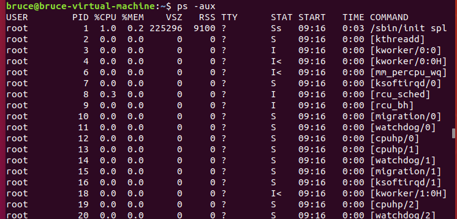
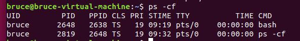

# P7_进程控制

## PS命令查看进程



- USER：进程所属的用户，即启动该进程的用户的用户名。
- PID：进程ID（Process ID），是系统中每个进程的唯一标识符，可用于**管理进程（例如通过kill命令终止进程或用renice调整优先级）。**
- %CPU：进程当前使用的CPU时间百分比，表示该进程**占用了多少CPU资源**。
- %MEM：进程当前使用的物理内存（RAM）百分比，表示该进程**占用了多少内存资源**。
- VSZ：虚拟内存大小（Virtual Size），以千字节（KB）为单位，表示进程分配的全部虚拟内存，包括在RAM中的内存和换出到磁盘的部分。
- RSS：驻留集大小（Resident Set Size），以千字节（KB）为单位，表示进程实际使用的物理内存部分（不包括换出到磁盘的内存）。
- TTY：进程关联的控制终端。如果显示为?，表示**该进程不与任何终端关联，例如后台运行的守护进程**。
- STAT：进程的当前状态，常见的状态标记包括：
  - R：运行中或可运行（在运行队列中）。
  - S：可中断睡眠（等待某个事件完成）。
  - D：不可中断睡眠（通常在等待I/O操作）。
  - Z：僵尸进程（进程已终止但尚未被父进程回收）。
  - T：停止（通常由作业控制信号或调试器暂停）。
  - 可能还会有附加标记，例如<（高优先级）、N（低优先级）、+（前台进程组）。
- START：进程启动的时间。如果是当天启动的进程，显示具体时间（如14:30）；如果在之前几天启动，则可能显示日期。
- TIME：进程自启动以来累计使用的CPU时间，通常以分钟:秒格式显示（如0:05表示5秒）。
- COMMAND：启动该进程的命令或程序名称，显示进程正在执行的具体任务。

这些列提供了进程的详细信息，帮助你监控和管理系统中的资源使用情况、进程状态及行为。例如，可以通过PID终止某个进程，通过%CPU和%MEM识别资源占用过高的进程，或者通过STAT检查进程是否正常运行。

### 与Windows任务管理器的区别

Linux中的ps命令在某种程度上类似于Windows下的任务管理器，但两者之间存在显著的区别，不能简单地说它“就是任务管理器，只不过没有图形化界面和操作”。

**相似之处**

ps命令和任务管理器的确有一些共同点：

- 查看进程信息：两者都可以显示系统中正在运行的进程的详细信息，例如进程ID（PID）、CPU使用率、内存使用情况等。
- 监控资源：它们都能帮助用户了解各个进程对系统资源的占用情况，比如识别哪个进程占用了大量CPU或内存。
- 进程管理基础：任务管理器可以直接管理进程（比如结束任务），而ps命令虽然主要用于查看进程，但结合其他命令（如kill）也能实现类似的管理功能。

**不同之处**

尽管有相似之处，ps命令和任务管理器在以下几个方面有明显差异：

界面

- 任务管理器：这是一个图形化界面工具（GUI），用户可以通过鼠标点击和拖动来查看信息和操作进程，非常直观。
- ps命令：完全基于命令行，没有图形界面。用户需要输入命令（比如ps aux）并通过文本输出查看结果，操作门槛相对较高。

功能范围

- 任务管理器：除了进程管理，它还提供了更多功能，比如：
  - 系统性能监控（CPU、内存、磁盘、网络使用情况）
  - 管理服务
  - 查看和编辑启动项
  - 用户会话管理 因此，它是一个综合性的系统工具。
- ps命令：功能更专注，主要用于列出进程的详细信息，其他功能（如终止进程、调整优先级）需要依赖额外的命令（如kill或renice）。

操作方式

- 任务管理器：操作简单直观，比如右键点击一个进程就能选择“结束任务”，或者通过菜单调整优先级。
- ps命令：操作更间接。用户需要先用ps查出进程的PID，然后输入其他命令（如kill 1234）来管理进程，步骤较多。

使用场景

- 任务管理器：适合普通用户在本地桌面环境中使用，尤其是在需要快速、直观操作时。
- ps命令：更适合命令行环境，比如通过SSH远程管理Linux服务器，因为这种情况下图形界面通常不可用。

ps命令可以看作任务管理器“进程”选项卡的一个简化版，专注于查看和管理进程，但没有图形界面，也没有任务管理器的其他丰富功能。因此，它更像是任务管理器的一部分功能在命令行中的实现，而不是完全等价的工具。

### PS AUX与CF的区别



- PPID：父进程ID（Parent Process ID），表示创建该进程的父进程的ID。

- CLS：调度类（Scheduling Class），表示进程的调度策略（例如，TS 表示时间共享调度）。

- PRI：优先级（Priority），表示进程的调度优先级。数值越低，优先级越高。
- TTY：终端类型（Teletype），表示进程关联的控制终端（例如，pts/0 表示伪终端）。
  - 显示？的话是系统运行的进程，后台守护进程。

**显示的进程范围**

- ps aux：显示所有用户的进程信息。  
  - a：显示所有用户的进程。  
  - u：以用户为中心的格式显示详细信息。  
  - x：包括没有控制终端的进程（如后台守护进程）。
- ps cf：显示当前用户的进程信息。  
  - c：以紧凑格式显示进程信息。  
  - f：以完全格式显示（通常包括进程树结构）。

**显示格式**

- ps aux
  - 以详细的表格形式显示，每个进程占一行，包含多个字段。
    这种格式适合需要查看大量进程详细信息的情况。  
- ps cf
  - 以紧凑的列表形式显示，侧重于进程的层次关系。
    使用 f 选项（forest）会以树状结构显示进程的父子关系，适合查看进程依赖。

**关于 ps aux**

当你使用 ps aux 时，即使你没有主动运行什么程序，也会看到系统中存在大量的进程。这是正常的。这些进程大多是系统运行所必需的进程，它们负责维持操作系统的正常运作。例如：

- 系统进程：如 /sbin/init 或 systemd，这是系统的第一个进程，负责启动其他服务。
- 守护进程：如 sshd（SSH 服务）、cron（定时任务）等，用于处理网络连接或后台任务。
- 内核线程：操作系统底层的一些线程。

ps aux 的作用是显示所有用户的所有进程，包括：

- 系统进程。
- 后台进程。
- 其他用户的进程（如果你有权限查看）。

所以，即使你没有手动运行程序，系统中仍然会有许多进程在运行，这些是操作系统正常工作的一部分。

**关于 ps cf**

当你使用 ps cf 时，你注意到它只显示了你当前的进程，比如你打开的 bash 和运行的 ps cf 命令本身。这是 ps cf 的特性决定的。

- ps cf 的作用：
  - 只显示当前用户的进程，不会包括其他用户的进程或系统进程。
  - c 选项表示紧凑格式，f 选项表示以树状结构显示进程的父子关系。

## 消灭进程命令

在Linux系统中，“消灭”进程（即终止进程）的主要命令是 kill。以下是详细说明和所需参数：

kill 命令

- 作用：向指定的进程发送信号，默认情况下发送 SIGTERM 信号，请求进程优雅地终止。
- 基本用法：kill [信号] PID
- 所需参数：
  - PID：进程的ID。你可以通过 ps 命令查看，例如 ps aux，找到目标进程的PID。
  - [信号]：可选，指定发送的信号类型。常见信号包括：
    - SIGTERM（15）：默认信号，请求进程自行退出。
    - SIGKILL（9）：强制终止进程，立即停止运行。
- 示例：
  - **优雅终止**：kill 1234（终止PID为1234的进程）
  - **强制终止**：kill -9 1234（强制终止PID为1234的进程）

其他可选命令

- pkill：根据进程名终止进程。
  - 用法：pkill 进程名
  - 示例：pkill firefox（终止所有名为firefox的进程）
- killall：类似 pkill，按进程名终止。
  - 示例：killall firefox

注意事项

- 使用 kill -9 时要小心，它不会给进程清理的机会，可能导致数据丢失。
- 终止进程需要有相应权限，通常是进程的所有者或root用户。

## 获取进程pid与ppid

在 Linux 中，可以使用以下两个系统调用来获取进程的 ID：

- **getpid()**：返回当前进程的进程号（PID）。
- **getppid()**：返回当前进程的父进程号（PPID）。

这两个函数都定义在头文件 `<unistd.h>` 中，而 `<sys/types.h>` 则提供了 `pid_t` 类型， `<stdio.h>` 用于输入输出操作。

```c
#include <sys/types.h>
#include <unistd.h>
#include <stdio.h>

int main() {
    pid_t pid = getpid();    // 获取当前进程的 PID
    pid_t ppid = getppid();  // 获取父进程的 PID

    printf("当前进程ID: %d\n", pid);
    printf("父进程ID: %d\n", ppid);

    return 0;
}
```

## 进程相关名词

- 父子进程
  - 进程里面最常见一个父子进程。  大多数进程都不是凭空产生的，往往由另一个进程的产生的，此时这个**两个进程就属于父子进程**。
  - 其**中父子进程，最顶层父进程称为祖先进程**—对应的PID号=1。编写代码的时候，一般会int main() --- 调用对应的fork函数—子进程
  - 注意：**子进程运行结束后**，需要**父进程收回子进程的空间**，目的**防止僵尸进程的产生**

- 祖先进程

  - 计算机启动的时候，BIOS从磁盘上引导加载系统程序—linux系统里面uboot对应的就是引导程序，并将Linux系统装入到内存中，内核进行一些初始化工作，建立一个**进程0,系统原始进程，原则上不算在进程内；**
  - 进程0再创建进程1,进程1是以后创建的所有进程的祖先进程（pid==1）,进程1负责对所有进程的初始化和管理，并且shell进程也是由进程1创建的。

- 守护进程

  - 下面提供一个简单的守护进程示例，该程序会在后台运行，并每隔一段时间（例如 60 秒）将当前时间写入日志文件。示例中展示了如何通过调用 `fork()`、`setsid()`、`chdir()`、`umask()` 以及关闭标准文件描述符来创建一个守护进程

  - ```c
    #include <stdio.h>
    #include <stdlib.h>
    #include <unistd.h>
    #include <sys/types.h>
    #include <sys/stat.h>
    #include <fcntl.h>
    #include <time.h>
    
    int main(void) {
        pid_t pid, sid;
        
        // 第一步：创建子进程
        pid = fork();
        if (pid < 0) {
            exit(EXIT_FAILURE);
        }
        // 父进程退出，子进程继续运行
        if (pid > 0) {
            exit(EXIT_SUCCESS);
        }
        
        // 第二步：子进程脱离终端，创建新会话
        sid = setsid();
        if (sid < 0) {
            exit(EXIT_FAILURE);
        }
        
        // 第三步：改变工作目录，防止占用挂载点
        if (chdir("/") < 0) {
            exit(EXIT_FAILURE);
        }
        
        // 第四步：重置文件模式掩码
        umask(0);
        
        // 第五步：关闭标准文件描述符（可选）
        close(STDIN_FILENO);
        close(STDOUT_FILENO);
        close(STDERR_FILENO);
        
        // 主循环：每隔 60 秒执行一次任务
        while (1) {
            FILE *fp = fopen("/tmp/daemon.log", "a+");
            if (fp != NULL) {
                time_t now = time(NULL);
                fprintf(fp, "守护进程运行时间：%s", ctime(&now));
                fclose(fp);
            }
            sleep(60);  // 暂停 60 秒
        }
        
        return EXIT_SUCCESS;
    }
    ```

    - **fork() 分离进程**
      - 使用 `fork()` 创建子进程，父进程退出，从而保证子进程与启动终端分离。

    - **setsid() 脱离会话**
      - 子进程调用 `setsid()` 创建一个新的会话，成为新会话的领导者，并脱离控制终端。

    - **chdir("/") 更改工作目录**
      - 通常将工作目录改为根目录，以避免占用可能会卸载的文件系统。

    - **umask(0) 重置文件权限掩码**
      - 清除文件创建时的权限掩码，确保守护进程创建文件时不会受到限制。

    - **关闭标准文件描述符**
      - 关闭标准输入、输出和错误输出，避免守护进程意外使用终端。

    - **主循环执行任务**
      - 在无限循环中，每隔 60 秒打开日志文件 `/tmp/daemon.log`，写入当前时间，模拟守护进程周期性执行某个任务。

- 僵尸进程

  - 当子进程结束后，系统会保留一部分信息（如退出状态）在进程表中，等待父进程调用 `wait()` 或 `waitpid()` 来回收这些信息。如果父进程一直没有回收，子进程的进程表项就一直存在，此时子进程就处于“僵尸”状态。
    这种情况就像在使用 `malloc()` 分配内存后，没有调用 `free()` 回收内存，导致系统内部遗留垃圾，从而可能对系统产生负面影响。

  - 下面的示例程序中，父进程调用 `fork()` 创建了一个子进程。子进程打印一条信息后退出，而父进程则休眠一段时间（例如 30 秒）而没有调用 `wait()` 来回收子进程。这段时间内，子进程就会处于僵尸状态。

  - ```c
    #include <stdio.h>
    #include <stdlib.h>
    #include <unistd.h>
    #include <sys/types.h>
    // <sys/wait.h> 头文件包含了 wait()、waitpid() 等函数，若不回收子进程可以不使用
    
    int main(void) {
        pid_t pid = fork();
        if (pid < 0) {
            perror("fork error");
            exit(EXIT_FAILURE);
        }
    
        if (pid == 0) {
            // 子进程：打印信息后退出
            printf("子进程（PID: %d）退出\n", getpid());
            exit(EXIT_SUCCESS);
        } else {
            // 父进程：没有调用wait()，而是休眠一段时间
            printf("父进程（PID: %d）进入休眠状态，等待子进程被回收（此时子进程为僵尸状态）\n", getpid());
            sleep(30);  // 在这30秒内，子进程将处于僵尸状态
            // 如果在这里调用 wait(NULL); 则可以回收子进程，使其退出僵尸状态
        }
        return 0;
    }
    ```

    - 当调用 `fork()` 时，操作系统会创建一个新的独立进程，也就是**子进程**。这时，原来的进程称为**父进程**。两者从 `fork()` 之后开始并发执行，但它们是相互独立的，不会互相干扰。

    - 如何区分子进程和父进程

      - **`fork()` 的返回值**：

        - 在**子进程**中，`fork()` 返回 0。
        - 在**父进程**中，`fork()` 返回子进程的 PID（一个正数）。

      - 常用以下方式来判断当前执行代码属于哪个进程：

      - ```c
        pid_t pid = fork();
        if (pid == 0) {
            // 这里的代码只在子进程中执行
        } else if (pid > 0) {
            // 这里的代码只在父进程中执行
        } else {
            // fork 出错
        }
        ```

      - 使用 `if (pid == 0)` 来判断是否在子进程中，是标准的做法。

    - 从单个进程的角度来看，一个 if-else 结构只能走其中一条路径。但是调用 fork() 后，会产生两个独立的进程：

      - **子进程**：在子进程中，fork() 返回 0，因此它会执行 if (pid == 0) 分支。
      - **父进程**：在父进程中，fork() 返回子进程的 PID（大于 0），因此它会执行 else if (pid > 0) 分支。

      - 因此，虽然每个进程内部只能走一条分支，但父子进程分别走不同的分支，从而实现并发执行两条代码路径。
      - fork() 调用后会产生两个独立的进程，**它们都从 fork() 调用后开始执行后续代码。但由于 fork() 返回值不同，父进程返回的是子进程的 PID，而子进程返回 0，所以可以通过判断这个返回值来分辨并执行不同的任务路径。**

- 孤儿进程

  - 孤儿进程是指当父进程在子进程运行期间提前退出时，子进程就会成为一个孤儿进程。在 Linux 系统中，孤儿进程不会因为失去了原来的父进程而无人照料，而是会被系统的 init（或 systemd）进程收养。收养后的孤儿进程，其父进程 ID（PPID）会变成 init 的 PID（通常为 1），这样在子进程结束时，init 进程会负责回收其资源，确保系统资源得到合理释放。

  - 下面是一个简单的示例代码，演示父进程先退出，而子进程延迟后再执行，从而形成孤儿进程。你可以运行这个程序，然后在子进程中观察到它的父进程 ID发生了变化：

  - ```c
    #include <stdio.h>
    #include <stdlib.h>
    #include <unistd.h>
    #include <sys/types.h>
    
    int main(void) {
        pid_t pid = fork();
    
        if (pid < 0) {
            perror("fork error");
            exit(EXIT_FAILURE);
        } else if (pid == 0) {
            // 子进程
            printf("子进程开始运行，PID: %d, 父进程 PID: %d\n", getpid(), getppid());
            // 延时 10 秒，让父进程有足够时间退出
            sleep(10);
            // 延时后查看父进程 ID，此时应该被 init 进程收养
            printf("子进程延时后运行，PID: %d, 父进程 PID: %d (应该为 init 进程的 PID)\n", getpid(), getppid());
            exit(EXIT_SUCCESS);
        } else {
            // 父进程
            printf("父进程运行中，PID: %d，即将退出，子进程 PID: %d\n", getpid(), pid);
            // 父进程立即退出
            exit(EXIT_SUCCESS);
        }
    }
    ```

    

  - **僵尸进程**：
    当子进程结束后，如果父进程没有及时调用 `wait()` 或 `waitpid()` 回收子进程的退出状态，子进程的相关信息（如退出码）会一直保留在系统的进程表中，此时子进程就成为了僵尸进程。虽然僵尸进程本身不占用大量内存，但如果数量过多，会耗尽进程表项资源。
  - **孤儿进程**：
  - 如果父进程在子进程结束前就提前退出了，那么子进程就失去了原有的父进程，此时它会被系统的 init（或 systemd）进程收养，这样就成了孤儿进程。孤儿进程仍然正常运行，并且在结束时由 init 进程回收其资源。

## 进程控制相关函数

### 运行进程—API函数

**函数调用**：

普通函数调用是**在当前进程内调用已经编译并链接到程序中的函数**。这些函数可以来自程序自己写的代码，也可以来自标准库或者第三方库。头文件只是用来声明这些函数，而实际函数的定义是在编译后的目标文件或库中。调用普通函数不会涉及创建新进程，开销比较小，且执行效率高。

**system() 调用**：

system() 会启动一个新的 shell 进程，并在该进程中执行你提供的命令或脚本。它的优势在于可以**执行外部程序、脚本、或者任何 shell 命令，超出了当前程序编译链接时包含的函数范围**。执行完外部命令后，系统会返回到原来的进程中继续执行后续代码。因为需要创建新进程、进行进程间切换，所以开销相对较大。

下面给出一个简单的例子，展示如何在一个程序中既调用外部命令（例如 ls -l）又调用自定义的函数（例如在 std.c 文件中定义的 start 函数）。

这是一个自定义源文件std.c，定义了一个 start() 函数：

```c
#include <stdio.h>

void start(void) {
    printf("这是 std.c 中的 start() 函数。\n");
}
```

在 main.c 中，我们首先使用 system() 调用执行外部命令 "ls -l"，然后调用在 std.c 中定义的 start() 函数：

```c
#include <stdlib.h>
#include <stdio.h>

// 声明 std.c 中定义的 start() 函数
void start(void);

int main(void) {
    printf("调用 system() 执行外部命令 'ls -l':\n");
    // 使用 system() 执行外部命令 ls -l
    system("ls -l");

    printf("\n调用 std.c 中的 start() 函数:\n");
    // 调用自定义函数 start()
    start();

    return 0;
}
```

- 要不写std.h进行函数声明，要么写在main.c中

C 语言是很灵活的，声明的位置其实没那么严格要求：

- 你可以写在头文件里（推荐，方便复用）。
  - 声明集中管理，不用重复写。
  - 函数改了，头文件改一次，所有用到的地方自动更新。
  - 编译器还可以对声明和定义做一致性检查（参数和返回值对不对），防止意外。
- 你也可以**直接写在 main.c 里**（main.c 自己知道这个函数，够用了）。
  - **函数声明只能 main.c 自己用**，其他文件用不到。
  - **一旦函数改了，main.c 也得改**，不方便。
  - **多人协作时，函数声明四处散落，管理困难**。

不需要 `extern`！C 语言默认情况下，**函数声明本身就具有外部链接属性**，也就是说：

- **只要函数的定义在别的 `.c` 文件里，编译时会自动去找。**
- **不需要手动加 `extern`，编译器已经默认认为它是“外部的”了。**
- `extern` 主要用于**变量**的声明，而不是函数。

### 替换进程（重要）

exec()函数族的核心作用是将当前进程的内存空间替换为新程序的内存空间，但保持进程ID不变。这意味着：

1. 执行exec()后，进程ID保持不变
2. 原进程的代码段、数据段、堆栈等都会被新程序的相应部分替换
3. exec()之后的代码通常不会被执行，因为进程已被替换

```c
#include <unistd.h>
#include <stdio.h>
#include <errno.h>
#include <string.h>

int main() {
    printf("准备执行ls命令...\n");
    
    // 执行ls命令，列出/tmp目录内容，带详细信息和显示隐藏文件
    execl("/bin/ls", "ls", "-l", "-a", "/tmp", NULL);
    
    // 如果execl执行成功，下面的代码永远不会被执行
    // 只有execl失败才会执行到这里
    printf("execl失败: %s\n", strerror(errno));
    
    return 1;
}
```

- 第一个参数 `"/bin/ls"` 是可执行文件的路径

- 第二个参数 `"ls"` 是程序名，会成为新程序的 argv[0]

- 接下来的 `"-l"`, `"-a"`, `"/tmp"` 是传递给ls命令的参数

- 最后的 `NULL` 标志着参数列表的结束

`int execl(const char *path, const char *arg, ...);`

- **path**: 要执行的程序的完整路径名。必须是绝对路径或相对路径，但不会搜索环境变量PATH。例如：`"/bin/ls"` 或 `"./myprog"`
- **arg, ...**: 这是一系列指向以null结尾的字符串的指针，代表传递给新程序的参数列表。
  - 第一个参数（arg）通常是**程序的名称**（即argv[0]）
  - **后面的参数是传递给程序的参数**
  - 最后必须以NULL结尾，表示参数列表的结束
- 调用 `execl("/bin/ls", "ls", "-l", "-a", NULL)` 等效于在命令行执行 `ls -l -a`

exec()函数族包括几个变体：

- `execl()`、`execlp()`、`execle()`
- `execv()`、`execvp()`、`execvpe()`

它们的区别主要在于参数传递方式和环境变量的处理方式。

您提到的程序更新是exec()的一个典型应用场景。在不中断服务的情况下，可以通过fork()创建子进程，然后子进程通过exec()加载新版本程序，完成平滑升级。这种方式在很多守护进程和服务程序中广泛使用。

```c
#include <unistd.h>
#include <stdio.h>
#include <sys/wait.h>

int main() {
    pid_t pid = fork();
    
    if (pid < 0) {
        // 错误处理
        perror("fork失败");
        return 1;
    } else if (pid == 0) {
        // 子进程
        printf("子进程开始，PID: %d\n", getpid());
        
        // 替换为新版本程序
        execl("./new_version", "new_version", NULL);
        
        // 如果exec失败才会执行到这里
        perror("exec失败");
        return 1;
    } else {
        // 父进程
        printf("父进程继续运行，子进程PID: %d\n", pid);
        
        // 可以等待子进程结束
        int status;
        waitpid(pid, &status, 0);
        
        printf("子进程已结束\n");
    }
    
    return 0;
}
```

#### 示例

**利用 `fork + exec` 实现 Web 服务器程序不卸载更新**

假设场景：一个旧版本的 Web 服务器程序（我们称之为 `old_webserver`）正在父进程中运行，并对外提供服务。我们需要在不中断服务的前提下，将其更新到新版本 `new_webserver`。

**步骤 1:  运行中的旧版本 Web 服务器程序 (父进程)**

- **状态：**  一个进程 (我们称之为 **父进程，PID 为 PID_parent**) 正在运行 `old_webserver` 程序。
- **功能：**  父进程监听在特定的端口（例如 80 端口），接收客户端请求，并使用旧版本的代码逻辑处理请求，提供 Web 服务。
- **关键点：**  此时，对外提供服务的是运行 `old_webserver` 程序的 **父进程**。

**步骤 2:  父进程接收到更新触发信号 (用户触发或自动检测)**

- **事件：**  父进程 `old_webserver` 接收到更新指令，这可能是用户手动触发（例如，管理员执行更新命令），或者是程序自身检测到有新版本可用。
- **父进程行为：**  父进程开始执行更新流程的准备工作，核**心是创建子进程来执行更新操作**。  **注意：此时父进程仍然持续运行并提供服务，服务没有中断。**

**步骤 3:  父进程调用 `fork()` 创建子进程**

- **系统调用：** 父进程 `old_webserver` 调用 `fork()` 系统调用。
- 子进程诞生：`fork()`创建一个新的进程，我们称之为 子进程 (PID 为 PID_child)。
  - 子进程几乎是父进程的完全副本（代码段、数据段、堆栈等，但使用写时复制技术）。
  - 子进程获得新的进程 ID (PID_child)，但父进程的 PID (PID_parent) 不变。
- **父进程行为：** `fork()` 调用返回后，父进程继续执行后续的代码， **依然运行 `old_webserver` 程序并提供服务。**
- **子进程行为：** 子进程也从 `fork()` 调用返回。此时，子进程的代码和数据与父进程相同（副本），**但子进程接下来要执行与父进程不同的操作，即加载并运行新版本程序。**

**步骤 4:  子进程在 `fork()` 返回后立即调用 `exec()`**

- **子进程行为：** 子进程 (PID_child)  **立即调用 `exec` 族函数** (例如 `execve`)。
- `exec()` 的关键操作：
  - **加载新程序：** `exec()` 加载 **新版本 Web 服务器程序 `new_webserver`** 的可执行文件。
  - **替换进程映像：**  **子进程的进程映像被 `new_webserver` 的映像完全替换。**  子进程的代码、数据、堆栈都被新的程序内容覆盖。
  - **PID 不变：**  子进程的进程 ID (PID_child)  **保持不变**。
  - **不返回 (成功时)：** `exec()` 调用成功时，不会返回到调用它的程序代码，子进程的执行流直接跳转到 `new_webserver` 的入口点。
- **父进程行为：**  父进程 (PID_parent)  **完全不受子进程 `exec()` 操作的影响，仍然运行 `old_webserver` 并提供服务。** 父进程可能不知道子进程内部发生了 `exec` 操作，除非父进程主动监控子进程。
- **结果：**  **子进程 (PID_child)  现在变成了运行 `new_webserver` 程序的进程！**  它与父进程在代码和功能上已经完全不同，但它们之间仍然存在父子进程关系。

**步骤 5:  子进程运行新版本 Web 服务器程序 (`new_webserver`)**

- 现在有两个关键进程：
  - **父进程 (PID_parent)：** 仍然运行 `old_webserver` 程序。
  - **子进程 (PID_child)：** **运行 `new_webserver` 程序。**
- 功能：
  - **父进程 (PID_parent)：**  可能继续处理旧的客户端连接，或者准备优雅关闭并退出 (取决于具体的策略)。
  - **子进程 (PID_child)：**  开始监听 Web 服务器端口（例如 80 端口，通常需要与旧进程错开或进行端口复用等处理）， **准备接管服务，接收新的客户端连接，并使用新版本的代码处理请求。**
- **服务切换 (关键步骤)：** 需要将新的客户端请求导向运行 `new_webserver` 的子进程 (PID_child)。 这通常需要负载均衡器、反向代理、或者程序自身内部的机制来完成服务切换。

**步骤 6:  父进程的 `wait()` 和 `exit()` 以及子进程成为孤儿进程**

- 父进程行为 (在你的总结中是 `wait()` 和 `exit()`，但实际可以有多种处理方式)：
  - **`wait()` 的目的 (并非必须，取决于策略)：**  父进程调用 `wait()` 族函数 (例如 `wait()`, `waitpid()`) 的**主要目的通常不是为了 “等待子进程 `exec()` 完成”**，因为 `exec()` 本身并不需要父进程等待。 `wait()`  **更常见的目的是为了回收子进程的资源，防止子进程变成僵尸进程 (zombie process)**。  然而，在 “不卸载更新” 的场景中，父进程调用 `wait()`  并立即 `exit()` 并不是最典型的做法。
  - 更常见的父进程处理方式 (在更新场景中)：父进程可能会选择 策略性地退出，例如：
    - **策略 1:  优雅关闭后退出：** 父进程先停止接受新连接，等待已有的连接处理完毕，然后优雅地退出。  此时，`wait()` 可能被用来等待子进程的退出状态（虽然在这种更新场景下，子进程通常不会主动退出，除非发生错误），但更重要的是父进程自身的优雅关闭流程。
    - **策略 2:  转型为监控进程：** 父进程可能 **不退出**，而是继续运行，成为新版本子进程的监控进程，负责监控子进程的健康状态、日志收集、错误处理等，甚至为下一次更新做准备。 在这种情况下，父进程就 **不会调用 `exit()`**。
    - **策略 3:  立即退出 (较少见)：**  父进程在子进程成功 `exec()` 后立即 `exit()`，比较简单粗暴，可能不适合需要服务平滑切换的场景。
- 子进程行为 (成为孤儿进程)：
  - 如果父进程在子进程之前 `exit()`，那么 **子进程 (PID_child) 会变成孤儿进程 (orphan process)**。
  - **init 进程接管：**  根据 Linux 的进程管理机制，当一个进程变成孤儿进程时，它的父进程会被自动设置为 **init 进程 (PID 为 1)**。  init 进程会负责 “收养” 这些孤儿进程，并在它们退出时回收资源，防止僵尸进程的产生。
  - **子进程继续运行：**  **即使父进程退出，子进程 (PID_child)  仍然会继续运行 `new_webserver` 程序，并对外提供服务，因为它已经通过 `exec()` 操作获得了独立的进程映像和执行环境。**
- **“独立进程” 的理解：**  你说的 “自此子进程就成了一个独立进程了”  这种说法略有歧义。  从某种意义上说，子进程的确 *功能独立* 了，因为它运行的是全新的程序代码。  但是，从进程关系角度看，它仍然是进程树中的一个节点，只不过如果原父进程退出，它的父进程就变成了 init 进程。  更准确的描述是 “**子进程成为孤儿进程，并被 init 进程收养，但它仍然独立运行着新版本的 Web 服务器程序**”。

**父进程 `wait()` 的合理性分析**

- **立即 `wait()` 后 `exit()`  (不合理):**  对于 “不卸载更新” 的场景，父进程在子进程 `exec` 后立即 `wait()` 并 `exit()`  **是不合理的，因为它与服务持续运行的目标相悖，也浪费了父进程作为监控和管理者的潜在作用。**
- **`wait()` 在监控/管理模式下的应用 (合理):**  在更合理的 **监控/管理模式** 下，父进程 **不应该立即 `exit()`，而是应该持续运行，并可能在某些 *特定情况下* 使用 `wait()` (例如监控到子进程异常退出时)。  此时，`wait()` 的目的是为了错误处理和资源回收，而不是作为更新流程的主线逻辑。
- **`wait()` 在优雅关闭模式下的应用 (可能合理，但不一定是核心):**  在 **优雅关闭模式** 下，父进程可能会在最终 `exit()` 之前使用 `wait()`，但更多是为了 **确保所有辅助子进程都已退出，完成资源清理**， 而不是为了等待核心服务进程 (新版本子进程) 的退出。  此时，`wait()` 也不是核心逻辑，重点是优雅关闭和切换服务。

#### wait()的触发时机

当父进程调用 `wait(NULL)` （或者 `waitpid()` 等 `wait` 族函数）时，它确实会等待其子进程的状态发生变化。 **子进程的 `exit()` 或 `exec` （以及其他一些情况，例如收到信号导致终止）都会触发父进程的 `wait(NULL)` 返回。**

父进程的 `wait(NULL)`  会等待子进程状态改变，而子进程调用 `exit()`  一定会导致状态改变（进入终止状态），从而触发 `wait(NULL)` 返回。  子进程调用 `exec`  本身 *不会*  直接触发 `wait(NULL)`，  但  `exec`  之后运行的新程序 *最终*  的 `exit()`  会导致子进程进入终止状态， 从而触发 `wait(NULL)` 返回。

### 创建进程

fork的特点：

1. **完全复制父进程**：fork会创建父进程的完整副本，包括数据段、堆栈段等
2. **写时复制(Copy-On-Write)**：现代操作系统中fork实际使用COW技术，父子进程共享物理内存页面，只有当其中一个进程尝试修改时才会创建副本
3. **独立执行**：fork之后，父子进程各自独立执行，从fork调用的返回点继续运行
   1. 在实际的多任务操作系统中，父进程和子进程被视为两个独立的进程，调度器会根据自己的算法决定哪个进程先运行。有时父进程会先执行，有时子进程会先执行，甚至在多核系统上它们可能同时并行执行。
4. **资源复制**：子进程会继承父进程的大部分资源，如打开的文件描述符
5. **执行顺序**：父子进程执行顺序不确定，由系统调度器决定
6. 子进程对变量的修改不会影响父进程

vfork的特点：

1. **共享内存空间**：vfork创建的子进程与父进程共享地址空间，不进行内存复制
2. **父进程挂起**：vfork调用后父进程会被挂起，直到子进程调用exec或exit
3. **轻量级**：因为不复制内存，所以**vfork比fork更轻量、更快速**
4. **限制严格**：子进程不应修改任何变量，因为这会影响父进程
5. **专为exec设计**：vfork主要是为了紧接着调用exec而设计的

使用场景比较：

- **fork**：适用于子进程需要执行与父进程不同的代码，且可能需要访问父进程的数据副本的场景
- **vfork**：适用于子进程仅仅是为了执行exec加载新程序的场景，可以避免不必要的内存复制

```c
#include <unistd.h>
#include <stdio.h>
#include <stdlib.h>

int main() {
    // 使用fork
    printf("使用fork()创建子进程\n");
    pid_t pid_fork = fork();
    
    if (pid_fork < 0) {
        perror("fork失败");
        exit(1);
    } else if (pid_fork == 0) {
        // 子进程
        printf("fork子进程: PID = %d, 父PID = %d\n", getpid(), getppid());
        exit(0);
    } else {
        // 父进程
        printf("fork父进程: 子PID = %d, 自身PID = %d\n", pid_fork, getpid());
    }
    
    // 使用vfork
    printf("使用vfork()创建子进程\n");
    pid_t pid_vfork = vfork();
    
    if (pid_vfork < 0) {
        perror("vfork失败");
        exit(1);
    } else if (pid_vfork == 0) {
        // 子进程
        printf("vfork子进程: PID = %d, 父PID = %d\n", getpid(), getppid());
        // 使用vfork必须调用exec或exit
        exit(0);
    } else {
        // 父进程 - 只有在子进程调用exec或exit后才会执行
        printf("vfork父进程: 子PID = %d, 自身PID = %d\n", pid_vfork, getpid());
    }
    
    return 0;
}
```

需要注意的是，vfork在现代系统中使用较少，因为fork的写时复制已经很高效，而且vfork使用不当容易导致程序错误。在大多数情况下，使用fork是更安全的选择。vfork的这种特性使其适用于子进程立即调用exec的场景，但使用不当容易导致严重问题，这也是为什么在现代系统中它的使用较少的原因。

#### **`fork()` 返回值详解**

`fork()` 函数被调用一次，但会返回两次：

1. **在父进程中，`fork()` 返回新创建的子进程的进程 ID (PID)。**
   - PID 是一个正整数，唯一标识了系统中的子进程。
   - 父进程可以通过这个 PID 来管理和控制子进程，例如使用 `kill()` 发送信号给子进程，或者使用 `wait()` 等待子进程结束。
2. **在子进程中，`fork()` 返回 0。**
   - 返回 0 是子进程区分于父进程的关键标志。
   - 子进程可以通过判断 `fork()` 的返回值是否为 0 来确定自己是子进程。
3. **如果 `fork()` 调用失败，则在父进程中返回 -1。**
   - 返回 -1 表示进程创建失败。
   - 在这种情况下，**不会创建子进程**。
   - 父进程应该检查 `fork()` 的返回值是否为 -1，并根据情况进行错误处理。
   - 通常，`fork()` 失败的原因可能包括系统资源不足（例如，进程数已达到上限、内存不足等）。

### 销毁进程

**进程在哪些情况下会被销毁？**

- 第一个：**进程运行代码执行结束 ----正常退出**

- 第二个：进程运行的时候，调用了退出函数，例如：**exit()和_exit()---正常退出**

- 第三个：使用了**ctrl键+c键 结束了当前运行的进程—给当前进程发送了一个信号**。 还有可以通过**kill强制杀死进程**。
  - 命令：kill -9 PID

- 第四个：进程**运行的时候出错，也会导致进程的销毁。**

- 补充：**return 功能**： **结束一个函数**，并**不代表结束一个进程。**
  - **exit() 功能：** **结束一个进程。**

#### exit与_exit的区别

**标准I/O缓冲区处理**：

- exit()：会刷新标准I/O缓冲区，确保缓冲中的数据被写入
- _exit()：不会刷新I/O缓冲区，可能导致缓冲数据丢失

**atexit()注册函数的执行**：

- exit()：会调用通过atexit()注册的退出处理函数
- _exit()：不会调用atexit()注册的函数

**临时文件处理**：

- exit()：会关闭并删除通过tmpfile()创建的临时文件
- _exit()：不处理临时文件

**标准库层次**：

- exit()：是C标准库函数(stdlib.h)
- _exit()：是系统调用(unistd.h)

**exit()适用场景**：

- 正常程序终止时使用
- 需要执行清理操作的情况
- 确保缓冲数据写入文件或设备
- 需要执行atexit()注册的清理函数

**_exit()适用场景**：

- 在fork()之后的子进程中，尤其是在vfork()之后
- 在发生严重错误需要立即终止的情况
- 避免刷新已被父进程刷新过的缓冲区
- 在信号处理函数中终止进程

```c
#include <stdio.h>
#include <stdlib.h>
#include <unistd.h>

void cleanup_function() {
    printf("执行清理函数\n");
}

int main() {
    atexit(cleanup_function);
    
    pid_t pid = fork();
    
    if (pid < 0) {
        perror("fork失败");
        exit(1);
    } else if (pid == 0) {
        // 子进程
        printf("子进程: 将使用_exit()退出\n");
        printf("Hello, world!\n");  // 这个有\n，大概率立即刷出去
        printf("This will be lost"); // 这个没\n，可能还在缓冲区
        // 这里使用_exit，不会刷新缓冲区，也不会执行cleanup_function
        _exit(0);
    } else {
        // 父进程
        printf("父进程: 将使用exit()退出\n");
        printf("This will be printf"); //这个会打印。 
        // 使用exit，会刷新缓冲区并执行cleanup_function
        exit(0);
    }
    
    return 0;
}
```

在vfork()之后，使用_exit()尤为重要，因为vfork创建的子进程与父进程共享地址空间：

```c
#include <stdio.h>
#include <stdlib.h>
#include <unistd.h>

int main() {
    printf("开始vfork测试\n");
    
    pid_t pid = vfork();
    
    if (pid < 0) {
        perror("vfork失败");
        exit(1);
    } else if (pid == 0) {
        // 子进程
        printf("子进程执行\n");
        // 在vfork之后使用_exit，避免刷新共享的缓冲区
        _exit(0);
    }else {
     	// 父进程继续
    	printf("父进程继续执行\n");   
    }
    
    return 0;
}
```

用`_exit()`，避免子进程清理父进程资源。

### 标准IO的三种缓冲模式

| 缓冲模式   | 触发时机                               | 适用场合                                         |
| ---------- | -------------------------------------- | ------------------------------------------------ |
| **全缓冲** | 缓冲区满了才刷出去                     | 面向**文件**的流（`fopen("file.txt", "w")`）     |
| **行缓冲** | 遇到**换行符**`\n`，或者缓冲区满了才刷 | 面向**终端（stdout）**的流（就是`printf`到终端） |
| **无缓冲** | 每次`fwrite`立刻刷出去                 | 面向**设备**的流（比如`stderr`，默认是无缓冲）   |

### 等待进程

**利用fork创建子进程，父进程任务中延迟10秒后调用wait()，子进程执行后，父进程在睡眠期间，子进程属于僵尸进程。 假设子进程任务是延迟10s，但是父进程任务中没有调用wait()，导致父进程提前结束，此时子进程就是孤儿进程。**

#### wait()与vfork的区别

wait():

- 父进程**fork**出子进程后，**父进程继续执行**，并不阻塞。

- 如果父进程**主动调用`wait()`**，它才会**阻塞**，直到有一个子进程结束。

- `wait()`只负责**回收子进程的退出状态**，防止僵尸进程。

```c
pid_t pid = fork();

if (pid == 0) {
    // 子进程代码
} else {
    // 父进程，随便做别的事
    wait(NULL);  // 等子进程
}
```

- 父进程fork完后，**立刻继续执行**，除非它主动`wait()`。
- `wait()`时，父才会卡住等子。

vfork():

- `vfork()`创建子进程后，**父进程**会**完全暂停**，必须等子进程`exec`或`_exit`之后，父进程才恢复。
- `vfork()`的设计是为了**子进程立刻执行新程序（exec）**，而不是干别的。
- 子进程运行在**父进程的地址空间**，所以父必须**停下来**，否则会干扰。

```c
pid_t pid = vfork();

if (pid == 0) {
    execl("/bin/ls", "ls", NULL);  // 子进程执行exec
    _exit(1);  // exec失败才执行这里
} else {
    // 父进程到这里时，子已经exec完了
}
```

- `vfork()`保证**子进程先跑，父进程等着**。

- `vfork()`比`fork()`快，因为不拷贝页表。
  - 共享要比复制快。

#### `vfork()`和`exec()`结合使用

- **`vfork()`**：父子进程共享地址空间，父进程必须等待子进程调用`exec()`或`_exit()`结束，才能继续执行。

- **子进程调用`exec()`**：子进程会替换其地址空间（加载新程序），并且**后续的代码不再执行**。父进程**无法利用子进程在`exec()`后修改的资源**，因为子进程的内存已经被新的程序替换。

- **父进程可以看到子进程修改的变量**：如果子进程修改了共享变量，但在**没有调用`exec()`之前**，父进程也能看到这些修改。

#### wait()与waitpid()

`wait()` 和 `waitpid()` 都是用来让父进程等待子进程的退出，以便**回收子进程的退出状态**，避免子进程成为僵尸进程。不过，它们之间有一些**重要的区别**，尤其是在参数的传递上。

`pid_t wait(int *status);`

- `status`: 一个指向整数的指针，**父进程通过这个指针**来获取子进程的**退出状态**。如果子进程正常退出，`status`存储的是子进程的退出码。如果子进程是通过信号终止的，`status`存储的是信号信息。
- **阻塞**：`wait()`会让父进程阻塞，直到有一个子进程退出，或者子进程集合中没有更多的子进程。**没有控制特定子进程**：`wait()`会等待任意一个子进程退出，并返回该子进程的PID。
- 成功时，返回**已退出的子进程的PID**。如果没有子进程，或者出现错误，返回`-1`。

`pid_t waitpid(pid_t pid, int *status, int options);`

- 参数：
  - `pid`: 指定等待哪个子进程。如果为：
    - `pid > 0`：等待指定PID的子进程。
    - `pid == 0`：等待**任意一个与父进程在同一个进程组**中的子进程。
    - `pid == -1`：等待任意一个子进程（类似于`wait()`）。
    - `pid < -1`：等待**任意一个与父进程属于同一个进程组**的子进程。
  - `status`: 同`wait()`，用来存储子进程的退出状态。
  - `options`: 这个参数是`waitpid()`特有的，可以用来控制等待行为：
    - `WNOHANG`：如果没有子进程退出，则立即返回，不会阻塞父进程。
    - `WUNTRACED`：如果子进程停止，父进程也会返回。
    - `WCONTINUED`：如果子进程因`SIGCONT`信号继续执行，父进程会收到通知。
    - 你也可以组合这些选项来更精细地控制父进程的行为。
- 特点：
  - **非阻塞等待**：通过`options`参数，`waitpid()`可以实现非阻塞等待（如`WNOHANG`）。
  - **精确控制**：父进程可以指定等待某个特定子进程，或者在某些特定条件下等待。
- 返回值：
  - 成功时，返回**已退出的子进程的PID**。
  - 如果没有符合条件的子进程，且指定了`WNOHANG`选项，则返回`0`。
  - 出现错误时，返回`-1`。

```c
#include <stdio.h>
#include <stdlib.h>
#include <sys/wait.h>
#include <unistd.h>

int main() {
    pid_t pid1 = fork();  // 创建第一个子进程
    if (pid1 == 0) {
        // 第一个子进程
        printf("第一个子进程：退出\n");
        exit(0);
    }

    pid_t pid2 = fork();  // 创建第二个子进程
    if (pid2 == 0) {
        // 第二个子进程
        printf("第二个子进程：退出\n");
        exit(0);
    }

    // 父进程
    int status;
    pid_t child_pid = wait(NULL);  // 父进程等待任意一个子进程退出
    printf("父进程：子进程 %d 退出\n", child_pid);
    
    return 0;
}
```

- 父进程会阻塞，直到**任意一个子进程退出**。

- 如果父进程有多个子进程，`wait(NULL)` 会返回**第一个退出的子进程的PID**。

#### 注意事项

**父进程必须是目标进程的真正父进程**：

- **`wait()`** 和 **`waitpid()`** 必须由**子进程的父进程**来调用，即父进程的 PID 应该是子进程的 PPID。这样，父进程才能合法地等待其子进程的退出状态。
- 如果父进程与目标子进程不属于父子关系，调用 `wait()` 或 `waitpid()` 会失败，通常返回 `-1`，并设置 `errno` 为 `ECHILD`，表示没有子进程可以等待。

**进程组与父子进程关系**：

- **进程组** 是为了方便管理一组相关进程的工具，父进程和子进程可能在同一个进程组中，或者属于不同的进程组。`wait()` 和 `waitpid()` 关注的是父进程与子进程之间的关系，不直接受**进程组**影响。
- 在 **`waitpid(pid, ...)`** 中，如果 `pid` 被设置为 **`0`**，则会等待与父进程同一进程组中的**任意一个子进程**。这意味着它会等待任何属于该父进程进程组的子进程，而不仅限于某个具体的子进程。

**总结：**

- **父进程**（PPID是子进程PID）**才有权限**调用 `wait()` 或 `waitpid()` 来等待其子进程的退出。
- **进程组**不是调用 `wait()` 和 `waitpid()` 的决定性因素。即使父子进程不在同一个进程组，父进程仍然可以通过 `wait()` 或 `waitpid()` 等待子进程的退出。
- 只有父进程能够等待其子进程，不能由其他进程（包括兄弟进程）来调用 `wait()` 或 `waitpid()`。

## dup与dup2

在Linux中，dup 和 dup2 是用于操作文件描述符的系统调用，它们的主要作用是复制文件描述符，以便在进程中**创建指向同一文件的多个引用**。这在重定向输入输出（如标准输入、标准输出、标准错误）或在进程内对同一文件进行多重操作时非常有用。

**dup 和 dup2 的作用**

dup

- 作用: dup 用于将一个现有的文件描述符（oldfd）复制为一个新的文件描述符。**新文件描述符是系统中最低编号的未使用文件描述符**。复制后，两个文件描述符指向同一个底层文件描述（file description），共享文件偏移量、打开模式等属性。
- 用途: 常用于需要**创建文件描述符的别名时**，例如在重定向标准输出时，先关闭现有文件描述符（如 1 表示标准输出），然后用 dup 将新文件描述符调整到目标编号。

dup2

- 作用: dup2 也用于复制文件描述符，但与 dup 不同的是，它允许**指定**新文件描述符的编号（newfd）。**如果 newfd 已经打开，dup2 会先关闭它，然后将 newfd 设置为 oldfd 的副本。两个文件描述符同样指向同一文件描述。**
- 用途: 提供更精确的控制，适合需要**将文件描述符重定向到特定编号的场景**，例如直接将标准输出（1）重定向到某个文件描述符，而无需手动关闭。

共同点

- dup 和 dup2 复制的都是文件描述符，而不是文件本身。它们共享同一个文件描述（file description），因此操作其中一个（如写数据）会影响另一个（例如文件偏移量会同步改变）。
- 常用于 I/O 重定向，例如在 shell 中实现类似 1>&2（将标准输出重定向到标准错误）的功能。

**区别**

| 功能               | dup                              | dup2                        |
| ------------------ | -------------------------------- | --------------------------- |
| 新文件描述符       | 自动分配最低可用编号             | 由用户指定 (newfd)          |
| 是否关闭已有描述符 | 不关闭，依赖手动操作（如 close） | 如果 newfd 已打开，先关闭它 |
| 使用场景           | 简单复制，编号无特定要求         | 需要精确控制新描述符编号    |

------

### 总结

在Linux中，即使使用dup或dup2复制文件描述符，进程内文件描述符的唯一性依然得以保持。

**文件描述符的唯一性**

在Linux中，文件描述符（File Descriptor） 是进程级的唯一标识符，用于指向打开的文件、套接字等资源。每个文件描述符在同一个进程内都是唯一的非负整数。  

- 使用dup或dup2复制文件描述符时，会生成一个新的文件描述符编号。例如：
  - 假设打开一个文件，得到文件描述符 fd=3。
  - 调用 dup(3)，可能会返回一个新文件描述符 fd=4。
  - 此时，3 和 4 是两个不同的文件描述符，进程内仍然保持唯一性。


**文件描述符与文件描述的关系**

虽然文件描述符是唯一的，但它们可以指向同一个文件描述（File Description）。文件描述是内核级的结构，包含文件的具体信息，例如：

- 文件偏移量（文件指针）
- 文件打开模式（读/写等）
- 文件状态

当使用dup或dup2复制文件描述符时：

- dup(oldfd)：返回一个新的文件描述符，指向和 oldfd 相同的文件描述。
- dup2(oldfd, newfd)：将 newfd 重定向为 oldfd 的副本，同样指向同一个文件描述。

因此，**复制后，文件描述符编号不同，但它们共享底层的文件描述。这意味着除了编号不同，其它属性（如文件指针）都是一样的。**


**文件指针的移动**

由于复制的文件描述符共享同一个文件描述，它们也共享文件偏移量（文件指针）。这导致以下行为：

- 如果通过其中一个文件描述符进行读写操作，文件偏移量会改变。
- 另一个文件描述符在操作时，会从更新后的偏移量开始。

举个例子：

- 假设有一个文件，初始文件偏移量为 0。
- 通过 fd=3 写入 10 个字节，文件偏移量变为 10。
- 然后通过 fd=4 写入 5 个字节，写入会从偏移量 10 开始，之后偏移量变为 15。

**这种文件指针的移动是共享文件描述的直接结果。也就是说，对其中一个文件描述符的操作会影响其他共享同一文件描述的文件描述符。**

### 疑问

**那如果一个使用了close呢？另一个还能使用吗？**

**文件描述符和文件描述的概念**

在 Linux 中，文件描述符（File Descriptor） 是进程用来操作文件的标识符（例如 fd=3 或 fd=4），而它实际上指向内核中的一个文件描述（File Description）。文件描述存储了文件的具体信息，比如文件偏移量、打开模式等。

- 当您打开一个文件时，例如使用 open("file.txt", O_RDWR)，会得到一个文件描述符（如 fd1=3），此时内核为该文件创建一个文件描述，**引用计数为 1。**
- 如果您复制这个文件描述符，例如使用 dup(fd1)，会生成一个新的文件描述符（如 fd2=4），它指向同一个文件描述，**引用计数增加到 2。**

**close 的作用**

调用 close(fd) 会关闭指定的文件描述符，其效果是：

- 该文件描述符本身被移除，进程无法再通过它操作文件。
- 内核中对应文件描述的引用计数减 1。

但关键在于：文件描述是否被释放取决于引用计数是否变为 0。

- 如果引用计数仍然大于 0，文件描述不会被释放，文件保持打开状态。
- **如果引用计数减到 0，文件描述才会被释放，文件真正关闭。**

**这跟多个进程的文件描述符指向同一个文件一样，不会因为一个进程执行了close，而导致其他进程不能访问文件一样**

### 如何使用

在使用 dup 和 dup2 时，需要包含以下头文件：

```
#include <unistd.h>
```

函数原型：

```
int dup(int oldfd);
```

- 参数: oldfd 是要复制的现有文件描述符。

- 返回值: 成功时返回新的文件描述符（最低可用编号），失败时返回 -1 并设置 errno。

**dup2：**

```
int dup2(int oldfd, int newfd);
```

参数: 

- oldfd: 要复制的现有文件描述符。
- newfd: 目标文件描述符编号。

返回值: 成功时返回 newfd，失败时返回 -1 并设置 errno。

特殊情况: 

- 如果 oldfd 无效，函数失败。
- 如果 oldfd 等于 newfd 且有效，dup2 不做任何操作，直接返回 newfd。

### 示例

- 使用 dup 重定向标准输出

假设有一个文件描述符 fd=3 指向某个文件，想将标准输出（1）重定向到该文件：

```c
#include <unistd.h>
#include <fcntl.h>
#include <stdio.h>

int main() {
    // 打开一个文件，获取文件描述符 fd=3
    int fd = open("output.txt", O_WRONLY | O_CREAT | O_TRUNC, 0644);
    if (fd < 0) {
        perror("open failed");
        return 1;
    }

    // 关闭标准输出 (fd=1)
    close(1);

    // 复制 fd=3，新的文件描述符将是 1（最低可用）
    int newfd = dup(fd);
    if (newfd < 0) {
        perror("dup failed");
        return 1;
    }

    // 现在标准输出 (fd=1) 指向 output.txt
    printf("This goes to the file!\n");

    // 关闭文件描述符
    close(fd);
    close(newfd);
    return 0;
}

**解析**

函数返回一个文件描述符 fd。在linux 系统中，文件描述符是从 0 开始分配的，默认情况下：

- 0 是标准输入（stdin）。
- 1 是标准输出（stdout）。
- 2 是标准错误（stderr）。

因为 0、1、2 已经被占用，open 返回的 fd 通常是最小的未使用文件描述符，也就是 3。

如果打开失败，fd 会是 -1，程序会通过 perror 输出错误信息并退出(**因为打开了标准错误信息会输出在终端**)。

close(1) 关闭了文件描述符 1，也就是标准输出。

在进程中，文件描述符是一个有限的资源，关闭后，这个编号（1）就变成了可用状态，可以被后续操作重新分配。

这时，进程的文件描述符表中，0（标准输入）和 2（标准错误）仍然存在，但 1 已经空出来了。

dup(fd) 函数会复制文件描述符 fd（此时 fd = 3）。

dup 的规则是：它会分配当前可用文件描述符中的最小值作为新的文件描述符。

因为我们刚刚关闭了 1，所以 1 是当前最小的可用文件描述符。因此，dup(fd) 返回的 newfd 会是 1。

复制后，文件描述符 1 和 3 都指向同一个文件 "output.txt"。这意味着，通过文件描述符 1 或 3 写入数据，都会写入到 "output.txt" 中。

printf 函数默认将内容写入文件描述符 1（标准输出）。

但现在，文件描述符 1 已经通过 dup 被重定向到 "output.txt"。

因此，这里的输出不会显示在终端上，而是被写入到 "output.txt" 文件中。

文件内容会是："This goes to the file!\n"。
```

结果: printf 的输出将被写入 output.txt，而不是终端。


- 使用 dup2 重定向标准输出

同样的需求，但使用 dup2 实现：

```c
#include <unistd.h>
#include <fcntl.h>
#include <stdio.h>

int main() {
    // 打开一个文件，获取文件描述符 fd=3
    int fd = open("output.txt", O_WRONLY | O_CREAT | O_TRUNC, 0644);
    if (fd < 0) {
        perror("open failed");
        return 1;
    }

    // 将 fd=3 复制到 fd=1，自动关闭原 fd=1
    if (dup2(fd, 1) < 0) {
        perror("dup2 failed");
        return 1;
    }

    // 现在标准输出 (fd=1) 指向 output.txt
    printf("This goes to the file too!\n");

    // 关闭文件描述符
    close(fd);
    return 0;
}
```

结果: 与上例相同，但代码更简洁，因为无需手动关闭 fd=1。


- 使用 dup2 实现 2>&1

将标准错误（2）重定向到标准输出（1）：

```c
#include <unistd.h>
#include <stdio.h>

int main() {
    // 将 fd=2 (stderr) 重定向到 fd=1 (stdout)
    if (dup2(1, 2) < 0) {
        perror("dup2 failed");
        return 1;
    }

    // 现在标准错误输出到标准输出
    fprintf(stderr, "This goes to stdout!\n");

    return 0;
}
```

结果: stderr 的输出会显示在终端的标准输出上。

### 总结

“在 Unix-like 系统中，进程启动时默认分配文件描述符 0（标准输入，键盘）、1（标准输出，终端）、2（标准错误，终端），**这些编号是依次分配的**。当执行 close(1) 时，标准输出（文件描述符 1）被关闭，编号 1 变为空闲。随后，若执行 dup(fd)（假设 fd = 3 指向一个文件），根据最小可用原则，dup 会将 fd 复制到文件描述符 1。此时，文件描述符 1 仍是标准输出的编号（stdout 绑定到 1），但其输出目标被重定向到 fd 指向的资源（例如文件），不再是默认的终端。因此，写入标准输出的内容（如 printf）会输出到新的目标，而不是终端。”

### 改回来

**恢复关闭的文件描述符 1 的方法**

在 Linux 或类 Unix 系统中，文件描述符 1 默认指向终端（例如 /dev/tty）。当你调用 close(1) 后，文件描述符 1 被关闭，不再指向任何资源，导致像 printf 这样的标准输出操作失效。要恢复它，可以按照以下步骤操作：

步骤

1. 打开终端设备
   使用 open 函数打开**终端设备文件 /dev/tty**，获取一个新的文件描述符。**/dev/tty 是一个特殊的文件，始终指向当前进程的控制终端。**
2. 将新文件描述符复制到 1
   使用 dup2 函数将刚打开的文件描述符复制到文件描述符 1，确保标准输出重新指向终端。
3. 关闭临时文件描述符
   如果第一步中获取的文件描述符不是 1（通常不是），在复制后关闭它以释放资源。

```c
#include <unistd.h>
#include <fcntl.h>
#include <stdio.h>

int main() {
    // 关闭标准输出 (文件描述符 1)
    close(1);
    printf("这段文字不会显示，因为标准输出已关闭。\n");

    // 打开终端设备，获取一个新文件描述符
    int tty_fd = open("/dev/tty", O_WRONLY);
    if (tty_fd < 0) {
        perror("打开 /dev/tty 失败");
        return 1;
    }

    // 将 tty_fd 复制到文件描述符 1
    if (dup2(tty_fd, 1) < 0) {
        perror("dup2 失败");
        close(tty_fd);
        return 1;
    }

    // 关闭临时文件描述符（如果不是 1）
    if (tty_fd != 1) {
        close(tty_fd);
    }

    // 标准输出已恢复，文字会显示在终端
    printf("标准输出恢复成功，这段文字会显示在终端上。\n");

    return 0;
}
```

**先打开终端设备文件，拿到标准输出的现阶段文件描述符然后直接使用dup2指定编号替换回来**
