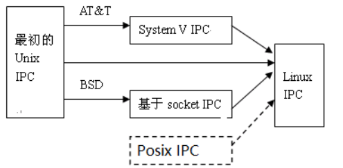
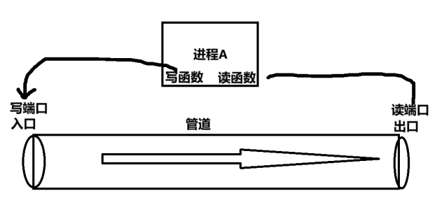
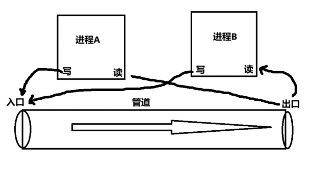
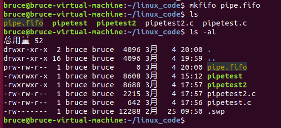
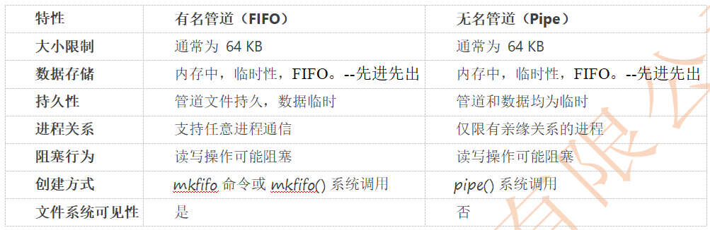

# P8_进程间的通信IPC之管道

## 前置

### 进程间通信简介

Linux下通信方式基本上是**继承UNIX平台**的通信手段，对于UNIX来说，做出巨大贡献有两大主力。 

第一个是AT&T贝尔实验室—爱因斯坦，第二个加州大学的伯克利分校。它们从事的方向是不同的。 

前者是对UNIX早期通信方式进行改进和扩展，最终形成了system V ipc 。**进程通信的重点，单个计算机内部是如何进行通信的**。 

后者跳出该限制，形成了**套接字（socket）的通信方式**，对**网络中不同主机上的应用进程之间进行双向通信**。 目前Linux继承了这两种通信方式的优点。



POSIX IPC由IEEE POSIX标准定义的,因此POSIX IPC是可移植的,可在不同的操作系统上使用。

POSIX定义了一套操作系统接口规范，主要包括系统调用接口、命令行工具、线程和同步机制、库函数接口以及文件系统接口等。

因此：linux里面有两套进程间通信的API函数，posix IPC和System V IPC。

### 进程间通信分类

Linux下进程通信主要包括6种通信方式：管道、信号、消息队列、共享内存、信号量、套接字。

- 第一种：管道：无名管道pipe和命名管道FIFO、标准流管道
  - 特点：无名管道主要用于具有**亲缘关系**的进程间通信—**父子进程**，**命名管道允许无亲缘关系进程间通信。**

- 第二种：信号single
  - 特点：软件层可以模拟中断机制，通知进程某个事件的发生。类似M4中的中断机制（**硬件中断，NVIC控制器**）

- 第三种：消息队列   

  - 特点：消息在链表上。 消息不会丢失，除非 非正常接收。例如：QQ

  - 克服了前两种通信方式的缺点，具有一定的写权限，可以在消息队列里面添加消息—API函数，对消息队列里面有读权限可以对消息队列进行读取消息。

- 第四种：共享内存   
  - 特点：多个进程可以访问一个内存空间，主要是为了同步。--速度最快

- 第五种：信号量     

  - 特点：进程之间或同一个进程的不同线程的同步或者互斥手段—利用信号量约束共享资源，让某个进程先操作。

  - 比如：多线程抢票。

- 第六种：套接字     
  - 特点：不同机器的进程通信，主要用于网络通信。--使用的是socket()通信套接字—设备与设备之间通信

## 无名管道通信

管道好比一个水管，有两个端口，一端为进水端，另外一端为出水端。管道也有两个端口，分别为读端口和写端口。管道的进水端可以理解为写入端口，出水端就读取数据的端口。

第一种：单进程的读写过程：一个进程的多个线程间通信



第二种：父子进程读写过程



**通过上面可以发现，管道里面的数据，只能朝着一个方向传递，而且一个进程发送数据的时候，另外一个进程只能等待接收数据。**

### 无名管道的特点

半双工通信：数据只能单向流动，通常一个进程写，另一个进程读。

- **调用pipe(int fd[2])时，写入文件描述符时，就已经固定死了方向。**

临时性：无名管道只在进程运行时存在，进程结束即被销毁。

无文件名：没有文件系统中的路径名，**仅通过文件描述符访问**。

内存实现：**数据存储在内存中，不占用磁盘空间。**

- 进程没了，管道就没了，数据就没了。
- 匿名管道的文件描述符是进程级别的，所以数据也是进程级别的。

大小限制：**管道有固定容量，写满时写操作会阻塞，读空时读操作也会阻塞。**

创建方式：通过 pipe() 系统调用创建，**返回两个文件描述符，分别用于读和写。**

进程关系：通常用于有亲缘关系的进程间通信，如父子进程。

匿名管道的确是“**进程级**”的，它们**创建后只在调用进程内有效**。具体说明如下：

- **进程内有效**：调用 `pipe()` 后，内核会生成一对文件描述符，这对描述符只在调用进程的文件描述符表中存在。默认情况下，它们**只对该进程可见**。
- **子进程继承**：如果进程调用 `fork()` 创建子进程，那么子进程会继承父进程的文件描述符，因此父子之间可以通过这个管道通信。
  - **在fork之前创建无名管道，父子进程就可以共享读写端的fd**

- **无法跨进程共享**：除非通过特殊手段（比如通过 UNIX 域套接字**传递文件描述符**），否则其他不相关的进程无法直接访问这个匿名管道。

无名管道是一种高效的进程间通信方式，适用于有亲缘关系的进程，数据通过内存传输，速度快但容量有限。

## 无名管道的通信流程

**无名管道操作步骤：**

第一步：无名管道适用于亲缘关系进程间通信，可以fork()形成多进程

第二步：创建无名管道。

第三步：创建fork()

第四步：进程往管道的写端口写入数据（发送数据）。

第五步：进程从管道中读取数据（接收消息）。

第六步：销毁无名管道。

### 无名管道的相关函数(重点)

创建无名管道

- 函数原型：`int pipe(int pipefd[2]);`

- 函数功能：创建无名管道的

- 头文件：`#include <unistd.h>`

- 函数参数：

  - int pipefd[2]---> pipe函数创建一个无名管道，将对应管道的fd—是两个端口，放到数组里面

  - pipefd[0]---表示的是**管道的读端口**   pipefd[1]---表示的是**管道的写端口**  

- 函数返回值：成功 0   失败-1

### 半双工父子进程通信

```c
#include <unistd.h>
#include <stdio.h>
#include <sys/types.h>

int main(void){
    int pipefd[2] = {0};
    int res = pipe(pipefd);
    if(res==0){
        printf("pipecreate ok\n");
    }else {
        printf("pipecreate erro\n");
    }
    printf("%d %d\n",pipefd[0],pipefd[1]);
    pid_t ffd = fork();
    if(ffd==0){
        close(pipefd[1]);
        char buf[20];
        read(pipefd[0],buf,sizeof(buf));
        printf("%s\n",buf);
        close(pipefd[0]);
        exit(0);
    }else {
        close(pipefd[0]);
        char buf[20] = "hello bruce";
        //连填充的\0一起写入，接收方就不用做处理了，%s直接知道有效字符串的长度
        write(pipefd[1],buf,sizeof(buf));
        close(pipefd[1]);
        exit(0);
    }
}
```

- read读不满会填充吗？
  - **不会。返回实际读取的字节数**。
- **管道也是一种特殊的文件，操作的时候也是通过文件描述符进行操作。**
- **不以实际文件存在于文件系统中，进程级别的。**

#### 无名管道通信下的父子进程的执行顺序问题

父子进程的执行顺序在宏观上确实是不可知的，操作系统调度器会在父子进程之间进行切换，具体的执行顺序取决于调度策略和当时的系统负载等因素。**但是，你写的这个程序之所以能够成功运行，并且父进程写入的数据能够被子进程读取到，是因为匿名管道本身提供了一种隐式的同步机制，以及你的代码逻辑利用了这种机制。**

**进程执行顺序的“不可知” 和  “调度”**

- **不可知性：**  从程序员的角度来看，我们无法精确地预测父子进程的指令执行顺序。操作系统内核负责进程调度，它会根据各种因素（如优先级、时间片轮转、I/O 等待等）来决定哪个进程在 CPU 上运行。我们无法直接控制这个调度过程。
- **调度器：**  操作系统有一个叫做调度器的组件，它的工作就是决定哪个就绪态的进程应该获得 CPU 的执行权。调度是非常复杂的，受到很多因素的影响，并且力求公平和高效地利用系统资源。

**无名管道的同步机制**

- **阻塞式 I/O:** 匿名管道的 `read()` 和 `write()` 操作在默认情况下是 **阻塞式** 的。这意味着：
  - **`read()` 阻塞：** 如果管道中没有数据可读，`read()` 系统调用会 **阻塞** 调用进程（**在这里是子进程**），**直到管道中有数据可读，或者管道的写端被全部关闭。**
  - **`write()` 阻塞：** 如果管道的缓冲区满了，`write()` 系统调用也可能会 **阻塞** 调用进程（在这里是父进程），直到管道缓冲区有空间可以写入数据，或者管道的读端被全部关闭（会产生 `SIGPIPE` 信号，通常程序会崩溃，这里不考虑这种情况）。
- **隐式同步：** 这种阻塞特性就构成了一种**隐式的同步机制**。在你的程序中：
  - **子进程 `read()` 的作用：**  子进程在执行 `read(pipefd[0], buf, sizeof(buf));` 时，如果此时管道中没有数据，子进程会 **阻塞** 在 `read()` 调用这里，**暂停执行**。它会一直等待，直到父进程向管道写入数据。
  - **父进程 `write()` 的作用：** 父进程执行 `write(pipefd[1], buf, sizeof(buf));` 向管道写入数据。一旦数据被写入管道，**如果子进程因为 `read()` 而阻塞，操作系统会唤醒子进程，让它可以继续执行**。

虽然父子进程的执行顺序是不确定的，但是你的程序利用了匿名管道的 **阻塞式 I/O 特性**。子进程的 `read()` 操作会等待父进程的 `write()` 操作，即使子进程先运行，它也会因为 `read()` 而阻塞等待，直到父进程写入数据。  **这种阻塞等待机制，使得父子进程之间的数据传递能够可靠地进行，保证了程序能够成功运行，并且父进程写入的数据能够被子进程接收到。**

### 半双工父子进程交替通信

- 利用父子进程，操作无名管道实现，交替通信

- 编写代码有流程：1--创建管道  2--创建父子进程  3--信息可以编辑--gets()  4--将对应的数据发送输出 5--子进程接收信息输出 编辑信息

```c
#include <stdio.h>
#include <stdlib.h>
#include <unistd.h>
#include <sys/types.h>
#include <sys/wait.h>
#include <string.h>

int main(int argc, char *argv[]) {
    int ret;
    int pipefd[2] = {0};

    // 创建无名管道
    ret = pipe(pipefd);
    if (ret == 0) {
        printf("pipefd[0] = %d\n", pipefd[0]);
        printf("pipefd[1] = %d\n", pipefd[1]);
    } else {
        perror("pipe");
        exit(EXIT_FAILURE);
    }

    // 创建父子进程
    ret = fork();
    if (ret < 0) {
        perror("fork");
        exit(EXIT_FAILURE);
    }
    
    if (ret == 0) {
        // 子进程：交替通信循环
        char r_buf[20] = {0};

        while (1) {
            // 从管道读取数据
            if (read(pipefd[0], r_buf, sizeof(r_buf)) > 0) {
                printf("child recv: %s\n", r_buf);
            }
            // 清空缓冲区
            memset(r_buf, 0, sizeof(r_buf));

            // 获取用户输入
            printf("child say: ");
            /* 注意：gets() 不安全，建议使用 fgets() */
            gets(r_buf);

            // 将数据写入管道
            write(pipefd[1], r_buf, sizeof(r_buf));

            // 再次清空缓冲区
            memset(r_buf, 0, sizeof(r_buf));

            // 等待父进程处理数据
            sleep(1);
        }
    } else {
        // 父进程：交替通信循环
        char buf[20] = {0};

        while (1) {
            // 获取用户输入
            printf("father say: ");
            /* 注意：gets() 不安全，建议使用 fgets() */
            gets(buf);

            // 将数据写入管道
            write(pipefd[1], buf, sizeof(buf));

            // 等待子进程处理数据
            sleep(1);

            // 清空缓冲区
            memset(buf, 0, sizeof(buf));

            // 从管道读取数据
            if (read(pipefd[0], buf, sizeof(buf)) > 0) {
                printf("father recv: %s\n", buf);
            }

            // 清空缓冲区
            memset(buf, 0, sizeof(buf));
        }
    }

    // 关闭文件描述符（实际上由于无限循环，这部分代码不会执行）
    close(pipefd[0]);
    close(pipefd[1]);

    return 0;
}
```

**根据无名管道的隐形同步机制，子进程阻塞会先等父进程写入管道，子进程再读取数据，并通过gets（）写入管道。并延迟一秒，让父进程有读取管道数据，不然子进程重新进入循环，因为管道有数据会读取到自己的数据**

无名管道的读写操作具有隐性同步机制，具体过程可以总结如下：

- **父进程写入后解除阻塞**
  父进程调用 write() 将数据写入管道后，子进程的 read() 调用**才会解除阻塞**，从而能读取到父进程发送的数据。
- **子进程获取数据并写入**
  子进程在读到数据后，通过 gets() 获取新的输入，然后将这个输入写入管道。
- **延时确保同步**
  **子进程延时一秒，是为了确保父进程有足够的时间读取管道中的数据。否则，如果子进程过快重新进入循环，由于管道中仍然有数据，它可能会误读到自己写入的数据，而不是父进程的数据。**

这种设计利用了管道的阻塞特性和延时来保证数据交换的正确顺序和双方通信的同步。


## 命名管道

命名管道（Named Pipe）也是一种用于进程间通信（IPC）的特殊文件，与无名管道不同，命名管道具有以下特点：

- **有文件名**：命名管道在文件系统中有一个路径名，**可以通过文件路径访问**。

- **持久性**：命名管道文件在文件系统中存在，**即使没有进程使用它，也不会被销毁，直到显式删除**。

- 全双工或半双工：某些系统支持全双工通信（双向通信），**但通常是半双工（单向通信）**。

- 跨进程通信：**不仅限于有亲缘关系的进程，任何进程都可以通过命名管道通信。**
  - **通过文件IO操作即可，open拿到文件描述符，write往管道里写，read往管道读取数据**

- 基于文件系统：命名管道是一种**特殊类型的文件**，可以通过文件操作函数（如 open、read、write）访问。

### 原理

命名管道通过文件系统创建一个特殊的文件节点，进程可以通过该节点进行读写操作。

- 一个进程写入数据，另一个进程读取数据，数据以先进先出（FIFO）的方式传递。

- 命名管道（FIFO）和无名管道在基本的阻塞和同步机制上是一致的，具体表现如下：
  - **读取阻塞**：当管道中没有数据可供读取时，调用 read() 的进程会阻塞，直到有数据写入或者写端关闭。
  - **写入阻塞**：当管道的内部缓冲区已满时，调用 write() 的进程会阻塞，直到有进程读取数据并腾出缓冲区空间。
- 需要注意的是，对于命名管道，还有一些额外的行为细节：
  - **打开时的阻塞**：**如果一个进程尝试以写入模式打开一个命名管道，而当前还没有其他进程以读模式打开，open() 会阻塞直到有读端出现。（或者在非阻塞模式下返回错误）。**
    - 默认情况下，如果以写模式（O_WRONLY）打开命名管道且未指定 O_NONBLOCK，当没有进程以读模式打开该管道时，open() 会阻塞等待，而不是直接返回错误。如果使用非阻塞模式，则会直接返回错误，并设置 errno 为 ENXIO。
  - **非阻塞模式**：可以通过设置 O_NONBLOCK 标志来改变默认的阻塞行为，使得 read() 或 write() 操作在没有数据或没有空间时立即返回错误。

**注意：**

1、管道文件不是普通文件，称为FIFO文件。

- FIFO文件存在与文件系统中，但是FIFO中的数据存储空间是存放在内存中，**不占用磁盘空间，所以文件的大小始终为0**。
- 虽然命名管道文件本身是持久的，**但是通过命名管道传递的数据是非持久性的，它存在于内存中，并且是瞬态的**。
  - **内存缓冲：**  数据在命名管道中传递时，实际上是使用内核的内存缓冲区进行中转的。当一个进程向命名管道写入数据时，数据会被放入内存缓冲区；当另一个进程从命名管道读取数据时，数据会从内存缓冲区被读取走。
  - **瞬态数据：**  **一旦数据被读取，或者没有任何进程需要读取管道中的数据，并且缓冲区为空，这些数据就消失了。**  命名管道不提供数据存储的功能，它的目的是提供进程间通信的通道，而不是数据存储的容器。
  - **管道为空：** 如果你创建一个命名管道，但不向其中写入任何数据，或者所有写入的数据都被读取完毕，那么命名管道中实际上是没有数据的。  它只是一个“管道”，等待数据的流入和流出。

2、FIFO不是普通文件，所以只能通过使用文件IO对它们进行操作。--管道文件

### 命名管道的通信流程

- 第一步：创建命名管道文件（命令 mkfifo或者mkfifo()）

- 第二步：参与通信的进程打开对应的命名管道文件（open）--获取到对应的fd

- 第三步：对命名管道文件进行写操作（write）

- 第四步：对命名管道文件进行读操作（read）

- 第五步：进程关闭命名管道（close）

### 命名管道的相关函数(重点)

#### mkfifo命令创建管道文件（**命令行创建**）



#### mkfifo() 创建管道文件（**函数中创建**）

- 功能：创建pathname对应的管道文件

- 头文件：
  - \#include <sys/types.h>
  - \#include <sys/stat.h>

- 原型：int mkfifo(const char *pathname,mode_t mode)

- 参数： const char *pathname  ---->文件的路径名

- mode_t mode    期望创建管道文件的权限	   

- 返回值：成功 返回0    失败 返回-1

在调用 `mkfifo` 时，传入的 `mode` 参数用于设置新创建 FIFO 文件的访问权限，这些权限与普通文件的权限设置类似。具体说明如下：

- **权限位设置**：
  `mode` 参数是一个位掩码（bitmask），通常由以下权限常量组合而成：
  - **S_IRUSR**：文件所有者的读权限
  - **S_IWUSR**：文件所有者的写权限
  - **S_IRGRP**：用户组的读权限
  - **S_IWGRP**：用户组的写权限
  - **S_IROTH**：其他用户的读权限
  - **S_IWOTH**：其他用户的写权限
- 例如，传入 `0666`（对应于 `S_IRUSR | S_IWUSR | S_IRGRP | S_IWGRP | S_IROTH | S_IWOTH`）表示所有用户都有读和写权限。

#### 打开管道

`int open(const char *pathname, int flags);`

打开文件的方式flags ：

- O_RDONLY  

- O_WRONLY  

- **O_RDWR(建议大家设置为可读可写的打开方式)**

是为了打开命名管道文件，获取对应的文件描述符fd，为了能够使用文件IO操作管道而已。

#### unlink() 删除文件—作用：删除对应的命名管道

- 头文件：#include <unistd.h>

- 原型：int unlink(const char *pathname)

- 参数：const char *pathname  --->表示待删除文件的路径—命名管道文件的路径
  - 如果是**当前目录下**的管道：直接传文件名，例如 `"myfifo"`。
  - 如果是**其他目录下**的管道：就要带完整路径，例如 `"/tmp/myfifo"` 或者 `"./mypipes/myfifo"`。

- 返回值：成功删除 返回0  失败 -1

- 功能：unlink()会删除pathname指定的文件

#### remove() 删除文件

头文件：#include <stdio.h>

原型：int remove(const char *pathname)

函数参数：const char *pathname –对应文件的路径

函数返回值：成功 0   失败 -1

参数和返回值与unlink()一致，remove函数可以删除文件夹的功能

### 总结



管道通信是基于内存的，速度较快，适合高频、小数据量的通信。

## 标准流管道

标准流管道**本质上是无名管道的一种具体应用形式**。无名管道是一种内核提供的进程间通信机制，而标准流管道则是这种机制在命令行中的实际使用方式。

三种标准流（stdin、stdout、stderr）在这个过程中起到了不同的作用：

- stdin：接收输入数据
- stdout：输出正常执行结果
- stderr：输出错误信息

`|` 管道符的神奇之处在于它能够无缝地**将一个命令的输出连接到另一个命令的输入，实现数据的流式传输。**

例如：当你在 Shell 中使用 |（如 ls | grep .txt）时：

- Shell 底层会调用 pipe() 创建一个无名管道。

- 将前一个进程（ls）的 stdout 重定向到管道的写端。

- 将后一个进程（grep）的 stdin 重定向到管道的读端。

**使用步骤**

- 第一步：使用popen创建标准流管道

- 第二步：使用标准IO进行读写操作

- 第三步：使用pclose关闭管道

### 相关函数

#### popen---标准流管道

- 头文件：#include <stdio.h>

- 原型：FILE \*popen(const char\* command, const char \*type)

- 功能：在创建子进程中运行指定的命令，并创建标准管道

- 第一个参数：`command`

  - 类型：`const char *`

  - 作用：要执行的shell命令字符串

  - 特点：

    - **实际通过 `/bin/sh -c` 执行**
    - 可以是单个命令或复杂的命令管道
    - 支持Shell的所有特性（通配符、管道、重定向等）

  - ```c
    // 简单命令
    popen("ls", "r");
    
    // 复杂命令
    popen("cat file.txt | grep 'error' | sort", "r");
    
    // 带参数的命令
    popen("grep 'pattern' input.txt", "r");
    ```

- 第二个参数：`type`

  - 类型：`const char *`
  - 取值：只能是 "r" 或 "w"
  - 作用：指定管道的读写模式

- "r" 模式（读）

  - 创建一个管道，**允许读取命令的标准输出**

  - **程序可以读取命令执行的结果**

  - 底层机制：将命令的 stdout 重定向到管道

    - **并以读的模式打开这个管道，可以使用文件描述符往管道读取数据**

  - ```c
    FILE *fp = popen("ls -l", "r");
    char buffer[1024];
    // 读取命令输出
    while(fgets(buffer, sizeof(buffer), fp) != NULL) {
        printf("%s", buffer);
    }
    ```

- "w" 模式（写）

  - 创建一个管道，**允许向命令的标准输入写入数据**

  - 程序可以将数据传递给命令

  - 底层机制：将命令的 stdin 重定向到管道

    - **并以写的模式打开这个管道，可以使用文件描述符往管道写入数据**

  - ```c
    FILE *fp = popen("wc -l", "w");
    // 向命令写入数据
    fprintf(fp, "Hello\nWorld\n");
    ```

- 返回值

  - 成功：返回文件指针(FILE *)，可用于读写

  - 失败：返回 NULL
    - 可能原因：
      1. 创建管道失败
      2. 内存不足
      3. 命令无法执行

- 注意事项

  1. 必须使用 `pclose()` 关闭管道
  2. 不是 POSIX 标准，但大多数 UNIX/Linux 系统支持
  3. 创建子进程开销较大
  4. 不适合高频调用
  5. 安全性：小心使用用户输入的命令

#### pclose()---关闭标准流管道

- 原型：int pclose(FILE \*stream)

- 功能：关闭管道文件

- 参数：文件流指针

- 返回值：返回子进程结束的状态

### 经典使用模式

~~~c
FILE *fp = popen(command, mode);
if (fp == NULL) {
    perror("popen() failed");
    exit(1);
}

// 读或写操作
// ...

int status = pclose(fp);
if (status == -1) {
    perror("pclose() failed");
    exit(1);
}


#include <stdio.h>
#include <stdlib.h>
#include <string.h>

#define MAX_BUFFER 1024

int main() {
    FILE *fp;
    char buffer[MAX_BUFFER];
    int status;

    // 示例1：读取命令输出
    printf("=== 示例1：读取 ls 命令输出 ===\n");
    //把命令的输出重定向到标准管道，并以读的模式打开这个匿名管道
    fp = popen("ls -l", "r");
    if (fp == NULL) {
        perror("popen 失败");
        exit(1);
    }

    // 逐行读取并打印命令输出
    while (fgets(buffer, sizeof(buffer), fp) != NULL) {
        printf("%s", buffer);
    }

    // 关闭管道并获取命令执行状态
    status = pclose(fp);
    if (status == -1) {
        perror("pclose 失败");
        exit(1);
    }
    printf("命令执行状态: %d\n", status);

    // 示例2：写入管道
    printf("\n=== 示例2：向命令写入数据 ===\n");
    fp = popen("wc -l", "w");
    if (fp == NULL) {
        perror("popen 失败");
        exit(1);
    }

    // 写入一些数据到管道
    const char *data[] = {
        "Hello World",
        "OpenAI ChatGPT",
        "Linux Programming",
        "System Programming"
    };

    for (int i = 0; i < 4; i++) {
        fprintf(fp, "%s\n", data[i]);
    }

    // 关闭管道
    status = pclose(fp);
    if (status == -1) {
        perror("pclose 失败");
        exit(1);
    }
    printf("命令执行状态: %d\n", status);

    // 示例3：复合操作 - 结合读写
    printf("\n=== 示例3：复合管道操作 ===\n");
    fp = popen("echo 'Hello' | tr '[a-z]' '[A-Z]'", "r");
    if (fp == NULL) {
        perror("popen 失败");
        exit(1);
    }

    // 读取转换后的输出
    if (fgets(buffer, sizeof(buffer), fp) != NULL) {
        printf("转换结果: %s", buffer);
    }

    status = pclose(fp);
    if (status == -1) {
        perror("pclose 失败");
        exit(1);
    }
    printf("命令执行状态: %d\n", status);

    return 0;
}
```

这个示例演示了 popen() 和 pclose() 的三种典型使用场景：

1. 读取命令输出（使用 "r" 模式）
   - 执行 `ls -l` 命令
   - 逐行读取并打印输出

2. 向命令写入数据（使用 "w" 模式）
   - 使用 `wc -l` 统计行数
   - 向管道写入多行文本

3. 复合管道操作
   - 使用管道符结合两个命令
   - 将 "Hello" 转换为大写

关键点：
- `popen()` 返回一个文件指针
- `pclose()` 关闭管道并返回命令执行状态
- 注意错误处理
- 支持读写两种模式

编译命令：
```bash
gcc -o popen_example popen_example.c
```

需要注意的是：
- popen() 是非 POSIX 标准，但大多数 UNIX/Linux 系统支持
- 对于复杂的进程间通信，建议使用更高级的 IPC 机制
~~~

### 典型应用场景

#### 命令行管道符 `|`

最典型的标准流管道应用是使用 `|` 管道符连接不同命令。

```c
cat file.txt | grep "error" | sort | uniq
```

在这个示例中：

- `cat file.txt` 的标准输出作为 `grep` 的标准输入
- `grep` 的标准输出作为 `sort` 的标准输入
- `sort` 的标准输出作为 `uniq` 的标准输入

**工作原理**

1. 每个命令/进程有独立的标准输入、输出和错误流
2. 通过管道符，前一个命令的输出直接成为后一个命令的输入
3. 数据以字节流的方式传输，不需要中间文件存储

**重要特点**

- 实时传输数据
- 减少中间文件的使用
- 提高命令行数据处理效率
- 支持命令间的松耦合

#### 管道命令 vs 逐条执行的区别

逐条执行的方式：

```c
# 方法1：使用中间文件
cat file.txt > temp.txt
grep "error" temp.txt > temp2.txt
sort temp2.txt > temp3.txt
uniq temp3.txt > final_result.txt

# 清理中间文件
rm temp.txt temp2.txt temp3.txt final_result.txt
```

管道命令的方式:

```c
cat file.txt | grep "error" | sort | uniq	
```

**关键区别**

1. 管道命令 (`|`) 的特点：
   - 实时传输数据
   - 不需要中间文件
   - 内存中直接传递数据
   - 前一个命令的标准输出直接作为下一个命令的标准输入
2. 逐条执行的局限性：
   - 需要创建临时文件
   - 增加磁盘I/O开销
   - 占用更多存储空间
   - 执行速度较慢
   - 需要手动管理中间文件

