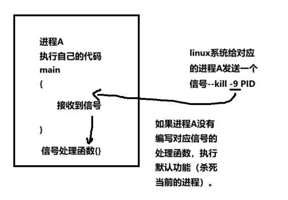
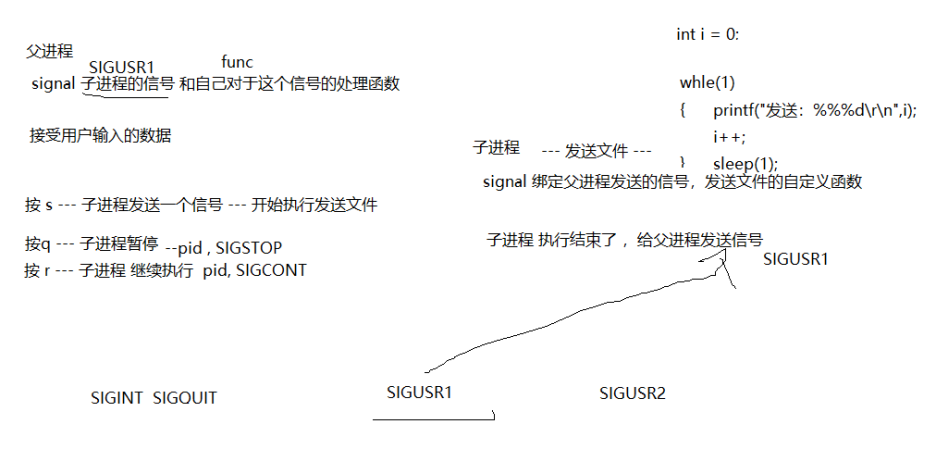

# P9_进程间的通信之信号

## 前置

在 Linux Shell 中，许多常用的快捷键实际上是利用了**信号 (Signals)** 这一进程间通信 (IPC, Inter-Process Communication) 机制来工作的。信号是 Unix 和类 Unix 系统中进程间通信的一种基本方式，**用于通知进程发生了某个事件。Shell 快捷键正是通过终端发送特定的信号给正在运行的进程，从而达到控制进程行为的目的。**

**信号机制原理简述**

1. **信号的产生:**  信号由操作系统内核产生，可以由多种原因触发，例如：
   - **硬件故障:**  如非法内存访问，会产生 `SIGSEGV` 信号。
   - **软件条件:** 如除零错误，会产生 `SIGFPE` 信号。
   - **进程请求:**  **一个进程可以使用 `kill()` 系统调用向另一个进程发送信号。**
   - **终端输入:**  当用户在终端按下某些特定的组合键时，终端驱动程序会向当前前台进程组发送信号。例如，`Ctrl+C` 就是由终端驱动程序解释并产生 `SIGINT` 信号。
2. **信号的传递和处理:** 当信号产生后，操作系统会将信号传递给目标进程。进程可以预先设置如何处理接收到的信号，通常有三种处理方式：
   - **忽略 (Ignore):** 进程可以选择忽略某个信号，即接收到信号后不做任何处理。
   - **默认处理 (Default Action):**  每个信号都有默认的处理方式，例如 `SIGINT` 的默认处理是终止进程。默认处理通常由操作系统预先定义。
   - **捕获 (Catch/Handle):** 进程可以注册信号处理函数，当接收到信号时，操作系统会调用该函数来执行自定义的操作。这允许进程对信号进行更灵活的处理，例如优雅地关闭程序、清理资源等。

**总结**

Linux Shell 快捷键，如 `Ctrl+C`, `Ctrl+Z`, `Ctrl+\\` 等，是**基于信号机制实现的进程控制手段**。通过终端发送特定的信号，可以方便地中断、挂起、退出正在运行的程序。理解这些快捷键背后的信号原理，有助于更有效地使用 Linux Shell，并能更好地理解 **Linux 系统的进程管理方式**。掌握这些快捷键，可以显著提高您在 Linux 命令行环境下的工作效率。

## 信号的本质

- Linux系统中信号相当于软中断(本质)（单片机—裸机---控制对应的外设，中断打开—硬中断），用来**通知异步事件的发生**，软件层上对中断的一种模拟。

- 在原理上，一个进程接收到一个信号，和处理器接受到一个中断请求可以说是一样的。信号是进程通信的一种**异步通信机制**，**一个进程不必通过任何操作等待信号到来**，实际，进程也不知道什么时候信号会达到。

- 一旦进程A，接收到了信号，中断当前进程的执行，进入到对应的信号处理函数里面，执行对应的代码。



## linux系统信号

Linux 系统中的信号确实可以进行分类，而且历史上存在“可靠信号”和“不可靠信号”的区分。不过，需要强调的是，在现代 Linux 系统（特别是遵循 POSIX 标准的系统）中，这种区分已经变得模糊，所有的标准信号在可靠性方面都得到了很大的提升。

### Linux 信号的分类 (基于可靠性 - 历史角度)

在早期的 Unix 系统中（特别是 System V 系统），信号根据其可靠性被划分为 **不可靠信号** (也称为 **标准信号** 或 **非实时信号**) 和 **可靠信号** (也称为 **实时信号**)。  这种分类主要源于对信号处理机制的不同实现方式，以及在信号传递过程中是否可能发生信号丢失的情况。

1. **不可靠信号 (Unreliable Signals / Standard Signals / Non-Real-time Signals)**

   - **信号范围:**  在早期的 System V 系统中，通常指信号值在 1 到 31 范围内的信号。在 Linux 系统中，这个范围大致对应于信号值较小的信号，例如 `SIGINT`, `SIGQUIT`, `SIGUSR1`, `SIGUSR2`, `SIGCHLD` 等。
   - **不可靠性的体现 (信号丢失):**  “不可靠” 的主要含义是，**如果一个进程在处理某个不可靠信号的处理函数时，又收到了同类型的信号，那么后续的同类型信号可能会被丢失**。 也就是说，系统可能只会向进程传递一个信号，即使实际上产生了多次同类型的信号事件。
   - **非排队 (Non-Queued):**  早期的不可靠信号通常是 **非排队的**。这意味着内核不会为每种不可靠信号维护一个队列来保存待处理的信号。如果进程已经有一个该类型信号等待处理，或者正在处理该类型信号，新的同类型信号可能会被忽略。
   - **实例解释:** 假设一个进程正在处理 `SIGUSR1` 信号的处理函数，此时如果又连续产生了两个 `SIGUSR1` 信号。在早期的不可靠信号机制下，进程可能只会感知到一个 `SIGUSR1` 信号，而丢失了后续的信号。
   - **并非真的完全不可靠:**  需要注意的是，“不可靠” 并不是指信号完全无法传递或者经常丢失。而是指在特定情况下，**同类型信号可能会合并或丢失，无法保证每个信号事件都被处理**。

2. **可靠信号 (Reliable Signals / Real-time Signals)**

   - **信号范围:**  为了解决不可靠信号的问题，POSIX 标准引入了 **实时信号 (Real-time Signals)**。 在 Linux 系统中，实时信号通常对应于信号值在 34 到 64 范围内的信号（信号值范围可能因系统而异，可以使用 `kill -l` 命令查看）。例如 `SIGRTMIN` 到 `SIGRTMAX` 之间的信号。
   - **可靠性的体现 (信号排队):**  “可靠” 的主要含义是，**实时信号是排队的** (Queued)。 当进程收到多个同类型的实时信号时，**内核会将这些信号排队保存**，并按照信号产生的顺序逐个传递给进程。**不会发生信号丢失的情况**，即使在处理信号处理函数期间又收到了同类型的信号。
   - **排队 (Queued):**  内核为每种实时信号维护一个队列。当新的实时信号产生时，会被加入到队列的末尾。进程在处理完当前的信号后，会从队列中取出下一个信号进行处理，直到队列为空。
   - **携带数据 (Signal Value):**  实时信号通常可以 **携带额外的数据** (信号值)。这使得实时信号不仅仅是一个简单的事件通知，还可以传递一些额外的信息，增强了信号的通信能力。可以通过 `sigqueue()` 函数发送携带数据的实时信号。
   - **保证顺序 (Ordering - 部分保证):**  对于**同一个进程**发送的多个实时信号，**通常** 保证按照发送的顺序被接收。但是，如果实时信号来自**不同的进程**，POSIX 标准**不保证**严格的顺序。不过，大多数实现会尽力维护 FIFO (先进先出) 的顺序。
   - **实例解释:**  如果使用实时信号，即使在处理 `SIGRTMIN` 信号的处理函数期间，又连续产生多个 `SIGRTMIN` 信号，这些信号都会被排队，进程会依次处理每一个信号，不会丢失。

3. **现代 Linux 系统中的信号可靠性**

   需要强调的是，**现代 Linux 系统 (以及其他遵循 POSIX 标准的 Unix-like 系统)  在信号处理机制上已经做了很大的改进，使得传统的 “不可靠信号” 在很大程度上也变得更加可靠了**。

   - **标准信号的排队 (有限排队):**  现代 Linux 内核通常也为 **标准信号** 提供了 **有限的排队能力**。 虽然可能不像实时信号那样拥有严格的完全排队机制，但对于一定数量的同类型标准信号，内核可以将其排队，避免信号丢失。 这种排队机制的引入，大大提升了标准信号的可靠性。
   - **信号合并 (Signal Coalescing):**  即使有排队机制，对于某些 **快速连续产生的大量** 同类型标准信号，系统仍然可能进行 **信号合并 (Signal Coalescing)**。  这意味着内核可能会将多个同类型的信号合并成一个信号进行传递，以防止信号队列过长，造成系统负担。 但即使合并，**至少会保证进程收到一个信号**，通知进程有该类型的事件发生。
   - **实际应用中:**  在绝大多数实际应用场景中，现代 Linux 系统中的 **所有标准信号** (例如 `SIGINT`, `SIGCHLD` 等)  都 **足够可靠**，可以满足进程间通信和事件通知的需求，无需过度担心信号丢失的问题。 只有在极少数对信号可靠性要求非常高的实时性应用中，才可能需要特别关注实时信号的使用。

为了更清晰地理解，下面用表格对比一下历史上的不可靠信号和可靠信号 (实时信号) 的主要区别：

| 特性                  | 不可靠信号 (标准/非实时)             | 可靠信号 (实时)                         |
| --------------------- | ------------------------------------ | --------------------------------------- |
| 信号值范围            | 早期通常 1-31                        | 通常 34-64 (例如 `SIGRTMIN`-`SIGRTMAX`) |
| 信号丢失              | 可能丢失同类型后续信号               | 不会丢失，信号排队                      |
| 排队机制              | 非排队 (早期)，现代 Linux 有有限排队 | 排队 (Queued)                           |
| 信号值携带            | 不支持携带数据                       | 支持携带额外数据                        |
| 顺序保证              | 较弱，可能不保证顺序                 | 同进程发送通常保证顺序                  |
| 典型应用场景          | 一般的进程控制，错误处理等           | 实时性要求高的应用，进程间复杂通信      |
| **现代 Linux 可靠性** | **大大提升，基本满足日常需求**       | **高可靠性，严格排队**                  |

### 信号的含义

信号的含义如下：

1) SIGHUP：**当用户退出 Shell 窗口时，由该 Shell 启动所有进程都接收到这个信号，默认动作为终止进程。** 
   1) **除非使用命令设置为后台进程**
2) SIGINT：**用户按下组合 Ctrl 键+c 键时，用户端时向正在运行中的由该终端启动的程序发出此信号。默认动作为终止进程。** 
3) SIGQUIT：**当用户按下组合键Ctrl 键+\ 键时产生该信号，用户终端向正在运行中的由该终端启动的程序发出此信号。默认动作为终止进程并产生 core 文件。** 
4) SIGILL ：CPU 检测到某进程执行了非法指令。默认动作为终止进程并产生 core 文件。 
5) SIGTRAP：该信号由断点指令或其他 trap 指令产生。默认动作为终止进程并产生 core 文件。 
6) SIGABRT：调用 abort 函数时产生该信号。默认动作为终止进程并产生 core 文件。 
7) SIGBUS：非法访问内存地址，包括内存地址对齐（alignment）出错，默认动作为终止进程并产生 core 文件。 
8) SIGFPE：在发生致命的算术错误时产生。不仅包括浮点运行错误，还包括溢出及除数为 0 等所有的算 术错误。默认动作为终止进程并产生 core 文件。
9) SIGKILL：**无条件终止进程。本信号不能被忽略、不可变更处理方式和阻塞。默认动作为终止进程。它向系统管理员提供了一种可以杀死任何进程的方法。** 
   1) **提供对应进程的PID**
10) SIGUSR1：**用户定义的信号，即程序可以在程序中定义并使用该信号。默认动作为终止进程。** 
11) SIGSEGV：指示进程进行无效的内存访问。默认动作为终止进程并使用该信号。默认动作为终止进程。 
12) SIGUSR2：**这是另外一个用户定义信号，程序员可以在程序中定义并使用该信号。默认动作为终止进 程。 **
13) SIGPIPE：Broken pipe：向一个没有读端的管道写数据。默认动作为终止进程。 
14) SIGALRM：**定时器超时，超时的时间由系统调用 alarm 设置。默认动作为终止进程。** 
15) SIGTERM：程序结束(terminate)信号，与 SIGKILL 不同的是，该信号可以被阻塞和处理。通常用来要求 程序正常退出。执行 Shell 命令 kill 时，缺少产生这个信号。默认动作为终止进程。 
16) SIGCHLD：子程序结束时，父进程会收到这个信号。默认动作为忽略该信号。 
17) SIGCONT：让一个暂停的进程继续执行。 
18) SIGSTOP：停止(stopped)进程的执行。注意它和 SIGTERM 以及 SIGINT 的区别：该进程还未结束， 只是暂停执行。本信号不能被忽略、处理和阻塞。默认作为暂停进程。 
19) SIGTSTP：**停止进程的动作，但该信号可以被处理和忽略。按下组合键时发出该信号。默认动作为暂停进程。** 
20) SIGTTIN：**当后台进程要从用户终端读数据时，该终端中的所有进程会收到 SIGTTIN 信号。默认动作 为暂停进程。** 
21) SIGTTOU：该信号类似于 SIGTIN，在后台进程要向终端输出数据时产生。默认动作为暂停进程。(如 果不行需要设置 stty tostop) 
22) SIGURG：套接字（socket）上有紧急数据时，向当前正在运行的进程发出此信号，报告有紧急数据到达。 默认动作为忽略该信号。 
23) SIGXCPU：进程执行时间超过了分配给该进程的 CPU 时间，系统产生该信号并发送给该进程。默认动 作为终止进程。
24) SIGXFSZ：超过文件最大长度的限制。默认动作为 yl 终止进程并产生 core 文件。 
25) SIGVTALRM：虚拟时钟超时时产生该信号。类似于 SIGALRM，但是它只计算该进程占有用的 CPU 时 间。默认动作为终止进程。 
26) SIGPROF：类似于 SIGVTALRM，它不仅包括该进程占用的 CPU 时间还抱括执行系统调用的时间。默 认动作为终止进程。 
27) SIGWINCH：窗口大小改变时发出。默认动作为忽略该信号。 
28) SIGIO：此信号向进程指示发出一个异步 IO 事件。默认动作为忽略。 
29) SIGPWR：关机。默认动作为终止进程。 
30) SIGSYS：非法系统调用 
31) SIGRTMIN~SIGRTMAX：Linux 的实时信号，它没有固定的含义(或者说可以由用户自由使用)—可以自己设定处理方式。注意， Linux 线程机制使用了前 3 个实时信号。所有的实时信号的默认动作都是终止进程。
32) SIGSYS：非法系统调用 
33) SIGRTMIN~SIGRTMAX：**Linux 的实时信号，它没有固定的含义(或者说可以由用户自由使用)—可以自己设定处理方式。注意， Linux 线程机制使用了前 3 个实时信号。所有的实时信号的默认动作都是终止进程。**

注意：硬件异常的处理通常是由操作系统内核负责的，应用程序通常无法直接控制硬件异常的触发和处理。应用程序可以通过注册信号处理函数来处理与硬件异常相关的信号，但具体的处理方式受限于操作系统和硬件平台的约束。

### 产生信号的来源

信号的来源可以分为多种，按照产生条件的不同可以分为两种：

- 硬件--键盘快捷键—发送信号
- 软件—发送信号函数或者命令 --- 发送信号；

**第一种：硬件方式**

​	通过快捷键出发信号，查询快捷键和信号的对应命令：stty -a

- 按键ctrl+c --->发送SIGINT信号给前台进程组中的所有的进程，这些正在运行的进程接收到信号，终止运行。

- 按键ctrl+z ---> 发送SIGSTOP信号给其他进程组中的所有进程，**挂起进程**，如果想恢复执行fg命令。

- 按键ctrl+\ ---> 发送SIGTTOU信号组给前台进程组中的所有进程，终止进程并生成core文件

- 按键ctrl+s ---> 发出一个中断信号暂停一个进程  SIGSTOP

- 按键ctrl+q ---> 发出一个中断信号启动ctrl+s暂停的进程  SIGCONT

**第二种：软件方式**

**使用命令**：kill 发送信号 （内部实现就是通过kill函数） --->把某个进程杀死 （可以在终端发送信号）

- ps -aux查看到进程pid  63130
- kill -信号数字 pid   kill -**19** 63130   kill -**18** 63130

**使用函数**：kill() ,sigqueue()发送信号

## 发送信号（重点）

**kill()给任一进程/进程组 发送任一信号 命令 kill -9 PID**

头文件：

- #include <sys/types.h>

- #include <signal.h>

 函数原型：int kill(pid_t pid, int sig);

函数参数：pid_t pid对应进程的PID号

- int sig:信号的编号—可以使用**kill -l**

  - 如果pid > 0 发送信号给进程的PID

  - 如果pid = 0 发送信号当前进程组下的所有进程

  - 如果pid = -1 尽可能给进程组下所有的进程发送信号—除了1号PID

  - 如果pid <-1  发送信号给进程组-pid的进程发送相应的信号

函数功能：给对应的进程发送一个信号

函数返回值：成功 0  失败 -1

### 进程B利用一下kill函数，给进程A发送一个信号

`process_a.c` (进程 A - 信号接收者):

```c
#include <stdio.h>
#include <stdlib.h>
#include <signal.h>
#include <unistd.h>

// 信号处理函数
void signal_handler(int signum) {
    if (signum == SIGUSR1) {
        printf("进程 A (PID: %d) 接收到 SIGUSR1 信号！\n", getpid());
        // 在这里可以添加信号处理的逻辑
    }
}

int main(int argc, char *argv[]) {
    // 注册信号处理函数 - 处理 SIGUSR1 信号
    if (signal(SIGUSR1, signal_handler) == SIG_ERR) {
        perror("signal");
        exit(1);
    }

    printf("进程 A 启动，PID: %d\n", getpid());
    printf("等待 SIGUSR1 信号...\n");

    // 无限循环，保持进程运行，等待信号
    while (1) {
        sleep(1); // 每秒检查一次，降低 CPU 占用 (虽然信号是异步的，sleep 只是为了演示方便)
    }

    return 0;
}
```

`process_b.c` (进程 B - 信号发送者):

```c
#include <stdio.h>
#include <stdlib.h>
#include <signal.h>
#include <unistd.h>
#include <errno.h>

int main(int argc, char *argv[]) {
    if (argc != 2) {
        fprintf(stderr, "用法: %s <进程A的PID>\n", argv[0]);
        return 1;
    }

    pid_t pid_a = atoi(argv[1]); // 将命令行参数转换为进程 A 的 PID

    printf("进程 B 启动，准备向进程 A (PID: %d) 发送 SIGUSR1 信号...\n", pid_a);

    // 使用 kill 函数发送 SIGUSR1 信号给进程 A
    if (kill(pid_a, SIGUSR1) == -1) {
        perror("kill");
        fprintf(stderr, "发送信号失败，请检查 PID 是否正确，以及进程 A 是否存在。\n");
        return 1;
    }

    printf("SIGUSR1 信号已成功发送给进程 A (PID: %d)\n", pid_a);

    return 0;
}
```

#### 命令参数如何传递

`./process_b 12345`跟`ls -l`

- 后者是去bin文件下找名称**ls**的可执行文件，再根据参数`-l`执行具体的操作，没有参数默认也会有一个操作。
- 前者也是如此，去当前文件夹中寻找名称为**process_b**的可执行文件，在根据参数`12345`做具体的操作，具体看**process_b**函数如何定义。
- 实际的每个可执行文件的函数定义中main函数都是规范的,`int main(int argc, char *argv[])` 调用时，argc是参数的个数，argv[0]为函数名称，argv[1]为函数所带的参数。这种格式使用shell命令时，才可以传递进来。

**想要使用shell命令调用函数并传递参数，那么函数的格式就要符合规范**

### raise()

- 功能：给当前线程发送一个信号

- 头文件：#include <signal.h>

- 原型：int raise(int sig)

- 参数：int sig  --->信号的编号

- 函数返回值：成功  0  失败 非零值

- 补充：若当前进程下只有一个线程，该函数将给进程发送信号

`raise()` 最常用的例子就是 **错误处理和异常报告**。当程序遇到无法继续执行的严重错误时，通常会使用 `raise()` 发送 `SIGABRT` 信号来 **异常中止** 程序。

**最常用的场景：程序自检发现不可恢复的错误**

设想一个场景：你的程序在运行过程中需要检查一些关键的条件或状态。如果这些条件不满足，程序就无法继续正常运行下去，这时就需要主动报错并终止程序，以防止产生更严重的问题。`raise(SIGABRT)` 就是在这种情况下最常用的选择。

**例子：检查配置文件的加载**

假设你的程序需要从配置文件中读取一些关键参数才能正常工作。如果配置文件不存在、格式错误，或者缺少必要的配置项，程序就无法启动。这时，你就可以在配置文件加载失败的时候使用 `raise(SIGABRT)` 来报错并终止程序。

```c
#include <stdio.h>
#include <stdlib.h>
#include <signal.h>
#include <unistd.h> // 为了 getpid()

// 简单的配置文件加载函数 (模拟)
int load_config() {
    FILE *fp = fopen("config.ini", "r");
    if (fp == NULL) {
        // 配置文件打开失败！这是一个无法恢复的错误
        fprintf(stderr, "错误：无法打开配置文件 config.ini\n");
        return 0; // 返回 0 表示加载失败
    }
    // ... 这里可以添加更复杂的配置文件解析逻辑 ...
    fclose(fp);
    return 1; // 返回 1 表示加载成功
}

// 信号处理函数，处理 SIGABRT 信号 (可选，用于更友好的错误提示)
void signal_handler(int signum) {
    if (signum == SIGABRT) {
        fprintf(stderr, "\n程序遇到致命错误，即将异常中止。\n");
        fprintf(stderr, "进程 ID: %d\n", getpid()); // 打印进程 ID 方便排查问题
        // 可以添加更多清理或日志记录操作...
        exit(1); // 当前进程异常退出
    }
}

int main() {
    // 注册信号处理函数 (可选，但推荐)
    if (signal(SIGABRT, signal_handler) == SIG_ERR) {
        perror("signal(SIGABRT) 失败");
        return 1;
    }

    printf("程序开始启动...\n");

    if (!load_config()) {
        // 配置文件加载失败，程序无法继续运行，使用 raise(SIGABRT) 终止
        fprintf(stderr, "配置文件加载失败，程序无法继续运行。\n");
        raise(SIGABRT); // 发送 SIGABRT 信号，异常中止
        // 注意：raise(SIGABRT) 后面的代码通常不会被执行，程序会立即终止
    }

    printf("配置文件加载成功。\n");
    // ... 程序继续正常运行 ...
    printf("程序正常运行中...\n");
    sleep(5);
    printf("程序运行结束。\n");

    return 0;
}
```

**代码解释:**

1. **`load_config()` 函数:**  模拟加载配置文件的函数。

   - 它尝试打开名为 `config.ini` 的文件。
   - 如果打开文件失败 (`fopen()` 返回 `NULL`)，说明配置文件不存在或无法访问，这是一个 **程序无法继续运行的致命错误**。
   - 在这种情况下，函数打印错误信息到标准错误输出 `stderr`，并返回 `0` 表示加载失败。
   - (实际上，`load_config()` 应该包含更复杂的配置文件解析逻辑，这里为了演示 `raise()` 的用法而简化了。)

2. **`signal_handler()` 函数 (可选):**

   - 这是一个信号处理函数，用于处理 `SIGABRT` 信号。
   - 当程序接收到 `SIGABRT` 信号时 (通常是由 `raise(SIGABRT)` 发送的)，这个函数会被调用。
   - 在这个例子中，`signal_handler()` 只是简单地打印一些错误信息，包括程序即将中止的消息和进程 ID (方便调试)，然后调用 `exit(1)` 异常退出程序。
   - **注册信号处理函数是可选的，但强烈推荐**。  如果不注册信号处理函数，当程序 `raise(SIGABRT)` 时，默认行为是立即终止程序，并且可能会生成 core dump 文件 (取决于系统配置)。  注册信号处理函数可以让你在程序终止前做一些更友好的处理，例如打印更详细的错误信息、清理资源、记录日志等等。

3. **`main()` 函数:**

   - **`signal(SIGABRT, signal_handler)`:**  注册 `signal_handler()` 函数来处理 `SIGABRT` 信号。

   - `if (!load_config()) { ... raise(SIGABRT); }`:

       调用 `load_config()`函数尝试加载配置文件。

     - 如果 `load_config()` 返回 `0` (加载失败)，表示配置文件加载失败。
     - 此时，程序打印错误信息到 `stderr`，然后调用 `raise(SIGABRT)`。  **这就是 `raise(SIGABRT)` 最常用的场景：当程序自检发现一个无法恢复的错误时，主动调用 `raise(SIGABRT)` 异常中止程序。**

   - 如果 `load_config()` 返回 `1` (加载成功)，程序继续正常运行，打印 "配置文件加载成功。" 等信息。

**运行结果分析:**

- 程序启动后，`load_config()` 函数尝试加载 `config.ini` 配置文件，但由于文件不存在，加载失败。
- `load_config()` 返回 `0`，`main()` 函数中的 `if` 条件成立。
- 程序打印 "配置文件加载失败，程序无法继续运行。" 的错误信息到 `stderr`。
- **关键步骤: `raise(SIGABRT);` 被调用，程序主动发送 `SIGABRT` 信号给自己。**
- 由于我们注册了 `signal_handler()` 函数来处理 `SIGABRT` 信号，所以 `signal_handler()` 函数被调用。
- `signal_handler()` 函数打印 "程序遇到致命错误，即将异常中止。" 和进程 ID，并调用 `exit(1)` 异常退出程序。
- 你看不到 "配置文件加载成功。" 和 "程序正常运行中..." 等后续的打印信息，因为 `raise(SIGABRT)` 之后的代码通常不会被执行，程序会立即终止。

### alarm() 

alarm() 函数用于设置一个定时器，在指定时间后向当前进程发送 SIGALRM 信号。  

- 头文件：#include <unistd.h>

- 函数原型：unsigned int alarm(unsigned int seconds);

- 函数参数：unsigned int seconds----秒
  - 如果 `seconds` 为 **正数**，`alarm()` 会设置一个定时器，在 `seconds` 秒后，操作系统会向当前进程发送 `SIGALRM` 信号。
  - 如果 `seconds` 为 **0**，`alarm()` 会 **取消** 之前设置的定时器 (如果有的话)，并且不会发送任何信号。

- 返回值：`alarm()` 函数返回 **上一次** 设置的 `alarm()` 定时器 **剩余的时间** (以秒为单位)。
  - 如果之前没有设置过定时器，或者之前的定时器已经到期，则返回 **0**。
  - 如果调用 `alarm(0)` 取消定时器，也会返回剩余时间。

默认行为：SIGALRM 的默认动作是终止进程。

`alarm()` 的作用就是让程序在指定的时间后收到一个 **闹钟** (`SIGALRM` 信号)。程序可以决定如何响应这个闹钟，通常用于以下几个主要场景：

1. **设置操作超时 (Timeouts):**  这是 `alarm()` 最常见也是最重要的用途。很多时候，程序需要执行一些可能耗时较长的操作，例如：

   - **网络请求:** 等待服务器响应。
   - **文件 I/O:**  等待磁盘读取或写入完成。
   - **用户输入:**  等待用户在一定时间内输入。
   - **外部程序调用:** 等待子进程执行结束。

   在这些情况下，如果操作长时间没有完成，程序可能需要 **放弃等待**，避免程序无限期地阻塞下去。`alarm()` 就可以用来设置一个超时时间。如果在指定时间内操作没有完成，`SIGALRM` 信号会被发送，程序可以在信号处理函数中进行相应的超时处理，例如：  **中断当前操作。**  **返回错误或默认值。** **尝试其他操作。**

2. **周期性地执行任务 (Periodic Tasks, 简单定时任务):**  虽然 `alarm()` 不是一个精确的定时器，但它可以用来实现简单的周期性任务。程序可以设置一个 `alarm()` 定时器，在 `SIGALRM` 信号处理函数中执行需要周期性运行的任务，并在处理函数中 **重新设置** 下一个 `alarm()` 定时器。

3. **中断阻塞的系统调用 (Interrupt Blocking System Calls):**  在某些情况下，程序可能会调用一些阻塞的系统调用 (例如 `read`, `pause`, `sleep` 等)，程序会一直等待这些系统调用完成。使用 `alarm()` 可以设置一个超时时间，如果在超时时间内系统调用仍然没有返回，`SIGALRM` 信号会被发送，**某些阻塞的系统调用会被 `SIGALRM` 信号中断**，并返回错误 `EINTR` (Interrupted system call)。程序可以检查这个错误码并进行相应的处理。

   **注意:** 并非所有的阻塞系统调用都能被 `SIGALRM` 中断，而且被中断的行为也可能因系统而异。因此，使用 `alarm()` 中断阻塞系统调用需要谨慎，并仔细测试。

4. **简单的性能测试或时间测量 (Basic Timing):**  虽然 `alarm()` 的精度有限，但它可以用于一些简单的性能测试或时间测量，例如粗略地测量一段代码的执行时间。

**重要事项：**

- **`SIGALRM` 信号:** `alarm()` 函数的核心机制是 `SIGALRM` 信号。程序需要使用 `signal()` 或 `sigaction()` 等函数来 **注册信号处理函数**，以便在 `SIGALRM` 信号到达时执行相应的操作。
- **单一定时器:**  每个进程 **只有一个** `alarm()` 定时器。每次调用 `alarm()` 都会 **覆盖** 之前设置的定时器。
- **精度有限:**  `alarm()` 的精度通常是秒级的，不适合高精度的时间测量或定时任务。如果需要更高精度的定时，可以考虑使用 `timer_create`, `setitimer` 等更高级的定时器接口。
- **不可靠信号 (在某些老的 Unix 系统上):** 在一些古老的 Unix 系统中，`SIGALRM` 可能是不可靠信号，意味着如果信号在处理期间又发生了同类型的信号，可能会丢失。但在现代 Linux 系统中，`SIGALRM` 信号通常是可靠信号。不过，编写信号处理程序时仍然需要注意信号重入等问题。
- **线程安全:** `alarm()` **在多线程程序中使用需要特别小心，因为它影响的是整个进程，而不是特定的线程。在多线程环境中，更推荐使用线程特定的定时器机制**，例如 `pthread_cond_timedwait` 或 `timerfd_create` 等。

#### 示例

**`alarm()` 的使用例子：设置操作超时**

下面是一个经典的 `alarm()` 应用场景的例子：**限制用户输入的时间**。程序会提示用户输入一个字符串，但用户必须在 **5 秒钟** 内完成输入。如果在 5 秒内用户没有输入，程序会打印超时信息并退出。

```c
#include <stdio.h>
#include <stdlib.h>
#include <unistd.h>
#include <signal.h>
#include <string.h>

#define TIMEOUT_SECONDS 5

volatile sig_atomic_t timeout_flag = 0; // 使用 volatile sig_atomic_t 确保在信号处理函数中安全访问

// 信号处理函数，处理 SIGALRM 信号 (超时信号)
void timeout_handler(int signum) {
    if (signum == SIGALRM) {
        timeout_flag = 1; // 设置超时标志
        printf("\n输入超时！\n"); // 提示超时信息
    }
}

int main() {
    char input_buffer[100];

    // 注册信号处理函数来处理 SIGALRM 信号
    if (signal(SIGALRM, timeout_handler) == SIG_ERR) {
        perror("signal(SIGALRM) 失败");
        return 1;
    }

    printf("请在 %d 秒内输入一个字符串: ", TIMEOUT_SECONDS);
    fflush(stdout); // 立即刷新输出，确保提示信息显示

    alarm(TIMEOUT_SECONDS); // 设置 alarm 定时器，%TIMEOUT_SECONDS 秒后发送 SIGALRM 信号

    if (fgets(input_buffer, sizeof(input_buffer), stdin) == NULL) {
        if (timeout_flag) {
            // 如果是因为超时而 fgets 返回 NULL
            fprintf(stderr, "由于输入超时，程序退出。\n");
            return 1;
        } else {
            perror("fgets 读取输入失败"); // 其他 fgets 错误
            return 1;
        }
    } else {
        alarm(0); // 取消 alarm 定时器 (如果输入在超时前完成)
        printf("你输入的是: %s", input_buffer);
    }

    printf("程序结束。\n");
    return 0;
}
```

让我们更详细地分析时间线：

1. **设置 `alarm()` 定时器:**  程序首先调用 `alarm(TIMEOUT_SECONDS)` 设置一个定时器，例如 5 秒。  这意味着在 5 秒后，操作系统会向当前进程发送 `SIGALRM` 信号。
2. **调用 `fgets()` 开始等待输入:**  程序紧接着调用 `fgets(input_buffer, ...)`。  `fgets` 是一个 **阻塞函数**。  这意味着程序会 **暂停在 `fgets` 调用处，等待用户从标准输入输入数据，或者直到发生某些错误情况**。  在 `fgets` 等待用户输入期间，程序不会继续执行 `fgets` 后面的代码。
3. **用户输入 (正常情况):**
   - 如果 **用户在 `alarm()` 定时器到期之前** 输入了数据，并按下了 Enter 键（产生换行符），`fgets` 会读取到用户输入，包括换行符。
   - `fgets` 读取成功，会将读取到的字符串存储到 `input_buffer` 中，并返回指向 `input_buffer` 的指针 (非 `NULL`)。
   - 在这种情况下， `if (fgets(...) == NULL)` 的条件 **不成立**，程序会进入 `else` 分支，取消 `alarm()` 定时器 (`alarm(0)`)，并处理用户输入的字符串。  **不会误判为超时。**

**超时发生 (超时情况):**

- 如果 **用户在 `alarm()` 设置的时间内没有输入任何内容**，`alarm()` 定时器会到期。
- 定时器到期后，操作系统会向程序发送 `SIGALRM` 信号。
- **关键点：**  当程序接收到 `SIGALRM` 信号时，**如果 `fgets` 仍然在阻塞等待输入， `SIGALRM` 信号的处理函数 `timeout_handler()` 会被执行。  `timeout_handler()` 函数会将 `timeout_flag` 设置为 1，并打印 "输入超时！" 消息。**
- **更关键的点： `SIGALRM` 信号的到来可能会中断 `fgets` 的阻塞状态**。  在某些情况下，被信号中断的系统调用（例如 `fgets`）会返回一个错误，并将 `errno` 设置为 `EINTR` (Interrupted system call)。 **在我们的代码中，我们主要通过检查 `fgets` 的返回值是否为 `NULL` 来判断是否发生了错误，然后再通过 `timeout_flag` 进一步判断这个错误是否是由于超时引起的。**  （注意，虽然信号 *可能* 导致 `fgets` 返回 `EINTR` 错误，但标准并不保证一定如此。在某些实现中，`fgets` 在被信号中断后可能只是简单地返回 `NULL`，而不明确设置 `errno` 为 `EINTR`。  我们的代码主要依赖于检查 `fgets` 的 `NULL` 返回值和 `timeout_flag`。）
- 由于 `fgets` 返回了 `NULL`，`if (fgets(...) == NULL)` 的条件 **成立**。
- 程序会进入 `if` 分支， **然后检查 `timeout_flag` 的值**。  因为 `timeout_flag` 在 `timeout_handler()` 中已经被设置为 `1`，所以 `if (timeout_flag)` 的条件也成立。
- 程序会执行超时处理逻辑，打印 "由于输入超时，程序退出。" 消息，并退出。

**其他 `fgets` 错误 (非超时情况，虽然在本例中不太可能从 `stdin` 发生):**

- 理论上，`fgets` 也可能因为其他原因返回 `NULL`，例如，如果在读取标准输入的过程中发生了 **I/O 错误**（虽然从键盘输入时这种情况非常罕见），或者如果标准输入流在读取过程中被意外关闭。
- 在这种情况下，`fgets` 仍然会返回 `NULL`。  `if (fgets(...) == NULL)` 的条件依然成立。
- 但是，**`timeout_flag` 在这种非超时错误情况下通常不会被设置为 `1`** （除非碰巧在极短的时间内，信号也同时到达，但这概率极低，可以忽略）。  因此，当程序进入 `if` 分支后，`if (timeout_flag)` 的条件会 **不成立** (因为 `timeout_flag` 仍然是初始值 `0`)。
- 程序会进入 `else` 分支 (`else { perror("fgets 读取输入失败"); ... }`)，将这种情况视为一般的 `fgets` 读取错误，并使用 `perror` 打印错误信息 (通常 "fgets 读取输入失败")。

#### 实验结果（推翻假设）

您的代码的逻辑是：设置定时器 -> 等待 `fgets` 输入 -> 超时后信号处理函数执行 -> 检查超时标志并退出。

然而，实际情况是：设置定时器 -> `fgets` 阻塞等待输入 -> 定时器到期，信号处理函数执行 (设置超时标志，打印超时信息) -> **`fgets` 仍然阻塞，并尝试重启** -> 程序卡在 `fgets` 处，等待用户输入，即使已经超时。

您最初的代码尝试使用信号处理函数来打断 `fgets` 的阻塞，但**由于信号的默认行为以及 `fgets` 的系统调用重启特性，这种方法并没有达到预期的效果。**

#### 总结

**alarm() 的机制**

**`alarm()` 设置定时事件 (定时器):**

- `alarm(秒数)` 函数的核心作用是 **设置一个系统级别的定时器**。  您可以把它想象成一个 **闹钟**。
- 您通过 `alarm()` 指定一个 **超时时间** (以秒为单位)。
- 操作系统内核会记录下这个定时器，并开始倒计时。
- **关键点:**  `alarm()` 设置的是一个 **进程级别的定时器**，它影响的是调用 `alarm()` 的整个进程。

**定时器到期，`SIGALRM` 信号发送:**

- 当 `alarm()` 设置的定时器倒计时结束 (超时时间到达) 时，操作系统内核会 **向设置该定时器的进程发送一个 `SIGALRM` 信号**。
- `SIGALRM` 是一种 **异步信号**，意味着信号的到达是 **突发** 的，**不可预测** 的，它随时可能发生，而不需要程序主动去查询。
- 您可以把 `SIGALRM` 信号想象成 **闹钟铃声响了**。

**信号触发 "类似中断服务函数的操作" (信号处理函数):**

- 当进程接收到 `SIGALRM` 信号后，如果程序之前已经 **注册了 `SIGALRM` 信号的处理函数** (通过 `signal()` 或 `sigaction()` 函数)，那么这个 **信号处理函数** 就会被 **立即执行**。
- 这个信号处理函数就像一个 **“中断服务程序”** (在硬件中断概念中)。它会被 **“打断”** 当前程序的主流程来优先执行。
- 在我们的例子中，信号处理函数 `timeout_handler()`的主要任务是：
  - 设置一个 **全局标志变量 `timeout_flag` 为真 (例如 1)**，用来 **记录超时事件发生**。
  - （可选地）打印一些 **超时提示信息** 到终端。
- **关键点:**  信号处理函数是 **异步执行** 的，它和主程序的 `fgets` 等代码 **并行运行**。 它通过 **全局变量 `timeout_flag` 与主程序进行“通信”**。

**Linux应用端定时器alarm 和 单片机端的定时器区别？**

- alarm软件定时器—不限个数  
  - **一个进程只有一个alarm在起作用，多次调用只会覆盖而已**

- 单片机的定时器是硬件定时器，有个数限制。

### pause()

`pause()` 函数的作用非常直接：它会**挂起**（或暂停）调用它的进程，将其置于睡眠状态，直到该进程接收到一个信号。  **一旦进程接收到任何信号（即使该信号被忽略或处理），`pause()` 函数就会返回。**

`pause()` 函数定义在 `<unistd.h>` 头文件中，其函数原型如下：

`int pause(void);`

**返回值:**

- 如果 `pause()` 函数成功返回（即进程接收到一个信号），它会返回 `-1`。
- 并且 `errno` 全局变量会被设置为 `EINTR`，表示系统调用被信号中断。
- 只有当发生错误（例如，在极少数情况下，`pause()` 可能会因为内存分配问题等原因失败，但这非常罕见）时，`pause()` 函数才会返回 `-1` 并且 `errno` 被设置为其他错误代码。  在实际使用中，我们通常只需要检查返回值是否为 `-1`，并假设它是由于信号中断而返回的。

#### 示例

如何使用 `pause()` 函数来等待 `SIGINT` 信号（通常由用户按下 Ctrl+C 产生）。

```c
#include <stdio.h>
#include <unistd.h>
#include <signal.h>
#include <errno.h>
#include <stdlib.h> // 为了使用 exit() 函数，更标准的方式

// 信号处理函数 (同时处理 SIGINT 和 SIGQUIT)
void signal_handler(int signum) {
    if (signum == SIGINT) {
        printf("\n接收到 SIGINT 信号！程序即将退出 (通过 SIGINT).\n");
    } else if (signum == SIGQUIT) {
        printf("\n接收到 SIGQUIT 信号！程序即将退出 (通过 SIGQUIT).\n");
    }
    //exit(0); // 使用 exit(0) 退出程序，更标准,这会结束整个进程
}

int main() {
    // 注册信号处理函数，处理 SIGINT 信号
    if (signal(SIGINT, signal_handler) == SIG_ERR) {
        perror("signal SIGINT");
        return 1;
    }

    // 注册信号处理函数，处理 SIGQUIT 信号
    if (signal(SIGQUIT, signal_handler) == SIG_ERR) {
        perror("signal SIGQUIT");
        return 1;
    }

    printf("程序开始运行，等待 SIGINT (Ctrl+C) 或 SIGQUIT (Ctrl+\\) 信号...\n");

    // 调用 pause() 函数，程序会在这里暂停，直到接收到信号
    if (pause() == -1) {
        if (errno == EINTR) {
            printf("pause() 被信号中断并返回 (errno == EINTR).\n");
            // 现在这个 printf 应该有机会执行了，如果信号处理函数没有提前退出
            return 0;
        } else {
            perror("pause"); // 其他错误情况，比较罕见
            return 1;
        }
    }

    printf("这行代码通常不会执行到，因为程序在信号处理函数中已经退出了。\n");

    return 0;
}
```

**核心结论：** 是的，**任何非阻塞的、传递到进程的信号，都会导致 `pause()` 函数返回**。  `pause()` 的目的就是等待任何信号，而不是特定的信号。

**信号忽略情况：**  即使信号被设置为忽略 (`SIG_IGN`)，信号的传递仍然可能唤醒 `pause()`，虽然被忽略的信号不会执行用户自定义的信号处理函数。

**使用场景：**  `pause()` 通常用于需要等待**任何外部事件**发生（通过信号通知）的场景，而不是等待特定的事件。  更精细的同步机制通常需要使用更高级的同步原语，例如条件变量、信号量等。

## 信号的处理方式

信号处理方法是各不相同的，处理方式主要分为三类：

- 第一类：SIG_DFL 信号专用的默认动作（**对大多数的信号都是结束进程**）。
  - **不注册信号处理函数，就是默认动作**

- 第二类：SIG_IGN 忽略信号---类似屏蔽

- 第三类：捕获信号，执行用户希望的动作—信号处理函数---类似编写的中断服务函数
  - **注册对应信号的处理函数，那么原来的默认动作就不会执行，就会执行处理函数中的逻辑。**

Linux内核源码的基本形式：

```c
#define SIG_DFL	((__force __sighandler_t)0)	/* default signal handling */
#define SIG_IGN	((__force __sighandler_t)1)	/* ignore signal */
#define SIG_ERR	((__force __sighandler_t)-1)	/* error return from signal */
```

### 处理信号(重点)

在Linux系统中，`signal` 函数用于设置**信号处理程序**。简单来说，当你的程序接收到某个特定的**信号**时（例如，用户按下 `Ctrl+C` 发送 `SIGINT` 信号），`signal` 函数允许你指定一个**函数**来处理这个信号，而不是使用默认的处理方式（例如，默认的 `SIGINT` 信号处理是终止程序）。

- 头文件：#include <signal.h>

- typedef void (*sighandler_t)(int);

- 原型： sighandler_t signal(int signum, sighandler_t handler);

- 参数： int  signum       --->要处理的信号（如 SIGINT, SIGTERM）。 kill -l

  - sighandler_t handler    --->表示信号的处理方式，处理方式主要分为三种

    - 第一个：SIG_DFL  对信号采取默认的处理方式

    - 第二个：SIG_IGN  忽略该信号

    - 第三个：信号处理函数的名称---注意函数的声明格式（自定义）

    - void handler(int sig) { ... }

- 返回值：
  - 成功时返回之前的信号处理函数指针。
  - 失败返回 SIG_ERR，并设置 errno。

## 问题

当进程触发信号处理函数时，又触发一个同类型的信号或者不同类型的信号时会发生什么？

当进程在Linux中触发信号处理函数时，如果在信号处理函数执行尚未完成之前，又触发了**同类型**或者**不同类型**的信号，会发生以下情况：

**核心概念：信号屏蔽 (Signal Masking) 和 信号排队 (Signal Queuing)**

在深入探讨之前，理解两个关键概念至关重要：

- **信号屏蔽 (Signal Masking)**：当进程正在执行某个信号的处理函数时，Linux内核会自动**屏蔽**（block）**当前正在处理的信号类型**。这意味着，在信号处理函数执行期间，如果**再次**收到**同类型**的信号，这个新信号会被**阻塞**，暂时不会被递交给进程处理。  这主要是为了防止信号处理函数被自身**重入**（re-entrancy），导致栈溢出或其他不可预测的行为。
- **信号排队 (Signal Queuing)**：对于到达的信号，特别是**实时信号**，Linux会进行**排队**。这意味着即使信号被屏蔽或者进程正忙于处理其他信号，新到达的信号会被记录下来，等待后续处理。但是，对于**标准信号**（非实时信号），情况有所不同，稍后会详细解释。

**具体情况分析：**

1. **在信号处理函数执行期间，再次触发** **同类型** **信号:**

   - **标准信号 (Standard Signals, 1-31):**  对于标准信号，Linux 通常**不会对同类型信号进行排队**。这意味着，如果在信号处理函数执行期间，**再次**收到**同类型**的信号，**新的信号可能会被忽略，或者说效果上是，该信号仍然是“挂起”状态，但只会被递交一次**。  也就是说，即使在处理函数运行期间同类型信号发生了多次，当处理函数结束后，进程最多只会收到**一次**该信号。  这背后的逻辑是标准信号通常用于表示比较简单的事件（例如 `SIGINT` 中断信号，`SIGTERM` 终止信号），多次发生同类型事件的意义可能与单次发生是类似的，或者处理多次的意义不大。

     **举例:**  假设进程正在执行 `SIGINT` 的信号处理函数，此时用户又多次按下 `Ctrl+C` 发送 `SIGINT` 信号。 当第一个 `SIGINT` 信号处理函数执行完毕后，进程**可能只会收到一次** `SIGINT` 信号（如果之前被阻塞了）。  后续的 `Ctrl+C` 操作可能不再有效果，除非第一个信号处理函数已经完全退出，进程回到正常运行状态，并且新的 `SIGINT` 信号被递交。

   - **实时信号 (Real-time Signals, 34-64):** 对于**实时信号**，情况则不同。 Linux **会可靠地对实时信号进行排队**。  如果信号处理函数正在执行时，**再次**收到**同类型**的实时信号，**新的信号会被加入到队列中**。 当当前的信号处理函数执行完毕后，Linux 会按照**信号到达的顺序**，依次递交队列中的实时信号给进程处理。

     **举例:**  假设进程正在处理 `SIGRTMIN+1` 实时信号的信号处理函数，此时又多次收到 `SIGRTMIN+1` 信号。  这些新的 `SIGRTMIN+1` 信号会被排队。 当第一个信号处理函数结束后，进程会**依次**处理队列中等待的 `SIGRTMIN+1` 信号。 这确保了实时信号不会丢失，并且按照到达顺序处理，这对于需要精确事件顺序的应用场景非常重要。

2. **在信号处理函数执行期间，触发** **不同类型** **的信号:**

   - **不同类型的信号可以被递交和处理:**  当进程正在执行某个信号的信号处理函数时，**不同类型**的信号仍然可以被递交给进程。

   - **信号屏蔽依然生效，但仅针对当前正在处理的信号类型:**  虽然可以处理不同类型的信号，但之前提到的**信号屏蔽机制仍然在生效**。  也就是说，在信号处理函数执行期间，**当前正在处理的信号类型仍然是被屏蔽的**，不会被重入。  但是，**其他类型的信号则不受此限制**，可以被递交并触发新的信号处理函数。

   - **可能出现嵌套的信号处理函数:**  如果新的不同类型的信号被递交并且进程选择处理它（没有被阻塞），那么可能会出现**嵌套的信号处理函数**。  这意味着，在第一个信号处理函数**尚未返回**的情况下，进程又开始执行**第二个不同类型信号的信号处理函数**。 当第二个信号处理函数执行完毕后，才会返回到第一个信号处理函数继续执行。

     **举例:**  假设进程正在处理 `SIGUSR1` 信号的信号处理函数。  在 `SIGUSR1` 的处理函数执行过程中，进程又收到了 `SIGUSR2` 信号。  如果进程没有显式地屏蔽 `SIGUSR2` 信号，那么 `SIGUSR2` 信号的处理函数可能会被立即执行（或者在合适的时机执行，取决于内核调度）。 当 `SIGUSR2` 的处理函数执行完毕后，控制权会返回到 `SIGUSR1` 的处理函数，继续执行 `SIGUSR1` 的剩余代码。

**总结：**

| 情况                                   | 标准信号 (1-31)                                              | 实时信号 (34-64)                                             |
| -------------------------------------- | ------------------------------------------------------------ | ------------------------------------------------------------ |
| 处理函数执行期间，同类型信号再次触发   | 通常**不排队**。 新的同类型信号可能被忽略或效果上仅被递交一次。 处理函数结束后，进程最多收到一次该信号。 | **可靠排队**。 新的同类型信号会被加入队列。 处理函数结束后，队列中的同类型信号会**按到达顺序**依次被处理。 |
| 处理函数执行期间，不同类型信号再次触发 | 可以被递交和处理。（**嵌套**）                               | 可以被递交和处理。（**嵌套**）                               |
| 信号屏蔽机制                           | 自动屏蔽**当前正在处理的信号类型**，防止重入。 其他类型信号不受此限制。 | 自动屏蔽**当前正在处理的信号类型**，防止重入。 其他类型信号不受此限制。 |
| 是否可能嵌套信号处理函数               | 可能。 如果不同类型的信号被递交且未被屏蔽，可能出现嵌套的信号处理函数。 | 可能。 如果不同类型的信号被递交且未被屏蔽，可能出现嵌套的信号处理函数。 |

## 作业

模拟QQ窗口，发送文件的同时，可以接受用户输入的数据。




### 思路

一个父进程控制子进程“数据传输”的功能，通过信号机制来控制子进程的运行状态（开始、暂停、继续、结束）

**引入头文件 (Headers)：**

```c
#include <stdio.h>
#include <stdlib.h>
#include <unistd.h>
#include <signal.h>
#include <sys/types.h>
```

- **`<stdio.h>`**:  标准输入输出库，提供了 `printf` (打印输出), `scanf` (读取输入) 等函数。

- **`<stdlib.h>`**:  标准库，提供了 `exit` (程序退出) 等通用函数。

- **`<unistd.h>`**:  Unix 标准库，提供了 `fork` (创建子进程), `sleep` (进程休眠), `getpid` (获取进程ID) 等 Unix 系统调用函数。

- **`<signal.h>`**:  信号处理库，提供了 `signal` (注册信号处理函数), `kill` (发送信号) 等信号处理相关的函数。

- **`<sys/types.h>`**:  定义了如 `pid_t` (进程ID类型) 等一些系统数据类型。

**全局变量定义 (Global Variables)**

```c
// 定义子进程的运行状态
//sig_atomic_t保证原子性操作
volatile sig_atomic_t running = 0; // 0: 暂停, 1: 运行
int counter = 0;
```

**`volatile sig_atomic_t running = 0;`**:

- `sig_atomic_t`:  一种原子整型类型，保证在信号处理函数中对 `running` 变量的读写操作是原子性的，即不会被中断，避免竞态条件。
  - **因为不同类型的信号有嵌套风险，要保证单次信号处理函数的原子性**
- `volatile`:  关键字，告诉编译器不要对 `running` 变量的访问做优化，每次都从内存中读取它的值。 这是因为 `running` 变量的值可能在信号处理函数中被改变，而信号处理函数是异步执行的，编译器优化可能导致程序行为不符合预期。
- `running`:  用来标记子进程的运行状态。 `0` 代表子进程处于暂停状态，`1` 代表子进程处于运行状态。初始值为 `0`，表示子进程启动时默认暂停。

**`int counter = 0;`**:  一个计数器变量，用来模拟子进程的数据传输进度。

**信号处理函数 (Signal Handler Function)**

```c
// 合并后的信号处理函数
void signal_handler(int sig) {
    switch (sig) {
        case SIGUSR1: // 开始/继续信号
            running = 1;
            printf("子进程收到开始信号,数据开始传输...\n");
            break;
        case SIGUSR2: // 暂停信号
            running = 0;
            printf("子进程收到暂停信号,数据暂停传输。\n");
            break;
        default:
            //能进来这个信号处理函数的都是注册过的，所以不需要处理其他信号
            break;
    }
}
```

**`void signal_handler(int sig)`**:  这是一个信号处理函数，当进程接收到注册过的信号时，系统会调用这个函数来处理信号。 `sig` 参数表示接收到的信号类型。

**`switch (sig)`**:  根据接收到的信号类型进行不同的处理。

- `case SIGUSR1:`:  当接收到 `SIGUSR1`信号 (用户自定义信号1) 时：
  - `running = 1;`:  将 `running` 变量设置为 `1`，表示子进程进入运行状态。
  - `printf("子进程收到开始信号,数据开始传输...\n");`:  打印消息，表明子进程接收到开始信号并开始“数据传输”。
- `case SIGUSR2:`:  当接收到 SIGUSR2信号 (用户自定义信号2) 时：
  - `running = 0;`:  将 `running` 变量设置为 `0`，表示子进程进入暂停状态。
  - `printf("子进程收到暂停信号,数据暂停传输。\n");`:  打印消息，表明子进程接收到暂停信号并暂停“数据传输”。
- **`default:`**:  `default` 分支在这里实际上是多余的。因为代码中只注册了 `SIGUSR1` 和 `SIGUSR2` 这两个信号的处理函数，所以 `signal_handler` 函数只可能被这两个信号触发。 `default` 分支用于处理其他未明确处理的情况，但在这里可以省略。

**子进程函数 (Child Process Function)**

```c
// 子进程函数
void child_process() {
    // 注册同一个信号处理函数处理所有信号
    if (signal(SIGUSR1, signal_handler) == SIG_ERR) {
        perror("signal(SIGUSR1) error");
        exit(1);
    }
    if (signal(SIGUSR2, signal_handler) == SIG_ERR) {
        perror("signal(SIGUSR2) error");
        exit(1);
    }

    //获取自己的PID
    printf("子进程 [%d] 启动，等待信号...\n", getpid());

    // 子进程初始状态为暂停
    running = 0;

    while (1) {
        if (running) {
            counter++;
            printf("子进程传输 [%d] 进度: %d\n", getpid(), counter);
        }
        sleep(1); // 每秒计数一次，并打印
    }
}
```

- `signal(SIGUSR1, signal_handler)`:  注册信号处理函数。 当子进程接收到 `SIGUSR1` 信号时，会调用 `signal_handler` 函数来处理。
- `signal(SIGUSR2, signal_handler)`:  同样地，注册 `SIGUSR2` 信号的处理函数为 `signal_handler`。
- `signal` 函数如果注册失败会返回 `SIG_ERR`， 代码中通过判断返回值并使用 `perror` 打印错误信息，然后 `exit(1)` 退出程序。

- **`printf("子进程 [%d] 启动，等待信号...\n", getpid());`**:  打印子进程启动消息，并显示子进程的进程ID (PID)， `getpid()` 函数用于获取当前进程的PID。

- **`running = 0;`**:  设置子进程初始状态为暂停。

- **`while (1)`**:  一个无限循环，模拟子进程持续运行。

- **`if (running)`**:  判断 `running` 变量的值。 如果 `running` 为 `1` (真)，表示子进程处于运行状态，执行循环体内的代码。
- **`counter++;`**:  计数器 `counter` 自增，模拟数据传输进度。
- **`printf("子进程传输 [%d] 进度: %d\n", getpid(), counter);`**:  打印子进程的“传输进度”，包括子进程的PID和当前的 `counter` 值。
- **`sleep(1);`**:  让子进程休眠 1 秒钟，控制“数据传输”的频率，每秒钟计数一次并打印。

**父进程函数 (Parent Process Function)**

```c
// 父进程函数 (父进程代码部分保持不变)
void parent_process(pid_t child_pid) {
    char input;

    printf("父进程 [%d] 启动，子进程 PID: %d\n", getpid(), child_pid);
    sleep(1);
    printf("输入 's' 开始传输, 'q' 暂停传输, 'r' 继续传输, 'e' 结束进程:\n");

    while (1) {
        printf("请输入指令 (s/q/r/exit): ");
        scanf(" %c", &input); // 注意 %c 前面的空格，用于跳过之前的空白字符

        switch (input) {
            case 's':
                if (kill(child_pid, SIGUSR1) == -1) {
                    perror("kill(SIGUSR1) error");
                }
                break;
            case 'q':
                if (kill(child_pid, SIGUSR2) == -1) {
                    perror("kill(SIGUSR2) error");
                }
                break;
            case 'r':
                //继续和开始是同一个操作
                if (kill(child_pid, SIGUSR1) == -1) { // 发送实时信号 SIGUSR1
                    perror("kill(SIGUSR1) error");
                }
                break;
            case 'e': // 输入 'e'退出父进程
                kill(child_pid, SIGKILL); // 杀死子进程
                //等待子进程退出
                wait(null);
                printf("父进程退出。\n");
                exit(0);
            default:
                printf("无效的输入，请重新输入。\n");
        }
    }
}
```

- **`void parent_process(pid_t child_pid)`**:  定义父进程执行的函数，参数 `child_pid` 是子进程的进程ID。

- **`printf("父进程 [%d] 启动，子进程 PID: %d\n", getpid(), child_pid);`**:  打印父进程启动消息，并显示父进程的PID和子进程的PID。

- **`printf("输入 's' 开始传输, 'q' 暂停传输, 'r' 继续传输, 'e' 结束进程:\n");`**:  提示用户可以输入的指令。

- **`while (1)`**:  一个无限循环，等待用户输入指令。

- **`printf("请输入指令 (s/q/r/exit): ");`**:  提示用户输入指令。

- **`scanf(" %c", &input);`**:  读取用户输入的字符指令。 `%c` 前面的空格是为了跳过之前输入可能留下的空白字符 (如换行符)。

- `switch (input)`:  根据用户输入的指令进行不同的操作。

  - `case 's':`:  输入 's' (开始)
    - `kill(child_pid, SIGUSR1)`:  父进程使用 `kill` 函数向子进程 (`child_pid`) 发送 `SIGUSR1` 信号。  `kill` 函数用于向进程发送信号。
    - `if (kill(...) == -1)`:  检查 `kill` 函数是否调用失败，如果失败，使用 `perror` 打印错误信息。
  - `case 'q':`:  输入 'q' (暂停)
    - `kill(child_pid, SIGUSR2)`:  父进程向子进程发送 `SIGUSR2` 信号，指示子进程暂停。
    - 错误处理同上。
  - `case 'r':`:  输入 'r' (继续)
    - `kill(child_pid, SIGUSR1)`:  父进程再次向子进程发送 `SIGUSR1` 信号，因为 `SIGUSR1` 信号被设计为既可以开始，也可以继续。
    - 错误处理同上。
  - `case 'e':`:  输入 'e' (结束进程)
    - `printf("父进程退出。\n");`： 打印父进程退出消息。
    - `kill(child_pid, SIGKILL)`:  父进程向子进程发送 `SIGKILL` 信号。 `SIGKILL` 是一个强制终止信号，会立即杀死子进程。
    - `exit(0);`:  父进程正常退出。
  - **`default:`**:  处理无效输入，打印提示信息。

  **主函数 (Main Function)**

  ```c
  int main() {
      pid_t pid;
  
      //调用一次返回两次，如果成功，父进程返回子进程的PID，子进程返回0
      //如果失败，返回-1
      pid = fork();
  
      if (pid == -1) {
          perror("fork error");
          exit(1);
      } else if (pid == 0) {
          // 子进程
          child_process();
      } else {
          // 父进程
          parent_process(pid);
      }
  
      return 0;
  }
  ```

  

- **`int main()`**:  程序的主函数，程序的入口点。

- **`pid_t pid;`**:  声明一个 `pid_t` 类型的变量 `pid`，用于存储进程ID。

- **`pid = fork();`**:  调用 `fork()` 函数创建子进程。

- `fork()` 函数是 Unix 系统调用，用于创建一个新的进程，新进程是调用进程的精确副本（子进程）。
- `fork()`函数调用一次，但会返回两次：
  - 在父进程中，`fork()` 返回新创建的子进程的PID (进程ID)。
  - 在子进程中，`fork()` 返回 `0`。
  - 如果创建子进程失败，`fork()` 返回 `-1`，并设置全局变量 `errno` 来指示错误原因。

- **`if (pid == -1)`**:  检查 `fork()` 函数是否调用失败。 如果 `pid` 为 `-1`，表示 `fork` 失败。

- `perror("fork error");`:  使用 `perror` 函数打印错误信息，错误信息会包括 "fork error" 字符串以及描述 `fork` 失败原因的系统错误信息。
- `exit(1);`:  程序以错误码 `1` 退出。

- **`else if (pid == 0)`**:  如果 `pid` 为 `0`，表示当前代码在子进程中执行。

- `child_process();`:  调用 `child_process()` 函数，执行子进程的代码逻辑。

- **`else`**:  如果 `pid` 大于 `0`，表示当前代码在父进程中执行。 `pid` 的值就是子进程的PID。

- `parent_process(pid);`:  调用 `parent_process()` 函数，执行父进程的代码逻辑，并将子进程的PID `pid` 传递给父进程函数。

- **`return 0;`**:  主函数返回 `0`，表示程序正常结束。
