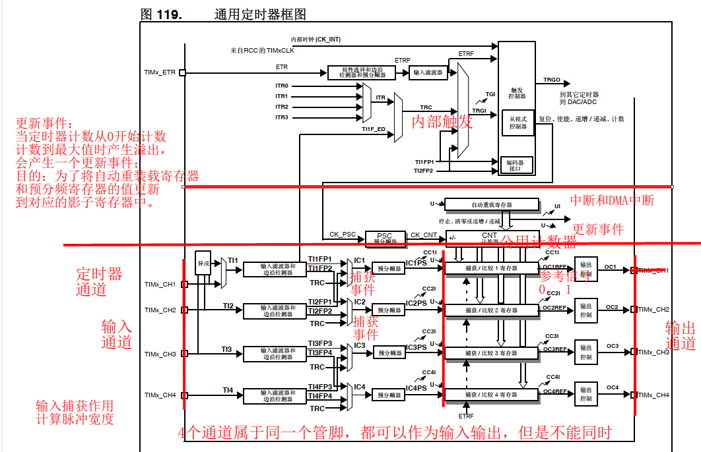

# 32单片机学习记录10之通用定时器

## 前置

**STM32F407，通用定时器是基本定时器的进化版吧？我看通用定时器内部框图其中包含了基本定时器的框图。**
**那么在配置通用定时器时，是不是遵守用什么功能配置对应的寄存器？因为通用定时器相关的寄存器太多了？**

是的，STM32F407的通用定时器（General Purpose Timer）可以看作是基本定时器的一个进化版。通用定时器提供了更多的功能和更复杂的控制机制。以下是几个关键点：

1. **功能包含**：通用定时器确实包含了基本定时器的所有功能，但同时还增加了很多高级功能，如：
   - 输入捕获
   - 输出比较
   - PWM（脉宽调制）生成
     - **通用定时器通过输出比较功能来实现PWM信号的生成，所以可以说PWM是输出比较功能的一种应用形式。**
   - 计数器模式（向上、向下或中心对齐模式）
2. **配置寄存器**：在配置通用定时器时，你需要根据你要实现的功能来选择和设置相应的寄存器。这确实是因为通用定时器的功能多，相关的寄存器也很多。以下是一些主要的配置步骤：
   - **时钟源选择**：配置定时器的时钟源（如内部时钟、外部时钟等）。
   - **计数器模式**：选择计数器是向上计数、向下计数还是中心对齐模式。
   - **预分频器**：设置预分频器来调整定时器的计数频率。
   - **自动重装载值**：设置计数器的最大值。
   - **捕获/比较寄存器**：如果使用输入捕获或输出比较功能，需要配置这些寄存器。
   - **中断和DMA**：配置中断或DMA传输以便在特定事件发生时进行处理。
3. **功能与寄存器对应**：
   - 例如，如果你要配置PWM模式，你会需要设置ARR（自动重装载寄存器），CCRx（捕获/比较寄存器），以及相应的CCMRx（捕获/比较模式寄存器）来控制PWM的占空比和频率。
   - 如果是输入捕获模式，你需要配置CCER（捕获/比较使能寄存器）来启用捕获功能，并可能需要设置CCMRx来选择捕获模式。
     - 输入捕获的最常用应用形式之一是**测量脉冲宽度**或**测量信号频率**。具体来说：
       - **测量脉冲宽度**：通过捕获信号的上升沿和下降沿时间，可以计算出脉冲的宽度。这在需要精确控制或测量脉冲信号的系统中非常有用，例如在遥控系统中测量接收到的信号脉宽。
       - **测量信号频率**：通过捕获信号的多个周期的上升沿或下降沿，可以计算出信号的频率。这在频率计、转速测量（如用在电机控制系统中）等应用中非常常见。
4. **使用工具**：由于配置过程较为复杂，建议使用**STM32CubeMX**这样的工具来生成初始化代码，这样可以大大简化配置过程。该工具可以根据你选择的功能自动配置相关的寄存器。

总之，配置通用定时器时，确实需要根据所需功能选择和配置相应的寄存器，但通过了解每个寄存器的功能和使用正确的工具，可以有效地管理和配置这些复杂的定时器。

## 通用定时器的介绍

### 主要应用场景

- 延时和定时中断 （包含了基本定时器的所有功能）

- 输出比较(驱动IO口输出PWM )   

- 输入捕获(定时器计算IO口高低电平的时间) 

### STM32F4通用定时器的分布和各自特点

**TIM2到TIM5**           

特点：

1. 有四个通道，可用于
   1. 输入捕获
   2. 输出比较
   3. PWM 生成（边沿和中心对齐模式）
   4. 单脉冲模式输出
2. 通用定时器包含一个 16 位或 32 位自动重载计数器16 位（TIM3 和 TIM4）32 位（TIM2 和 TIM5）递增、递减和递增/递减自动重载计数器。
3. 16 位可编程预分频器
4. 输入捕获和输出比较
5. 编码器使用


**TIM9和TIM12**        

特点：

1. 两个通道（**还是可以使用上面的四种，只是通道少两个，不能同时使用而已**）
   1. **看框图就知道了**
2. 通用定时器包含一个 16位 自动重载计数器,递增计数器。
3. 16 位可编程预分频器
4. 输入捕获和输出比较


**TIM10，TIM11,TIM13,TIM14**  

特点：

1. 一个通道
2. 通用定时器包含一个 16 自动重载计数器递增计数器。
3. 16 位可编程预分频器
4. 输入捕获和输出比较

## 通用定时器框图

### 通用定时器框图结构

- 时钟源选择部分

- 基本定时器部分

- 输出比较部分

- 输入捕获部分



#### 通道功能的理解

**这四个通道只是可以用作四个功能的输入输出通道吧？同一时间：时钟频率还是只能输入一个有效值，还有周期也只能输入一个吧？只是在这种前提下，这四个通道可以实现的功能吧？比如周期不变但是占空比不同的PWM波形？**

- **单一时钟源**：每个定时器（如TIM2到TIM5）使用单一的时钟源，这意味着**所有四个通道共享同一个时钟频率**。你不能为每个通道独立设置不同的时钟频率。
- **周期**：定时器的周期由自动重装载寄存器（ARR）决定，这意味着**所有四个通道共享同一个周期**。你不能为每个通道设置不同的周期。
- **功能的多样性**：**虽然时钟频率和周期是固定的，但是每个通道的功能是独立的**，因此：
  - **输入捕获**：四个通道可以同时捕获不同的外部信号。
  - **输出比较**：四个通道可以独立地进行输出比较操作。
  - **PWM生成**：在同一个周期内，四个通道可以输出具有不同占空比的PWM信号。你可以独立地设置每个通道的比较寄存器（CCRx）值来调整每个PWM信号的占空比。

**具体到PWM生成：**

- 你可以**设置定时器的ARR值来决定PWM的周期。**
- 然后通过**设置每个通道的CCR值来独立地调整每个通道的占空比**。例如：
  - CH1的CCR1值决定了它的占空比。
  - CH2的CCR2值决定了它的占空比。
  - CH3的CCR3值决定了它的占空比。
  - CH4的CCR4值决定了它的占空比。

所以，**虽然定时器的时钟频率和周期是固定的，但每个通道可以实现不同的功能和参数设置**，这使得你可以在同一时间内输出周期相同但占空比不同的PWM波形。这正是通用定时器的灵活性所在。

### 时钟源选择部分

#### 时钟源部分

**有三种时钟来源，但是具体支持几种，看芯片手册描述**

**TIM2~TIM5**

**内部时钟源：**

- 信号源来自于哪里
  - APBX总线

- 如何选择本时钟源：
  - SMCR寄存器的SMS  000

**外部时钟模式1**

- 信号源具体来自于哪里

  - ITRX(定时器级联)
    - 定时器又接着一个定时器
    - 级联的作用，不断的可以分频，分到一个很慢的速度
    - 如何配置级联（级联表）

  - TI1F_ED(输入捕获的通道1接口进入**不经过滤波**)

  - TI1FP1(输入捕获的通道1接口进入经过滤波)

  - TI2FP2(输入捕获的通道2接口进入经过滤波)
    - ETRF(外部时钟模式2的接口进入)
      - **还有单独的这个模式的入口**

  - 说明：如何选择以上某一个信号源  SMCR寄存器的TS位	

- 如何选择本时钟源
  - SMCR寄存器的SMS  111

​	

**外部时钟模式2**

- 信号源来自于哪里
  - 片外接入（时钟脉冲设备）

- 如何选择本时钟源
  - SMCR寄存器的 ECE位 写入1

- 经过：
  - 变沿选择  分频  滤波

**特别提示：通常情况建议用内部时钟，不用外部时钟**

- **稳定性和精度**：内部时钟更稳定，不易受外部干扰。
- **同步**：与系统其他部分同步，避免同步问题。
- **便捷性**：无需额外硬件配置，简化设计。
- **资源管理**：不占用额外引脚，优化资源使用。

然而，**也有使用外部时钟的场景**：

- **特定频率需求**：当应用需要一个特定频率而内部时钟无法提供或调整到时。
- **外部同步**：如果需要与外部设备或系统同步，外部时钟可以提供这种同步的可能性。
- **特殊应用**：某些应用，如频率测量或信号生成，可能需要外部时钟提供更高精度的计时或特定的时钟源。

 

**TIM9 / TIM12**

- 时钟源：
  - 同TIM2 ~ TIM5  但是没有外部时钟模式2
  - 看芯片手册的相关描述和内部框图

**TIM10 TIM11 TIM13 TIM14**

- 时钟源：
  - 只能用内部时钟源（APBx）

### 基本定时器部分

​		完全符合基本定时规则，里面就是包含了一个基本定时器

### 输出比较部分

**输出比较**是STM32F407通用定时器的一个关键功能，通过比较定时器计数器的值与预设的比较值来控制输出信号的状态。以下是输出比较的几个主要应用场景：

1. **PWM（脉宽调制）生成**：
   - **应用场景**：PWM广泛应用于电机控制、LED调光、电源管理等领域。
   - **实现**：通过设置比较寄存器的值，可以调整PWM信号的占空比。每个定时器通道可以独立地产生PWM信号，从而可以实现多路PWM输出。例如，可以控制多个LED的亮度或多个电机的速度。
2. **单脉冲模式**：
   - **应用场景**：用于触发事件或产生单个脉冲，如激光器触发、摄像头快门控制等。
   - **实现**：设置定时器在计数器值达到比较值时产生一个脉冲，然后定时器自动停止。
3. **定时输出**：
   - **应用场景**：定时控制输出信号状态，如定时开关继电器、定时打开/关闭设备等。
   - **实现**：当计数器值与比较值相等时，改变输出信号的状态。
4. **波形生成**：
   - **应用场景**：用于产生复杂的波形，如正弦波、方波等，用于音频信号生成、信号测试等。
   - **实现**：通过快速调整比较值来模拟所需的波形。
5. **电机控制**：
   - **应用场景**：用于无刷直流电机（BLDC）或步进电机的控制。
   - **实现**：通过PWM信号调节电机转速和扭矩，输出比较可以用于生成必要的控制信号。
6. **数字信号处理**：
   - **应用场景**：在一些需要精确控制信号的数字信号处理应用中。
   - **实现**：通过输出比较可以实现信号的精确控制，如在数字音频合成中生成特定频率的音调。

使用输出比较的优势：

- **灵活性**：每个通道可以独立配置，允许多种信号生成。
- **精确控制**：输出比较提供精确的时间控制。
- **多功能性**：不仅限于PWM，还可以实现各种输出控制模式。

注意事项：

- **时钟频率**：选择合适的时钟频率来确保定时器的分辨率和精度。
- **占空比**：在PWM应用中，占空比的调整直接影响输出信号的特性。
- **死区时间**：在使用PWM控制电机时，可能需要考虑添加死区时间以防止短路。

## 通用定时器输出比较_PWM

- 原理：通过定时器可以控制一个脉冲的 ***\*周期\**** 和 ***\*高电平\**** 的时间,(低电平的时间)

- PWM:波形的周期不变，占空比可以改变

- 占空比：高电平的时间与周期的比（高低电平的时间可以改变）

- 周期  ：一个脉冲的时间（**频率的倒数**） 

- 改变PWM占空比:
  - 连续输出多个脉冲，每个脉冲的周期不变，可以改变高低电平的时间(比较寄存器的值)

- 例子:
  - 计数器装的是数的总个数，也就是总的周期数
  - 频率的倒数，就是一个周期的时间（按照电平来讲，就是一个高低电平的时间）

```
自动重装载寄存器设定一个值   例如1000     //周期

比较寄存器设定一个值      例如500

此时计数器在0到499时，     输出高电平

计数器在500到999时，      输出低电平
```

### 软件生成PWM信号看PWM本质

**PWM就是频率不变的情况下，一段时间输出高电平，一段时间输出低电平但是总的周期不变。重复此操作。那其实其实写一个函数让GPIO口按照规律一段时间持续高电平，一段时间输出低电平，频率对应的周期不变，理论上是不是也能达到这个效果？形成PWM波形？**

理论上来说，你的理解是正确的。通过编写一个函数来控制GPIO口**在固定的时间间隔内交替输出高电平和低电平，确实可以生成一个类似PWM的波形**。以下是这个方法的几个关键点：

1. **定时器**：你需要一个精确的计时机制来确保高电平和低电平的持续时间准确无误。可以使用硬件定时器或软件延迟来实现这个功能。
2. **占空比控制**：通过调整高电平持续的时间和低电平持续的时间的比例，你可以控制所谓的“占空比”，从而模拟PWM的效果。
3. **频率**：通过设定整个周期（高电平+低电平）的总时间，你可以控制PWM信号的频率。
4. **GPIO控制**：你需要使用微控制器的GPIO引脚来输出高低电平。

**然而，这种方法与使用硬件定时器生成PWM相比有一些区别和限制：**

- **精度和稳定性**：硬件定时器提供的PWM**生成通常更精确和稳定**，因为它们是专门为这种任务设计的。软件生成的PWM可能**会因为其他任务的干扰而导致时间不准确**，特别是在多任务环境中。
- **资源消耗**：**使用软件模拟PWM会占用CPU资源，因为微控制器需要不断地进行计时和GPIO控制操作。而硬件PWM几乎不消耗CPU资源。**
- **复杂性**：如果需要多个PWM信号，硬件定时器通常可以轻松处理多个通道，而软件模拟则需要更多的代码和管理。
  - 定时器有多个独立的通道，可以[在频率不变，周期数固定的情况下输出不同的PWM波形](####通道功能的理解)
- **噪声和抖动**：软件生成的PWM信号可能由于定时不精确或中断导致信号抖动或噪声，这在某些应用中可能不理想。

### 定时器驱动IO输出PWM配置寄存器思路

```
配置定时器PWM波输出
CR1：
	7   位         重装载值寄存器影子寄存器使能位     //1
	6:5 位         对齐方式                           //00     边沿对齐方式
	4   位         计数方向                           //0      递增计数
	3   位         计数模式                           //0      连续计数模式
	2: 1 位         允许更新事件，UG位触发            //00
	0   位         使能计数器                         //1      
SMCR
	2:0 位         时钟源选择                         //000     内部时钟源
EGR
	0   位         人为产生更新事件                   //1        UG位人为产生更新事件
CCMRx
	6:4 位          输出形式                          //110       PWM波模式1
  3   位          比较寄存器的影子寄存器使能        //1         使用影子寄存器
	1:0 位          通道模式配置                      //00        选择通道的输出模式
CCER
	3   位          输出比较模式必须为0               //0
	1   位          选择有效电平                      //根据自己需求
	0   位          1 号通道使能                      //1          通道使能       
PSC        
	内部时钟分频                      //直接写
ARR 
	计数总数 一个脉冲的周期          //直接写入
CCRx              
	设置比较值(占空比)               //直接写入
```

**注意：此时影子寄存器全部使能**

预分频器的影子

- **预分频器**（Prescaler）是用来降低定时器时钟频率的计数器。它将输入时钟频率除以一个预分频值来产生定时器的计数时钟。
- **影子预分频器**：有些定时器（特别是高级定时器）支持“影子预分频器”，它允许在不影响当前计数周期的情况下更改预分频值。**这种机制确实有助于保护一个周期内的频率不变**，因为更改预分频器的值不会立即生效，而是等到下一个周期才应用。这避免了在周期中间改变频率，保证了当前周期的完整性。

自动重装载值影子寄存器

- **自动重装载寄存器**（ARR）决定了定时器的计数周期。
- **自动重装载值影子寄存器**：这是一种保护机制，当你改变ARR的值时，新的值不会立即生效，而是存储在一个影子寄存器中。**这个机制保证了在当前周期结束之前，计数器会继续按照原来的ARR值运行**，从而保证了一个周期的完整性。

比较寄存器影子

- **比较寄存器**（CCRx）用于设置PWM信号的占空比。
- **比较寄存器影子**：类似于自动重装载值，比较寄存器也可以有影子机制。**这个影子寄存器确保在当前周期内，PWM信号的占空比不会因为新值的写入而改变**，直到下一个周期开始时才应用新的比较值。这确保了PWM信号在一个周期内的稳定性。

这些影子寄存器的使用主要是为了确保定时器的操作不会在周期中间突然改变，从而避免了可能的计时不准确或信号不稳定。它们提供了一种方式来安全地更新定时器的参数，保证了定时器的可靠性和一致性，尤其是在实时控制或高精度应用中是非常有用的。

### 定时器驱动IO输出PWM波程序设计

```c
总体程序设计
IO控制器配置
通用定时器控制器配置
详细程序设计
初始化配置函数
{
/*IO控制器配置*/
//端口时钟使能
//端口模式配置-------复用模式
//输出类型
//输出速度
//上下拉
//复用功能寄存器
/*通用定时器控制器配置*/
//定时器时钟使能
//CR1
//SMCR
//CCMRx
//CCER
//PSC
//ARR
//CCRx
//EGR
}
```

### PWM波控制LED亮度原理

- 脉冲周期设置为1ms连续输出,可以通过改变周期内的高电平和低电平的时间

- 从而达到灯闪的效果,由于周期1ms，人眼无法分辨出灯闪，就看到不同亮度状态

- 思考:

  - 周期拉过长会出现什么效果    //就会看到闪的效果
    - 周期太长的话，比如1s,高低电平才切换一次，人就能看到闪烁了。

  - 如何改变亮度？         // 比较寄存器的值

- PWM可以驱动IO口的电压值，根据占空比改变而改变

- 说明: 电机调速,彩灯,舵机,屏幕亮度 同理

## 改变占空比影响亮度和转速的本质

1. **PWM（脉宽调制）**：PWM是一种通过改变脉冲宽度来控制模拟电路的技术。在STM32F407上，PWM信号的周期是固定的，但是占空比（即有效电平在整个周期中所占的比例）是可以改变的。
2. **LED亮度控制**：
   - 对于一个低电平有效的LED（即低电平亮，高电平灭），增加低电平的持续时间（即增加占空比），在周期不变的情况下，LED亮的时间就变长了。
   - **原理**：**LED的亮度与通过它的平均电流成正比。PWM通过改变LED亮的时间来改变通过LED的平均电流，从而控制亮度。**
   - **电压的影响**：在PWM控制下，LED的电压实际上是在快速地在高电平（关闭状态）和低电平（亮的状态）之间切换。由于这种切换速度非常快（通常是几千赫兹到几十千赫兹），人眼无法感知到这种闪烁，**而是感知到一个平均亮度**。因此，**实际上是通过改变低电平的持续时间来控制LED的有效电压，从而控制亮度。**
3. **电机转速控制**：
   - 对于电机来说，PWM信号的占空比直接影响了电机的平均供电电压。更高的占空比意味着电机在每个周期内获得更长时间的高电平，从而获得更多的能量，导致转速增加。
   - **前提是高电平驱动电机**
   - **同样地，电机的转速与通过电机的平均电流（或平均电压）相关，PWM通过改变高电平的持续时间来控制这个平均电压，从而调节转速。**

**总结**：

- 增加低电平持续时间（增加占空比）确实会增加LED的亮度，因为它增加了LED亮的时间，从而增加了通过LED的平均电流。
- 这个过程本质上是通过改变电压的有效值来实现的。PWM信号的频率足够高时，LED或电机看到的是一个平均电压，这个平均电压决定了它们的表现（亮度或转速）。

需要注意的是，PWM的频率选择也非常重要。对于LED，通常选择高于人眼能感知的频率（一般在100Hz以上）以避免闪烁。而对于电机，PWM频率的选择需要考虑到电机的特性，避免引起不必要的噪音或效率损失。


**所以对于LED来说的话，只要频率不变，人依旧看不到灯的闪烁，但是可以改变占空比人可以看到亮度的变化，但是依旧看不到灯的闪烁，除非频率非常慢**

- **周期不变的情况下**，如果我们增加低电平的持续时间（即LED亮的时间），那么高电平的持续时间（即LED灭的时间）必然会相应减少，因为整个周期的长度是固定的。

- **频率足够高时**，人眼无法分辨出LED的闪烁。假设你说的周期是1000微秒（即频率为1kHz），前900微秒是低电平（LED亮），后100微秒是高电平（LED灭）。由于频率足够高（1kHz或更高），人眼会将这些快速的闪烁平均化，感知到的是一个稳定的亮度。

- **如果频率降低到人眼能感知的范围内**，例如降低到10Hz（即周期为100毫秒），这时如果你保持同样的占空比（例如90%的周期为低电平），你会看到LED亮的时间明显比灭的时间长。在这个频率下，人眼能够感知到LED的闪烁，并且会注意到亮的时间更长。

- **频率与占空比的关系**：

  - 频率决定了闪烁的速度。
  - 占空比决定了在每个周期内，LED亮的时间占比。

  当频率足够高时，人眼将占空比视为亮度，而当频率降低到人眼能感知闪烁时，占空比的变化会直接影响到LED亮灭的时长感知。

因此，在你描述的情景下：

- 周期不变，频率也不变，增加低电平的持续时间会使LED看起来更亮。
- 如果频率降低到人眼能感知闪烁的范围，LED的亮灭周期会变得明显，占空比的变化会直接影响到LED亮的时间和灭的时间的比例。

### 本质上影响电压

让我们详细探讨一下PWM如何影响LED亮度和电机转速：

#### LED亮度

- **占空比**：对于LED，PWM通过改变占空比来控制亮度。占空比指的是在一个周期内高电平（或低电平，视LED的有效电平而定）持续的时间比例。
  - 如果LED是低电平有效（低电平亮），增加有效电平（低电平）的持续时间，即降低占空比，会增加LED的亮度。
  - 如果LED是高电平有效（高电平亮），增加有效电平（高电平）的持续时间，即增加占空比，会增加LED的亮度。
- **电压影响**：本质上，PWM控制LED亮度是通过改变LED上的平均电压来实现的。频率足够高时，LED接收到的是一个平均电压，这个电压由占空比决定：
  - **低电平有效**：更低的占空比（更长的低电平时间）意味着LED获得更高的平均电压，导致更亮。
  - **高电平有效**：更高的占空比（更长的高电平时间）意味着LED获得更高的平均电压，导致更亮。

#### 电机转速

- **占空比**：对于电机，PWM通过改变占空比来控制电机的平均供电电压，从而控制转速。
  - 增加占空比（更长时间的高电平）会提供给电机更高的平均电压，增加转速。
  - 降低占空比（更短时间的高电平）会减少提供给电机的平均电压，减慢转速。
- **电压影响**：电机的转速直接受到供电电压的影响。PWM信号的高电平时间越长，电机接收到的平均电压就越高，转速就越快。

#### 总结

- **占空比**决定了在每个周期内，LED或电机**接收到有效电平的时间比例。**
- **频率足够高时**，人眼无法察觉到PWM信号的变化，LED和电机接收到的实际上是一个平均电压。
- **有效电平的持续时间会影响到这个平均电压**：
  - **对于低电平有效的LED，增加低电平的持续时间会增加平均电压**，增亮LED。
  - **对于高电平有效的LED或电机，增加高电平的持续时间会增加平均电压**，增亮LED或加快电机转速。

因此，PWM通过调节占空比来控制平均电压，从而影响LED的亮度和电机的转速。这里的"有效电平"指的是驱动LED或电机所需的电平，而非单纯的高电平或低电平。

**一句话：在周期和频率不变的情况下，驱动外设的有效电平持续时间越长，外设获得的平均电压越高，效果（如LED亮度或电机转速）就越强。有效电平的持续时间与平均电压的关系取决于外设的特性，而不是单纯的高电平持续时间**：

- **对于低电平有效的外设**（如一些LED），低电平持续时间越长，平均电压越高，效果越强。
- **对于高电平有效的外设**（如一些电机或其他LED），高电平持续时间越长，平均电压越高，效果越强。

因此，**关键在于有效电平的持续时间**，而不是简单地认为高电平时间越长平均电压就越高。谢谢你指出了这一点，使得解释更加准确。

## GPIO口给低电平LED常亮与GPIO口给PWM波形LED常亮的本质区别

### GPIO口给低电平使LED常亮

1. **电平持续性**：
   - LED的亮灭状态**直接**由GPIO引脚的电平决定。如果LED是低电平有效（即阴极连接到GPIO引脚，阳极连接到电源正极），那么当GPIO设置为低电平时，LED就会亮起。反之，如果是高电平有效，GPIO设置为高电平时，LED会亮。
2. **电流回路**：
   - 由于GPIO引脚**持续保持在低电平**（或高电平），LED形成一个**完整的电流回路**，因此LED会持续发光。
3. **亮度控制**：
   - **这种方法不提供亮度调节，除非通过改变电流或电压来手动调整亮度。**
4. **频率无关**：
   - **亮灯状态与频率无关，因为LED不是在闪烁，而是持续亮着。**

### GPIO口给PWM波形使LED看起来常亮

1. **脉冲调制**：
   - PWM（脉宽调制）通过快速切换GPIO引脚的高低电平来实现。即使LED在理论上是断续的，但由于频率很高（通常大于50Hz），人眼无法察觉到闪烁。
2. **占空比**：
   - 通过调整PWM的占空比，可以精确控制LED的亮度。占空比是指在一个周期内高电平持续的时间比例。100%的占空比等同于持续的低电平，LED会全亮；0%则LED不亮；在0%到100%之间，LED的亮度随占空比变化。
   - **占空比**是指高电平在整个周期中所占的比例，而非低电平的比例。在描述PWM控制LED亮度时，必须明确LED的有效电平（高电平或低电平）来正确理解占空比的影响。
3. **电流回路的间断性**：
   - 在PWM模式下，LED的电流回路是断续的，但由于频率很高，电流的平均值可以看作是恒定值，因此LED看起来是持续亮着的。
4. **频率的作用**：
   - PWM的频率对LED的视觉效果有影响。如果频率太低，LED会闪烁；如果频率足够高，LED看起来会像常亮。

### 总结

- 本质区别：
  - **持续电平 vs. 脉冲调制**：前者是持续提供电平，形成恒定的电流回路；后者是通过快速切换高低电平来模拟持续亮灯，但实际上是断续的。
  - **控制精细度**：PWM提供更细腻的控制，可以调整亮度，而直接设置电平只能让LED全亮或全灭。
  - **应用场景**：直接设置电平适合简单的开关控制，而PWM适用于需要调光或节能的应用。

两者虽然在视觉效果上可能相似，但在实现机制、控制能力和应用场景上存在显著区别。


## 计数频率和PWM频率的区别（重点）

### 概念与方式

**PWM频率**

**概念**：

- PWM（脉宽调制）频率指的是PWM信号在一个周期内从高电平到低电平再回到高电平的频率。它决定了PWM信号的开关速度。
- 在电机控制或LED调光等应用中，PWM频率决定了控制信号的更新频率。

**计算方式**：

- PWM频率的计算公式为：

- ```c
  PWM频率 = 计数频率 / (ARR + 1)
  ```

- 这里，`ARR` 是自动重装载值。

**PWM频率的计算**

1.**ARR+1/计数频率得到一个时间**：

- 这里的`ARR+1`实际上是定时器在**每个PWM周期内计数的总次数。**

- 由于计数频率（Timer Clock Frequency）是定时器每次计数的频率，因此`ARR+1`除以计数频率会得到**每个PWM周期的时间长度。**

- 这个时间长度就是PWM信号的周期（Period），我们可以用`T_PWM`来表示。

- ```c
  T_PWM = (ARR + 1) / 计数频率
  ```

2.**周期的倒数得到PWM频率**：

- 频率（Frequency）是周期的倒数，所以**PWM频率等于1除以PWM周期。**

- ```c
  PWM频率 = 1 / T_PWM = 计数频率 / (ARR + 1)
  ```

3.**理解：**

- **周期**：`T_PWM = (ARR + 1) / 计数频率` 给出了**PWM信号一个完整周期所需的时间**。
- **频率**：`PWM频率 = 1 / T_PWM` 表示在单位时间内PWM信号完成的周期数。

通过这种计算方法，你可以更直观地理解PWM频率和计数频率之间的关系：

- 首先，你通过设置`ARR`和`PSC`来决定每个PWM周期的长度（即PWM的周期）。
- 然后，PWM频率就是这个周期的倒数，即每秒钟内PWM信号的周期数。

这种方式不仅更符合物理直觉，也能帮助你更清楚地理解为什么改变`ARR`或`PSC`会影响PWM频率和信号的特性。

**计数频率**

**概念**：

- 计数频率是指定时器计数器的时钟频率，即定时器在每个计数周期内计数的频率。它是定时器内部的工作频率。
- 计数频率决定了定时器计数器能够计数的精细程度，影响了PWM信号的分辨率。

**计算方式**：

- 计数频率可以通过预分频器（PSC）从定时器的时钟源频率中得到：

- ```c
  计数频率 = 定时器时钟频率 / (PSC + 1)
  ```

- 这里，`PSC` 是预分频器值。

#### 翻译成人话

- **PWM周期**：可以理解为定时器计数器从0计数到`ARR`值再回到0所需的时间。**这就是PWM信号的一个完整周期**。这个时间长度由计数器的计数频率（Timer Clock Frequency）以及自动重装载值（ARR）共同决定。
  - 具体来说，PWM周期`T_PWM` = `(ARR + 1) / 计数频率`。
- **PWM频率**：则是这个PWM周期的倒数。也就是说，PWM频率表示的是在单位时间（如1秒）内，PWM信号完成多少个周期。
  - 因此，PWM频率 = `1 / T_PWM` = `计数频率 / (ARR + 1)`。

这样理解，PWM频率和PWM周期的关系就很清晰了：

- 你可以通过调整`ARR`（自动重装载值）和计数频率（通过预分频器PSC）来改变PWM信号的周期。
- 而PWM频率是这个周期的倒数，决定了PWM信号的开关速度。

#### 两者的区别

1. **目的**：
   - **PWM频率**：直接影响外设（如电机）的响应速度和控制信号的平滑度。
   - **计数频率**：影响定时器内部计数的精度，从而间接影响PWM信号的分辨率。
2. **设置方式**：
   - **PWM频率**：通过调整ARR值和计数频率来决定。
   - **计数频率**：通过调整预分频器（PSC）值来设置。
3. **关系**：
   - **PWM频率是由计数频率和ARR共同决定的。计数频率是PWM频率的基准，ARR则决定了每个PWM周期内计数器计数的次数。**

#### 计算例子

假设你有一个84MHz的定时器时钟频率，想设置PWM频率为10kHz：

1. **选择计数频率**：**假设**你希望计数频率是PWM频率的10倍（100kHz）。

2. **计算预分频器（PSC）**：

   ```c
   PSC = (84,000,000 / 100,000) - 1 = 839
   ```

3. **计算ARR**：

   ```c
   ARR = (100,000 / 10,000) - 1 = 9
   ```

   - PWM周期=(ARR+1)/计数频率
   - PWM频率=计数频率/(ARR+1)
   - ARR = （计数频率/PWM频率）-1

弊端：不太直观但是占空比好算

**计数周期（PWM周期）**

- **计数频率为100kHz**：意味着每秒钟计数器会计数100,000次。
- **PWM频率为10kHz**：每个PWM周期内的计数次数为`ARR + 1`，即10次（因为ARR = 9）。

因此：

- **一个PWM周期的时间**（即PWM周期）为：

- ```c
  T_PWM = (ARR + 1) / 计数频率 = 10 / 100,000 = 0.0001秒 = 100微秒（μs）
  ```

**占空比的计算**

占空比的计算确实相对简单一些，因为它**直接与PWM周期内的计数次数相关**：

- **占空比**通常以百分比表示，是PWM信号在高电平状态下的时间占总周期的比例。
- **所以就看比较寄存器在计数器中的值的占比即可**
- **比如我一个PWM周期内计数10个，比较寄存器填入4的话，那么占空比能达到50%；**

因此：

- 计数频率决定了定时器计数器的工作频率。
- PWM频率决定了PWM信号的开关频率。
- 通过设置预分频器（PSC）和自动重装载值（ARR），你可以控制计数频率和PWM频率，进而精确地生成PWM信号。

**所以单给出一个PWM频率10KHZ，没办法得到计数频率和ARR的值？**

仅给出一个PWM频率（比如10kHz）是不足以直接确定计数频率和ARR的值的，因为计数频率和ARR的选择涉及到多个因素，包括：

1. **定时器的时钟源频率**：这是定时器工作的基础频率，通常是APB1或APB2总线的频率。
   1. **看是否分频决定是否乘以2**
2. **预分频器（PSC）**：这个值决定了定时器的计数频率。你可以选择不同的预分频器值来改变计数频率。
   1. **这个决定计数器的计数的速度（频率）**
3. **PWM信号的分辨率**：你希望PWM信号的**占空比控制有多精细，这会影响你选择的计数频率和ARR值**。通常，你希望**计数频率至少是PWM频率的几倍，以提供足够的分辨率。**
4. **系统性能和资源限制**：定时器的分辨率、硬件的性能限制以及其他系统要求也会影响到你的选择。

然而，给定一个PWM频率，你可以按照以下步骤来选择计数频率和ARR：

步骤：

1. **选择一个合适的计数频率**：

   - 通常，计数频率会选择为PWM频率的几倍（比如10倍或更多），以保证足够的分辨率。
   - 例如，PWM频率为10kHz时，可以选择100kHz、200kHz等作为计数频率。

2. **计算ARR**：

   - 一旦选择了计数频率，你可以用下面的公式计算ARR：

   - ```c
     ARR = (计数频率 / PWM频率) - 1
     ```

3. **确定预分频器**：

   - 根据你选择的计数频率和定时器的时钟源频率，计算预分频器值：

   - ```c
     预分频器 = (定时器时钟频率 / 计数频率) - 1
     ```

4. 例子：

   假设你的定时器时钟频率是84MHz，你想设置PWM频率为10kHz：

   - 如果你选择计数频率为100kHz：

   - ```c
     ARR = (100,000 / 10,000) - 1 = 9
     预分频器 = (84,000,000 / 100,000) - 1 = 839
     ```

   - 如果你选择计数频率为200kHz：

   - ```c
     ARR = (200,000 / 10,000) - 1 = 19
     预分频器 = (84,000,000 / 200,000) - 1 = 419
     ```

**所以，单单给出PWM频率并不能直接确定计数频率和ARR的值，你需要根据具体的应用需求和硬件特性来选择一个合适的计数频率，然后再计算相应的ARR和预分频器值。**


### **计数频率是PWM频率的几倍，为什么会影响占空比控制的精细程度？**

计数频率与PWM频率的关系确实直接影响到占空比控制的精细程度，这里是原因：

**分辨率的概念**

- **分辨率**指的是你能控制的PWM信号的最小变化单位。分辨率越高，你就能更精确地控制PWM信号的占空比。

**计数频率与PWM频率的关系**

- 当计数频率是PWM频率的几倍时，意味着定时器在每个PWM周期内有更多的计数机会。假设PWM频率为10kHz，如果计数频率是100kHz，**那么在每个PWM周期内，定时器会计数10次（100,000 / 10,000）。**

**占空比控制**

- **占空比**是PWM信号在高电平状态下的时间比例，通常以百分比表示。占空比的精确控制依赖于定时器计数器能够计数的次数。更高的计数频率意味着你可以在每个PWM周期内有更多的计数点来设置占空比。
- **例子**：
  - 如果计数频率是PWM频率的10倍，那么每个PWM周期内有10个计数点。这意味着你可以以10%的精度（1/10）调整占空比。
  - 如果计数频率是PWM频率的20倍，那么每个PWM周期内有20个计数点，这时你可以以5%的精度（1/20）调整占空比。

**精细度**

- 更高的计数频率（相对于PWM频率）提供更多的计数点，**从而允许你以更小的增量来调整PWM信号的占空比。更小的增量意味着更精细的控制，因为你可以更细微地改变电机的速度或其他被控制的设备的输出。**

**PWM信号的平滑度**

- 更高的计数频率也使得PWM信号的变化更平滑，因为在每个PWM周期内有更多的过渡点，减少了电机或其他负载对这些变化的响应中的不连续性。

##### **总结**

当计数频率是PWM频率的几倍时，你可以：

- 更精确地控制占空比，因为每个PWM周期内有更多的计数点，这提高了分辨率。
- 获得更平滑的PWM信号，因为更高的计数频率允许更细粒度的控制，使得电机的转速变化更平稳。
- 减少由于PWM信号变化引起的噪声，因为电机或负载对PWM信号的响应会更均匀。

因此，选择一个合适的计数频率（通常是PWM频率的几倍）是非常重要的，它直接影响到你能达到的控制精度和系统的整体性能。

1. **PWM频率和计数频率**：
   - 假设你需要一个特定频率的PWM信号，比如10kHz，那么PWM周期就是1/10kHz = 0.1ms。
2. **设置计数频率**：
   - 如果你想让计数频率是PWM频率的10倍，那么计数频率应该为100kHz。
   - 在STM32F407中，定时器的自动重装载寄存器（ARR）决定了计数器在达到ARR值后重新开始计数。对于10倍的计数频率，ARR应该设置为100kHz/10kHz - 1 = 9。
3. **占空比控制精度**：
   - 当计数频率是PWM频率的10倍时，每个PWM周期内有10个计数点，这意味着你可以以10%的精度（1/10）控制占空比。
   - 如果计数频率是PWM频率的20倍，那么每个PWM周期内有20个计数点，精度为5%（1/20）。
4. **计算占空比精度**：
   - 你的公式`100 / 倍率`是正确的，用来计算能够控制的占空比的精度。
   - 例如，如果计数频率是PWM频率的10倍，精度为100/10 = 10%。
   - 如果计数频率是PWM频率的20倍，精度为100/20 = 5%。

**总结**：

- 想要精细控制占空比时，你可以先确定PWM频率，然后根据需要的精度来设置计数频率。
- 如果计数频率是PWM频率的N倍，那么ARR值应该设置为N-1。
- 通过公式`100 / N`可以计算出你能达到的占空比控制精度。

因此，如果你想控制到1%的精度，你需要设置计数频率是PWM频率的100倍，这样每个PWM周期内就有100个计数点。但是，请注意，实际应用中还需要考虑定时器的最大计数频率和系统的整体性能。


### 拿到需求后如何计算参数

拿到外设的驱动要求后，比如PWM频率或特定的脉冲周期，你可以按照以下步骤来计算和配置相关的参数：

**理解需求**

首先，确保你完全理解了外设的驱动要求。包括：

- 所需的PWM频率或脉冲周期。
- 是否有特定的占空比要求。
- 外设的特性，如响应时间、分辨率需求等。

**确定定时器的时钟源频率**

- 查阅你的MCU（如STM32F407）的数据手册或时钟树，确定你将使用的定时器的时钟源频率（通常是APB1或APB2总线的频率）。
- **是否经过分频决定是否乘以2**

**选择计数频率**

- 根据PWM频率或脉冲周期的要求，选择一个合适的计数频率。一般来说，**计数频率应该至少是PWM频率的几倍，以提供足够的分辨率。**
  - 如果是PWM频率：通常选择**计数频率为PWM频率的10倍或更多。**
  - 如果是特定脉冲周期：确保计数频率足够高，以精确控制所需的时间间隔。

**计算预分频器（PSC）**

- ```c
  PSC = (定时器时钟频率 / 所需计数频率) - 1
  ```

**计算自动重装载值（ARR）**

- **对于PWM频率**：

- ```c
  ARR = (计数频率 / PWM频率) - 1
  ```

- **对于特定脉冲周期**（比如20ms）：

- ```c
  ARR = (所需脉冲周期 * 计数频率) - 1
  ```

**配置占空比**

- 如果有占空比要求，根据你选择的计数频率和ARR值来计算CCRx（捕获比较寄存器值）：

- ```c
  CCRx = (占空比 * (ARR + 1)) / 100
  ```

**设置定时器**

按照以下顺序进行配置：

1. **停止定时器**：确保定时器在配置时是停止的。
2. **设置预分频器（PSC）**：将计算出的PSC值填入定时器的预分频器寄存器。
3. **设置ARR**：将计算出的ARR值填入定时器的自动重装载寄存器。
4. **设置CCRx**（如果需要）：如果有占空比要求，设置相应的CCRx寄存器。
5. **配置输出模式**：设置定时器的输出模式为PWM模式。
6. **启动定时器**：开始定时器的计数。

 **验证和调试**

- 使用示波器或逻辑分析仪验证PWM信号是否符合预期的频率和占空比。
- 如果需要，调整参数以优化性能。

顺序总结：

- 理解需求 -> 确定时钟源频率 -> 选择计数频率 -> 计算PSC -> 计算ARR -> 设置占空比 -> 配置定时器 -> 验证和调试。

请注意，这是一个一般性的步骤，具体的实现可能需要根据硬件和软件环境进行微调。确保你参考了相关硬件的文档和数据手册来获得准确的参数和配置方法。

#### 驱动要求的一般条件

**一般给出驱动要求的话，不是PWM周期就是PWM频率了吧？其他给出来根本无法计算。不可能给出对于计数频率的要求吧？**

你说得对，通常在驱动要求中，给出的信息要么是PWM周期，要么是PWM频率，而不是计数频率。以下是一些常见的做法和解释：

1. **PWM周期**：
   - 直接给出PWM信号的周期，比如“20ms的脉冲”，这意味着你需要设置定时器，使得PWM信号的周期为20ms。
2. **PWM频率**：
   - 给出PWM信号的频率，比如“50Hz的PWM信号”，这意味着你需要计算出相应的周期（1/frequency），然后设置定时器以达到这个频率。

**为什么不给出计数频率的要求**：

- **独立性**：计数频率是内部实现细节，取决于你使用的微控制器和定时器的配置。不同微控制器可能有不同的时钟频率和计数能力。
- **灵活性**：PWM信号的实现可以有不同的计数频率选择，允许开发者根据实际需求和硬件限制来优化PWM信号的生成。
- **通用性**：**PWM周期或频率是驱动要求中最通用的描述方式，因为它们直接关系到PWM信号的实际表现，而计数频率则是实现这个表现的一种方法。**

**如何计算**：

- 当给出PWM周期时，你可以根据定时器的时钟频率计算出需要的ARR值。例如，如果定时器时钟频率是100kHz，PWM周期是20ms，则ARR = 100kHz * 0.02s - 1 = 1999。
- 当给出PWM频率时，你首先计算出周期，然后再用同样的方法计算ARR值。

**总结**：

- **在驱动要求中，通常会给出PWM周期或PWM频率，而不是计数频率。**
- 计数频率是内部实现细节，开发者可以根据硬件和需求来选择合适的计数频率，以满足给定的PWM周期或频率要求。
- 因此，你的理解是正确的，通常不会直接给出对于计数频率的要求，因为这是实现PWM信号的一种方法，而不是最终的目标。
- 你可以根据给出的PWM频率或PWM周期计算出对应的PWM频率。
- 然后，根据你想要的占空比控制精度，决定计数频率与PWM频率的倍率关系。
- 通过选择合适的预分频器值和ARR值来实现这个倍率关系，从而确保PWM信号的生成能够满足你对占空比控制精度的要求。

#### 两者计算参数的区别

直接设置计数频率：

**用法**：

- 直接根据需要的时间间隔（如10微秒）来设置计数频率和ARR值。例如，选择计数频率为1 MHz（1次每微秒），然后设置ARR为9以产生10微秒的高电平信号。

**应用场景**：

1. **简单时间控制**：当你只需要一个固定时长的脉冲信号，不需要频繁调整占空比时，这种方法非常直观。
2. **快速响应**：由于ARR值较小，定时器可以更快地达到触发条件，适合需要快速响应的应用。
3. **低精度要求**：如果你对占空比的精确控制没有严格要求，直接设置计数频率可以简化配置和理解。
4. **调试和学习**：对于新手或在开发阶段，这种方法更容易理解和调试，因为计数值直接对应于时间间隔。

通过PWM频率反推计数频率：

**用法**：

- 首先确定PWM频率，然后选择一个高于该频率的计数频率（通常是PWM频率的几倍），以获得更高的分辨率来控制占空比。例如，如果PWM频率为100 kHz，你可以选择1 MHz的计数频率。

**应用场景**：

1. **精细控制占空比**：当你需要以很小的增量来调整占空比时，这种方法可以提供更高的精度。例如，在电机控制、LED亮度调节等需要精细控制的应用中。
2. **高精度要求**：在需要非常精确的脉冲宽度控制的场景中，如某些通信协议（如I2C、SPI等）或者精确的定时应用。
3. **复杂信号生成**：当需要生成复杂的波形或信号序列时，通过PWM频率反推计数频率可以提供更大的灵活性。
4. **动态调整**：如果你的应用需要动态地改变信号的占空比或频率，这种方法提供了一个更灵活的框架来实现这些调整。
5. **专业应用**：在需要对信号进行微调的专业设备中，这种方法能提供更精确的控制，减少抖动，提高系统的整体性能。

总结：

- **直接设置计数频率**适合于简单的定时需求、快速响应应用、以及对占空比精度要求不高的场合。它提供了直观的设置和快速的实现。
- **通过PWM频率反推计数频率**适用于需要精细控制占空比的应用、对信号精度有高要求的场合，以及需要动态调整信号特性的场景。这种方法提供了更大的灵活性和精度，但可能增加配置和理解的复杂性。

选择哪种方法取决于你的具体应用需求、对占空比控制的精度要求，以及你对系统复杂性的接受程度。

## 输入捕获部分

使用:

- **监控**外部输入信号的脉冲宽度，一个**脉冲**的有效时间 

- **监控**外部输入信号的周期和占空比------PWM波

### 原理

捕获一个脉冲的原理：

​	外部管脚输入进来脉冲信号

​	经过滤波器（滤掉高频杂波）

​	经过边沿检测器

​	果边沿检测器检测到需要捕获的边沿，

​	就会将此时计数器的值加载到捕获寄存器同时可以触发捕获中断

**输入捕获的工作原理**

1. **外部管脚输入**：外部信号通过STM32F407的某个GPIO引脚输入到芯片内部。
2. **滤波器**：信号首先可能经过一个数字滤波器（如果配置了的话），以去除高频噪声，确保信号的稳定性。
3. **边沿检测器**：
   - 你可以配置边沿检测器来检测信号的上升沿（从低到高）或下降沿（从高到低），或者两者都检测。
4. **捕获过程**：
   - 当检测到指定的边沿时，计数器的当前值会被立即捕获并存储到相应的捕获寄存器中。
   - 同时，捕获事件可以触发一个中断（如果中断使能了），或者直接触发DMA传输（如果配置了）。

### 过程

捕获过程:	

​	通道设置为输入----管脚

​	信号进入需要滤波(去除加杂在有效波形中的高频杂波)

​	**预分频器将输入的信号可以分频------不用**

​	信号输入进来后检测到一个边沿后将计数器中的值加载到捕获寄存器中

​	切换另外一个边沿

​	第二个边沿触发后，再次捕获计数器的计数，两次的差就是脉冲的宽度。

### 疑问

**所谓脉冲是一个交替的高低电平信号吧？不是所谓的GPIO口持续输出一个高电平或者低电平吧？**
**输入捕获必须要接住中断？**

**关于脉冲的定义**

- **脉冲信号**：确实是指一个信号在一定时间内从低电平变到高电平，然后再变回低电平的过程。它可以是单个的脉冲或者一系列脉冲（如方波）。这与GPIO口持续输出一个固定电平（如一直高电平或一直低电平）不同。**GPIO持续输出固定电平通常用来表示静态状态，而脉冲则用于动态信号传输或事件标记。**

1. **脉冲信号**：是的，脉冲信号确实是交替的高低电平信号，而不是持续的高电平或低电平。

2. **必须接中断吗？**：

   - 不必须。虽然捕获事件可以触发中断，但你也可以选择不使用中断，而是：
     - 轮询捕获寄存器，看是否有新数据。
     - 使用DMA直接将捕获的数据传输到内存中。
     - 或者在其他定时器中断或事件中检查捕获寄存器。

   所以，输入捕获不一定要接中断，但如果需要实时响应或处理捕获的事件，中断是一个很好的选择，因为它能在事件发生的瞬间立即处理，不需要你去主动检查状态。选择是否使用中断取决于你的应用需求和系统设计。

   

**注意：**

​	**此时可能出现计数器计数完成，脉冲还没到另外一个边沿。如按键按下不抬起**

​	**记录溢出次数。(通过更新中断就可以记录溢出次数)**

​	**脉冲宽度计数  =  65535*n - test1 + test2**

​	**n溢出的次数(更新中断的触发次数)**

​	**通过计数完成时触发中断来知道溢出多少次**

### 外部中断的实现区别

**1.硬件资源**

- **输入捕获**：
  - 使用定时器的捕获通道（如TIM2_CH1），捕获外部信号的变化（上升沿或下降沿）。
  - 定时器会自动记录捕获时间到捕获寄存器中（如CCR1）。
- **外部中断**：
  - 使用外部中断线（EXTI），可以触发中断或事件。
  - 中断或事件发生时，处理器需要手动记录时间。

**精度**

- **输入捕获**：
  - 捕获时间的精度由定时器的计数频率决定，通常可以达到很高的精度（如几十纳秒）。
- **外部中断**：
  - 时间记录取决于中断处理的速度和系统时钟，精度相对较低，因为中断处理可能会有延迟。

**实现复杂度**

- **输入捕获**：
  - 硬件自动完成捕获过程，软件只需读取捕获值，相对简单。
  - 配置较为复杂，但一旦配置好，运行时几乎不需要额外处理。
- **外部中断**：
  - 需要在中断处理程序中手动记录时间，编程复杂度稍高。
  - 配置较为简单，但需要处理中断响应和时间记录。

**资源使用**

- **输入捕获**：
  - 使用定时器资源（计数器、捕获通道等），如果定时器资源有限，可能需要权衡。
- **外部中断**：
  - 使用NVIC和EXTI资源，可能更节省定时器资源，但会占用中断优先级。

**应用场景**

- **输入捕获**：
  - 适合需要高精度时间测量的情况，如测量脉冲宽度、频率、周期等。
  - 例如，测量超声波传感器的回波时间。
- **外部中断**：
  - 适合需要快速响应外部事件的场景，但对时间精度要求不那么高的场合。
  - 例如，检测按钮按下或某个外部信号的变化。

**总结**

- 如果需要精确的时间测量，**输入捕获**是更好的选择，因为它利用了硬件的优势，减少了软件处理的复杂性和延迟。
- 如果系统资源紧张或应用场景对时间精度要求不高，**外部中断**可能是一个更轻量级的解决方案。

### 思考

思考:

- 捕获过程中需要哪些中断?

  - 捕获中断    //及时记录捕获到计数器的值到变量
    - **使用一个通道的话，使用数组记录呗**

  - 更新中断    //记录溢出次数
    - **算脉冲宽度（高电平的持续时间）**

- 捕获过程中需要哪些标志位?

  - 捕获中断标志位

  - 更新中断标志位
  - 对应的要清除标志位了

### 基本定时器在输入捕获中的作用

是的，你的理解基本正确。STM32F407系列的通用定时器（如TIM2、TIM3、TIM4、TIM5等）确实包含了基本定时器的功能，并且在输入捕获模式中，基本定时器的作用主要有以下几点：

1. **捕获时间点**：基本定时器可以捕获特定事件（如上升沿或下降沿）的计数器值。这个值实际上是自定时器启动或上一次复位以来的计数值。
2. **计算脉冲宽度**：通过捕获上升沿和下降沿的时间点，可以计算出信号的脉冲宽度。例如，如果你捕获到上升沿时的计数值为A，下降沿时的计数值为B，那么脉冲宽度（或高电平持续时间）可以用B-A来计算。
3. **频率测量**：如果你知道定时器的计数频率（通常由定时器时钟决定），通过捕获两个上升沿或两个下降沿的时间差，可以计算出信号的频率。
4. **时间测量**：除了脉冲宽度，输入捕获还可以用来测量两个事件之间的时间间隔。

需要注意的是：

- 输入捕获通道通常需要配置为上升沿或下降沿触发，或者两者都触发（双边沿捕获）。
- 定时器的计数器（CNT）会在捕获到事件时保存当前的计数值到对应的捕获/比较寄存器（CCR）。
- 为了准确测量，定时器的计数器频率（即定时器时钟频率）应该足够高，以便捕获的计数值能够提供足够的分辨率。

在实际应用中，你可能还需要考虑：

- 定时器溢出处理：如果脉冲宽度或测量间隔超过定时器的计数范围，你需要处理溢出情况。
- 噪声过滤：使用滤波器来消除信号中的噪声，避免误触发。

总之，基本定时器在输入捕获中的主要作用就是精确地记录特定事件的时间点，从而通过这些时间点计算出你所需的各种时间参数。


### 功能实现思路

1.**配置定时器为输入捕获模式**

- **选择一个定时器**：STM32F407有多个通用定时器（如TIM2, TIM3, TIM4, TIM5），你可以选择其中一个。
- 配置定时器的通道：
  - 通常，定时器的每个通道（CH1, CH2, CH3, CH4）都可以配置为输入捕获模式。
  - 设置通道为上升沿捕获或下降沿捕获，或两者都捕获。

2.**捕获边沿的时间**

- **计数器**：定时器的计数器会以一定的频率计数（计数器的时钟频率由定时器的预分频器和主时钟决定）。
- **捕获寄存器**：当检测到边沿时，计数器的值会被捕获到相应的捕获寄存器（CCRx）。这个值代表了从定时器启动到捕获事件发生的时间。

3.**获取周期**

- 捕获两次上升沿的时间：
  - 第一次捕获上升沿时，计数器的值被保存到捕获寄存器（假设是CCR1）。
  - 第二次捕获上升沿时，再次保存计数器的值到另一个捕获寄存器（假设是CCR2）。
  - 周期可以通过计算两次捕获的时间差来得到：`周期 = CCR2 - CCR1`。
  - 由于计数器可能溢出（达到其最大值后归零），你需要考虑溢出情况，通常通过一个溢出计数器来跟踪溢出次数。

4.**获取脉冲宽度**

- 捕获上升沿和下降沿：
  - 捕获上升沿的时间到一个寄存器（如CCR1）。
  - 捕获随后的下降沿的时间到另一个寄存器（如CCR2）。
  - 脉冲宽度（高电平持续时间）=`CCR2 - CCR1`。

5.**计算占空比**

- 占空比可以用高电平时间除以周期来计算：
  - `占空比 = (高电平时间 / 周期) * 100%`

6.**使用中断**

- 配置中断：当捕获到边沿时，可以触发一个中断。
  - 在中断服务程序（ISR）中，你可以读取捕获寄存器的值，处理数据，然后准备好捕获下一个边沿。

重要提示：

- **计数器溢出**：由于计数器有最大值，当超过这个值时它会溢出并重新开始计数。你需要在软件中处理这种情况，确保捕获的时间差计算正确。
- **预分频器**：定时器的预分频器决定了计数器的计数频率，影响了时间的精度和范围。

通过上述步骤，你可以使用STM32F407的输入捕获功能来准确地测量和监控外部信号的脉冲宽度、周期和占空比。注意，实际实现中可能还需要考虑硬件滤波、信号质量等因素来确保测量的准确性。


### 最佳实践

在STM32F407或类似微控制器中，捕获脉冲信号的宽度、周期和占空比的最佳实现通常涉及到使用多个通道，原因如下：

**双通道捕获**

- **上升沿和下降沿同时捕获**：使用两个通道，其中一个通道配置为捕获上升沿，另一个配置为捕获下降沿。这种方法可以：
  - 避免频繁切换捕获模式的复杂性和潜在延迟。
  - 同时捕获到信号的上升沿和下降沿时间，提供更精确的测量结果。
  - 简化软件逻辑，因为你不需要在软件中处理模式切换。
- **实现步骤**：
  - 配置两个定时器通道，一个为上升沿捕获（如CH1），一个为下降沿捕获（如CH2）。
  - 启动定时器。
  - 每个通道在捕获到各自的边沿时，将计数器的值分别保存到各自的捕获寄存器中（如CCR1和CCR2）。
  - 在中断或主循环中读取这两个值，计算周期、脉冲宽度和占空比。

**使用更多通道**

- **多信号监控**：如果需要监控多个独立的脉冲信号，那么使用更多通道是必要的，每个信号一个或多个通道。
- **备份和冗余**：为了增加系统的可靠性，有时会配置额外的通道作为备份或用于不同类型的测量。

3. **单通道方案的限制**

- 虽然单通道也能实现，但存在以下限制：
  - 需要在软件中处理模式切换，可能会引入延迟和复杂性。
  - 可能需要额外的逻辑来处理计数器溢出和确保测量精度。
  - 不适合需要同时捕获多个信号的应用。

结论

- **最佳实现**：通常使用**两个通道**是最佳的，一个捕获上升沿，另一个捕获下降沿。这样可以最大化捕获的精度和简化软件逻辑。
- **扩展性**：如果有更多信号需要监控，或者为了增加系统的冗余和可靠性，可以使用更多通道。

因此，如果你的应用允许，建议使用两个或更多通道来捕获脉冲信号的特性。这不仅能提高测量的准确性和效率，还能简化程序逻辑，使系统更稳定和可靠。

**监控外部输入信号的脉冲宽度，一个脉冲的有效时间**

- 双通道捕获：一个通道捕获上升沿，另一个通道捕获下降沿。
  - 通过读取两个捕获寄存器的值，**可以直接计算出高电平持续的时间（脉冲宽度），因为高电平时间就是从上升沿到下降沿的时间差。**
  - 你不需要在软件中切换捕获模式，简化了逻辑。

**监控外部输入信号的周期和占空比**

- **周期**：两次连续的上升沿之间的时间差就是信号的周期。你可以从上升沿通道读取两次捕获的值来计算。
- **占空比**：占空比是高电平时间除以周期。你已经可以通过双通道捕获得到高电平时间和周期，因此很容易计算出占空比。

**关于中断：**

- 是否需要中断？：这取决于你的应用需求和系统设计：
  - **实时性要求高**：如果需要实时响应或处理捕获事件，使用中断是一个很好的选择。中断能在捕获事件发生的瞬间立即处理，不需要你去主动检查状态。
  - **低实时性需求**：如果你可以容忍一些延迟，或者你有其他定时器或任务来定期检查捕获寄存器的状态，那么可以选择不使用中断，**而是通过轮询来获取数据。**
  - **DMA**：另一种选择是使用DMA（直接存储器访问）来直接将捕获的数据传输到内存中，减少CPU的干预。

**总结**

双通道捕获方法提供了以下优势：

- 简化了软件逻辑，不需要频繁切换捕获模式。
- 提供了更高的测量精度和实时性。
- 可以很好地完成监控脉冲宽度、周期和占空比的需求。

使用中断可以提高系统的响应性和实时性，但如果你对实时性没有严格要求，也可以选择不使用中断，通过轮询或DMA来处理捕获的数据。选择使用中断与否，取决于你的系统设计目标、实时性需求以及资源的利用。

### 输入捕获相关寄存器

```c
CR1:
	9 8 位  ：采样频率
	
CCMRx
	1 0 位  ：设置信号来源
	3 2 位  ：输入捕获预分频不需要
	7~4 位  ：设定滤波采样次数和每次采样间隔的时间   

CCER
	0   位  ：输入通道使能---1
	1   位  ：检测边沿选择  （先检测上升沿切换到检测下降沿）
				跟3位组合的使用
```

### 程序设计

```
总体程序设计
	初始化配置
		IO口控制器配置
		定时器控制器配置
		NVIC控制器配置
	中断服务函数
```

详细设计

```
详细程序设计
初始化配置函数
{
/*IO口控制器配置*/
	//端口时钟使能
	//端口模式配置
	//上下拉
	//复用功能寄存器
/*定时器控制器配置*/
	//定时器时钟使能
	//CR1
	//SMCR
	//DIER（中断使能不着急开，否则可能在初始化阶段进入不必要的中断，最好放在外设使能的前面）
	//EGR
	//CCMRx
	//CCER
	//PSC
	//ARR
/*NVIC控制器配置*/
	//优先级分组
	//计算优先级编码值
	//设置具体中断源优先级
	//使能NVIC响应通道（后面才使能中断通道，对于不挂起的中断信号，也可以起到屏蔽效果）
}

中断服务函数
{
	//判断是更新中断
	{
	//清除中断标志位
	//紧急事件
	}
	//判断是捕获中断
	{
	//清除捕获中断标志位
	//紧急事件
		{
        	判断是上升沿的(初始化中定义了一个，所以可以通过这个判断){
        		取寄存器中的值
        		切换模式
        	}
        	判断是下降沿的{
        		取寄存器中的值
        		计算脉冲宽度
        	}
		}
	}
}
```

## 输入捕获实际应用

HC-SR04超声波测距模块：

1. **触发信号（Trig）**：
   - 首先，向HC-SR04的Trig引脚发送一个至少10微秒的高电平脉冲信号。这个脉冲信号会触发模块发出一个8个周期的40kHz超声波脉冲。
2. **发射超声波**：
   - 在触发信号之后，模块会自动发送超声波脉冲。超声波以声速（约343米/秒，空气中温度为20°C时）向前传播。
3. **接收回波（Echo）**：
   - 超声波遇到障碍物后会被反射回来。模块通过Echo引脚输出一个高电平信号，这个信号持续的时间就是超声波从发出到返回的时间。
4. **时间测量**：
   - 测量Echo引脚的高电平持续时间（即回波时间）。由于声波来回传播的时间是相同的，所以我们可以用这个时间来计算距离。
5. 测试距离
   - (高电平时间*声速（340M/S）)/2

触发HC-SR04模块的超声波发射有两种主要方式：

**第一种：直接使用GPIO口**

- **方法**：直接通过GPIO口输出一个高电平信号，持续10微秒以上。

- 优点：

  - 实现简单，代码量少。
  - 适用于对时间精度要求不高的应用。

- 缺点：

  - 时间控制可能不够精确，因为GPIO的切换可能存在延迟。
  - 受软件执行速度影响，实际持续时间可能略有偏差。

- **改进**

  - **GPIO口发送高电平**：

    - 使用GPIO口直接将触发引脚（Trig）设置为高电平。

  - **使用定时器实现延迟**：

    - 启动一个定时器，在定时器中断服务程序（ISR）中控制延迟时间。
    - 在中断发生时，将触发引脚设置为低电平。

  - 优点：

    - **精确时间控制**：使用定时器来控制延迟时间，可以确保高电平信号持续时间的精确性，不受软件执行速度的影响。
    - **代码简洁**：虽然需要设置定时器，但代码逻辑仍然相对简单。
    - **避免软件延迟的不可预测性**：使用定时器中断来控制信号的停止时间，可以避免因为其他中断或任务占用CPU时间而导致的延迟不准确问题。

    缺点：

    - **稍微增加了复杂度**：虽然比完全使用定时器控制信号的复杂度低，但还是需要配置定时器和处理中断。
    - **中断处理**：需要处理中断，这可能在某些应用中增加了额外的考虑因素，特别是当系统中有多个中断源时。

  - 通过这种方法，你可以保持GPIO操作的简单性，同时利用定时器的精确性来实现准确的时间控制，确实可以规避掉直接使用GPIO口的部分缺点。

- **如果已经决定使用定时器来实现精确的延迟，那么直接使用定时器来控制整个触发信号的发送过程（包括高电平的开始和结束）是更合理和优化的选择。**

**第二种：使用定时器**

- 方法：
  - 使用微控制器的定时器（如PWM或定时器中断）来精确控制信号的持续时间。
  - 配置定时器产生一个持续10微秒的脉冲信号。
- 优点：
  - 时间控制非常精确，因为定时器是硬件直接控制的。
  - 可以确保每次触发信号的时间都是一致和准确的。
- 缺点：
  - 需要配置定时器，可能增加代码复杂度。
  - 需要对硬件和定时器有更深入的了解。

### 原理

- trig口给一个至少10us的高电平
  - 计数频率 84000000HZ  
  - PSC 84-1:1MHZ 1次/us 
  - ARR 10-1
- 有信号返回
  - 一个持续的高电平，从发射到返回的时间
  - 乘以声速除以2可以得到距离
- **输入捕获**
  - **单通道捕获**
  - **先上升沿捕获，再转到下降沿，计算两次差值（包括溢出的次数）**
  - **高电平持续时间：差值的单位为us,转换为s,计算距离**
- 超声波在空气中传播时会逐渐衰减，意味着信号强度会随着时间和距离的增加而减弱。如果测量周期太短，可能会导致上一次的回波信号还没有完全消失，而下一次的发射信号已经开始，这会导致信号混淆或干扰。
- 如果测量周期短于23ms这个时间，下一次发射信号可能会在上一次回波信号尚未消失之前就开始，从而导致回波信号与发射信号混淆，影响测量的准确性。
- 环境中可能存在多个反射面，导致超声波信号多次反射。短周期测量可能捕获到这些多次反射的回波信号，而不是直接的障碍物回波，造成测量错误。
- 建议60ms以上的测量周期是为了确保每个测量周期内，传感器能够准确捕获到正确的回波信号，避免由于信号重叠或多次反射引起的测量错误。这种做法确保了测量结果的可靠性和准确性，特别是在复杂的环境中。
  - 这个可放在定时中断里


