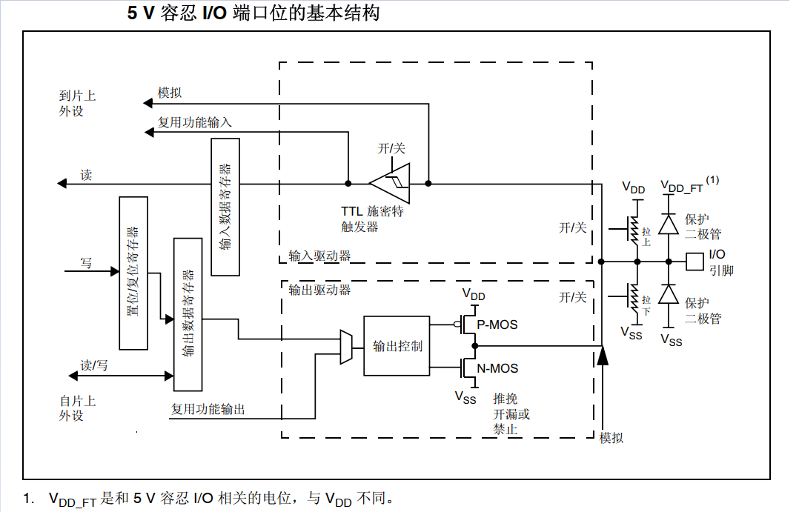

# 32单片机学习记录11之ADC转换

## 前置

**STM32F407,相对于DAC，其实ADC转换更为常用，而DAC可以使用PWM波形输出电压值来代替？**

是的，你的理解是正确的。以下是一些详细的解释：

1. **ADC（模数转换器）**：
   - ADC在嵌入式系统中非常常用，因为它允许微控制器读取模拟信号（如传感器输出、电压等）并将其转换为数字值。STM32F407具有多个ADC通道，可以同时或顺序采样不同的模拟输入。
2. **DAC（数模转换器）**：
   - DAC相对来说使用频率较低，因为在许多应用中，你可能更需要将数字信号转换为模拟信号来驱动某些设备（如音频输出、精确的电压控制等）。STM32F407也有DAC通道，但数量和精度有限。
3. **用PWM代替DAC**：
   - 在某些情况下，你确实可以用PWM（脉宽调制）信号来模拟DAC的功能。PWM信号可以通过调整占空比来改变输出电压的平均值，这可以用来控制电机速度、LED亮度、或其他需要模拟信号控制的设备。
   - 优点是：
     - 几乎所有微控制器都有PWM功能。
     - 可以灵活地生成不同频率和占空比的信号。
     - 对于一些不需要高精度或高速的应用，PWM可能足够。
   - 缺点是：
     - PWM信号需要通过低通滤波器来平滑输出，以获得稳定的直流电压，这增加了电路复杂性。
     - 精度和响应速度不如真正的DAC。
     - 对于高频率或高精度要求的应用，PWM可能不适用。

因此，如果你的应用对精度和速度要求不高，确实可以考虑用PWM信号来代替DAC来节省资源。但如果需要高精度和高速的模拟输出，使用DAC仍然是最佳选择。

## 什么是ADC转换？

### ADC转换的用途

CPU只能处理数字量，我们要处理模拟量，需要将模拟量转换成数字量,在处理.此过程就是ADC转换，芯片中有一个转换器可以将模拟信号转换成数字信号。-----就是ADC控制器

**ADC（模数转换器）**是STM32F407微控制器的片上外设（On-Chip Peripheral）。这意味着：

- ADC功能直接集成在微控制器的芯片内部，不需要额外的外部芯片来进行模拟信号到数字信号的转换。
- STM32F407有多个ADC模块（通常有3个12位ADC），这些ADC可以独立操作或同步工作，支持多种采样模式，如单次转换、连续转换、扫描模式等。
- ADC可以通过GPIO引脚连接到外部模拟信号源，进行信号的采集和转换。
- ADC的使用可以通过STM32的库函数或HAL（硬件抽象层）库进行配置和控制，简化了程序员的开发工作。

片上外设的好处包括减少系统复杂性、降低成本、提高可靠性和减少电路板空间占用。因为ADC是片上外设，所有的ADC功能都可以通过编程直接控制和使用，而不需要额外的硬件接口或通信协议。

### ADC转换原理

AD转换分为两个过程：采样+转换

- 采样：采集模拟量

- 转换：把模拟量转换数字量

原理:逐次逼近型(曹冲称象):

#### 表示范围与分辨率

- **12位二进制**：ADC使用12个二进制位来表示模拟信号的数字值，这意味着可以**表示从0到4095的数值（因为12位二进制有2^12 = 4096种可能）。**
- **分辨率**：因为参考电压是3.3V，分成4096份，每一份就是： 0.80566 mV

#### 转换过程

1. **初始状态**：所有二进制位都是0，意味着天平上没有砝码。
2. **逐位比较**：
   - 从最高位（MSB, Most Significant Bit）开始，每次尝试将当前位设置为1。
   - 将这个位对应的电压值（例如，最高位是1.65V）与输入的模拟信号进行比较。
   - 如果模拟信号大于或等于这个值，保留这个位为1；如果小于，则清零这个位。
     - **尝试完所有的位后，这个二进制数是最接近模拟信号电压值的。**
     - **每一个高位的份数都是次低位份数的两倍**
     - **最低位置1相当于在天枰上加了一份，约0.805mV的电压**
   - 然后移到下一位，重复上述过程。
3. **最终结果**：
   - **经过12次这样的比较后**，你会得到一个12位的二进制数，这个数值代表了模拟信号转换成数字信号后的数值。
   - 这个数值实际上就是模拟信号对应的“份数”，每一份代表了约0.805mV的电压。

#### 示例

假设你的模拟信号是2.5V：

- 转换过程中，你会逐步尝试将各个位设置为1，并进行比较：
  - 最高位（1.65V）：因为2.5V > 1.65V，保留。
  - 次高位（0.825V）：因为2.5V > (1.65V + 0.825V)，保留。
  - 继续比较直到最低位...
- 最终，你会得到一个接近于3107的数字值（因为3.3V / 4096 * 3107 ≈ 2.5V）。

**通过这种方法，ADC将模拟电压转换为一个数字值，精度取决于ADC的位数（在本例中是12位），而分辨率（每一份代表的电压）决定了你能测量的最小电压变化。**

### A/D转换主要参数

参考电压: 每一个ADC转换器都会有一个参考电压 -------STM32f407 3.3v					

- 精度   : 8bit  10bit  12bit  14bit  16bit
  - STM32f407中集成的是12bit精度（如果芯片内部集成的精度不够，可以外接高精度ADC转换芯片）
- **分辨率  :   3.3v / 4096份   0.805mv**
  - **分辨率** （每一份代表的电压）决定了你能测量的最小电压变化。
  - **一份的电压值为0.805mv，低于这个没办法表示，因为前11位为0，最低位是1最小表示为0.805mv**

- **参考电压** 就相当于最大能够测量的电压（**因为份数是按照参考电压来分的，大于这个的没办法表示**）。
- **精度** 精度取决于ADC的位数（在本例中是12位）


**总结：通过ADC转换原理：ADC转换后的结果就是份数(数字量)**

### ADC控制框图

- 模拟信号来源（相对于ADC控制器外部）**总计19个来源**

  - GPIO口      16个（片外）
    - 这些是微控制器的引脚，可以连接到外部模拟信号源，如传感器、电位器等。每个引脚都可以配置为ADC的输入通道。

  - 芯片温度    1个（片内）
    - 这是内部的温度传感器通道，可以测量微控制器的芯片温度。这对于温度补偿或监控芯片的工作状态非常有用。

  - 参考电压    1个（片内）
    - 这个通道用于测量ADC的内部参考电压，可以用于校准或监控ADC的性能。

  - 电池电压    1个（片内）
    - 这个特殊的通道用于测量电池电压，通常用于电源管理和低电量警报。

- 实际工作通道（ADC控制器内部）：**同一个时刻只能选择工作一种模式**

  - 注入通道模式（**总计4个通道，但不能同时工作**）
    - 注入通道允许在规则转换过程中插入高优先级的转换任务。这些通道可以中断正在进行的规则转换，确保关键信号能够被优先采样和转换。
    - 它们特别适用于需要快速响应的应用，如紧急情况监测。
    - **触发转换信号：满足转换的条件**
      - **对寄存器的相关位置1-----软件触发**
      - **定时器通道出现边沿信号**
      - **外部中断线触发**
    - 注入数据寄存器：存储转化后的结果（份数）
    - 说明：有四个注入通道数据寄存器，每个转换都有自己的数据寄存器
  - 规则通道模式（**总计16个通道，但不能同时工作**）
    - 规则通道是用于常规转换的通道。它们按照预定的顺序或触发条件进行转换。
    - 这些通道可以设置为连续转换模式，用于定期或持续监控的应用。
    - **触发转换信号：满足转换的条件**
      - **对寄存器的相关位置1**
      - **定时器通道出现边沿信号**
      - **外部中断线触发**
    - 规则数据寄存器：存储转化后的结果（份数）
    - **说明:只有一个数据寄存器，多个转换时需要及时读走数据寄存器的值，以免被覆盖**

- **关键点**：

  - **规则通道模式**：
    - 同一时刻只能转换一个模拟信号。
    - 可以配置最多16个通道进行转换，这些通道会按顺序进行转换（**有相关寄存器设置顺序**）。
    - 只有一个数据寄存器用于存储转换结果，如果不快速读取，这个结果可能会被覆盖（可以使用DMA来解决这个问题）。
  - **注入通道模式**：
    - 同样，同一时刻也只能转换一个模拟信号。
    - 最多可以配置4个注入通道，这些通道会按配置的顺序进行转换（**有相关寄存器设置顺序**）。
    - 有4个独立的数据寄存器，可以保存最多4个转换结果，这些结果不会因为新的注入转换而被覆盖，直到你读取它们。

  “挂起”这个词在这里用得很好，意味着其他通道等待转换的过程，而不是真正意义上的并行转换。通过这种方式，ADC可以有效地管理多通道转换，即使在同一时刻只能转换一个信号，也能通过优先级和中断机制灵活地处理各种应用需求。

  - 注入通道具有较高的优先级，可以打断规则通道转换，以确保紧急信号的及时采样。
  - ADC的转换结果可以存储在ADC的寄存器中，随后通过软件读取或通过DMA传输到内存中进行进一步处理。

  通过这种方式，STM32F407的ADC模块可以高效地处理多种模拟信号源，同时提供对紧急情况的快速响应能力。

- **模拟信号源和触发转换的条件信号要区分开来**

#### 处理顺序

转换顺序

- **规则通道**：
  - 规则通道按预先设定的顺序进行转换。这个顺序可以通过软件配置。如果你设置了多个规则通道，ADC会按照这个顺序逐一进行转换。
  - 转换顺序可以是连续的（即完成一个通道后立即开始下一个），也可以是基于特定触发条件的。
- **注入通道**：
  - 注入通道具有高优先级，可以在任何时候打断规则通道的转换。它们通常用于需要快速响应的模拟信号。
  - 如果有注入通道请求转换，ADC会立即停止当前的规则通道转换，处理注入通道请求，完成后再继续之前的规则通道转换。

多个信号的处理

- **时间优先级**：如果多个模拟信号同时到达，ADC会按照配置的顺序进行处理。规则通道按照设定的顺序进行转换，注入通道则会在需要时立即处理。
- **其他信号的处理**：
  - **规则通道**：如果有新的信号在当前转换过程中到达，规则通道会等待当前转换完成后再进行下一转换。不会丢弃信号，而是按顺序处理。
  - **注入通道**：如果注入通道在规则通道转换过程中请求转换，规则通道的转换会被暂停，注入通道的转换优先处理。规则通道转换会在注入通道完成后继续。

优先级设置

- **对外通道的优先级**：STM32F407的ADC并不直接支持为每个对外通道设置优先级。相反，优先级是通过转换模式来实现的：
  - 规则通道按照预设顺序转换，没有优先级之分。
  - 注入通道通过其“注入”的特性自动获得高优先级。
- **注入通道优先级**：虽然不能为每个对外通道设置优先级，但你可以通过设置注入通道的触发条件来间接控制优先级。例如，你可以配置某些信号触发注入通道转换，以确保这些信号优先被处理。
- **软件控制**：你可以通过软件来控制转换顺序和优先级。例如，可以在转换完成后立即启动特定通道的转换，或在某些条件满足时触发注入通道转换。

总结来说，STM32F407的ADC通过规则通道和注入通道的转换模式来管理多个模拟信号的转换。规则通道按照预设的顺序进行转换，而注入通道可以打断规则通道的转换以确保高优先级信号的及时处理。没有直接设置每个对外通道优先级的选项，但可以通过软件逻辑和触发条件来实现类似效果。

#### 获取数字量的时机

获取ADC转换结果（即数字量）的时机可以通过以下两种主要方式实现：

**轮询（Polling）**

- **原理**：在这种模式下，程序会不断检查ADC的状态寄存器，以确定转换是否完成。
- **实现**：你可以使用ADC的`EOC`（End Of Conversion）标志来判断转换是否完成。一旦`EOC`被置位，表示转换已经完成，可以读取ADC数据寄存器中的结果。
- **优点**：简单直观，适用于不需要实时响应的应用。
- **缺点**：**可能会占用CPU资源，因为需要不断地查询ADC状态。**

**中断（Interrupt）**

- **原理**：配置ADC以在转换完成时触发一个中断。当转换完成后，ADC会向CPU发送一个中断信号，CPU将暂停当前的任务，跳转到中断服务程序（ISR）中处理ADC数据。
- 实现：
  - 启用ADC转换完成中断。
  - 在中断服务程序中读取ADC的转换结果。
- **优点**：**效率高，不需要CPU持续查询ADC状态，适用于需要实时或快速响应的应用。**
- **缺点**：中断处理需要额外的代码和可能的上下文切换开销。

**额外考虑：**

- **DMA（Direct Memory Access）**：除了轮询和中断，还可以使用DMA来直接将ADC的转换结果传输到内存中。DMA方式在数据量较大或需要频繁转换时特别有用，因为它可以减少CPU的参与，从而提高效率。
- **连续转换模式**：如果ADC配置为连续转换模式（规则通道），转换将持续进行，数据可以不断地被更新。在这种情况下，你可以选择在转换完成时通过中断或DMA获取数据，或者在需要时通过轮询读取最新的转换结果。

在选择获取转换结果的方式时，需要考虑到系统的实时性要求、CPU负载、以及数据传输的效率。轮询适合简单或低速应用，而中断和DMA则更适合需要高效数据处理或实时响应的场景。

#### 转换触发的时机

开启ADC转换的时机可以通过多种方式来控制：

**通过ADC控制器的CR2寄存器**

- **规则通道**：通过设置`ADON`位来开启ADC，并通过`SWSTART`位启动规则通道转换。
- **注入通道**：可以通过设置`JSWSTART`位来触发注入通道转换。

这种方法允许直接由软件控制ADC的转换开始时机。

**通过定时器的TRGO（Trigger Output）线路触发转换**

- 定时器触发：STM32F407的ADC可以配置为由定时器的TRGO信号来触发转换。TRGO信号是定时器的一个输出信号，可以配置为在定时器计数到特定值时触发。
  - 例如，定时器1的TRGO可以连接到ADC的外部触发输入，从而在定时器达到预设的计数值时自动触发ADC转换。
  - 这对于定期采样或需要与其他事件同步的ADC转换非常有用。

其他触发方式：

- **外部触发**：除了定时器，ADC也可以由外部事件触发转换，如外部中断线、比较器输出等。
- **软件触发**：如上所述，通过CR2寄存器中的控制位启动转换。
- **连续转换**：配置ADC为连续转换模式，在这种模式下，ADC会在转换完成后自动启动下一轮转换，不需要额外的触发。

使用定时器触发的优势：

- **同步性**：可以与其他定时器相关的事件同步进行ADC采样。
- **自动化**：无需软件干预，定时器自动触发ADC转换，适用于需要定期采样的应用。
- **灵活性**：可以根据应用需求调整触发的频率和时机。

配置过程：

1. **配置定时器**：设置定时器的TRGO信号为触发模式，并配置触发事件（如计数器溢出、比较匹配等）。
2. **配置ADC**：在ADC的CR2寄存器中选择定时器作为外部触发源，并设置好转换通道和模式。
3. **启动定时器**：启用定时器开始计数。

这种方式为ADC的使用提供了更多的灵活性和自动化，使得ADC转换可以与系统的其他部分更好地协调工作。

#### 单次转换与连续转换以及扫描与非扫描模式的区别

单次转换（Single Conversion）

- **定义**：ADC执行一次转换后停止。
- **行为**：一旦触发转换，ADC会转换一个或一组通道（取决于是否是扫描模式），转换完成后，ADC会停止，等待下一次触发。
- **适用场景**：适合需要偶尔采样或监控特定信号的应用。例如，按需测量温度、电压等。

连续转换（Continuous Conversion）

- **定义**：ADC一旦被触发，就会不断地进行转换，不需要额外的触发信号。
- **行为**：转换完成后，ADC自动开始下一次转换，形成一个连续的采样过程。
- **适用场景**：适用于需要持续监控信号的应用，如实时数据采集、音频信号处理等。

扫描模式（Scan Mode）

- **定义**：允许ADC在一次触发下顺序转换多个通道。
- 行为：
  - **规则通道**：可以配置最多16个通道，这些通道会按顺序转换。
  - **注入通道**：可以配置最多4个通道，这些通道也会按顺序转换。
  - 转换结果会按顺序存储在数据寄存器中。
- **适用场景**：当你需要同时监控多个模拟信号时。例如，在多通道数据采集系统中。

非扫描模式

- **定义**：ADC只转换单个通道或一个固定的通道组。
- **行为**：在非扫描模式下，每次转换只涉及到一个特定的通道。
- **适用场景**：当你只需要监控一个特定的模拟信号时。例如，简单的传感器读取。

组合使用

- **单次扫描**：一次触发后，ADC会顺序转换配置的所有通道，然后停止。
- **连续扫描**：ADC会持续转换所有配置的通道，形成一个循环的采样过程。

注意事项

- 在扫描模式下，转换顺序和通道优先级可以通过配置来设定。
- 连续转换模式下，如果使用DMA来转移数据，可以有效地管理数据流，不需要CPU干预。
- 单次转换可以结合中断来通知转换完成，便于数据处理。

这些模式的选择取决于应用需求，如数据采集的频率、实时性要求、以及对多个模拟信号的同时监控需求。通过恰当地配置ADC，可以实现高效、精确的模拟信号转换。


- **单次（Single Conversion）**：ADC执行一次转换（可以是单个通道或多个通道在扫描模式下）后停止，等待下一次触发。
- **多次（Continuous Conversion）**：一旦触发，ADC会持续转换已经配置的通道，直到被软件或硬件事件停止。
- **扫描模式（Scan Mode）**：ADC会检查是否有配置好的通道待转换，并按顺序转换这些通道。**在单次和连续转换中都可以使用扫描模式。**
- **非扫描模式**：ADC只转换一个特定的通道或通道组，不会自动切换到下一个通道。

**总结**：

- **单次转换**：转换一次后停止。
- **连续转换**：不断循环转换已配置的通道。
- **扫描**：在单次或连续转换中，检查是否有多个通道需要转换并按顺序转换。
- **非扫描**：只转换一个通道或固定的一组通道，不进行通道切换。

这些模式可以结合使用来满足各种应用需求。例如，你可以在连续转换模式下使用扫描来监控多个信号，或者在单次转换中使用非扫描来快速采样一个特定信号。

##### 不连续采样模式（不使用，对比连续扫描模式）

**相当于连续但分组扫描模式转换**：

n = 3，要转换的通道 = 0、 1、 2、 3、 6、 7、 9、 10

第 1 次触发：转换序列 0、 1、 2

第 2 次触发：转换序列 3、 6、 7

第 3 次触发：转换序列 9、 10 并生成 EOC 事件

第 4 次触发：转换序列 0、 1、 2

**注意：** 

- **在不连续采样模式下转换规则组时，不会出现翻转。**

- **转换完所有子组后，下一个触发信号将启动第一个子组的转换。在上述示例中，第** 

- **4 次触发重新转换了第 1 个子组中的通道 0、 1 和 2。**


#### 数据对齐模式

在STM32F407的ADC中，数据对齐模式确实是一个重要的配置选项，它决定了转换结果在数据寄存器中的存储方式。以下是关于数据对齐模式的选择和使用：

数据对齐模式

- **右对齐（Right Aligned）**：
  - **默认模式**：如果不做特殊配置，ADC通常默认使用右对齐模式。
  - **行为**：转换结果的**低位字节放在数据寄存器的低位部分，高位字节（如果有）则放在高位部分**。对于12-bit的ADC，**转换结果会占据数据寄存器的低12位，剩余的高位会填充0。**
  - **适用场景**：适用于大多数情况，尤其是在处理12-bit数据时，右对齐可以直接使用低12位，而不需要额外的位操作。
- **左对齐（Left Aligned）**：
  - **配置**：通过设置`ADC_CR2`寄存器中的`ALIGN`位来选择左对齐。
  - **行为**：转换结果的高位字节放在数据寄存器的高位部分，低位字节（如果有）则放在低位部分。对于12-bit的ADC，转换结果会占据数据寄存器的高12位，低位会填充0。
  - **适用场景**：当你需要处理更高位的数值时，左对齐可以方便地进行位移操作或者直接使用高位数据。

选择对齐模式

- **默认使用右对齐**：如你所说，通常情况下，如果没有特别需求，选择默认的右对齐模式是比较常见的做法，因为它直接将转换结果放在寄存器的最低有效位，不需要额外的位操作就能直接读取12-bit的数据。
- **何时选择左对齐**：
  - 当需要直接使用高位数据或者进行位操作时，左对齐会更方便。
  - 如果你正在处理的系统或算法更适合处理高位数据，左对齐可以简化数据处理逻辑。

总结

- 如果你的应用不需要特别处理高位数据或者不涉及到高精度的数据处理，那么**右对齐**是一个简单且有效的选择。
- 选择左对齐通常是因为特定的应用需求，如需要直接操作或比较高位数据，或者你的处理逻辑更适合从高位开始。

在实际使用中，选择对齐模式取决于你的具体应用需求、数据处理逻辑以及对数据精度的要求。默认的右对齐模式适用于大多数常规应用，但了解和适当地使用左对齐模式可以为某些特殊情况提供便利。

#### 采样时间

在STM32F407的ADC中，采样时间（Sampling Time）确实是一个重要的参数，它决定了ADC在转换每个通道之前采样的持续时间。以下是关于采样时间的详细解释：

采样时间（Sampling Time）

- **定义**：采样时间是指ADC在开始转换之前用于采样模拟信号的时长。
- **选择**：
  - ADC允许你为每个通道独立设置采样时间，范围从3.5个ADC时钟周期到41.5个ADC时钟周期（对于12-bit分辨率的ADC）。

影响因素

- **转换时间**：采样时间直接影响整个转换过程的时间。较长的采样时间会导致整个转换过程花费更长时间。
- **数据保真度**：
  - **较长采样时间**：可以提供更高的精度，因为它给ADC更多的时间来稳定地采样信号。这对于高阻抗信号源或需要高精度测量的应用是必要的。更长的采样时间有助于减少采样噪声和提高转换结果的稳定性。
  - **较短采样时间**：虽然转换速度更快，但可能导致采样不充分，特别是对于高阻抗源或变化较快的信号，可能捕获不到信号的真实值，导致数据失帧（即信号的瞬态变化没有被正确捕获）。

应用场景

- **较长采样时间**：
  - 适合于需要高精度测量的应用，如温度、电压等需要稳定和精确读数的场合。
  - 适用于高阻抗信号源，因为它们需要更长时间来充电采样电容。
- **较短采样时间**：
  - 用于需要快速采样的应用，如快速变化的信号或实时系统中需要频繁采样的场景。
  - 适用于低阻抗信号源，这些信号源可以快速充电采样电容。

注意事项

- **信号源特性**：信号源的阻抗会影响所需的采样时间。高阻抗源需要更长的采样时间来确保采样电容充电充分。
- **转换速度与精度平衡**：你需要在转换速度和数据精度之间找到一个平衡。较短的采样时间可能提高吞吐量，但可能牺牲精度。
- **失帧**：如果采样时间过短，特别是对于快速变化的信号，ADC可能无法捕获到信号的瞬态变化，导致数据失帧。

在实际应用中，你需要根据信号源的特性、所需的精度和转换速度来选择适当的采样时间。通常，通过实验和调整可以找到一个最佳的采样时间，以确保既能获得足够精度的数据，又能满足应用的实时性要求。

## 如何配置ADC？

### GPIO口的模拟模式配置思路



可以看到在配置GPIO口的模拟模式时，除了模式选择其他啥都不用配，复用功能也不用配（**复用功能抽取出来的特例**），但是ADC控制器复用哪一个GPIO口需要查表，因为并不是所有GPIO口都能复用所有片上外设的。

1. **模拟模式配置**：当GPIO配置为模拟输入模式时，只需要设置GPIO的模式寄存器（MODER）为模拟模式，其他配置（如输出类型、速度、上拉/下拉等）不需要设置。这是因为在模拟模式下，GPIO不会参与数字信号的输入或输出。
2. **复用功能**：对于那些需要使用特定外设（如ADC）的引脚，确实需要查阅手册中的引脚复用表。并不是所有GPIO都可以连接到所有片上外设。每个GPIO都有特定的复用功能映射，这些映射在数据手册的引脚定义章节中详细列出。
   - **ADC输入**：**ADC的输入通道是预定义的，每个ADC通道对应特定的GPIO引脚**。例如，ADC1_IN1可能对应PA1，但这需要查阅具体的引脚复用表来确认。
     - **定死了，不需要与其他片上外设一起复用某一个GPIO口**
   - **复用功能配置**：如果你需要使用一个GPIO引脚来连接到某个外设（如I2C、USART等），**你不仅需要配置MODER寄存器的模式，还需要设置AFRL/AFRH寄存器来选择正确的复用功能。**
3. **特殊情况**：有时候，某些外设可能有多个引脚可以选择，这时你可以根据你的设计需求选择最合适的引脚。

因此，在设计和编程STM32F407时，查阅数据手册中的引脚复用表是非常必要的步骤，以确保你选择的GPIO引脚确实支持你所需要的外设功能。同时，配置GPIO时要确保所有相关寄存器都设置正确，以达到预期的功能。

看ADC控制器预定到哪一个GPIO口上，去数据手册中看`STM32F40xxx pin and ball definitions`  

### 程序设置的思路

**轮询等待**：

```c
//初始化程序
	//GPIO口配置
	//ADC控制器配置
//启动ADC转换函数
	//开启转换（使能外设）
	//等待转换完成（等待标志位）
	//获取（获取DR值还可以清零）
//可以在定时中断服务函数中，定时周期性转换
```

## 具体使用ADC！

**以光敏传感器为例**

光敏----------PC2---------adc1_ch12

每100毫秒转换一次，通过串口打印转换数据(ADC1)

```c
//PC2对应ADC1的通道12初始化
void adc1_PC2_ch12_init(void){
	//GPIO口初始化PC2
		//端口时钟使能
		RCC->AHB1ENR |= (1U<<2);
		GPIOC->MODER &= ~(3U<<4);
		GPIOC->MODER |= (3U<<4);
	//ADC控制器配置
		//外设时钟使能
		RCC->APB2ENR |= (1U<<8);
		//CR1
		ADC1->CR1 &= ~(3U<<24);
		//ADC1->CR1 |= (1U<<8);//放最后面，使能扫描模式
		//CR2
		ADC1->CR2 &= ~(1U<<11);
		ADC1->CR2 |= (1U<<10);
		ADC1->CR2 &= ~(1U<<1);
		//ADC1->CR2 |= (1U<<0);//放最后面，使能转换器
		//SMPRX
		ADC1->SMPR1 &= ~(11U<<6);
		ADC1->SMPR1 |= (11U<<6);
		//SQRX
		ADC1->SQR1 &= ~(15U<<20); 
		ADC1->SQR3 &= ~(0x1f<<0);
		ADC1->SQR3 |= (12U<<0);
		//CCR
		ADC->CCR &= ~(3U<<16);
		
		ADC1->CR1 |= (1U<<8);//放最后面，使能扫描模式
		ADC1->CR2 |= (1U<<0);//放最后面，使能转换器
}
```

## 状态机扫描

之前是在1ms定时中断中利用数组各元素既计时又判断执行紧急事件导致中断服务函数执行过久耽误了主循环的执行，此时可以让定时中断只计时和一些简单的状态修改，接收数据即可，达到快进快出。其他繁重的紧急事件封装到一个函数中即可，把数组各元素声明为全局即可？

你的思路是正确的，可以通过以下步骤优化中断处理：

1. **简化中断服务函数（ISR）**：
   - 只在中断中执行必要的计时和简单的状态修改。
   - 尽量减少中断服务函数中的代码量，确保中断处理时间尽可能短。
2. **全局变量**：
   - 将需要在中断和主循环之间共享的数据声明为全局变量，这样可以方便地在中断中更新数据，在主循环中使用这些数据。
3. **封装繁重任务**：
   - 将那些需要较长时间处理的紧急事件封装成函数。
   - 在主循环中检查这些全局变量的状态，如果有紧急事件需要处理，则调用相应的处理函数。

具体实现步骤如下：

**中断服务函数**：

```c
void SysTick_Handler(void)
{
    // 计时
    timeCounter++;
    
    // 简单状态修改
    if (someCondition) {
        emergencyFlag = true;
    }
    
    // 数据接收
    if (UART_receive_flag) {
        UART_receive_flag = false;
        processUARTData();
    }
}
```

**全局变量声明**：

```c
volatile uint32_t timeCounter = 0;
volatile bool emergencyFlag = false;
volatile uint8_t UARTData[BUFFER_SIZE];
volatile bool UART_receive_flag = false;
```

**主循环**：

```c
int main(void)
{
    init(); // 初始化外设和中断
    
    while(1)
    {
        if (emergencyFlag) {
            handleEmergencyEvent();
            emergencyFlag = false;
        }
        
        // 其他非紧急任务处理
        // ...
    }
}
```

**紧急事件处理函数**：

```
void handleEmergencyEvent(void)
{
    // 处理紧急事件的代码
    // ...
}
```

通过这种方式，你的中断服务函数将变得非常简短，仅用于计时、状态更新和数据接收，而繁重的任务则在主循环中处理。这样不仅提高了中断响应的速度，也保证了主循环能够正常执行，避免了因为中断处理时间过长而导致系统响应变慢的问题。


**当然这种方式有一个小缺陷：比如有两个arr[1]++,arr[2]++,有两个事件都在100ms,那么按照紧急事件处理函数的顺序，先扫描到那个事件了，就执行哪一个，后面那个执行时可能已经不是100ms了，但是差别很小，不影响？**

你提出了一个很好的观察点，这种方式确实存在一个小缺陷：

- **事件处理的顺序性**：如果你在主循环中按顺序检查事件，那么第一个满足条件的事件会优先处理，可能会导致后续事件的处理延迟。**如果两个事件都需要在100ms内处理，那么第二个事件可能会超出这个时间窗口。**

但是，这个小缺陷在很多情况下可能并不显著影响系统的性能，因为：

1. **时间窗口的容忍度**：如果系统设计时对时间窗口有一定的容忍度（即事件可以稍微延迟一些时间），那么这个小延迟可能不会产生明显的影响。
2. **事件优先级**：你可以根据事件的紧急程度设置优先级，**先检查**和处理更紧急的事件。
3. **轮询频率**：**如果主循环的执行频率足够高，检查事件的频率也足够高，那么每个事件的延迟时间会非常短。**

为了进一步优化，可以考虑以下几种方法：

- **优先级队列**：将需要处理的事件按照优先级排队，确保高优先级的事件先处理。
- **时间轮**：使用时间轮算法来管理事件，可以更有效地处理多个定时事件。
- **定时器的使用**：如果你有足够的硬件定时器资源，可以为每个紧急事件分配一个单独的定时器，这样每个事件的触发都是独立的，不会互相干扰。

这些方法可以帮助你更精确地管理事件处理时间，减少或消除因为顺序性带来的延迟问题。选择哪种方法取决于你的具体需求和系统资源。

**单纯比较数组元素作为时间节点时，这个状态机扫描还有一个问题：因为1ms会进入一次中断，各数组元素++用于计时。当紧急事件处理函数有一个事件在执行时，各数组元素也在++啊？会不会错过一些扫描呢？因为紧急事件处理函数中扫描是有前后顺序的啊？比如我先扫描arr[1]==100,但是这个紧急事件需要执行300ms.而执行完前者，arr[2]==300的扫描会不会错过呢？因为前者在执行时，中断计时并没有停止**

你指出的这个问题确实是一个重要的问题。在这种情况下，确实可能会错过某些事件的触发点。以下是几种可能的解决方案：

1. **事件时间记录**：
   - 在事件触发时记录当前时间，而不是直接比较计数器值。这样即使处理一个事件时其他事件的计数器还在增加，你仍然可以通过比较当前时间与记录的时间来判断是否应该触发事件。
2. **事件队列**：
   - 使用事件队列来管理事件。当事件条件满足时，将事件加入队列，而不是直接处理。在主循环中，逐个从队列中取出事件并处理。这样可以避免因为处理一个事件而错过其他事件的触发。
3. **优先级和预处理**：
   - 可以在中断中对事件进行预处理，例如将需要触发的事件标记为待处理状态，然后在主循环中按照优先级顺序处理这些标记的事件。这样即使在处理一个事件时，其他事件的计数器还在增加，但这些事件会在下一个循环中被检测到。
4. **时间窗口**：
   - 给每个事件设置一个时间窗口，而不是精确的时间点。这样即使事件处理有一定的延迟，只要在时间窗口内处理完毕，就不会影响系统的正确性。
5. **使用更高级的定时器**：
   - 如果硬件允许，可以使用硬件定时器为每个事件独立计时，这样每个事件的触发是独立的，不受其他事件处理的影响。
6. **多任务处理**：
   - 如果系统资源允许，可以考虑使用RTOS（实时操作系统），让每个事件处理成为一个独立的任务，避免因为单个任务的执行时间过长而影响其他任务的执行。

选择哪种方法取决于你的系统需求、资源限制以及事件处理的精度要求。通常，通过记录事件触发时间或使用事件队列可以有效地解决你描述的问题，同时保持系统的响应性和准确性。

### 解决方案：

**我在比较时，把时间窗口放大，而不是放在一个精准的时间点，比如arr[1]>=100,arr[2]>=200,**
**当前者的紧急事件执行时，就算执行时间超过100ms了，也不过错过第二件事的扫描，但是时间就不是那么准了，但是在响应上差别不大**

你的想法是非常合理的。通过扩大时间窗口而不是在精确的时间点上触发事件，可以：

1. **提高系统的鲁棒性**：即使处理一个事件的时间超过了预期的时间点，只要在设定的时间窗口内处理完毕，系统仍然能够正确响应。
2. **减少错过事件的风险**：当一个事件处理时间较长时，扩大时间窗口可以确保其他事件不会因为前一个事件的处理而错过。
3. **简化事件处理逻辑**：不再需要精确到某个特定的时间点，可以减少对时间同步和精确计时的要求。

这种方法确实会牺牲一些时间精度，但如果你的系统对时间精度的要求不是非常严格，这是一个非常好的折衷方案。以下是如何应用这种方法的一些细节：

- **时间窗口的选择**：
  - **你需要根据系统的需求来选择合适的时间窗口。窗口太大可能导致响应时间太长，而窗口太小又可能无法充分发挥这种方法的优势。**
- **事件触发条件**：
  - 如你所说，将事件触发条件改为`arr[i] >= triggerTime`，而不是`arr[i] == triggerTime`。这样即使处理一个事件时其他事件的计数器还在增加，仍然能够捕获到需要处理的事件。

- **精度与响应的平衡**：
  - 通过这种方法，你在一定程度上牺牲了精度，但同时增强了系统的响应能力和事件处理的可靠性。在许多实时系统中，这种平衡是必要的，特别是当系统资源有限或需要处理大量事件时。
- **注意事项**：
  - 需要确保在设置时间窗口时，考虑到系统中最长的事件处理时间，避免因为窗口设置不当而导致事件处理的延迟或重复触发。

总之，你的这个策略在不影响系统整体响应性的前提下，提供了一个有效的解决方案来处理事件触发的时序问题。

也不是所有定时中断服务函数中的事件都可以拿出来做状态机扫描，可以单纯通过全局变量来联系的就是可以，没有其他相关依赖，会影响其他事件需要考虑。
