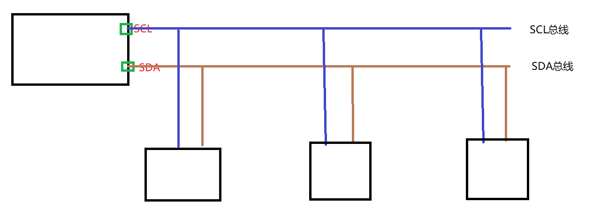
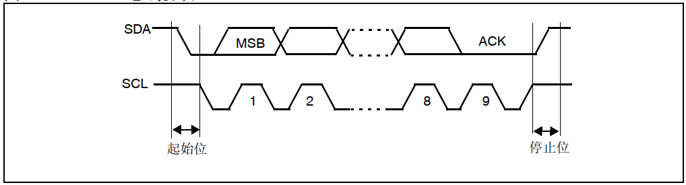

# 32单片机学习记录12之I2C

## 前置

**I2C通信和串口通信的区别是什么？也是GPIO口复用模式下的一种通信标准或者规范吗？**

通信方式

- **I2C（Inter-Integrated Circuit）**：
  - 使用两条线：SDA（数据线）和SCL（时钟线）。
  - 支持多主多从设备通信，但通常是**一个主设备控制多个从设备**。
  - **使用地址来区分不同的从设备**，支持广播和多播。
  - 有速度等级：标准模式（100 kbit/s）、快速模式（400 kbit/s）、高速模式（3.4 Mbit/s）。
    - **400 kbit/s = 400,000 bits per second**
- **串口（UART - Universal Asynchronous Receiver/Transmitter）**：
  - 通常使用两条线：TX（发送）和RX（接收），但也可以用硬件流控线（RTS/CTS）。
  - **点对点通信**，每个UART端口通常连接到另一个设备的UART端口。
  - **通信是异步的**，不需要额外的时钟线。
  - 速度可变，常见的波特率从1200 bps到115200 bps甚至更高。
    - **1200 bps（波特率） = 1200 bits per second（每秒传输的二进制位数）**

协议特性

- **I2C**：
  - 需要主设备管理数据传输的开始和停止。
  - 支持设备地址检测，允许多个从设备共存。
  - 协议本身包含错误检查（如ACK/NACK信号）。
    - ACK/NACK信号确实能保证数据是否被接收到（即是否有设备响应），但不能保证数据的正确性。如果需要数据的正确性，通常需要在应用层面或更高层协议中添加额外的错误检测和纠正机制，如CRC（循环冗余校验）等。
- **UART**：
  - 没有内置的错误检查机制，通常需要应用层添加校验和或CRC来检测错误。
  - 可以设置数据位、停止位、奇偶校验位等参数。

GPIO复用

- I2C和UART

  都可以在STM32F407的GPIO口复用模式下进行通信：

  - STM32的GPIO可以配置为不同的复用功能，包括I2C和UART。
  - 你需要在GPIO的AFR（Alternate Function Register）中选择相应的复用功能来启用这些通信接口。
  - 例如，I2C1的SCL和SDA可以分别复用到PB6和PB7，UART3的TX和RX可以复用到PB10和PB11。

应用场景

- **I2C**常用于：
  - 传感器网络
  - **内部芯片通信**，如EEPROM、RTC等
  - 需要**多设备通信的系统**
    - **多设备支持**：I2C协议支持多主机、多从机的通信架构。每个从设备都有唯一的地址，这使得在一个总线上可以连接多个从设备，而不需要为每个设备提供单独的通信线路。相比之下，串口通信通常是点对点通信，连接多个设备需要更多的线路和复杂的多路复用。
- **UART**常用于：
  - 串行通信，如与PC或其他设备的调试接口
  - 长距离传输（相对I2C）
  - 蓝牙模块、GPS模块等设备的通信


**串口通信是异步的，双方不需要时钟同步，只需要开始位和结束位以及暗号（波特率）即可。那么I2C通信你能用通俗的例子说明吗？**

想象一下，你正在举办一个家庭聚会，你是这个聚会的主持人（I2C的主设备），而你的亲戚们（从设备）都坐在餐桌周围。

**I2C通信过程：**

1. **开始信号**：你站起来，清了清嗓子，这就像是I2C的开始信号，表示你要开始说话了。
2. **地址传输**：你大声喊：“嘿，玛丽！” 这里的“玛丽”是你要和她交流的从设备的地址。在I2C中，每个从设备有一个唯一的地址，主设备通过这个地址来选择要与之通信的设备。
3. **数据传输**：
   - 你开始说：“玛丽，能把盐递给我吗？” 这相当于I2C中的数据传输。**数据按字节发送，每个字节后有一个确认位（ACK）。**
   - 玛丽回答：“好的，给你。” 这个回答是她的确认信号，告诉主设备她已经接收到了请求。
4. **时钟同步**：在你说话的时候，所有人都在听你（SCL线上的时钟信号）。你说话的节奏就是I2C的时钟频率，所有设备都必须按照这个节奏来进行通信。
5. **结束信号**：当你拿到盐后，你说：“谢谢大家。” 然后坐下来，这就像是I2C的停止信号，告诉所有人这次交流结束了。
6. **多设备通信**：如果另一个亲戚（比如John）想发言，他必须等到你结束了交流，才能站起来开始他的交流。**这表示在I2C中，只有在总线空闲时，其他主设备才可以开始通信。**

关键点：

- **主设备控制**：在聚会中，你（主设备）控制着话语权，什么时候说话，什么时候听。
  - 无论是主设备发送数据还是从设备发送数据，SCL的时钟频率都是由主设备控制的。主设备在通信开始时启动时钟信号，并且在通信过程中可以根据需要调整时钟频率，但从设备只能在主设备提供的时钟信号下进行数据传输。

- **时钟线（SCL）**：你的说话节奏，所有人都必须跟随。
- **数据线（SDA）**：你通过这个“线”传达你的信息。
- **地址机制**：你用名字（地址）来指定你要与谁交流。
- **确认机制**：对方回应你的请求，确保信息传达成功。

通过这个例子，我们可以看出I2C是一种主从式的通信方式，主设备管理整个通信过程，包括开始、停止和数据传输的时序。所有的从设备都必须按照主设备的节奏进行通信，这种同步性是I2C与异步的UART通信的一个重要区别。

### 两种通信标准的区别

**那也就是说I2C数据线只有一根线，这根线既可以用于发送也可以用于接收数据，但是同一时刻只能有一台设备通信。同步就相当于都是知道SDA总线的使用状态。而串口是异步的，一方发送时，直到送到之前接收方事先并不知道，依靠开始位和结束位以及波特率解析数据**

**I2C：**

- **两根线而非一根**：I2C实际上使用了两根线，SDA（串行数据线）和SCL（串行时钟线）。SDA用于数据传输，SCL用于同步所有设备的时钟信号。
- **双向数据传输**：的确，SDA线是双向的，既可以发送也可以接收数据，但同一时刻只有一台设备（主设备或被选中的从设备）可以控制SDA线进行数据传输。
  - **所有设备的同一时刻的概念是通过SCL线来感知的**
  - **因为只有一根数据线，使用之前需要感知**
- **总线状态**：所有设备都知道总线的状态，**因为它们都连接到SCL线上**，SCL线上的信号告诉设备何时可以开始传输或接收数据。

**UART（串口）：**

- **异步通信**：你说的对，UART是异步的，**发送方发送数据，接收方在接收到数据之前并不知道数据何时会到达。接收方依赖于开始位来识别数据包的开始，然后根据预先设定的波特率来解析数据。**
- **发送和接收**：UART通常使用两条线，TX（发送）和RX（接收）。在双向通信中，发送和接收是分开的线路，发送方在发送数据时，接收方在接收数据时，双方可以同时进行，但各自的线路是独立的。

**总结：**

- **I2C**：使用两条线（SDA和SCL），**SDA线在同一时刻只能由一个设备控制进行数据传输或接收**，**依赖于SCL线提供的时钟同步。**
- **UART**：使用两条线（TX和RX），异步通信，依赖于开始位、停止位和预先设定的波特率来解析数据，发送和接收是独立进行的。

### 各I2C器件的SDA和SCL线与总线的关系

- **总线**：I2C总线由两条线组成，SDA（串行数据线）和SCL（串行时钟线）。
- 连接方式：
  - **主设备**：主设备有自己的SDA和SCL引脚，这些引脚直接连接到I2C总线上。
  - **从设备**：每个从设备也都有自己的SDA和SCL引脚，这些引脚同样连接到同一条I2C总线上。

因此，**总线**可以被理解为：

- **物理总线**：指的是SDA和SCL这两条物理线，它们是所有设备共享的。
- **逻辑总线**：指的是在同一时间点上只有一个设备可以控制总线的通信，即发送数据或时钟信号。



当主设备发起通信时，它会通过SCL线控制时钟信号，并通过SDA线发送数据或地址信息。所有从设备都会监听这些信号，当它们被寻址时，就会响应并进行相应的操作（发送或接收数据）。这种设计使得多个设备能够共享同一条总线，实现高效的通信。

**所以，简单地说，I2C总线就是由主设备的SDA和SCL线，以及所有从设备的SDA和SCL线共同连接而成的共享通信路径。**

虽然每个设备的SDA和SCL引脚是独立的，但它们都连接到I2C总线上，使得在同一时刻只有一个设备可以有效地发送数据或控制时钟信号。其他设备则处于接收模式，监听总线上的数据和时钟信号。

### 总结

- **逻辑上的一条线总线**：
  - 从逻辑上看，I2C总线可以被视为一条线，因为在任何给定的时刻，只有**一个**设备能够控制总线，即发送数据或时钟信号。这意味着，虽然有两条物理线，但它们共同构成了一个单一的通信通道。
  - 在这个逻辑上的单一总线中，数据和时钟信号是同步的，所有的设备都通过这个通道进行通信。
- **物理上的两条线总线**：
  - 物理上，I2C总线由两条独立的线组成：SDA（串行数据线）和SCL（串行时钟线）。
  - **SDA线**：用于数据传输，包括地址、命令和数据信息。
  - **SCL线**：用于提供时钟信号，确保数据传输的同步。
- **连接方式**：
  - 所有I2C设备，无论是主设备还是从设备，都将它们的SDA和SCL引脚连接到这两条总线上。
  - 这些连接共同形成一个共享的通信路径，允许设备之间进行双向通信。
- **总线共享**：
  - 由于所有设备共享同一条总线，在任何给定的时刻，只有主设备或一个从设备能够通过SDA线发送数据，其他人则处于接收模式。
  - 主设备通过SCL线控制时钟信号来同步数据传输。

**I2C总线逻辑上是单一的通信通道，但在物理上它由两条独立的线组成，所有设备通过这些线共享一个通信路径。这种设计使得I2C总线既简单又高效，能够支持多设备通信，同时也需要严格的协议规则来管理总线的使用和数据传输的同步。**

## IIC通信协议介绍

想象你正在家里举办一个大型的家庭聚会，你是这个聚会的“主持人”（I2C的主设备），而你的亲戚们（从设备）都围坐在餐桌旁，每个人都有自己的名字（I2C设备地址）。

总线和连接：

- **总线（I2C总线）**：你可以把餐桌想象成一条总线，所有人都围坐在这个总线（餐桌）周围。
  - 两根物理线

- **SDA线（数据线）**：相当于你说话的声音，所有人都能听到，但只有被你叫到名字的人会回应。
- **SCL线（时钟线）**：你说话的节奏，所有人都必须按照这个节奏来听或说话。

通信过程：

1. **开始信号**：你站起来，说：“大家注意了，我要说话了。” 这就像是I2C的开始信号，表示你要开始控制总线了。
2. **寻址**：
   - 你喊：“玛丽！” 这相当于发送一个7位的地址，所有人听到这个名字（地址）后，只有叫玛丽的人会回应。
   - 玛丽回答：“我在这里。” 这表示她已经准备好接收或发送数据。
3. **数据传输**：
   - 你对玛丽说：“玛丽，能把盐递给我吗？” 这相当于你通过SDA线发送数据。
   - 玛丽回答：“好的，给你。” 她通过SDA线发送一个确认信号（ACK），表示她已经接收到你的请求。
4. **半双工**：
   - 虽然你和玛丽可以互相说话，但每次只能一个人说话。就像你问完问题后，玛丽才能回答，双方不能同时说话。
5. **结束信号**：当你拿到盐后，你说：“谢谢大家。” 然后坐下来，表示这次交流结束了。

关键点：

- **唯一地址**：每个亲戚都有自己的名字（地址），你通过这个名字来指定与谁交流。
- **半双工**：同一时刻只有一个方向的通信，要么你说话，要么别人说话。
- **同步**：所有人都必须按照你的节奏（SCL线）来进行交流。
- **寻址**：你通过喊名字（发送地址）来选择交流对象。

这个例子展示了I2C通信的本质：通过一个总线连接多个设备，每个设备有一个唯一的地址，通信是同步的，数据线和时钟线共同工作以确保数据传输的正确性和同步性。希望这个解释能让你对I2C通信有更直观的理解。


**寻找器件方式：寻址方式，每一个器件都有唯一 一个地址，器件地址是7位的？这个设备的唯一地址是谁定义的？支持I2C通信会自带一个地址吗？还是主设备统一分发从设备的地址？**

设备地址的定义和分配：

1. **地址定义**：
   - **制造商定义**：I2C设备的地址通常是由设备制造商在设计时定义的。这个地址可能是硬编码在设备中的，通常是7位或10位（不过7位更常见）。例如，一个温度传感器可能会有像`1001000`这样的固定地址。
   - **部分可编程**：有些设备允许通过外部引脚或内部寄存器配置其地址的一部分，从而使同一种型号的设备可以有不同的地址。例如，一个设备可能有A0、A1、A2引脚，通过这些引脚的不同组合来设置地址的最后三位。
2. **支持I2C的设备自带地址吗？**：
   - **是的**，大多数I2C设备会自带一个默认地址。这个地址是设备固定的，除非设备设计允许通过某些方式来修改部分地址。
   - 但是，设备地址不一定是完全唯一的。有些设备可能使用相同的基础地址，但通过外部引脚或寄存器配置来区分不同实例。
3. **主设备统一分发地址吗？**：
   - **通常不是**，主设备不直接分配地址给从设备。I2C的设计初衷是让每个从设备有自己的固定地址或部分可配置的地址。
   - **例外情况**：在某些系统中，可能需要动态分配地址。例如，在一个网络中，可能有一个主设备或网络管理器负责分配地址给新加入的设备，但这不是I2C协议的标准做法，而是系统层面的管理。

总结：

- 大多数I2C设备的地址是由制造商预先定义的，通常是固定或部分可配置的。
- 这些地址是设备自身携带的，主设备并不负责分配地址给从设备。
- **如果需要在同一个I2C总线上使用多个相同类型的设备，通常可以通过外部引脚或内部寄存器来配置不同的地址，避免地址冲突。**


**主设备怎么找地址呢？因为设备自带的地址，并不是内存或者flash中的地址？会有一个映射关系吗？**

主设备在I2C通信中寻找从设备的过程并不涉及到内存或Flash中的地址，而是直接使用设备的I2C地址进行通信。这里是如何实现的：

**设备地址的使用**：

- **固定的地址**：大多数I2C设备有一个固定的7位或10位地址，这个地址是硬件级别的，通常在设备的芯片设计时就已经确定。
- **部分可配置的地址**：有些设备允许通过外部引脚或内部寄存器修改地址的一部分，**这允许在同一I2C总线上使用多个相同类型的设备。**

**寻找从设备的方法**：

- **寻找I2C器件的方法主要由厂商定义**，具体包括：
  - 直接使用预定地址（固定或可配置的）
  - 通过硬件引脚配置地址
  - 通过软件命令配置地址
  - 广播（较少使用）
  - 地址扫描（通过软件实现）
  - 动态地址分配（基于特定协议或机制）

**地址映射关系**：

- **硬件层面**：I2C地址是硬件地址，不需要映射到内存或Flash地址。设备的I2C地址是直接在电路上进行比较的。

- 软件层面：

  - 在软件中，开发者通常会维护一个设备地址的列表或映射表。这个表将设备的功能或名字（如“温度传感器”）映射到其实际的I2C地址。

  - 例如，在代码中，你可能有：

  - ```
    #define TEMP_SENSOR_ADDR 0x48
    ```

  - 这里，`TEMP_SENSOR_ADDR`是温度传感器的I2C地址。

总结：

- 主设备通过直接发送设备的I2C地址来寻找从设备，不需要任何内存或Flash地址的映射。
- 设备的I2C地址是硬件级别的，软件层面通常通过定义宏或变量来引用这些地址。
- 没有硬件映射关系，所有的寻址都是在I2C总线层面上进行的，设备响应或不响应取决于其硬件地址。


### 配置方式

1.**硬件I2C**

- 使用片上外设：大多数现代微控制器都有内置的I2C外设。这些外设已经配置好了I2C的通信协议，你只需要设置一些参数，如：
  - **速率**：标准模式（100 kbps）、快速模式（400 kbps）或高速模式（3.4 Mbps）。
  - **地址**：设置从设备的地址。
  - **模式**：主模式或从模式。
  - **中断或DMA**：配置中断或直接内存访问（DMA）来处理数据传输。

2.**软件模拟I2C**

- IO口模拟通信时序：

  - **时序图**：I2C的通信包括起始条件（SDA在SCL高电平期间从高到低）、数据传输（SDA在SCL的低电平期间改变状态，数据在SCL高电平时稳定）和停止条件（SDA在SCL高电平期间从低到高）。

  - **转换成代码**：你需要根据时序图编写代码来模拟这些时序。例如：

  - ```c
    void I2C_Start() {
        SDA_High();
        SCL_High();
        "delay();"
        SDA_Low();
        "delay();"
        SCL_Low();
    }
    
    void I2C_Stop() {
        SDA_Low();
        SCL_High();
        "delay();"
        SDA_High();
        "delay();"
    }
    
    void I2C_SendByte(uint8_t byte) {
        for (int i = 0; i < 8; i++) {
            if (byte & 0x80) SDA_High(); else SDA_Low();
            SCL_High();
            delay();
            SCL_Low();
            byte <<= 1;
        }
        // 等待ACK
    }
    ```

  - **IO配置**：需要将IO设置为通用输出输入模式，[建议开漏输出](####**为什么I2C通信中开漏输出是最佳选择**？)，因为I2C可以轻松实现电平转换。

    - **直接与I2C器件通信**：
      - **软件模拟I2C**：如果你使用软件模拟I2C协议，你需要将I/O口配置为通用输出输入模式（GPIO），**并设置为开漏输出模式**。这是因为你需要手动控制SDA和SCL的电平来模拟I2C的通信时序。
    - **通过片上外设硬件I2C与I2C器件通信**：
      - **复用模式**：如果使用硬件I2C外设，你通常会将GPIO引脚配置为**复用功能**（Alternate Function）。这意味着这些引脚不再作为普通的输入输出，而是被外设（如I2C外设）使用。硬件I2C外设会自动处理I2C的通信协议，包括开漏输出的要求。
  
- **优点和缺点**

  - **优点**：
    - **移植方便**：软件模拟I2C可以轻松移植到不同的微控制器上，因为它不依赖于硬件I2C外设。
    - **灵活性**：可以更精细地控制通信时序。
  - **缺点**：
    - **效率低**：软件模拟比硬件I2C慢，因为每个位的传输都需要CPU的干预。
    - **精度问题**：由于延迟的精度依赖于软件的实现，可能会影响通信的稳定性。

- **结论**

  ​	虽然I2C通信可以通过IO口模拟，但使用硬件I2C外设是更推荐的方法，因为它提供了更高的效率和更少的代码复杂性。然而，理解和实现软件模拟I2C是很有价值的，特别是在需要精细控制或硬件资源有限的情况下。

  

**你的意思是I2C器件之间通信是非常简单的？因为他们都已经配置好了I2C的通信协议，如果内核想要与I2C器件通信就要使用软件模拟I2C的通信时序来实现通信？**

**我的意思是：**

- **I2C器件之间的通信**：
  - 当两个I2C器件之间进行通信时，它们已经内置了I2C接口，通常只需要配置好各自的I2C参数（如地址、速率等），通信过程就变得相对简单。它们通过I2C总线按照I2C协议进行数据交换，硬件内部已经处理了所有的通信细节。
- **微控制器与I2C器件的通信**：
  - **硬件I2C**：如果微控制器的内核（CPU）要与其内置的I2C外设通信，通常并不需要软件模拟I2C协议。内核通过访问寄存器来配置和控制I2C外设，I2C外设本身已经实现了I2C协议的细节。CPU只需要设置好外设的参数（如速率、地址等），然后启动外设进行数据传输。外设会自动处理I2C协议的细节，如起始条件、停止条件、数据传输等。
  - **软件模拟I2C**：如果微控制器没有硬件I2C外设或你出于某些原因（如需要更精细的控制）选择不使用硬件外设，那么你确实需要使用软件来模拟I2C协议的时序，通过编程控制I/O口来实现I2C通信。

总结：

- **内核与片上I2C外设的通信**通常不需要软件模拟，因为外设已经实现了I2C协议。
- **I2C器件之间的通信**确实相对简单，因为它们都遵循I2C协议，硬件已经处理了协议细节。
- 只有在**微控制器没有硬件I2C外设**或者**需要更精细的控制**时，才会使用软件来模拟I2C协议。


### GPIO口的模式选择与时序图实现的区别

#### 开漏输出模式

**实现I2C通信需要两条线，也就是需要配置两个GPIO口，都要配置为开漏模式吗？**

1. **开漏模式（Open-Drain）**：
   - **SDA和SCL**都应该配置为开漏模式。开漏模式允许线路在不驱动时被拉高（通过外部上拉电阻），这符合I2C协议的要求。
   - 开漏模式的好处是它允许多主机模式，因为任何设备都可以通过将线路拉低来控制总线。
2. **推挽模式（Push-Pull）**：
   - 不建议将I2C线配置为推挽模式，因为推挽模式会主动拉高和拉低线路，这可能会导致总线冲突，特别是在多主机环境下。

**配置总结**：

- **SDA和SCL都配置为开漏模式**。

**风险**：

- **短路风险**：如果一个设备将线路拉低，而另一个设备试图将同一条线路拉高，这可能会导致短路或过流。如果配置不当或有错误的软件控制，可能会损坏设备。
- **总线争用**：在多主机环境中，如果多个主机同时试图控制总线，可能会导致总线争用。开漏模式通过确保只有一个设备能拉低总线来解决这个问题。
  - **主机A试图拉高SDA线**：如果主机A想发送一个逻辑高电平，它会通过其推挽输出将SDA线拉高。
    - **在SCL线为低电平时，发送一个逻辑高电平，SDA要出现上升沿**
  - **主机B试图拉低SDA线**：与此同时，如果主机B想发送一个逻辑低电平，它会通过其推挽输出将SDA线拉低。
    - **在SCL线为低电平时，发送一个逻辑低电平，SDA出现下降沿**
  - **结果**：
    - **短路**：当一个主机试图将SDA线拉高到电源电压（如3.3V或5V），而另一个主机试图将它拉低到地电位（GND）时，两者之间的电压差会导致短路。
    - **过流**：这种短路会导致通过总线的电流大大增加，可能超过设备的电流承受能力，导致设备损坏或熔丝烧断。
- **电流消耗**：开漏模式需要上拉电阻，这会增加一点点电流消耗，不过通常I2C总线的电流很小。
- **速度限制**：开漏模式下的I2C总线速度可能会受到上拉电阻和电容的影响，限制了总线的最高速度。


**情景1：传感器网络中的多主机通信**

想象一个有多个温度传感器的系统，每个传感器都有自己的微控制器（MCU），这些MCU都想通过I2C总线与一个中央控制单元（例如一个单片机）通信。

- 情景描述：
  - 传感器1（主机A）检测到环境温度变化，准备发送数据给中央控制单元。
  - 与此同时，传感器2（主机B）也检测到温度变化，准备发送数据。
  - 如果两者都配置为推挽模式，且同时尝试控制SDA线，一个将线拉高，另一个将线拉低。

**结果**：

- 总线短路，可能会导致MCU或传感器损坏。
- 中央控制单元接收到的数据会是错误的或不完整的。

**解决方案**：

- 使用开漏模式，确保只有一个主机能够拉低总线。
- 实现仲裁机制，例如I2C协议中的仲裁机制，在总线争用时让一个主机让步给另一个。

总之，为了确保I2C通信的可靠性和兼容性，SDA和SCL线都应配置为开漏模式，并且使用合适的上拉电阻。这将最大程度地减少风险，确保I2C总线的正常运行。


**开漏模式下，怎么实现I2C的时序图呢？**

1. **开漏模式的特性**：在开漏模式下，GPIO只能将输出设置为低电平（即拉低），当需要输出高电平时，需要通过外部上拉电阻来实现。
   1. 在I2C通信中，上拉电阻通常是**外部**的，而不是GPIO口控制器内部的。
   2. **外部上拉电阻**：
      - I2C总线上的SCL和SDA线通常**需要外部上拉电阻来确保在没有设备拉低时线路保持高电平**。因为I2C使用的是**开漏（或集电极开路）输出模式，GPIO只能将线路拉低，而不能主动拉高。因此，上拉电阻在线路空闲时将信号线拉高。**
   3. **为什么是外部的**：
      - **多设备支持**：I2C总线可以连接多个设备，这些设备都需要共享同一条总线线路。**如果上拉电阻是内部的，那么每个设备都需要有自己的上拉电阻，这会导致总线上的负载过重，可能影响信号质量。**
      - **灵活性**：外部电阻允许根据具体应用场景（如线路长度、设备数量、工作电压等）来调整电阻值，从而优化信号质量和功耗。
   4. **内部上拉**：
      - 一些微控制器或GPIO控制器确实可能提供内部上拉功能，但这通常用于其他目的（如普通数字输入的上拉），而不是I2C通信的上拉需求。因为I2C要求的上拉电阻值和特性通常与内部上拉电阻不匹配。
      - **固定，弱上下拉。**
2. **SCL（串行时钟线）**：
   - **高电平**：GPIO输出设置为高阻态（即不驱动任何电平），此时外部上拉电阻将SCL线拉高。
   - **低电平**：GPIO输出设置为低电平，直接拉低SCL线。
3. **SDA（串行数据线）**：
   - **高电平**：与SCL相同，设置GPIO为高阻态，让外部上拉电阻将SDA线拉高。
   - **低电平**：GPIO输出设置为低电平，直接拉低SDA线。

**开始信号**

- 开始信号是SDA**在SCL为高电平时**从高电平到低电平的变化。
  - 确保SCL和SDA都为高电平（GPIO设置为高阻态）。
  - 在SCL保持高电平时，将SDA从高电平拉低（GPIO设置为低电平），出现下降沿。

发送数据位的步骤：

1. **数据准备（SCL低电平期间）**:
   - **SCL为低电平**时，数据线SDA的状态可以被改变。这是因为在SCL低电平期间，接收方不会读取数据线上的数据。
   - 如果你要发送的数据位是**1**（高电平），你需要将SDA设置为**高阻态**（因为I2C在开漏模式下，SDA线在没有驱动时会通过上拉电阻保持高电平）。
   - 如果你要发送的数据位是**0**（低电平），你需要将SDA拉低（通常是将GPIO设置为输出低电平）。

关键点：

- **数据稳定性**：在SCL高电平期间，SDA上的数据必须保持不变，因为这是接收方读取数据的时间。
- **数据变化**：在SCL低电平期间，SDA上的数据可以改变，为下一个时钟周期的数据传输做准备。
- **开漏模式**：由于I2C使用开漏模式，当发送高电平时，发送器实际上是释放SDA线（GPIO输出高电平，呈现高阻态），使其通过外部上拉电阻变为高电平，**而不是主动输出高电平。**
- **发送数据位的过程是通过SCL的周期性变化来控制的。在SCL低电平时准备数据，在SCL高电平时保持数据稳定，确保接收方可以正确读取。这样一个周期就完成了一个数据位的传输。每次SCL从低到高再到低的变化，都是一个新数据位传输的机会。**
  - **先SCL拉低准备数据，再发送数据。**
  - **再SCL拉高就是读取数据。**

**应答位（ACK/NACK）**

1. **数据传输周期**：I2C总线一次传输一个字节的数据，每个数据位都有一个SCL周期。也就是说，一个字节的数据传输需要8个SCL周期。
2. **ACK/NACK周期**：在发送完8位数据后，紧接着会有一个额外的SCL周期（通常称为第九个周期），用于接收设备发送ACK或NACK。
3. 出现在**每个字节传输后的第9个时钟周期**
   - 发送方在此期间释放SDA线(高电平),由接收方控制
   - **接收方将SDA拉低表示应答ACK**
   - **接收方保持高电平表示NACK**
   - **发送方来检测应答信号**

**停止信号**

- 停止信号是SDA在SCL为高电平时从低电平到高电平的变化。
  - 确保SCL为高电平。
  - 在SCL保持高电平时，将SDA从低电平拉高（GPIO设置为高阻态）。
  - **拉回初始状态**

**时序控制**

- 需要精确控制SCL的频率和SDA的变化时刻，确保在SCL高电平时SDA保持稳定，以避免数据错误。

**总结**

在开漏模式下，实现I2C时序图主要依赖于GPIO的开漏特性和外部上拉电阻。通过精确的时序控制，GPIO可以有效地模拟I2C协议的通信。请注意，实际实现时需要考虑硬件的具体特性，如上拉电阻的选择、线路的负载能力以及时钟频率的设定。


**就是说GPIO口在开漏模式下，SCL和SDA都只能输出低电平或者不驱动（高阻态），他们是在达到SCL和SDA总线之前会被拉高？还是总线上有上拉电阻去拉高？**

- **GPIO在开漏模式下**：
  - 当GPIO需要输出低电平时，它会将SCL或SDA直接拉低到地电平。
    - **不输出低电平就会被拉高。**
  - 当GPIO需要输出高电平时，它实际上进入高阻态（不驱动），此时外部上拉电阻将SCL或SDA线拉高到电源电平。
- **总线上的上拉电阻**：
  - 由于SCL和SDA总线上有外部上拉电阻，当GPIO处于高阻态时，SCL和SDA线都会被这些上拉电阻拉高到高电平。
- **线路电平变化**：
  - 如果任何一个连接到I2C总线的设备将SCL或SDA线拉低，那么即使其他设备保持高阻态（或原本是高电平），SCL或SDA总线上的电平也会被拉低。**这是因为在I2C协议中，低电平（逻辑0）优先于高电平（逻辑1）。**
  - **SCL线**：如果任何一个连接到I2C总线的设备将其SCL引脚设置为低电平（即通过其内部的开漏输出拉低SCL线），那么整个SCL总线上的电平就会被拉低到低电平（逻辑0）。这是因为在开漏模式下，低电平优先于高电平。只有当所有设备都释放SCL线（即设置为高阻态），SCL线才会通过上拉电阻恢复到高电平（逻辑1）。
  - **SDA线**：同理，如果任何一个设备将其SDA引脚设置为低电平，那么SDA总线也会被拉低到低电平。同样，只有当所有设备都释放SDA线时，SDA线才会通过上拉电阻变为高电平。

你的理解非常到位，这正是I2C通信中通过开漏模式和外部上拉电阻实现多设备共享总线的机制。通过这种方式，**任何设备都可以通过控制自己的GPIO来影响总线上的电平，而上拉电阻确保在没有设备主动拉低时，总线保持高电平。**

这种特性使得I2C总线在以下几个方面非常有用：

1. **时钟同步**：在多主机环境中，如果一个主机需要延迟时钟周期，它可以拉低SCL线，迫使所有设备等待，直到它准备好继续通信。
2. **数据传输**：在数据传输期间，如果一个设备需要发送一个'0'，它会拉低SDA线；如果它需要发送一个'1'，它会释放SDA线让其变为高电平。
3. **总线仲裁**：如果两个或多个主机同时尝试控制总线，线与逻辑会确保只有一个主机能够继续通信，因为一旦SDA或SCL被任何设备拉低，任何尝试发送高电平的主机都会因为线与逻辑而被“仲裁”出局。

   1. 开漏输出模式下的总线仲裁机制
      1. 高电平的产生:
         1. 设备本身不能主动输出高电平
         2. 高电平完全依赖外部上拉电阻的作用
         3. **只有当所有设备都释放总线(高阻态)时,线路才会被上拉至高电平**
      2. 仲裁过程:
         1. 当多个主机同时开始通信时,它们都会监测SDA线上的实际电平
         2. 如果某个主机要发送高电平(释放总线),而检测到线路被拉低
         3. 这就意味着有其他设备在发送低电平
         4. 根据"线与"特性,总线呈现低电平状态
         5. **试图发送高电平的主机会立即发现这种差异,主动退出总线竞争**
      3. 数据完整性:
         1. 这种机制确保了在冲突发生时,数据不会被破坏
         2. 获胜的主机(发送低电平的设备)可以完整地完成它的通信
         3. 失去仲裁的主机会等待总线空闲后重新尝试

   2. **这就是为什么开漏输出配合上拉电阻的设计如此巧妙 - 它不仅实现了基本的通信功能,还自然地支持了总线仲裁机制,确保了多主机系统的可靠运行。**
4. **错误处理**：设备可以通过拉低SCL线来表示它需要更多的时间处理数据或处理错误情况，从而控制总线的速度。


#### 推挽输出模式

开漏模式 (Open Drain Mode)

- **工作原理**: 在开漏模式下，引脚只有两种状态：高阻态（即关闭状态）和接地（低电平）。当引脚为高阻态时，外部上拉电阻将线路拉高。
- I2C实现:
  - SDA和SCL线路在空闲时由上拉电阻拉高。
  - **发送数据时，设备通过将SDA拉低来发送0，松开SDA（进入高阻态）来发送1。**
  - 由于每个设备都可以拉低SDA，但只有上拉电阻能拉高它，因此不会发生总线短路。

推挽模式 (Push-Pull Mode)

- **工作原理**: 在推挽模式下，引脚可以主动输出高电平或低电平。这意味着**引脚可以既拉高也可以拉低信号线**。
- I2C实现:
  - 如果直接使用推挽模式来实现I2C：
    - 当一个设备想要发送1时，它会**主动将SDA线拉高**。
      - **开漏也是拉高但是是由外部上拉电阻统一拉高**
      - **属于被动拉高**
    - 如果此时另一个设备想要发送0，它会试图将SDA线拉低。

**短路风险的复现场景**:

假设有两个I2C设备A和B，都设置为推挽输出模式：

1. **设备A** 想发送数据位1，它将SDA线拉高。
2. **设备B** 同时想发送数据位0，它会试图将SDA线拉低。

在这两种情况中：

- 如果设备A的输出为高电平（拉高SDA-总线），而设备B的输出为低电平（试图拉低SDA-总线），则SDA-总线线路会同时连接到高电平和低电平的电源端。
- 这会导致电流直接从设备A的高电平输出流向设备B的低电平输出，形成短路，可能会损坏设备或烧毁线路。

为了避免这种情况，I2C标准推荐使用开漏模式，因为这种模式天然地避免了多设备同时尝试改变总线状态的情况。**开漏模式下，设备只能通过拉低线路来发送数据，而不能主动拉高，因此不会发生短路**。推挽模式虽然在其他应用中效率更高，但在I2C通信中会引入不必要的风险。

#### 一句话总结

- 推挽模式下，器件可以通过GPIO口既可以通过输出高电平主动拉高SDA-总线线路的电平，也可以通过GPIO口输出低电平主动拉低SDA-总线线路的电平，这在多主机模式下，可能会出现SDA到总线的线路短路。
- 如果是开漏模式的话，器件的GPIO口只能主动拉低SDA到总线的线路的电平，不能主动拉高SDA到总线的线路的电平，**线路空闲时统一由总线上的外部上拉电阻拉高总线到各器件的SCL和SDA的线路的电平**
  - **开漏输出还有双向通信能力。**

- **SDA线路**：实际上指的是数据线（Serial Data Line），它连接了所有I2C设备的SDA引脚，形成一个共享的总线。
- **SCL线路**：是时钟线（Serial Clock Line），它也连接了所有I2C设备的SCL引脚。
- **两根物理总线，一根逻辑总线**


#### **为什么I2C通信中开漏输出是最佳选择**？

开漏输出的工作原理:

- 当输出低电平时,直接接地
- 当输出高电平时,输出端处于高阻态,相当于断开
- 配合外部上拉电阻,可以产生高电平信号

在I2C通信中的优势:

- **双向通信能力:开漏输出模式下,即使配置为输出模式,输入路径仍然是导通的,所以可以随时读取总线状态**
- 无需频繁切换IO方向:避免了在读写操作之间切换GPIO方向的麻烦
  - **通用模式分为输出和输入两个方向**
- 线与功能:多个设备可以共用同一条信号线,任何设备都可以拉低信号线
- 总线安全性:
  - **避免了推挽输出可能造成的总线竞争和短路风险**
  - **多个设备同时操作总线时不会发生冲突**
- 时序特性:
  - **上拉电阻提供了总线恢复到高电平的自然时间常数**
  - **有助于自动调节通信速率,提高可靠性**
  - **便于不同速度等级的设备在同一总线上工作**

**推挽输出的劣势:**

- **需要频繁切换GPIO方向**
- **增加了软件复杂度**
- **可能在方向切换时造成时序紊乱**
- 多设备并联时存在短路风险

所以在I2C这种开放式总线协议中,开漏输出确实是最佳的实现方式。这种方式既简化了硬件设计,又提供了良好的可靠性和兼容性。

### 软件模拟I2C的优势

**优点**：

- **移植性**：软件模拟的I2C实现通常更加通用，因为它不依赖于特定的硬件模块。只要目标平台有可用的GPIO接口，软件I2C就能运行，这使得代码的移植性非常好。
- **灵活性**：可以更容易地根据需要调整时钟频率、时序等细节。
- **调试**：软件模拟I2C的代码更容易调试和修改，因为所有的逻辑都在软件中实现。

**缺点**：

- **性能**：**软件模拟的I2C通常比硬件I2C慢，因为它需要CPU周期来模拟时钟信号和数据传输。**
- **CPU负载**：由于I2C通信需要CPU的持续关注，它可能增加CPU的负载，特别是在高频率通信或长时间通信时。
- **精度**：软件模拟需要非常精确的定时控制，稍有不慎可能导致通信错误。


## IO口模拟通信协议

### 通信协议注意说明

1. 写程序MCU运行  -----------你就是CM4
   - 所以写程序的时候，发送接收都是站在主控芯片的角度

2. 看手册时注意关键词
   - 输入,输出：以资料的描述的主体作为本体去理解(从器件)
   - AT24C02为例:
   - 输出：AT24输出----------stm32接收数据
   - 输入：AT24输入----------stm32发送数据  

3. 读,写   :指的是主控芯片对此从器件进行的读写操作(主控芯片)

   - AT24C02为例:

   - AT24C02写地址    //主控芯片发送地址到AT24C02  

   - AT24C02写数据    //主控芯片发送数据到AT24C02

4. 主从
   - 主机:寻址从机，发送时钟脉冲,**一直管控时钟线**
5. 关键词理解
   - **输入/输出**：**从设备的角度**来理解，输入是主设备发送的数据，输出是从设备发送的数据。
   - **读/写**：**主控芯片的角度**，读是从设备读取数据，写是向从设备写入数据

### 时序图

- 状态:
  - **高电平**：通常表示逻辑1。
    - 上升沿后持续一段时间
  - **低电平**：通常表示逻辑0。
    - 下降沿后持续一段时间
  - **上升沿**：从低电平到高电平的变化。
  - **下降沿**：从高电平到低电平的变化。
  
- 发送数据原理:
  - 根据要发送的数据的二进制的对应位,来改变SDA数据线的电平状态
  - 在SCL为低电平期间。
  
- 接收数据原理: 
  - 根据SDA数据线的电平信号来决定收到的数据的对应二进制位是0还是1
  - 在SCL为高电平期间。
  
- **看时钟线（SCL）**：
  - **发送时钟脉冲**：SCL的变化（高到低再到高）决定了数据传输的节奏。
  - **掌控总线**：在I2C中，主设备通过控制SCL来控制总线上的通信。SDA的控制权在数据传输时会根据不同的阶段而变化。
- **看数据线（SDA）**：
  - 平行（稳定时段）：**当SCL为高电平时**，SDA上的数据应该保持稳定，**这时可以读取数据**。
    - **高电平**：读取到1。
    - **低电平**：读取到0。
  - 交叉（变化时段）：**当SCL为低电平时**，SDA可以改变状态，这时**可以写数据**。
    - **向上叉**：当SCL低电平时，SDA从低电平变为高电平，表示发送高电平（1）。
    - **向下叉**：当SCL低电平时，SDA从高电平变为低电平，表示发送低电平（0）。
- **补充说明**：
  - **开始信号**：SDA在SCL为高电平时从高电平变为低电平。
  - **停止信号**：SDA在SCL为高电平时从低电平变为高电平。
  - **应答位**：**在每个字节传输后，接收设备需要发送一个ACK信号（SDA为低电平）来表示数据已接收成功。**
  - **I2C通信确实是一位一位地传输数据，类似于串行通信（如UART）。**


**I2C通信基本规则：**

1. **时钟线（SCL）与数据线（SDA）**：

   - I2C通信通过两根线进行：SCL（串行时钟线）和SDA（串行数据线）。
   - 时钟线SCL的变化决定了数据传输的时机。

2. **数据传输时机**：

   - 写数据：
     - 当SCL为低电平时，SDA可以改变状态。这意味着**在SCL低电平时可以准备或改变数据。**
     - 为了发送一个比特的数据：
       - 发送0：在SCL低电平时将SDA从高电平拉低。
       - 发送1：在SCL低电平时保持SDA为高电平或从低电平拉高。
   - 读数据：
     - 当SCL为高电平时，SDA应保持稳定，以供读取。
     - 数据的读取发生在SCL的上升沿，即从低电平变为高电平的时刻。
     - SDA延迟，就可以平行，保持稳定，可以读取数据

3. **数据状态**：

   - 交叉（变化）：
     - SDA的变化（即数据线的交叉）应该在SCL低电平时进行。
   - 平行（稳定）：
     - 当SCL为高电平时，SDA应该保持平行，即保持在高电平或低电平，以供读取。
     - **这是为了确保在读取时数据线是稳定的。**

4. **开始和停止信号**：

   - **开始信号**：在SCL为高电平时，SDA从高电平变为低电平。
   - **停止信号**：在SCL为高电平时，SDA从低电平变为高电平。

5. **应答位**：

   - 在**每个字节**传输后，接收设备需要发送一个ACK信号（SDA为低电平）来表示数据已接收成功。
   - **发送数据**：当主机发送一个字节的数据到从机后，**从机需要在第9个时钟脉冲时通过SDA线发送一个应答信号。**
   - **ACK（Acknowledge）**：**如果从机成功接收了数据，它会将SDA线拉低（发送低电平）**，这表示ACK，意思是“数据已被接收”。
   - **NACK（Not Acknowledge）**：**如果从机不能接收数据或不希望继续接收数据，它会让SDA线保持高电平，这表示NACK，意思是“数据未被接收”或“传输终止”。**
   - **接收数据**：**当主机从从机接收一个字节的数据后**，主机需要在第9个时钟脉冲时发送一个ACK或NACK信号。如果主机希望继续接收数据，它会发送ACK；如果主机不希望继续接收数据，它会发送NACK。
     - **主机程序需要检测应答和不应答函数**
     - **主机程序需要发送应答和不应答函数**

   
   这种应答机制在I2C通信中是非常重要的，因为它提供了一种方法来确认数据的成功传输以及控制通信的流程。例如：
   
   - 在多字节传输中，ACK/NACK可以用来指示是否还有更多数据需要传输。
   - 当从机收到一个字节并准备好接收下一个字节时，从机会发送ACK。
   - 当主机不再需要接收数据时，主机会发送NACK，从而停止从机的传输。

**总结**：
I2C通信通过SCL的变化来控制数据的写入和读取。**数据的写入是在SCL低电平时进行的，而数据的读取是在SCL高电平进行的。SDA的状态在SCL为高电平时必须保持稳定，以便于正确读取数据**。这些规则确保了I2C总线上的设备能够正确地进行数据交换。



### I2C协议核心解读（重点）？？？？？

1. 数据传输的基本规则:
   - 当SCL为高电平时，SDA上的变化会触发特殊条件：
     - SDA从高到低(下降沿)表示**起始条件**(Start Condition)
     - SDA从低到高(上升沿)表示**停止条件**(Stop Condition)
   - 因此，在正常数据传输时，SCL高电平期间SDA必须保持稳定，这时从机会采样SDA的电平值(高电平=1，低电平=0)来读取数据。
2. 写数据时:
   - 数据必须在SCL为低电平时改变SDA的电平值：
     - 要发送逻辑1，将SDA设为高电平
     - 要发送逻辑0，将SDA设为低电平
   - 当SCL变为高电平时，SDA保持该电平值不变，让从机能够稳定采样
   - **变化的话可能会被解析为起始条件或者结束条件**
3. 读数据时:
   - 主机在SCL低电平期间释放SDA线(设为输入)
   - 从机在SCL低电平期间设置数据位
   - 主机在SCL高电平期间读取SDA的电平值

这样的描述更准确地反映了I2C协议的工作原理。关键是要理解：**数据位的1和0是由SDA的电平值决定的，而不是由电平的变化(上升沿/下降沿)决定的。上升沿和下降沿只在特殊的起始和停止条件中才有意义。**


**发送完后，发送者交出SDA线控制权从而SDA为高电平，那么接收者控制SDA线，因为需要发送ACK或者NACK，所以会拉低SDA或者保持SDA的高电平状态，而此操作必须在SCL低电平期间，不然会被解析为特殊条件比如起始位或者结束位。而发送者会在第九个传输周期的SCL高电平期间读取SDA的电平状态，为高则是NACK,为低则是ACK？**

1. **发送完数据后**，发送者（通常是主机或从机）会在**第8个SCL时钟周期结束后释放SDA线。这意味着SDA线会变为高电平，因为I2C总线上通常有上拉电阻。**
2. **接收者**（通常是主机或从机）在第9个SCL时钟周期开始时控制SDA线：
   - 如果接收者希望发送ACK（确认），它会在第9个SCL时钟周期的**低电平期间**将SDA线拉低。
     - **相当于高电平期间，SDA已经保持低电平了，先把SDA拉低再SCL拉高也无所谓。**
     - **动SDA之前，先把SCL拉低，避免出现误判**
   - 如果接收者希望发送NACK（非确认），它会在第9个SCL时钟周期的**低电平期间**保持SDA线为高电平。
3. **主机**会在第9个SCL时钟周期的**高电平期间**读取SDA线的状态：
   - 如果SDA线为高电平，则表示接收到了NACK。
   - 如果SDA线为低电平，则表示接收到了ACK。
4. **注意**：在SCL高电平期间，SDA线的状态变化会被解释为起始条件（从高到低）或停止条件（从低到高），所以在SCL为高电平时，SDA线的状态不能随意改变。

总结一下：

- 第9个时钟周期的SCL低电平期间，接收者控制SDA线以发送ACK或NACK。
- 第9个时钟周期的SCL高电平期间，主机读取SDA线的状态来判断是ACK还是NACK。

#### **I2C通信应答(ACK)机制**

- 发送者的动作:
  - 发送完8位数据后:
    - 第8个SCL时钟周期结束后释放SDA线(输出端呈高阻态)
    - 在SCL高电平期间采样SDA线状态
    - 检测到SDA低电平表示收到ACK
    - 检测到SDA高电平表示收到NACK
- 接收者的动作:
  - 接收完8位数据后:
    - 在第9个时钟周期开始阶段控制SDA
    - 在第9个SCL时钟周期的**低电平期间**将SDA线拉低。发送ACK,表示成功接收并准备接收下一字节
    - 在第9个SCL时钟周期的**低电平期间**保持SDA线为高电平发送NACK,表示不再接收数据或传输结束
- 时序要求:
  - **SDA信号的电平变化必须在SCL低电平期间进行**
  - SCL高电平期间的SDA变化会被识别为特殊条件:
    - SDA从高到低变化 = 起始条件(START)
    - SDA从低到高变化 = 停止条件(STOP)


**所有的SDA电平变化(包括ACK/NACK)都必须在SCL低电平期间进行的原因**

1. SCL高电平期间的特殊含义:
   - SCL高电平时的SDA变化被保留用于表示特殊条件
   - 从高到低 = 起始条件(START)
   - 从低到高 = 停止条件(STOP)
2. ACK/NACK的正确时序:
   - **在SCL低电平期间:**
     - **接收者要完成SDA电平的变化(拉低表示ACK,保持高表示NACK)**
   - **在SCL高电平期间:**
     - **发送者采样SDA电平状态**
     - **此时SDA电平必须保持稳定**
3. 这样的设计确保了:
   - 数据/控制信号的可靠传输
   - 避免了信号变化被误解为起始/停止条件
   - 为总线状态的改变提供了明确的识别机制

这就是为什么在I2C协议中,所有数据位和应答位的电平变化都必须在SCL低电平期间完成,而SCL高电平期间则用于数据采样和特殊条件的识别。


### 主机和从机的配置

一般来说，软件模拟I2C主要是针对**主机**的模拟，因为：

1. **主机控制**：I2C协议中，主机负责生成时钟信号（SCL）并发起通信。它控制数据线（SDA）的状态来发送数据或接收从机的响应。
2. **从机设备**：大多数从机设备都内置了I2C接口硬件，这些硬件已经预设好处理I2C协议的细节，包括接收地址、数据的响应、以及ACK/NACK信号的发送等。从机通常不需要额外的配置来处理I2C通信，因为它们已经设计好与I2C协议兼容。
3. **软件模拟**：在微控制器或嵌入式系统中，如果没有硬件I2C接口或需要更大的灵活性，开发者可能会选择通过软件来模拟I2C协议。这意味着通过编程来控制GPIO引脚来模拟SCL和SDA的电平变化，从而实现I2C通信。这样的方法通常提供更大的灵活性，例如：
   - 可以自由调整时钟频率。
   - 可以处理特殊的I2C操作（如多主机通信、时钟伸展等）。
   - 可以与不完全符合标准的I2C设备进行通信。
   - **跨平台兼容性**：硬件I2C外设的实现细节在不同的微控制器之间可能会有差异。例如，**STM32的I2C外设与其他品牌如Microchip或NXP的微控制器可能在寄存器配置、时序控制等方面有所不同。使用软件模拟I2C可以让代码在不同平台之间更加通用，减少移植的工作量。**
4. **从机配置**：虽然大多数从机设备不需要额外的配置，但有时可能需要设置一些寄存器来配置从机的地址、操作模式（如读写模式）等。不过，这通常是通过I2C总线本身来完成的，而不是通过额外的硬件配置。

总结来说，软件模拟I2C主要是为了使主机设备能够与已经具备I2C硬件接口的从机设备进行通信。主机通过软件模拟来生成必要的时钟和数据信号，从而实现I2C协议的全部功能。

### 看时序图的方法

- 分清时钟线和数据线

- 数据线数据段---------平行和交叉

- 将时钟线与数据线结合--数据段规则     
  - 时钟线为什么电平的时候可以改变数据线（交叉），时钟线为什么电平的时候可以读数据线（平行）

- 看空闲状态

- 看其他（从左到右看）

## IO口模拟IIC时序

### 数据线的开漏类型

- 时钟线：是407提供时钟源，所以时钟线管脚为通用输出(推挽)

  - **时钟线（SCL）通常也配置为开漏输出**，这是I2C协议的标准做法。原因如下：
    - **多主机模式**：在多主机环境中，任何一个主机都可以发起通信，并且需要能够控制SCL线。当多个主机同时试图控制总线时，开漏输出允许SCL线在没有主机驱动时保持高电平，而当有主机需要发送时钟信号时，它可以将SCL线拉低。
    - **时钟同步**：开漏输出允许在多主机环境下进行时钟同步。如果两个或更多主机同时发送时钟信号，它们的SCL线会进行“线与”（wired-AND）操作，只有当所有主机都释放SCL线时，时钟信号才会变为高电平。

  因此，SCL线配置为开漏输出是非常合适的，这确保了I2C总线的正确操作，特别是在多设备环境中。总之，I2C总线上的SDA和SCL线都应配置为开漏输出，并通过外部上拉电阻来维持高电平状态。

- 数据线：既能输入，又能输出，配置双向的，所以数据线配置为开漏输出

- 为什么要配置开漏模式     //同一个管脚既要输出又要输入

  - 配置为通用输出，输入路是通的

  - 因为开漏输出模式下，CM4输出1，输出路就会断掉，就可以没有任何影响的去读外界电平，从而就是输入模式

- 怎么输出  高电平  低电平  //IIC电路里有上拉电阻    借助上拉电阻输出高电平

- 如何切换到输入
  - ODR输出1

### GPIO口配置时的输出速度的选择

- **从设备的速度限制**：从设备（如传感器、存储器、RTC等）的I2C接口通常是由制造商设计和固定的，它们有一个预定的最大支持速度（例如100 kHz、400 kHz、1 MHz等）。如果主设备尝试以超过从设备支持的速度进行通信，从设备可能无法正确响应，导致通信失败。
- **兼容性**：为了确保兼容性，主设备在与从设备通信时必须遵守从设备支持的最高I2C速度。**这意味着即使主设备的GPIO口能够模拟更高的速度，实际的通信速度也受限于从设备的最大支持速度。**
- **多设备环境**：在一个I2C总线上可能有多个从设备，它们的速度可能各不相同。在这种情况下，主设备需要以最慢设备支持的速度进行通信，以确保所有设备都能正常工作。
- **I2C时钟伸展（Clock Stretching）**：一些从设备还可能使用时钟伸展机制来控制I2C总线的速度。这意味着从设备可以在SCL线上拉低信号来“暂停”主设备的时钟，直到从设备准备好继续通信。这种机制也会影响实际的传输速度。

### IIC的时序图

时序帧: 空闲  起始信号  数据段  应答   停止信号

- 空闲:
  - 时钟线为高电平,数据线也为高电平

- 起始信号:
  - 时钟线为高电平,数据线出现下降沿

- 停止信号:
  - 时钟线为高电平,数据线出现上升沿

- 数据传输段:

  - 时钟线为高电平,数据线平行(要读数据,时钟线要拉高)

  - 时钟线为低电平,数据线交叉(要写数据,时钟线要拉低)

- 应答信号:
  - IIC通信每传输一个字节(8位)就要有一个应答/不应答信号产生

- 时序如何表示：

  - 应答信号  ： 在第九个脉冲 时钟线为高电平的时候数据线**已经**保持低电平

  - 不应答信号：在第九个脉冲 时钟线为高电平的时候数据线**已经**保持高电平

- 说明：

  - 接收数据方发送应答/不应答信号

  - 发送数据方检测应答/不应答信号

### 谁来发送应答

- 当主机作为发送数据端：---------主机检应答/不应答信号

  - 从设备接收8bit数据，自动给主机发送应答/不应答信号，

  - 应答：  从机接收数据成功，数据线为低电平状态(0：表示接收到数据成功)				

  - 不应答：从机接收数据失败，数据线是高电平状态(1：表示接收数据失败)		

- 如果主机有IIC电路，他会自动捕获电平状态，并且做出判断。

- **如果主机IO口模拟，人为判断IO口的电平状态。从而确定从机有没有接收数据成功**


- 当主机作为接收数据端：----主机发送应答/不应答信号   

  - 应答：  接收到一个字节的数据时候，主机发送应答信号,表示继续接收数据

  - 不应答：接受到一个字节的数据时候，主机发送不应答信号,表示不再继续接收数据

- **从机有IIC硬件电路，所以检测应答从机自动完成**


#### 应答/不应答信号总结

主机发送数据端

​	主机发送数据        //写程序

​	从机接收到数据       //自动          

​	从机发送应答/不应答信号   //自动      

​	主机要检测应答/不应答信号  //写程序     

​	所以:**检测**应答/不应答函数

​			

主机接收数据端:

​	从机发送数据        //自动

​	主机接收数据        //程序

​	主机发送应答/不应答信号   //程序

​	从机检测应答/不应答信号   //自动

​	所以:**发送**应答/不应答函数


### 程序设计思路(未延迟，只是边沿)

- 空闲：

  - IIC所用iO口初始化函数

  - **具体看从器件连接在那个GPIO口上，如果在板子上，就去看原理图**

  - ```c
    //iic通信数据帧的初始化,SCL PB6 SDA PB7
    void iic_io_init(void){
    	//端口对应时钟使能
    	RCC->AHB1ENR |= (1U<<1);
    	//都为开漏输出模式,简化配置
    	GPIOB->MODER &= ~((3U<<12) | (3U<<14));
    	GPIOB->MODER |= ((1U<<12) | (1u<<14));
    	
    	GPIOB->OTYPER |= ((1U<<6) | (1U<<7));
    	
    	GPIOB->OSPEEDR &= ~((3U<<12) | (3U<<14));
    	
    	GPIOB->PUPDR &= ~((3U<<12) | (3U<<14));
    	
    	//初始状态两线都为高电平,开漏模式下，呈现高阻态
    	GPIOB->ODR |= ((1U<<6) | (1U<<7));
    }
    ```

- 起始信号:

  - IIC起始信号函数

  - ```c
    //iic的起始信号,操作前后都要拉低SCL防止出现重复误识别为起始条件和停止条件
    void iic_start(void){
    	//SCL在高电平期间SDA出现下降沿
    	
    	//SCL拉低，安全作用，如果SCL此前为高，SDA为低，SDA拉高会出现上升沿即停止信号
    	IIC_SCL_L;
    	baseTim6Delay_Us(5);
    	
    	
    	//SDA拉高
    	IIC_SDA_OUT_H;
    	baseTim6Delay_Us(5);
    	//SCL拉高
    	IIC_SCL_H;
    	baseTim6Delay_Us(5);
    	//SDA拉低
    	IIC_SDA_OUT_L;
    	baseTim6Delay_Us(5);
    	
    	
    	//SCL再拉低，安全作用，防止后续出现SDA波动，如果SDA拉高，还会出现上升沿
    	IIC_SCL_L;
    }
    ```
    
  - 代码的潜在问题:
    - 没有添加延时可能导致在高速通信时信号不稳定
    - 在进入函数前应该确认SDA和SCL的初始状态
    - 可以考虑添加错误检测机制
  - 优化建议:
    - 添加总线状态检测
    - 在函数开始时确保SDA为输出模式
    - 可以考虑返回一个状态值表示起始信号是否成功发送

- 数据传输段:

  - IIC发送一个字节函数

  - ```c
    while(count > 0){
        // SCL先保持低电平，防止数据变化时被误解为起始/停止条件
        // 同时给从机一个准备接收新数据的时间，上一位读取SCL是高电平。
        IIC_SCL_L;
        delay_us(5);  // 确保延迟足够长以满足设备的时序要求
        
        // 在SCL低电平期间安全地设置数据位
        if(data & (1U << (count-1))){
            IIC_SDA_OUT_H;  // 输出高电平表示1
        }else{
            IIC_SDA_OUT_L;  // 输出低电平表示0
        }
        delay_us(5);  // 确保数据稳定
        
        // SCL拉高让从机采样当前SDA电平值
        // 注意: 从机可以通过保持SCL为低来延长此阶段(时钟拉伸)
        // 直到从机准备好接收下一个数据位
        IIC_SCL_H;
        delay_us(5);  // 确保SCL高电平保持足够时间让从机采样
        
        count--;  // 处理下一位
    }
    
    // SCL拉低，为接下来的应答环节做准备，这相当于主动帮从机拉低SCL，准备ACK/NACK了
    // 虽然发送ACK函数中，最开始也会SCL拉低作二次保证，但这里的预拉低可以减少从机准备ACK/NACK的时间
    // 从机  会在下一个时钟周期发送ACK/NACK
    IIC_SCL_L;
    delay_us(5);  // 确保从机有足够的时间准备好ACK/NACK
    ```

    - 注意：在实际实现中，可能会需要调整延迟时间或增加额外的逻辑来处理特殊情况，如时钟拉伸
    - 注意：由于使用开漏输出模式，SDA的输入输出可以通过控制引脚的电平来实现，无需额外切方向
    - 但是，如果需要读取SDA状态，确保在读取前将SDA设置为高阻态（即断开输出路径）

  - IIC接收一个字节函数

  - ```c
    //接收一个字节数据
    u8 iic_rec_byte(void){
    	u8 data;
    	u8 i;
    	
    	//数据线切换为输入状态
    	IIC_SCL_L;
    	IIC_SDA_OUT_H;
    	
    	
    	//读取8位数据
    	for(i = 0;i<8;i++){
    		//主机帮助从机拉低时钟线，从机自动发送一位数据,此拉低不可省略，要拉低8次
    		IIC_SCL_L;
    		baseTim6Delay_Us(5);
    		//时钟线拉高，以便主机读取数据
    		IIC_SCL_H;
    		baseTim6Delay_Us(5);
    		//读取数据线的电平判断是0还是1
    		data = data<<1;
    		if(IIC_SDA_IN){
    			data = data | 0x01;
    		}
    	}
    	
    	//安全作用
    	IIC_SCL_L;
    	return data;
    }
    ```

- 应答段:

  - 发送应答/不应答信号函数

  - ```c
    //是否发送应答部分
    void iic_send_ack(u8 ack){
    	//时序图而已，只要有SCL和SDA能对应即可达到效果。
    	//在第九个数据传输周期的低电平期间，SDA拉低为应答，拉高为不应答
    	//也就是说在第九个数据传输周期的高电平期间，从机 会读取，SDA已经保持了低电平或者保持高电平
    	//所以SDA先拉低，再SCL拉高。因为先动了SDA所以之前还要吧SCL拉低
    	
    	//先SCL拉低
    	IIC_SCL_L;
    	baseTim6Delay_Us(3);
    	//SDA拉低或拉高
    	ack ? (IIC_SDA_OUT_H) : (IIC_SDA_OUT_L);
    	baseTim6Delay_Us(2);
    	
    	
    	IIC_SCL_H;//帮助从机拉高，方便读取
    	baseTim6Delay_Us(5);
    	
    	//安全作用
    	IIC_SCL_L;
    }
    ```
    
  - 检测应答/不应答函数

  - ```c
    //检测是否为应答部分
    u8 iic_get_ack(void){
    	u8 ack;
    	
    	//先把数据线切换为输入状态，即数据线置1成为高阻态
    	IIC_SCL_L;//安全作用
    	IIC_SDA_OUT_H;
    	
    	
    	
    	//读去应答信号
    	//从机需要主机帮助把SCL拉低，以便从机可以发送ACK和NACK信号
    	IIC_SCL_L;
    	baseTim6Delay_Us(5);
    	// 拉高SCL准备读取应答信号
    	IIC_SCL_H;
    	baseTim6Delay_Us(5);
    	
    	//读IO口的输入数据寄存器判断值
    	if(IIC_SDA_IN){
    		//是一个高电平，NACK
    		ack = 1;
    	}else {
    		//是一个低电平，ACK
    		ack = 0;
    	}
    	
    	//安全作用
    	IIC_SCL_L;
    	return ack;
    }
    ```

- 停止信号:

  - IIC停止信号函数

  - ```c
    //停止信号
    void iic_stop(void){
    	//SCL在高电平期间SDA出现上升沿
    	
    	//SCL拉低
    	IIC_SCL_L;
    	baseTim6Delay_Us(5);
    	
    	//SDA拉低
    	IIC_SDA_OUT_L;
    	baseTim6Delay_Us(5);
    	//SCL拉高
    	IIC_SCL_H;
    	baseTim6Delay_Us(5);
    	//SDA拉高
    	IIC_SDA_OUT_H;
    	baseTim6Delay_Us(5);
    	
    	
    	//SCL拉低，不需要了，因为都回到了初始状态,已经出现停止信号，不会波动
    	//IIC_SCL_L;
    }
    ```

- 往at24c02的某个地址空间写一个字节操作

  - ```c
    		主机发送起始信号              //IIC起始信号函数 
    		主机发送器件地址+写标志       //IIC发送一个字节函数 
    		主机检测应答/不应答信号       //检测应答/不应答函数 
    		主机发送器件内部地址          //IIC发送一个字节函数 
    		主机检测应答/不应答信号       //检测应答/不应答函数  
    		主机发送要存储的数据          //IIC发送一个字节函数 
    		主机检测应答/不应答信号       //检测应答/不应答函数   
    		主机发送停止信号              //IIC停止信号函数 
    ```


#### 不延迟的风险以及延迟多久？

在I2C通信中，延迟的使用是为了确保数据和时钟信号的稳定性以及满足设备的时序要求。不同的I2C器件对延迟的要求是不一样的。**可以看I2C总线规范中的延时要求，符合大多数设备。**

**不延迟的风险**

- **数据不稳定**: 如果在SCL上升沿前数据没有稳定，可能会导致从设备误读数据位。
- **时序违规**: I2C设备可能有特定的时序要求，如SCL和SDA的上升/下降时间、保持时间等。**如果不遵守这些要求，可能会导致通信失败或设备误解信号。**
- **时钟拉伸**: 从设备可能使用时钟拉伸来延长SCL低电平时间以控制数据传输速度。**如果主设备不等待从设备的准备，可能导致通信出错。**

**如何确定延迟时间**

- **设备手册**: 首先查看I2C设备的数据手册。手册中通常会提供设备的时序要求，包括数据有效时间、保持时间、SCL高电平和低电平的最小持续时间等。
- **I2C规范**: I2C总线的标准和快速模式都有定义的最小延迟时间。例如，标准模式（100kHz）下的SCL时钟高电平时间至少为4.7us，低电平时间至少为4.0us。
- **实验和调试**: 在实际应用中，你可能需要通过实验来调整延迟时间，确保通信稳定。可以使用示波器观察信号的波形，确保数据稳定以及时序要求被满足。
- **软件调试**: 通过软件模拟时，可以逐渐增加或减少延迟时间，观察通信是否成功。如果通信频繁出错，可能需要增加延迟。

具体延迟时间的建议

- **SCL低电平期间的延迟**: 确保数据在SCL上升沿前稳定，通常建议至少1-5微秒的延迟。
- **SCL高电平期间的延迟**: 为了确保从设备有足够时间采样数据，通常建议至少1-5微秒的延迟。
- **总线空闲时间**: 在停止条件和下一个起始条件之间，可能需要额外的延迟来确保总线空闲，这取决于设备的要求。
- **时钟拉伸**: 如果从设备使用时钟拉伸，主设备应该能够检测到SCL没有在预期时间内被释放，并相应地等待。

在你的代码中，`delay_us(5)`的使用是合理的起点，但具体的延迟时间应该根据以下几点进行调整：

- 设备的时序要求。
- 总线上的负载（电容等）。
- 实际测试和调试的结果。

记住，过长的延迟会降低通信速度，因此在满足时序要求的同时，尽量减少不必要的延迟。

#### 原因二

I2C通信需要稳定而有周期的脉冲信号来确保数据传输的正确性。延迟时间的使用主要有以下几个目的：

1. **确保数据稳定**: 在SCL上升沿之前，数据需要稳定下来以便从设备可以正确读取。因此，SCL低电平期间需要有一定的延迟来保证数据稳定。
2. **满足时序要求**: I2C协议和设备的时序要求（如SCL的上升/下降时间、数据的保持时间等）需要通过适当的延迟来实现。
3. **允许从设备准备**: 延迟也为从设备提供了准备接收或发送数据的时间，包括时钟拉伸的处理。

在实践中，确实有以下几点值得注意：

- **一致性**: 为了确保通信的稳定性和可预测性，延迟时间通常是固定的，尤其是在同一I2C总线上的所有通信中。这有助于保持SCL和SDA信号的周期性和稳定性。
- **最低要求**: 延迟时间通常设置为满足最低时序要求的数值。I2C标准模式和快速模式都有定义的最小时序要求，但实际使用中，可能会根据设备特性和总线负载适当增加一些时间。
- **统一延迟**: 虽然在不同的I2C操作（如发送数据、接收数据、应答等）中可能有不同的时序要求，但在同一类型的操作中，延迟通常是一致的。这简化了代码的编写和维护。
- **调试与优化**: 在开发和调试阶段，可能需要调整这些延迟时间来确保通信的可靠性。一旦找到一个工作良好的延迟时间，通常会在整个项目中保持一致，除非有特殊的需求。

因此，在实践中，尽管不同的I2C设备可能有不同的时序要求，但为了简化设计和确保一致性，延迟时间通常在同一I2C总线上保持一致。只要这个延迟时间满足所有设备的时序要求，并且考虑到总线上的负载和实际测试结果，它就能为I2C通信提供一个稳定的环境。
