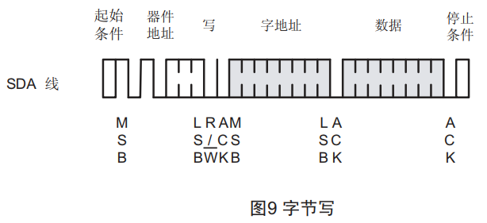
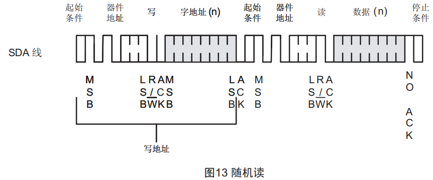
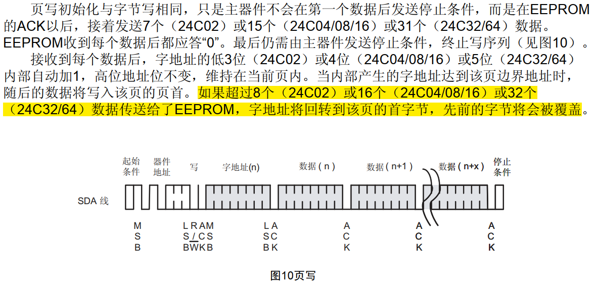
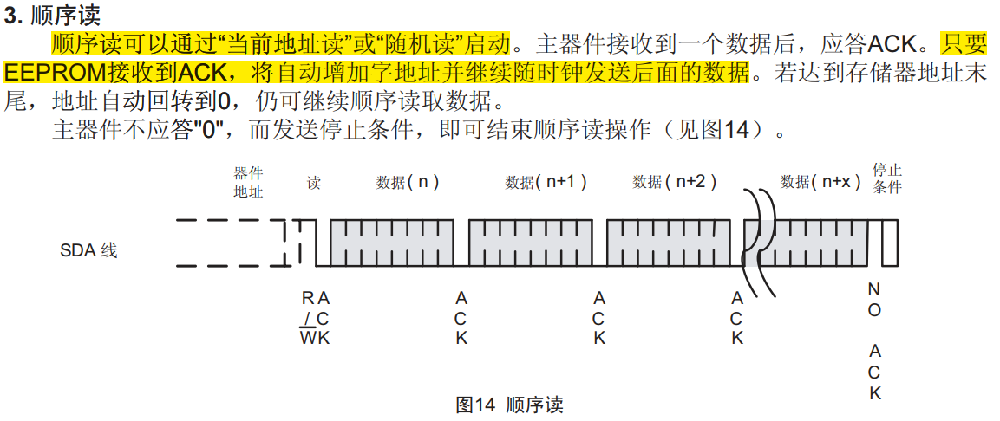

# 32单片机学习记录13之AT24C02

看说明书的思路：

- 看特点

- 看引脚

- 如何操作
  - 如何跟主控芯片进行数据交换

## AT24C02介绍

### 常见的存储设备存储类型

​	Rom   ：只读存储器  ：     CD碟----掉电不丢失

​	Ram   ：随机存储器(可读可写)，掉电数据丢失，读写速度快， 内存条

​	Eeprom ：可读可写，掉电数据不丢失，  电可擦除PROM,   AT24Cxx    IIC

​	Flash  ：闪存，可读可写，掉电数据不丢失  手动擦除     W25Q64   SPI


### AT24C02特点

- at24c02是一种EEPROM存储芯片
- 工作电压范围 1.8~5.5v	（工作电压范围宽）
- 支持低功耗模式（待机）
- 存储容量 256 * 8 （2k bit）   //256 byte

  - 256 : 寻址空间  绝对地址0 ~ 255        8  ：页

  - AT24C02有256个存储空间，每个存储空间可以存一个字节（8bit）数据	  
- 2线串行接口，兼容IIC总线接口（IIC通信）  
  - IIC总线通信速度(3.3v)	
- 硬件数据写保护
  - 把数据写进去，可以通过写保护管脚接入相应的电平时候，**只能读不能写**
- 内部写周期最大5ms	
  - **当写数据时候，他先将数据存在存储器中，把相应地址空间的数据清除，然后才会把数据写到对应地址中。要给5ms的时间**
- 可按字节写，也可以按页写

  - 按字节写：对应的找到地址空间，写入数据
- 按页写  ：一页8字节，可以自动写下一个字节但是不能自动换页
  
  - 自动找页内下一个地址，只需要给首地址即可
    - 越界会从头回写覆盖
    - **页写概念**：虽然AT24C02的存储器没有真正的“页”的物理分区，但为了提高写入效率，引入了“页写”的概念。页写允许你一次性写入多个字节的数据。
    - **自动地址递增**：
      - 在开始写入操作时，你需要提供一个起始地址。AT24C02会自动将后续的字节写入到这个起始地址之后的地址。
      - 写入的字节数不超过8个时，地址会自动递增。在AT24C02中，每页的容量是8字节。
    - **限制**：
      - 如果你试图写入超过8个字节的数据，AT24C02不会自动继续写入到下一页。相反，超过8个字节的写入将不会被处理或会导致错误。
      - 当写入操作超过8个字节时，你需要手动管理地址，确保你不超出页面边界或者在需要时手动跳转到下一页的起始地址。
    - **使用建议**：
      - 为了确保写入操作的成功，最好将每次写入的数据量限制在8个字节以内。
      - 如果需要写入超过8个字节的数据，你可以分批次进行，每次写入不超过8个字节，并手动调整地址。
  - 起始地址编号   和   内容 
- 读是没有限定的可以从0地址空间读到255地址空间（自动地址递增）
- 可擦写100万次。（注意：跟读没关系）

### 引脚说明

- Vcc： 电源

- GND： 地

- A0,A1,A2 ： 器件地址位

  - 此器件地址： 1 0 1 0 A2 A1 A0 R/W  （手册8页）---前四位固定，后三位自由设置，最后一位为读写控制位 （1：主机读AT24的数据  0:主机写数据到AT24）

  - 根据原理图可知：A2 A1 A0 接地  

  - 所以器件地址为： 1 0 1 0 0 0 0 R/W    写：10100000(0xa0)   读：10100001(0xa1)  
  - 0xa0：写模式      0xa1：读模式

- SDA： IIC通信的数据线

- SCL： IIC通信的时钟线

- WP： 写保护管脚，接地可以正常读写，高电平只能读	

**对AT24C02读写操作**

- AT24C02器件地址 1010000(读/写)位    

- 读写位：

  - 接下来ST32要对存储芯片的读写操作

  - 写： 0         10100000    0xa0

  - 读： 1         10100001    0xa1


### 页边界的确定

- **没有物理上的页**：是的，我之前提到 AT24C02 等 EEPROM 设备在物理结构上并没有真正的"页"。它们是连续的存储单元，每个单元通常是1个字节。
- **逻辑上的页**：尽管物理上没有页的概念，但在EEPROM的操作上，为了提高写入效率和简化控制逻辑，制造商引入了"页写"的概念。**页写**允许一次写入多个字节，**这实际上是通过硬件或固件实现的批量写入机制。**
- **页边界**：虽然物理上没有页的结构，但是为了方便和优化写入操作，EEPROM 的设计者定义了一个逻辑上的页大小（例如，AT24C02 定义为8字节）。这个逻辑上的页大小决定了页边界：
  - 当您执行页写操作时，EEPROM 控制器会检查写入的字节数和起始地址，确保写入操作不会超过定义的页边界。
  - 如果写入操作会跨越这个逻辑页边界，控制器会停止写入，并需要您重新发起一个新的写入操作来处理剩余的数据。

**为什么默认页的边界？**

- **写入效率**：页写可以提高写入效率，因为它减少了发送起始和停止信号的次数以及地址设置的次数。
- **简化控制逻辑**：**通过定义页边界，EEPROM 的控制逻辑可以更简单地管理写入操作，避免因连续写入而导致的过度复杂的控制。**
- **兼容性和一致性**：**定义一个固定的页大小和边界有助于保持不同 EEPROM 设备之间的兼容性和操作的一致性。**

因此，虽然 EEPROM 在物理上没有页的概念，但为了操作上的便利和效率，制造商和设计者引入了逻辑上的页边界概念。这意味着在编程时，您必须考虑到这些逻辑上的边界，以确保数据写入的正确性和完整性。

**页边界的固定性**：

- 对于 AT24C02 这样的 EEPROM，页的大小是固定的（8个字节），这意味着每个页的边界也是固定的。页边界是由地址的低三位决定的，无论首地址是多少。

**如何确定页边界**：

- 页的边界不是根据传入的首地址动态计算的，而是由EEPROM的设计预先定义好的。无论您从哪个地址开始写入，页的边界都是固定的。
- 例如，地址 `0x00` 到 `0x07` 始终属于第一页，`0x08` 到 `0x0F` 属于第二页，以此类推。

**写入操作的限制**：

- 当您进行页写操作时，EEPROM 控制器会检查您试图写入的数据是否会跨越这些固定边界。如果会，控制器会只允许写入到页边界，然后您需要重新发起一个新的写入操作来写入剩余的数据。
- 如果超过8个（ 24C02）或16个（ 24C04/08/16）或32个（ 24C32/64）数据传送给了EEPROM，字地址将回转到**该页的首字节**，先前的字节将会被覆盖 。

**为什么不能动态计算页边界？**

- **硬件设计**：EEPROM 的硬件设计通常是基于固定页大小的，这简化了控制逻辑和提高了写入效率。
- **操作一致性**：固定页边界确保了操作的一致性和可预测性，不论首地址是什么。
- **简化软件开发**：固定页边界使得软件开发者在编写 EEPROM 操作代码时可以更容易地管理写入和读取操作。

因此，虽然首地址会影响您开始写入的页，但页边界本身是固定的，您需要根据这些固定的边界来调整您的写入操作。如果您的写入操作会跨页，您需要手动处理剩余的数据写入，确保不跨越页边界或正确处理跨页情况。

### 读写操作的前提

AT24C02（以及其他I²C EEPROM芯片）在进行读写操作时，确实需要先发送器件地址，并附上读或写的控制位。以下是具体的原因和步骤：

1. **发送器件地址**：在I²C通信中，首先发送的是7位的器件地址（AT24C02的器件地址为1010xxx，其中xxx是芯片的A2, A1, A0引脚的电平决定的），后面紧跟着第8位，这个位是读/写控制位（1表示读，0表示写）。
2. **读/写控制位**：这个位告诉芯片接下来是要进行读操作还是写操作。即使在同一传输中（例如，先写地址然后读数据），你仍然需要再次发送器件地址来指示读操作的开始。
3. **操作顺序**：
   - **写操作**：发送器件地址+写控制位 -> 发送要写入的数据的内存地址 -> 发送数据。
   - 读操作（连续读）：
     - 如果是从一个新的地址开始读，先发送器件地址+写控制位 -> 发送要读取的内存地址 -> 发送一个重复起始条件（Repeated START） -> 发送器件地址+读控制位 -> 读取数据。
     - 如果是继续从上次的地址读数据，只需发送器件地址+读控制位 -> 读取数据。
4. **重复起始条件**：在I²C中，**可以使用重复起始条件来在同一个传输中改变读写模式，而不需要先发送停止条件（STOP）。**

因此，即使在同一传输中，发送器件地址是必须的，因为它不仅用于选择芯片，还用于指示接下来的操作是读还是写。这确保了I²C总线上的设备能够正确理解主机的意图。

## AT24C02读写操作

### 往at24c02的某个地址空间写一个字节操作



```
		主机发送起始信号              //IIC起始信号函数 
		主机发送器件地址+写           //IIC发送一个字节函数 
		主机检测应答/不应答信号       //检测应答/不应答函数 
		主机发送器件内部地址          //IIC发送一个字节函数 
		主机检测应答/不应答信号       //检测应答/不应答函数  
		主机发送要存储的数据          //IIC发送一个字节函数 
		主机检测应答/不应答信号       //检测应答/不应答函数   
		主机发送停止信号              //IIC停止信号函数
```

- 发送一个字节数据的停止信号后，需要给时间从缓冲区写入EEPROM中5ms

### 从at24c02的某个地址空间读一个字节操作



```c
	主机发送起始信号     //IIC起始信号函数
	主机发送器件地址(W)  //IIC发送一个字节函数
	主机检测应答信号     //IIC检测应答函数
	主机发送器件内部地址 //IIC发送一个字节函数
	主机检测应答信号     //IIC检测应答函数
	主机发送起始信号     //IIC起始信号函数
	主机发送器件地址(R)  //IIC发送一个字节函数
	主机检测应答信号 	 //IIC检测应答函数
	主读一个字节数据     //IIC接收一个字节函数
	主机发送不应答信号   //IIC发送应答/不应答函数
	主机发送停止信号     //IIC停止信号函数
```

### 页写操作



说明:

- at24c02 存储芯片中有256个字节  0~255

- 每页8byte  

- 页写只能在同一页内连续写 (内部地址自动递增) 

- 需要根据写入的起始地址和写入的字节数判断是否跨页

- inner / 8 == (inner + num_byte - 1) / 8  不会跨页

### 连续读读操作



说明:

- 连续读,不受跨页限制.可以从0读到255.

## 超过一页的多字节写入的方案

AT24C02,我使用页写时，虽然可以多字节写，但是会有页边界，超出会回写页的首地址。最多写8个。要想写超过8个字节的数据，我可以实现字节写使用循环。一个一个地址存入即可。还有什么其他的方案吗？

你提到的方案是正确的，AT24C02 是 2K bit 的EEPROM，页面大小是8字节。如果你想写入超过8个字节的数据，除了你提到的字节写循环方法外，还有一些其他方法可以考虑：

1. **使用循环和延时**：

   - 写入EEPROM后，通常需要一个小的延时来确保数据被正确写入。你可以在循环中加入适当的延时来确保每一次写入操作都是安全的。

   - ```c
     def write_eeprom(address, data):
         for i in range(0, len(data), 8):  # 每8字节一页
             page = data[i:i+8]
             for j, byte in enumerate(page):
                 write_byte(address + i + j, byte)
                 # 这里添加适当的延时，具体时间需要根据你的EEPROM型号调整
                 time.sleep(0.010)  # 例如10毫秒的延时
     ```

2. **问题：**

   - 分页写入有一个问题：

   - 每一次写入不一定是从一页的首地址开始写，这样的话会有很多情况。而且延迟很多

   - 自动递增方案：

   - 只能在一页之内递增，超出边界会回到页首地址覆盖。

**折衷方案**

利用软件来管理页边界，同时结合EEPROM的自动地址递增特性。这是一个很好的折衷方案，既可以充分利用硬件的特性，又能通过软件灵活处理页边界问题。

1. ```c
   //跨页写多字节
   u8 at24c02_skip_page_write(u8 inner_addr,const char *address,u8 length){
       u8 count = 0;          // 已写入的总字节数
       u8 current_addr = inner_addr;
       u8 bytes_in_page;      // 当前页还可以写入的字节数
       
       while(count < length) {
   				//存储器地址检查
   				if(current_addr >= AT24C02_MAX_ADDR) {
   					iic_stop();
   					return AT24C02_OVER;
   				}
   
           // 计算当前地址到页边界还有多少字节
           // 当前页的结束地址(7,15,23...)减去当前地址，就是还能写入的字节数
           bytes_in_page = 8 - (current_addr % 8);
           
   				//检查是否跨页
           // 如果剩余数据长度小于当前页剩余空间，就只写入剩余的数据
   				//可以直接写一页还是写剩余的数据
           if((length - count) < bytes_in_page) {
               bytes_in_page = length - count;
           }
           
           // 发起写入流程
           iic_start();
           
           // 发送器件地址
           iic_send_byte(AT24C02_ADDR_W);
           if(iic_get_ack()) {
               iic_stop();
               return AT24C02_ERR1;
           }
           
           // 发送内部空间地址
           iic_send_byte(current_addr);
           if(iic_get_ack()) {
               iic_stop();
               return AT24C02_ERR2;
           }
           
           // 利用页写的自动递增功能，连续写入当前页的数据
   				//先把当前页写完
           for(u8 i = 0; i < bytes_in_page; i++) {
               iic_send_byte(*address);
               if(iic_get_ack()) {
                   iic_stop();
                   return AT24C02_ERR3;
               }
   						//往后获取一个元素写入
   						address++;
   						// 更新写入元素个数
   						count++;
           }
           
           // 一页写完，发送停止信号
           iic_stop();
           // 等待写入完成
           baseTim6Delay_Ms(5);
           
   		//手动换页
           current_addr = current_addr+bytes_in_page;
       }
   		
       return AT24C02_NO_ERR;
   }
   ```

注意事项：

- 逻辑有一点长，可以使用while(1)和break来跳出

- 没有利用已经写好的页写函数，增加了很多开始和结束信号

- 直接计算当前页还可以写入的空间数量，与还需要写入的元素个数比较：

  - 大于，需要跨页，调用页写函数后**需要手动换页**
  - 小于，直接写入页中即可**不需要手动换页**。

- 优化

- ```c
  //跨页写多字节
  void at24c02_skip_page_write(u8 inner_addr,const char *address,u8 length){
  	u8 less_num;
  	while(1){
  		//计算本页还有多少字节空间可以写less_num
  		less_num = 8 - inner_addr % 8;
  		
  		//判断要写的字节数据不需要跨页
  		if(less_num >= length){
  			//调用页写函数，写入即可  inner_addr,address,length
  			at24c02_page_write(inner_addr,address,length);
  			//不需要换页，直接跳出
  			break;
  		}
  		//要写入的字节数据需要跨页，
  		else {
  			//调用页写函数先把本页剩余的空间写满
  			at24c02_page_write(inner_addr,address,less_num);
  			//计算还有多少字节要写
  			length = length - less_num;
  			//计算剩余数据的传入地址
  			address = address + less_num;
  			//计算下一页的起始地址
  			inner_addr = inner_addr + less_num;
  		}
  	}
  }
  ```

## AT24C02应用

### 需求1？？？？？

**往AT24C02中存储结构体类型数据**

**AT24C02是一个一个字节数据存放的，怎么能存放结构体呢？是不是存不下？还是说只是存了一个结构体地址，其余数据存放到flash中去了？不是很能理解？**

你的理解有部分正确，但也有一些误区。让我们详细解释一下如何在AT24C02中存储结构体数据：

1. **AT24C02的存储特性**：
   - AT24C02是2Kb的EEPROM，意味着它有2048位（256字节）的存储空间。
   - 它是按字节存储的，每个地址存储一个字节的数据。
2. **结构体存储**：
   - 在C语言中，结构体（struct）是一种复合数据类型，它可以包含多个不同类型的数据成员。
   - **要将结构体存储到EEPROM中，你需要将结构体的每个成员拆分成字节，然后逐个字节写入到EEPROM的不同地址中。**
3. **存储过程**：
   - **不是存储结构体的地址**：你提到的“只是存了一个结构体地址”是不正确的。实际上，**结构体本身并不会存储在EEPROM中，而是其数据成员。**
   - **逐字节存储**：你需要将结构体中的每个成员按照一定的顺序和规则转换成字节，然后这些字节一个一个地写入到EEPROM的地址中。
   - 例如，**如果你的结构体包含一个整数（通常是4字节）和一个字符（1字节），你可以将这5个字节逐一写入到EEPROM的5个连续地址中。**
4. **存储步骤**：
   - 定义你的结构体。
   - 将结构体中的数据按字节拆分。
   - 编写代码逐字节写入到EEPROM中，通常使用一个循环来处理。
   - **读取时，同样需要按字节读取，然后重组回结构体。**
5. **注意事项**：
   - 由于EEPROM的存储空间有限，你需要确保你的结构体大小不超过EEPROM的容量。
   - 考虑到结构体可能包含不同类型的成员（如int, float, char等），**你可能需要处理数据对齐和字节顺序（endianness）的问题。**
   - **如果结构体过大，可以考虑将结构体的一部分或多次写入到EEPROM中。**
6. 总之，AT24C02可以存储结构体数据，但需要你手动处理结构体的每个成员，将其转换为字节并逐个写入EEPROM中。不是直接存储结构体的地址，而是将结构体数据本身转换为字节序列存储。

分析:存储一本书的信息

```c
typedef struct {
    uint8_t name[30]; // 15个字符，最多15个汉字，30字节
    uint8_t writer[30]; // 15个字符，最多15个汉字，30字节
    uint8_t number[15]; // 假设number都是ASCII字符
    uint32_t hot;
    uint32_t sc;
    float price;
} Book;

Book BK1 = {"西游记","吴承恩","W201955",0,30,55.5};
```

**汉字我该如何拆开？拆开一个汉字的大小也不止一个字节啊？不好拆？**

在C语言中处理汉字（Unicode字符）时确实需要考虑编码问题。汉字在计算机中通常采用UTF-8或GB2312等编码方式存储。了解到你使用的是GB2312编码。GB2312编码的汉字通常占用两个字节。下面是如何在AT24C02中存储包含GB2312编码汉字的结构体的方法：

**GB2312编码**

- GB2312编码的汉字占用两个字节。例如，汉字"西"在GB2312中的编码是`0xD1 0xA7`。
- 所以，如果你的字符串包含汉字，你需要考虑到每个汉字占用两个字节。

**处理方法**

1. **确定编码**：你已经确定使用的是GB2312编码。
2. **字符串长度计算**：
   - 对于GB2312编码的字符串，字符串的实际长度（以字节计）是汉字数量的两倍再加上ASCII字符的数量。
   - 确保数组的大小足以容纳这些字符。
3. **存储**：
   - 当你将字符串存储到EEPROM时，你需要逐字节写入。
   - 对于每个汉字，你需要将其两个字节分别写入。
4. **注意事项**：
   - 确保数组的大小足够大，以适应你可能使用的最大字符数和GB2312编码方式。
   - 在读取时，你需要注意字节顺序和编码方式，以正确解析汉字。
   - 由于GB2312是双字节编码，字符串长度计算和数组大小设置需要特别注意。
   - 为了确保数据的完整性和可读性，考虑在EEPROM中存储一个标识或版本号来指示数据的编码方式。


**你怎么知道一个字节占数组的一个元素？比如两个汉字，那就是四个字节，那么就一定占用数组四个元素？**

数组与字节的关系

- **数组的元素**：**在C语言中，数组的每个元素占据一定的内存空间，这取决于数组的类型**。例如，`uint8_t`数组的每个元素占用1个字节，而`int`数组（假设是32位的）每个元素占用4个字节。
- **汉字的编码**：
  - **GB2312**：每个汉字占用两个字节。

我的解释可能之前不够清晰，让我们更详细地讨论一下这个问题。

**数组与字节的关系**

- **数组的元素**：在C语言中，数组的每个元素占据一定的内存空间，这取决于数组的类型。例如，`uint8_t`数组的每个元素占用1个字节，而`int`数组（假设是32位的）每个元素占用4个字节。
- **汉字的编码**：
  - **GB2312**：每个汉字占用两个字节。
  - **UTF-8**：每个汉字通常占用3个字节，但可以根据字符的Unicode值变化（1到4个字节）。

**数组中的汉字**

- 如果你有一个`uint8_t`类型的数组（即每个元素1个字节），那么：

  - 一个汉字（在GB2312编码下）将占用数组的两个元素，因为它需要两个字节。

  - ```c
    uint8_t name[6] = {'西', '游', '记'}; // GB2312编码下，'西'='D1 A7', '游'='D3 CE', '记'='C1 A2'
    ```

  - 在这个例子中：

    - `name[0]` 和 `name[1]` 代表汉字'西'（0xD1, 0xA7）。
    - `name[2]` 和 `name[3]` 代表汉字'游'（0xD3, 0xCE）。
    - `name[4]` 和 `name[5]` 代表汉字'记'（0xC1, 0xA2）。

总结

- 数组的每个元素大小由数组的类型决定。
- 汉字在不同的编码下占用的字节数不同，但每个字节仍旧占据数组的一个元素。
- 当你存储汉字到`uint8_t`数组时，每个汉字在GB2312编码下占用两个元素，在UTF-8编码下通常占用三个元素。

因此，如果你有两个汉字，无论是GB2312还是UTF-8编码，它们都会占用数组中的多个元素，但每个元素的大小始终是1个字节。希望这个解释能帮助你更好地理解数组与汉字存储的关系。

### 需求2

打印开机次数

分析:

- 获取上一次的开机次数(从AT24C02中读出来)

- 读出来的数据+1,再写到AT24C02中,(下次用)

 

问题：

- 第一次开机去读at24c02中的数据时候，之前没存储开机次数，读不出来数据  

解决：

- 如果是第一次开机，就直接给开机次数赋值1，并且打印，并且写入AT24C02中

- 如果不是第一次开机，就读出AT24C02中的开机数据值，+1;打印；写入到AT24C02中

问题：

- 如何判断是否为第一次开机？

解决: 

- 选取AT24C02中的一个空间作为第一次开机标志位

- 每次开机直接读此空间的数据

- 如果不是0xff就证明是第一次开机,此时要将0xff写入到这个空间中，

- 下一次开机再读此空间就能读到0xff,就可以证明不是第一次开机

### 需求3

存储流水灯速度,按键调控流水灯,调控的速度要存储到AT24C02中

说明:调整到自己想要的速度才能存储速度数据

- 按按键1存储数据

KEY1在没有开流水灯的时候,起到开启作用

开流水灯后,起到保存当前速度作用

- 调整到某个速度后,3s不做任何操作,速度自动保存

按下按键开始计时   

- 如何做到按下按键开始计时？

按按键并且到时间 才保存速度（一次）

- 附加：

把流水灯和开机次数功能写成一个程序

把流水灯速度和开机次数，和开机标志 放在一个结构体变量中管理

开机次数是可以1000+次

存储结构体