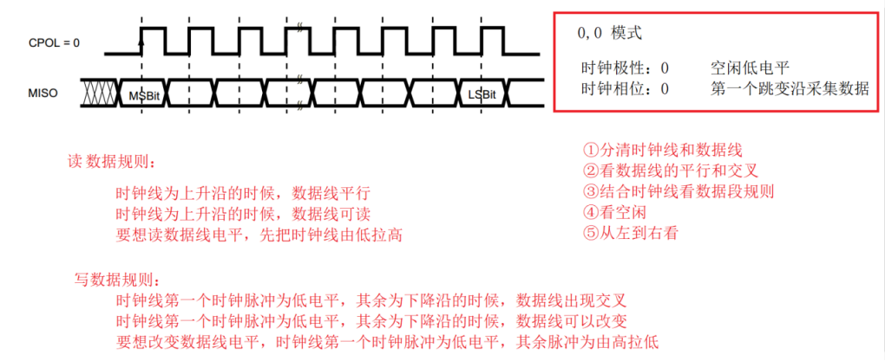
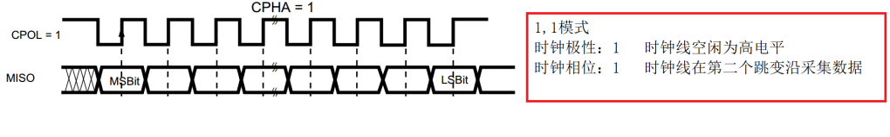

# 32单片机学习记录14之SPI通信

## 前置

**IIC通信和SPI通信的异同点与各自的优势？**

相同点:

1. 都是同步串行通信协议
2. 都采用主从工作模式
3. 都广泛应用于单片机与外围设备的通信

不同点:

通信线数:

- I2C只需要2根线(SCL时钟线和SDA数据线)
  - **意味着半双工**
- SPI需要4根线(SCLK时钟线、MOSI主出从入、MISO主入从出、CS片选)
  - **可以全双工**

从设备数量:

- I2C可以通过7位或10位地址连接多个从设备,共用总线
  - **通过器件地址跟从设备指定通信**
- SPI每增加一个从设备就需要增加一根片选线(CS),或使用多级译码器
  - **跟51的静态数码管的位选一样。使用的是一个译码器。**

通信速率:

- I2C标准模式100Kbps,快速模式400Kbps,高速模式可达3.4Mbps
  - **主机IO口模拟提供的速度受到从器件的最大速度影响**
- SPI可以达到几十Mbps甚至更高

各自优势:

I2C优势:

1. 只需两根线,节省IO口和PCB布线空间
2. 可以方便地挂载多个设备而无需额外IO
3. 有标准的地址编码方案,设备兼容性好
4. 具有应答机制,通信可靠性高

SPI优势:

1. **通信速率更高,适合高速数据传输**
   1. TF卡（手机内存卡，外扩硬盘大小）
2. **全双工通信,可以同时收发数据**
3. 协议简单,易于实现
4. **不需要上拉电阻,功耗较低**

选择建议:

- 如果需要连接多个低速设备(如EEPROM、传感器等),优先选择I2C
- 如果需要高速数据传输(如LCD、**SD卡**等),或要求实时性较高的场合,优先选择SPI


**IIC使用IO口模拟的实用性更高，因为各芯片上的IIC器件上的控制器配置各有不同，换平台还要移植。 SPI呢？生产环境中**

**串口呢？模拟还是控制器配置实用性高？**

### 使用IO口模拟还是控制器配置

1. **硬件控制器 vs. IO口模拟**：
   - **硬件控制器**：适用于需要高性能、高速率、稳定性和可靠性的通信接口，特别是在生产环境中。优先用于SPI、UART等需要高精度时序和高速率的通信。
   - **IO口模拟**：适用于资源有限、低速率、或需要跨平台移植的场景。**对于I²C来说，IO口模拟提供更好的通用性和调试灵活性。**
2. **具体应用建议**：
   - **SPI**：**优先使用硬件控制器**，特别是在需要高数据传输速率、DMA支持或复杂通信场景中。IO口模拟可用于低速、简单的应用。
   - **UART**：**优先使用硬件串口控制器**，特别是在需要高精度波特率或多串口通信的场合。IO口模拟仅用于极端情况或调试。
   - **I²C**：IO口模拟提供了更好的跨平台兼容性和灵活性，适用于小批量或多平台项目。硬件I²C控制器则用于需要高性能和可靠性的系统。
3. **通用策略**：
   - **混合使用**：根据具体需求，混合使用硬件控制器和IO口模拟，以达到最佳性能和资源利用。
   - **抽象层**：使用抽象层设计，使得底层实现的变化不影响上层应用，方便移植和维护。
   - **测试与验证**：无论选择何种方式，都需在实际环境中充分测试。
   - **考虑扩展性**：在选择通信接口时，也要考虑系统的未来扩展需求。
   - **文档和支持**：选择有良好文档和社区支持的硬件或模拟方案。
4. **最终决定**：选择使用硬件控制器还是IO口模拟，应综合考虑项目需求、性能要求、成本、开发资源和未来扩展性等因素。

通过这种方法，你可以根据具体项目情况，合理分配硬件资源，确保系统的性能、可靠性和开发效率。

### 通信原理

SPI（Serial Peripheral Interface，串行外设接口）是一种**同步串行通信协议**，主要用于短距离设备通信。以下是SPI通信的基本原理和四根线的作用：

SPI通信原理：

1. **主从模式**：SPI通信采用主从模式，一个主设备（Master）可以控制一个或多个从设备（Slave）。主设备控制通信的时序和数据传输方向。
2. **同步传输**：数据在时钟信号（SCLK）的控制下进行传输。**每个时钟周期（高低电平转换时间）传输一位数据**。
3. **全双工通信**：SPI可以**同时进行数据的发送和接收，允许主从设备在同一时间发送和接收数据**。
4. **数据传输格式**：
   - **数据通常是8位或16位的字长。**
   - **可以配置为MSB（Most Significant Bit）先发送或者LSB（Least Significant Bit）先发送。**
5. **模式选择**：SPI有四种模式（Mode 0-3），由时钟极性（CPOL）和时钟相位（CPHA）决定，**决定了数据在时钟信号的哪个边沿采样。**
   1. 时钟极性（CPOL）：
      1. **CPOL = 0**：时钟信号在**空闲状态**（即没有数据传输时）为**低电平**（0）。数据在时钟信号的上升沿（0到1）或下降沿（1到0）进行采样。
      2. **CPOL = 1**：时钟信号在**空闲状态为高电平**（1）。数据在时钟信号的下降沿或上升沿进行采样。
   2. 时钟相位（CPHA）：
      1. **CPHA = 0**：数据在每个时钟周期的第一个边沿（CPOL决定是上升沿还是下降沿）被采样，第二个边沿进行数据变换。
      2. **CPHA = 1**：数据在每个时钟周期的第二个边沿被采样，**第一个边沿进行数据变换**。
   3. 四种模式：
      1. **模式0 (CPOL=0, CPHA=0)**：
         - 空闲时钟为低电平，数据在第一个上升沿采样。
      2. **模式1 (CPOL=0, CPHA=1)**：
         - 空闲时钟为低电平，数据在第一个下降沿采样。
      3. **模式2 (CPOL=1, CPHA=0)**：
         - 空闲时钟为高电平，数据在第一个下降沿采样。
      4. **模式3 (CPOL=1, CPHA=1)**：
         - 空闲时钟为高电平，数据在第一个上升沿采样。

四根线的作用：

1. **SCLK（Serial Clock）**：
   - 由主设备产生，用于同步数据传输。时钟信号控制数据何时被发送和接收。
2. **MOSI（Master Out Slave In）**：
   - 数据从**主设备发送到从设备**的线路。在多从设备系统中，每个从设备都有自己的MOSI线。
3. **MISO（Master In Slave Out）**：
   - 数据从**从设备发送到主设备**的线路。同样，在多从设备系统中，每个从设备都有自己的MISO线。
4. **SS/CS（Slave Select/Chip Select）**：
   
   1. [传送门](###片选（启动SPI控制器）的方式)
   2. 主机上的NSS软件管理模式：
   
      - SSM=1：启用NSS软件管理
   
      - SSI=1：设置内部NSS为高电平
   
      - 这里的目的是维持设备的主机身份，防止误变为从机
   
      - 这与选择从机无关
   
   1. 片选信号(SS/CS)的工作原理：
   
      - 是主机通过GPIO控制的独立信号线
   
      - 拉低时选中对应的从机，该从机开始响应SPI总线上的通信
   
      - 拉高时释放从机，该从机会忽略总线上的数据
   
      - 在多从机系统中，每个从机都需要一条独立的片选线
   
      - 片选信号同时也标志着通信的开始和结束

除了这四根线外，还可能有其他线路用于电源（VCC）和地线（GND），但这些是基本的SPI通信线。

SPI的优势在于其简单性和高速性，特别适合于高速数据传输的应用场景，如传感器、SD卡、LCD显示屏等。然而，由于需要额外的SS线，SPI在多从设备系统中可能会增加线路复杂度。


**那一根是主设备的发送和接收线？主设备的发送和接收线是从设备的接收和发送线吗？**

- **MOSI（Master Out Slave In）** 是主设备的发送线，同时也是从设备的接收线。这意味着从主设备发送的数据通过这条线路被从设备接收。
- **MISO（Master In Slave Out）** 是主设备的接收线，同时也是从设备的发送线。从设备发送的数据通过这条线路被主设备接收。

所以：

- 主设备的**发送线**就是从设备的**接收线**（MOSI）。
- 主设备的**接收线**就是从设备的**发送线**（MISO）。

在SPI通信中：

- 当主设备发送数据时，它使用MOSI线路，而从设备通过MOSI线路接收这些数据。
- 当从设备发送数据时，它使用MISO线路，而主设备通过MISO线路接收这些数据。

这种设计允许在同一时间进行全双工通信，即主设备可以一边发送数据到从设备（通过MOSI），一边从从设备接收数据（通过MISO）。这也是SPI能够实现高速通信的原因之一。

### 片选（启动SPI控制器）的方式

SPI的片选（SS/CS）管理可以分为**硬件管理方式**和**软件管理方式**：

硬件管理方式：

- **外部信号控制**：通过外部输入的低电平信号来控制SS/CS引脚的电平，进而选择特定的从设备并启动SPI控制器的通信。这是一种典型的硬件管理方式，常见于需要物理连接多个从设备的系统中。通过外部硬件（如微控制器的GPIO）来拉低或拉高SS/CS引脚。
- **片选的作用**：当SS/CS引脚被拉低时，不仅选中了从设备，**还启动了SPI通信**，确保只有选中的从设备参与通信。

软件管理方式：

- **内部寄存器控制**：某些SPI控制器支持软件管理模式，通过内部寄存器来控制SS/CS引脚的状态。例如，设置一个名为**SSM**（Software Slave Management）的位来启用或禁用软件控制。
  - **SSM位**：当SSM位被设置为1时，SPI控制器进入软件管理模式，此时SS/CS引脚的状态可以通过编程来控制，而不是依赖外部信号。这通常通过写入特定的寄存器来实现，允许主设备软件直接控制哪个从设备被选中。
- **优点**：软件管理方式提供更大的灵活性和控制，因为它不依赖于外部硬件信号。可以根据需要动态地选择从设备，甚至可以在通信过程中动态地切换从设备。
- **缺点**：需要注意的是，使用软件管理时，必须确保不会与硬件管理方式发生冲突，即如果有外部硬件控制SS/CS引脚，软件管理模式可能无法正确工作。

两种管理方式各有其适用场景：

- 硬件管理方式适用于需要物理连接多个从设备的系统，且对实时性和硬件控制有较高要求的场景。
- 软件管理方式适用于需要动态控制或减少引脚使用的情况，尤其是在单从设备或软件需要更灵活控制通信的场景。

在实际应用中，选择哪种方式取决于具体的需求和系统设计。有些SPI控制器甚至可能同时支持这两种方式，允许用户根据不同的应用场景灵活选择。


**感觉主设备中SPI控制器可以使用软件管理启动。从设备可以利用主设备的GPIO口接到NSS引脚，来启动从设备的SPI控制器同时也起到了片选作用？**

主设备中SPI控制器的软件管理：

- **软件管理启动**：在主设备中，SPI控制器可以配置为软件管理模式（通过设置SSM位）。在这种模式下，主设备可以通过编程来控制SPI通信的启动和停止，而不需要依赖外部的SS/CS信号。软件可以直接操作寄存器来选择从设备并启动SPI通信。

从设备的硬件启动和片选：

- 使用主设备的GPIO：从设备的SPI控制器通常是通过外部硬件信号来启动的。主设备可以使用其GPIO引脚连接到从设备的NSS（或SS/CS）引脚。当主设备需要与特定从设备通信时，它会将相应的GPIO引脚置为低电平，从而：
  - 启动从设备的SPI控制器，准备进行通信。
  - 同时，起到片选的作用，确保只有被选中的从设备参与SPI通信。

这种设计允许：

- **灵活性**：主设备可以动态地选择和切换从设备进行通信，通过软件控制GPIO引脚的电平。
- **硬件简化**：从设备只需要关注自己的NSS引脚状态，无需自己处理片选逻辑。
- **兼容性**：这种方式兼容于大多数SPI设备的设计，因为大多数从设备都期望通过硬件信号来启动通信。

所以，您的描述非常准确。主设备可以通过软件管理来启动自己的SPI控制器，而从设备则依赖于主设备通过GPIO提供的硬件信号来启动通信和片选。这两种方式可以协同工作，提供了一个灵活而高效的SPI通信系统。

**片选（NSS）与 SPI 通信启停的逻辑总结**

- **主设备软件管理 NSS：**
  - **片选低电平 (NSS_L)：**开始通信，**SPI 总线有效**。
  - **片选高电平 (NSS_H)：**结束通信，**SPI 总线释放**。
- **从设备硬件管理 NSS：**
  - 从设备在 NSS 为低时响应通信请求，在 NSS 为高时忽略总线数据。
  - **NSS 信号由主设备直接通过 GPIO 提供，确保从设备选择逻辑清晰。**

## SPI通信介绍

- SPI：串行外部设备接口----通信接口

- 特点：高速同步串行全双工通信    40M  

- 硬件连线：  4线制

  - SCLK ：时钟线--------------------由主机发出

  - MOSI：主机输出从机输入----------发送线

  - MISO：主机输入从机输出----------接收线

  - CS  ：片选线，拉低有效--------起始信号/结束信号

说明：

SPI通信也可以挂载多个从器件，通过片选线选中具体从器件


- 数据帧传输：
  -  片选低 +数据位(8/16) +片选高

- 特点：

  -  数据位：  8 /16位    //取决于从器件支持

  - MSB 在前 LSB 在前    //取决于从器件支持

- 传输过程：

  1. MCU选中芯片   //拉低片选

  2. 传输数据  
  3. MCU释放芯片	  //拉高片选

- SPI配置方式

  - 用IO口模拟SPI的时序

  - 直接配置SPI控制器的寄存器

## SPI通信IO口模拟

### SPI四种不同的模式

[传送门](###通信原理)

- 取决于从器件支持

- 时钟极性：
  - 空闲时候时钟线电平状态  高  低

- 时钟相位：

  - 时钟线在第一个跳变沿时，数据线可以读

  - 时钟线在第二个跳变沿时，数据线可以读

 

- 时钟极性位  0    时钟线的第一个跳变沿数据线可以采样  (0 0)

- 时钟极性位  0    时钟线的第二个跳变沿数据线可以采样  (0 1)

- 时钟极性位  1    时钟线的第一个跳变沿数据线可以采样  (1 0)

- 时钟极性位  1    时钟线的第二个跳变沿数据线可以采样  (1 1)	


### 特殊说明

- SPI发送数据和接收数据的规则：

  - **发送一个位数据一定会接收到一位数据**
    - 在SPI通信中，每当主设备发送一个数据位时，从设备也会**同时**发送一个数据位回来。也就是说，SPI的每个时钟周期（上升沿或下降沿）都会传输两个数据位，一个是从主设备到从设备，另一个是从从设备到主设备。

  - **接收一个位数据之前一定要发送一位数据**
    - 这意味着在SPI通信中，主设备必须先发送一个数据位才能接收到从设备发送回来的数据位。SPI通信是同步的，主设备通过时钟信号来控制数据传输的节奏，所以在每个时钟周期内，数据的发送和接收是同步进行的。

**特性**：在SPI通信中，每次你发送一个小片段的数据（就像发送一个字母），你也会同时收到一个小片段的数据（就像收到一个回信的字母），即便你可能不需要这个回信。

**原因**：

1. **双向街道**：想象SPI通信就像是两条并行的街道。你在你这条街上发送东西时，另一条街上也会有东西朝你过来。这是因为SPI设计就是为了让**数据能够同时来回传输，即使你只想单向发送。**
2. **同步舞蹈**：SPI通信就像是一个同步的舞蹈。每次你迈出一步（发送数据），你的舞伴（从设备）也必须迈出一步（发送数据）。这是因为SPI的时钟信号就像是舞曲的节拍，每个节拍你都必须做动作。
3. **硬件设计**：SPI的硬件设计就是这样工作的。硬件电路会自动地同时处理发送和接收，就像是设计了一个双向车道，无论你是否需要另一边的车道，它都在那里工作。
4. **效率与一致性**：这样做的好处是可以提高效率，因为你**不用每次发送数据后再单独去接收数据，减少了等待时间。同时，它也保证了数据的同步性，你发送和接收的数据在时间上是一致的，不会错过任何一个"节拍"。**


**那也就是说主设备需要接收数据时，也会发送数据，即使从设备不需要？**

- **从设备通常不会主动发送数据**。它们会**等待主设备通过时钟信号（SCLK）来触发数据传输**。
- **主设备发送假数据**：为了接收从设备的数据，主设备通常会发送一些"假数据"或"哑数据"到从设备。这些假数据**只是为了触发从设备的响应，而不是为了传递实际信息。**
- **从设备的响应**：当主设备发送假数据时，从设备会根据这个触发信号，按照SPI的同步通信协议，发送它自己的数据回给主设备。
- **接收从设备的数据**：在主设备发送假数据的同时，它会接收到从设备发送过来的数据。这就是为什么**即使从设备没有收到任何有意义的数据，它仍然会响应主设备的请求并发送数据。**

这个过程确保了即使从设备没有需要主动发送的数据，主设备也能通过发送假数据来"请求"从设备发送其数据。这样的设计使得SPI在数据传输上非常灵活，既可以用于单向数据传输（如只发送或只接收），也可以用于双向数据传输（同时发送和接收）。

- 所以,发送函数和接收函数要写成一个函数

- ```c
  u8 SPI传输一个字节函数(u8 data)
  {
  	循环结构
  {
  		发送一位数据
  		接收一位数据
  	}			
  }
  ```

- 由于SPI是全双工的：

  - **在同一时刻，数据既可以从主设备发送到从设备，也可以从从设备发送到主设备。这意味着在每个时钟周期，主设备可以发送一位数据，同时从从设备接收一位数据。**
  - **发送和接收同时进行**：每次时钟周期，SPI主设备在MOSI（Master Out Slave In）线上发送一个比特，同时在MISO（Master In Slave Out）线上接收一个比特。**这意味着在传输一个字节的过程中，发送和接收操作是并行进行的，而不是分开的操作。**
  - **效率**：这种设计使得SPI通信非常高效，因为它**减少了通信的开销。你不需要为发送和接收分别设置不同的操作或时间，所有的数据传输都在同一个循环中完成。**
  - **简化逻辑**：将发送和接收操作合并到一个函数中，可以简化代码逻辑，因为你**只需要在一个循环中处理两个方向的数据流动。这也减少了函数调用的开销和代码的复杂性。**

- 因此，将发送和接收功能合并到一个函数中，不仅符合SPI协议的特性，也提高了代码的可读性和效率。这种设计方式在硬件和软件实现上都更为自然和直观。

- 如何使用此函数:

  - 发送数据的时候：
    - 调用此函数只需要将要发送的数据传给参数，返回值不用管

  - 接收数据的时候：
    - 往参数中随便传一个数据，要关注返回值，返回值就是要接收的数据
    - **只是为了触发从设备的发送而已。从设备无法主动发送数据**

#### 疑问

**那从设备怎么知道主设备要发数据？如何能达到主设备发送的同时，从设备也发呢？**

从设备如何知道主设备要发送数据：

1. **片选信号（CS/SS）**：
   - SPI使用片选信号（Chip Select or Slave Select）来选择特定的从设备进行通信。**当主设备将某个从设备的CS线拉低时，表示该从设备被选中，可以开始通信。**只有当CS信号处于激活状态（通常是低电平），从设备才会响应主设备的时钟信号。
2. **时钟信号（SCLK）**：
   - 当CS信号激活后，主设备会通过SCLK信号来控制数据的传输速率。从设备通过检测这个时钟信号的变化来知道何时应该读取或发送数据。

实现同时发送和接收：

1. **全双工通信**：
   - SPI是一种全双工通信协议，这意味着在同一个时钟周期内，主设备可以同时发送和接收数据。主设备通过SCLK信号控制数据的传输节奏。
2. **数据线**：
   - SPI使用两条数据线：
     - **MOSI（主出从入）**：主设备通过这条线发送数据给从设备。
     - **MISO（主入从出）**：从设备通过这条线发送数据给主设备。
3. **同步传输**：
   - 在每个时钟周期（通常是SCLK的上升沿或下降沿），主设备发送一个数据位到MOSI线，同时从MISO线接收一个数据位。SPI协议确保在每个时钟周期，数据的发送和接收是同步进行的。
4. **数据准备**：
   - **从设备在被选中（CS激活）后，会准备好数据以便在主设备发送数据的同时发送自己的数据**。通常，从设备会在每个时钟周期内，根据主设备的时钟信号来发送或接收数据。

总结：

- **片选（CS）信号**：当从设备被片选中后，它知道自己需要准备数据以便响应主设备的通信请求。
- **时钟线（SCLK）**：因为时钟线是共享的，**当主设备拉低时钟线发送数据时，从设备可以感知到这个时钟信号的变化，并在同一个时钟周期内响应发送自己的数据。**
- **同步数据交换**：通过这种方式，在同一个时钟周期内，主设备和从设备可以交换数据位，实现高效的数据传输。

### SPI时序图

#### 00模式（大多数器件都支持的模式）

时钟极性为0(SCL_L)，时钟相位为0(时钟线在第一个跳变沿数据线可以读)



**只看接收线是一样的，主机的接收线也是从机的发送线。**

空闲:

- SCL_L       //空闲

**注意这里写数据和读数据的时机以及IO口初始化配置的区别**

- IIC通信，时钟线拉低就可以写数据，时钟线拉高就可以读取数据。数据线高电平代表逻辑1，低电平代表逻辑0。
  - 初始化配置时，时钟线和数据线都拉高。
- SIP通信，有四种模式的时序图。单看时钟极性0，时钟相位为0的模式
  - 初始化配置时，时钟极性设置为0，即时钟线配置为0。时钟相位需要在程序中体现。
  - 由时序图可知，时钟相位想要为0的话，第一个跳变沿读取数据即第一个上升沿时读取数据
  - 所以写数据时先拉低时钟线，读取数据时时钟线拉高即可。

```c
//发送一个字节
//时钟极性 0 低
//时钟相位 0 低  第一个跳变沿读数据，时钟一开始是低，固定第一个跳变沿是上升沿，第二个跳变沿是下降沿

//一开始时钟线是低，我发数据时，时钟线拉低，没有出现跳变沿
//那么于此同时收数据时，时钟线拉高，出现第一个跳变沿，上升沿。完全符合00模式时序图

//同理发送第二位数据时，时钟线必定是下升沿
//接收第二位数据时，时钟线必定是上升沿
u8 spi_byte(u8 data){
    u8 i;
    for(i=0;i<8;i++){
        //发送一位数据
        SPI_SLCK_L;
        if(data & 0x80)
            SPI_MOSI_H;
        else
            SPI_MOSI_L;
        data <<= 1;
        
        //接收一位数据
        SPI_SLCK_H;
        if(SPI_MISO)
            data |= 0x01;
    }
    return data;
}
```


#### IIC和SPI通信模拟的差异性

**SPI通信使用GPIO口模拟时，操作之后不用再把时钟线和数据线拉高。而IIC通信使用IO口模拟时，一次操作后需要结束信号以及把时钟线和数据线拉高。他们的区别是什么？**

**通信机制**

- **I²C**:
  - **多主设备协议**，支持多个主机和从机共用两条总线（SCL和SDA）。
  - 结束信号和拉高总线：
    - I²C 的总线空闲状态要求 SCL 和 SDA 均处于 **高电平**。
    - 模拟通信时，操作结束后需要通过将 SDA 和 SCL 拉高，**表明当前总线空闲，避免其他设备误认为总线仍被占用。**
    - **主设备需要通过这种方式释放总线，使其可以被其他主设备接管，或等待下一个通信周期的开始。**
- **SPI**:
  - **单主多从协议**，主设备通过独立的片选信号（CS）选择具体的从设备进行通信。
  - 结束信号和释放总线：
    - SPI 的主设备控制整个通信过程，**片选信号 (CS) 在通信过程中被拉低，表示该从设备被选中。**
    - **通信结束时，CS 被拉高表示通信完成，但无需刻意调整时钟线 (SCK) 和数据线 (MOSI/MISO) 的状态，因为主设备直接控制这些信号线，且没有多主冲突的问题。**

------

**总线冲突的处理**

- **I²C**:
  - I²C 的多主机制需要确保总线的状态清晰（释放总线后线为高电平），避免多个主机尝试同时占用总线。
  - **模拟通信时**，必须通过结束信号和拉高总线来明确总线状态，保障下一次通信能够顺利进行。
- **SPI**:
  - SPI 是单主设备协议，不存在主设备之间的冲突问题。
  - 只需通过片选信号切换从设备，不需要通过时钟线或数据线的状态来表明通信结束。

------

**模拟实现的差异**

- **I²C**:
  - 模拟 I²C 通信时，操作结束后需要：
    1. 发送停止信号（SCL 高电平时 SDA 从低变高）。
    2. 将 SDA 和 SCL 设置为高电平，表示释放总线。
  - 这是确保 I²C 的标准操作，避免错误状态。
- **SPI**:
  - 模拟 SPI 通信时，操作结束后，只需要将片选信号 (CS) 拉高即可，无需额外处理时钟线和数据线，因为它们的状态由主设备单独控制。

------

**总结**

I²C 和 SPI 的模拟通信差异主要源于协议设计：

- I²C 是 **多主多从协议**，需要通过拉高总线释放信号，确保总线状态明确。
- SPI 是 **单主多从协议**，通过片选信号控制通信，不需要处理时钟和数据线的状态，通信结束直接释放片选信号即可。

总结起来就是：**I²C 和 SPI 的总线释放方式不同**，因为两者的协议设计和工作机制不一样：

- I²C：
  - 多主多从协议，为避免总线冲突，通信结束时需要通过释放总线（SCL 和 SDA 拉高）明确表示总线空闲，允许其他设备使用。
- SPI：
  - 单主多从协议，通过片选信号 (CS) 控制从设备的选择，通信结束时只需要将片选信号拉高即可，无需特别处理其他信号线的状态。

这种差异主要是协议本身对总线使用规则的不同要求导致的。

#### 01模式

时钟极性为0(SCL_L)，时钟相位为1(时钟线在第二个跳变沿数据线可以读)  


规则:

- 先发高位

- 时钟线为下降沿,数据线稳定,可以读数据

- 时钟线为上升沿,数据线可以改变

```c
//发送一个字节
//时钟极性 0 低
//时钟相位 1 低  第二个跳变沿读数据，时钟一开始是低，固定第一个跳变沿是上升沿，第二个跳变沿是下降沿
//一开始时钟线是低，我发数据时，时钟线拉高，第一个跳变沿是写
//那么于此同时收数据时，时钟线拉低，第二个跳变沿是读，完全符合01模式时序图

//同理发送第二位数据时，时钟线必定是上升沿
//接收第二位数据时，时钟线必定是下降沿
u8 spi_byte(u8 data){
    u8 i;
    for(i=0;i<8;i++){
        //发送一位数据
        SPI_SLCK_H;
        if(data & 0x80)
            SPI_MOSI_H;
        else
            SPI_MOSI_L;
        data <<= 1;
        
        //接收一位数据
        SPI_SLCK_L;
        if(SPI_MISO)
            data |= 0x01;
    }
    return data;
}
```

#### 10模式

时钟极性为1(SCL_H)，时钟相位为0(时钟线在第一个跳变沿数据线可以读)


- 空闲:
  - SCLK_H

- 规则:
  - 先传输高位
  - 时钟线为下降沿,数据线稳定; (要想读数据,时钟线拉低)
  - 第一位数据时钟线为高电平,数据线可以改变;(要想写数据,时钟线要拉高)
  - 其他的数据时钟线为上升沿，数据线可以改变(要想写数据,时钟线要拉高)

#### 11模式

时钟极性为1(SCL_H)，时钟相位为1(时钟线在第二个跳变沿数据线可以读) 



空闲;

- SCLK_H

规则:

- 先传输高位

- 时钟线为上升沿,数据线可读

- 时钟线为下降沿,数据线可写

说明:

- 如果用IO口模拟SPI时序,IO口要用通用模式
- **因为没有使用芯片片上外设的SPI。**

### IO口模拟的最高速度与SPI通信的最高速度以及从设备的最高速度的关系

IO口模拟SPI的最高速度

- 由MCU的主频和程序执行效率决定
- 每个时钟周期需要多条指令来模拟一个SPI时钟周期(设置、延时、读取等)
- 通常只能达到硬件SPI速度的1/10~1/20
- 例如:主频72MHz的MCU,模拟SPI最快也就几百kHz量级

SPI协议本身的速度限制

- SPI协议本身确实只是一个通信规范，定义了:

  - 时钟极性(CPOL)
  - 时钟相位(CPHA)
  - 片选(CS)信号控制
  - 数据传输时序

  它并不规定具体的通信速度。只要主从设备能够:

  1. 遵循同样的时序规范
  2. 双方都能在当前速度下正确采样数据
  3. 满足各自的建立时间(Setup time)和保持时间(Hold time)要求

从设备的速度限制

- **由从设备的规格决定,是最关键的限制因素**
- 必须查看设备手册中标注的最高时钟频率
- 常见存储器如FLASH可支持20-108MHz
- 一些传感器可能只支持几MHz

所以实际使用时的速度限制主要来自:

1. 主设备能产生的最高时钟频率(硬件SPI或IO模拟)
2. 从设备的时序参数要求(建立时间、保持时间等)
3. PCB布线、信号完整性等物理限制

**使用时的限制原则: 实际通信速度必须满足:**

1. 不超过硬件能力(IO模拟或硬件SPI的最高速度)
2. 不超过从设备的最高工作频率
3. 满足从设备的时序参数要求(建立时间、保持时间等)

例如:

- 如果用IO模拟,速度受限于程序执行效率
- 如果用硬件SPI,速度受限于主机的SPI时钟分频
- 从设备要求tsetup > 10ns,则时钟周期必须预留足够时间满足这个要求

## SPI控制器配置

说明:

- SPI控制会驱动IO口输出标准 SPI时序.

- 需要开发人员配置SPI控制器中的寄存器

- IO口需要支持SPI复用功能

### SPI控制器框图

- SPI控制会驱动IO口输出标准 SPI时序.

- 需要开发人员配置SPI控制器中的寄存器

- IO口需要支持SPI复用功能
  - GPIO口模拟：
    - 内核不经过片上外设直接输出高低电平模拟SPI协议与片外外设交流。**通用模式**
  - 控制器配置：
    - 使用芯片上的外设（片上外设）复用GPIO口输出SPI协议与片外外设交流。**复用模式**


- NSS引脚说明[传送门](###片选（启动SPI控制器）的方式)

- MOSI:发送接口

- MISO:接收接口

- SCK : 时钟线接口

- NSS: SPI控制器允许传输数据 条件接口

  - 主设备打开是表示SPI通信开启，总线占用状态，多主机状态下避免总线冲突。
  - 从设备打开是表示片选被选中，可以与主机进行SPI通信。关闭表示忽略总线的状态 。

  - 软件管理模式：SSM=1，SSI=1，将内部NSS引脚设置为高。看框图。

  - 在 NSS 软件模式下，将 SPI_CR1 寄存器中的SSM 位置 1，将 SSI 位清零。

通过框图可知数据传输规则：	

- 发送数据：

​		发送数据检测之前的数据是否发送完成，等待之前的数据发送完成再发送下一个数据

- 接收数据：

​		M4数据数据之前检测是否接收完成数据，等待接收数据完成才去读DR中的数据

### 数据流向

1.**主机的内核数据寄存器 → SPI 控制器的发送缓冲区**

- **内核数据寄存器：**
  主机的处理器会将待发送的数据写入 SPI 数据寄存器（`SPIx->DR`）。
  - 在这里，程序可以直接操作 `SPIx->DR`，这是一种高层的抽象。
  - 硬件 SPI 控制器将从 `SPIx->DR` 获取数据。
- **SPI 控制器的发送缓冲区：**
  数据从 `SPIx->DR` 转移到 SPI 控制器的发送缓冲区（这是硬件的内部实现，通常不可直接访问）。
  - **发送缓冲区的主要作用是缓冲数据，为移位寄存器做好准备。**
  - **一旦发送缓冲区准备好，数据会被移入发送移位寄存器。**

------

**2. 主机的发送缓冲区 → 主机的移位寄存器**

- 发送移位寄存器：

  SPI 控制器通过发送移位寄存器按位将数据移出，开始通过 MOSI 引脚发送给从机。

  - 每个时钟脉冲（SCK）都会使发送移位寄存器移动一位。
  - 在移位的同时，从机的 MISO 引脚会发送数据，主机通过接收移位寄存器接收数据。

------

**3. 主机的移位寄存器 → 从机的移位寄存器**

- 数据传输：

  主机通过 MOSI 将数据发送给从机，同时通过 MISO 接收从机的数据。

  - 主机的移位寄存器和从机的移位寄存器会在时钟信号（SCK）的同步驱动下进行位对位的交换。
  - 从机的移位寄存器在接收到主机数据的同时，也将自己的数据移出，发送到主机。

------

**4. 从机的移位寄存器 → 从机的接收缓冲区**

- 接收缓冲区：

  从机的移位寄存器完成 8 位（或 16 位，具体取决于配置）数据的接收后，这些数据会被转移到从机的接收缓冲区。

  - 接收缓冲区保存了从主机接收到的数据，供从机的处理器读取。
  - 如果从机未及时读取接收缓冲区数据，可能会导致数据覆盖（取决于 SPI 的硬件设计）。

------

**5. 从机的接收缓冲区 → 从机的数据寄存器（内核）**

- **内核读取数据：**
  从机的处理器通过读取接收缓冲区的数据寄存器，获取主机传输的完整字节。

**关键点：**

1. **移位寄存器是 SPI 数据交换的核心：**
   主机和从机的数据交换发生在移位寄存器之间，SCK 时钟信号驱动它们同步移位。

2. **缓冲区的作用：**

   - 发送缓冲区确保数据可以连续发送，而不会因为处理器速度不足而中断。
   - 接收缓冲区存储从机传来的数据，避免数据丢失。

3. **数据流是全双工的：**
   主机发送和接收是同步进行的。虽然在发送时接收到的数据可能是无效的，但硬件仍会执行接收操作。

4.  **为什么需要两个移位寄存器？**

   如果只有一个移位寄存器，发送和接收数据将会冲突，无法实现全双工通信。通过两个独立的移位寄存器：

   1. 主机可以一边发送数据，一边接收从机的数据。
   2. 接收和发送操作可以完全解耦，同时进行。


### SPI 使能 (SPI enable)与NSS引脚

**SPI_CR1 的 SPE 位：SPI 控制器使能**

- **定义：**
  - SPI_CR1 寄存器中的 SPE 位是**控制整个 SPI 外设（控制器）启停的总开关**。
  - 设置 SPE = 1 时，SPI 控制器被启用，SPI 硬件模块开始运行，可以进行通信。
  - 清除 SPE = 0 时，SPI 控制器被禁用，所有 SPI 相关的时钟、逻辑和功能模块停止工作。
- **作用：**
  1. 启用或关闭整个 SPI 硬件模块：
     - 在通信前，必须先将 SPE 置 1，激活 SPI 外设。否则，即使时钟信号和数据线操作都正确，SPI 控制器也不会参与通信。
     - 在通信结束或需要省电时，可以通过将 SPE 置 0 来禁用 SPI 控制器。
  2. 内部逻辑控制：
     - SPE 控制了 SPI 外设的所有内部逻辑，比如时钟生成、数据移位寄存器操作等。
- **典型场景：**
  - **初始化 SPI 外设时：**通信开始之前，将 SPE 置 1，启动 SPI。
  - **通信完成后：**可以将 SPE 置 0，停止 SPI，以节省功耗或避免意外的总线操作。

------

**（从机）NSS 引脚：片选信号**

- **定义：**
  - NSS 引脚是 SPI 的片选信号，主要用于管理主设备与从设备之间的通信。
  - NSS 的高低电平用于表示 SPI 从设备是否被选中。
    - **NSS = 低电平**：片选有效，**从设备进入通信状态。**
    - **NSS = 高电平**：片选无效，**从设备忽略总线上的通信信号。**
- **作用：**
  1. 片选与通信选择：
     - 在一个主设备对多个从设备通信的场景中，NSS 信号由主设备的 GPIO 控制，用于选择具体的从设备。
     - 从设备根据 NSS 信号判断是否应该参与当前的通信。
  2. 与总线冲突的防护：
     - NSS 信号确保只有一个从设备被选中，避免多个从设备同时响应，导致总线数据冲突。
  3. 硬件状态管理：
     - **在从设备中，NSS 通常与 SPI 硬件逻辑绑定，当 NSS = 低电平时，SPI 硬件自动准备好接收或发送数据。**
- **从设备（Slave）的NSS引脚**：
  - **硬件管理**：从设备的NSS引脚通常是硬件管理的，由主设备通过GPIO引脚控制。主设备通过将从设备的NSS引脚置为低电平来选择该从设备进行通信，置为高电平则表示不选择该从设备。
  - **片选功能**：NSS引脚的作用是片选（Chip Select），用于在多从设备系统中选择特定的从设备进行通信。当NSS引脚为低电平时，从设备会监听SPI总线上的数据；当为高电平时，从设备通常会忽略SPI总线上的通信。

#### 主设备和从设备的NSS引脚区别

**主机的NSS:**

- 当使用软件管理时(SSM=1)
- SSI=1时设置内部NSS为高电平,这是为了避免主机进入从机模式
- **这里的NSS是用来确保主机身份的,不是用来片选从机的**

**从机的NSS:**

- **NSS确实是作为片选信号输入**
- **NSS低电平时,从机被选中,可以与主机通信**
- **NSS高电平时,从机被释放**

**所以:**

- **主机的NSS(软件管理)是用来维持主机状态的**
- **从机的NSS是真正的片选信号,由主机通过GPIO控制**


### SPI控制器的寄存器

```c
u8 传输一个字节(要发送的数据)
	{
		等待发送完成
		将要发送的数据给DR;
		等待接收完成
		将DR赋值给变量
		返回接收到的数据;
	}

CR1:
	15位： 全双工-----------0  
	14位： 跟上一位有关系，如果上一位选择1，需要配置此位，上一位选择0，此位无意义
	11位： 数据帧格式8位----0      //w25q64数据帧格式是8位的
	10位： 全双工-----------0
	9位 ： 软件从器件-------1
	8位 ： 主机模式  -------0
	7位 ： 先发高位---------0
	6位 :  SPI使能----------1      //放在最后
	5 4 3  配置速度--------2分频   //根据通信对象
	2位 ： 主模式-----------1    
	1位 :  时钟极性     4个模式    
	0位 ： 时钟相位
        
SR : 
	1位 ：如果为1，说明发完了
	0位 ：如果为1，说明收到了数据
DR ：
	如果配置的八位数据，就低八位有效，
	如果配合的十六位数据帧格式，就16位有效
```

## 程序设计

总体程序设计

- SPI初始化配置程序
  - GPIO口模拟的话，哪一个口都行，用那个配置那个
  - 使用控制器的话，需要看芯片内部框图SPI挂载那一条总线上，以及数据手册看那个GPIO口可以复用SPI功能

- SPI传输一个字节程序

详细程序设计

```
SPI初始化配置函数
{
    /*IO口控制器配置*/
        //端口时钟是使能
        //端口模式配置-------------复用模式
        //输出类型配置
        //输出速度配置-------------50M
        //上下拉配置
        //复用功能配置
    /*SPI控制器配置*/
        //SPI时钟使能
        //CR1
        //CR2
}

u8 SPI传输一个字节数据函数(要发送的数据)
{
    //等待发送缓冲区为空 不为空就等待
    //将要发送的数据给DR

    //等待接收缓冲区有数据  没有数据就等待
    //将DR赋值给一个变量

    //变量返回
}
```

## SPI通信使用

主控芯片与W25Q64进行通信

- CS--------PA4  SPI1_NSS 

- SCK------PA5   SPI1_SCK

- MOSI----PA7   SPI1_MOSI

- MISO----PA6   SPI1_MISO

**具体怎么使用SPI通信还是要看外设的规定。**

## 总结

什么是SPI通信

​	特点

​	配置方式

​	时序图(时钟极性和时钟相位)

如何用IO口模拟SPI通信

​	IO口初始化配置函数(通用功能)

​	spi收发一体函数

如何用SPI控制器配置SPI通信

​	框图（收发数据过程，收发一体函数）

​	寄存器(初始化配置过程)

​	spi初始化配置程序设计

​	收发一体函数程序设计


## 边沿和高低电平的意义和区别

**使用IO口模拟SPI通信协议和IIC通信协议。看他们的时序图的话改变数据状态都是在交叉处，也就是出现上升沿或者下降沿。但是在程序表示中逻辑1确实用高电平表示，逻辑0用低电平表示。而不是用上升沿和下降沿。如果使用上升沿和下降沿那么势必会出现0和1的连续出现，根本无法表示连续的1，所以使用上升沿和下降沿不明智。 上升沿和下降沿只在特殊时间点上才会被解析，比如IIC的时钟线处于高电平时，会被解析为起始信号或者结束信号**

1.**信号变化的本质：**

在通信协议的时序图中，上升沿和下降沿的出现是**时钟同步或状态转换的标志**，但它们本身并不直接用来表示逻辑数据的“0”和“1”。而是在**时钟信号的辅助下，通过数据线的状态（高电平/低电平）来表示逻辑值**。

- **逻辑 1 和逻辑 0 的表示方式：**
  - 在绝大多数通信协议中（SPI、I²C），**逻辑 1** 表示为 **高电平**，**逻辑 0** 表示为 **低电平**。
  - 数据的“1”或“0”通过 **电平状态** 传递，而不是通过上升沿或下降沿。
- **上升沿和下降沿的作用：**
  - **SPI 协议：**时钟的上升沿或下降沿用于触发发送或采样数据，数据线在这些边沿被解析。
  - **I²C 协议：**时钟线的上升沿是一个重要参考点，同时 SDA 线在特定时间（如 SCL 高电平时）发生的变化被解析为起始条件或停止条件。

------

**2. 为什么用高低电平表示逻辑值，而不是直接用边沿？**

如果逻辑值使用上升沿和下降沿来表示，确实会遇到以下问题：

1. **连续的 0 或 1 的表示问题：**
   - 如果逻辑 0 和 1 都依赖于边沿，那么连续的 0 或连续的 1 无法产生足够的信号变化来区分逻辑状态。例如：两个连续的逻辑 1 中间没有边沿，接收端无法识别变化。
2. **冗余信号问题：**
   - 使用上升沿和下降沿表示数据时，每传输一个逻辑值，都需要有额外的信号变化（即电平翻转）。这种方式会大大增加信号变化频率，浪费带宽。
3. **信号稳定性问题：**
   - 电平状态在时间上更稳定，可以通过采样多个时钟周期来确认状态，减少噪声影响。而边沿信号的持续时间极短，易受到干扰。

因此，大多数通信协议选择通过电平表示逻辑值，通过时钟边沿（上升沿/下降沿）来同步数据传输。

------

**3. SPI 和 I²C 的数据与时钟解析细节：**

**SPI：**

- SPI 的数据传输依赖于时钟边沿：
  - 例如在 模式 0（CPOL=0, CPHA=0）下：
    - 数据改变发生在时钟的 **下降沿**。
    - 数据采样发生在时钟的 **上升沿**。
  - **逻辑值“1”或“0”通过数据线（MOSI 和 MISO）的高电平或低电平表示。**
  - **上升沿和下降沿只作为触发解析的时间点，并不直接表示数据。**

**I²C：**

- I²C 使用的是 SDA（数据线）和 SCL（时钟线）：
  - 时钟线高电平时，数据线（SDA）发生的变化被解释为控制信号：
    - **下降沿**：起始信号（START）。
    - **上升沿**：停止信号（STOP）。
  - 数据传输时，逻辑 1 和逻辑 0 的表示完全取决于 SDA 的电平：
    - 高电平 = 1，低电平 = 0。

------

**4. 起始信号和停止信号的特殊解析：**

在 I²C 中，起始信号和停止信号确实依赖于 **上升沿和下降沿的特殊时间点**：

- 起始信号（START）：SDA 从高变低，而 SCL 处于高电平。
- 停止信号（STOP）：SDA 从低变高，而 SCL 处于高电平。

**这些特殊信号是通过数据线和时钟线的联合变化定义的，它们并不影响逻辑值的高电平和低电平解析。**

------

**5. 总结**

1. **逻辑 1 和逻辑 0 的表示：**
   - 使用电平（高/低）表示逻辑值，而不是直接依赖上升沿和下降沿。
   - 上升沿和下降沿仅作为特定时间点的触发信号，用于同步或解析数据。
2. **上升沿和下降沿的作用：**
   - 用于定义数据采样点（SPI），或识别特殊信号（I²C 的起始和停止信号）。
3. **为什么不直接用边沿表示数据：**
   - 连续 0 和 1 的表示问题。
   - 冗余信号和带宽浪费。
   - 信号稳定性差。

在程序实现中，逻辑 1 用高电平，逻辑 0 用低电平表示，这是最直观且符合通信协议设计的方式。边沿只在特定时序或条件下被用作触发或解析的参考点。

## 模拟实现IIC与SPI的IO口输出类型区别

**IIC中开漏输出是最合适的，那么SPI的IO口有没有什么要求？SPI中没有上拉电阻，没办法主动拉高？所以选择推挽输出？或者说IIC中面临的多主机总线竞争的问题？**

IIC 选择开漏输出的原因:

- 多主机系统中避免总线竞争和冲突
- 当一个设备输出低电平时，即使其他设备输出高电平，也不会造成短路
- 通过外部上拉电阻实现线与(Wired-AND)功能
- 支持时钟同步(Clock Stretching)机制,从机可以拉低时钟线来延长通信周期

SPI 选择推挽输出的原因:

- SPI 是主机完全控制的通信方式,不存在总线竞争问题
- **每个从机有独立的片选线(CS),同一时间只有一个从机工作**
- 推挽输出具有主动拉高和拉低能力,响应速度快
- 不需要外部上拉电阻也能正常工作
- 适合高速通信场景

**每个从机有独立的片选线(CS),同一时间只有一个从机工作 那岂不是可以同时拉低多个从机？ 实现一对多的通信？其实这样不行，因为SPI协议，主机发送时从机也会响应，如果一对多的话，接收数据会混乱。 SPI感觉上就是全双工的点对点通信。不像IIC那样，既可以广播也可以点对点？**

SPI 特点:

1. 全双工点对点通信
   - 主机发送数据(MOSI)的同时,从机也会通过MISO返回数据
   - 即使主机只想发送数据,也会收到从机的返回值(可能是无效数据)
2. 理论上可以同时拉低多个CS,但因为:
   - 多个从机会同时通过MISO发送数据,导致信号冲突
   - 数据会混乱,无法分辨是哪个从机发送的
3. 所以实际使用时:
   - 必须一次只能与一个从机通信
   - 不支持广播模式

IIC 特点:

1. 半双工通信
   - 同一时刻只能有一个设备发送数据
   - 数据传输有明确的方向性
2. 支持多种通信模式:
   - 点对点通信: 通过从机地址选择特定设备
   - 广播模式: 使用广播地址(0x00)发送给所有从机
   - 多主机模式: 通过仲裁机制解决总线竞争

这就解释了为什么 IIC 在某些场景(如需要广播或多设备交互)更受欢迎,而 SPI 则在需要高速点对点通信时更有优势。


**其实一定程度上可以认为：  全双工就会有两根单向数据线，可以同时发送和接收。不会有一根数据线可以同时发送和接收 半双工就会有一根双向数据线，具有发送和接受能力，但同一时刻只能单向传输，虽然半双工也可以使用两跟数据线，但是没有必要，因为一根线就是最佳实践？**

全双工通信:

- 必须使用两根数据线
- 物理特性决定了同时双向传输需要独立通道
- 典型例子是SPI的MOSI和MISO

半双工通信:

- 一根数据线就足够
- 通过分时复用实现双向传输
- **使用两根数据线反而会:**
  - **增加硬件成本**
  - **占用更多IO资源**
  - **增加线路布置的复杂性**
  - **没有带来额外的功能优势**
- 典型例子是IIC的SDA线

所以说:

- **全双工必须用两根线,这是物理限制决定的**
- **半双工用一根线是最优选择,这是工程实践的结果**

## 控制器配置

```c
/*
SCK-----PA5     SPI1_SCK  复用输出 发送
MOSI----PA7     SPI1_MOSI 复用输出 发送
CS------PB14    SPI1_NSS  通用输出 片选
MISO----PA6     SPI1_MISO 复用输入 接收
*/
//SPI控制器配置的初始化
void spi1_controller_init(void){
    //GPIO总线时钟使能
    RCC->AHB1ENR |= (1<<0)| (1<<1);//使能GPIOA和GPIOB时钟

    //GPIO复用模式配置
    GPIOA->MODER &= ~((3U<<10) | (3U<<12) | (3U<<14)); //清除原配置
    GPIOA->MODER |= (2U<<10) | (2U<<12) | (2U<<14);    //设置为复用模式
    //复用输出类型 PA5 PA7
    GPIOA->OTYPER &= ~((1U<<5) | (1U<<7)); // 推挽输出
    //复用输出速度
    GPIOA->OSPEEDR &= ~((3U<<10) | (3U<<14));// 清除速度配置
    GPIOA->OSPEEDR |= ((1U<<11) | (1U<<15)); // 设置为50MHz
    //复用上下拉
    GPIOA->PUPDR &= ~((3U<<10) | (3U<<12) | (3u<<14));//无上下拉
    
    //配置GPIO的复用功能为SPI AF5
    GPIOA->AFR[0] &= ~((0xF<<20) | (0xF<<24) | (0xF<<28)); 
    GPIOA->AFR[0] |= (5U<<20) | (5U<<24) | (5U<<28);   //配置为AF5（SPI1）

    // 配置PB14为片选引脚（通用输出模式）
    GPIOB->MODER &= ~(3U<<28);  // 清除PB14原配置
    GPIOB->MODER |= (1U<<28);   // 配置为通用输出模式
    GPIOB->OTYPER &= ~(1U<<14); // 推挽输出
    GPIOB->OSPEEDR &= ~(3U<<28);// 清除速度配置
    GPIOB->OSPEEDR |= (1U<<29); // 设置为50MHz
    GPIOB->PUPDR &= ~(3U<<28);//无上下拉
    // 确保CS引脚初始化为高
    GPIOB->ODR |= (1U<<14);  // 拉高片选，通信时才拉低。


    //SPI配置
    RCC->APB2ENR |= (1<<12); //SPI1时钟使能
    //CR1寄存器配置
    SPI1->CR1 &= ~(1U<<15); //双线单向
    SPI1->CR1 &= ~(1U<<11); //8位数据帧
    SPI1->CR1 &= ~(1U<<10); //双线单向下，全双工
    SPI1->CR1 |= (1U<<9); //NSS引脚选择软件管理
    SPI1->CR1 |= (1U<<8); //NSS引脚的值置1，允许SPI控制器通信，看框图的值
    SPI1->CR1 &= ~(1U<<7); //先发高位
    SPI1->CR1 &= ~(7U<<3); //波特率控制为FPCLK/2：84/2=42MHz
    SPI1->CR1 |= (1U<<2); //主配置
    SPI1->CR1 &= ~(1U<<1); //CPOL=0 CPHA=0
    SPI1->CR1 &= ~(1U<<0); //CPOL=0 CPHA=0

    //CR2寄存器配置
    SPI1->CR2 &= ~(1U<<4);//SPI Motorola 模式

    SPI1->CR1 |= (1U<<6); //使能SPI
}
```

**因为控制器的NSS引脚使用软件管理，所以就没有使用GPIO引脚，就不配置了?初始化已经把NSS的值置0拉低了，多主机环境需要拉高，释放总线?**

选中软件管理，就不需要关注NSS的值了。此时作用就变成是否允许主机进行SPI通信了。使用软件管理以及允许主机进行SPI通信，看框图是

```c
SPI1->CR1 |= (1U<<9); //NSS引脚选择软件管理
SPI1->CR1 |= (1U<<8); //NSS引脚的值置1，允许SPI控制器通信，看框图的值
```

对于主机的NSS配置：

**SSM (CR1的第9位):**

- 设为1时确实启用软件NSS管理模式

SSI (CR1的第8位):

- 在SSM=1的情况下，SSI位控制NSS信号的内部值
- 设为1时内部NSS信号为高电平
- 设为0时内部NSS信号为低电平

**关键点在于： 在主模式下，如果要让SPI正常工作，内部NSS信号必须保持高电平。因为如果NSS被拉低，会触发"模式故障事件"(Mode Fault Event)，导致SPI被禁用。**

**这确保了主机的NSS保持在高电平，SPI可以正常通信。如果要选择从机通信，需要通过额外的GPIO来控制从机的片选。**


### 收发一体函数

```c
//SPI全双工发送和接收一个字节
u8 spi_controller_transfer(u8 data){
    while(!(SPI1->SR & (1U<<1))); //等待发送缓冲区空
    SPI1->DR = data; //发送数据，发送完数据后，接收缓冲区就有8位数据了
    //会不会最后一位数据没有写入接收缓冲区，而下面的条件也是满足的，就认为接收完了？
    
    while(!(SPI1->SR & (1U<<0)));//等待接收缓冲区非空
    return SPI1->DR; //返回接收到的数据
}
```

 **会不会最后一位数据没有写入接收缓冲区，而下面的条件也是满足的，就认为接收完了？**

在 SPI 全双工通信中，发送和接收是同时进行的。当你发送一个字节时，硬件会同时移位发送和接收数据。这意味着：

1. 当你向 SPI1->DR 写入数据时，发送移位寄存器会开始发送这个字节。

2. 同时，接收移位寄存器会开始接收从从设备发回的数据。

3. 每发送/接收一位，两个移位寄存器都会移动。

4. 当全部 8 位都传输完成后，数据会被写入接收缓冲区（RXNE 标志会被置位）。


**重点是你想要发数据时，同时收的数据应该是无效数据，因为从机不可能在你发数据时就知道你要什么数据。**

**发送和接收是绑定的：**
无论你是否需要接收数据，SPI 硬件都会同时接收一字节的数据。这意味着即使主机只是想发送数据，接收缓冲区也会存储从机在此期间发送的字节。

**发送时接收的“无效数据”：**
在很多情况下，从机在主机发送数据时并不知道主机具体需要什么数据，因此返回的数据通常是无效的。无效数据可能是：

- 固定值（例如 `0xFF` 或 `0x00`）。
- 从机上一轮的输出值。
- 或者其他应用逻辑决定的值。

**接收有效数据时需要先发送：**
如果主机需要从从机读取数据，通常的流程如下：

- **主机先发送一个“虚拟字节”**（通常是 `0xFF` 或 `0x00`），以触发 SPI 时钟，使得从机输出数据。
- **接收缓冲区中的数据才是有效数据**。

**数据同步的依赖关系：**
主机和从机的数据通信是严格按照时钟同步进行的。主机通过 SCK（时钟信号）驱动从机的移位寄存器工作，没有时钟信号，从机是无法主动发送数据的。

**双缓冲机制：**

- SPI 数据寄存器（`SPIx->DR`）是一个单通道寄存器，但在硬件实现上，它分为发送缓冲区和接收缓冲区。
- 写入 `SPIx->DR` 时，数据会被加载到发送缓冲区。
- 读取 `SPIx->DR` 时，数据来自接收缓冲区。
- 只有当传输完成（`TXE` 和 `RXNE` 标志置位）时，这些缓冲区才会与移位寄存器交互。

### 小结

- **主机发送数据时，总是会接收数据；主机接收数据时，也需要发送数据。**
- 如果接收的数据无效，你需要根据协议处理这些“垃圾数据”。
- 如果你需要从从机读取有效数据，则主机必须主动发送数据以触发时钟信号。

数据流向
