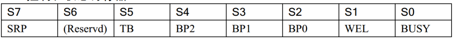

# 32单片机学习记录15之W25Q64

## 前置

**其实学习IIC协议和SPI通信协议，只是明白发送原理，规则。具体怎么利用协议通信还是要看对应硬件对吗？比如AT24C02或者W25Q64?比如学习IIC时，说明发送一个字节需要起始信号，数据传输段，结束信号。但是具体到AT24C02时，发送一个字节需要起始信号，数据传输段具体分成了：发送器件地址，发送内部地址，发送数据。结束信号。实现上会有不同，但是底层原理不变**

IIC协议的基本原理和时序图是通用的，但当应用到具体的设备时，具体的操作步骤会根据设备的功能和设计而有所不同。让我们详细看一下AT24C02的情况：

**IIC协议的通用步骤：**

1. **起始信号（Start Condition）**：SDA线在SCL线为高电平时从高到低的跳变。
2. **数据传输段**：在SCL线的高电平期间，SDA线上的数据有效。
3. **应答位（ACK/NACK）**：每个字节传输后，接收方会发送一个应答信号。
4. **结束信号（Stop Condition）**：SDA线在SCL线为高电平时从低到高的跳变。

**AT24C02的具体实现：**

- **起始信号**：和IIC协议一致。
- 数据传输段：
  - **发送器件地址**：AT24C02有7位的器件地址，加上第8位的读写位（R/W）。例如，AT24C02的器件地址通常是`1010`（A2A1A0），加上读写位形成一个字节的地址。
  - **发送内部地址**：在写操作时，紧接着发送一个字节的内部地址（AT24C02有256字节存储空间，所以地址是8位）。
  - **发送数据**：发送实际的数据字节。每个字节后，设备会发送一个ACK。
- **结束信号**：和IIC协议一致。

这里的差异主要体现在：

- **地址和数据的组织**：AT24C02需要明确的器件地址和内部地址来指定要操作的存储位置。
- **操作的顺序**：必须按照器件地址、内部地址、数据的顺序发送数据。
- **命令集**：尽管IIC协议没有明确的“命令集”，但AT24C02在操作上可以看作是通过发送特定格式的数据来执行命令。

因此，虽然底层协议的原理不变，但具体到不同的设备时，如何利用这些协议来进行实际的读写操作会有不同的细节需要注意。这就是为什么在学习IIC或SPI等协议时，还需要深入了解具体硬件的使用手册和特性。


**W25Q64，存入数据时，如果不确定是0XFF的话，一定要先擦除吗？因为物理特性只能存入0不能存入1**

对于W25Q64这类Flash存储器,由于其物理特性,只能将1改写为0,而不能将0改写为1。所以如果不确定目标区域是否为0xFF(全1状态),就必须先进行擦除操作。

这是因为:

1. Flash的存储单元在擦除状态下是1(0xFF)
2. 写入操作只能将1改为0
3. 要将0改回1只能通过擦除操作实现

举个例子:

- 如果当前内容是0xF0,要写入0x0F
- 由于0xF0中的0位无法直接改为1
- 必须先擦除使其变为0xFF
- 然后再写入0x0F

所以建议的操作流程是:

1. 读取目标区域当前内容
2. 如果不是0xFF状态,先执行扇区擦除
3. 再写入新数据

**这样可以确保数据写入的正确性。不过要注意擦除操作是以扇区为单位的,会将整个扇区数据都擦为0xFF。**

## W25Q64介绍

**特点**

- w25q64是一款Flash类型存储芯片
  - **EEPROM是电可擦除的，也就是不需要手动擦除。**

- 内存大小64Mbit ==8Mbyte

- 通信接口是标准SPI, 支持 (0,0)  和  (1,1) 模式   MSB

- 手动擦除数据(写数据前要擦除空间)
  - [注意事项](##为什么不能在写入函数中擦除需要在函数外面擦除？)

- 不允许跨页写
  - 可以页写，跨页写需要手动“翻页”

**存储结构**

- 存储空间是8M字节
  - 8MB

- 内存区域划分:  块  扇区  页

  - 块  ：一共有128块，每块有16扇区  

  - 扇区：一个扇区有16页       

  - 页  ：一页有256byte

- 绝对地址:

  - 十进制:0~8*1024*1024-1

  - 用十进制传入地址很不方便.
  - **传输以字节为单位，地址也是以字节递增。**

- 十六进制:0~0x7F F F FF

  - 某块 的 某扇区 的 某页 的 某个字节

  - XX    X    X    XX

- 例子:

  - 0x12 3 4 56  18号块的3号扇区的4号页的86号字节

  - 0x0a 3 3 06  10号块的3号扇区的3号页的6号字节
  - **按十六进制每层架构单独计算权重**
  - 2号块的4号扇区的12号页的2号字节    :0x024c02
  - 15号块的10号扇区的15号页的255号字节  :0x0fafff

**存储原理**

​	此芯片只能写入0，不能写入1,擦除后的芯片空间每个字节都是0xff,1只能靠擦除后的1代替.所以,写数据之前擦除空间(擦除要以扇区擦除/块擦除/芯片擦除)如果确保需要写入的空间是0xff就可以不用擦除

**引脚介绍**

- CS：低电平选中芯片开始通信-------------------PB14

- wp：写保护  低电平开启写保护

- HOLD：低电平时其他引脚断开，高电平时，正常工作
  - **控制器暂停工作**

- SCLK:-------------------------PA5

- DO -----------MISO-------PA6                

- DI-----------MOSI-------PA7


**W25Q64状态及控制寄存器介绍**



以下是 **W25Q64 状态寄存器 ** 各位功能的表格整理：

| **位 (Bit)** | **名称**                      | **值**                | **说明**                                                     |
| ------------ | ----------------------------- | --------------------- | ------------------------------------------------------------ |
| **0**        | BUSY                          | `0`：空闲             | 表示设备当前状态是否忙碌。 `0`：空闲（可接收新指令），`1`：忙碌（正在执行写/擦除操作）。 |
|              |                               | `1`：忙碌             |                                                              |
| **1**        | WEL (Write Enable Latch)      | `0`：禁止写入         | 写使能锁存位，用于指示是否启用了写入权限。 `0`：禁止写入，`1`：允许写入。 |
|              |                               | `1`：允许写入         |                                                              |
| **2**        | BP0                           | 见下方组合定义        | 块保护位，与 BP1、BP2 配合设置闪存的写保护范围（见表格下方“块保护范围定义”）。 |
| **3**        | BP1                           |                       |                                                              |
| **4**        | BP2                           |                       |                                                              |
| **5**        | TB (Top/Bottom Block Protect) | `0`：底部保护         | 块保护范围的起始地址。 `0`：保护从底部地址开始，`1`：保护从顶部地址开始。 |
|              |                               | `1`：顶部保护         |                                                              |
| **6**        | RESERVED                      | 固定值：`0`           | 保留位，无特定功能。通常不可修改，未来可能用于扩展。         |
| **7**        | SRP (Status Register Protect) | `0`：可写状态寄存器   | 状态寄存器保护位。 `0`：状态寄存器可被修改，`1`：状态寄存器不可修改，需解除写保护才能操作。 |
|              |                               | `1`：不可写状态寄存器 |                                                              |

**总结：**

​	作用是什么 ？  

​		配置位作用  ：块区保护

​		读状态位作用：写指令是否执行完成

​	如何配置(读)寄存器？

​		发送指令和发送配置值

​	什么时候使用？

​		初始化配置模块的时候


## W25Q64读写操作

- 写使能；指令：0x06

  - 在执行每个“页编程”、“扇区擦除”、“块区擦除”、“芯片擦除”、“写状态寄存器”命令	

  - 为什么要将WEL位置1(因为要执行对W25Q64写操作)

  - 如何将WEL置1（要执行写使能指令）

  - 如何执行写使能指令
  - 配置：
    - 先拉低片选 （CS拉低）;
    - 发送写使能指令（0x06）;    //spi发送接收函数
    - 拉高片选

- 读状态寄存器：指令0x05

  - 状态寄存器的0位为忙位，通过判断此位来确定芯片是否可以接受下一次操作。

  - 页写,擦除,写状态寄存器的时候,要等待执行完毕

    - 1：忙状态

    - 0：不忙可以接受下一条指令

  - 配置：

    - 先拉低片选

    - 发送指令0x05     //返回值不需要接收

    - 接收状态寄存器的值  //发送参数随便

    - 片选拉高

- 写控制及状态寄存器:指令0x01

  - 通过对控制及转态寄存器的配置,实现控制块区写保护.

  - 通过寄存器位写入值:cmd_data

  - 在初始化时候调用此程序

  - 配置:

    - 写使能

    - 片选拉低

    - 发送写寄存器指令

    - 发送配置数据

    - 拉高片选

    - 等待BUSY位为0

- 页写操作：指令0x02

  - 在某一页（256byte）写数据可以连续写，但是不能跨页写：

  - 在写之前擦除此页所在的扇区 ，写操作之前一定要写使能  //扇区擦除独立封装函数 

  - 在写完数据后一定要判断状态位，等待写入结束。

  - 配置:

    - 写使能

    - 片选拉低

    - 发送写数据指令

    - 发送24位地址

    - 循环发送数据

    - 片选拉高

    - 等待写入完成

- 连续写函数,可跨页

  - ```c
    //连续跨页写操作
    void W25Q64_skip_page_write(u32 inner_addr, u8* data, u32 length){
        if (length == 0) {
            printf("写入长度为0，无效操作\r\n");
            return;
        }
    
    	  //已经写入的字节数
        u32 written = 0;
    	 	//从0开始使用<即可
        while (written < length) {
    			// 计算当前页可写入的字节数
    			u16 page_remaining = 256 - (inner_addr % 256);
    			//确定本次写入的具体字节数
    			//剩余元素<本页剩余空间  或者  写满本页
    			u16 to_write = (length - written < page_remaining) ? length - written : page_remaining;
    
    			// 写入当前页
    			W25Q64_writePage(inner_addr, data + written, to_write);
    
    			// 更新已写入字节数和地址
    			written += to_write;
    			inner_addr += to_write;
         }
    }
    ```

- 连续读数据操作：指令0x03

- 可以连续读,不考虑跨页.

- 配置：

  - 先拉低片选 （CS拉低）;

  - 发送读数据指令(0x03)

  - 发送24位(3字节)地址

  - 可以连续读(数据线随便发)

  - 拉高片选

- 扇区擦除：0x20
  - 写入扇区指令之前一定要执行写使能
  - 擦除扇区要等待状态寄存器等待忙完---等待擦除完成
  - 配置：
    - 写使能
    - 先拉低片选 （CS拉低）;
    - 发送指令(0x20)
    - 发送24位(3字节)地址
    - 拉高片选
    - 等待擦除完成

**总结**

- 写使能函数  (写操作时候的前提)

- 读转态寄存器函数(写操作后等待完成)

- 写状态寄存器函数(初始化时候解除所有块写保护)

- 页写函数

- 连续读函数

- 扇区擦除函数

## W25Q64使用

思考问题:

- 什么时候用AT24C02
  - 需要经常性改变的数据  设置参数
  - 电可擦除，方便

- 什么时候用W25Q64
  - 不经常改变的 数据内容,比如字库
  - 这个有擦除次数总限制
  - 修改不方便，最小擦除是扇区不能精准到字节。

具体使用:

- 字库烧录.在项目讲

思考：

- 如果用W25Q64存储经常改变的设置参数，
  - 如果一个设备只有w25q64,但是存储设备的一些参数，解决方案？
  - 开机次数，最近登录时间
  - 更新时会至少擦除一个扇区，不可能一个参数占用一个扇区吧？

- 要改变设置参数，不影响同扇区其他内容

- 怎么办？ 

  - 每个扇区存一个设置参数  不推荐

  - 把设置参数统一在一个结构体里  推荐

  - 把扇区中的数据都读出来，然后在擦除  再写入

## 方案

这确实是一个常见的设计问题。针对这种需要频繁更新的小参数存储，有几个常用的解决方案：

参数轮转存储法

```c
[参数集合1][参数集合2][参数集合3]...[参数集合N]
```

- 将一个扇区划分为多个参数集合区域

- 每次写入时，使用新的区域，而不是擦除旧区域

- 添加一个有效标记(如魔数+CRC)标识最新的有效数据

- 当扇区用完时才整体擦除，重新开始轮转

双扇区备份机制

```
[扇区A: 当前使用]
[扇区B: 备份]
```

- 使用两个扇区交替存储
- 写入时先将新数据写入备份扇区
- 验证成功后擦除原扇区
- 两个扇区通过标记字段表明哪个是当前有效的

实现建议：

1. 将所有需要存储的参数打包成一个结构体
2. 添加校验信息(如CRC、版本号、魔数等)
3. 记录写入次数或时间戳，用于判断最新数据
4. 预留一些空间用于将来扩展

```c
typedef struct {
    uint32_t magic;           // 魔数，用于识别有效数据
    uint32_t version;         // 版本号
    uint32_t write_count;     // 写入次数
    uint32_t boot_count;      // 开机次数    
    uint32_t last_login;      // 最近登录时间
    uint32_t reserved[4];     // 预留
    uint32_t crc;            // CRC校验值
} params_t;
```

这样的设计可以：

- 减少擦除次数，延长Flash寿命
- 保证断电时数据安全性
- 方便参数的整体读写和校验
- 预留空间便于将来扩展

此处使用结构体组织数据的好处

**数据管理更清晰**

- 所有相关参数统一管理，避免散落各处
- 参数之间的空间关系固定，不会出现地址计算错误
- 方便追踪所有需要保存的参数
- 增删参数时能立即看到影响范围

**内存对齐和访问效率**

- 编译器会自动处理内存对齐问题
- 减少跨字节访问带来的性能损失
- 保证数据访问的正确性，尤其是在不同架构下

**便于数据校验和维护**

- 可以对整个结构体计算CRC
- 可以方便地添加版本管理字段
- 整体读写时不会漏掉某些参数
- 可以很容易地做备份和恢复

## 三种通信方式的区别

**串口通信需要使用中断，IIC没有使用中断，SPI没有使用中断。 原因是器件的工作方式不一样。后两者是依靠主机工作的，收发数据都是主动的。 而前者的器件可以是独立工作的，接收数据是没有办法预测的**

1. **串口通信（UART）需要使用中断的原因**
   - 串口通信是一种异步通信方式，数据的接收和发送并不依赖于固定的时钟信号，因此数据的到达是不可预测的。
   - 在接收数据时，系统需要通过中断机制来实时处理每一帧数据，否则可能会因为数据缓冲区溢出而导致数据丢失。
   - 发送数据时，如果使用中断，可以高效地管理数据缓冲区，将数据逐字节发送出去。
2. **IIC 和 SPI 通常不使用中断的原因**
   - **IIC（I²C）**：IIC 是一种半双工、主从模式的同步通信协议。主设备完全控制通信过程，什么时候开始发送或接收数据是可控的，因此数据的接收和发送是可预测的。
   - **SPI**：SPI 是一种全双工的同步通信协议。主设备同样控制整个通信过程，包括时钟信号的生成和数据帧的传输。由于通信是基于时钟信号驱动的，因此数据的收发不会有异步的突发性。
   - 对于这两种协议，主机在控制通信时，往往会通过轮询的方式检查状态或直接等待传输完成。中断的使用并非必要。

总结来说，串口通信需要中断是因为其异步性和数据到达的不可预测性；而 IIC 和 SPI 的数据传输则由主机主动发起且依赖时钟信号，因此不需要中断即可精确控制数据收发。
