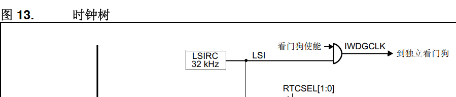

# 32单片机学习记录16之看门狗

## 前置

看门狗（Watchdog Timer, WDT）是一种用于嵌入式系统的安全机制，能够在系统运行出现异常或故障时，自动复位处理器以恢复正常运行。STM32F407提供两种类型的看门狗：独立看门狗（IWDG）和窗口看门狗（WWDG）。

**看门狗的概念**

看门狗是一种硬件定时器，系统正常运行时，应用程序需要定期“喂狗”（重装定时器）。如果由于程序运行异常（例如死循环、长时间阻塞或硬件故障）导致看门狗定时器超时，处理器会被复位。

### **两种看门狗**

**（1）独立看门狗（IWDG）**

- 特性：
  - 使用独立的低功耗时钟源（LSI，内部低速振荡器，约32 kHz）。
  - 与主系统时钟无关，能够在主时钟故障时正常运行。
  - 配置后不能被停止或修改（除非复位），可靠性高。
- 应用场景：
  - **在对安全性要求较高的场景中，用于防止系统死锁或卡死。**
  - **适用于低功耗模式，因为IWDG依赖独立时钟。**

**（2）窗口看门狗（WWDG）**

- 特性：
  - 使用主系统时钟（PCLK1）作为时钟源。
  - 具有“窗口功能”：要求喂狗操作必须在指定时间窗口内完成。如果喂狗过早或过晚都会导致复位。
  - 可通过中断提前提醒喂狗。
- 应用场景：
  - 对系统运行时间和任务调度有严格要求的场景。
  - 用于防止误触发（喂狗过早）和超时（喂狗过晚）的复杂系统。

### **看门狗的产生背景**

看门狗的产生主要是为了解决嵌入式系统运行过程中可能出现的各种异常，包括但不限于：

- **死循环：** 代码由于逻辑错误陷入死循环，系统无法继续运行。
- **硬件故障：** 硬件电磁干扰（EMI）或故障导致系统失去响应。
- **内存溢出：** 动态内存管理不当引起系统崩溃。
- **实时性问题：** 任务长时间阻塞或无法按时完成。

------

### **看门狗的应用场景**

看门狗广泛应用于需要高可靠性和实时性的嵌入式系统中，具体场景包括：

**（1）工业控制**

- PLC控制器、自动化设备等对实时性和稳定性要求高的场景。
- 看门狗能防止由于环境干扰或程序失误导致的长时间停机。

**（2）物联网设备**

- 无人值守的远程传感器节点、网关设备等。
- 看门狗能在设备发生故障时自动复位，确保设备继续正常运行。

**（3）消费电子**

- 智能家电（冰箱、空调）、手持设备等。
- 防止因偶发性故障导致设备卡死，提升用户体验。

**（4）汽车电子**

- 用于ECU（电子控制单元）、仪表盘和车载娱乐系统。
- 确保在关键时刻系统能够恢复运行。

**（5）医疗设备**

- 医疗监护仪、输液泵等。
- 关键系统需要极高的可靠性，看门狗可以提升安全性。

------

### **总结**

STM32F407中的看门狗是一种重要的安全机制，其作用在于保障系统在运行中能够及时发现并自动恢复运行异常。通过独立看门狗（IWDG）和窗口看门狗（WWDG）的组合，开发者可以根据需求选择合适的方式，确保嵌入式系统的可靠性和安全性。

### 本质

看门狗的本质就是**通过定时器监控系统运行状态**，核心思想是让系统定期“喂狗”（即重置看门狗定时器的计数器）。如果系统运行正常，就会不断地按时喂狗，保证定时器不会超时。而一旦系统出现异常（如程序卡死、陷入死循环或硬件故障），定时器无法被及时重置，就会超时触发看门狗的复位机制。

**工作原理总结**

1. **正常运行：**
   - 程序运行时，在固定时间间隔内执行“喂狗”操作（即重置计数器）。
   - 看门狗定时器被不断重置，计数器不会溢出，系统保持正常运行。
2. **异常情况：**
   - 如果程序运行出现问题（例如死循环、阻塞、逻辑错误等），看门狗定时器无法及时被喂狗。
   - 计数器溢出（超时），触发硬件复位信号。
   - 系统被强制复位并重新启动，恢复运行。

------

**两个关键点**

1. **定时器倒计时：** 看门狗的倒计时需要定期重置，否则就会超时触发复位。这种机制类似于一只需要不断喂养的“狗”，不喂食就会“咬人”（复位）。
2. **“喂狗”操作：** 程序运行时通过向看门狗定时器写入特定值（重置计数器）来完成“喂狗”操作。这个过程要求在合理的时间范围内完成，否则会超时复位。

------

**补充说明：窗口看门狗（WWDG）**

窗口看门狗（WWDG）相比独立看门狗（IWDG）更进一步，它增加了“喂狗时间窗口”的限制：

- 规定喂狗必须在某个时间窗口内完成。
- **喂狗太早**（计数器值未达到下限）或**喂狗太晚**（计数器超时溢出）都会触发复位。

这种设计用于防止喂狗操作被误用或硬件受到意外干扰。

------

**优点**

- 简单可靠：硬件直接监控，不依赖复杂的软件逻辑。
- 低功耗：看门狗通常依赖独立时钟（如IWDG使用LSI时钟）。
- 实时性强：能够迅速检测并恢复系统异常。

**实际意义**

看门狗的机制在实际系统中非常重要，它能显著提高系统的可靠性，**尤其在无人值守的嵌入式系统（如工业设备、汽车电子、远程传感器等）中，可以自动恢复故障并避免人工干预。**

## 看门狗介绍

- 作用：
  - 检测CPU是否运行正常，CPU运行正常，看门狗不会发生事情，如果不正常工作，会导致看门狗，复		位程序	

- 原理：

  - 看门狗的本质是一个定时器(定时器的本质是有规律计数)

  - 人为设定一个值比如1000;

  - 计数器就会从1000向下计数

  - 在计数到0之前，程序要重新给看门狗赋值1000(喂狗)

  - 如果程序卡死，就不会执行到喂狗程序，看门狗定时器就会倒数到0,此时看门狗会强行复位程序，

  - (如果程序正常运行，就会阶段性喂狗，就不会复位程序)

- 喂狗：
  - 防止看门狗的计数器计到0结束，

- 什么时候用?

  - 一般使用在程序要求稳定高的产品

  - 在非正常情况下导致程序死机，需要重启  

- 分类:

  - 独立看门狗

  - 窗口看门狗 

## 看门狗框图



STM32F407中的独立看门狗（IWDG）使用的是内部低速时钟（LSI）。

**独立看门狗只能开启不能关闭是吗？其他片上外设都有硬件使能1和0用于关闭和打开**

**STM32F407的独立看门狗（IWDG）是开启后无法关闭的**，这是它的一个显著特性。这种设计增强了看门狗的可靠性，因为它确保了即使在软件或外部干扰的情况下，独立看门狗也能持续运行，保证系统的安全性。

过程:

- 时钟源 是内部低速时钟32KHZ

- 预分频寄存器

- 写入一个值到重装载值寄存器

- 写入一个秘钥到秘钥寄存器中

- 开启计数器使能

说明:	

- 在计数器递减到0之前要喂狗操作(给重装载值)

- 喂狗操作就是向秘钥寄存器中写入秘钥值  0xAAAA

注意：

- 看门狗一旦启动，就不能停止。

### **独立看门狗（IWDG）的特性：**

1. **开启后无法关闭：**
   - 一旦IWDG被启用并开始计时，就不能通过软件禁用它。其控制寄存器的某些位（比如**IWDG_ENABLE**）会被设置为“1”启用看门狗，而这之后无法通过软件再次关闭。
   - 这是为了确保IWDG在系统发生故障时能够继续运行，防止故障使得看门狗失效，导致无法自动复位系统。
2. **复位后才可以重新配置：**
   - 唯一能够“关闭”或“重置”IWDG的方式就是**系统复位**。当发生硬复位（例如外部复位或独立复位）时，IWDG的配置会被清除，可以重新配置它。

**为什么IWDG不能关闭？**

- **安全性要求：** 在某些关键应用中，确保系统即使在异常情况下也能恢复正常运行是至关重要的。看门狗的设计要求它在系统发生卡死、死循环或无法响应时能够自动复位，而不依赖于软件控制。
- **独立性：** IWDG使用独立的LSI时钟源（与主时钟无关），因此即使主系统时钟发生故障，IWDG依然能够持续运行。

**与其他片上外设的区别：**

其他STM32F407的外设（如定时器、GPIO、ADC等）通常都可以通过设置**硬件使能位（ENABLE/RESET bit）**来开启或关闭。这些外设是由系统时钟驱动的，并且它们的开启和关闭对功耗、性能有直接影响。而IWDG为了确保系统的可靠性和独立性，采用了不可关闭的设计，使得它可以在系统出现故障时仍然起作用。


### 独立看门狗使用的时钟

**低速时钟源（LSI）：**

- IWDG的时钟来自内部低速振荡器（Low-Speed Internal Oscillator, LSI），频率典型值为**32 kHz**（具体值可能略有偏差）。
- LSI是一个完全独立于主系统时钟（HCLK或外部晶振）的振荡器，这意味着即使主时钟故障（比如外部晶振损坏），IWDG仍能正常工作。
- LSI在低功耗模式下也能保持运行，因此适合对低功耗要求高的场景。

**独立性：**

- 因为IWDG完全依赖LSI，与主系统时钟无关，提供了额外的安全保障。
- 配置IWDG后，其运行是不可停止的（除非系统复位）。这种独立性保证了高可靠性。

**为什么使用LSI？**

1. **独立可靠：**
   - 即使主系统时钟（HCLK或PLL）失效，LSI仍然能运行，确保看门狗功能的可靠性。
2. **低功耗：**
   - LSI是一个低功耗时钟源，非常适合电池供电或对功耗敏感的系统。
3. **简单稳定：**
   - LSI是STM32内部的固定振荡器，无需外部电路，适合对成本和复杂性有要求的应用场景。

------

**常见应用场景**

- **工业控制：** 工业设备需要高可靠性，即使主时钟失效，IWDG仍能及时复位系统。
- **物联网设备：** 远程节点需要低功耗运行，LSI驱动的IWDG适合这种场景。
- **无人值守系统：** 系统关键任务监控，避免死机后设备长时间停止工作。

时钟源:

- 框图可以知道看门用的是内部低速时钟

- 就需要开启内部低速时钟

如何配置

- 需要手册6.3.28章节 的时钟控制和状态寄存器的

- 0号位是使能内部低速时钟

- 1号位时钟准备就绪

- 首先将0号位置1，然后等待1号位变为1就表示时钟成功开启

## 看门狗相关寄存器

- 关键字寄存器：IWDG->KR

  - 0xAAAA   每次喂狗的写入值（更新重装载）--------狗粮

  - 0x5555    解除寄存器的写保护

  - 0xCCCC    启动计数器

  - 注意:独立看门狗一旦启动就不能关闭

- 分频寄存器

  - 就是对内部低速时钟(LSI 32K)进行分频的

  - 32000/s

  - 32分频   1000/s

- 重载值寄存器

  - 就是让看门狗计数个数

  - 如果需要1s，写入1000;

## 看门狗配置程序

```
时钟源配置
解除寄存器保护  0x5555
设置分频
设置重载值
启动看门狗(也算激活写保护)   0xCCCC 

在程序中阶段性喂狗 0xAAAA 
```

## 为什么看门狗相关寄存器不用清零？

```c
void iwdg_init(void)
{
    //时钟源配置-开启低速时钟
    RCC->CSR |= (1U<<0);
    //等待时钟稳定
    while(!(RCC->CSR & (1U<<1)));
    
    //解除写保护
    IWDG->KR = 0x5555;
    //设置分频为32分频
    IWDG->PR = 3;     //直接赋值更清晰
    //重装载值设置为3000 (超时时间约3秒)
    IWDG->RLR = 3000;
    //重载到计数器
    IWDG->KR = 0xAAAA;
    //启动看门狗
    IWDG->KR = 0xCCCC;
    
    printf("看门狗已经启动\r\n");
}


//独立喂狗程序
void iwdg_feed(void)
{
    IWDG->KR = 0xAAAA;
}
```

看门狗相关寄存器不需要清零的原因有几个：

**KR(密钥寄存器)：**

- 这是一个写操作寄存器(write-only)
- 它只接受特定的值：0x5555(解锁)、0xAAAA(重载)、0xCCCC(启动)
- 向它写入其他值没有任何效果
- 它不保存状态，只触发操作

**PR(预分频寄存器)：**

- 上电复位值就是0
- 写入新值会直接覆盖旧值
- 只有低3位有效(0-7)
- 写入操作会直接更新整个寄存器，不需要先清零

**RLR(重装载寄存器)：**

- 上电复位值是0xFFF
- 写入新值会直接覆盖旧值
- 写入操作会更新整个12位计数值
- 直接写入所需的值即可

简单来说：

- KR是控制寄存器，只认特定值
- PR和RLR是配置寄存器，直接写入新值就能覆盖旧值
- 这些寄存器的设计就是为了直接写入使用，不需要清零操作

## 什么时候清零后置位，什么时候新值覆盖旧值？

清零后使用 |= 的方式：

```c
REGISTER &= ~(MASK);  // 清零
REGISTER |= VALUE;    // 置位
```

直接赋值的方式：

```c
REGISTER = VALUE;     // 直接覆盖
```

在不同场景下，这两种方式各有优劣：

清零后置位的优势：

1. 对于多人协作的代码更安全，因为它明确表示只修改特定位
2. 如果寄存器中有保留位必须保持特定值，这种方式不会改变这些位
3. 在需要保持其他位原有状态时很有用
4. 代码易读性更好，明确表明要修改哪些位

直接赋值的优势：

1. 代码更简洁
2. 执行效率更高（减少了一次读-修改-写操作）
3. 当确定要更新整个寄存器时更合适
4. 不容易出现位操作的错误

举个实际例子：

```c
// 场景1：只想修改某些位，保持其他位不变
GPIO->MODE &= ~(3U << (2 * PIN));   // 清除这个PIN的模式位
GPIO->MODE |= (1U << (2 * PIN));    // 设置为输出模式

// 场景2：要更新整个寄存器的配置
TIMER->PSC = 7200;                  // 直接设置预分频值
```

总结：

1. 选择哪种方式主要取决于：
   - 寄存器的性质（是否有保留位）
   - 是否需要保持其他位的状态
   - 代码的可维护性要求
   - 性能要求
2. 一般建议：
   - 对于控制寄存器，建议用清零后置位
   - 对于配置值寄存器（如定时器周期），直接赋值
   - 参考芯片手册，看具体寄存器的要求
3. 好的编程实践：
   - 在代码注释中说明为什么选择某种方式
   - 在一个项目中保持一致的风格
   - 考虑代码的可维护性和安全性


**如果这一些寄存器上电复位不是0的话，32位寄存器如果有旧值的话，比如0x7fff, 直接赋值3的话，会不会只能覆盖一部分？**

对于STM32的寄存器操作，关键是要理解寄存器的结构和写操作的行为：

1. 寄存器的写操作行为：

- 当我们写入一个寄存器时，是对整个寄存器宽度进行写入
- 即使我们写入的值很小（如3），CPU实际上还是进行32位写操作
- 写入值3时，实际写入的是0x00000003，而不是仅仅写入低位的3

```
IWDG->PR = 3;
实际效果等同于：
IWDG->PR = 0x00000003;

// 不会发生只覆盖部分的情况
IWDG->PR = 3;  // 实际写入0x00000003，完全覆盖原值

// 即使原来的值是0x7FFF
// 写入后也会变成0x00000003
```

**但在某些特殊寄存器中：**

- 某些位可能是只读的
- 某些位可能需要特殊的写序列
- 某些位可能是保留位，必须保持特定值

这种情况下就需要使用位操作：

```
// 清除要修改的位，保持其他位不变
REG &= ~(MASK);
// 设置新值
REG |= VALUE;
```

总结：

1. 对于普通的可写寄存器，直接赋值会覆盖整个寄存器
2. 不用担心只覆盖部分的问题，因为是32位写操作
3. 但要注意查看寄存器手册，了解是否有特殊要求的位

**其实KR,PR,RLR都有保留位，直接赋值会不会出问题？**

仔细看一下，其实保留位还是0。

**KR(密钥寄存器，16位写操作):**

- 高16位[31:16]：保留
- 低16位[15:0]：密钥值

```
// 虽然有保留位，但这是特殊的写操作寄存器
// 只识别特定值：0x5555、0xAAAA、0xCCCC
IWDG->KR = 0x5555;  // 不会有问题，因为是写操作寄存器
```

PR(预分频寄存器，3位有效):

- [31:3]：保留
- [2:0]：预分频值

```c
// 直接赋值
IWDG->PR = 3;  // 实际写入0x00000003
// 或者位操作更准确
IWDG->PR &= ~(7U << 0);  // 清除低3位
IWDG->PR |= (3U << 0);   // 设置新值
```

RLR(重装载寄存器，12位有效):

- [31:12]：保留
- [11:0]：重装载值

```
// 直接赋值
IWDG->RLR = 3000;  // 实际写入0x00000BB8
// 或者位操作更准确
IWDG->RLR &= ~(0xFFF << 0);  // 清除低12位
IWDG->RLR |= (3000 << 0);    // 设置新值
```

结论：

1. 从严格意义上讲，使用位操作更准确，因为明确只修改有效位
2. 但对于IWDG这几个寄存器，ST的设计是即使写入了保留位也不会影响功能
3. 在实际应用中，两种方式都可以正常工作

```c
void iwdg_init(void)
{
    //时钟源配置-开启低速时钟
    RCC->CSR |= (1U<<0);
    //等待时钟稳定
    while(!(RCC->CSR & (1U<<1)));
    
    //解除写保护
    IWDG->KR = 0x5555;
    //设置分频为32分频
    IWDG->PR &= ~(7U << 0);     //清除原值
    IWDG->PR |= (3U << 0);      //写入新值
    //重装载值设置为3000 (超时时间约3秒)
    IWDG->RLR &= ~(0xFFF << 0); //清除原值
    IWDG->RLR |= (3000 << 0);   //写入新值
    //重载到计数器
    IWDG->KR = 0xAAAA;
    //启动看门狗
    IWDG->KR = 0xCCCC;
}
```

所以只要我们写入的值不超过寄存器的有效位范围：

- PR: 不超过7（3位）
- RLR: 不超过4095（12位）
- KR: 使用规定的特定值

直接赋值就是安全的，因为C语言会自动处理高位补0的问题。这也是为什么STM32的很多示例代码中直接使用赋值的原因。