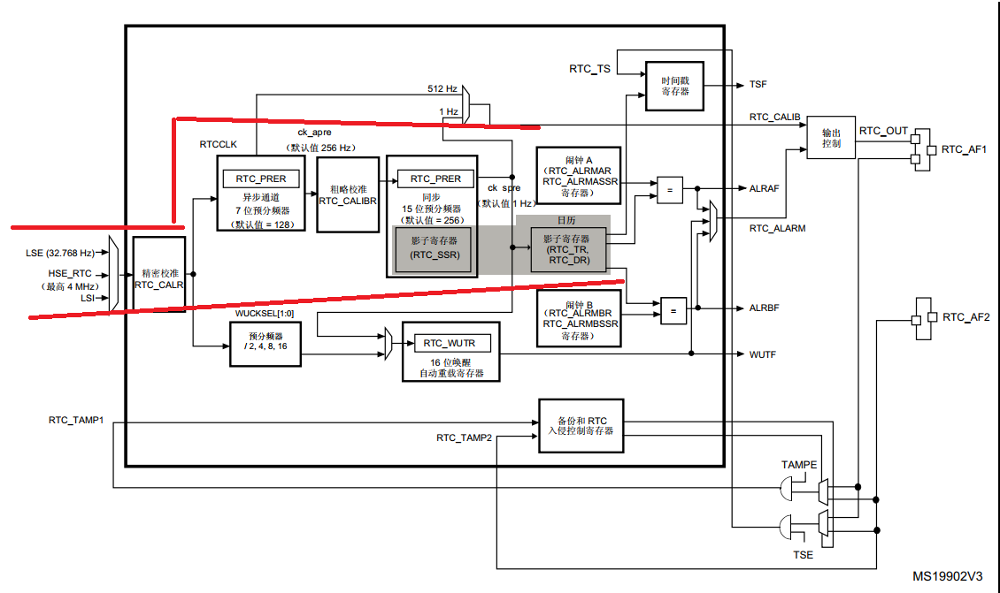
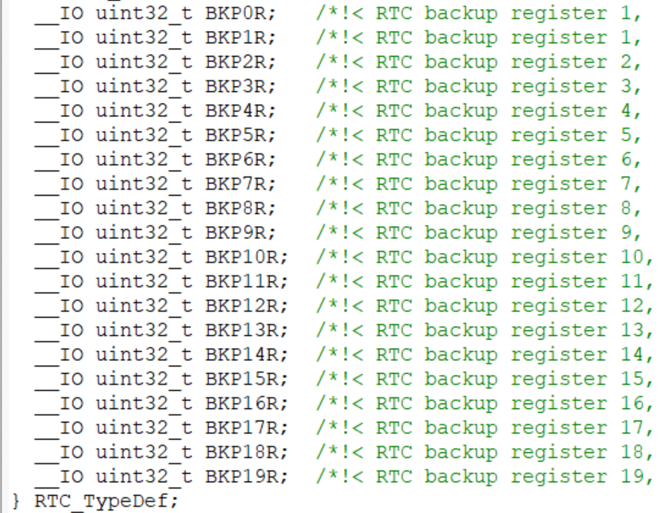

# 32单片机学习记录17之RTC

## 前置

### **STM32F407,RTC是什么？有什么作用？产生背景？**

#### **STM32F407的RTC是什么？**

RTC（Real-Time Clock，实时时钟）是STM32F407芯片中的一个硬件外设模块，用于提供精确的日期和时间信息。它允许系统在上电、断电或低功耗模式下保持时间的连续性。

在STM32F407中，RTC模块可以保持时间（时、分、秒）、日期（年、月、日）、星期等信息，并支持闹钟和时间戳功能。

------

####  **RTC的作用**

RTC的主要作用包括以下几个方面：

1. **时间保持**
   - 即使系统断电（通过外部备用电池VBAT供电）或进入低功耗模式，RTC仍能保持时间信息。
2. **日期与时间管理**
   - 提供年、月、日、时、分、秒等信息，方便系统记录时间。
3. **低功耗运行**
   - RTC可以独立运行于低功耗模式下，例如Standby或Backup模式，适合需要长时间待机的设备。
4. **闹钟功能**
   - RTC支持闹钟功能，可以在指定的时间点唤醒系统。
5. **时间戳**
   - 记录特定事件发生的时间，如数据采集、通信事件等。
6. **日历功能**
   - 支持闰年计算和周信息，适合日历应用。

------

#### **RTC的产生背景**

RTC模块的产生背景主要与嵌入式系统的发展需求有关：

1. **可靠的时间保持需求**
   - 随着嵌入式设备广泛应用于消费电子、工业控制和物联网等领域，许多应用需要准确的时间信息（如计费系统、数据记录等）。
2. **低功耗设计**
   - 嵌入式设备往往需要长时间运行或断电时保持时间信息，这对RTC模块提出了低功耗和备用电池运行的需求。
3. **集成度提高**
   - 外部RTC芯片在早期嵌入式设计中很常见，但随着MCU的功能集成度提高，内置RTC模块不仅减少了外围元器件，还降低了成本和PCB设计复杂度。
4. **智能设备与物联网**
   - 智能设备和物联网系统的兴起，使得对时间同步、定时任务调度的需求显著增加，RTC成为这些应用的基础模块。

------

#### **STM32F407中RTC的特点**

- **备用电源支持**：RTC可以使用备用电池供电（VBAT引脚），即使主电源断开，RTC仍然运行。
- **硬件校准**：提供时钟源校准功能，支持外部32.768 kHz晶振或内部低速RC振荡器（LSI）。
- **低功耗支持**：RTC在低功耗模式下仍然能够运行，功耗非常低。
- **闹钟和定时器**：支持可编程闹钟和周期性唤醒功能。
- **时间戳功能**：记录指定事件发生的时间。
- **日历支持**：支持闰年计算和日期格式。

------

#### **实际应用场景**

1. **物联网设备**
   - 智能家居设备需要记录事件发生的时间（如智能门锁、智能摄像头）。
2. **工业自动化**
   - 在工业设备中记录关键事件的时间戳。
3. **消费电子**
   - 需要提供时间显示和定时功能的设备（如手表、智能音箱等）。
4. **医疗设备**
   - 记录患者数据采集的时间（如血糖仪、心率监控设备）。
5. **数据记录系统**
   - 数据采集设备通过RTC记录每次采集的时间，方便后续分析。


### **这一些功能不是都可以通过软件实现吗？能说一说两者的优劣吗？**

很多RTC功能理论上可以通过软件模拟来实现（即“软件RTC”），但硬件RTC和软件实现之间各有优劣，取决于具体应用场景。以下是两者的对比分析：

#### **软件RTC**

软件RTC是通过计时器（Timer）或主处理器的定时中断，加上软件逻辑来模拟时间计数的方式。

**优点**

1. **灵活性高**：
   - 可以根据需要完全自定义日期、时间以及各种计时逻辑。
   - 无需依赖芯片的RTC模块，适合不带硬件RTC的微控制器。
2. **成本降低**：
   - 无需额外硬件资源（如外部晶振或RTC模块），只需利用已有的处理器资源。
3. **无外部晶振依赖**：
   - 只需主时钟，简化硬件设计（但可能会影响时间精度）。

**缺点**

1. **耗电量高**：
   - 软件RTC依赖主处理器或计时器运行，当系统进入低功耗模式时，主时钟可能停止，无法保持时间。
2. **易受系统影响**：
   - 软件RTC依赖系统运行，如果系统被重置、卡顿、或者中断冲突，时间可能会偏移甚至丢失。
3. **时间精度差**：
   - 软件RTC精度取决于系统主频或内部时钟源，这些时钟的稳定性通常不如专用的32.768kHz晶振。
4. **断电后丢失**：
   - 软件RTC依赖主处理器运行，断电后时间信息完全丢失，需要重新初始化。


#### **硬件RTC**

硬件RTC是芯片中专用的独立模块，通常配有独立时钟源（如32.768kHz晶振），并支持备用电池供电。

**优点**

1. **低功耗**：
   - RTC在独立运行时功耗极低，适合电池供电的低功耗设备。
   - 即使主系统进入待机或断电，RTC仍可通过备用电池继续运行。
2. **时间精度高**：
   - 硬件RTC通常使用高稳定性的外部32.768kHz晶振，时间误差小（每天几秒甚至更少）。
3. **断电保持时间**：
   - RTC模块支持通过VBAT引脚连接备用电池，即使系统断电，时间信息也不会丢失。
4. **独立运行**：
   - 不依赖主处理器，RTC可以在主系统断电或低功耗模式下独立运行。
5. **额外功能支持**：
   - 硬件RTC通常支持闹钟、中断、时间戳等功能，无需额外软件逻辑。

**缺点**

1. **硬件依赖**：
   - 硬件RTC需要依赖专用模块和外部晶振，如果晶振损坏，时间功能会失效。
2. **设计复杂度增加**：
   - 硬件RTC通常需要外部32.768kHz晶振以及备用电池供电，增加硬件设计和物料成本。
3. **调试复杂性**：
   - 硬件RTC初始化和校准涉及寄存器配置和调试，可能会增加开发时间。
4. **成本略高**：
   - 相比纯软件实现，硬件RTC会增加硬件成本（如晶振、PCB布线、备用电池）。

#### **两者的典型应用场景对比**

| **场景**                 | **软件RTC**                          | **硬件RTC**                            |
| ------------------------ | ------------------------------------ | -------------------------------------- |
| **简单计时应用**         | 可用，例如短时间计时任务。           | 不适用（硬件RTC可能过于复杂）。        |
| **长期时间保持**         | 不适合，断电或低功耗模式下时间丢失。 | 适合，支持断电保持时间。               |
| **精度要求高的应用**     | 不适合，软件依赖不稳定的主时钟。     | 适合，配备高精度晶振。                 |
| **低功耗设备（如手表）** | 不适合，主处理器持续运行耗电大。     | 适合，RTC功耗低，可长期运行。          |
| **断电或复位场景**       | 时间丢失，需要重新初始化。           | 时间保持，适合需要持续时间记录的应用。 |
| **成本敏感的设备**       | 适合，完全省去硬件模块。             | 不适合，增加设计成本。                 |

------

#### 总结

- **软件RTC适合的场景**：
  - 时间要求不高且断电不会影响系统功能的应用，例如简单的倒计时器或运行时长统计。
  - 对成本敏感或硬件资源受限的设备。
- **硬件RTC适合的场景**：
  - 长时间断电后需要保持时间的设备，例如智能家居设备、物联网传感器。
  - 对时间精度要求较高的系统，例如数据记录器、工业自动化设备。
  - 电池供电的低功耗设备，例如智能手表、医疗设备。

硬件RTC虽然增加了成本，但在许多场景中提供了可靠性和低功耗优势，是不可替代的选择。

### 一般应用

**一般电子设备应用应该是先利用网络更新当前时间并更新到RTC中？**

在大多数现代电子设备中，通常会采用以下策略：**设备先通过网络获取当前的精确时间（例如通过NTP协议），然后将时间同步到硬件RTC中以维持时间的准确性和连续性**。这一流程的原因和优势如下：

------

#### **1. 为什么先通过网络更新当前时间？**

1. **初始时间来源**
   - 硬件RTC在断电时依赖备用电池保持时间，但可能存在时间漂移或完全丢失的情况。
   - 设备上电后，如果没有网络时间同步，RTC时间可能不准确。
2. **高精度时间同步**
   - 网络时间（例如通过NTP服务器）通常基于原子钟标准，精度可以达到毫秒级甚至更高。
   - RTC虽然依赖高稳定性的32.768kHz晶振，但仍然会因长期使用而产生微小误差。
3. **简化用户操作**
   - 不需要用户手动设置设备时间。通过网络自动获取时间不仅提高用户体验，还避免了人为设置的误差。
4. **全球时间适配**
   - 网络同步时间通常以UTC表示，设备可以根据地理位置调整时区，支持全球范围内的应用。

------

#### **2. 为什么要更新到RTC中？**

1. **断网后保持时间**
   - 当设备离线或网络连接中断时，RTC可以继续保持时间，避免依赖网络的时间功能失效。
2. **低功耗模式下维持时间**
   - 当主系统进入低功耗模式或关机时，RTC模块仍可运行，保证时间的连续性。
3. **减少频繁网络同步**
   - 通过RTC，设备无需频繁联网获取时间，仅在必要时进行校准，从而降低功耗和带宽使用。

#### 3.**典型的时间同步流程**

以下是一个常见的时间同步工作流程：

1. **设备上电或复位**
   - 从RTC中读取时间作为初始时间。
2. **网络时间同步**
   - 如果设备能够联网，则向时间服务器（如NTP服务器）请求当前时间。
3. **时间校准**
   - 比较RTC时间与网络时间，计算偏差并校正RTC。
4. **定期校准**
   - 在设备运行期间，定期与时间服务器同步，以修正RTC的长期漂移问题。
5. **断网时使用RTC时间**
   - 当网络不可用时，设备依赖RTC保持时间。

#### **4. 具体应用场景分析**

| **场景**               | **网络时间同步（NTP）**                        | **RTC同步作用**                              |
| ---------------------- | ---------------------------------------------- | -------------------------------------------- |
| **智能家居设备**       | 初次上电通过网络获取时间并校准。               | 用于断网时保持时间，确保闹钟或定时任务运行。 |
| **物联网传感器**       | 定期通过网络同步，确保时间精度。               | 在传感器离线时继续时间记录。                 |
| **智能手表/医疗设备**  | 上电或连接网络时校准时间。                     | 保证长时间运行期间时间连续性。               |
| **工业控制设备**       | 网络时间源作为全系统时间基准（同步多个设备）。 | 单个设备在断网或停机期间独立维持时间。       |
| **移动设备（手机等）** | 向网络运营商或NTP服务器获取时间。              | 硬件RTC在设备关机时保持时间。                |

------

#### **5. 为什么不是直接依赖网络而忽略RTC？**

完全依赖网络的时间管理在某些场景中会产生问题：

1. **离线问题**
   - 如果设备无法联网，依赖网络的时间功能将完全失效。
2. **功耗问题**
   - 频繁通过网络获取时间会增加设备的功耗（特别是在物联网设备中）。
3. **启动时间延迟**
   - 上电后等待网络时间同步可能导致系统无法立即启动与时间相关的功能。
4. **时间连续性**
   - RTC可以在断网期间保持时间的连续性，而网络时间同步无法提供这一功能。

------

#### **6. 实现细节**

在嵌入式系统中，RTC和网络时间同步的结合通常采用以下步骤：

1. **初始化RTC**：
   - 上电后从RTC读取时间，并设置为系统时间（即软件时间基准）。
2. **同步网络时间到RTC**：
   - 使用NTP协议获取当前时间。
   - 将获取的时间写入RTC模块。
3. **设置定时校准**：
   - **定期通过网络重新同步时间（例如每天同步一次），以修正RTC的累计误差。**
4. **断网模式下使用RTC**：
   - 在无法联网的情况下，系统依赖RTC提供时间信息。
5. **低功耗模式支持**：
   - 设备进入低功耗模式时，RTC独立运行；唤醒后读取RTC时间并恢复系统时间。

------

#### **7. 总结**

- **网络时间同步和RTC结合使用是一种最佳实践**：
  - 网络提供高精度时间源，RTC保证离线或低功耗模式下的时间连续性。
- **典型优点**：
  - 提高时间的可靠性和精度。
  - 兼顾联网和断网场景的需求。
  - 减少功耗，延长电池寿命。

这种方式在智能家居、物联网设备、工业控制、移动设备等领域被广泛采用，既能满足用户体验需求，也能优化资源利用。

## RTC介绍

- RTC：
  - 年月日时分秒，自动计算闰年，能区分每个月的天数

- 分类：

  - 外接的实时时钟芯片和内部集成

  - 常见的实时时钟芯片

  - DS1307 DS1302 PCF8563  （IIC）

## RTC控制器框图

### 整体框图



- 标准实时时钟部分

- 闹钟部分

- 唤醒部分(周期性唤醒)

- 入侵与备份部分（备份域）

- 输出控制部分

- 时间戳部分部分

### 标准实时时钟部分

**时钟源：**

- 时钟源分类:

  - LSE(32.768KHZ):外部低速时钟 
    - //通常使用  外部低速时钟可以让RTC独立运行    

  - HSE(最高4MHZ) :外部高速时钟

  - LSI :内部低速时钟  //看门狗的时钟  不稳定不用

- 如何选择时钟源:

  - 选择外部低速时钟(备份时钟)就找到备份域控制寄存器相应的位就可以BDCR

    1. 使能外部低速振荡器    0位
    2. 等待外部低速振荡器就绪  1位

    3. 选择外部低速时钟     8:9位

    4. 使能RTC时钟       15位

- 思考:
  - 如果选用的是内部低速时钟,怎么做?
  - **也需要等待，看门狗时使用内部时钟也等待了。**

- 精密校正：
  - 不做高精度需求是不需要此寄存器	

- 7位预分频器：
  - 默认 128分频   //256HZ

- 粗略校正：
  - 不需要

- 同步15位分频
  - 默认256分频  //1HZ   1次/s

- 日历寄存器

  - 设置日期时间

  - 获取日期时间

## RTC寄存器配置

### RTC初始化配置

PWR控制器需要外设时钟使能，修改RCC_BDCR寄存器需要解除写保护。

系统复位后，可通过 PWR 电源控制寄存器 (PWR_CR) 的 DBP 位保护 RTC 寄存器以防止非正常的写访问。必须将 DBP 位置 1 才能使能 RTC 寄存器的写访问。上电复位后，所有 RTC 寄存器均受到写保护。通过向写保护寄存器 (RTC_WPR) 写入一个密钥来使能对 RTC 寄存器的写操作。要解锁所有 RTC 寄存器（RTC_ISR[13:8]、 RTC_TAFCR 和 RTC_BKPxR 除外）的写保护，需要执行以下步骤：

1. 将“0xCA”写入 RTC_WPR 寄存器。

2. 将“0x53”写入 RTC_WPR 寄存器。

写入一个错误的关键字会再次激活写保护。保护机制不受系统复位影响。


### 设置日历寄存器要求

要编程包括时间格式和预分频器配置在内的初始时间和日期日历值，需按照以下顺序操作：

​		1. 将 RTC_ISR 寄存器中的 INIT 位置 1 以进入初始化模式。在此模式下，日历计数器将停

​		止工作并且其值可更新。

​		2、轮询查INITF 判断是否日历真的进入初始化模式  日历是否停止运行

​		3、设置时间和日期

​		4、退出初始化模式

### 初始化

```c
//rtc初始化
void rtc_init(){
	//使能PWR外设时钟
    RCC->APB1ENR |= (1U<<28);
	//RCC_BDCR 寄存器、 RTC 寄存器（包括备份寄存器）以及 PWR_CSR 寄存器的 BRE 位均受到写访问保护
	//因为要修改RCC->BDCR的值，必须要在前面！
		PWR->CR |= (1U<<8);

	//选择rtc时钟来源-备份域控制寄存器 (RCC_BDCR)
		//开启外部低速时钟LSE
		RCC->BDCR |= (1U<<0);
		//等待时钟就绪
		while(!(RCC->BDCR & (1U<<1)));
		//选择RTC时钟源:外部低速时钟
		RCC->BDCR &= ~(3U<<8);
		RCC->BDCR |= (1U<<8);
		//使能RTC
		RCC->BDCR |= (1U<<15);
	
	//解除TRC控制器的写保护
	//PWR->CR |= (1U<<8);
	//解除寄存器的写保护
		RTC->WPR = 0xCA;
		RTC->WPR = 0x53;
	
	//日历初始化设置日期和时间(初始化带的)
		//开启初始化模式
		RTC->ISR |= (1U<<7);
		//等待初始化完成
		while(!(RTC->ISR & (1U<<6)));
		//系统计算时间格式为24小时制
		RTC->CR &= ~(1U<<6);
		//激活影子寄存器
		RTC->CR &= ~(1U<<5);
		//预分频配置默认就是128，同步分频默认就是256。1HZ
		//设置时间 因为 "|=" 多余的也不会改变原值,会改变，用了赋值符号
		//使用备份域寄存器的特性作为标志，只要不是全部掉电，就只初始化一次时间即可
		//其他部件功能还是需要初始化
		if(RTC->BKP0R!=800){
			//写入的时间格式是24小时制
			RTC->TR &= ~(1U<<22);
			// 设置时间
			RTC->TR = (0x14 << 16) | (0x13 << 8) | (0x13 << 0); // 小时:13, 分:13, 秒:13
			// 设置日期
			RTC->DR = (0x12 << 16) | (0x7 << 13) | (0x12 << 8) | (0x12 << 0); // 年:12, 星期:7, 月:12, 日:12
			//全部掉电后重新上电是0x0000 0000
			RTC->BKP0R = 800;
		}

		//退出初始化模式
		RTC->ISR &= ~(1U<<7);
		while (RTC->ISR & (1U << 6)); // 确保INITF清零
	
	//激活寄存器的写保护
	RTC->WPR = 0xFF;
}
```

### 读取日历时间和日期

要想读时间和日期,要等待时间和日期同步（加载到影子寄存器）,、

如何等待时间和日期同步到影子寄存器

ISR寄存器中RSF位要先清零,然后等待置1,读时间或者日期值

```c
获取时间和日期
{
	清零同步标志位；
	等待同步标志位置1；
	读取时间寄存器
	
	清零同步标志位；
	等待同步标志位置1；
	读取日期寄存器；	
}

//读取日历
RTC_T rtc_get(void){
	//组合数据的临时变量
	u32 temp_d = 0;
	u32 temp_t = 0;
	RTC_T data = {0};
	
	//软件必须分两次读取日历时间寄存器和日期寄存器
	//为了确保是最新的时间需要先把标志位清零
	RTC->ISR &= ~(1U<<5);
	//等待数据加载到影子寄存器
	while(!(RTC->ISR & (1U<<5)));
	//读取日期
	temp_d = RTC->DR;
	//手动清零再等待一次
	RTC->ISR &= ~(1U<<5);
	while(!(RTC->ISR &= ~(1U<<5)));
	//读取时间
	temp_t = RTC->TR;
	
	//拆分数据开始赋值结构体
	data.years = in_bcd_out_dec((temp_d >> 16) & 0xff) + 2000;
	data.week = in_bcd_out_dec((temp_d >> 13) & 0x7);
	data.mon = in_bcd_out_dec((temp_d >> 8) & 0x1f);
	data.date = in_bcd_out_dec((temp_d >> 0) & 0x3f);
	
	data.h = in_bcd_out_dec((temp_t >> 16) & 0x3f);
	data.m = in_bcd_out_dec((temp_t >> 8) & 0x7f);
	data.s = in_bcd_out_dec((temp_t >> 0) & 0x7f);
	
	return data;
}
```

### BCD码

什么是BCD码

- 19------0x19

- 0x19----19

如何将用户的时间(十进制)设置到寄存器中

- 设置时间:把用户设置的十进制时间,转换成相应的BCD码,写入到寄存器中

如何将寄存器的时间(BCD)给用户（十进制）

- 获取时间:把寄存器中的BCD码,转换成十进制形式,给到用户

```c
//数据分离思想
//两位数十进制转BCD码
u8 in_dec_out_bcd(u8 dec){
	return ((dec/10)<<4) | (dec%10); 
}


//BCD码转两位十进制数
u8 in_bcd_out_dec(u8 bcd){
	return (bcd >> 4)*10 + (bcd & 0x0f);
}
```

## RTC程序设计

### RTC初始化配置程序

```
初始化配置程序
{
/*解除RTC和相关寄存器保护*/
	使能电源控制器时钟
	PWR->CR 的DBP位写1解除RTC控制器控制 
            
/*RTC时钟源设置*/
	//RCC->BDR
	使能外部震荡器
	等待外部振荡器就绪
	选择外部低速时钟源
	使能RTC时钟

秘钥寄存器写入值,解除RTC相关寄存器保护

/*RTC相关寄存器*/
	CR
	激活寄存器写保护
/*设置初始时间*/
	调用设置时间函数
}


设置日期和时间函数(要设置的日期和时间)
{
    解除寄存器保护
    让日历进入初始化模式
    等待真的进入了初始化模式
    将设置的十进制数据转换成BCD码
    设置TR 和 DR
    退出初始化模式
    激活写保护
}


返回日历结构体 获取日期和时间函数
{
    解除寄存器保护
    ISR寄存器中RSF位0
    等待同步完成(等待ISR寄存器中RSF位自动变为1)
    读出时间寄存器的值(BCD码)
    将读出的BCD码转换成十进制形式
    ISR寄存器中RSF位0
    等待同步完成(等待ISR寄存器中RSF位自动变为1)
    读出日期寄存器的值(BCD码)
    将读出的BCD码转换成十进制形式

	激活写保护
}
```

## 备份域寄存器和备份电源(外部低速晶振)

**备份域寄存器**

- **复位数据不丢失，但是掉电会丢失。复位不会掉电**

- **其他寄存器是复位和掉电都会丢失。**


情况1:

- 无备份电源, **无备份寄存器**:

​		**初始时间 12:00**  

​		运行  5分钟（12:05）  关机（**掉电**）   

​		10分钟后开机

​		**开机后时间是:12:00**

情况2:

- 有备份电源,无备份寄存器（**主控电源优先级高于备份电源**）

​		初始时间 12:00  运行  5分钟(12:05) 关机  

​		10分钟后开机:  （12:15）

​		**开机之前的那一刻,RTC实际时间是:（12:15）**

​		开机后时间是:12:00，**一开机会重新走初始化。**

- 没备份电源,有备份寄存器（**备份寄存器也没有电，还是丢失**）

​		初始时间 12:00  运行  5分钟(12:05) 关机(断电)  

​		开机后时间是: 12:00 

- 没备份电源,有备份寄存器

​		初始时间 12:00  运行  5分钟(12:05) 

​		复位程序（**没有掉电，备份寄存器有效**） 

​		开机后时间是: 12:05

- 有备份电源,有备份寄存器（**无论主控是否掉电，备份寄存器始终都有电，始终有效**）

​		初始时间 12:00  运行  5分钟(12:05) 关机  

​		10分钟后开机:  （12:15）

​		开机之前的那一刻,RTC实际时间是:（12:15）

​		开机后时间是:（12:15）

- ```c
  		//使用备份域寄存器的特性作为标志，只要不是全部掉电，就只初始化一次时间即可
  		//其他部件功能还是需要初始化
  		if(RTC->BKP0R!=800){
  			// 设置时间
  			RTC->TR = (0x12 << 16) | (0x12 << 8) | (0x12 << 0); // 小时:12, 分:12, 秒:12
  			// 设置日期
  			RTC->DR = (0x12 << 16) | (0x7 << 13) | (0x12 << 8) | (0x12 << 0); // 年:12, 星期:7, 				月:12, 日:12
  			//全部掉电后重新上电是0x0000 0000
  			RTC->BKP0R = 800;
  		}
  ```

  - **不需要掉电前备份，上电再拿出来再顶替原来的值。**
  - **只要RTC在跑，再次主控上电不去初始化或者设置RTC的时间即可。上电后再获取时间也是实际经过的时间。**

- **补充:**

​		**没有备份电源,有备份寄存器**

​		**只能做到复位后,时间继续走,**

​		**断电后重新上电后时间会重置**

- 总结:

​		备份电源作用是:

​			**芯片断电可以让RTC继续工作,同时备份寄存器不复位**

​		备份寄存器的作用:

​			**防止芯片重新启动,MCU重置初始时间**



**有备份域寄存器还有备份电源的情况下，可以当AT24C02使用。**

理论上，STM32F407的RTC备份域寄存器在某些应用场景下可以替代EEPROM（如AT24C02）的功能，但需要根据具体需求和硬件条件仔细评估。以下是一些关键点和对比：

**备份域寄存器的功能**

- **数据存储**：STM32F407的RTC备份域寄存器（BKP寄存器）可用于存储掉电后仍然需要保存的小量数据（总共20个32位寄存器，约80字节）。
- **断电保护**：只要备份电源（VBAT）供电正常，寄存器中的数据可以长时间保存。
- **写入次数限制**：BKP寄存器本质上是SRAM，没有像EEPROM那样的擦写寿命限制（EEPROM通常限制在百万次左右）。

**与AT24C02对比**

| 特性               | RTC备份域寄存器            | AT24C02                       |
| ------------------ | -------------------------- | ----------------------------- |
| 存储容量           | 80字节（20 × 32位）        | 256字节                       |
| 数据保存           | 需要备份电源（VBAT）       | 不需要外部电源（Flash持久性） |
| 接口               | 内部寄存器（无需额外接口） | I²C接口                       |
| 擦写寿命           | 理论无限制（SRAM）         | 一般100万次擦写               |
| 断电情况下的可靠性 | 依赖外部VBAT电池           | 数据持久保存，无需额外供电    |
| 功耗               | 极低功耗（备份模式下μA级） | 极低功耗                      |

------

**使用备份域寄存器替代AT24C02的条件**

1. **数据量小**：备份域寄存器存储容量有限，仅80字节。如果需要存储的数据不超过这一限制，可以使用。
2. **备份电源可用**：如果设备已经设计了RTC电池（如纽扣电池或超级电容）供电，备份域寄存器中的数据可以在断电情况下保存。
3. **无需持久性非易失存储**：如果应用场景下数据并非长时间断电后仍需保存（如配置参数、状态信息），备份域寄存器是合适的选择。
4. **快速读写需求**：BKP寄存器的读写速度远高于EEPROM，非常适合频繁读写。

**何时不适合替代**

1. **数据量较大**：如果需要存储超过80字节的数据，备份域寄存器容量不够。
2. **无备份电源设计**：断电后无备份电源，数据无法保留。
3. **需要长期非易失存储**：如果需要在断电且无备份电源的情况下保存数据，EEPROM是更合适的选择。


**有二十个备份域寄存器的话，我可以软件实现类似页写功能？**

​	**其实不太行，因为会有数据对齐，很难管理边界问题,比如结构体**

确实，您提到的**数据对齐问题**是一个核心挑战。RTC 备份域寄存器是 32 位（4 字节）对齐，而 AT24C02 的数据按字节操作。在软件模拟页写时，寄存器的 32 位对齐导致操作不如字节级存储那样灵活，这在以下情况下尤为明显：

1. **非整字节数据存取**：比如需要写入跨寄存器边界的部分字节数据。
2. **数据映射复杂**：每个备份域寄存器需要软件逻辑解析字节偏移，对代码复杂性有较大影响。

因此，如果直接模拟页写功能，会遇到很多管理问题。针对这些限制，有以下改进和解决方案。

**虽然可以通过软件模拟备份域的页写功能，但由于 32 位对齐问题，管理较为复杂，特别是在跨寄存器操作时。如果需要更灵活的字节级操作或更大的存储容量，建议直接使用外部 EEPROM 或内部 Flash 模拟，而不是强行使用 RTC 的备份域寄存器。这样可以更好地平衡开发复杂度和系统稳定性。**


