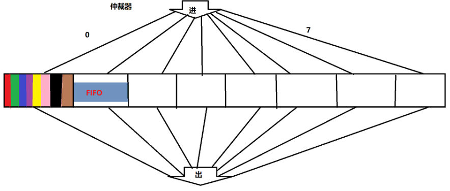
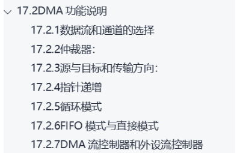

# 32单片机学习记录18之DMA

## 前置

### **STM32F407,DMA是什么？有什么作用？产生背景？**

DMA（Direct Memory Access，直接存储器访问）是一种计算机系统中的硬件模块，用于在不经过处理器（CPU）的情况下，直接在**存储器与外设之间或存储器与存储器之间传输数据。**

在STM32F407微控制器中，DMA是一种非常重要的功能模块，它能够显著提高数据传输效率，同时减少CPU的负担，使其专注于其他任务。

#### **DMA的作用**

1. **提高数据传输效率**
   DMA能够**在外设（如ADC、UART、SPI等）和存储器之间直接传输数据**，无需CPU干预，从而避免了因CPU轮询或中断处理导致的延迟问题。
   1. **比如串口发送时，是需要等待的，等待上一次字节发送完。数据量一大CPU就会等待明显。**

2. **降低CPU负载**
   CPU不需要逐字节地处理数据传输，可以将更多的资源用于计算和逻辑控制。
3. **支持高速外设**
   在高速数据传输场景（如音频、视频处理）中，DMA可以以较高的速率传输数据，而不会影响系统的实时性。
4. **灵活的数据管理**
   DMA支持多种传输模式（如单次传输、循环传输、突发传输等），并且支持多种源地址和目标地址递增/固定的配置，能够适应多种应用需求。
   1. **存储器到存储器的递增模式**
   2. **存储器的递增模式，片上外设（串口的DR寄存器）的固定模式**

5. **节省能耗**
   DMA可以在后台运行，同时CPU进入低功耗模式，从而节省系统能耗。

#### DMA的产生背景

在早期的微控制器或计算机系统中，数据传输通常由CPU通过中断或轮询方式完成。然而，这种方式存在以下问题：

- **效率低**：CPU需要逐字节处理数据传输，尤其在大批量数据传输时效率低下。
- **响应延迟**：当数据传输速率较高时，CPU可能无法及时响应，导致数据丢失。
- **CPU资源浪费**：传输数据的任务会占用CPU的大量资源，影响系统的实时性。

为了解决这些问题，DMA技术应运而生。**DMA控制器作为一个独立的硬件模块，可以直接与存储器和外设通信**，从而大幅提高数据传输效率，并减少对CPU的依赖。

#### STM32F407的DMA特性

1. **独立的DMA控制器**
   STM32F407配备了两个DMA控制器（DMA1和DMA2），每个控制器支持多个数据流（stream）和通道（channel）。
   1. **有固定片上外设连接了各通道线路，可以选择某一个数据流来传输数据，但是一个数据流同一时刻只能连接一个通道，不然一个数据流上同一时刻出现两个通道（两个外设的数据）就会数据错乱。**

2. **支持多种外设**
   DMA可以与ADC、DAC、SPI、I2C、UART、SDIO、TIM等外设协同工作。
   1. **多个数据流连接不同外设通道并发工作**

3. **多种数据传输模式**
   - 存储器到存储器（Memory-to-Memory）
   - 外设到存储器（Peripheral-to-Memory）
   - 存储器到外设（Memory-to-Peripheral）
4. **传输方向和地址递增控制**
   用户可以配置数据传输方向以及是否递增源地址或目标地址。
5. **中断支持**
   支持传输完成中断、传输错误中断等，方便用户处理传输事件。
6. **FIFO缓冲区**
   DMA控制器带有FIFO缓冲区，用于优化传输效率。

------

#### 典型应用场景

1. **ADC采集数据**
   ADC可以将采集的模拟信号转换为数字信号，并通过DMA传输到存储器。
2. **UART高速通信**
   使用DMA传输UART数据，能够减少CPU处理负担，实现高速数据接收与发送。
3. **音视频处理**
   在音频或视频流数据传输中，DMA的高速特性能够满足实时处理的需求。
4. **数据存储**
   在存储器之间传输大块数据时，DMA可以显著提高效率。


### 疑问2

**该归类为什么呢？一种通信方式？就像串口？IIC? SPI? 还是一种传输方式？ 这种传输方式分为CPU参与和CPU不参与。 串口，IIC，SPI通信都可以利用这一种传输方式？**

DMA（Direct Memory Access）**不是一种通信方式**，而是一种**数据传输方式**。具体来说，它是一种**无需CPU参与的高速数据传输机制**。它与串口、I2C、SPI等通信方式密切相关，但作用和分类有所不同。

#### 分类说明

**通信方式 vs 传输方式**

- **通信方式**：
  指的是设备之间的**通信协议**和物理层接口，比如串口、I2C、SPI、CAN等。这些方式**定义了数据如何从一个设备传递到另一个设备。**
- **传输方式**：
  指的是数据在系统内部如何流动，比如数据从外设传输到存储器、从存储器传输到外设，或者存储器之间的直接传输。DMA属于这种类型。

**DMA与CPU传输方式的关系**

- **CPU参与传输**：
  在传统传输方式中，数据由CPU通过中断或轮询从一个模块（如串口）读取到存储器，或者写入到外设。这种方式CPU需要实时介入，效率低下。
- **DMA传输**：
  DMA能够代替CPU完成数据传输工作，CPU只需配置DMA并处理数据传输完成后的结果。传输时，DMA直接控制数据流动。

------

#### DMA与通信方式的结合

串口（UART）、I2C、SPI等通信方式都可以与DMA配合使用，形成高效的数据传输机制。

**实质在于片上外设到存储器之间的数据传输是通过CPU参与还是DMA接管方式。**

**串口 + DMA**

- 场景：高速串口通信（例如接收大批量数据时）。
- 实现：DMA从串口硬件寄存器直接将数据传输到存储器，CPU仅需处理DMA传输完成后的数据。

**I2C + DMA**

- 场景：数据传感器读取（如大容量EEPROM或IMU）。
- 实现：DMA自动将I2C接收到的数据写入存储器，而无需CPU干预。

**SPI + DMA**

- 场景：高速数据流传输（如显示屏、SD卡读取）。
- 实现：DMA直接将SPI外设的数据传递到存储器或从存储器发送到SPI外设，适合大批量数据传输。

**ADC/DAC + DMA**

- 场景：实时数据采集（如音频处理、传感器信号采样）。
- 实现：DMA将ADC采样的数据直接写入存储器，从而实现高效数据采集。

------

#### 总结

DMA是一种**高效的数据传输方式**，并不属于通信方式。它可以与各种通信方式（如串口、I2C、SPI）结合，**替代CPU完成数据传输任务，从而提高系统性能。**

其特点在于：

1. **与通信方式无关**：DMA本身只负责数据流动，不关心数据是通过什么通信方式传输的。
2. **高效传输**：DMA在数据传输中无需CPU介入，适合需要处理大量数据的场景。
3. **灵活适配**：适用于存储器与外设之间、外设与外设之间以及存储器之间的多种传输需求。

因此，DMA是一个通用的**系统加速模块**，而通信方式（如串口、I2C、SPI）是与外设交互的**数据协议和接口**。

- **通信方式**（串口、I2C、SPI）：
  就像选择出行工具（比如公交车、火车、飞机），**不同工具有不同的规则和用途**——串口像公交车，每站点发送数据，速度适中；SPI像高铁，速度快但需要双方严格同步；I2C像共享单车，简单但适合短距离、小数据量的传输。
- **传输方式**（CPU参与传输 vs DMA传输）：
  **就像选择具体怎么走这段路——自己开车（CPU参与）还是让专职司机（DMA）来开。**
  - **CPU参与传输**：自己开车，既要操控方向盘，又要留意路况，忙不过来。
  - **DMA传输**：雇一个专业司机（DMA）替你开车，你可以在路上做其他事情（CPU处理其他任务）。

最终，通信方式和传输方式可以结合起来：

- 选择出行工具（通信方式）决定大方向。
- 选择怎么走（传输方式）决定具体的执行效率。

比如：

1. **I2C + DMA**：用共享单车作为工具（I2C通信），但有专人帮你推着走（DMA传输），你不费力。
2. **SPI + CPU传输**：像自己开一辆高铁，虽然快，但操控难度很大，容易分神。
3. **串口 + DMA**：像坐公交车，有专职司机帮你处理所有行驶问题，你只需到站下车就好。

### DMA与计算机组成原理（以下仅供了解）

DMA（Direct Memory Access）确实是计算机组成原理和操作系统中非常重要的一个概念。它在计算机系统中早已被广泛应用，是提升数据传输效率的关键机制之一。以下是DMA在这两个领域中的一些关联和应用背景：

#### **在计算机组成原理中的DMA**

在计算机组成原理中，DMA是作为一种特殊的**I/O方式**被介绍的，它与传统的**程序控制I/O**和**中断驱动I/O**形成对比。

**DMA的作用**

- **直接控制内存访问**：DMA允许外设直接与存储器交互，而无需通过CPU逐字节地转移数据。
- **释放CPU资源**：CPU只需初始化DMA控制器，然后DMA控制器完成数据传输工作。传输完成后，DMA会通过中断通知CPU处理结果。
- **应用场景**：例如磁盘数据读取、网络数据包传输等大批量数据处理场景。

**计算机组成中的DMA结构**

- **DMA控制器**：负责管理传输任务，包括源地址、目标地址、传输长度等。
- 总线仲裁：DMA需要通过总线访问存储器，因此需要与CPU协作。一般有两种模式：
  - **抢占模式**：DMA暂时“抢占”CPU对总线的控制权。
  - **轮询模式**：DMA与CPU按一定优先级轮流使用总线。

------

#### **在操作系统中的DMA**

操作系统关注的是系统资源的调度与管理，其中I/O管理是重要部分，而DMA在**I/O管理**中起着核心作用。

DMA与操作系统的关系

- **加速I/O操作**：DMA大幅提高了外设与存储器之间的数据传输速度，减少了CPU的介入时间，使操作系统能够更高效地处理多任务。
- I/O设备驱动程序：操作系统中的设备驱动程序通常会调用DMA硬件模块，进行高速数据传输。例如：
  - 文件系统中的磁盘读写操作。
  - 网络协议栈中的数据包接收与发送。
- **减少上下文切换**：DMA让数据传输变成后台操作，操作系统在等待DMA完成时，可以切换到其他任务，而不需要频繁处理中断。

DMA的应用场景

- **存储设备**：从硬盘、SSD等存储设备读取数据到内存时，DMA可以减少CPU负载。
- **网络设备**：网卡通过DMA接收和发送数据包，提升网络吞吐量。
- **图形处理**：GPU与主内存之间的数据传输，也常通过DMA完成。

#### 可能记得的教材或例子

- DMA与中断驱动I/O的对比：
  - 中断驱动I/O需要CPU多次响应中断，每次传输少量数据。
    - **保护现场和回复上下文消耗**
  - DMA一次性完成大批量数据传输，只需一个完成中断。
- **DMA与I/O接口**：
  DMA控制器通常嵌入在I/O接口中，比如早期的磁盘控制器、现代的高速网络接口卡等。

示例场景：

- **磁盘数据传输**：读取一个文件时，DMA会将数据从磁盘直接传输到内存缓冲区，而不需要CPU逐块读取。
- **网络数据传输**：接收数据包时，DMA将网卡缓冲区的数据直接写入内存，CPU只需处理高层逻辑。

**现代嵌入式系统中的应用**

DMA从传统计算机系统中发展而来，现在嵌入式系统中也广泛使用，比如STM32、ESP32等微控制器。它的核心思想和原理并没有变化，只是被更好地集成到了嵌入式硬件中，成为提高效率的标准组件。

------

#### 总结

无论是在计算机组成原理还是操作系统中，DMA都以“释放CPU资源、提升数据传输效率”为目标。你在学习这些课程时接触到DMA是因为它的理念和实现机制是计算机系统中不可或缺的基础部分，也是工程应用中经久不衰的解决方案。

### 示例

当使用**I2C通信**时，如果不使用DMA，CPU需要参与每一个字节的传输和ACK响应，而如果引入DMA，CPU的参与程度会大大降低。让我们详细分析两种情况的工作机制及其差异。

------

#### 1. **不使用DMA的I2C通信**

在没有DMA的情况下，I2C通信的数据传输主要由CPU完成：

工作机制：

1. 数据发送或接收：
   - CPU通过轮询或中断方式读取或写入I2C数据寄存器（例如`I2C_DR`）。
   - 每发送一个字节，I2C总线从从设备收到ACK后，CPU才可以继续发送下一个字节。
2. 轮询等待或中断处理：
   - CPU需要轮询状态寄存器（如`I2C_SR1`）检查事件标志位（如发送完成、接收完成等）。
   - 或者等待中断发生，处理每个数据字节。

**存在的问题：**

- **效率低**：CPU需要逐字节参与传输，处理ACK响应或状态标志。
- **实时性差**：如果通信数据量较大，CPU可能被I2C任务占满，无法处理其他任务。
- **功耗较高**：CPU始终处于活跃状态，尤其是轮询时，会浪费大量计算资源。

------

#### 2. **使用DMA的I2C通信**

DMA的引入改变了整个数据传输模式，它可以在外设（I2C）和存储器之间直接传输数据，无需CPU干预每个字节的传输。

工作机制：

1. 数据发送或接收：
   - CPU只需一次性配置DMA控制器，指定：
     - 数据源地址（发送：内存，接收：I2C数据寄存器）。
     - 数据目标地址（发送：I2C数据寄存器，接收：内存）。
     - 数据长度。
   - **DMA负责逐字节完成数据传输，包括处理ACK信号。**
2. 自动化传输：
   - 每发送或接收一个字节时，DMA会自动更新地址指针和计数器，并控制I2C硬件。
   - CPU可以去处理其他任务，直到DMA完成整个数据传输。
3. 完成通知：
   - 数据传输完成后，DMA触发中断通知CPU，CPU仅需处理完成后的逻辑。

优势：

- **CPU负载显著降低**：CPU不需要干预每个字节的传输和ACK响应，只需处理初始配置和完成中断。
- **高效传输**：DMA在硬件层级管理数据流动，速度更快，适合大数据量传输。
- **降低功耗**：CPU可以进入低功耗模式，而DMA模块在后台完成传输任务。
- **支持多任务**：CPU释放出来的资源可以处理其他并行任务。

------

#### DMA如何避免CPU等待ACK？

当使用DMA时，**I2C硬件模块本身仍会处理ACK信号**，但这个过程完全透明化，不需要CPU干预：

1. I2C控制器通过总线自动发送/接收ACK信号。
2. DMA负责同步数据传输，不需要CPU介入状态检查。
3. ACK信号是否到达由I2C硬件自动判断，只有在出错（如超时或NACK响应）时才需要CPU干预。

因此，DMA有效避免了CPU处理每个字节的ACK等待。

------

#### 使用DMA的典型场景

1. **大数据量传输**：如从EEPROM读取一大段数据、传感器采集批量数据。
2. **高速通信需求**：需要高效传输数据而不能让CPU长期阻塞。
3. **低功耗场景**：需要在传输数据时让CPU处于睡眠模式。


### 疑问3

**如果使用软件模拟IIC与片上外设通信，还能用DMA吗？因为软件模拟CPU全程参与？**

**使用软件模拟（Soft I2C）通信时，无法直接使用DMA**，这是因为软件模拟I2C本质上完全依赖CPU的指令执行来生成通信时序，而DMA的核心设计是用于支持硬件外设（如硬件I2C、SPI、UART等）的自动数据传输。

#### **为什么软件模拟I2C无法直接使用DMA？**

软件模拟I2C的特点：

- **CPU全程参与**：通过软件控制GPIO引脚的电平变化（例如SCL和SDA的高低电平），模拟I2C通信协议所需的时序，包括起始信号、数据位传输、ACK响应、停止信号等。
- **无硬件支持**：所有的时序和协议处理完全由软件实现，GPIO仅仅作为普通引脚，不具有硬件通信功能。

DMA的工作方式：

- DMA是专门为

  硬件外设

  设计的，它直接访问存储器和硬件寄存器之间的数据流动。例如：

  - 将存储器中的数据加载到I2C硬件寄存器。
  - 从I2C硬件寄存器读取接收到的数据。

- 软件模拟I2C没有硬件寄存器，DMA无法直接操作GPIO引脚，也就无法实现自动化的传输。

结论：

软件模拟I2C时，时序生成与通信控制完全依赖CPU，因此无法直接使用DMA。

------

#### **CPU全程参与的代价**

- **高CPU负载**：每次通信都需要CPU逐步操作GPIO引脚，生成时序和处理ACK，传输效率低下。
- **实时性差**：CPU无法并行处理其他任务，尤其是大数据量传输时，会占用大量处理时间。
- **易受干扰**：如果有高优先级中断，可能打乱模拟I2C的时序，导致通信失败。

### DMA的设计核心

**DMA（Direct Memory Access）的核心设计目标就是减少CPU在硬件与硬件之间数据传输中的参与时间，从而实现数据传输的自动化和高效化**。这是DMA在计算机体系结构和嵌入式系统中被广泛使用的根本原因。

#### **DMA的核心设计理念**

（1）减少CPU参与

- 在传统数据传输中，CPU需要逐字节读取数据、处理数据、写入目标设备。例如：
  - 从UART读取数据到内存。
  - 从内存发送数据到SPI设备。
- DMA的设计目标是让CPU只负责**配置**和**管理**传输，而不直接参与实际的数据流动。

（2）实现传输自动化

- DMA硬件模块能够自主完成：
  - 数据源地址和目标地址的管理。
  - 数据长度的计数和更新。
  - 外设信号的握手（如ACK）。
- 一旦传输开始，DMA在整个过程中独立运行，直到传输完成后再通知CPU。

（3）支持并行处理

- CPU在配置DMA后，可以处理其他任务，而DMA在后台完成数据传输。
- 这种机制释放了CPU资源，使其能够更专注于核心计算任务或多任务调度。

------

#### **DMA的主要功能**

（1）硬件与存储器之间的数据传输

- 例如：从ADC采集的数据直接存储到RAM中，无需CPU干预。

（2）存储器与存储器之间的数据传输

- DMA可以在不同的内存区域之间搬运数据，避免CPU逐字节拷贝（如内存块初始化、大量数据拷贝操作）。

（3）硬件与硬件之间的数据传输

- 在某些高性能嵌入式系统中，DMA可以在外设之间直接传输数据，例如：
  - 从一个SPI设备直接传输数据到另一个SPI设备。

------

####  **DMA的设计优势**

（1）**提升传输效率**

- DMA可以利用硬件总线高效传输数据，而不需要通过CPU逐字节搬运。
- 数据传输速率更高，尤其是在处理大数据量时，优势显著。

（2）**降低CPU负载**

- CPU从繁琐的传输任务中解放出来，可以专注于处理更重要的逻辑任务或复杂计算。
- 系统响应速度更快，多任务处理能力更强。

（3）**减少功耗**

- 通过DMA传输时，CPU可以进入低功耗模式，特别适用于对功耗敏感的嵌入式系统。

（4）**提高实时性**

- DMA独立于CPU运行，数据传输的延迟更低，尤其在需要实时处理的场景中（如音视频处理、传感器数据采集）。

#### **DMA的局限性**

尽管DMA非常高效，但也有一定的限制：

- **硬件依赖**：需要硬件支持DMA控制器以及与外设的DMA兼容接口。
- **配置复杂**：DMA的初始化和配置相对复杂，需要明确设置数据源、目标、传输长度等。
- **实时性挑战**：在某些高负载系统中，DMA可能与CPU或其他外设争用总线资源，影响传输实时性。

#### **总结：DMA的本质**

- **核心目标**：减少CPU干预，实现硬件间数据传输的自动化和高效化。
- **方法**：通过硬件模块（DMA控制器）管理数据传输，CPU仅在开始和结束时介入。
- 结果：
  - 数据传输更加快速和高效。
  - CPU资源得到释放，提升系统整体性能。
  - 实现低功耗和高实时性。

因此，DMA不仅是一个“数据搬运工”，更是一个能够自动执行复杂传输任务的“硬件助手”。在现代嵌入式系统和计算机体系结构中，DMA已经成为不可或缺的组成部分！

### 疑问4

**为什么会说DMA和CPU会有总线的竞争关系？**

DMA和CPU之间可能会有**总线竞争关系**，是因为它们在系统中共享同一条**总线资源**（如**存储器总线、外设总线**等）。DMA通过总线访问存储器或外设，而CPU也需要使用同样的总线来执行指令、访问内存、与外设交互等操作。如果两者同时需要访问总线，就可能产生冲突，导致资源竞争。

当DMA开始传输数据时，它会占用总线的访问权。如果此时CPU也需要通过总线访问另一个硬件或存储器，就会出现**总线竞争**。这种竞争是因为总线是一种共享资源，在同一时间只能被一个主控设备（DMA、CPU或其他外设）使用。

#### **DMA和CPU的总线访问场景**

**DMA的工作方式：**

- DMA需要通过总线访问：
  - 数据源（如内存或外设寄存器）。
  - 数据目的地（如内存或外设寄存器）。
- **在DMA传输过程中，它会“锁定”总线，直到完成一次数据传输周期（如一次字或一次块的传输）。**

**CPU的工作方式：**

- CPU需要通过总线来：
  - 从内存读取指令和数据。
  - 将数据写入内存或访问外设（如操作GPIO、外设寄存器等）。
- CPU的指令执行需要频繁访问总线，因此总线的可用性对CPU的性能至关重要。

**竞争场景：**

- **DMA传输中**：DMA控制器可能连续占用总线，将数据从存储器传输到外设，或从外设读取数据到存储器。
- **CPU任务中**：如果CPU在执行程序时需要访问另一个硬件（例如控制一个外设），它也需要获得总线的访问权。
- 如果DMA和CPU同时请求访问总线，系统会出现**总线竞争**。

#### **总线竞争的结果**

**CPU的影响：**

- 如果DMA获得总线优先权，CPU的总线请求会被阻塞。
- 由于CPU无法访问总线：
  - 指令执行会暂停（可能卡在取指令或数据的阶段）。
  - 程序执行效率下降，尤其在需要频繁内存访问的任务中。

**DMA的影响：**

- 如果系统仲裁机制让CPU优先使用总线，则DMA的传输会被中断或延迟。
- 对于高带宽需求的外设（如ADC、DAC、SPI等），传输延迟可能导致数据丢失或性能下降。

------

**总线竞争的解决方案**

为了减少DMA和CPU之间的总线竞争，现代系统提供了多种解决方案：

**（1）总线仲裁机制**

- 总线仲裁器负责管理总线访问权，常见的策略包括：
  - **优先级控制**：为CPU和DMA设置不同优先级，确保高优先级任务优先获得总线。
  - **时间片轮转**：按照时间片轮流分配总线给CPU和DMA。

**（2）分时传输**

- 将DMA传输的请求分成小块，每次传输完成后释放总线给其他设备（如CPU）。
- 这样可以减少DMA对总线的长期占用，保证CPU有足够的时间访问总线。

**（3）带宽限制**

- 限制DMA通道的最大带宽，让CPU始终保留一定的总线带宽。
- 某些微控制器（如STM32）允许在DMA配置中设置带宽限制参数。

**（4）双总线架构**

- 一些系统设计了独立的总线：
  - **CPU总线**：供CPU访问内存和外设。
  - **DMA总线**：专供DMA传输使用。
- 双总线架构可以完全避免DMA和CPU的总线竞争。

**（5）使用缓存（Cache）**

- CPU可以通过缓存减少对总线的访问频率。
- 当缓存命中率高时，CPU的大部分操作无需频繁访问总线，从而减少与DMA的竞争。

**（6）外设FIFO缓冲区**

- 某些外设（如UART、SPI）提供内置FIFO缓冲区，可以暂存数据。
- DMA和CPU的总线访问可以错峰进行，减少竞争。

#### **总结**

DMA和CPU之间的总线竞争是因为两者都需要访问同一条共享总线。当DMA占用总线传输数据时，CPU需要等待；同样，如果CPU占用总线，DMA的传输会被延迟。解决这一问题的关键是通过仲裁机制、优化传输策略以及硬件架构设计，合理分配总线资源，保证系统的整体性能和实时性。

### 疑问4的补充

**所以无论是计算机系统还是嵌入式系统，使用DMA都会有与CPU竞争总线的问题对吗？只不过两者的作用范围不一样而已。 如嵌入式系统DMA仅限于片上资源，而计算机系统范围很大**

无论是**计算机系统**还是**嵌入式系统**，在使用DMA（直接内存访问）时，都会出现**与CPU竞争总线**的问题。主要的区别在于两者的**作用范围**不同：

#### **相同点：总线竞争**

- **总线竞争**：无论是在计算机系统还是嵌入式系统中，**DMA和CPU都需要访问共享的总线资源**，而这两个设备都是主设备。当DMA正在进行数据传输时，它可能会占用总线，使得CPU无法及时访问内存或外设，反之亦然。这会导致**延迟**或**性能下降**。
- **争用总线的情景**：
  - **DMA和CPU都想使用总线访问内存**。
  - **DMA和外设同时争用内存带宽**，尤其是在需要高速数据传输时，竞争尤为明显。

------

**不同点：作用范围和硬件架构**

**嵌入式系统**：

- 在 STM32F407 等嵌入式系统中，CPU 和 DMA 共享总线资源（如 AHB 总线），因此在高负载场景下，可能会发生总线争用。
- **总线争用的原因**

  - **硬件资源共享**：
    嵌入式系统中的 CPU 和 DMA 都是总线的主设备，它们通过 AHB 总线访问片上外设或存储器。当两者同时发起总线访问请求时，会引发总线争用。
  - **总线仲裁**：
    总线仲裁逻辑决定 CPU 和 DMA 谁先使用总线。DMA 通常拥有更高的优先级，因此在争用中可能会阻塞 CPU 的访问。
- **CPU 是否会被阻塞？**

  是的，当 CPU 和 DMA 同时请求访问共享的总线资源（如外设或存储器）时，CPU 的访问可能会被阻塞。具体情况如下：

  - **DMA执行外设传输**：
    当 DMA 正在传输数据（如从存储器到外设），如果 CPU 想访问与 DMA 共享的同一总线（例如挂载在 AHB 总线上的外设），CPU 的访问可能被延迟，直到 DMA 完成当前传输周期。
  - **影响范围**：
    这种阻塞仅限于共享总线资源的情况下。如果 DMA 和 CPU 分别访问不同的总线（例如 DMA 使用 AHB1，而 CPU 使用 AHB2），则不会产生争用。
- **总线争用的影响**

  - **延迟问题**：
    如果 DMA 数据传输负载较大（如大块数据传输），CPU 会因多次访问延迟而导致性能下降，可能表现为系统响应变慢。
  - **阻塞时间的长短**：
    DMA 的传输速率和优先级决定了 CPU 被阻塞的时间。小批量、间歇性 DMA 传输对 CPU 的影响较小，而持续的大负载 DMA 会导致明显的阻塞。

**计算机系统**：

- **作用范围较大**：
  - 在计算机系统中，DMA的作用范围更广，通常涉及**内存与外设、外设与外设之间的传输**。例如，通过DMA直接将数据从硬盘、网卡、显卡等外设传输到内存，或将数据从内存传输到这些外设。
  - 计算机系统的硬件架构更复杂，**多个总线**（如PCIe、SATA、USB、PCI）可以同时存在，DMA可以通过这些高速总线进行数据传输。
  - 计算机系统的DMA通常处理更大规模的数据传输，因此总线竞争的**作用范围**比嵌入式系统要广泛得多，不仅仅是片上设备之间的竞争，还可能涉及**多个外设之间的资源争用**。
- **总线带宽和多总线架构**：
  - 计算机系统中的总线架构通常更复杂，采用多条总线并行工作，可以支持更多设备的并发访问，从而相对减轻了DMA和CPU之间的竞争。
  - 但即使如此，高速总线的带宽仍然有限，DMA和CPU对带宽的需求依然可能导致竞争，尤其在进行大数据量传输时，如存储器到网络接口、大规模文件传输等。

------

#### **总结**：

- **总线竞争**：在**嵌入式系统**和**计算机系统**中，**DMA与CPU之间都会有总线竞争的问题**，因为它们都需要通过共享的总线访问内存或外设。随着DMA的传输，CPU的内存访问可能会被延迟，或者DMA可能会等待CPU访问总线，从而影响系统性能。
- **作用范围不同**：
  - 在**嵌入式系统**中，DMA主要服务于片内的资源，竞争的范围较小。
  - 在**计算机系统**中，DMA可以涉及更广泛的资源和设备，竞争的范围更广，可能涉及多个外设和内存之间的数据传输。
- **解决方案**：在两者中，总线竞争问题可以通过合理的**总线优先级管理**、**多总线架构**、**分时传输**、**缓冲区优化**等手段来缓解，以提高系统的性能和实时性。

因此，虽然**总线竞争的机制相似**，但两者由于**硬件架构**和**应用场景**的不同，可能需要不同的设计策略来优化总线的使用。


#### 嵌入式系统DMA控制器的优化

**嵌入式系统中，DMA有8条数据流，8个通道。片上资源DMA传输需要查表配置对应的通道，即便如此还是会有总线竞争是吗？**

从嵌入式系统的设计角度来看，DMA（直接存储器访问）通道和数据流的配置与资源分配往往是实用性和成本权衡的结果。这种设计虽然带来了灵活性，但也有一些局限性，具体表现如下：

1. **全连接数据流与通道**：
   数据流与通道的全连接设计是为了确保灵活性，使得不同的DMA数据流可以通过配置使用任意的DMA通道，从而满足多样化的数据传输需求。
2. **通道与片上外设的非全连接**：
   通道和外设的连接通常是有限的，因为全连接需要额外的硬件资源（如多路复用器和线路），这会增加芯片面积、功耗和成本。为了降低这些开销，设计中通常预留一些通道给特定的外设，而不是让所有通道与所有外设全连接。
3. **CPU与DMA的总线竞争问题**：
   **尽管DMA能够在一定程度上减少CPU负载，但由于DMA和CPU共用系统总线（如AHB或AXI），在高并发传输时，两者可能会争用总线资源，导致性能瓶颈。尤其在系统带宽受限的情况下，这种竞争会更加明显。**

------

**STM32F407的优化**

双 AHB 主总线架构的核心优化点就在于**通过路径分离实现并行性**。相比单总线架构，双 AHB 主总线允许 DMA 和 CPU 在一定条件下**独立使用不同的总线**，从而提升了系统整体的吞吐能力和响应性能。

**单总线架构的局限性**

- 在单总线架构中，CPU 和 DMA 共用一条总线，无论访问的是存储器还是外设：
  - **DMA 优先级较高**：DMA 通常被赋予更高优先级，因此 CPU 的访问请求需要等待 DMA 释放总线资源。
  - **完全阻塞**：当 DMA 传输任务较大时，CPU 会完全被阻塞，直到 DMA 完成当前传输周期。
  - **性能瓶颈**：CPU 和 DMA 的任务无法并行，导致系统整体性能下降。

------

**双 AHB 主总线架构的改进**

在 STM32F407 的双 AHB 主总线架构中：

- **AHB1 主总线**：主要连接存储器（SRAM、Flash 等）和 DMA。
- **AHB2 主总线**：主要连接片上外设（USART、SPI、ADC 等）和 CPU。

这种设计允许 CPU 和 DMA 在**不同路径**上工作，**减少争用并提升并行能力**：

##### 1. **DMA 和 CPU 可并行访问不同的资源**

- DMA 可以通过 **AHB1 主总线** 从存储器读取数据（或写入数据）。
- 同时，CPU 可以通过 **AHB2 主总线** 访问外设（或执行其他任务）。
- 优势：
  - CPU 和 DMA 各自独立操作不同总线，互不干扰。
  - CPU 不必完全等待 DMA 释放总线，可以继续处理其他任务。

##### 2. **典型场景：DMA 和 CPU 的任务分离**

- 假设 DMA 正在通过 AHB1 从存储器读取数据并写入外设（例如 SPI 外设）。
- CPU 可以同时通过 AHB2 访问其他外设（例如 UART 外设）或执行其他非总线相关的运算任务。
- 这种情况下，系统实现了**真正的任务并行性**，显著提升整体性能。

3. **带来的并行能力**

- 即使 DMA 占用了 AHB1 主总线，CPU 仍然可以通过 AHB2 主总线进行部分操作，从而避免了完全阻塞。
- 比如：
  - DMA 正在传输大块数据时，CPU 仍可以通过 AHB2 访问 GPIO、定时器或读取其他外设的状态寄存器。

------

##### **3.双 AHB 主总线的局限性**

尽管双 AHB 主总线架构提升了并行能力，但仍有一些限制：

1. **资源共享冲突**：
   - 如果 CPU 和 DMA 同时需要访问同一总线上的资源（如 AHB1 上的存储器），仍会发生争用。
   - 例如：CPU 想访问 AHB1 上的 SRAM，而 DMA 正在传输数据，这时 CPU 需要等待 DMA 释放总线。
2. **同一外设访问冲突**：
   - 当 DMA 和 CPU 同时操作挂载在同一总线上的**同一外设**时（例如 DMA 传输 USART 数据，CPU 也需要读取 USART 状态寄存器），仍会发生冲突。

### 两者的作用范围（重点）

**在STM32F407来说，DMA传输方式仅限于片上外设？ 在计算机组成原理和操作系统中，DMA的作用域呢？**

#### **在STM32F407中，DMA传输的作用域**

在STM32F407微控制器中，DMA传输的作用域主要是**片上资源之间的数据搬运**，包括：

**1. 支持的传输方向**

- **片上外设 ↔ 内存（RAM）**
  - 例如：从UART、SPI、I2C、ADC等外设中获取数据，并存入内存。
  - 或者将数据从内存发送到这些外设。
- **内存（RAM） ↔ 内存（RAM）**
  - 例如：数据块在内存中的搬移（如屏幕刷新、图像数据处理等）。
  - **内存到内存模式**：
    - 配置**源内存地址**（`PAR`）和**目标内存地址**（`M0AR` / `M1AR`）。
    - 传输的方向由内存地址寄存器决定。
    - **DMA控制器不会使用 `DIR` 位，因为它不涉及外设。**
  - **外设到内存 / 内存到外设模式**：
    - 配置**外设地址**（`PAR`）和**存储器地址**（`M0AR`）。
    - **数据流动的方向由 `DIR` 位 控制，DMA控制器根据 `DIR` 位自动处理数据流的方向。**
- **外设 ↔ 外设**（部分场景）
  - 对于外设到外设（Peripheral ↔ Peripheral）的直接数据搬运，STM32F407的DMA控制器并**不直接支持**，原因包括以下几点：
    - **缺乏寄存器配置**：
      DMA的控制寄存器中，源地址和目标地址通常是配置为外设或内存地址，而不支持直接配置为两个外设地址。
    - **握手信号需求**：
      DMA依赖外设的握手信号（如请求信号）进行数据传输。在片上外设之间直接传输的情况下，双方外设需要同时支持发送和接收DMA请求信号，这在STM32F407中通常不满足。
  - **间接实现方式**：
    - 利用内存中转（推荐）。
    - 借助某些特定外设的硬件特性（需具体分析外设的手册）。

**2. 限于片上资源**

- 原因：
  - STM32F407的DMA控制器只能与片上外设和存储器交互，因为它依赖于STM32的**AHB/APB总线矩阵**进行数据传输。
  - **对于片外设备（如外部存储器、独立外设），需要通过片外接口（如FSMC、外部SPI设备）间接完成传输。**
  - DMA无法直接控制片外设备，因为这些设备通常不具备与DMA握手的硬件接口。

**3.常见的DMA传输应用**

- 外设数据读取：从ADC采集信号并直接存储到内存。
- 外设数据发送：通过SPI或UART发送一大块数据。
- 内存间搬运：将一个内存区域的数据拷贝到另一个区域（如图像数据处理、数据初始化）。

#### **在计算机组成原理和操作系统中的DMA作用域**

在计算机组成原理和操作系统中，DMA的作用域更为广泛，通常不仅限于片上资源，而是扩展到**整个计算机系统**中的数据传输，包括**片外设备**。以下是具体分析：

##### **1. DMA在计算机中的作用范围**

- **内存 ↔ 外设**
  - 这是DMA最常见的应用场景。
  - 例如：将硬盘、网络接口卡（NIC）等外设的数据直接传输到内存，或者从内存中读取数据写入这些外设。
- **外设 ↔ 外设**
  - 在一些高性能系统中，DMA可以直接在两个外设之间传输数据。
  - 例如：网络接口卡（NIC）将数据直接传输到硬盘，不经过CPU（零拷贝）。
- **内存 ↔ 内存**
  - 数据块在内存中的快速复制、初始化等。
  - 例如：在操作系统中进行上下文切换时拷贝内存区域，或者在图形处理时搬移大块像素数据。

------

**2. DMA的主要硬件基础**

在计算机系统中，DMA通常集成在**I/O控制器**中，直接负责与内存和外设进行通信。DMA的作用范围受制于系统的总线架构，例如：

- **传统PCI总线系统**：
  - DMA可以通过总线访问内存和外设。
- **现代系统的PCIe总线**：
  - DMA与高速外设（如NVMe SSD、NIC）协作，直接搬运数据。
- **NUMA架构**：
  - 在分布式内存架构中，DMA可以在不同内存节点间搬运数据。

------

##### **3. DMA在操作系统中的作用**

在操作系统中，DMA是非常关键的硬件功能，用于提高I/O性能。其主要作用包括：

**（1）减少CPU参与**

- CPU只需要初始化DMA操作，而不需要逐字节搬运数据。
- 例如：
  - 在磁盘I/O中，操作系统通过DMA将硬盘数据直接传输到内存，而CPU只负责启动DMA传输并等待完成信号。

**（2）提高I/O吞吐量**

- DMA可以独立完成大批量数据传输，释放CPU资源，使其专注于计算任务。
- 例如：
  - 在网络通信中，DMA将网卡收到的网络包直接搬运到内存。

**（3）实现零拷贝**

- 零拷贝技术是DMA的一大应用场景，尤其在现代高性能系统中。
- 例如：
  - 数据直接从硬盘传输到网络设备，中间无需CPU参与内存拷贝。

#### **DMA在嵌入式系统与计算机中的对比**

| **特性**       | **STM32F407（嵌入式系统）**             | **计算机系统**                                       |
| -------------- | --------------------------------------- | ---------------------------------------------------- |
| **作用域**     | 片上外设和内存之间的传输                | 内存、外设，甚至是跨设备、跨节点的传输               |
| **资源限制**   | 总线和外设接口较简单，通常仅限片上资源  | 支持更复杂的总线（如PCIe）、片外外设和存储器         |
| **传输规模**   | 数据量相对较小，通常为字节或小批量传输  | 数据量较大（如磁盘块、网络包），可达到GB级别传输     |
| **硬件复杂度** | DMA控制器集成在微控制器内部，功能较固定 | DMA控制器可能集成在I/O设备中，支持多种协议和动态管理 |
| **零拷贝**     | 少见，仅部分外设支持（如UART）          | 常见，用于磁盘I/O、网络通信等                        |

------

**总结**

1. 在**STM32F407**中，DMA主要用于片上资源（外设和内存）之间的数据传输，作用范围较为有限，通常不直接支持片外设备。
2. 在**计算机组成原理和操作系统**中，DMA的作用范围更广，涉及内存、外设甚至跨设备的高效数据搬运。DMA在计算机系统中的核心作用是通过直接内存访问实现**高性能I/O操作**，并支持零拷贝和复杂的并行任务。

## DMA介绍

直接存储器访问 (DMA) 用于在**片上外设**与**片上外设的存储器**之间以及**存储器与存储器之间**提供高速数据传输。可以在无需任何 CPU 操作的情况下通过 DMA 快速移动数据。这样节省的 CPU 资源可供其它操作使用。(快递员)  在STM32F407系列芯片中有两个DMA控制器(DMA1 DMA2)

**不使用DMA时:**

1. 发送时CPU要一直等待,监督每个字节从SRAM搬运到串口DR,效率低
2. 接收时CPU也要负责把数据从串口DR搬到SRAM,占用大量CPU时间

**使用DMA后:**

1. 发送时CPU只需下达一次命令,告诉DMA:
   - 从哪个SRAM数组读数据
   - 写到串口DR去 然后CPU就可以去干别的事了
2. 接收时CPU也是下达一次命令,告诉DMA:
   - 从串口DR读数据
   - 写到哪个SRAM数组 DMA会自动完成搬运,CPU可以专注其他任务

简单说就是:**DMA解放了CPU,让数据传输变成自动的"搬运工"在处理,CPU可以同时处理其他任务,大大提高了效率。**

思考:

- 什么时候用DMA?
  - 当搬运大量数据的时候,用DMA搬运可以节省CPU的时间,从而去执行其他程序


- 使用DMA控制器时，CPU需要给DMA的命令

  - 从哪里搬运到哪里


  - 搬运多少    //搬运多少次,一次搬运多少，			


  - 从哪条路走
    - **片上外设有对应的预定通道，8条数据流都可以承载运输功能，但是同一时刻只能一条数据流开启一条通道。**

#### DMA框图



#### 疑问1

**STM32F407中DMA的数据流-通道映射工作方式**

基本映射原理：

- 每个数据流(Stream)都有一个通道选择器
- 通过配置DMA_SxCR寄存器的CHSEL[2:0]位来选择通道(Channel)
- 每个外设的DMA请求都被预先分配到特定的通道号

映射规则：

- **同一时间，一个数据流只能选择一个通道**
- **但一个通道可以被多个数据流使用**
- **不同的外设请求被固定映射到特定的通道号**
- **相同通道号在不同数据流中代表不同的外设**

假设我们要配置UART1发送的DMA传输：

```c
// 选择DMA2的数据流7，通道4
DMA2_Stream7->CR &= ~DMA_SxCR_CHSEL;  // 清除通道选择位
DMA2_Stream7->CR |= (4 << 25);        // 设置通道4
```

注意事项：

- 需要确保所选的数据流和通道组合支持目标外设
- 同一时间，一个外设的请求只能映射到一个数据流
- 配置时需要先禁用数据流，配置完成后再启用

**DMA的物理结构：**

- **有8个独立的数据流(Stream 0-7)**
- **每个数据流都有8个通道(Channel 0-7)选择器**
- **每个通道对应着不同的外设请求线路**

```c
数据流0 --> [通道0(外设A), 通道1(外设B), 通道2(外设C)...通道7(外设H)]
数据流1 --> [通道0(外设I), 通道1(外设J), 通道2(外设K)...通道7(外设P)]
数据流2 --> [通道0(外设Q), 通道1(外设R), 通道2(外设S)...通道7(外设X)]
...以此类推
```

**关键点：**

- **每个数据流在某一时刻只能选择一个通道工作**
- **不同数据流中相同通道号可能对应不同的外设**
- **一个外设可能在多个数据流的不同通道中都有映射**

所以总的连接数是：8(数据流) × 8(通道) = 64个可能的连接，但实际上并不是所有的组合都被使用，有些组合是预留的或未连接的。这种设计提供了很大的灵活性，允许在不同的应用场景下选择最优的数据流和通道组合。

**为什么预定线路呢？有一些常用的外设就通道线路就预定多一点。 为什么64个连接自由空闲选择呢？不是更灵活吗？预定一些线路和留一些通道是从成本以及实现复杂度考虑吗？**

预定线路的优势：

- 硬件电路设计简单，走线更确定
- 常用外设有多条预定路线，提高可靠性
- 减少硬件布线复杂度，降低成本
- 部分关键外设的传输时序可以优化
- 避免软件配置错误导致的冲突

完全自由选择64个连接的劣势：

- 需要更复杂的多路选择器电路
- 增加芯片面积和成本
- 布线更复杂，可能影响信号质量
- 配置难度增大，容易出错
- 时序控制更难优化

当前设计的平衡：

- 常用外设预留多条固定线路
  - 比如UART、SPI这些高频使用的外设
  - 确保这些外设有多个备选通道
- 部分通道保持灵活性
  - 可以应对一些特殊应用场景
  - 为将来的扩展预留空间

工程实践考虑：

- 实际应用中很少会同时用到所有64种组合
- 预定线路能满足大多数应用场景
- 在成本和灵活性之间找到平衡点
- 符合工程设计中的"够用原则"

**所以数据的流向应该是先从片上外设到预定通道再经过某一条数据流传输到存储器？还是说存储器也有对应通道连接DMA？**

DMA 支持两种传输方向：

- 外设到存储器（Peripheral to Memory）
- 存储器到外设（Memory to Peripheral）
- 存储器到存储器（Memory to Memory）

对于存储器：

- 存储器不需要专门的通道
- DMA 控制器直接通过系统总线访问存储器
- 不需要像外设那样的专用信号线路

具体数据流向：

- 外设到存储器的情况：

- ```c
  外设 -> 固定通道 -> 选定数据流 -> 系统总线 -> 存储器
  ```

- 存储器到外设的情况：

- ```
  存储器 -> 系统总线 -> 选定数据流 -> 固定通道 -> 外设
  ```

- 为什么存储器不需要通道：

  - 存储器本身就在系统总线上
  - DMA 控制器可以直接通过总线访问任何地址
  - 不需要像外设那样的专用连接

这就解释了为什么只有外设需要通过固定通道连接到 DMA，而存储器可以直接被访问。

## DMA功能说明????

### 数据流和通道的选择

- 中文参考手册（表35/36   手册205页）

- 存储到外设或者外设到存储器 

- 需要确定用哪个DMA的哪个数据流的哪个通道  //需要查表

  - 比如：串口1的发送要使用DMA

  - 通过查表可知：DMA2的数据流7的通道4

  - **注意：如果是存储器到存储器，只能用DMA2，数据流和通道随意**

- 说明:

  - 数据流编号通道寄存器的名字来体现

  - 通道号通过寄存器配置

#### 疑问1

**为什么不是一个请求可以连接所有数据流的所有通道，那样更快？会打乱数据的时许？就算分为8个请求独立连接，但是也不能同时使用DMA啊？**

1. 关于同时使用：实际上STM32F407的DMA是可以同时工作的。8个数据流（Stream）是真正可以并行工作的，因为每个Stream都有独立的控制寄存器和配置。这意味着你可以同时执行多个DMA传输任务。

2. 为什么不用一个请求连接所有通道：

   - 如果所有外设共用一个DMA请求线，就会造成资源竞争。比如当ADC和UART同时需要DMA服务时，就需要额外的仲裁机制来决定谁先使用。

   - 多个独立通道的设计允许更灵活的优先级管理。每个Stream都有自己的优先级设置，可以确保重要的外设获得及时的DMA服务。

3. 数据时序问题：

   - 独立的通道设计确保了数据传输的确定性。每个外设的数据都走固定的通路，不会与其他外设的数据传输产生干扰。

   - 这种设计也简化了硬件实现，因为不需要复杂的数据多路复用器。

```c
同时可以有这样的DMA传输：
- Stream 0: ADC采样数据传输到内存
- Stream 1: 内存数据发送到UART
- Stream 2: SPI接收数据到内存
```

**一个DMA控制器同一时刻可以执行多个传输任务？不会跟CPU一样出现总线竞争问题吗？ 比如数据流0和1的总线竞争？**

从物理实现上来说，在同一时刻只能有一个DMA数据流真正访问总线，因为总线资源是共享的。

但STM32F407的DMA控制器采用了一些特殊的设计来处理这个问题：

1. 轮询机制（Round-Robin）

   - 当多个数据流同时请求总线访问时，DMA控制器会使用轮询方式为它们分配总线时间

   - 每个数据流都有机会获得总线访问权，不会出现某个数据流一直被饿死的情况

2. 优先级管理

   - 每个数据流可以配置4个优先级级别：Very High、High、Medium、Low

   - 当多个数据流同时请求时，优先级高的会先获得总线访问权

   - 相同优先级的数据流会采用轮询方式

3. FIFO缓冲

   - 每个数据流都有自己的FIFO缓冲区（4×32位字）

   - 这些缓冲区可以暂存数据，减少对总线的实时访问需求

   - 比如：当一个数据流在等待总线访问权时，数据可以先存在FIFO中

4. 突发传输（Burst Transfer）

   - DMA可以配置突发传输模式，一次传输多个数据

   - 这提高了总线利用率，减少了切换开销

```c
假设有两个同时工作的数据流：
Stream 0 (High优先级): ADC → 内存
Stream 1 (Medium优先级): 内存 → UART

实际执行过程：
1. Stream 0因为优先级高，先获得几个时钟周期的总线访问权
2. 数据传输到FIFO中
3. 切换到Stream 1执行传输
4. 如此反复交替进行
```

所以虽然在物理上确实存在总线竞争，但通过这些机制（优先级、FIFO、轮询等），DMA控制器能够高效地管理多个数据流的传输请求，使它们看起来像是在"同时"工作。

这种设计在实际应用中非常实用，因为：

- 大多数外设的数据传输并不需要连续的总线访问
- FIFO的存在为总线调度提供了缓冲空间
- 优先级机制确保关键数据流能够及时得到服务

**但是DMA和CPU确实存在总线竞争了，因为DMA执行传输时需要占用总线**

- STM32F407中DMA是如何通过双AHB总线架构来优化性能

- 双AHB主总线的物理分离

- ```
  AHB主总线1: 存储器访问（RAM，Flash等）
  AHB主总线2: 外设访问（UART，ADC，SPI等）
  ```

这种分离架构带来的好处：

并行访问能力：

- DMA可以同时在两条总线上操作
- 比如：当从外设读取数据时，可以同时准备存储器的写入地址
- 这减少了传输延迟，提高了总体效率

**降低总线竞争：**

- **CPU主要访问存储器总线**
- **当DMA在访问外设时，CPU仍可以正常访问存储器**
- **只有当DMA需要访问存储器时才会与CPU产生竞争**

FIFO的作用：

- 每个数据流都有独立的FIFO
- 可以在外设总线上收集数据，然后在合适的时机批量写入存储器
- 减少了对存储器总线的访问频率

#### 疑问2

对于单个数据流(Stream)：

- 同一时刻只能工作一个通道(Channel)
- CHSEL[2:0]位用来选择8个通道中的一个
- **不能在一个数据流中同时使用多个通道**

对于8个数据流：

- 它们确实可以并行工作
- 每个数据流都有独立的控制寄存器组
- 每个数据流都有自己的FIFO缓冲区
- 有独立的优先级设置

```c
可以同时运行：
数据流0：配置通道0用于ADC传输
数据流1：配置通道1用于UART1发送
数据流2：配置通道4用于SPI1接收
...

但不能：
在数据流0中同时使用通道0和通道1
```

所以通道(Channel)是数据流(Stream)的一个配置选项，决定了这个数据流要服务哪个外设，而**8个数据流才是真正可以并行的硬件资源。**

#### 疑问3

**STM32F407,所以只要DMA控制器支持Mem-to-Mem传输，就可以使用任意数据流的任意通道，不过每个通道都有一个固定的外设请求映射，这意味着某些通道专门用于特定的外设（如ADC、DAC、USART等）。 如果要使用Mem-to-Mem传输，应该选择那些没有被外设频繁使用的通道，以避免冲突？**

STM32F407 的 DMA 控制器确实支持存储器到存储器 (Mem-to-Mem) 的传输，并且在进行 Mem-to-Mem 传输时，通道的选择相对自由，不像外设到存储器或存储器到外设的传输那样受到外设请求映射的限制。

**关于 Mem-to-Mem 传输通道选择的更详细解释：**

- **通道和数据流的选择：** 在 STM32F407 上，DMA 控制器有 2 个 (DMA1 和 DMA2)，每个控制器有 8 个数据流 (Stream)。每个数据流又可以配置不同的通道 (Channel)。进行 Mem-to-Mem 传输时，你**可以**选择任意数据流的任意通道，因为此时 DMA 的触发源是软件触发，而不是来自某个外设的硬件请求。
- **避免冲突的考量：** 虽然理论上可以选择任意通道，但最佳实践仍然是选择那些**没有被外设频繁使用的通道**，或者至少是**当前应用中没有使用的通道**。这样做是为了避免潜在的冲突和混淆。
  - **潜在冲突：** 虽然 Mem-to-Mem 传输不依赖外设请求，但如果在配置 DMA 时不小心将某个通道同时配置为用于外设传输，就可能导致 DMA 操作的混乱。例如，你将 DMA1 Stream 0 Channel 0 配置为 Mem-to-Mem 传输，同时又将其配置为 ADC1 的 DMA 传输，那么 ADC1 转换完成后可能会意外触发 DMA1 Stream 0 的传输，导致数据错误。
  - **代码可读性和维护性：** 为了提高代码的可读性和维护性，最好为 Mem-to-Mem 传输分配专门的通道，并在代码中清晰地注释说明。这样，其他开发人员或你自己在以后维护代码时，就能更容易地理解 DMA 的使用方式，避免误操作。
- **如何选择：**
  - 查看 STM32F407 的参考手册，其中有详细的 DMA 请求映射表。该表列出了每个通道对应的外设请求。
  - 在你的应用程序中，记录哪些通道已经被用于外设的 DMA 传输。
  - 选择那些**没有被使用的通道**进行 Mem-to-Mem 传输。一般来说，选择通道编号较高的通道可能更好，因为这些通道通常较少被外设使用。例如，在 DMA2 中，Stream 7 的通道通常可以安全地用于 Mem-to-Mem 传输。

**总结：**

在 STM32F407 上进行 Mem-to-Mem 传输时，通道的选择相对灵活，但为了避免潜在的冲突和提高代码的可维护性，建议选择那些没有被外设频繁使用的通道。通过仔细查阅参考手册和规划 DMA 通道的使用，可以确保 DMA 操作的正确性和可靠性。

举例：

假设你的应用中使用了 DMA1 Stream 0 Channel 0 用于 ADC1 的 DMA 传输，DMA1 Stream 5 Channel 5 用于 USART1 的 DMA 传输。那么，你可以选择 DMA2 Stream 3 Channel 7 或 DMA2 Stream 7 Channel 4 等通道进行 Mem-to-Mem 传输。


### 仲裁器

- 设置数据流的优先级
  - 非常高   高   中   低

- 说明：如果两个数据流的软件优先级相同，数据流的编号越低优先级越高

### 源与目标和传输方向

**传输方向只能按照配置的方向来，要实现全双工的话，需要配置两条不同方向的数据流**

先通过寄存器配置传输方向：

​	外设到存储器   存储器到外设   存储器到存储器

外设地址寄存器：   

​	外设的地址

存储器地址寄存器：  

​	存储器的地址

例子:	

- 串口1发送数据采用DMA搬运;  u8 str[10] = “qwertyuio”;
  - 程序和变量存在芯片的存储器上，flash/SRAM

- 传输方向:  存储器到外设

- 存储器地址寄存器:  数组的地址

- 外设地址寄存器  :  串口1的DR的地址
  - **之前是CPU把数组的值一个一个赋值到DR中**
  - **DR再对片外外设交流**

总结：

- 数据流的传输方向设置  :   DMA_SxCR 寄存器的位 DIR位

- 源地址和目标地址的存放：

  - 外设的地址   ：  DMA_SxPAR  

  - 存储器的地址  ：  DMA_SxM0AR
  - **这两个寄存器专门存对应地址的，源和目标由数据流的传输方向决定。**

注意：

​	存储器到存储器实际是外设到存储器地址存放规则（必须开FIFO）


### 指针递增

存储器部分：

- 地址需要明确偏移量   DMA_SxCR 寄存器的位 MINC位 和 MSIZE位  
- **需要手动递增还叫自动？还叫减少CPU的参与？**

外设  部分：

- 一般地址不需要偏移量  DMA_SxCR 寄存器的位 PINC位 和 PINCOS位

### 循环模式

ADC的连续扫描模式

### FIFO模式与直接模式

- FIFO模式：可以使用1/4级(4个字节)  1/2级(8个字节)  3/4级(12个字节)  4/4级(16个字节) 源与目标的宽度可以不一致  如:4个字节的进入FIFO 1个字节出

  - FIFO模式配置： SxFCR寄存器的DMDIS位

  - FIFO容量配置： SxFCR寄存器的 FTH 位

- 突发增量配置： 一定要用FIFO模式		

- 突发增量

  - 如果你设置的是以1个字节进入，可以设置4节拍的突发增量，可以设置8节拍的突发增量，可以设置16节拍的突发增量，从而加快速度。  注意FIFO阈值匹配 参考表41

  - 例如：设置阈值为1/2   可选用1次8节拍突发增量，也可选择2次4节拍突发

- 直接模式：不使用FIFO
  -  源和目标的宽度一致的

### DMA流控制器和外设流控制器

- 配置：SxFCR寄存器的PFCTRL位

- DMA流控制器模式；        ch  "qwert"

  - 存储器到外设        

  - 特点：
    - 可以决定传输次数
    - 需要配置传输次数	
    - 如:   串口的发送	

- 外设流控制器模式：

  - 外设到存储器

  - 特点：
    - 未知要搬运多少次，由支持DMA的外设发出指示
    -  不需要配置传输次数
    - 如:   串口的接收

## DMA相关寄存器

**DMA_SxCR** 

​	27~25位： 设置通道的

​	17~16位： 设置优先级

​	14~13位： 存储器每次拿多少字节数据

​	12~11位： 外设每次拿多少字节数据

​	10  位： 设置存储器地址要不要偏移

​	9   位： 外设地址要不要偏移

​	7~6  位： 设置传输方向

​	5   位： 根据传输方向设置流控制器模式

​	0   位： 使能数据流，使能了数据流就开始搬运了

**DMA_SxNDTR**

​	项数寄存器：设置传输次数的

**DMA_SxPAR**

​	外设地址设置寄存器  ：设置外设的地址

**DMA_SxM0AR**

​	存储器地址设置寄存器： 设置存储器的地址的

**DMA_SxFCR**

​	2  位：  选择直接模式还是FIFO模式

​	1~0 位：  设置FIFO容量的

**说明：**

​	寄存器是受到写保护的，需要将EN写0才可以配置相关寄存器的位


## DMA 配置



配置流程:

​	确定路径:

​		哪个DMA的哪个数据流的哪个通道

​	确定优先级:

​		非常高  高  中  低

​	确定源和目标方向:

​		方向: 存储器到外设  外设到存储器  存储器到存储器

​	外设地址寄存器:  外设地址的

​	存储器地址寄存器: 存储器地址的

​	确定传输数的量:

​		一次传输几个字节

​		传输多少次


​	外设配置函数

​		{

​		}

​	DMA数据流配置函数

​	{

​		//DMA时钟使能

​		//数据流关闭

​		//等待关闭完成

​		//DMA_SxCR 

​		//DMA_SxNDTR

​		//DMA_SxPAR

​		//DMA_SxM0AR

​		//外设DMA使能

​		//开启数据流

​	}


## DMA 使用

- 需求:

  - 串口1发送大量数据 DMA搬运
    
  - 对比不用DMA,和用DMA 效果
  
- 分析:

  - 串口的程序

  - DMA的程序

  - DMA2的数据流7的通道4
  
- ```c
  void dmaToUsart1(u8* data,u32 data_size)
  {
  	//DMA时钟使能
  	RCC->AHB1ENR |= (1<<22);
  	//数据流关闭
  	DMA2_Stream7->CR &= ~(1<<0);
  	//等待关闭完成
  	while(DMA2_Stream7->CR & (1<<0));
  	//DMA_SxCR 
  	DMA2_Stream7->CR &= ~(7<<25);
  	DMA2_Stream7->CR |= (4<<25);     //通道4
  	DMA2_Stream7->CR &= ~(3<<16);    //低优先级
  	DMA2_Stream7->CR &= ~(1<<9);     //外设递增模式固定
  	DMA2_Stream7->CR |= (1<<10);     //存储器递增
  	DMA2_Stream7->CR &= ~(3<<11);    //外设大小1byte
  	DMA2_Stream7->CR &= ~(3<<13);    //存储器偏移1byte
  	DMA2_Stream7->CR &= ~(3<<6);
  	DMA2_Stream7->CR |= (1<<6);      //存储器到外设
  	DMA2_Stream7->CR &= ~(1<<5);     //DMA流控
  	
  	//DMA_SxNDTR
  	DMA2_Stream7->NDTR = data_size;
  	//DMA_SxPAR
  	DMA2_Stream7->PAR = (u32)&USART1->DR;
  	//DMA_SxM0AR
  	DMA2_Stream7->M0AR = (u32)data;
  	//外设DMA使能
  	//CR3
  	USART1->CR3 |= (1<<7);     //使能发送DMA(源串口配置不用改了)
  	
  	//开启数据流
  	DMA2_Stream7->CR |= (1<<0);
  
  }
  ```
  
  

## 外设地址寄存器和存储器地址寄存器的区别

 **这两者永远都是存片上外设地址和存储器地址的？ 有不有片上外设到片上外设的DMA传输？ 传输方向不会影响两者的值吧？**

**`DMA_SxPAR` 和 `DMA_SxM0AR` 的作用：**

- **`DMA_SxPAR` (外设地址寄存器)：** 这个寄存器用于存储 DMA 传输中**外设的地址**。这里的“外设”可以是片上外设，例如 ADC、USART、SPI 等。在 DMA 传输过程中，DMA 控制器会根据这个寄存器中的地址来读取或写入外设的数据寄存器。
- **`DMA_SxM0AR` (存储器 0 地址寄存器)：** 这个寄存器用于存储 DMA 传输中**存储器的地址**。这里的“存储器”通常指的是片上 SRAM，也可以是其他存储器，例如连接到 FMC 的外部 SRAM 或 SDRAM（如果你的 STM32F407 开发板有这些外部存储器）。DMA 控制器会根据这个寄存器中的地址来读取或写入存储器的数据。

**两者通常存储的内容：**

你说的“两者永远都是存片上外设地址和存储器地址的？”基本正确。在绝大多数情况下，`DMA_SxPAR` 存储的是片上外设的地址，`DMA_SxM0AR` 存储的是片上 SRAM 的地址。

**片上外设到片上外设的 DMA 传输：**

“有没有片上外设到片上外设的 DMA 传输？”答案是**没有直接的片上外设到片上外设的 DMA 传输**。DMA 的设计初衷是为了在**外设和存储器之间**进行高速数据传输，以减轻 CPU 的负担。

虽然没有直接的外设到外设 DMA 传输，但可以通过**存储器中转**的方式间接实现类似的功能。例如，如果你想将 USART1 的数据传输到 USART2，可以这样做：

1. 配置 DMA1 将 USART1 的接收数据传输到 SRAM 的一个缓冲区。
2. 配置 DMA2 将 SRAM 缓冲区中的数据传输到 USART2 的发送数据寄存器。

通过这种方式，数据实际上是在 USART1 和 USART2 之间传输的，而 SRAM 起到了一个中间缓冲的作用。

**传输方向对寄存器值的影响：**

“传输方向不会影响两者的值吧？”你的理解完全正确！**传输方向（从外设到存储器，或从存储器到外设）不会影响 `DMA_SxPAR` 和 `DMA_SxM0AR` 寄存器中存储的地址值**。这两个寄存器只是存储了源地址和目标地址，而 DMA 控制器会根据配置的传输方向来决定是读取还是写入这些地址。

- **外设到存储器 (P2M)：** `DMA_SxPAR` 存储源地址（外设地址），`DMA_SxM0AR` 存储目标地址（存储器地址）。DMA 控制器从 `DMA_SxPAR` 读取数据，写入到 `DMA_SxM0AR`。
- **存储器到外设 (M2P)：** `DMA_SxM0AR` 存储源地址（存储器地址），`DMA_SxPAR` 存储目标地址（外设地址）。DMA 控制器从 `DMA_SxM0AR` 读取数据，写入到 `DMA_SxPAR`。

**总结：**

- `DMA_SxPAR` 存储外设地址，`DMA_SxM0AR` 存储存储器地址。
- 通常情况下，外设是片上外设，存储器是片上 SRAM。
- 没有直接的片上外设到片上外设的 DMA 传输，但可以通过存储器中转实现类似功能。
- 传输方向不影响 `DMA_SxPAR` 和 `DMA_SxM0AR` 寄存器中存储的地址值。

## 局部变量大小与全局变量大小的限制

内存分配区域的不同导致的数组大小限制：

1. 全局数组（静态数据区）
   - 存储在静态数据区
   - 大小基本只受总 RAM 限制
   - 程序启动时就分配好内存
   - 整个程序运行期间都存在
2. 局部数组（栈区）
   - 存储在栈上
   - 受栈大小限制（通常较小）
   - 函数调用时分配，返回时释放
   - 不能申请过大的空间

处理大数组的两种常见方案：

- 改用全局或静态局部数组
- 使用动态内存分配（malloc）

选择建议：

- 小数组用局部变量即可
- 大数组要考虑使用全局或动态分配
- 关注实际系统的内存限制
- 避免栈溢出风险

## 串口（片上外设）的DMA发送使能和接收使能的区别

**为什么从存储器到串口控制器中的寄存器DMA传输，也就是存储器到片上外设的DMA传输。 串口为什么需要开启DMA的发送使能？按照传输方向来讲应该是DMA的接收使能啊？**

- DMA 使能位的本质：

  - **站在片上外设的角度定义**
  - **不是根据数据流向来定义**
  - **表示允许片上外设通过 DMA 传输数据**

- 串口发送场景（片上到片外）：

  - ```c
    数据流向：存储器 -> DMA -> USART发送寄存器 -> 片外设备
    ```

  - 开启 USART_DMA_TX_EN

    - **允许 USART 使用 DMA 来填充发送数据寄存器**

    - **DMA 自动将存储器中的数据搬运到 USART**

    - **USART 通过 TX 引脚将数据发送出去**

- 串口接收场景（片外到片上）：

  - ```c
    数据流向：片外设备 -> USART接收寄存器 -> DMA -> 存储器
    ```

  - 开启 USART_DMA_RX_EN

    - **允许 USART 在接收到数据时触发 DMA 传输**

    - **USART 通过 RX 引脚接收数据到接收寄存器**

    - **DMA 自动将数据搬运到指定存储器位置**

### 一句话总结

DMA 专注于片上资源之间的数据传输（存储器与片上外设之间），而外设的 DMA 使能位是站在外设角度定义的：

- 外设要发送数据：开启该外设的 DMA 发送使能
- 外设要接收数据：开启该外设的 DMA 接收使能

这比从数据流向的角度来理解要更直观和准确。

**只能存储器到存储器，存储器到片上外设，片上外设到存储器，不能片上外设到片上外设，因为没有那样的目标和源寄存器配置**

支持的传输模式：

1. 存储器到存储器
   - 源：存储器地址
   - 目标：存储器地址
2. 存储器到片上外设
   - 源：存储器地址
   - 目标：外设数据寄存器地址
3. 片上外设到存储器
   - 源：外设数据寄存器地址
   - 目标：存储器地址

不支持的传输模式：

- 片上外设到片上外设
  - DMA 控制器没有这样的配置选项
  - 需要先传到存储器，再从存储器传到另一个外设

这种设计的原因：

- 简化了 DMA 控制器的硬件结构
- 满足了最常见的使用场景
- 外设间直接传输的需求较少
- 可以通过两次传输间接实现
