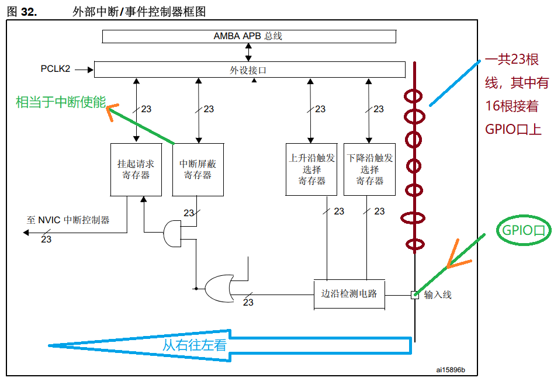

# 32单片机学习记录7之EXTI外部中断

## 前置

### 疑问1

**我刚学了串口通信中SR寄存器和CR1寄存器设置了中断使能，SR中接收中断状态位变成1，就可以产生中断信号，进而触发STM32F407内部NVIC控制器执行一些操作。 这是属于片上外设：就是芯片内部串口控制器产生的中断信号。 片外外设也可以产生中断信号，这种叫EXTI外部中断？两者的区别？**

**片上外设中断（内部外设中断）：**

- 指的是芯片内部集成的外设（如串口、定时器、ADC等）产生的中断
- 以您描述的串口中断为例，是由STM32F407芯片内部的串口控制器直接产生
- **中断信号直接通过芯片内部的中断控制器（NVIC）进行管理**
- 中断源来自于芯片内部的外设寄存器状态变化
- **配置和触发相对简单，因为是芯片内部直接实现的机制**

**外部中断（EXTI）：**

- 指来自芯片外部的中断信号
- **通常由连接到GPIO引脚的外部器件触发**
- 可以是：
  - **传感器**
  - **按键**
  - 外部芯片的中断输出引脚
  - 其他电子模块的中断信号
- 需要通过GPIO配置和EXTI线路进行中断管理
- 触发方式更加灵活，可以配置上升沿、下降沿或双边沿触发

**主要区别：**

- 中断源位置：内部（片上外设）vs 外部（GPIO引脚）
- 中断管理方式：内部直接管理 vs 需要通过EXTI线路转换
- 配置复杂度：内部中断相对简单 vs 外部中断需要更多配置

**串口中断：**

- 确实是典型的片上外设中断
- 由串口控制器内部状态变化（如接收到数据）触发
  - 接收中断

**外部按键中断：**

- 使用EXTI中断是最佳实践
- 您指出了不能持续扫描的关键点。轮询（高速扫描）会：
  - 浪费大量CPU资源
  - 增加功耗
  - 降低系统实时性
- 中断机制可以让CPU在按键未触发时处于低功耗状态

**光电传感器中断：**

- 同样非常适合使用EXTI中断
- 传感器状态变化不可预测
- 中断可以立即响应状态改变
- 避免了持续轮询带来的资源浪费

您的理解展示了中断的两个核心优势：

- 实时响应
- 节省计算资源

这种中断驱动的编程思想在嵌入式系统中至关重要，尤其是对于需要低功耗和高响应性的应用。

**两种中断最终都会通过NVIC（嵌套向量中断控制器）进行最终的中断处理和优先级管理。**


### 疑问2

**片外外设不能像片上外设那样直接产生中断信号给nvic,需要通过EXTI间接传递中断信号？那是不是需要实现约定什么条件会触发中断？因为不像片上外设一样直接设置对应的中断使能然后等待SR状态寄存器变化即可？**

您的理解很准确。对于片外外设，中断传递确实需要一些额外的步骤：

**中断信号传递流程：**

- 片外外设 → GPIO引脚 → EXTI → NVIC
- 不像片上外设可以直接连接到NVIC

**中断触发条件配置： 需要配置以下几个关键部分：**

- GPIO配置：选择中断引脚
- EXTI配置：
  - 设置触发模式（上升沿/下降沿/双边沿）
  - 使能/屏蔽中断线
- NVIC配置：
  - 设置中断优先级
  - 使能对应中断

具体配置示例（以STM32为例）：

```c
// GPIO配置为输入
GPIO_InitStructure.Mode = GPIO_MODE_IT_RISING; // 上升沿触发

// EXTI配置
EXTI_InitStructure.Mode = EXTI_MODE_INTERRUPT;
EXTI_InitStructure.Trigger = EXTI_TRIGGER_RISING; // 上升沿触发
EXTI_InitStructure.Line = EXTI_LINE;

// NVIC配置
NVIC_InitStructure.NVIC_IRQChannel = EXTI_IRQn;
NVIC_InitStructure.NVIC_IRQChannelPreemptionPriority = 0x00;
```

多了EXTI控制器的配置。一些附加GPIO口的设置。

**关键区别：**

- 片上外设：直接通过寄存器状态触发
- 片外外设：需要额外配置触发条件和传递路径

**触发条件的重要性：**

- 定义何时认为"中断事件发生"
- 可以是电平变化、边沿变化等
- 避免误触发很关键

总之，片外外设中断需要更多的"翻译"和"配置"工作，以将外部信号转换为可被处理的中断信号。

### 疑问3

**如果像这种需要高速扫描的不知道何时发生的程序，都改用中断方式的话，是不是能节省很多CPU资源？**

是的！使用中断而不是轮询（高速扫描）确实可以显著节省CPU资源。让我详细解释一下：

轮询（高速扫描）的问题：

1. CPU持续运行
2. 大量无意义的重复检查
3. 功耗高
4. 资源利用效率低
5. 实时性较差

中断方式的优势：

1. CPU可以进入休眠/低功耗模式
2. 事件发生时立即响应
3. 极大地降低功耗
4. 提高系统实时性
5. 更加节能和高效

举个具体例子：

- **轮询方式：CPU每毫秒都要检查传感器状态**
- **中断方式：传感器状态变化时才唤醒CPU**

典型应用场景：

- 按键检测
- 传感器监测
- 通信接口状态监听
- 外部事件响应

使用中断不仅节省资源，还能：

- 降低系统功耗
- 提高响应速度
- 优化程序结构
- 减少不必要的计算负担

对于资源受限的嵌入式系统尤其重要，可以将宝贵的计算资源用于更有意义的任务。


**我的流水灯是利用计数思想，使用主函数的while（1）运行，如果此时我在后面加一个按键扫描会发现流水灯的速度跟之前有很大差别**

这是典型的轮询带来的性能影响示例！让我详细解释一下原因：

**原始流水灯实现：**

- 在while(1)中持续执行流水灯闪烁逻辑
- **每个延时周期相对稳定**
- **代码执行时间可预测**

**添加按键扫描后的变化：**

- 按键扫描会增加主循环的执行时间
- 每次循环的实际时间变得不确定
  - **每次没有检测到还好，万一检测到按键按下了会进入响应的逻辑，更加耽误实践**
- 流水灯的闪烁间隔被延长和不稳定

性能影响的本质：

- 轮询会"拖慢"主循环执行速度
- 增加的代码逻辑会占用CPU时间
- **原本简单的延时周期被打乱**

改进建议：

1. 使用定时器中断实现流水灯
2. 使用按键中断替代轮询扫描
3. 将流水灯和按键逻辑解耦

这正是我们之前讨论的轮询 vs 中断的典型场景。中断可以：

- 保持流水灯闪烁的稳定性
- 提高系统响应效率
- 减少主循环的负担

## 什么是EXTI中断？

GPIO口电平发生变化,EXTI控制器就可以产生中断信号给到NVIC控制器.

EXTI：外部中断/事件控制器

使用场景：

只要是IO口电平发生变化，要执行一些事情，就可以用外部中断线中断。

- 外部中断按键 (开机按键,唤醒按键（PA0唤醒引脚，利用外部中断可以唤醒，在超低功耗模式）)  
  - 关机不等于掉电。而是进入超低功耗模式
  - 意味着高速轮询扫描在这个场景下不合适。

- 记录脉冲个数


- 检测设备挂载情况(传感器)


综上:如果IO口的电平发生变化,想及时知道并且执行相应的处理,用EXTI外部中断控制器监测


### 工作原理

**EXTI一边可以通过设置连接到A~H的某一组GPIO引脚，EXTI内部有寄存器可以设置每一个GPIO口单独的中断触发条件，EXTI另一边就是连接着NVIC，传递中断信号给nvic?**

是的,您完全理解正确。EXTI的工作原理可以总结如下:

1. EXTI可以连接到A~H八组GPIO引脚中的任意一组:
   - 通过SYSCFG_EXTICR寄存器选择中断输入引脚
2. EXTI内部有多个中断线(最多23条):
   - 每个中断线都可以单独配置触发条件
   - 比如上升沿触发、下降沿触发或双边沿触发
3. EXTI将这些中断事件传递给NVIC:
   - NVIC负责管理和响应这些外部中断请求
   - 包括中断优先级仲裁和中断服务程序调用

总的来说,EXTI扮演了GPIO引脚与NVIC中断控制器之间的"翻译器"角色:

- 它接收来自GPIO的中断信号
- 根据用户配置进行中断事件的管理
- 最终将中断请求传递给NVIC进行处理

### EXTI控制器只能监听GPIO口吗？

**也就是说EXTI只能连接到GPIO口组是吗？”翻译“GPIO口传递的中断信号？**

不完全正确。**EXTI（外部中断/事件控制器）不仅可以连接到 GPIO 引脚，还可以连接到其他外设的中断源。EXTI 的作用是接收来自各种外部事件或中断源的信号，并将这些信号“翻译”为可被 NVIC（嵌套向量中断控制器）处理的标准中断请求。**

具体来说：

1. **EXTI 可以连接到 GPIO 引脚，接收来自 GPIO 的中断信号。**
   - 这是 EXTI 最常见的应用场景，每根 EXTI 线（EXTI0 ~ EXTI15）可以配置为连接到任意 GPIO 组（GPIOA ~ GPIOI）的对应引脚。例如，EXTI0 可以连接到 PA0、PB0 等。
   - 通过边沿检测（上升沿、下降沿或双边沿触发），EXTI 可以捕获 GPIO 信号的变化。
2. **除了 GPIO，EXTI 还可以连接到其他特定外设的中断源，比如：**
   - RTC 的中断事件：
     - EXTI17（RTC 闹钟事件）。
     - EXTI21（RTC 唤醒事件）。
   - 电源管理相关事件：
     - EXTI16（PVD 可编程电压检测器），用于检测电源电压是否低于设定阈值。
   - USB 和以太网唤醒：
     - EXTI18（USB OTG FS 唤醒信号）。
     - EXTI19（以太网唤醒信号）。
     - EXTI20（USB OTG HS 唤醒信号）。
3. **EXTI 的作用是将这些多样化的外部中断源的信号“翻译”成标准中断信号，传递给 NVIC 进行处理。**
   - EXTI 通过挂起寄存器（PR）标记事件发生，结合中断屏蔽寄存器（IMR）和触发配置寄存器（RTSR/FTSR），实现信号的过滤与转换。
4. **通过 EXTI，用户可以灵活地选择各种外部事件作为中断源，配置中断触发条件，提高系统的灵活性和响应能力。**
   - 无论是 GPIO 引脚的状态变化，还是**特定外设事件的触发**，EXTI 都能够高效地将信号转交给 NVIC，从而实现统一的中断管理。


**所以EXTI可以连接各种外设的中断源，不止GPIO口，只不过SYSCFG外部中断配置寄存器（SYSCFG_EXTICR）可以使GPIO连接到EXTI而已，可能还有寄存器，经过配置可以使其他外设也能连接到EXTI？**

**不完全正确。**具体来说：

1. **SYSCFG_EXTICR 寄存器用于配置 GPIO 引脚与 EXTI 的映射关系：**
   - 每根 EXTI 线路（EXTI0 ~ EXTI15）可以通过 SYSCFG_EXTICR 寄存器，选择连接到任意 GPIO 组（GPIOA ~ GPIOI）的相应引脚。
   - 这种配置为 GPIO 引脚提供了灵活的中断映射方式，是 EXTI 最常用的场景。
2. **对于特定外设，STM32 的硬件设计中直接绑定了中断源与 EXTI：**
   - **RTC 的中断事件：**
     RTC 闹钟事件通过 EXTI17 连接，RTC 唤醒事件通过 EXTI21 连接，**无需额外配置寄存器**。
   - **PVD（可编程电压检测器）的中断：**
     PVD 的电压阈值检测事件直接连接到 EXTI16。
   - **USB 和以太网的唤醒事件：**
     USB OTG FS、USB OTG HS 和以太网的唤醒信号分别通过 EXTI18、EXTI20 和 EXTI19 连接到 EXTI。
3. **这些外设中断源的连接通常是硬件固定的，而不需要额外寄存器配置：**
   - 与 GPIO 的可配置性不同，这些外设的中断信号直接映射到特定的 EXTI 线路上，用户只需通过 EXTI 控制寄存器（如 IMR、RTSR、FTSR 等）设置触发条件即可使用。
4. **通过 EXTI 的中断信号“翻译”功能，用户可以灵活配置这些中断源：**
   - EXTI 负责处理来自 GPIO 和外设的中断信号，并将这些信号统一“翻译”为标准的中断请求，传递给 NVIC 进行处理。
   - 用户只需结合 SYSCFG_EXTICR 和 EXTI 控制寄存器，即可管理多种类型的中断源。

5. **总结：**
   - EXTI 是一个通用的中断信号转换模块，不仅支持通过 SYSCFG_EXTICR 将 GPIO 引脚映射到中断线路，还支持通过固定线路接入其他外设的中断源（如 RTC、PVD、USB 等）。尽管 GPIO 的中断映射需要手动配置，但许多外设的中断源与 EXTI 的连接是硬件固定的，无需额外设置。
   - 关键是要熟悉 STM32 中各外设的中断机制，掌握如何通过 EXTI 控制寄存器实现灵活的中断管理。

### 为什么不直接与GPIO口绑定？

**对于特定外设，STM32 的硬件设计中直接绑定了中断源与 EXTI。 但是GPIO组的各IO口没有绑定，一来不是每一个IO口都能使用，二来会增加EXTI控制器的线路 造成资源浪费。所以才外增SYSCFG_EXTICR 寄存器来配置具体使用哪一个IO口？**

#### **关于特定外设和 EXTI 的硬件绑定**

- **特定外设的中断源（如 RTC 闹钟、PVD、USB 唤醒等）直接绑定到 EXTI 特定线路上**，这是因为这些外设的中断源数量有限且用途固定，硬件上预先设计好连接方式，不需要额外的配置寄存器。
- 这种固定绑定的设计优点：
  1. 硬件连接简单，无需用户额外配置，节省开发时间。
  2. 避免资源浪费：每个外设占用一条 EXTI 线路，不会引入额外的灵活性需求。

------

#### **关于 GPIO 和 SYSCFG_EXTICR 的设计初衷**

- **GPIO 引脚没有直接绑定到 EXTI 的原因：**
  1. **灵活性需求**：STM32 的 GPIO 组和引脚数量通常较多（例如 GPIOA ~ GPIOI，每组 16 个引脚），如果直接为每个引脚预留一条独立的 EXTI 线路，将导致 EXTI 控制器过于复杂。
  2. **资源优化**：并非所有 GPIO 引脚都需要支持外部中断功能，将所有 GPIO 引脚都硬绑定到 EXTI 会导致硬件资源浪费。
- **SYSCFG_EXTICR 的引入：**
  1. SYSCFG_EXTICR 是一种灵活的选择机制，它允许用户根据需求，将任意 GPIO 引脚动态映射到 EXTI 的 16 条 GPIO 专用线路（EXTI0 ~ EXTI15）。
  2. 每个 SYSCFG_EXTICR 寄存器对应 4 条 EXTI 线路（EXTI0 ~ EXTI15），通过设置寄存器的字段，用户可以选择某条 EXTI 线路连接到 GPIOA ~ GPIOI 的特定引脚。
  3. 优点：
     - 极大提升了 GPIO 的灵活性：任何支持 EXTI 的 GPIO 引脚都可以与 EXTI 映射，而非硬绑定。
     - 节省了硬件资源：通过共享 16 条 EXTI 线路，避免为每个 GPIO 引脚预留一条独立的中断线路。

------

#### **为什么不是每个 GPIO 引脚都支持 EXTI？**

- **硬件资源限制**：虽然 GPIO 引脚众多，但芯片中断控制资源有限。只有具备特定用途或实际需求的引脚（通常是多功能引脚）支持 EXTI。
- **设计策略**：并非所有应用场景都需要外部中断功能。例如，用作普通数字输出或模拟信号输入的引脚通常不需要中断功能。

------

#### **总结**

1. **特定外设的中断源绑定到 EXTI 是硬件固定的**，因为这些外设数量少、功能明确，无需额外的配置灵活性。
2. **GPIO 的外部中断功能通过 SYSCFG_EXTICR 动态配置**，既提升了灵活性，又避免了资源浪费。
3. 这种设计既保证了常用外部中断功能的可用性，又最大限度地优化了芯片的硬件资源。

## 如何配置EXTI中断？

### EXTI控制器框图



芯片内部有一个EXTI控制器（**片外外设中断信号翻译器**）,控制器上有23个EXTI接口.

- EXTI0~15连接到GPIO口; **EXTI16~22 连接到芯片内部的其他外设（片上外设）**

- **每个IO口都可以触发外部中断线中断** (说明：注意分组)		

- 具体配置哪一个IO口连接EXTIx

  - 系统配置寄存器（SYSCFG->EXTICR[x]）：管理GPIO口与外部中断线连接


- 具体步骤：

    - 根据自己需要的管脚确定具体的EXTI线: PE3------EXTI3
- 根据具体的EXTI线去找相关寄存器并且确定具体哪四位: SYSCFG->EXTICR1        
- 根据寄存器描述查看写入值: PEx 0100


#### 疑问1

**这个意思是EXTI的中断更加灵活，包括中断信号触发定义。而片上外设的中断信号是固定的？比如串口通信相关寄存器中的接收中断和空闲中断？**

**片上外设中断：**

1. 中断信号相对固定
2. 通常由特定事件触发，如：
   - 串口：
     - 接收中断（数据到达）
     - 发送中断（发送缓冲区空）
     - 空闲中断
   - 定时器：定时中断
   - ADC：转换完成中断
3. 触发条件主要由外设内部状态决定

**EXTI外部中断：**

1. 中断信号极其灵活
2. 触发条件可自由配置：
   - 上升沿触发
   - 下降沿触发
   - 双边沿触发
3. 每个中断线独立控制
   - 可单独使能/屏蔽
   - 有独立的状态位
4. 支持多达23个中断/事件源
5. 可连接到不同的GPIO引脚

**关键区别：**

- 片上外设：预定义的中断触发
- EXTI：用户可高度自定义中断触发条件

**这种灵活性使EXTI特别适合外部事件检测，如传感器、按键等不可预测的信号源。**

#### 疑问2

[23根线详解传送门](###EXTI控制器只能监听GPIO口吗？)

**STM32F407中的EXTI，其中16根线可以连接到各GPIO组中的GPIO口。 其他7根线也可以连接除了GPIO口之外的中断源？经过EXTI间接传递中断信号给NIVC控制器从而触发中断？**

EXTI（外部中断/事件控制器）模块支持对外部信号（例如 GPIO 口和特定的内部事件源）进行中断管理，最终通过 NVIC（嵌套向量中断控制器）触发中断。

**16 根线 (EXTI0 ~ EXTI15)**：

- **作用**：这 16 根 EXTI 线可以分别连接到各 GPIO 组（GPIOA~GPIOI）的任意一个引脚。
- **MUX 配置**：需要通过 SYSCFG 寄存器中的 EXTICRx（x=1~4）选择具体的 GPIO 引脚。例如，可以将 EXTI0 连接到 GPIOA 的第 0 引脚（PA0）或其他 GPIO 组的第 0 引脚。
- **触发模式**：每根 EXTI 线可以配置为上升沿、下降沿或者双边沿触发中断。

------

**其他 7 根线 (EXTI16 ~ EXTI22)**：

这些 EXTI 线不是连接到 GPIO，而是**对应特定的内部信号源**：

1. **EXTI16**：PVD（可编程电压检测器）中断。
2. **EXTI17**：RTC 闹钟事件（ALARM 中断）。
3. **EXTI18**：USB OTG FS 唤醒信号（USB 唤醒事件）。
4. **EXTI19**：以太网唤醒事件（Ethernet Wakeup）。
5. **EXTI20**：USB OTG HS 唤醒信号（USB 唤醒事件）。
6. **EXTI21**：RTC 唤醒信号（Wakeup）。
7. **EXTI22**：外部系统复位请求信号（Tamper 和时间戳事件）。

------

**中断信号的传递**

1. **信号输入**：
   - 对于 EXTI0 ~ EXTI15，信号来自 GPIO。
   - 对于 EXTI16 ~ EXTI22，信号来自上述特定的内部事件源。
2. **通过 EXTI 模块处理**：
   - EXTI 先对信号进行边沿检测（触发条件：上升沿/下降沿）。
   - 若满足触发条件，会在相应的挂起寄存器中设置对应的挂起位（PR 寄存器）。
3. **传递给 NVIC**：
   - 如果 EXTI 的中断使能位（IMR 寄存器）被设置，EXTI 将触发中断信号并传递到 NVIC。
   - NVIC 通过中断向量表确定具体的中断服务例程（ISR）。

#### 疑问3

内核相关的控制器（如NVIC）通常不需要配置使能。

对于EXTI（External Interrupt）外部中断控制器，情况稍有不同。

EXTI本身不需要额外的时钟使能，但是配置EXTI中断通常需要两个步骤：

1. GPIO的时钟使能 由于EXTI是由GPIO口的电平变化触发的，你需要先使能对应GPIO口的时钟。
2. SYSCFG的时钟使能 STM32F4系列中，EXTI依赖于SYSCFG（系统配置）控制器，需要使能SYSCFG的时钟。
3. 这两步是配置外部中断所必需的。EXTI控制器本身不需要额外的时钟使能，但其依赖的外设（GPIO和SYSCFG）需要。

4. 所以你的理解是正确的：EXTI作为片上外设，在使用前确实需要相关的时钟使能配置。

### EXTI控制器相关寄存器

①SYSCFG->EXTICR  ：外部中断配置寄存器     //手册第八章节

​		配置GPIO与对应EXTI的映射关系（具体管脚连接EXTIx）

②EXTI->RTSR    ：上升沿触发选择寄存器

​		启动检测上升沿

③EXTI_FTSR    ：下降沿触发选择寄存器

​		启动检测下降沿

④EXTI_IMR     ：中断屏蔽寄存器 

​		使能EXTI线的

⑤EXTI_PR     ：挂起寄存器

​		满足中断条件，此寄存器对应位会自动置1，并向内核NVIC发出中断请求

​		注意：此寄存器需要软件清零

​			 在中断服务函数中的第一件事就是对该位写1（不是写0）

#### 外部中断配置寄存器

**SYSCFG 外部中断配置寄存器 (SYSCFG_EXTICR)的作用是不是和复用功能寄存器一样？后者决定对应GPIO口被复用什么功能，比如串口通信的输入和输出。 前者也是如此：决定芯片内部EXTI外部中断控制器复用那一组GPIO引脚用作外部中断的源输入？ 由此看来GPIO不止简单可以输入输出高低电平，还有复用模式，许多片上外设都要复用GPIO口与片外外设进行信息交换**

复用功能寄存器（GPIO复用）：

- 决定GPIO引脚的复用功能
- 例如：串口、SPI、I2C等外设的引脚功能
- 将GPIO从基本的输入/输出模式切换到特定外设功能

SYSCFG外部中断配置寄存器（SYSCFG_EXTICR）：

- **选择哪个GPIO端口作为EXTI中断源**
- **将特定的GPIO引脚连接到EXTI中断控制器**
- **实现GPIO到中断系统的映射**

GPIO的多种工作模式：

- 通用模式

  - 基本输入模式

  - 基本输出模式

- 复用模式（外设功能）
  - 通信接口（USART、SPI、I2C）
  - 定时器通道
  - 中断输入
  - 模拟输入（ADC）

总结：

- GPIO是非常灵活的外设
- 不仅可以简单地输入输出
- 通过特定寄存器可以实现多种复杂功能
- **是连接芯片内部外设和外部电路的关键接口**

这种设计极大地提高了微控制器的灵活性和功能性。

一个外部中断配置寄存器可以控制连接到各GPIO口组的四个引脚。

- 只用0~15，低16位

那么一个GPIO组有16个IO口，所以想要控制所有GPIO口与EXTI的连接，需要4个外部中断配置控制器。


### EXTI程序设计

看GPIO口具体怎么用，决定使用其配置，与内部中断和外部中断没有关系

- 外部中断使用到了GPIO口来监控高低电平的变化，所以要配置通用输入
- 串口通信需要复用GPIO口传递数据，所以配置复用模式。

```c
总体程序思路
	/*IO控制器配置*/
	/*EXTI控制器配置*/
	/*NVIC控制器配置*/
程序详细配置思路：	
	{
		/*IO控制器配置*/
			//端口时钟使能
			//端口模式配置
			//上下拉
		/*EXTI控制器配置*/
            //系统配置控制器时钟使能------使用寄存器之前要先使能（不然配置不生效），EXTI控制器没有所以不用配置，他们两个共用的
            //将需要用的IO口映射到对应的EXTIx接口上
            //上升沿/下降沿触发
		   //中断屏蔽寄存器------相当于中断使能

		/*NVIC控制器配置*/
			//优先级分组------在主函数
			//计算优先级编码值
			//设置具体中断源
			//使能NVIC响应通道
	}

    中断服务函数
{
//清除中断标志位
//紧急事件
}
说明:如果是9~5  15~10; 进入中断服务函数时候,要判断具体哪个接口触发
    0~4是单独的
    9~5(EXTI9_5_IRQn)和10~15(EXTI15_10_IRQn)是共用的中断通道
```

## 具体使用EXTI中断

