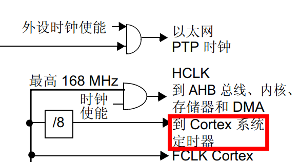
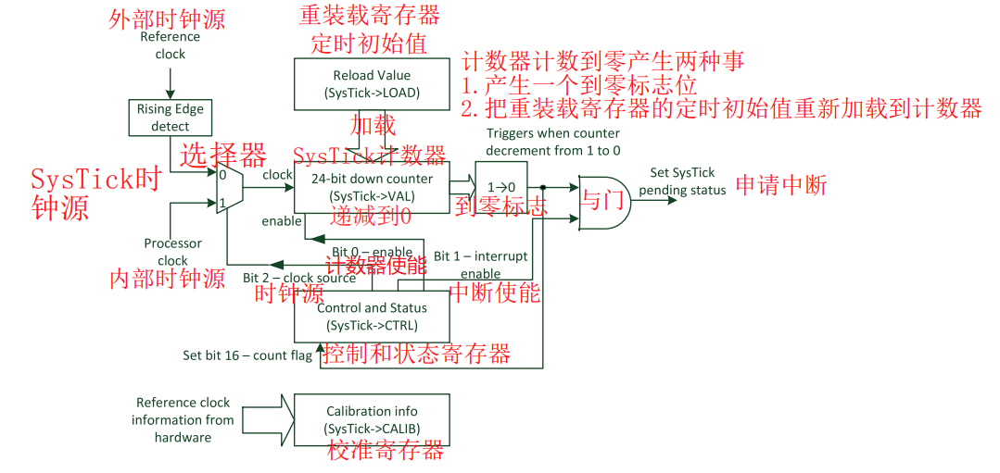
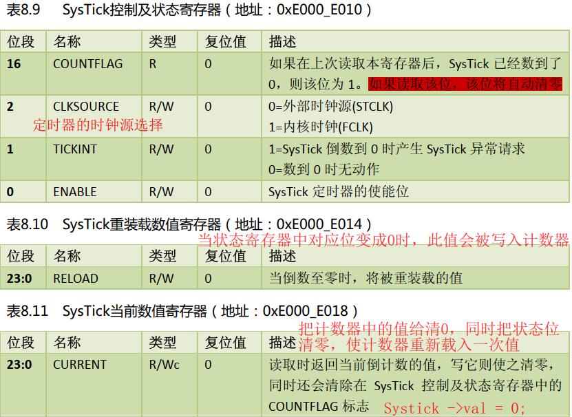
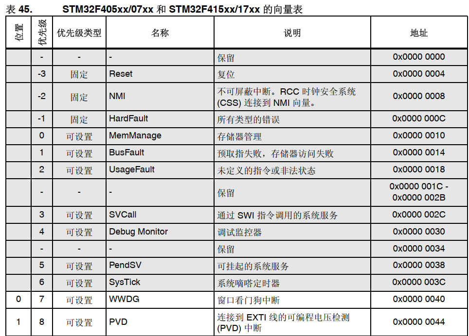

# 32单片机学习记录8之系统滴答定时器

## 前置

**STM32F407,系统滴答定时器是内核的一部分吗？扮演什么角色？有什么作用？**

对于STM32F407中的系统滴答定时器（SysTick），我来详细解释一下：

系统滴答定时器（System Tick Timer）确实是Cortex-M4内核的一部分，而不是STM32F407特定的外设。它是ARM Cortex-M处理器架构中的标准组件，在STM32F407的内核中也存在。

1.**SysTick 的角色**

SysTick 定时器是一个 **核心定时器**，主要用于提供系统时基（system tick）。在典型的 RTOS（如 FreeRTOS）或裸机系统中，它通常用于以下场景：

- 提供定时中断，用于操作系统的时间片调度。
- 实现延时函数（如 `HAL_Delay()` 或 `osDelay()`）。
- 定期执行后台任务或轮询。

由于它与 Cortex-M4 核心绑定，不需要外设初始化，因此非常适合高精度和简单的定时任务。

------

**2. SysTick 的作用**

1. **提供系统时基**
   - SysTick 常用于生成一个固定频率的中断，比如 1 毫秒的系统时基。
   - 在 STM32 HAL 库中，SysTick 通常被配置为每 1 毫秒触发一次中断，用于系统时钟更新和延时函数。
2. **支持多任务调度**
   - 在 RTOS 中，SysTick 通常是操作系统调度的核心定时器，用于触发任务切换和延时操作。
3. **延时功能**
   - 在裸机程序中，SysTick 可以用来实现简单的延时，避免繁琐的计数循环。
4. **时间测量**
   - SysTick 的 24 位计数器可以用于测量时间间隔，适合用于对函数执行时间进行精确计时。

------

**3. SysTick 的主要特点**

- **24 位递减计数器**：可以从指定的值开始递减计数，计数到 0 时触发中断。
- **内核直接支持**：无需额外配置外设寄存器，方便快速使用。
- **独立于其他定时器**：SysTick 是内核的一部分，与 STM32 的其他外设定时器（如 TIMx）互不干扰。
- **支持低功耗模式**：在低功耗模式下可以选择停止或继续运行。

4.**配置方式**

SysTick 的主要配置寄存器包括：

1. SysTick Control and Status Register (STK_CTRL)
   - 控制定时器启用、计数器模式、时钟源选择和中断启用。
2. SysTick Reload Value Register (STK_LOAD)
   - 配置计数器初始值（重装值）。
3. SysTick Current Value Register (STK_VAL)
   - 实时显示当前计数值。
4. 参考时钟
   - 可以选择使用 **内核时钟 (HCLK)** 或 **HCLK/8**。


**所以可以把之前使用while计数思想延时的函数，可以不用了？**

是的！在 STM32 中，如果使用了 **SysTick** 定时器或者其他硬件定时器实现延时，就可以完全替代传统的 `while` 循环计数的延时方法。这不仅可以提高代码的可读性和效率，还能避免占用 CPU 资源，从而让系统在延时期间可以执行其他任务。

------

**为什么不用 `while` 计数延时？**

1. **低效且占用 CPU**
   - `while` 循环延时是一种“忙等”的方式，CPU 在延时期间什么有意义的工作也做不了，一直浪费资源在等待上。
   - 如果延时较长（比如几百毫秒以上），这种方式会导致 CPU 的性能被严重浪费。
2. **延时不准确**
   - `while` 循环计数的精度依赖于编译器优化等级、指令执行时间和主频。
   - 在主频变化、编译器优化、或加入其他代码时，`while` 计数方式会变得不可靠。
3. **不适合多任务系统**
   - 在实时操作系统（RTOS）中，`while` 循环延时会阻塞任务，无法切换到其他任务，降低系统响应性。

------

**推荐的延时方式**

**1. 使用 SysTick + HAL 库（推荐）**

SysTick 定时器结合 HAL 库提供了易用的延时函数，例如 `HAL_Delay()`。该函数利用 SysTick 生成的 1ms 系统时基。

```c
#include "stm32f4xx_hal.h"

int main(void) {
    HAL_Init(); // 初始化 HAL 库，默认配置 SysTick 为 1ms 中断

    while (1) {
        HAL_GPIO_TogglePin(GPIOC, GPIO_PIN_13); // 翻转 LED
        HAL_Delay(1000); // 延时 1000 毫秒
    }
}
```

特点：

- 简单易用。
- 精度满足大部分应用场景。
- 不阻塞其他中断任务（比如 UART 通信）。

**2. 使用硬件定时器**

如果需要更精确或更灵活的延时（比如微秒级延时），可以使用 STM32 的外设定时器（TIMx）。通过设置定时器的比较输出或溢出中断，可以实现精准延时。

特点：

- 支持微秒级延时（适合高精度需求）。
- 不依赖主频变化，延时稳定。

**3. 使用 RTOS 的延时函数**

在使用操作系统（如 FreeRTOS）时，推荐使用 RTOS 提供的延时函数（例如 `vTaskDelay()`），可以使任务进入休眠态，不占用 CPU。

特点：

- 多任务友好，避免阻塞。
- 延时期间可以切换到其他任务，提高系统效率。

**总结**

是时候告别 `while` 循环计数延时了！根据你的需求选择合适的延时方式：

1. **简单的毫秒级延时**：使用 `HAL_Delay()`。
2. **高精度微秒级延时**：使用硬件定时器。
3. **多任务系统延时**：使用 RTOS 的延时函数。

这些方法更加高效和可靠，同时让你的系统更灵活！

### 系统滴答定时器的作用

**系统滴答定时器（SysTick）** 的核心功能确实是**提供时间参考**，并为应用程序或操作系统提供一种标准的、精确的时间基准。但它的作用不仅仅限于时间参考，下面是更具体的描述：

------

** SysTick 的核心作用**

**SysTick 定时器的主要用途是生成固定周期的中断，作为时间基准。** 它的计数方式通常是从一个设定的初值递减到零，然后触发中断，并自动重新加载初值开始新一轮计数。

- **提供时间基准（时基）**
  SysTick 主要是用来提供一个精确、稳定的时间基准，比如每 1 毫秒触发一次中断。这是许多实时系统中核心的定时器功能。
- **支持时间管理**
  在这个基础上，程序可以实现延时、时间片轮转、任务调度、计时等功能。

 **SysTick 适合什么场景？**

SysTick 是一个 **简单但强大的工具**，适合以下场景：

1. **基础时间管理**：比如定时任务、系统心跳、LED 闪烁等。
2. **操作系统时基**：为 RTOS 提供调度时钟，**CPU时间片**。
3. **定时与延时**：提供高精度的延时功能。
4. **时间测量**：测量代码运行时间或事件间隔。

------

**SysTick 的局限性**

1. **单一性**：SysTick 是一个内核定时器，只有一个，不能同时提供多路定时功能。

2. 计时范围有限：SysTick 是 24 位定时器，最大计时范围取决于系统时钟。例如：
   1. 如果 HCLK = 84 MHz，SysTick 最大计时时间约为 **200 毫秒**。

3. **适用于短周期任务**：对于复杂定时需求，建议使用外设定时器（TIMx）。

------

**总结**

**系统滴答定时器的主要作用确实是提供时间参考**，但它不仅仅是一个简单的时基工具：

- 在裸机程序中，SysTick 可以用来实现精确的延时和时间测量。
- **在操作系统中，它通常作为任务调度的核心时钟源。**

如果你的需求是简单的延时、时间测量或者定时任务管理，SysTick 足够胜任；如果需要复杂的定时功能，可以结合 STM32 的其他定时器（如 TIMx）来扩展。

### 注意事项（重要）

**STM32F407，在裸机开发中可以使用系统滴答定时器作延时函数用，但是不建议。因为不确定后期开发会不会增加操作系统，从而打乱CPU时间片，因为操作系统使用系统滴答定时器作为CPU时间片？**

1. **系统滴答定时器 (SysTick Timer)**:
   - SysTick 是一个24位的倒计数定时器，主要用于生成系统时间基准和实现操作系统的时钟节拍。
   - 在裸机开发中，SysTick可以很方便地用于延时，因为它是内置的，不需要额外配置外设。
2. **在裸机开发中的使用**：
   - 在裸机开发中使用SysTick进行延时是非常直接和简单的方法。通常，你可以设置SysTick定时器，每次中断就表示一个时间片（如1ms）已经过去，这样你可以通过计数来实现延时。
3. **不建议使用的原因**：
   - **操作系统兼容性**：**如你所述，如果后期项目需要引入一个实时操作系统（RTOS），这些系统通常会依赖SysTick来管理任务调度和时间片**。如果你的裸机代码已经在使用SysTick，那么在引入RTOS时可能需要重新设计延时机制，或者调整RTOS的配置来避免冲突。
   - **时间精度和稳定性**：在裸机环境中，SysTick的精度和稳定性可能受到中断优先级、硬件干扰等的影响。而在RTOS中，时间管理更加复杂，需要更精确和稳定的时间基准。
   - **维护和扩展性**：**使用SysTick进行延时可能在项目初期看似方便，但随着项目的扩展，维护这些定时器的代码可能会变得复杂，特别是当你需要添加更多的定时任务或改变优先级时。**
4. **替代方案**：
   - **通用定时器**：**STM32F407有多个通用定时器（如TIM2-TIM5），这些定时器可以用来实现延时功能，并且不会与操作系统的时钟节拍冲突。**
   - **软件延时**：虽然效率低，但对于短时间的延时，可以使用简单的循环计数器实现软件延时。
   - **硬件定时器**：如果需要更精确的定时，可以使用硬件定时器，这些定时器通常有更高的分辨率和稳定性。

总结来说，虽然在裸机开发中使用SysTick进行延时是可行的，但考虑到未来的扩展性和与操作系统的兼容性，确实不建议这样做。更好的做法是使用其他独立的定时器资源，或者设计一个可以灵活适应未来需求的延时机制。


### 定时器分类

| **特性**       | **内核级定时器**           | **外设级定时器**                  |
| -------------- | -------------------------- | --------------------------------- |
| **典型定时器** | SysTick                    | TIMx（如 TIM1、TIM2）、LPTIM、RTC |
| **集成层次**   | 内核直接集成               | 独立外设模块                      |
| **时钟源**     | 内核时钟（HCLK 或 HCLK/8） | 外设时钟（PCLK、外部时钟等）      |
| **用途**       | 系统时基、OS 调度、延时    | PWM、捕获计数、事件触发等         |
| **灵活性**     | 较低                       | 较高                              |
| **分辨率**     | 24 位                      | 通常为 16 或 32 位                |
| **功耗**       | 与内核运行状态一致         | 可支持低功耗运行                  |

------

**总结**

- **内核级定时器**：以 **SysTick** 为代表，主要负责系统级任务调度和基本计时功能，紧密集成在内核中，使用方便但功能相对单一。
- **外设级定时器**：包括基本、通用、高级和特殊定时器，功能丰富，支持更多场景（如 PWM、输入捕获、事件计数等），灵活性和扩展性更强。

在选择定时器时，可以根据**层级架构**（内核级 vs 外设级）和**具体功能需求**进行合理取舍。

## 什么是系统滴答定时器

### 定时器工作原理

**定时器的本质**

定时器就像是一个计数器，它会按照一定的速度不断地数数。


**有规律的计数**

这个“速度”是由定时器的时钟频率决定的。就像你跑步时，步伐的节奏是由你跑步的速度决定的。

- **时钟频率**：这是定时器每秒钟可以计数的次数。比如，如果一个定时器的时钟频率是1000 Hz（赫兹），那它每秒钟就会计数1000次。


**计数器**

在定时器内部，有一个可以控制的计数器。你可以设置这个计数器数到多少就停止。

- 形成时间的原理

  - **计数频率**：通过时钟源，你可以知道定时器每秒钟会计数多少次。比如说，如果时钟频率是1000 Hz，那么每秒钟计数1000次。

  - **设定时间**：你想让定时器在多少秒后触发一个事件。比如，你想等10秒。

  - **计算计数次数**：你想要的时间（秒）乘以每秒的计数频率，就是你需要设置的计数器的总计数次数。

例子：

- **你想要的时间**：10秒。

- **计数频率**：假设定时器每秒计数1000次（1000 Hz）。

  那么：

- **计算计数次数**：10秒 * 1000次/秒 = 10000次。

- **设置计数器**：你告诉定时器，“当你计数到10000次的时候，告诉我。”

当定时器计数到10000次时，它就会发出一个信号（比如触发一个中断），告诉你10秒已经过去了。


**通俗的比喻**

想象你有一个秒表，你想等10分钟再做某件事。你知道这个秒表每秒“嘀嗒”一次（也就是它的计数频率是1 Hz），那么你就把秒表调到600秒（10分钟 * 60秒/分钟），然后你可以去做别的事情，当秒表到600秒时，它会提醒你时间到了。

这就是定时器的工作原理，只不过在电子设备中，这个过程是自动化的，而且可以精确到微秒甚至更小的时间单位。


**相当于利用芯片的频率或者总线的频率来实现计时的效果？**

定时器的计时效果正是利用了芯片或者总线的时钟频率来实现的。让我们进一步解释一下：

1. **时钟源**：
   - 芯片或者总线有一个基本的时钟信号，这个信号就像是心跳，每秒钟跳动一定的次数，这就是频率。比如，STM32F407的系统时钟（SYSCLK）可能运行在168 MHz（168百万次/秒）。
2. **分频**：
   - 由于这种高频率对于定时来说通常太快了，所以定时器会有一个分频器（Prescaler），可以将这个高频率的时钟信号降低到更适合计时的频率。例如，**你可以将168 MHz的时钟分频到1 kHz（1千赫兹），这样每秒钟就只计数1000次。**
3. **计数器**：
   - **定时器有一个计数器**，按照你设置的分频后的频率来计数。每次时钟信号到来，计数器就增加1。
4. **设定计数值**：
   - 你告诉定时器，“当你计数到这个值的时候，给我一个信号。”这个值就是你想要的延时时间乘以每秒的计数次数。

通过这种方式，芯片的频率或者总线的频率被用来作为时间的基准，从而实现精确的计时效果。**就像你用一个非常快的秒表，通过调节秒表的速度（分频）来适应你想要的时间间隔，然后设置秒表计数到你需要的次数就提醒你时间到了。**


**提醒的方式是以中断的方式吗？这属于内部中断吧？不是EXTI管理吧？**

没错，定时器的提醒方式通常是以中断的方式来实现的。让我们详细说明一下：

1. **中断**：
   - 当定时器的计数器达到你设定的值时，它会产生一个中断信号。这个信号会触发一个中断处理程序（ISR, Interrupt Service Routine），这是一个预先编写的函数，专门用于处理这个特定事件。
2. **内部中断**：
   - 这个中断属于内部中断（Internal Interrupt），因为它是由芯片内部的定时器产生，而不是来自外部的中断源。内部中断通常包括定时器中断、DMA（直接内存访问）中断、UART中断等。
3. **EXTI**：
   - EXTI（外部中断/事件控制器）专门用于管理外部中断源，比如按键、传感器等外部设备的中断。所以，定时器的中断不属于EXTI管理的范畴。
4. **中断处理**：
   - 当定时器中断发生时，CPU会暂停当前的任务，跳转到中断处理程序执行。这时，程序可以执行你定义的操作，比如设置一个标志位，改变某个状态，或者执行任何你需要的任务。
5. **中断优先级**：
   - 在芯片中，不同的中断可以有不同的优先级，定时器中断的优先级也可以设置，以便在多个中断同时发生时，CPU可以按照优先级处理。

总结来说，定时器使用中断来通知你时间已经到期，这种中断是内部产生的，不属于EXTI管理的外部中断。通过中断，程序可以及时响应定时器事件，而无需轮询（不断地检查定时器状态），这提高了效率和系统的响应速度。


**这个定时器触发的中断是不是叫定时中断？优先级应该设置为最高才合适吧？**

1. **定时中断（Timer Interrupt）**：
   - 是的，定时器触发的中断通常被称为**定时中断**（Timer Interrupt）。这是因为中断是由定时器在达到预设的计数值时触发的。
2. **优先级设置**：
   - **不一定**需要将定时中断的优先级设置为最高。优先级的设置取决于你的应用需求和系统设计：
     - **高优先级**：如果你需要定时器非常及时地响应，例如在实时系统中精确控制或同步任务，那么将定时中断的优先级设置得较高是有意义的，因为你希望它能尽快被处理，避免延迟。
     - **中或低优先级**：在很多情况下，定时中断并不需要最高优先级。例如，如果定时器只是用来做一些不那么紧急的任务（如更新显示、记录数据等），那么你可能希望将更关键的中断（如串口接收数据、传感器触发等）设置为更高的优先级。
     - **平衡**：系统中断的优先级需要平衡。如果所有中断都设置为最高优先级，系统可能会变得不稳定，因为高优先级的中断会频繁打断低优先级的任务，导致某些任务可能永远得不到执行。
     - **嵌套中断**：在一些系统中，中断可以嵌套（即一个中断处理程序在执行时，另一个更高优先级的中断可以打断它）。在这种情况下，优先级的设置变得更加重要。

因此，定时中断的优先级设置应该基于你的具体应用场景：

- 如果定时器用于时间敏感的操作（如实时控制），可能需要较高的优先级。
- 如果定时器用于辅助性或周期性的任务，通常设置为中等或较低的优先级就足够了。

在设置优先级时，你需要考虑系统中所有中断的相对重要性和时间要求，确保系统的整体稳定性和效率。

### 延时函数与定时中断的区别

**那什么时候使用延时函数，什么时候使用定时中断？延时会阻塞CPU的运行吧？定时中断不会阻塞？**

**使用延时函数（Blocking Delay）**

**什么时候使用**：

- **短时间的简单延时**：如果只需要等待一小段时间（如几毫秒到几百毫秒），并且这个延时不会对系统的其他操作产生太大影响。
- **单任务系统**：在单任务环境中，延时函数可以简单地实现任务之间的时间间隔。
- **调试和测试**：在开发过程中，延时函数可以帮助你观察系统行为或进行简单的测试。

**特点**：

- **阻塞CPU**：延时函数会让CPU在等待期间停止执行其他任务，直到延时结束。这意味着在延时期间，CPU不能处理其他事件或中断。
- **简单实现**：通常实现起来非常简单，只需要一个循环计数或调用已有的延时函数库。

**使用定时中断（Non-blocking Delay）**

**什么时候使用**：

- **多任务环境**：在需要同时处理多个任务的系统中，使用定时中断可以让系统在等待期间仍然可以执行其他任务。
- **实时系统**：需要精确的定时控制或需要在特定时间点执行操作的场景。
- **非阻塞操作**：当你希望CPU在等待时仍能响应其他中断或处理其他任务时。
- **长时间的定时**：当需要较长时间的定时（如秒级或更长），使用定时中断可以避免CPU长时间被占用。

**特点**：

- **非阻塞**：定时中断不会阻塞CPU，CPU可以继续执行其他任务，直到中断触发。
- **更复杂**：需要配置定时器和编写中断处理程序，比简单的延时函数复杂一些。
- **灵活性高**：可以设置多个定时器，独立地控制不同的定时任务。

**阻塞与非阻塞**

- **延时函数**：确实会阻塞CPU运行，因为它通过一个循环或计数器让CPU忙等待，直到延时时间结束。
- **定时中断**：不会阻塞CPU。定时器在后台运行，CPU可以继续处理其他任务或中断。当定时器计数到设定值时，它会触发中断，执行中断处理程序，然后CPU回到之前的任务。

### 总结

- 如果你需要一个简单的、短时间的延时，并且系统中没有其他需要同时处理的任务，延时函数可能是个好选择。
- 如果你希望系统在等待期间能够处理其他任务，或者需要精确的定时控制，那么使用定时中断是更好的选择。

在现代嵌入式系统开发中，特别是在需要多任务处理的场景下，推荐使用定时中断而不是延时函数，以确保系统的响应性和效率。


**比如按键软件消抖时，使用延时函数可不可以？还是使用定时中断？**

对于按键软件消抖，选择使用延时函数还是定时中断有不同的考虑：

**使用延时函数：（使用while计数思想实现）**

**优点**：

- **简单实现**：直接调用一个延时函数来实现消抖非常简单。
- **资源占用少**：不需要配置定时器和中断处理程序。

**缺点**：

- **阻塞CPU**：延时函数会让CPU在消抖期间停止执行其他任务，这可能会影响系统的响应性。
- **精度可能不够**：如果系统负载较高，延时函数的实际延时时间可能不稳定。

**使用定时中断：**

**优点**：

- **非阻塞**：CPU在消抖期间可以继续处理其他任务，不会影响系统的响应性。
- **精度更高**：定时器中断的触发时间通常更精确，不易受系统负载影响。
- **灵活性**：可以设置多个定时器来处理不同的按键或其他事件。

**缺点**：

- **配置复杂**：需要配置定时器和编写中断处理程序。
- **资源占用**：使用定时器会占用一定的硬件资源（定时器通道）和微量的额外处理时间。

**选择建议：**

1. **小型系统或单任务环境**：
   - 如果你的系统非常简单，CPU资源充足，且只有一个或几个按键需要消抖，使用延时函数可能就足够了。这可以保持代码的简洁性。
2. **多任务或复杂系统**：
   - 在多任务环境或系统需要高响应性的情况下，使用定时中断更合适。这可以确保系统在消抖期间仍然可以响应其他事件或任务。
3. **精度要求**：
   - 如果你需要确保按键消抖的精度，使用定时中断可以提供更可靠的时间控制。
4. **资源考虑**：
   - 如果系统中的硬件资源（如定时器）已经接近饱和，延时函数可能是一个节省资源的选择。

综上所述，如果系统允许并且你希望提高系统的响应性和精度，建议使用定时中断来处理按键消抖。否则，在简单的应用场景中，延时函数也是一种可行的方法。但请注意，在使用延时函数时，系统的其他任务可能会受到影响，特别是在按键频繁触发的情况下。


## 如何配置系统滴答定时器

**看框图知工作流程和配置思路**

### 外部时钟源



经过分频后是21MHZ。

### 计数器值的计算

21 MHz 的频率是指每秒钟有 21,000,000 次周期。

- **每秒**：21,000,000 次
- **每毫秒**：21,000,000 / 1,000 = **21,000 次**

所以，21 MHz 意味着每秒钟有 21,000,000 次周期，每毫秒有 21,000 次周期。

1. **计数器能表示的最大值**：2^24 - 1 = 16,777,215
2. **频率**：21 MHz，即每秒有21,000,000个计数周期。
3. **需要的计数周期数**：为了让计数器从最大值递减到0，它需要16,777,215个计数周期。
4. **时间计算**：
   - 计时时间 = 计数周期数 / 频率
   - 计时时间 = 16,777,215 / 21,000,000 ≈ 0.799 秒

因此，如果计数器从其最大值开始递减到0，在21 MHz的频率下，它确实需要大约**0.799秒**，这意味着它可以计时到接近一个完整的秒，但不完全是一个完整的秒。您的理解是正确的，计数器在这种情况下确实不到一个完整的周期（因为它是在倒计时，不是从0开始向上计数）。

- **通用应用**：
  - **1 kHz**：这是非常常见的系统滴答定时器频率，适用于大多数嵌入式系统，提供了一个良好的平衡。
  - **100 Hz到1 kHz**：用于需要稍微更高精度或频繁计时的应用。
  - **32.768 kHz**：这个频率特别常用于实时时钟（RTC）模块，因为它能提供非常精确的时间计量。

**对于大多数嵌入式系统来说，1 kHz（即每秒中断1000次）是一个很好的起点，它提供了足够的精度而又不会过度消耗资源。如果需要更高的精度，可以考虑增加频率，但要权衡电源消耗和系统负载。**

如果你要使用一个定时器来计时15秒，我们需要知道定时器的工作频率（即定时器每秒钟计数的次数）。假设你已经决定使用一个常见的频率，比如1 kHz（即每秒中断1000次）。

1. **频率**：1 kHz = 1000 Hz
2. **计时时间**：15秒
3. **计数器值**：
   - 计数器值 = 频率 * 计时时间
   - 计数器值 = 1000 Hz * 15秒 = 15,000

因此，如果你的定时器频率是1 kHz，你需要将计数器设置为 **15,000** 来计时15秒。这意味着在计数器从15,000递减到0的过程中，将会经过15秒。

请注意，这个计算是基于假设的频率。如果你的定时器工作在不同的频率下，你需要根据那个频率来重新计算计数器的值。例如：

- 如果频率是1 Hz，计数器值就应该设置为15。
- 如果频率是1 MHz（1,000,000 Hz），计数器值就应该设置为15,000,000。

### 框图



- 不开中断使能，就不会触发定时中断。

- 可以单独读取状态寄存器使用while等待即可。
  - 跟计数思想的区别就是准了一点。

### 延时过程（计时过程）

1. 时钟源选择

2. 根据要定时/延时的时间计算出一共要计数的个数,放在重载值寄存器中

3. 开始计数,重载值会加载到计数器中（递减到0）

4. 计数器计数到0的时候,计数完成,定时/延时完成, 状态标志位自动置1
5. 关闭定时器（否则会不断重新写入值，在计数一次，但此时没有意义）

### 相关寄存器



**SysTik->CTRL   ：状态及控制寄存器**

- 16号位 计数完成标志位 ，如果计数完成，此位会自动置1
  -  注意：读取此位，此位就清零

- 2号位：  时钟源选择位
  - 0外部时钟   21M
  - 1内核时钟   168M

- 1号位：中断使能位

- 0号位： 计数器使能位

  - 1：使能计数器

  - 0:  关闭	


**SysTik->LOAD   ： 重装载值寄存器**

- 通过要计时的时间和速度算出来要计数的个数,用户将要计数的个数写入到此寄存器中

- SysTik->LOAD  = 计时时间 * 计数速度

此寄存器加载到计数器中

- **注意：如果计数完成没有关闭定时器，此时重载值会不断加载到计数器中,不要超过最大计数!**
- **重新载入必须要等到状态寄存器从1变成0时。**


**SysTik->VAL  ：当前值寄存器**

​	读取此寄存器，**会得到计数器当前计数的值**

​	注意：对此寄存器写操作，会清除当前值寄存器并且**可以清除控制及状态寄存器中计数标志位**	

​	**说明：控制及状态寄存器中计数标志位清零的两种方式**

​		**①读控制及状态寄存器的标志位，标志位就会清0**

​		**②对当前值寄存器随便写一个值，也有这效果**


## 具体使用系统滴答定时器(延时  定时中断)

### 利用定时器重构延时函数

```c
	//时钟源选择           控制及状态寄存器的2号位    外部时钟 21M

	//写入重载值           通过延时的时间计算出重载值

	//清空当前值寄存器     随便写一个值到当前值寄存器，
	"清零后，计数器值为0，状态位清理：使计数器重新载入一次，防止旧值再递减一次到0才载入"

    //使能计数器           控制及状态寄存器的0号位

    //等待计数器计数完成   控制及状态寄存器的16号位		

	//关闭定时器           控制及状态寄存器的0号位
        
//利用系统滴答定时器重构
//u16:short 65535
//ms最多798
void sysTickDelay_ms(u16 ms){
	//时钟源选择
	SysTick->CTRL &= ~(1U<<2);
	
	//写入重载值
	SysTick->LOAD = 21000 * ms - 1;
	
	//清空当前值寄存器
	SysTick->VAL = 0;
	
	//使能定时器
	SysTick->CTRL |= (1U<<0);
	
	//等待计数器计数完成   控制及状态寄存器的16号位	
	while(!(SysTick->CTRL & (1U<<16)));
	
	//关闭定时器           控制及状态寄存器的0号位
	SysTick->CTRL &= ~(1U<<0);
}
```

### 定时中断

- 在所定的时间没到之前，CPU正常做主程序中的事情

- 时间到CPU进入中断服务函数执行紧急事件

#### 系统滴答定时器定时中断程序设计

```
系统滴答定时器中断初始化配置函数(触发定时中断的时间)
{
    /*系统滴答定时器配置*/
        //时钟源选择
        //重载值寄存器
        //当前值清零
        //中断使能
        
    /*NVIC控制器配置*/
        //优先级分组
        //计算编码值
        //设置具体中断源
        
    //使能计数器，都设置好了，再打开
}

系统滴答定时中断服务函数
{
    //清除中断标志位
    //紧急事件
}
```

#### 疑问1

[疑问1和2的解答](####系统滴答定时器的定时中断与NVIC控制器的关系)

**内核中相关的控制器不用使用前先使能，比如NVIC控制器，但是SysTick还是要使能定时器片上外设使用前需要先使能，但是EXTI控制器却不用使能，能说一说其中的缘故吗？内核相关控制器不用使能，片上外设使用前需要使能的规律还能用吗？**

确实，嵌入式系统中不同的控制器和外设在使用前有不同的使能需求，这与它们在系统中的角色和设计目的密切相关。让我们逐一探讨：

**NVIC (Nested Vectored Interrupt Controller)**

- **原因**：NVIC是处理器内核的一部分，它的功能是中断管理和优先级处理。这是一个核心功能，通常在系统启动时就已经配置好，不需要额外的使能步骤。你只需要配置具体的中断源和优先级。

**SysTick**

- **原因**：虽然SysTick也是内核的一部分，但它是作为一个独立的定时器来提供系统时间基准的。它的使能和配置是为了确保它以特定的频率运行，产生定时中断。因此，SysTick需要显式地通过软件来配置和使能。

**EXTI (External Interrupt/Event Controller)**

- **原因**：EXTI控制器管理外部中断和事件，它是片上外设的一部分，但其使能逻辑与一般的外设有所不同。EXTI的使能通常通过配置相关GPIO引脚的中断触发条件来实现，而不是通过一个单独的使能位。EXTI控制器本身是系统启动时就启用的，你只需要配置中断线和触发方式。

片上外设

- **原因**：大多数片上外设（如UART、I2C、SPI等）在使用前需要使能，因为它们设计为可被软件控制以节省功耗或提供更大的灵活性。使能这些外设通常涉及到设置特定的寄存器位来启动外设的时钟和功能。

**规律的总结**

虽然内核相关的控制器（如NVIC）通常不需要额外使能，但这并不意味着所有内核相关组件都遵循这个规律。SysTick就是一个反例，它虽然是内核的一部分，但由于其作为定时器的特性，需要单独使能。

- **内核相关控制器**：一般不需要额外使能，但可能需要配置或初始化。
- **片上外设**：大多数需要在使用前使能，通常涉及到时钟使能和外设特定的配置。

**注意事项**：

1. **设计目的**：每个控制器或外设的设计目的不同，有些是为了性能和响应性（如NVIC），有些是为了节能和灵活性（如大多数外设）。
2. **系统架构**：不同处理器和微控制器的架构设计会影响到使能需求。例如，Cortex-M系列处理器的SysTick和NVIC的设计就体现了这种差异。
3. **软件控制**：使能外设提供了一种软件控制的方式，可以根据需要动态启用或禁用外设，节省电能。

因此，虽然存在一些规律，**但每个特定控制器或外设的使用规则还需根据其文档和设计来确定。了解这些细节有助于更有效地使用嵌入式系统的硬件资源。**

#### 疑问2

**我利用系统滴答定时器，配置定时中断时，还配置了NVIC，但是对应通道没有使能，也可以使用，原因是因为他们同属于内核吗？所以不用使能对应通道？**

在STM32F407中，系统滴答定时器（SysTick）是一个特殊的定时器，它与内核紧密相关。以下是几个关键点可以解释为什么即使没有显式地配置NVIC（嵌套向量中断控制器），你也可以使用SysTick：

1. **SysTick是内核的一部分**：SysTick定时器是Cortex-M4处理器内核自带的功能，用于提供一个简单的定时器功能，**它直接与处理器的NVIC协同工作。由于它是内核的一部分，某些中断配置可能已经默认设置好。**
2. **NVIC配置**：虽然你没有显式地配置NVIC，但**SysTick中断实际上是通过SysTick控制和状态寄存器（SysTick Control and Status Register）来控制的**，**而不是通过NVIC的优先级或使能位。当你启用SysTick定时器时，实际上是通过`SysTick->CTRL`寄存器的`TICKINT`位来控制中断使能。**
   1. **在`SysTick->CTRL`寄存器打开了中断使能就可以了**
3. **默认中断处理**：在启动文件（通常是`startup_stm32f407xx.s`或类似的文件）中，SysTick的中断向量通常已经配置好了。这意味着，处理器在启动时已经设置了SysTick的中断向量，**所以你不需要额外配置NVIC来使能这个中断。**
4. **内核特权**：由于SysTick是内核的一部分，它的中断处理在特权模式下运行，不需要额外的NVIC配置来使能中断通道。

因此，即使你没有显式地配置NVIC来使能SysTick中断，你也可以正常使用它，因为这些配置在内核和启动代码中已经默认处理了。然而，为了更好的代码可读性和理解性，明确地配置和注释这些设置总是好的做法，特别是在开发更复杂的系统时。

总结来说，SysTick的特殊性在于它是处理器内核的一部分，其中断配置与一般的外设中断不同，**通常不需要额外通过NVIC来使能。**

**你配置了NVIC也没有问题。配置NVIC并不会对SysTick的正常工作产生负面影响，因为：**

1. **冗余配置**：配置NVIC中的中断优先级和使能位对于SysTick来说是冗余的，但这并不会造成任何问题。SysTick的中断已经通过内核的SysTick控制寄存器进行了配置。
2. **兼容性**：在STM32系列的芯片中，即使某些功能是内核的一部分，配置NVIC的做法在代码迁移或扩展功能时可以保持一致性和可读性。配置NVIC可以确保你在使用其他中断时保持同样的方法。
3. **明确性**：明确配置NVIC可以让你的代码更加清晰，表明你有意地处理了中断，即使对于像SysTick这样的内核级定时器，这样的做法有助于代码的维护和理解。
4. **避免意外**：虽然不太可能，但如果在未来的某个固件更新或硬件变更中，SysTick的处理方式有所改变，明确的配置可以防止意外的行为。
5. **设置的优先级可以产生作用，但是不需要对应通道使能，因为使能不通过NVIC控制。**

**总之，配置NVIC对于SysTick的使用没有害处，只会增强代码的明确性和一致性。在实际开发中，这样的做法是完全可以接受的，实际上也是推荐的，因为它遵循了良好的编码实践。**

```c
//系统滴答定时器中断初始化函数
void sysTickInterrupt_init(u16 ms){
	//时钟源选择
	SysTick->CTRL &= ~(1U<<2);
	
	//写入重载值
	SysTick->LOAD = 21000 * ms - 1;
	
	//清空当前值寄存器
	SysTick->VAL = 0;
	
	//开启系统滴答定时器的中断使能
	SysTick->CTRL |= (1U<<1);
	
	/*NVIC控制器配置*/
		//优先级分组(在主函数所有初始化的前面)
		//计算编码值
		//u32 pri = NVIC_EncodePriority(5, 1, 2);
		//设置具体中断源
		//NVIC_SetPriority(SysTick_IRQn, pri);
//		//启用对应通道使能中断,没有对应通道，不用使能
		//NVIC_EnableIRQ(SysTick_IRQn);
	
	//使能定时器
	SysTick->CTRL |= (1U<<0);
}
```


**也不用配置NVIC启用对应通道的使能？**

本质上不用配置，因为没对应的通道可以中断使能。

- [是根本不用配置](####系统滴答定时器的定时中断与NVIC控制器的关系)。




```c
//系统滴答定时器中断初始化函数
void sysTickInterrupt_init(u16 ms){
	//时钟源选择
	SysTick->CTRL &= ~(1U<<2);
	
	//写入重载值
	SysTick->LOAD = 21000 * ms - 1;
	
	//清空当前值寄存器
	SysTick->VAL = 0;
	
	//开启系统滴答定时器的中断使能
	SysTick->CTRL |= (1U<<1);
	
	/*NVIC控制器配置*/
		//优先级分组(在主函数所有初始化的前面)
		//计算编码值
		u32 pri = NVIC_EncodePriority(5, 1, 2);
		//设置具体中断源
		NVIC_SetPriority(SysTick_IRQn, pri);
//		//启用对应通道使能中断,没有对应通道，不用使能
		//NVIC_EnableIRQ(SysTick_IRQn);
	
	//使能定时器
	SysTick->CTRL |= (1U<<0);
}
```

#### 是否要清零状态位与中断触发条件

**STM32F407,配置定时中断服务函数时，感觉状态位不影响进中断啊？**

```c
//定时中断服务函数
void SysTick_Handler(void){
u8 statu;
//清空当前值寄存器,清零对应状态位
SysTick->VAL = 0;
statu = ((SysTick->CTRL & (1U<<16))>>16);
printf("%d\r\n",statu);
//计数器递减到0就触发一次中断
printf("定时中断测试\r\n");
}
```

**状态位的作用**：

- SysTick 定时器的 `CTRL` 寄存器中，位 16 (`COUNTFLAG`) 确实是计数器递减到零的标志位。但是，这个标志位的作用主要是指示计数器是否已经从非零值变为零，并不直接控制是否进入中断。
- 它只是当产生零标志位时，会被置1而已，不影响进入中断。[看图](###框图)（是一个单向箭头）

**中断触发机制**：

- SysTick 中断的触发依赖于以下条件：
  - `SysTick->CTRL` 寄存器的位 1 (`TICKINT`) 必须被置1以使能中断（**开启定时中断**）。
  - `SysTick->LOAD` 寄存器必须被加载一个非零的值。（**重载寄存器必须要有值**，**用来载入计数器，用于计数**）
  - **当计数器递减到0时，会直接触发中断请求。**
    - 同时把控制及状态寄存器中计数位置1

**是否清理状态位：**

- 所以对于定时中断来讲，好像清不清除状态位好像不影响，[就清零方式而言有两种](###相关寄存器)
- **CTRL 寄存器的 COUNTFLAG 位还是有必要清零的，虽然不影响定时中断进入，但是如果外部需要知道是否产生0标志位的话**
  - 确实，**如果外部需要知道是否发生了计数器从非零值变为零的事件**，**`COUNTFLAG` 位的清除就变得有意义了。**以下是关于 `COUNTFLAG` 位清零的一些补充说明：
    1. **外部监控需求**：
       - 如果有外部逻辑或其他软件部分需要监控 SysTick 是否产生了中断事件（即计数器递减到零），`COUNTFLAG` 位提供了一种方式来指示这一事件的发生。
    2. **状态位的意义**：
       - `COUNTFLAG` 位（在 `CTRL` 寄存器的位 16）在计数器从非零值变为零时被置位。这标志着一个计数周期的结束。
    3. **清除方法**：
       - 如你所述，通过读取 `CTRL` 寄存器，`COUNTFLAG` 位会被自动清除。这是一种非常方便的设计，因为它不需要额外的指令来手动清除状态位。
       - 也可以写入非零值对`VAL`寄存器达到清除状态位的效果
    4. **影响**：
       - **对中断触发的影响**：`COUNTFLAG` 的状态**不影响中断的触发或退出，因为中断的触发是基于硬件计数器的逻辑。**
       - **对外部监控的影响**：**如果外部需要知道是否发生了计数器变为零的事件，**`COUNTFLAG` 位的清除确实是必要的，因为它提供了一种方式来检测这个事件。
    5. **使用场景**：
       - 如果你需要在中断处理程序之外的代码中检测 SysTick 是否发生了中断，可以通过读取 `CTRL` 寄存器来获取 `COUNTFLAG` 的状态。如果 `COUNTFLAG` 为 1，说明中断已发生。
  - **总结**：
    - 虽然 `COUNTFLAG` 位的清除不影响定时中断的触发或处理，但如果需要外部检测或监控计数器是否变为零的事件，保持 `COUNTFLAG` 位的正确状态是重要的。
    - 通过读取 `CTRL` 寄存器来清除 `COUNTFLAG` 位是一种简洁有效的方法，既不会影响中断的正常工作，又能提供状态信息给外部逻辑。

#### 内核文件提供的定时中断初始化

**实际上定时中断初始化函数也不用配置，像NVIC一样，内核文件有对应的函数提供了。只不过用的是内部的时钟源168MHZ**

函数名：`SysTick_Config`

参数：是计数的总个数(**里面会减去1**)

1ms计数168000次（相当于速度）

~~我想要500ms（相当于时间）~~

~~那么总的计数个数：168000*500-1~~

[最多定时99ms](####疑问) 24位计数器能计数的最大时间为99ms在168MHZ的频率下。

```c
__STATIC_INLINE uint32_t SysTick_Config(uint32_t ticks)
{
  if ((ticks - 1) > SysTick_LOAD_RELOAD_Msk)  return (1);      /* Reload value impossible */

  SysTick->LOAD  = ticks - 1;                                  /* set reload register */
  NVIC_SetPriority (SysTick_IRQn, (1<<__NVIC_PRIO_BITS) - 1);  /* set Priority for Systick Interrupt */
  SysTick->VAL   = 0;                                          /* Load the SysTick Counter Value */
  SysTick->CTRL  = SysTick_CTRL_CLKSOURCE_Msk |
                   SysTick_CTRL_TICKINT_Msk   |
                   SysTick_CTRL_ENABLE_Msk;                    /* Enable SysTick IRQ and SysTick Timer */
  return (0);                                                  /* Function successful */
}
```

1.函数原型：`__STATIC_INLINE uint32_t SysTick_Config(uint32_t ticks)`

- 输入参数：`ticks` 表示系统滴答定时器的重载值
- 返回值：0表示初始化成功，1表示初始化失败

2.参数检查：

```c
if ((ticks - 1) > SysTick_LOAD_RELOAD_Msk)  return (1);
```

- 检查输入的`ticks`是否超过最大可设置的重载值

- 如果超过，返回1，表示初始化失败

3.重载寄存器配置：

```c
SysTick->LOAD  = ticks - 1;
```

- 设置系统滴答定时器的重载值

- 注意是`ticks - 1`，因为计数是从0开始的

4.中断优先级设置：

```c
NVIC_SetPriority (SysTick_IRQn, (1<<__NVIC_PRIO_BITS) - 1);
```

- 设置系统滴答定时器中断的优先级

- `(1<<__NVIC_PRIO_BITS) - 1` 通常设置为最低优先级

5.清零当前计数器值：

```
SysTick->VAL   = 0;
```

- 将系统滴答定时器的当前值寄存器清零，并清零控制及状态寄存器中的计数位

6.控制寄存器配置：

```
SysTick->CTRL  = SysTick_CTRL_CLKSOURCE_Msk |
                SysTick_CTRL_TICKINT_Msk   |
                SysTick_CTRL_ENABLE_Msk;
```

- 配置系统滴答定时器的控制寄存器

- `SysTick_CTRL_CLKSOURCE_Msk`：选择时钟源（通常是处理器时钟）

- `SysTick_CTRL_TICKINT_Msk`：使能滴答定时器中断

- `SysTick_CTRL_ENABLE_Msk`：使能滴答定时器

这个函数的主要目的是配置系统滴答定时器，使其能够按照指定的周期产生中断。典型的使用场景包括：

- 系统节拍管理
- 延时函数实现
- 提供精确的时间基准

#### 系统滴答定时器的定时中断与NVIC控制器的关系

**之前你说系统滴答定时器与NVIC同属内核组成部分，配置定时中断时不需要配置NVIC控制器的，这一点我已经证明了。但是我看到内核提供的函数中还是设置了部分NVIC的设置，比如优先级设置，其他有关设置我没看到。**
**那么问题是？我之后自定义初始化定时中断时，需要配置NVIC吗？模仿内核函数吗？还是完全不配置NVIC？**

在配置系统滴答定时器(SysTick)的中断时，实际上是不需要额外配置NVIC（嵌套向量中断控制器）的，因为SysTick的中断处理是内核级别的，ARM Cortex-M系列处理器已经将SysTick中断的管理作为内核的一部分处理了。

从你提供的`SysTick_Config`函数来看：

- 它设置了SysTick的重装载值、清零计数器、配置了控制寄存器，包括使能中断。
- 它确实设置了SysTick中断的优先级，这是因为尽管SysTick是内核的一部分，但中断优先级仍然是通过NVIC来管理的，所以这里的`NVIC_SetPriority`是必要的。

**你自定义初始化定时中断时：**

1. **优先级设置**: 如果你想控制SysTick的优先级，你可以模仿内核函数中的`NVIC_SetPriority`设置。SysTick的中断优先级确实是通过NVIC来设定的。
2. **其他NVIC设置**: 对于SysTick中断，**实际上不需要进行其他NVIC的配置**，因为：
   - **SysTick中断的使能是通过SysTick的控制寄存器（`SysTick->CTRL`）来完成的，而不是通过NVIC的使能寄存器。**
   - SysTick中断的触发是自动的，不需要像其他外部中断那样需要配置中断线或中断向量表。
     - 还要配置对应的通道使能

因此，如果你只是想初始化SysTick定时器的中断：

- **你可以完全不配置NVIC**，除了设置优先级之外。
- 如果你想改变优先级，则需要设置优先级。

总结来说，除非你需要调整中断优先级，否则你可以完全不配置NVIC。模仿内核函数中设置优先级的部分是合理的做法，但其他NVIC相关的配置对于SysTick来说是不需要的。

##### 如果要配置优先级的话

1. **优先级分组**（NVIC_SetPriorityGrouping）:
   - 如果你想设置SysTick中断的优先级，确实需要先设置优先级分组，因为优先级分组决定了中断优先级的位分配。通常情况下，你可以在系统初始化阶段设置一次优先级分组，然后在整个系统运行期间保持不变。
2. **优先级编码**（NVIC_EncodePriority）:
   - 这个函数用于根据优先级分组来计算出实际的优先级值，用于设置中断优先级。
3. **设置优先级**（NVIC_SetPriority）:
   - 这个函数是必需的，因为它实际设置了SysTick中断的优先级。
4. **通道使能**:
   - 对于SysTick中断，确实不需要通过NVIC来使能中断。SysTick的中断使能是通过SysTick的控制寄存器（`SysTick->CTRL`）来完成的，而不是通过NVIC的使能寄存器。

**总结：**

- 在默认情况下，你可以不配置NVIC，SysTick中断会正常工作。
- 如果你需要设置SysTick中断的优先级：
  - 首先设置优先级分组（`NVIC_SetPriorityGrouping`）。
  - 使用`NVIC_EncodePriority`来计算优先级值。
  - 调用`NVIC_SetPriority`来设置优先级。
  - 不需要通过NVIC来使能SysTick中断。

因此，**在自定义初始化SysTick定时中断时**，如果不考虑优先级，你可以完全不涉及NVIC的设置。但如果需要设置优先级，那么NVIC相关的函数是必不可少的，但只限于优先级设置，不包括中断使能。

##### 总结NVIC和EXTI以及内核级别中断

- **NVIC（嵌套向量中断控制器）的作用**：
  - **管理片上外设的中断**：NVIC负责管理芯片内部各种外设（如定时器、UART、SPI等）的中断，包括设置中断优先级、使能或禁用中断等。
  - **间接管理片外外设的中断**：对于片外外设，通常是通过EXTI（外部中断/事件控制器）来传递中断信号，然后由NVIC来处理这些中断。
- **内核级别的中断**：
  - **不需通过NVIC使能**：像SysTick这样的内核级中断，其使能是通过内核自带的寄存器来控制的，不需要通过NVIC来使能或禁用。
  - **可以通过NVIC设置优先级**：尽管内核级中断的使能不通过NVIC，但它们的优先级确实是通过NVIC来设置的，因为所有中断（包括内核级中断）都在同一优先级体系下运行。


## 系统滴答定时器是否可以同时用作延时和定时中断？

不行，因为使用系统滴答定时器用作延时的时候，我会用while一直等待`CTRL` 寄存器中 `COUNTFLAG` 的状态变化，所以会卡住CPU，那么此时定时中断触发是失败的？

阻塞式等待的缺陷

```c
void Delay_Ms(uint32_t ms) {
    SysTick->VAL = 0;  // 清除当前值
    SysTick->LOAD = ms * (SystemCoreClock / 1000);  // 设置重载值
    SysTick->CTRL |= SysTick_CTRL_ENABLE_Msk;  // 使能定时器
    
    // 这里使用while循环会阻塞CPU
    while(!(SysTick->CTRL & SysTick_CTRL_COUNTFLAG_Msk)) {
        // 忙等待
    }
}
```

**问题分析**

- CPU被完全占用在while循环中
- 无法响应其他中断
- 定时中断无法触发
- 导致系统响应能力下降

**具体影响**

- 中断响应被阻塞
- 系统实时性降低
- 其他任务无法执行

实际上，STM32F407的系统滴答定时器（SysTick）是可以同时用于延时和定时中断的。

#### 非阻塞式延迟改进

**SysTick定时器设计** 系统滴答定时器被设计为可以同时支持轮询和中断模式。关键在于如何使用它。

**正确的延时实现** 不推荐使用while循环忙等待。可以使用中断方式或更高效的延时方法：

**中断与轮询可以共存** SysTick定时器支持：

- 中断触发
- 标志位查询
- 计数器重载
- 多种工作模式

`HAL_Delay()`确实是基于系统滴答定时器（SysTick）实现的：

- 源码中使用了SysTick作为基础计时
- 通过中断方式实现非阻塞延时

```c
// 初始化SysTick
SysTick_Config(SystemCoreClock / 1000);  // 1ms中断一次

// 中断处理函数
void SysTick_Handler(void) {
    //清空当前值寄存器,清零对应状态位
	//不想外部知道就不用清零
	SysTick->VAL = 0;
	//打印用
	sysTickCount[0]++;
	//延时函数用，无符号int类型的数据，减到0之后，会环形结构，不会出现溢出的未定义行为
	sysTickCount[1]--;
	
	if(sysTickCount[0]==500){
		//计数器递减到0就触发一次中断
		printf("定时中断测试\r\n");
		sysTickCount[0]=0;
	}
}

// 延时实现
void Delay_Ms(uint32_t ms) {
    sysTickCount[1] = ms;
	while(sysTickCount[1]) {
			// 非阻塞等待
	}
}
```

这种方式：

- 使用系统滴答定时器
- 通过中断方式计时
- 避免了完全阻塞
- 允许其他中断响应

对于您原始的while循环方案，确实会阻塞中断响应。建议采用类似上面的中断计数方式。

- 这里的`while`循环虽然是一个循环，但它并不意味着是阻塞的。实际上，这个循环只是在等待`uwTick`变量的更新，而`uwTick`是通过SysTick中断来更新的。
- **这个实现是基于中断的**，意味着当`SysTick_Handler`中断发生时，`uwTick`会增加，循环条件会改变，从而退出循环。**因此，这个等待是基于事件驱动的，而不是CPU被阻塞**。在等待期间，CPU可以响应其他中断或执行其他任务（除非其他任务的优先级比SysTick中断高）。

然而，需要注意的是：

- 如果没有其他任务需要执行，或者所有其他任务的优先级都比SysTick中断低，那么从**实质效果**上看，CPU看起来像是被阻塞了，因为它一直在执行这个循环，等待`uwTick`的更新。
- 但从技术上讲，**CPU没有被真正阻塞**，因为它仍然可以响应其他中断或执行更高优先级的任务。

**总结**：

- 从理论上来说，`Delay_Ms` 是非阻塞的，因为它依赖于中断的发生来改变其循环条件。
- 从实际运行效果来看，如果没有其他高优先级任务需要执行，这个循环会占用CPU时间，使其看起来像是在等待。

因此，如果你的系统中有其他任务需要CPU执行，那么`Delay_Ms`确实是非阻塞的；**但如果没有其他任务需要执行，CPU在等待期间实际上就是在循环中“空转”，从而看起来像是在阻塞。**


#### 非阻塞式延迟的思路

**阻塞式延迟**：

- 在这种方式下，程序会一直停留在某个循环中，直到某个条件满足（例如，时间达到指定值），这段时间内其他任务无法执行。例如：

  - ```
    while (SysTick->CTRL & SysTick_CTRL_COUNTFLAG_Msk == 0);
    ```

  - 这种方法会占用CPU资源，无法进行其他任务。

**中断式延迟**：

- 你将延迟操作转移到中断服务函数中，每1ms触发一次中断，每次中断时计数器加1，当计数器达到预设值（比如50次，表示50ms）时，执行下一步操作。这种方式下，主程序可以继续执行其他任务，直到中断计数完成。
- 虽然在中断服务函数中仍使用了计数器，但这种方式不是阻塞式的，因为主程序可以继续运行其他任务。

**HAL库中的延迟函数**：

- STM32 HAL库提供的延迟函数（如`HAL_Delay`）内部确实使用了系统滴答定时器（SysTick）。HAL库中的实现通常是基于定时器中断的，而不是直接使用阻塞循环。


#### 疑问

**这个初始化使用的是内核文件中自带的函数，使用的是外部时钟，参数是计数器的总计数个数，我这个型号，计数器只有24位，你给这么大的参数，会不会超过范围了？频率太快，一个周期计数器都还没完成一秒？**

**SysTick计数器特点**

- STM32F407的SysTick确实是24位计数器
- 最大计数值是 2^24 - 1 = 16,777,215

**SystemCoreClock计算** 例如，如果系统时钟是168MHz：

- SystemCoreClock = 168,000,000 Hz
- SystemCoreClock / 1000 = 168,000
  - 1ms计数168000次  （相当于速度）
  - 假设把计数器的值拉满（相当于路程拉满）可以算出可以表示的最大计数时间

**溢出计算** 计算重装载值的时间：

```c
重装载值 = 168,000
计数器溢出时间 = 16,777,215 / 168,000 ≈ 99.86 ms
```

正确的初始化方法

```c
// 计算1ms的计数值
uint32_t reload_value = SystemCoreClock / 1000 - 1;

// 初始化
SysTick_Config(reload_value);
```

**建议**

- 使用 `-1` 确保精确计数
- 检查 `SystemCoreClock` 的实际值
- 根据实际主频调整配置

这种方式可以确保：

- 不会超出24位计数器范围
- 每1ms触发一次中断
- 计数器正常工作

**这里减去1是因为SysTick的计数器是从装载值开始递减到0。具体工作原理是：**

1. 当装载值为 N 时，计数器实际上会经历 N+1 个时钟周期才会触发中断并重新装载
   - 例如，如果装载值是9
   - 实际计数顺序：9 → 8 → 7 → 6 → 5 → 4 → 3 → 2 → 1 → 0
   - 总共是10个时钟周期
2. 所以为了准确获得期望的计数周期，需要减去1
   - 希望1ms中断，就用 (SystemCoreClock / 1000) - 1
   - 这样可以精确控制中断周期
