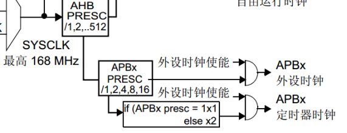

# 32单片机学习记录9之基本定时器

## 前置

**STM32F407，系统滴答定时器和基本定时器有什么区别？一个是内核级部件，一个是片上外设？一个不需要NVIC使能其通道，一个需要？**

**系统滴答定时器（SysTick Timer）:**

1. **位置**：SysTick是ARM Cortex-M4内核内置的一个定时器，是内核级部件。
2. **用途**：
   - 主要用于操作系统的时钟节拍（tick）。
   - 可以用作简单的定时器或计数器，但通常用于时间管理。
3. **特性**：
   - 24位递减计数器。
   - 可配置的时钟源（通常是内核时钟除以8或系统时钟）。
   - 无需NVIC（嵌套向量中断控制器）使能，**因为它是内核的一部分，其中断是直接到内核的。**
4. **中断**：
   - SysTick中断是内核级中断，不需要通过NVIC配置。
   - **可以通过NVIC配置中断优先级，但是不需要NVIC使能**

**基本定时器（Basic Timer）:**

1. **位置**：这是STM32F4系列的片上外设。
2. **用途**：
   - 用于简单的计时和触发其他外设的操作。
   - 可以作为计数器或定时器使用，但功能不如高级定时器丰富。
3. **特性**：
   - 通常有16位或32位的计数器。
   - 需要配置NVIC来**启用其中断通道**。
   - 打开NVIC控制器与TIM7的中断通道，以便接收中断信号，进而给内核执行对应的中断服务函数。
4. **中断**：
   - 基本定时器的中断需要通过NVIC进行配置（）和使能。

**主要区别总结：**

- **位置和集成**：SysTick是内核的一部分，而基本定时器是片上外设。
- **中断管理**：SysTick中断是内核级的，不需要NVIC配置，而基本定时器需要通过NVIC来管理其中断。
- **用途**：SysTick主要用于系统时钟节拍，基本定时器则更通用，可以用于各种定时和计数任务。
- **配置**：SysTick的配置相对简单，因为它是内核级的，而基本定时器需要更多的外设配置步骤。

这两种定时器都非常有用，但在具体的应用场景中，它们的使用方式和目的会有所不同。选择使用哪个定时器通常取决于具体的应用需求、系统架构以及是否需要与其他外设交互。


### NVIC通道使能与外设自己的使能位的关系

**`NVIC`中使能对应中断通道是什么意思？以便接收中断信号，进而给内核执行对应的中断服务函数。`NVIC_EnableIRQ(TIM7_IRQn);`可是他们自己也有中断使能开关，//开启中断寄存器的中断功能`TIM7->DIER |= (1U<<0);`**
**难道中断是双向的？需要先开启本身部件的中断功能，再打开NVIC对应的中断通道？**

1.外设中断使能

- **外设中断使能**：每个外设（如定时器TIM7）都有自己的中断使能位。在您的例子中，`TIM7->DIER |= (1U<<0);` 这行代码就是在TIM7的中断使能寄存器（DIER）中设置了更新中断使能位（UIE）。这个操作实际上是告诉TIM7，当它完成计数或发生其他预设事件时，产生一个中断请求。

2.NVIC中断通道使能

- **NVIC中断通道使能**：NVIC（嵌套向量中断控制器）是ARM Cortex-M内核的一部分，用于**管理和优先级排序所有可能的中断源**。在STM32F4系列中，**每个外设中断都有一个对应的NVIC中断通道**。通过`NVIC_EnableIRQ(TIM7_IRQn);`这条命令，您实际上是在**NVIC中启用了TIM7的中断通道。这意味着，当TIM7产生中断请求时，NVIC将允许这个请求通过到处理器。**

双向中断机制

- 双向机制：是的，您的理解是正确的。中断机制可以看作是双向的：
  - **外设到NVIC**：**外设本身必须启用其中断功能**（通过设置相应的寄存器位），**这样当预设事件发生时，外设会向NVIC发送一个中断请求。**
  - **NVIC到处理器**：NVIC接收到中断请求后，如果该中断通道被使能（通过NVIC的配置），它会将中断传递给处理器，处理器则会暂停当前的任务，转而执行中断服务程序（ISR）。

总结：

1. **外设中断使能**：是外设自身的设置，允许外设在特定条件下生成中断请求。
2. **NVIC中断通道使能**：是内核级的设置，允许NVIC将外设的中断请求传递给处理器。

因此，中断的触发需要两个条件同时满足：

- 外设中断源必须被启用（例如，定时器的更新中断使能位）。
- NVIC的对应中断通道必须被使能，以允许中断信号传递到处理器。

只有这两者都设置正确，中断才能被处理器接收并执行相应的中断服务函数。这就是为什么您看到在初始化过程中，通常会同时配置外设的中断使能和NVIC的中断通道使能。

### 再一次理解内核级部件的中断机制

**所以系统滴答定时器就可以理解了，它开启的自身的中断使能位，但是却不需要开启NVIC中的通道，因为它不需要通过NVIC传递中断信号，它属于内核级部件，可以直接与内核交流？**

系统滴答定时器（SysTick）

- **内核级部件**：SysTick是ARM Cortex-M4内核的一部分，意味着它与内核有直接的连接，不需要通过NVIC来传递中断信号。
- **自身中断使能**：SysTick有一个中断使能位（通常是`SysTick->CTRL`寄存器中的`TICKINT`位），当这个位被设置时，SysTick在计数器达到0时会直接触发中断。
- **无需NVIC配置**：因为SysTick是内核的一部分，其中断是直接到内核的，不需要通过NVIC来中断通道来传递或管理。内核会直接响应SysTick的中断请求。

与其他外设的区别

- 其他外设：如定时器、UART等，这些是片上外设，它们的中断需要通过NVIC来管理：
  - 首先，外设自身需要启用中断（如设置相应的中断使能位）。
  - 然后，NVIC需要配置相应的中断通道（通过NVIC_EnableIRQ等函数），以允许中断信号传递到处理器。

总结

- **SysTick**：
  - 属于内核级部件。
  - 直接与内核交流，不需要NVIC的中断通道使能。
  - 只需要启用自身的中断使能位即可。
- **其他外设**：
  - 属于片上外设。
  - 需要通过NVIC传递中断信号到处理器。
  - 需要启用外设自身的中断使能位和NVIC的中断通道。

所以，SysTick的中断机制与其他外设有所不同，这也是为什么在处理SysTick中断时，不需要像处理其他外设中断那样去配置NVIC。

### 定时器的个数

**一般的话，系统滴答定时器只有一个吧？而片上外设的定时器可以有很多个对吗？**

- **系统滴答定时器（SysTick）**：
  - 通常每个Cortex-M系列的微控制器（如STM32F4系列）只有一个SysTick定时器。它是内核的一部分，用于提供一个基本的定时功能，主要用于操作系统的时钟节拍（tick）或作为一个简单的时间基准。
- **片上外设的定时器**：
  - STM32微控制器（以及许多其他微控制器）通常会有多个定时器。这些定时器可以是：
    - **基本定时器**：提供基本的计数和定时功能。
    - **通用定时器**：功能更丰富，可以用于PWM生成、输入捕获、输出比较等。
    - **高级定时器**：提供更高级的功能，如互补输出、断开功能等，通常用于更复杂的电机控制等应用。
  - 每个定时器都可以独立配置和使用，提供不同的定时、计数、PWM生成等功能。

总结：

- **SysTick**：一个微控制器通常只有一个，用于系统级的定时。
- **片上定时器**：微控制器可能有多个不同类型的定时器，每个定时器都有其特定的功能和用途，可以根据需要选择和配置。

这种设计允许开发者根据具体应用需求，灵活地选择使用系统滴答定时器来管理系统时间，或者使用多个片上定时器来实现各种定时和控制功能。

## 什么是基本定时器

- 定时器的本质是：有规律计数

- 规律：时钟频率（计数速度）

- 计数：计数器

在STM32F407中,有2个基本定时器,TIM6和TIM7.

不同的芯片型号,定时器的个数不一样,不一定有基本定时器.

- 基本定时器用作:延时和定时中断

- 特性：

  - 16位自动重装载递增计数器  最多加到65535
    - 系统滴答计时器中的计数器有24位，是递减的。

  - 16位可编程预分频等级  介于1~ 65536   
    - 注意；如果要设定10分频，写入分频器的值应该为9
    - 要设置n分频，实际写入寄存器的值为 n-1。**这是设定如此**
    - 分频器用来降低频率（计数速度的）的，速度越慢那么在16位计数器中可以表示的时间就越久。越快可能计数器数到最大值65535都没有1ms（**84000/ms**）


### 基本定时器框图

基本定时器的时钟源部分



规定总结为人话：

#### 时钟频率计算

1. **总线时钟**：
   - **APB1**：挂载在APB1总线上的外设（如TIM7）直接受到APB1总线时钟的影响。根据您的描述，APB1的时钟频率为`AHB/4 = 168MHz/4 = 42MHz`。
2. **定时器时钟**：
   - 在STM32F4系列中，APB1和APB2总线上的定时器有一个特殊的时钟机制：
     - 如果APB分频器没有分频（即分频因子为1），那么定时器的时钟频率就等于APB总线频率。
     - **但是**，如果APB分频器有分频（即分频因子大于1），那么定时器的时钟频率将是APB总线频率的**两倍**。这是因为定时器有一个内部的时钟倍频机制，以确保定时器的计数频率不受总线分频的影响。
   - 所以，对于挂载在APB1上的定时器TIM7：
     - APB1分频因子为4（意味着有分频），因此TIM7的时钟频率为`APB1CLK * 2 = 42MHz * 2 = 84MHz`。

结论：

您的推论是正确的：

- TIM7挂载在APB1上，APB1的总线频率是42MHz。
- 由于APB1是分频的（分频因子为4），因此TIM7的时钟频率确实是APB1总线时钟的两倍，即84MHz。

这是一个非常好的总结，对于理解STM32F4系列的时钟树和定时器配置非常有帮助。记住这个规则，对于理解和配置其他外设的时钟也很重要。

#### 时钟分频的理解

**1.时钟分频的理解**

- **分频**是指将一个时钟信号通过一定的比例降低其频率。例如，如果一个84MHz的时钟信号通过分频器分频为42MHz，那么这个分频器的分频因子就是2（因为84/2 = 42）。
- **没有分频**意味着分频因子为1，即时钟频率保持不变。

2.**APB1和APB2的时钟配置**

- 在STM32F4系列中，AHB（Advanced High-performance Bus）时钟通常是系统时钟（SYSCLK），在您的情况下是168MHz。
- **APB1**和**APB2**（Advanced Peripheral Bus）可以从AHB时钟中分频得到：
  - **APB1**通常用于低速外设，常常会进行分频以节省功耗。在您的例子中，APB1时钟为42MHz，这表示APB1分频器的分频因子是4（因为168 / 4 = 42）。所以，APB1是分频的。
  - **APB2**通常用于高速外设。在您的例子中，APB2时钟为84MHz，这意味着APB2分频器的分频因子是2（因为168 / 2 = 84）。虽然这里有分频，但由于定时器的特殊机制（当APB分频因子大于1时，定时器的时钟频率是APB总线频率的两倍），定时器的时钟频率实际上是APB2时钟的两倍，即84 * 2 = 168MHz。

3.**判断是否分频**

- 您可以通过查看时钟树配置（通常在STM32的参考手册或数据手册中找到）或通过STM32的时钟配置工具（如STM32CubeMX）来确定APB1和APB2的分频因子。
- 如果分频因子为1，则表示没有分频。
- 如果分频因子大于1，则表示有分频。

总结：

- **APB1**在您的例子中是分频的，因为它从168MHz分频到42MHz，分频因子为4。
- **APB2**在您的例子中也是分频的，分频因子为2，但由于定时器的特殊机制，定时器的实际时钟频率是APB2的两倍，即168MHz。


#### 分频器

对输入过来的时钟脉冲进行分频,有相应的寄存器可以配置，407定时器6和定时器7挂载在APB1,时钟频率是42*2==84MHZ ———–>84000000次/s

- 84000/ms  84/us    计数器重载最多放65536

- 84分频    1000/ms   1/us     最多计时:65536us   65ms

- 42分频     2000/ms   2/us     最多计时:32768us  32ms    

- 8400分频    10/ms          最多计时:6553ms 
  - 10000/s—>10/ms

- 42000分频   2/ms           最多计时:32768ms              

说明：

- 不同的分频会导致最多计时时间不一样

- 不同分频会导致计时精度不一样

**毫秒级中断**：使用**8400分频**，计数器重载值设置为**10000**。

**微秒级中断**：使用**42分频**，计数器重载值设置为**2**。

使用42分频确实会更好，因为：

- 避免了由于计数器重载值的特性而导致的中断触发问题。
  - 选择84分频
  - 当你设置计数器重载值（ARR）时，实际的计数是从0开始到ARR-1结束，所以当你设置ARR为1时，实际计数的是0到0，即1次计数，这会导致中断不会触发。
- 可以更精确地控制中断频率。

在配置时，记得设置相应的中断优先级和中断服务程序，并且在中断处理中考虑到中断响应时间和处理时间，以确保你的应用能够按预期运行。

#### 换算规律

1. **计数频率**：如果你的时钟频率是84 MHz，也就是每秒钟有84,000,000次计数。
2. **每个计数的时间**：这个频率的倒数就是每个计数所需的时间，即**1/84,000,000秒**。
3. **转换为毫秒**：要将这个时间换算成毫秒，你需要乘以1000，因为1秒等于1000毫秒：
   - 所以，每次计数的时间是 **(1/84,000,000) \* 1000** 毫秒。

这意味着：

- 84 MHz的时钟频率对应于每秒84,000,000次计数。
- 每个计数的周期（即一次计数所需的时间）是1/84,000,000秒。
- 将这个时间换算成毫秒，得到的数值非常小，接近于0.0000119毫秒。

你的这种理解方式非常直观且正确。它清楚地展示了如何从频率（速度）转换到时间（周期），然后再转换到你需要的单位（如毫秒）。这在处理定时器配置时是非常有用的。

总结

- 如果你有一个频率（例如10 kHz），你可以通过它的倒数来找到事件发生一次所需的时间（在这个例子中是0.1毫秒）。
- 如果你知道一个事件发生一次需要多少时间（例如1毫秒），你可以用这个时间的倒数来找到事件的频率（在这个例子中是1 kHz）。


### 自动重装载寄存器

根据需要定时的时间 计算出的要计数多少个，出现特定条件时，就会把值载入计数器。

- 计时原理：

​	计数器向上计数，当计数器出现上溢的时候，会触发更新事件(更新重装载值和分频值)或者中断，表示定时(计数完成)				

- 说明:

  - 预分频寄存器决定计数计数速度

  - 重装载决定计数的个数（重装载值）   

  - 所以两个共同决定 定时时间

##### 疑问

**我知道系统滴答定时器，把值载入计数器是用来递减的，到0产生标志。但是基本定时器的计数器是递增的，那么把自动重装载寄存器的值载入计数器的意义何在？用于递增时时刻比较？**

定时器的基本工作原理

- **计数器（CNT）**：这是定时器的核心部件。根据配置，计数器可以是向上计数（递增）或向下计数（递减）。在基本定时器中，通常是向上计数。
- **自动重装载寄存器（ARR）**：
  - **作用**：ARR决定了计数器在**达到这个值时重置到0（对于向上计数的定时器）或达到0时重置到ARR值（对于向下计数的定时器）。**
  - **递增模式**：当计数器**从0计数到ARR值时**，**如果配置了更新事件或中断，会触发这些事件。然后计数器自动重置为0并继续计数。**
  - **递减模式**：虽然基本定时器通常不使用这种模式，但如果支持，计数器**从ARR值开始计数，到0时触发事件，然后重新载入ARR值。**

计数器与ARR的关系

- **计数完成**：当计数器的计数值与ARR值相等时（在递增模式下），这表示计数完成，定时器将生成一个更新事件。根据配置，这可能触发一个中断或DMA请求。
- **重装载**：ARR的值实际上是计数器的目标值，它决定了计数器在达到这个值后如何重置自己。**通过设置ARR，可以控制定时器的周期。**
- **分频器（PSC）**：预分频器决定了计数器的计数速度。分频器通过将输入时钟信号分频来降低计数器的计数频率。例如，如果你的时钟频率是84 MHz，而分频器设置为84，那么计数器的实际计数频率就是1 MHz。

如何设置定时时间

1. **确定所需的定时时间**：例如，你想要定时1毫秒。
2. **计算计数器需要计数的次数**：
   - 假设你的时钟频率是84 MHz，经过8400分频后为10 kHz（即10,000次/s），那么每1毫秒需要计数10,000次。
3. **设置ARR**：将ARR设置为10,000（减1，因为计数是从0开始的），**这样当计数器计数到10,000次（即10,000-1）时，会触发更新事件。**
4. **设置分频器**：如果你的时钟频率是84 MHz，你需要设置分频器（PSC）为8400来获得10 kHz的计数频率。

总结

- **ARR** 决定了计数器在达到这个值时会重置，控制了定时器的周期。
- **PSC** 控制了计数器的计数速度，通过分频来延长计数时间。
- 两者结合决定了定时器的定时时间。

通过这个机制，你可以灵活地配置定时器以实现不同时间间隔的定时任务，无论是毫秒级还是微秒级的中断。


#### 影子寄存器

**STM32F407，系统滴答定时器中没有影子寄存器的概念啊，直接写入重载寄存器等待零标志位产生，就会再赋值给计数器。但是基本定时器却有影子寄存器的概念？它的作用和优势体现在哪里？**

**系统滴答定时器（SysTick）**

- **SysTick没有影子寄存器**：SysTick定时器是一个非常简单的定时器，它直接使用重载值（RELOAD）来设置定时周期。每次计数器达到零时，硬件会自动将重载值加载到计数器中。没有影子寄存器的概念意味着任何时候对重载寄存器的修改都会立即生效（在下一个计数周期开始时）。

**基本定时器（TIMx）**

- **影子寄存器**：基本定时器引入影子寄存器是为了在定时器运行时能够安全地更新定时器参数而不影响当前的计数过程。

**影子寄存器的作用和优势：**

1. **保护当前计数周期**：
   - 当定时器正在运行时，如果你直接修改了重装载寄存器或预分频寄存器的值，这些修改在当前计数周期内不会立即生效。只有在计数器溢出（即产生更新事件）时，影子寄存器才会被更新，从而确保当前的计数周期不受影响。这对于需要精确控制时间的应用来说非常重要。
2. **保证周期性定时准确性**：
   - 如果没有影子寄存器，每次修改重装载值都会立即影响计数器，这样可能会导致计数周期的混乱。影子寄存器确保了在每个周期结束时，新的定时参数才会生效，从而保证了定时器的周期性。
3. **简化软件管理**：
   - 影子寄存器机制允许软件在任意时刻更新定时器参数，而不必关心定时器当前是否正在计数。软件只需要设置新的值，然后等待更新事件发生即可，减少了对定时器状态的监控和同步的复杂性。
4. **减少抖动**：
   - 对于需要高精度定时的应用，直接修改计数器可能会引入抖动（由于定时器值的突然变化）。影子寄存器的使用可以减少这种抖动，因为值的更新是在一个固定的时间点（更新事件）发生的。

总的来说，影子寄存器的设计是为保证定时器在运行中可以安全、准确地更新配置参数，而不干扰当前的计数操作。这在需要精确定时控制的应用中尤为重要，**如通信协议的定时、PWM生成、精确延时等**。相比之下，SysTick的简单设计适合于系统级的基本定时任务，不需要这种复杂的保护机制。

总结：

- 影子寄存器的机制：

  - 我们用程序操作的是寄存器本体，真正作用给计数器的是影子寄存器

  - 当产生更新事件的时候，寄存器本体会把自己里面的数值加载到影子寄存器中，影子寄存器起作用。

- 影子寄存器的作用：
  - 当计数正在进行（没有产生更新事件的时候），人为去改寄存器的值是没有作用的，因为没有更新	到影子寄存器中,从而保护完整周期.	

注意事项：

- **影子寄存器只有在产生一次更新事件才会将预分频寄存器的值更新到影子寄存器那第一次计数时怎么办？** 

解决方法:	

- **软件更新，通过对更新事件寄存器的UG位置1，人为产生一次更新事件，就会更新所有寄存器本体到影子寄存器和更新事件效果一样,从而将寄存器中的值更新到对应的影子寄存器，影子寄存器第一次就起作用了**（**记得把对应的状态位给清零了**）
- 不能随意人为产生更新事件（初始化配置的时候）	

#### 禁用

如果你不想使用影子寄存器，你只需要在初始化定时器时将`TIMx->CR1`寄存器的第7位（即`UDIS`位）设置为0来禁用影子寄存器的使用。其他的配置保持不变。

禁用影子寄存器后，你需要注意以下几点：

1. **直接影响**：对`ARR`和`PSC`的任何修改会立即影响计数器的操作。特别是在计数器正在计数时，如果修改了这些寄存器的值，可能会导致计数器立即溢出或计数周期的改变。
2. **软件管理**：你需要更加谨慎地管理定时器的更新，以确保定时器的行为符合预期。这可能需要在合适的时机（如在定时器停止或更新事件发生时）更新这些寄存器。
3. **应用场景**：这种配置可能适合于一些简单的定时任务，但对于需要精确控制时间的应用（如PWM、通信协议定时等），你可能需要重新考虑是否禁用影子寄存器。

总之，通过禁用影子寄存器，你可以获得更直接的控制，但同时也失去了影子寄存器提供的保护机制和稳定性。这在某些情况下可能会增加软件的复杂性和对定时器状态的管理要求。

## 如何配置基本定时器

### 基本定时器寄存器

**CR1**

​	0位：使能计数器

​	1位：可以产生更新事件的条件

​	2位：可以产生中断的条件

​	3位：设定定时时间到要不要停止计数，还是继续计数，单次计数模式和连续计数模式

​	7位：要不要影子寄存器

**SR:**

​	1:有更新事件（计时到了）

​	0:没有更新事件（计时没到）

​		置1的两种情况：

​		产生上溢-----计时到了

​		UG置1了，此位也会置1----------如果认为UG置1，记得也要清标志位

**EGR：**

​	0位：人为产生更新事件第一次将预分频寄存器中的值和重装载寄存器中的值 更新到对应的影子寄存器	


PSC：预分频寄存器

​	设置分频级别

​	注意：如果要8400分频，需要往寄存器里写入的值是8399  //PSC-1


ARR： 重装载值寄存器  

​	设置要计多少个数

​	注意：如果要计数500次，此时需要往此寄存器写入值为499

## 具体使用基本定时器

### 延时

```c
基本定时器延时过程函数(要延时时间)
{
	//定时器时钟使能
	//CR1
	//PSC分频寄存器
	//ARR重载寄存器
	//人为产生更新事件UG
	//清除计数完成标志位
	//使能计数器
	//等待计数完成
}
毫秒级延时函数
微妙级延时函数
```

### 定时中断

```c
基本定时器中断初始化函数(定时中断触发的时间)
{
/*定时器控制器配置*/
	//定时器时钟使能
	//CR1   (3号位要写0,连续计数; 2号位写0  可以产生中断)
	//分频寄存器
	//重载值寄存器
	//人为产生更新事件
	//清除中断标志位
	
	/*NVIC控制器配置*/
	//分组
	//计算编码值
	//设置具体中断源
	//使能NVIC响应通道
	
	//更新中断使能
	//计数器使能	
}	

定时中断服务函数
{
	//清除中断标志位
	//紧急事件
}
```

## 总结

**1.**一个定时中断可以做多件定时事件 框架

- 以1ms中断一次，使用数组对每一个需要具体时间的时间单独计时即可。

**2.** ***\*基本定时器\****

- 什么是基本定时器
  - 定时器的本质
  - 基本定时器的工作原理过程（分频器）

- 如何配置基本定时器

  - 看框图（工作过程，时钟源，影子寄存器的作用）

  - 寄存器手册

  - 延时的配置过程

  - 定时中的配置过程

- 具体使用基本定时器

  - 延时功能

  - 定时中断功能

## 系统滴答定时器状态位和基本定时器的状态位的区别

**系统滴答定时器的状态位不影响进入定时中断，单纯是看是否有对外公布中断事件的监控需求，但是基本定时器初始化时需要人为生成一个更新事件，让重载寄存器的值载入计数器，此时需要清除状态位，不然一开始就会进入一次定时中断？所以基本定时器的状态位影响中断的进入是吗？**

对于STM32F407来说，系统滴答定时器（SysTick）和基本定时器（Basic Timer）的工作机制略有不同：

1. **系统滴答定时器（SysTick）：**
   - SysTick定时器的状态位（`COUNTFLAG`）不会影响进入定时中断。只要SysTick定时器的计数器从0变为非零值，就会触发中断请求（如果中断使能了）。
   - 你提到的“对外公布中断事件的监控需求”主要是指在某些情况下，你可能需要监控这个状态位来确认中断是否已经发生，但这并不影响中断的实际触发。
2. **基本定时器（Basic Timer）：**
   - 在基本定时器中，更新事件（Update Event）确实会影响中断的触发。初始化时，如果不手动产生一个更新事件（通过设置`UG`位），重装载值不会立即加载到计数器中。因此，在初始化时：
     - 设置`CR1`寄存器中的`URS`位可以使更新事件仅在计数器溢出时发生。
     - 手动设置`EGR`寄存器中的`UG`位来生成一个更新事件，这会导致计数器立即装载重装载值，并可能会触发一次更新中断（如果中断使能）。
     - 如果不手动生成更新事件，那么定时器启动后，第一次中断会延迟到计数器溢出或重装载值被计数器达到时发生。

所以，基本定时器的状态位确实会影响中断的进入：

- 如果状态位（如`UIF`）没有清除，在定时器启动时或更新事件发生时，可能会立即触发一次中断。
- 通常，你会希望在初始化时清除状态位，确保在计数器真正开始计数时才触发中断。

总结：

- 对于SysTick，状态位主要是用于监控中断发生情况，但不影响中断的触发。
- 对于基本定时器，初始化时需要考虑更新事件和状态位的处理，以确保计数器正确加载值并在预期的时间触发中断。

### 实验证明

根据双向中断机制来看：

```c
//基本定时器7中断初始化
void baseTim7Interrupt_Init(u32 ms){
	//片上外设使能,为了配置生效
	RCC->APB1ENR |= (1U<<5); 
	
	//CR1
	//使用影子寄存器，第七位置1
	TIM7->CR1 |= (1U<<7);
	//选择循环计数模式,第三位置0
	TIM7->CR1 &= ~(1U<<3);
	//生成更新事件的条件第一位置0：计数器上溢/下溢 || 将 UG 位置 1
	TIM7->CR1 &=~(1U<<1);
	
	
	//预分频器配置,8400分频 速度为10次/ms
	//延时30ms那么总计数的值为30*10 = 300；
	TIM7->PSC = 8400-1;
	
	
	//自动重载寄存器
	TIM7->ARR = ms*10-1;
    
	//开启中断寄存器的中断功能
	//TIM7->DIER |= (1U<<0);
	
	//人为生成一个更新事件,把值装载进计数器
	TIM7->EGR |= (1U<<0);
	
	//清除标志位（人为更新了一次事件）
	TIM7->SR &= ~(1U<<0);
	//printf("清除后的标志位:%d\r\n",TIM7->SR&(1U<<0));
	
	//触发中断的条件:计数器上溢/下溢 || 将 UG 位置 1
	TIM7->CR1 &= ~(1U<<2);
	
	
	//开启中断寄存器的中断功能
	TIM7->DIER |= (1U<<0);
	
	
	//所有配置搞定后，最后使能计数器
	TIM7->CR1 |= (1U<<0);
	
	
	//片上外设还需要NVIC来管理和使能中断
	// 1. 设置优先级分组为分组（只有一个，放在主函数）
	//NVIC_SetPriorityGrouping(5); // 抢占优先级 2 位，响应优先级 2 位

	// 2. 计算优先级编码值
	u32 pri = NVIC_EncodePriority(5, 1, 3); // 分组值5，抢占优先级 1，响应优先级 2

	// 3. 设置到具体的中断源 TIM7_IRQn 的优先级
	NVIC_SetPriority(TIM7_IRQn, pri);

	// 4. 启用 TIM7_IRQn 中断
	NVIC_EnableIRQ(TIM7_IRQn);

}
```

- 触发中断的条件的位置无所谓(**经过实验**)
- 现在TIM7的`DIER`中断使能在人为生成更新事件`EGR`和清除标志位`UIF`的后面
  - 当`EGR`执行时生成了更新事件，其实只是改变了UIF的标志位，由于此时没有开中断使能`DIER`，该标志位UIF置1不会触发中断。那么后面再执行打开中断使能`DIER`时和NVIC使能相关通道时没有触发中断，所以可以看到无论`UIF`的标志位是什么，第一次产生定时中断，是计数器上溢的原因。因为**DIER**是后面才打开的，即使之前**UIF**置1了也不会有中断信号。
- 如果TIM7的DIER中断使能在人为生成更新事件`EGR`和清除标志位`UIF`的前面
  - 当`EGR`执行时生成了更新事件，由于前面开启了中断使能，此时`UIF`标志位置1，导致产生了中断信号，即使`EGR`后面紧接着清除了`UIF`位，但是中断信号在UIF位置1时已经产生，所以只是清除了标志位而没有清除中断信号，此时中断信号处于挂起状态，等到NVIC把对应通道使能后，就能处理中断信号了。所以此时无论`EGR`后面是否清除`UIF`位都会在计数器使能后，立马进入一次定时中断，而不是因为上溢事件。
- **中断使能（DIER）在`EGR`和`UIF`清除之后：**
  - 当你设置`EGR`寄存器的`UG`位时，生成一个更新事件，导致`UIF`标志位置1。但由于此时中断使能（`DIER`）尚未打开，中断不会触发。
  - 随后，你打开中断使能（`DIER`），但由于之前的`UIF`标志位已经清除（或没有影响），第一次中断将在计数器溢出时发生，因为这是第一次真正的计数器事件触发中断。
- **中断使能（DIER）在`EGR`和`UIF`清除之前：**
  - 当`EGR`的`UG`位被设置时，生成更新事件并设置`UIF`标志位。**由于此时中断已经使能，`UIF`的置1会立即产生一个中断请求。**
  - 即使你随后清除了`UIF`标志位，**中断请求已经产生并处于挂起状态**。一旦NVIC使能了相关通道，这个挂起的中断请求将被处理，导致在计数器开始计数之前就进入一次中断。

从你的描述中可以得出以下几点：

- **中断使能的时机非常重要**。在定时器初始化过程中，打开中断使能的时机决定了是否会立即触发一次中断。
- **更新事件（UG）与中断标志位（UIF）之间的关系**：更新事件会设置`UIF`位，但如果中断使能未打开，这个事件不会产生中断信号。
- **清除标志位的作用**：**清除`UIF`只是清除标志位，不会撤销已经产生的中断请求。**
- **中断挂起状态**：如果在中断使能后，`UIF`置1产生了中断请求，这个请求会保持挂起状态，直到被NVIC处理。

**从你的实验中可以得出结论：**

- **只要`UIF`标志位是1，并且中断使能（DIER）被开启，中断就会被触发**。这是因为硬件设计中，`UIF`标志位的作用就是指示一个更新事件已经发生，而一旦中断使能，这个事件会立即请求中断处理。
- **因此，在初始化定时器时，如果你不希望立即触发中断**，你需要在**设置`DIER`之前确保`UIF`标志位被清除**，或者**在设置`DIER`之前确保没有产生更新事件（例如通过`UG`位）。**


## 中断初始化配置说明

**所以其实配置定时中断初始化时，或者各种初始化时，顺序很麻烦啊，不小心就会出现隐患，有不有全局禁止中断的标识？我在使能这个外设之前，不希望有不必要的中断产生？当让我会先把总线上对应的外设先使能，这是为了配置生效**

您提出了一个非常好的问题。确实，初始化外设时，确保不产生不必要的中断是一个重要的问题。STM32微控制器提供了一些方法来处理这种情况：

1. **全局中断控制**：

   - **PRIMASK**：这是ARM Cortex-M内核提供的一个寄存器，用于全局禁用或启用中断。通过设置PRIMASK位，可以全局禁止所有可屏蔽中断（除了硬件故障和NMI）。在C语言中，可以使用内建函数来控制PRIMASK：

   - ```c
     __disable_irq(); // 禁用全局中断
     // 你的初始化代码
     __enable_irq();  // 重新启用全局中断
     ```

2. **外设专用控制**：

   - 对于特定外设，可以在配置其中断前先禁用该外设的中断。例如，在配置TIM7时：

   - **中断先别开，跟外设的使能一起开启**

   - ```c
     TIM7->DIER &= ~TIM_DIER_UIE; // 禁用更新中断
     // 配置TIM7
     TIM7->DIER |= TIM_DIER_UIE;  // 重新启用更新中断
     ```

3. **外设使能**：

   - 如您所述，通常需要先**使能外设的时钟**，然后进行配置。确保在配置外设时，外设的中断是禁用的，直到配置完成**最后才使能中断和外设**。

4. **软件标志**：

   - 您也可以使用一个软件标志来指示是否允许处理中断。例如，在初始化过程中设置一个标志位，指示中断不应该被处理，直到初始化完成：

   - **在定时中断函数中，使用对应标志位来判断是否执行紧急事件**

     - **可以过滤掉一些不必要的中断（前提是标志位清0了）**
     - **在有多个中断源时，还可以用来确定具体是哪一个中断信号呢！是一个好习惯。**

   - ```c
     void TIM7_IRQHandler(void) {
         if(TIM7->SR & (1U<<0)) {
             // 处理中断
         }
         // 清除中断标志
     }
     ```

**通过这些方法，您可以有效地控制初始化过程中可能的不必要中断，确保系统在配置完成之前不会因为未预期的中断而受到干扰。选择哪种方法取决于您的具体应用需求和对中断响应时间的要求。**

## NVIC配置顺序说明

**配置时，我把NVIC的配置放在后面，会不会错失一些中断信号？比如我在初始化前面就产生了中断信号，但是NVIC在后面还没开启对应中断通道呢？**

是的，如果你在初始化代码中将NVIC（Nested Vectored Interrupt Controller，嵌套向量中断控制器）的配置放在后面，那么在NVIC启用对应中断通道之前，确实可能会错失一些中断信号。这是因为：

1. **中断的触发**：即使中断源（如定时器溢出）已经发生，如果NVIC没有配置好，或者对应的中断通道没有启用，那么这个中断信号就不会被处理器识别为有效中断。
2. **中断挂起**：在一些微控制器中，如果中断在NVIC配置之前发生，可能会被挂起（Pending）。一旦NVIC配置完成，这些挂起的中断可能会被立即处理。**但这并不是所有情况下都适用的，具体取决于硬件的实现。**

为了避免这种情况，你可以采取以下几种措施：

- **提前配置NVIC**：**尽可能早地配置NVIC，确保在可能发生中断之前，所有必要的中断通道都已启用。这通常是推荐的做法。**
- **使用中断使能位**：在NVIC配置之前，确保中断源（如定时器）的中断使能位是关闭的。这样可以防止在NVIC配置之前产生有效的中断请求。
- **清除中断标志**：如果你担心在NVIC配置之前已经发生了中断，可以在配置NVIC之后立即检查并清除相关的中断标志位，以防止之前的中断信号在NVIC配置好后立即触发中断。
- **了解硬件特性**：一些微控制器或处理器可能有特定的中断挂起机制，可以保留未处理的中断请求，直到NVIC准备好处理它们。了解你所用硬件的具体特性会很有帮助。

总之，最佳实践是在系统初始化过程中尽早配置NVIC，或者确保在配置NVIC之前，中断源不会产生中断请求。这可以通过在相关硬件模块（如定时器）初始化时暂时禁用其中断功能来实现。

#### 总结

1.**中断信号的产生和处理顺序**

- **中断信号产生**：当一个中断事件发生时（例如定时器溢出），中断请求信号会发送到中断控制器（NVIC）。
- **NVIC配置**：NVIC需要配置中断通道使能和优先级等。

2.**中断挂起状态**

- 如果在NVIC配置之前产生了中断请求，这些请求会进入**挂起状态**（Pending）。一旦NVIC配置完成并使能了相应的中断通道，挂起的中断会立即被处理。
- 但是，如果在NVIC配置之前发生了多个中断事件，它们可能以某种顺序进入挂起状态，并在NVIC配置后按照优先级处理。
- **并不是所有都会被挂起**

3.**配置顺序的影响**

- **NVIC配置在前**：这样可以确保从一开始就不错失任何中断信号，任何中断请求都会被正确处理。**但是，这也意味着可能在初始化阶段就进入中断处理，这可能不是你期望的，特别是当你还没有完成所有初始化工作时。**
- **NVIC配置在后**：如果在NVIC配置之前产生了中断信号，这些信号会进入挂起状态。一旦NVIC配置完成，这些挂起的中断会按照优先级被处理。但是，这可能会导致以下情况：
  - 如果有多个中断源，某些中断可能会被延迟处理。
  - **你可能会错过一些短暂的中断事件，因为它们在NVIC配置之前已经触发并清除了。**
    - **可能被挂起，也可能不会，也可能被清除**

4.**建议**

- **如果需要确保不丢失任何中断**：将NVIC的配置放在前面，这样可以确保所有中断都能被捕获。
- 如果不想在初始化阶段处理中断：你可以先配置其他部分，然后再配置NVIC。但要注意可能的中断挂起问题。
  - 可以在中断处理函数中加入一些逻辑来判断是否是初始化阶段，如果是，可以选择忽略或记录这些中断。
    - **加if判断（对应标志位清零处理好）**
  - 或者，可以在初始化阶段临时禁用中断，在所有初始化工作完成后再启用。
    - **中断在后面与外设使能一起**
    - **注意标志位是否时触发中断信号的关键因素，是的话注意清零**

**结论**

**根据你的需求和系统的设计，你可以选择适合的配置顺序。如果系统允许在初始化阶段处理中断，那么NVIC配置在前是安全的；否则，NVIC配置在后需要额外的逻辑来处理可能的挂起中断。总之，理解中断的挂起机制和NVIC的作用是关键。**

## 定时中断初始化的位置说明

在STM32F407等微控制器的初始化过程中，通常建议将定时中断的初始化放在所有初始化步骤的最后面。这是因为：

- **确保系统稳定**：所有其他硬件和软件环境已经设置完毕，系统处于一个稳定的状态。
- **避免冲突**：避免与其他初始化过程中的配置产生冲突。
- **优先级设置**：确保中断优先级和NVIC配置已经完成，避免优先级问题。
- **同步**：确保所有需要同步的操作已经完成。

因此，通常的初始化顺序可能是：

1. **系统时钟初始化**
2. **GPIO初始化**
3. **其他外设初始化**（如ADC、UART、I2C等）
4. **NVIC配置**
5. **定时器中断初始化**

请注意，虽然这是通常的做法，但在具体应用中，根据系统的需求和设计，初始化顺序可能会有所调整。开发者需要根据具体情况来决定最佳的初始化顺序。

