# STM32工程创建详解

## 目前的开发方式

- 基于寄存器
  - **核心特点**：直接通过地址操作寄存器配置外设。（地址基本上使用宏定义替代了，基本是直接寄存器访问）
  - **优点**：
    - **极致性能**：代码直接控制硬件，无中间层开销，运行效率最高。
    - **代码精简**：生成的二进制文件体积最小，适合资源受限的芯片（如Flash/RAM小的型号）。
    - **深入理解硬件**：适合学习底层硬件原理，掌握芯片架构。
  - **缺点**：
    - **开发效率低**：需手动查阅数百页参考手册，**逐位配置寄存器**，调试困难。
    - **可维护性差**：**代码逻辑与硬件绑定，移植到其他芯片需大量修改**。
    - **易出错**：**寄存器位掩码操作易遗漏细节（如未清除标志位导致死循环）**。
  - **适用场景**：
    - 资源敏感型项目（如Bootloader）、对执行时间有苛刻要求的场景（如高精度PWM）、嵌入式教学或硬件原理研究。
- 基于官方标准外设库
  - **核心特点**：ST官方提供的寄存器封装库（如`stm32f10x_gpio.h`）。
  - **优点**：
    - **开发效率提升**：通过函数接口（如`GPIO_Init()`）简化配置，减少寄存器操作。
    - **代码可读性高**：函数命名规范（如`USART_SendData()`），逻辑更清晰。
    - **移植性增强**：同一系列芯片（如STM32F1/F4）代码可复用。
      - 每一个系列的库函数不一样，固件库都不一样。
  - **缺点**：
    - **维护停止**：**ST已于2013年停止更新，不支持新系列芯片（如STM32H7/G0）**。
    - **中间层冗余**：部分函数包含非必要的判断逻辑，**代码效率略低于直接操作寄存器**。
    - **学习资源减少**：随着HAL库普及，新教程和社区支持逐渐减少。
  - **适用场景**：
    - 维护旧项目、对代码效率有一定要求的中小型项目，或学习者过渡到寄存器开发的中间阶段。
- 基于HAL库
  - **核心特点**：ST主推的抽象层库，配合STM32CubeMX工具实现图形化配置。
  - **优点**：
    - **快速开发**：通过CubeMX生成初始化代码，自动处理时钟、引脚复用等复杂配置。
    - **跨系列兼容**：同一API支持不同STM32系列（如F4与L4），**移植成本低**。
    - **功能丰富**：集成中间件（如FreeRTOS、USB协议栈），适合复杂应用。
    - **持续维护**：ST持续更新，支持最新芯片（如STM32U5）和功能（如低功耗模式）。
  - **缺点**：
    - **代码臃肿**：抽象层级多，生成的代码量大（可能多出30%-50%）。
    - **效率较低**：回调机制和通用化设计引入额外开销，实时性敏感场景需优化。
    - **黑箱风险**：**过度依赖工具生成代码，底层问题调试困难（如DMA配置错误）。**
  - **适用场景**：
    - 中大型项目、快速原型开发、跨平台移植需求，或团队协作时降低硬件知识门槛。

## 固件库结构说明

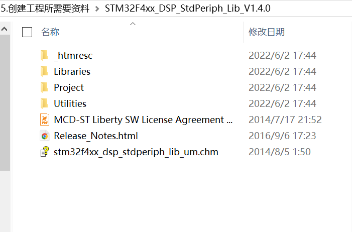

### _htmresc

两张图片没有用，**`_htmresc` 文件夹**

- **作用**：存放网页相关资源文件（如HTML/CSS/图片），通常用于生成或展示库的在线文档。
- **内容示例**：
  - 图标、样式表、网页排版资源
  - 与库文档（如`Release_Notes.html`）配套的视觉元素

### Libraries（核心目录）

这里面包含了库函数的文件，创建工程时会用到

- **作用**：存放STM32硬件相关的驱动库和核心支持文件。
- **关键子目录**：
  - **`CMSIS`**：
    - **`Device/ST/STM32F4xx`**：包含STM32F4芯片的启动文件（`.s`汇编文件）、链接脚本（`.ld`）、系统初始化代码（`system_stm32f4xx.c`）以及**芯片特定的头文件**（如`stm32f407xx.h`）。
    - **`CMSIS/Core`**：ARM官方提供的Cortex-M内核抽象层，定义中断向量表、内核寄存器等（如`core_cm4.h`）。
  - **`STM32F4xx_StdPeriph_Driver`**：
    - **`src`**：标准外设库的C源码文件（如`stm32f4xx_gpio.c`、`stm32f4xx_usart.c`）。
    - **`inc`**：标准外设库的头文件（如`stm32f4xx_gpio.h`、`stm32f4xx_rcc.h`）。
  - **`DSP_Lib`**（如果支持DSP）：
    - 数字信号处理（DSP）库源码，用于数学加速（如FFT、滤波、矩阵运算）。

### Project

官方提供的工程示例和模板，用作参考

- **作用**：提供示例工程模板和演示代码。
- **关键子目录**：
  - **`Examples`**：针对不同外设的示例代码（如GPIO翻转、USART通信、定时器PWM输出）。
  - **`Templates`**：空工程模板，包含最小化的初始化代码（如`main.c`、`stm32f4xx_conf.h`）。
  - **`EWARM`、`MDK-ARM`、`TrueSTUDIO`**：针对不同IDE（IAR、Keil、STM32CubeIDE）的工程文件。

### Utilities

测评STM32的

- **作用**：提供与ST官方评估板（如STM32F4-Discovery）配套的实用代码。
- **内容示例**：
  - 板载外设驱动（如LCD屏、陀螺仪、LED控制）。
  - 演示程序（如综合实验、传感器数据采集）。

### MCD-ST Liberty SW License Agreement V2

**作用**：ST库的软件许可协议文件，明确库的使用条款和限制（如商业用途需遵守的规则）

### Release_Notes

- **作用**：版本更新日志，记录当前库版本的：
  - 新增功能（如支持新芯片型号）
  - 已知问题与修复
  - 兼容性说明（如与其他库的配合使用）

### stm32f4xx_dsp_stdperiph_lib_um

- **作用**：库的离线用户手册（Windows帮助文件格式），包含：
  - 库的架构说明
  - API函数详细文档（参数说明、返回值、使用示例）
  - 硬件配置指南（如时钟树设置、外设初始化流程）

### **关键文件补充说明**

| 文件/目录      | 典型路径                                                     | 重要性 |
| :------------- | :----------------------------------------------------------- | :----- |
| 启动文件       | `Libraries/CMSIS/Device/ST/STM32F4xx/Source/Templates/arm/`  | 必需   |
| 系统时钟配置   | `Libraries/CMSIS/Device/ST/STM32F4xx/Source/Templates/system_stm32f4xx.c` | 必需   |
| 外设库配置文件 | `Project/STM32F4xx_StdPeriph_Templates/stm32f4xx_conf.h`     | 必需   |
| 芯片头文件     | `Libraries/CMSIS/Device/ST/STM32F4xx/Include/stm32f4xx.h`    | 必需   |

### **注意事项**

启动文件

- 提供中断向量表和复位后初始化汇编代码。根据使用的编译器选择对应的启动文件。

系统时钟配置（配置各总线频率，主频等）

- 配置系统时钟（HSE、PLL、时钟树等），用于 `SystemInit()` 初始化。

外设库配置文件

- 控制 STM32 标准外设库的功能启用（如 GPIO、USART、SPI、I2C）。
- 如果使用 STM32 HAL 库，则：
  - `stm32f4xx_conf.h` 在 HAL 中不再需要。

**芯片头文件**

- **芯片型号的选择宏定义**
  这个文件通常会通过 `#define STM32F407xx` 这样的宏来指明具体的芯片型号，确保代码编译时能够正确匹配对应的寄存器定义和外设资源。
- **外设寄存器结构体定义**
  STM32 的寄存器通常使用结构体来定义，每个外设（如 GPIO、USART、SPI 等）都有相应的结构体，其中包含该外设的所有寄存器字段。这些结构体用于直接访问硬件寄存器。
- **外设基地址宏定义**
  每个外设在 STM32 芯片的内存映射中都有固定的地址。例如，GPIO 端口、定时器、ADC 等的基地址都会在该头文件中定义，并用于结构体的地址映射。
- **中断向量表定义**
  该文件通常包含所有外设和系统级中断的定义，例如 `EXTI0_IRQn`、`TIM2_IRQn`，这些定义用于 NVIC（嵌套向量中断控制器）配置中。
- **设备内存映射**
  该头文件会定义 STM32 芯片的 Flash、SRAM 以及外设的内存映射区域，确保开发者可以正确地访问这些资源。
- **位定义宏（寄存器位掩码）**
  每个外设寄存器的各个位通常会有对应的宏定义，以方便开发者进行位操作。例如 GPIO 模式寄存器中的 `GPIO_MODER_MODER0` 可能会定义成特定的数值，方便用于位操作。
- **调试和系统控制相关定义**
  包括芯片 ID、调试相关寄存器、低功耗模式、复位和时钟控制（RCC）等的定义，这些内容用于芯片的初始化、调试和系统管理。

这个文件的作用是提供 STM32F407xx 这款芯片的所有低级硬件定义，使开发者能够直接访问硬件寄存器，同时也为库函数提供底层支持。


1. **不要直接修改库文件**：建议将库文件视为只读，自定义代码应放在用户目录中。

   1. `system_stm32f4xx.c` **可以修改**，用于调整时钟初始化（如改变 `SystemCoreClock`）。其他库文件（`stm32f4xx.h`、`stm32f4xx_conf.h`）尽量不改，防止升级库时冲突。

2. **头文件包含路径（Keil 配置）** 在 Keil **C/C++ Include Paths** 里，需添加：

   1. 在 STM32 标准外设库（StdPeriph Library）或 CMSIS 库中，通常需要包含以下路径：

   | **包含路径（Keil 配置中的 "C/C++ Include Paths"）** | **主要包含的头文件（`.h`）**                                 |
   | --------------------------------------------------- | ------------------------------------------------------------ |
   | `Libraries/CMSIS/Include`                           | `core_cm4.h`（Cortex-M4 内核定义） `core_cmFunc.h` `core_cmInstr.h` |
   | `Libraries/CMSIS/Device/ST/STM32F4xx/Include`       | `stm32f4xx.h`（STM32F4 芯片寄存器定义） `system_stm32f4xx.h`（时钟系统相关） |
   | `Libraries/STM32F4xx_StdPeriph_Driver/inc`          | `stm32f4xx_gpio.h`（GPIO 相关） `stm32f4xx_rcc.h`（时钟相关） `stm32f4xx_usart.h`（串口相关）等 |

   2. 如果你手动提取了 STM32 库文件，并且给它们重新命名，那么你需要确保包含了以下关键头文件：
      1. **CMSIS 相关头文件**：这些文件定义了 ARM Cortex-M4 内核相关的寄存器、指令、异常处理等。
      2. **主要文件**：
         - `core_cm4.h` → Cortex-M4 内核寄存器、指令
         - `core_cmFunc.h` → 内核功能相关
         - `core_cmInstr.h` → 内核指令封装
      3. STM32F4 设备头文件：这些文件定义了 STM32F4 系列芯片的寄存器地址、时钟初始化等。
      4. **主要文件**：
         - `stm32f4xx.h` → STM32F4 的全部寄存器宏定义，如 `GPIOA->ODR`
         - `system_stm32f4xx.h` → 时钟系统初始化，通常用于 `SystemInit()`
      5. 标准外设库头文件（StdPeriph Driver）：这些文件是 STM32F4 标准外设库（StdPeriph Library）的一部分，提供 GPIO、RCC（时钟）、USART、SPI、I2C 等外设的驱动。
      6. Libraries/STM32F4xx_StdPeriph_Driver/inc/（**所有文件**）

3. **启动文件选择**：根据芯片型号和编译器（如IAR/Keil/GCC）选择对应的启动文件（如`startup_stm32f407xx.s`）。

## 基于标准库的工程创建

### 空工程

可以先创建一个项目的总文件夹里面包含各种资料或者说明文档，外加一个工程文件夹（keil在这个文件夹下创建工程）

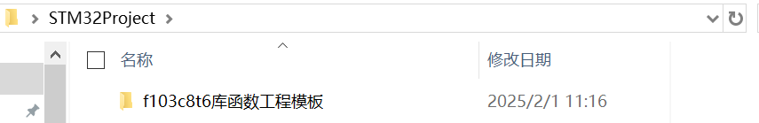

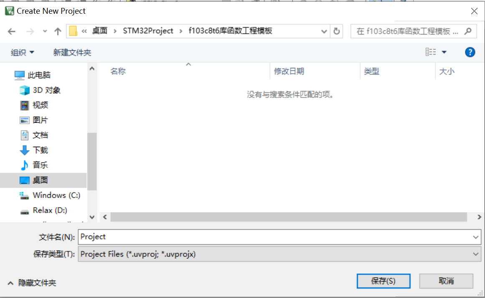

**前提是安装了对应的芯片支持包**


**这个新建工程小助手，用于快速新建工程（暂时不用）**

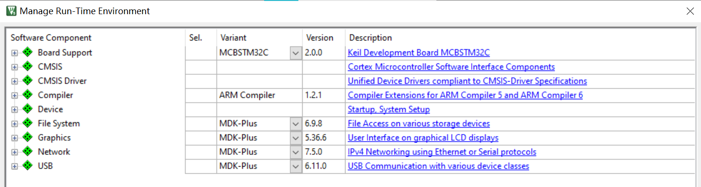

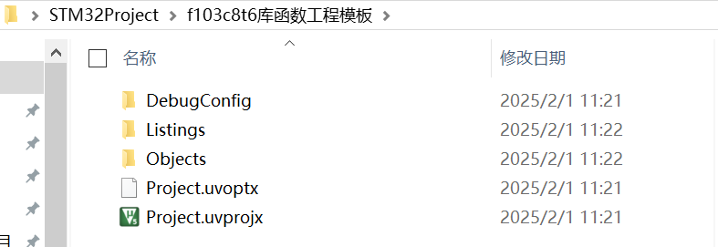

#### 空白工程各文件夹作用

**DebugConfig 文件夹**

- 作用：存放调试相关的配置文件，通常用于存储 IDE（如 Keil uVision、STM32CubeIDE）调试器的设置。
- 内容：
  - 可能包含 `.ini`、`.dbg`、`.log` 等调试相关的文件。
  - 配置与芯片调试接口（如 J-Link、ST-Link、CMSIS-DAP）相关的信息。

**Listings 文件夹**

- 作用：存放汇编和编译过程中生成的列表文件（Listing Files），用于调试和分析代码。
- 内容：
  - `.lst` 文件：包含汇编代码、机器码、地址映射等信息，方便查看 C 代码与汇编代码的对应关系。
  - `.map` 文件：存储工程的内存分布信息，主要用于分析内存占用情况。

**Objects 文件夹**

- 作用：存放编译后的中间文件，如目标文件（`.o` 文件）、静态库文件（`.a` 文件）、可执行文件（`.axf` 文件）。
- 内容：
  - `.o` 文件（Object File）：C 语言代码编译后的目标文件，尚未链接成最终可执行文件。
  - `.axf` 或 `.elf` 文件：最终生成的可执行文件，可用于调试。
  - `.map` 文件：存储详细的链接信息，如变量、函数、地址映射等。
  - `.hex` / `.bin` 文件：用于烧录到 STM32 芯片的固件文件（在 Keil 编译时生成）。

**Project.uvoptx**（Keil uVision 选项配置文件）

- 作用：存储 Keil 工程的用户个性化设置，如窗口布局、断点、调试选项等。
- 特点：
  - 这是 Keil uVision 5 使用的 XML 格式的项目选项文件。
  - 主要是 IDE 相关的个性化设置，不影响编译结果。

**Project.uvprojx**（Keil uVision 项目文件）

- 作用：存储整个 Keil 工程的配置信息，包括：
  - 代码文件的组织结构（源文件、头文件、库文件等）。
  - 目标芯片的型号和编译选项（编译器、优化级别、内存配置等）。
  - 链接器脚本、调试器设置等。
- 特点：
  - 这是 Keil uVision 5 的工程文件，采用 XML 格式（Keil uVision 4 版本为 `.uvproj`）。
  - 这个文件是工程的核心，通常与 `Project.uvoptx` 一起使用。

#### 总结

**Keil 工程文件（`.uvprojx`、`.uvoptx`）**

- `Project.uvprojx`：主工程文件，用于打开整个项目。
- `Project.uvoptx`：Keil 个人配置文件（窗口布局、调试设置等），不影响编译。
- **一般情况下，用户只需要用 `.uvprojx` 打开项目，不需要修改这些文件。**

**Objects 文件夹（存放编译输出文件）**

- `.hex` 文件：用于烧录到 STM32 芯片。
- `.bin` 文件：某些工具可能用到的二进制固件（类似 `.hex`）。
- `.axf` / `.elf` 文件：用于调试，包含符号信息。
- **用户主要关注 `.hex` 文件来进行烧录。**

**其他文件夹（Listings、DebugConfig）**

- **通常不用管**，只是编译过程中生成的调试、列表文件。


**用户主要需要关注：**

- **`Project.uvprojx`**：打开工程文件。
- **`Objects` 文件夹下的 `.hex` 文件**：用于烧录固件到 STM32。

**不需要修改或关注：**

- `.uvoptx`（Keil 个人设置）
- `Listings`（编译日志）
- `DebugConfig`（调试配置）
- `Objects`（除了 `.hex`，一般不直接操作）

### 添加必要的文件（配置工程）

#### 启动文件

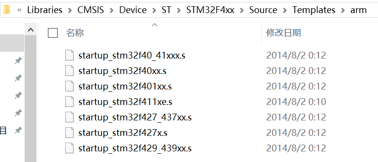

这一些都是启动文件，STM32程序就是从启动文件开始执行的。**对于最简化的STM32工程来说，只需要提取并使用与你所用芯片对应的启动文件即可。官方固件库中通常包含了针对不同芯片型号的启动文件，这些文件主要用于定义中断向量表和系统初始化代码。如果将所有启动文件全部提取到工程中，不仅会增加不必要的文件体积，还可能引入混淆或错误。因此，建议只选择与你当前芯片匹配的启动文件，这样可以保持工程的简洁性和可维护性。**

如果同一个系列有多个相同启动文件时但是后缀不同请参考：
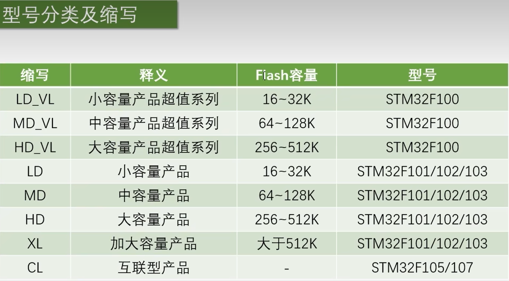

#### 片上外设寄存器描述文件

这是一个.h的头文件，包含了各寄存器的宏定义，不需要直接操作地址了。

#### 系统时钟配置文件（有头文件和源文件两个）

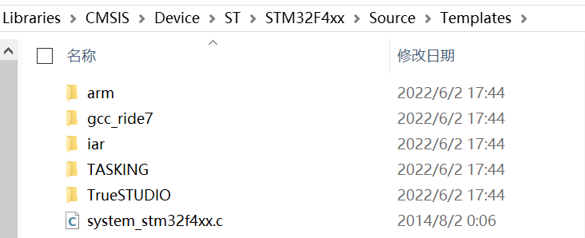

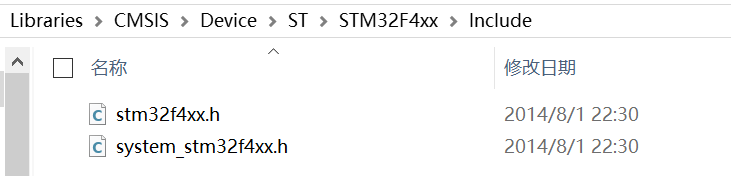

#### 内核寄存器描述文件

定义了 ARM Cortex-M4 内核相关的寄存器、指令、异常处理等。**这个不做细分全部拿走**

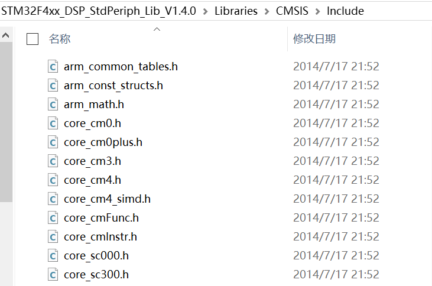

#### 库函数文件

全部拿走

#### 在固件库的文件结构上做提取，其他删除

**不要库函数的话，只需要保留CMSIS即可**，keil做头文件路径包含时，那个文件夹下有.h文件就对应填写那个路径即可（.h只能对应文件夹下，不能包含两层关系），**conf.h的路径在上面（使用库函数需要这个）**

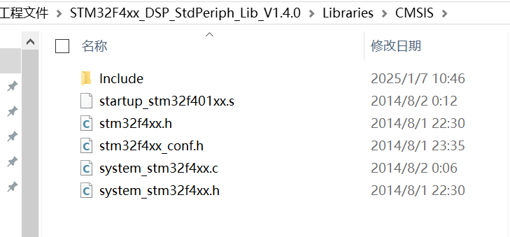

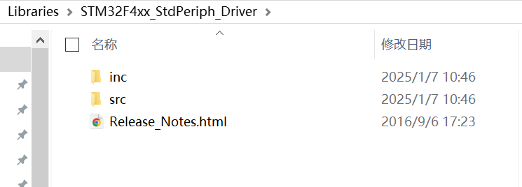

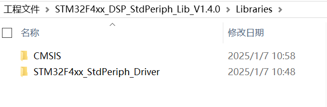

### 在keil中添加需要用到的文件

你可以添加源文件也可以有头文件和其他文件，看自己是否有使用的需求

在工程中我们能用到的文件就是CMSIS（**可以查看中断服务函数，中断通道名，NVIC内核相关函数**）和库函数（**查看库函数**），以及USER(**用户自己写的代码**。都添加进项目管理页中。文件结构一样。

把需要用到的文件添加进管理页

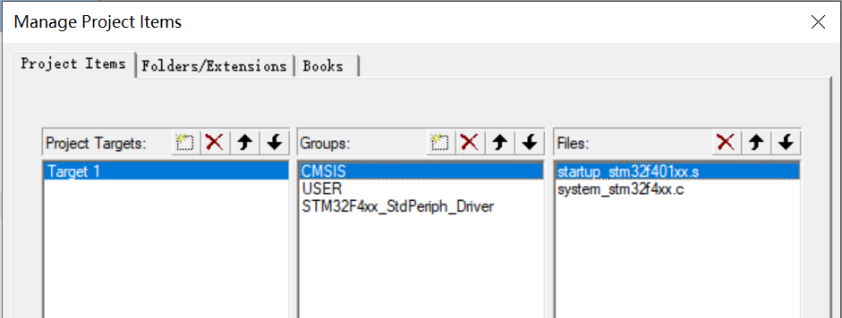

其实CMSIS中不止这一些文件的，只不过开发时用不到，其他的会在魔术棒中设置路径后，自动调用。

库函数可以把所有的函数源文件都拿进来，因为都可能用到。

### 添加工程所需文件的头文件路径

**内核文件，库函数，用户文件有头文件的文件夹都要。**

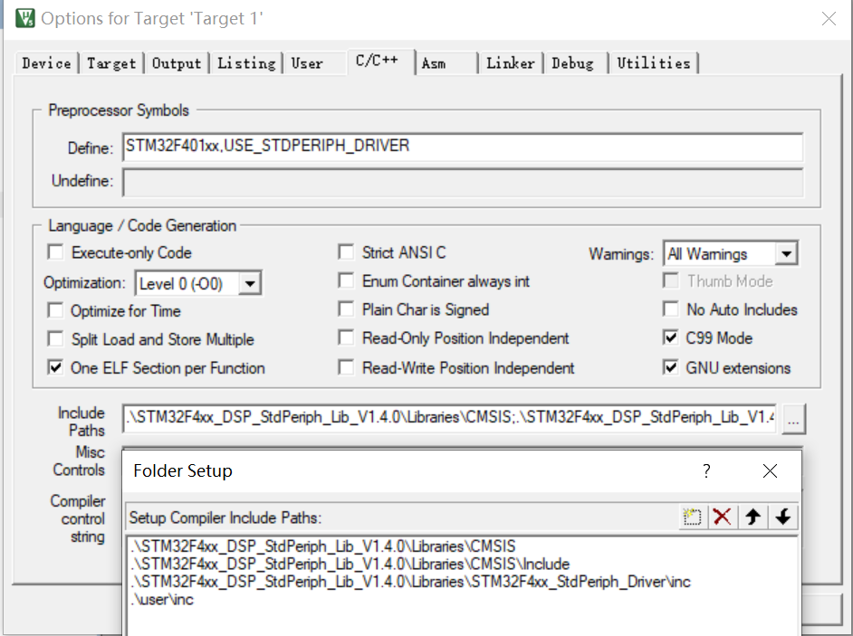

### 魔术棒其他配置

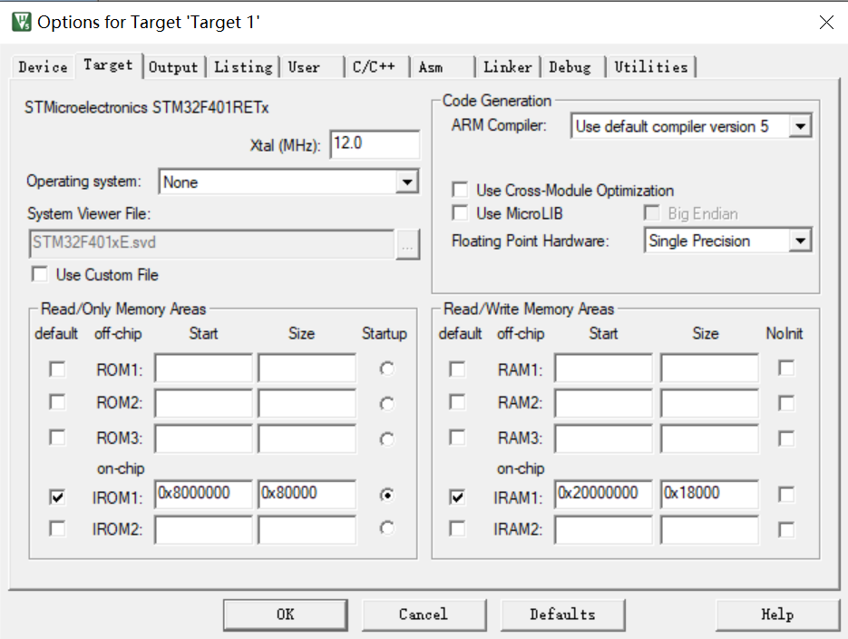

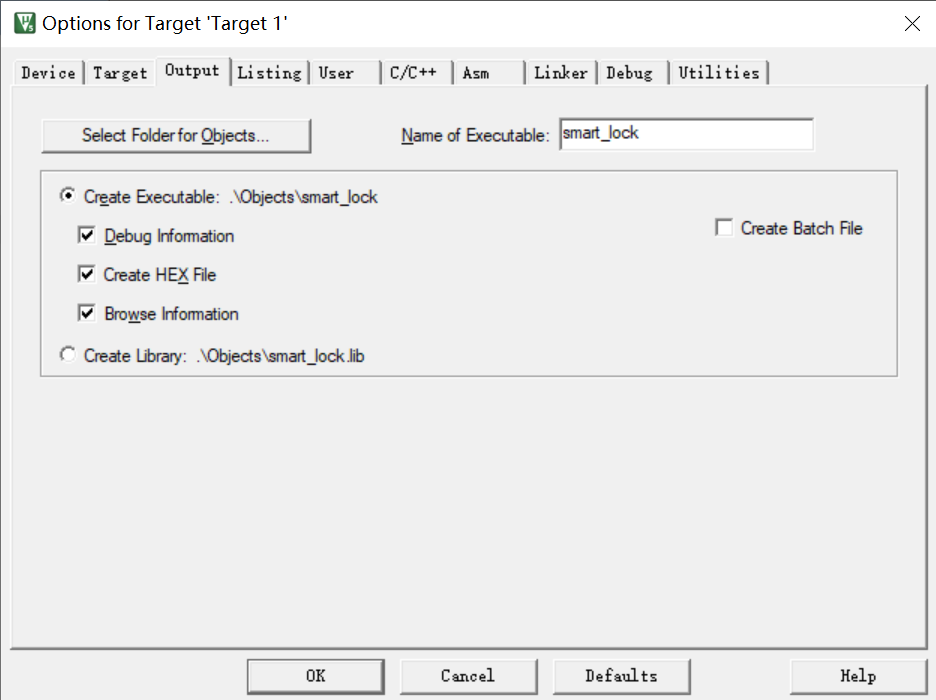

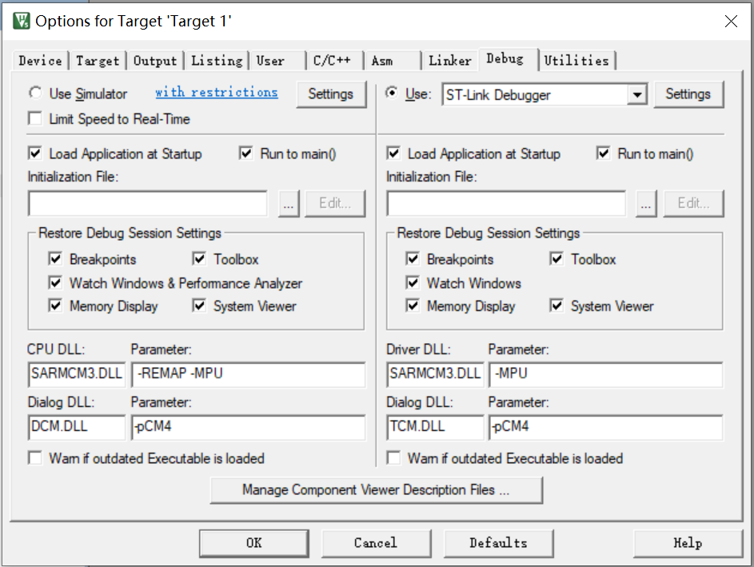

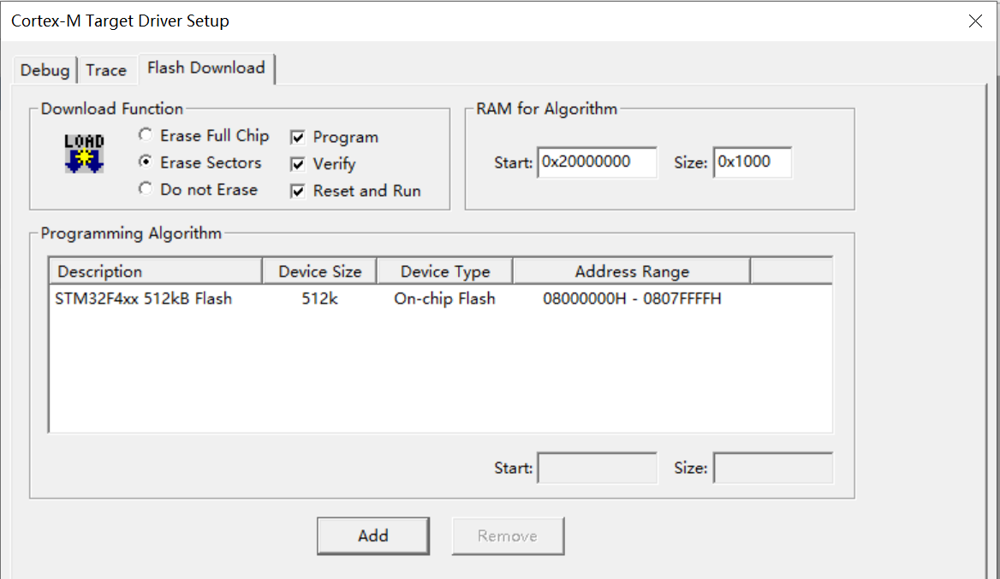

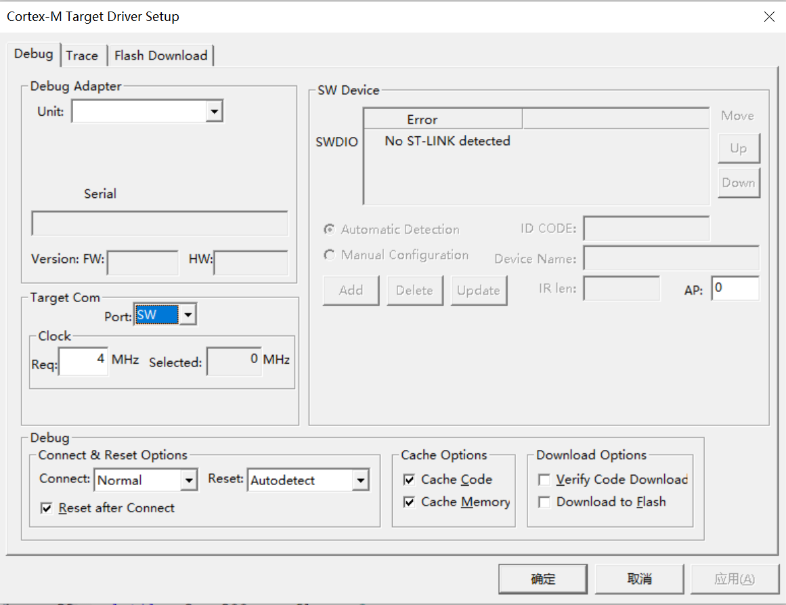

### 设置宏定义使文件中的条件编译生效

在魔术棒中，打开包含外设寄存器描述的**芯片头文件**`stm32f4xx.h`，在底部有一个条件编译，需要先定义相关宏，外设库才会生效

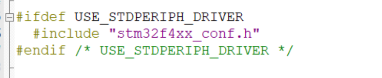

```c
/*  Tip: To avoid modifying this file each time you need to switch between these
        devices, you can define the device in your toolchain compiler preprocessor.
  */

#if !defined (STM32F40_41xxx) && !defined (STM32F427_437xx) && !defined (STM32F429_439xx) && !defined (STM32F401xx) && !defined (STM32F411xE)
 #error "Please select first the target STM32F4xx device used in your application (in stm32f4xx.h file)"
#endif

#if !defined  (USE_STDPERIPH_DRIVER)
/**
 * @brief Comment the line below if you will not use the peripherals drivers.
   In this case, these drivers will not be included and the application code will 
   be based on direct access to peripherals registers 
   */
  /*#define USE_STDPERIPH_DRIVER */
#endif /* USE_STDPERIPH_DRIVER */
```

这段代码的主要作用是**确保编译时正确选择 STM32F4 芯片型号，并决定是否启用标准外设库（StdPeriph Library）**。
**如果没有正确定义宏，编译时会报错！**


**预先宏定义STM32F401xx**

```c
#if !defined (STM32F40_41xxx) && !defined (STM32F427_437xx) && !defined (STM32F429_439xx) && !defined (STM32F401xx) && !defined (STM32F411xE)
 #error "Please select first the target STM32F4xx device used in your application (in stm32f4xx.h file)"
#endif
```

这段代码会检查**是否定义了某个 STM32F4 系列芯片的宏**，如：

- `STM32F40_41xxx`（表示 STM32F405/407/415/417）
- `STM32F427_437xx`（表示 STM32F427/437）
- `STM32F429_439xx`（表示 STM32F429/439）
- `STM32F401xx`（表示 STM32F401）
- `STM32F411xE`（表示 STM32F411）

**如果没有定义任何一个，编译会报错**：

```c
#error "Please select first the target STM32F4xx device used in your application (in stm32f4xx.h file)"
```

意思是：你必须指定一个芯片型号，否则代码无法编译。

**为什么必须定义芯片型号？**

- STM32F4 系列有很多型号，不同型号的外设功能、寄存器地址可能不同。
- 例如，STM32F401 和 STM32F407 的 GPIO、SPI、I2C 可能有细微差别，**代码必须知道你使用的是哪个型号，才能正确适配。**
- **定义这个宏后，标准库代码（如 `stm32f4xx.h`、`stm32f4xx_gpio.c`）会根据芯片型号编译正确的部分，避免使用不兼容的外设代码。**
  - **使库函数可以精准适配芯片，F4系列也有很多芯片，他们的地址或者函数封装都有差异，通过预先指定芯片型号避免使用不兼容的外设代码。**


**为什么要定义 `USE_STDPERIPH_DRIVER`**

```c
#if !defined  (USE_STDPERIPH_DRIVER)
/**
 * @brief Comment the line below if you will not use the peripherals drivers.
   In this case, these drivers will not be included and the application code will 
   be based on direct access to peripherals registers 
   */
  /*#define USE_STDPERIPH_DRIVER */
#endif /* USE_STDPERIPH_DRIVER */
```

`USE_STDPERIPH_DRIVER` 这个宏**决定是否启用标准外设库（StdPeriph Library）**。

**如果没有定义这个宏，编译时 StdPeriph 外设库不会被包含进来**，你必须**直接操作寄存器**来控制外设，而不能使用 `GPIO_Init()`、`SPI_Init()` 等库函数。

**如果定义了 `USE_STDPERIPH_DRIVER`，那么标准外设库的相关代码才会生效**，你可以使用库函数来配置和操作外设。

### USER文件夹（自选）

关于中断服务函数，固件库专门提供了一个源文件，可以找到所有的中断服务函数，当需要时可以直接重写。
或者自己新建NVIC也行。

**关于 `stm32f4xx_it.c`（中断处理文件）**

- 这个文件可以从固件库（标准外设库或 HAL 库）提取出来，也可以自己手写，目的是**集中管理所有的中断服务函数（ISR）**，如 `SysTick_Handler()`、`EXTI0_IRQHandler()` 等。
- 如果不使用标准外设库，或者有特定的中断需求，可以完全自己编写这个文件。

**关于 `stm32f4xx_conf.h`（外设配置文件）**

- 这个文件的主要作用是**管理标准外设库的功能开关**，决定是否启用 `GPIO`、`USART`、`ADC` 等外设驱动。
- 它一般是**全局配置文件**，大部分情况下不需要修改，所以**不必放到 Keil 的项目管理页（Project Explorer）中，IDE 只要能找到它即可**。
- 只需**在 Keil 里配置好头文件搜索路径**（Options for Target → C/C++ → Include Paths），让编译器可以找到 `stm32f4xx_conf.h`，就不需要手动添加到工程管理里。


### keil项目管理页的布局

在基于**标准外设库（StdPeriph Library）\**开发时，从固件库中提取的文件可以按\**是否需要修改或查看**来决定是否放入 Keil 项目管理页（Project Explorer）。以下是推荐的文件分类：

#### **建议放入 Keil 项目管理页的文件（需要修改或查看的）**

这些文件涉及到**用户代码、配置、外设驱动**，需要经常修改或查看，放入项目管理页方便编辑。

| 文件                                                         | 作用                                                         |
| ------------------------------------------------------------ | ------------------------------------------------------------ |
| **`main.c`**                                                 | 入口函数，用户主要代码所在位置                               |
| **`stm32f4xx_it.c`**                                         | **中断处理**文件，包含 `SysTick_Handler()`、`EXTI_IRQHandler()` 等 |
| **`system_stm32f4xx.c`**                                     | **系统时钟配置**文件，如 `SystemInit()`，决定 `HSE/PLL` 设置 |
| **`startup_stm32f401xx.s`**（或对应芯片的启动文件）          | **启动文件（汇编）**，用于设置堆栈、向量表等，必须添加到工程 |
| **`stm32f4xx_conf.h`（可选）**                               | **外设库配置文件**，可以控制 `GPIO`、`USART`、`ADC` 等是否启用（通常无需修改） |
| **`stm32f4xx_gpio.c`、`stm32f4xx_usart.c`** 等外设 `.c` 文件 | **具体的外设驱动文件**，如果需要调试或修改某个外设功能，可以放入项目管理页 |

------

#### **不建议放入 Keil 项目管理页的文件（不需要修改）**

这些文件大多是**库文件、头文件**，只需在 Keil 里**配置 Include Paths** 让编译器找到它们即可，不需要显示在 Keil 工程管理页里。

| 文件                                           | 作用                                                     |
| ---------------------------------------------- | -------------------------------------------------------- |
| **`stm32f4xx.h`**                              | **芯片头文件**，定义寄存器结构体等                       |
| **`stm32f4xx_gpio.h`、`stm32f4xx_usart.h`** 等 | **外设驱动头文件**，Keil 只要能找到它们就行              |
| **`misc.h`、`misc.c`**                         | **NVIC 相关配置**，通常不用修改                          |
| **`core_cm4.h`、`core_cmFunc.h`**              | **ARM CMSIS 相关文件**，不需要改动                       |
| **`stm32f4xx_conf.h`（如果不修改）**           | **外设库配置文件**，通常不修改，不必放在 Keil 工程管理页 |
| **`CMSIS` 相关文件夹**                         | **CMSIS 头文件**，只需要在 Keil 配置 `Include Paths`     |

### 工程结构

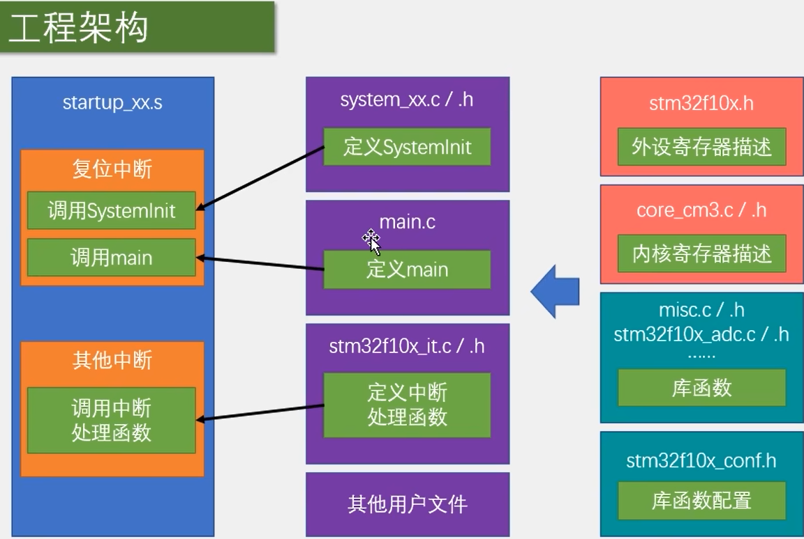

#### **启动文件（startup_xx.s）**

- **作用：** 负责 STM32 的启动，包括复位中断、初始化系统时钟、调用 `SystemInit()` 和 `main()`，以及处理中断。
- 主要内容：
  - **复位中断** → 调用 `SystemInit()` 进行系统初始化
  - **调用 `main()`** → 进入用户程序
  - **其他中断** → 通过中断向量表调用相应的中断处理函数

#### **系统初始化（system_xx.c/.h）**

- **作用：** 定义 `SystemInit()`，用于配置系统时钟、PLL、FLASH 预取等，确保 MCU 正确运行。
- 主要内容：
  - 配置系统时钟（如 HSE、PLL）
  - 配置 `SysTick` 计时器
  - 其他系统级初始化

#### **主程序（main.c）**

- **作用：** 用户的应用程序入口，包含 `main()`，实现业务逻辑。
- 主要内容：
  - 定义 `main()`，程序的主循环和任务调度
  - 初始化外设、调用库函数
  - 处理中断等

#### **中断处理（stm32f10x_it.c/.h）**

- **作用：** 处理 STM32 外设和系统中断，如 TIM、USART、EXTI 等。
- 主要内容：
  - 定义具体的中断处理函数，如 `TIM2_IRQHandler()`、`USART1_IRQHandler()`
  - 实现外设的响应和数据处理

#### **库文件**

STM32 提供了一系列库文件来简化对外设的控制。

**(1) 寄存器描述**

- `stm32f10x.h` → **外设寄存器描述**
  - 描述 STM32 外设的寄存器结构，如 GPIO、USART、SPI 等。
- `core_cm3.c/.h` → **内核寄存器描述**
  - 描述 ARM Cortex-M3 核心寄存器，如 NVIC（中断控制）、SCB（系统控制块）等。

**(2) 库函数**

- `misc.c/.h   stm32f10x_adc.c/.h`等
  - 提供 STM32 外设的驱动函数，如 GPIO 读写、ADC 采样、USART 发送/接收等。

**(3) 库函数配置**

- `stm32f10x_conf.h`
  - 配置哪些库函数可以被包含和使用，如启用/禁用外设驱动。
  - **包含了所有库函数的头文件，所以你使用时可以直接调用函数，而不用先包含对应的头文件**
