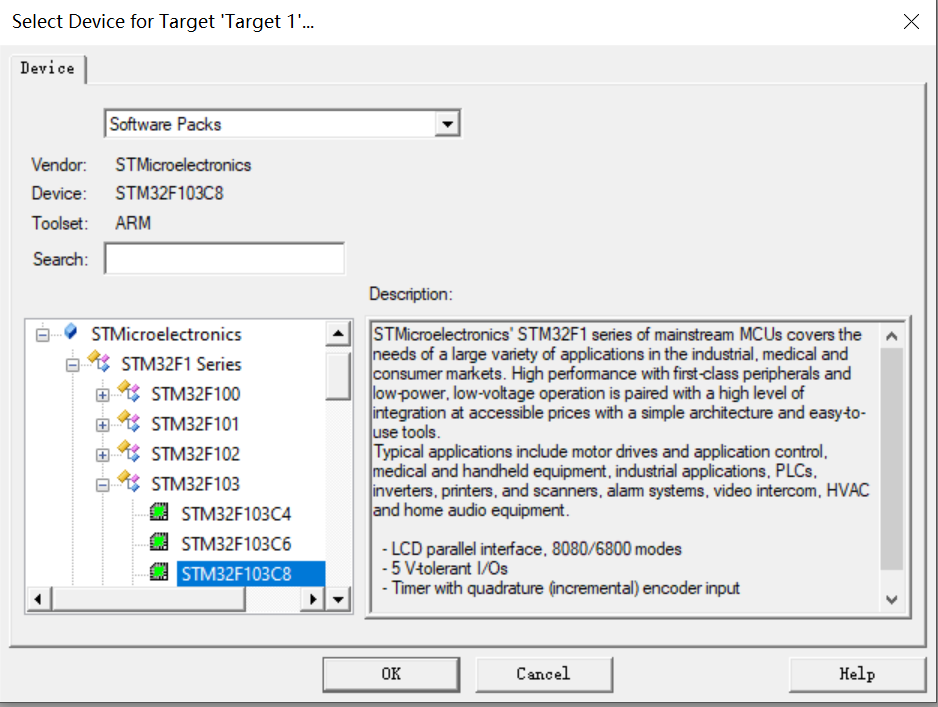

# STM32工程创建详解

## 目前的开发方式

- 基于寄存器
  - **核心特点**：直接通过地址操作寄存器配置外设。（地址基本上使用宏定义替代了，基本是直接寄存器访问）
  - **优点**：
    - **极致性能**：代码直接控制硬件，无中间层开销，运行效率最高。
    - **代码精简**：生成的二进制文件体积最小，适合资源受限的芯片（如Flash/RAM小的型号）。
    - **深入理解硬件**：适合学习底层硬件原理，掌握芯片架构。
  - **缺点**：
    - **开发效率低**：需手动查阅数百页参考手册，**逐位配置寄存器**，调试困难。
    - **可维护性差**：**代码逻辑与硬件绑定，移植到其他芯片需大量修改**。
    - **易出错**：**寄存器位掩码操作易遗漏细节（如未清除标志位导致死循环）**。
  - **适用场景**：
    - 资源敏感型项目（如Bootloader）、对执行时间有苛刻要求的场景（如高精度PWM）、嵌入式教学或硬件原理研究。
- 基于官方标准外设库
  - **核心特点**：ST官方提供的寄存器封装库（如`stm32f10x_gpio.h`）。
  - **优点**：
    - **开发效率提升**：通过函数接口（如`GPIO_Init()`）简化配置，减少寄存器操作。
    - **代码可读性高**：函数命名规范（如`USART_SendData()`），逻辑更清晰。
    - **移植性增强**：同一系列芯片（如STM32F1/F4）代码可复用。
      - 每一个系列的库函数不一样，固件库都不一样。
  - **缺点**：
    - **维护停止**：**ST已于2013年停止更新，不支持新系列芯片（如STM32H7/G0）**。
    - **中间层冗余**：部分函数包含非必要的判断逻辑，**代码效率略低于直接操作寄存器**。
    - **学习资源减少**：随着HAL库普及，新教程和社区支持逐渐减少。
  - **适用场景**：
    - 维护旧项目、对代码效率有一定要求的中小型项目，或学习者过渡到寄存器开发的中间阶段。
- 基于HAL库
  - **核心特点**：ST主推的抽象层库，配合STM32CubeMX工具实现图形化配置。
  - **优点**：
    - **快速开发**：通过CubeMX生成初始化代码，自动处理时钟、引脚复用等复杂配置。
    - **跨系列兼容**：同一API支持不同STM32系列（如F4与L4），**移植成本低**。
    - **功能丰富**：集成中间件（如FreeRTOS、USB协议栈），适合复杂应用。
    - **持续维护**：ST持续更新，支持最新芯片（如STM32U5）和功能（如低功耗模式）。
  - **缺点**：
    - **代码臃肿**：抽象层级多，生成的代码量大（可能多出30%-50%）。
    - **效率较低**：回调机制和通用化设计引入额外开销，实时性敏感场景需优化。
    - **黑箱风险**：**过度依赖工具生成代码，底层问题调试困难（如DMA配置错误）。**
  - **适用场景**：
    - 中大型项目、快速原型开发、跨平台移植需求，或团队协作时降低硬件知识门槛。

## 如何获取标准外设库的包


**进去之后根据芯片型号点击对应的图标即可**


### 标准外设库为什么会带一个DSP？

**标准外设库 (Standard Peripheral Library, SPL):** 这是意法半导体 (STMicroelectronics, ST)  早期为STM32微控制器提供的一套固件函数库。 这套库文件将STM32单片机复杂的硬件寄存器操作封装成一系列易于使用的函数接口 (API)。  开发者可以通过调用这些函数，  方便快捷地配置和控制STM32的各种片上外设，  例如 GPIO、 时钟、 定时器、  ADC、  DAC、  串口、  SPI、  I2C等等。  标准外设库大大降低了STM32开发的入门门槛， 提高了开发效率。  虽然ST官方已经不再积极维护和推荐使用标准外设库，  而是转向更加现代化的HAL库和LL库，  但标准外设库仍然有很多用户在使用，  并且拥有大量的学习资料和代码示例。

**DSP (Digital Signal Processing, 数字信号处理):**  **DSP 是一种利用数字计算方法处理信号的技术**。  在电子工程和计算机科学领域， DSP 应用非常广泛，  例如音频处理、  图像处理、  通信系统、  雷达系统等等。  DSP 算法通常涉及到大量的数学运算，  特别是乘法和累加运算。  为了提高DSP算法的执行效率，  很多现代微处理器架构都引入了专门的硬件 DSP 指令集，  例如 ARM Cortex-M4 和 Cortex-M7 内核就带有 DSP 扩展指令集。 这些指令集可以显著加速DSP算法的运算速度。

TM32F4 系列是意法半导体推出的高性能 STM32 微控制器系列，  它基于 ARM Cortex-M4F 内核。  其中，  “F”  代表内核带有 **浮点运算单元 (FPU)** 和 **DSP 扩展指令集 (DSP Extension)**。  这意味着 STM32F4 不仅具备强大的通用计算能力，  还拥有硬件级别的 DSP 运算能力。

STM32F4 的标准外设库的名字通常会带有 “DSP”，  这是**为了区分 STM32F4 与其他不带 DSP 功能的 STM32 系列，  例如 STM32F1、  STM32F0 等。  这是一种产品命名和宣传策略，  旨在突出 STM32F4 的优势。**


**为什么使用寄存器开发，大部分人也是从标准外设库从提取CMSIS文件？比如启动文件，芯片头文件等？**

这反映了 **CMSIS (Cortex Microcontroller Software Interface Standard,  Cortex微控制器软件接口标准)** 在STM32开发中的重要地位，  即使是进行寄存器开发，  CMSIS 也是不可或缺的。  原因如下：

1. **CMSIS 提供了统一的硬件抽象层：**

   - **标准化的头文件 (Device Header Files):**  CMSIS 最核心的部分是 **设备头文件 (Device Header Files)**。  这些头文件由芯片厂商提供，  并遵循CMSIS规范。  它们定义了特定型号STM32芯片的所有寄存器地址、  位域、  结构体等信息。  例如，  `stm32f4xx.h`  就是STM32F4系列芯片的CMSIS设备头文件。
   - **方便的寄存器访问方式：**  CMSIS 头文件使用结构体和位域的方式，  将复杂的寄存器地址和位操作封装成易于理解和使用的宏定义和结构体成员。  例如，  您可以使用  `GPIOA->ODR |= GPIO_ODR_ODR0;`  这样的代码来设置GPIOA端口的0号引脚为高电平，  而**无需手动计算寄存器地址和位偏移。  这大大提高了寄存器代码的可读性和可维护性，  并降低了出错的风险。**
   - **跨芯片的兼容性：**  CMSIS 旨在提供一个统一的软件接口，  使得基于Cortex-M内核的单片机代码在不同厂商和不同型号的芯片之间具有一定的可移植性。  虽然不同STM32芯片的外设寄存器肯定有所不同，  但CMSIS 提供了一种标准化的访问方式，  使得代码的移植工作量大大减少。

2. CMSIS 提供了启动文件

   - **必要的初始化代码：**启动文件是单片机程序执行的第一段代码，  负责完成芯片上电后的必要初始化工作，  例如：
     - **向量表 (Vector Table) 定义：**  定义中断向量表的地址和内容，  用于响应各种中断事件。
     - **堆栈 (Stack) 和堆 (Heap) 初始化：**  为程序分配堆栈和堆空间。
     - **时钟系统初始化 (System Clock Setup)：**  配置系统时钟源和频率，  为CPU和外设提供时钟。
     - **C运行时库初始化 (C Library Initialization)：**  初始化C标准库环境。
   - **厂商提供的默认配置：**  **CMSIS 启动文件通常由芯片厂商提供，  并根据芯片的特性进行了默认配置。  对于大多数应用，  可以直接使用这些默认配置，  而无需从零开始编写启动代码。  这大大简化了启动过程，  并确保了系统的正确启动。**

3. **CMSIS 是事实上的行业标准：**

   - **被广泛接受和使用：**  CMSIS 已经成为ARM Cortex-M 微控制器软件开发的行业标准。  几乎所有的ARM Cortex-M 芯片厂商都会提供**符合CMSIS规范的设备头文件和启动文件。**
   - **各种开发工具和IDE的支持：**  主流的嵌入式开发工具和IDE (例如 Keil MDK、 IAR Embedded Workbench、 STM32CubeIDE 等)  都对CMSIS 提供了良好的支持，  可以方便地集成CMSIS 组件到工程中。
   - **社区资源丰富：**  基于CMSIS 的开发资料、  示例代码、  社区支持非常丰富，  开发者可以很容易地找到各种学习资源和帮助。

4. **为什么从标准外设库 (SPL) 中提取 CMSIS 文件？**

   即使标准外设库 (SPL) 已经被官方逐渐淘汰，  并被 HAL 库和 LL 库取代，  但很多人仍然习惯从 SPL 中提取 CMSIS 文件，  主要是因为：

   - **历史原因和习惯：**  SPL 是STM32早期最流行的库，  很多开发者最初接触STM32就是从SPL开始的。  SPL 库中已经包含了完整的 CMSIS 组件，  并且组织结构清晰，  方便查找和提取。
   - **SPL 的 CMSIS 组织结构比较简洁：**  相对于 HAL 库和 LL 库，  SPL 的目录结构更简单，  CMSIS 文件的位置也比较容易找到。  例如，  在SPL 的  `Libraries\CMSIS\Device\ST\STM32F4xx`  目录下，  就可以找到  `stm32f4xx.h`  头文件和启动文件。
   - **只需要 CMSIS 核心组件：**  如果开发者选择寄存器开发，  他们通常只需要 CMSIS 的核心组件，  例如设备头文件和启动文件，  而不需要 SPL 库中其他的外设驱动代码。  从 SPL 中提取 CMSIS 文件，  可以只获取必要的组件，  避免引入额外的库代码，  保持工程的简洁性。

### CMSIS的作用

**CMSIS是ARM与各芯片厂商统一指定的接口标准。 不然各芯片厂商的寄存器设计和地址都不同，没有同一个统一的接口的话，兼容是一个很大的问题。 如果没有CMSIS的启功文件和芯片头文件的话，开发者需要从零开始写代码，包括计算寄存器的地址和偏移，这很不利于开发。 所以各厂商都会提供CMSIS，接口是相同的但是定义和寄存器的计算方式根据各厂商芯片来定义，这样即使不同的芯片都可以使用同一个标准开发。**

CMSIS的核心目的就是为了解决ARM Cortex-M架构下，不同芯片厂商的硬件差异带来的兼容性和开发效率问题。

**标准化的软件接口:**  CMSIS定义了一系列 **标准化的软件接口**，包括寄存器访问方式、中断处理方式、RTOS接口、DSP算法接口等等。  这些接口在不同的Cortex-M芯片上保持一致，使得软件代码在不同芯片之间的移植变得更加容易。

**如果没有CMSIS， 嵌入式开发将会面临巨大的碎片化和兼容性挑战。**

**硬件差异性:**  虽然都**使用了ARM Cortex-M内核**，但不同的芯片厂商在设计具体芯片时，会根据市场需求和自身技术特点，对外设模块进行定制化设计。  这导致了即使是同一系列（例如Cortex-M4），不同厂商的芯片，其 **外设寄存器的地址、位域、功能都可能存在显著差异**。

**软件移植难题:**  如果没有统一的标准，开发者如果更换芯片厂商，或者升级到不同型号的芯片，就 **几乎需要重写所有的底层驱动代码**。这会大大增加开发成本，延长产品上市时间，并限制软件的复用性。

**生态系统碎片化:**  如果每个芯片厂商都使用自己的标准，会导致整个Cortex-M生态系统变得非常碎片化。  工具链、中间件、操作系统等软件组件的开发和维护都会变得非常复杂和困难。

**手工计算寄存器地址和偏移：**  在没有CMSIS之前，开发者需要仔细研读芯片的数据手册和参考手册， **手动计算每个寄存器的基地址、偏移地址、位掩码**。  这个过程繁琐易错，效率低下。

**编写汇编启动代码：**  启动文件是程序执行的第一段代码，负责初始化硬件环境。  在没有CMSIS提供的标准启动文件之前，开发者需要 **完全使用汇编语言编写启动代码**，包括设置向量表、堆栈、时钟等等。  这需要深厚的底层知识和汇编编程能力。

**代码可读性和可维护性差：**  直接使用硬编码的寄存器地址和位偏移，会导致代码 **可读性非常差**，难以理解和维护。  后期如果需要修改或移植代码，将会面临巨大的挑战。


**统一的接口标准 (Interface Standard):**  CMSIS 定义了 **软件与硬件交互的统一接口**，例如寄存器访问方式 (使用结构体和位域)、中断处理方式 (统一的中断向量表和处理函数命名规范) 等等。  这些接口在不同的CMSIS兼容的芯片上是 **保持一致** 的。

**厂商定制的定义 (Vendor-Specific Definitions):**  CMSIS 标准允许各芯片厂商根据自身芯片的特性， **定制化实现 CMSIS 的具体定义**。  例如，不同芯片的寄存器地址、位域定义、外设模块数量肯定不同，这些差异性信息就由各芯片厂商在 **CMSIS 设备头文件** 中进行定义。

**标准化的开发流程:**  有了CMSIS，开发者可以使用 **相同的开发流程和工具链**，来开发针对不同厂商、不同型号的Cortex-M芯片的应用程序。  **开发者可以专注于应用逻辑的实现，而无需过多关注底层硬件的细节差异。**

## 标准固件库结构说明


### _htmresc

两张图片没有用，**`_htmresc` 文件夹**

- **作用**：存放网页相关资源文件（如HTML/CSS/图片），通常用于生成或展示库的在线文档。
- **内容示例**：
  - 图标、样式表、网页排版资源
  - 与库文档（如`Release_Notes.html`）配套的视觉元素

### Libraries（核心目录）

这里面包含了库函数的文件，创建工程时会用到

- **作用**：存放STM32硬件相关的驱动库和核心支持文件。
- **关键子目录**：
  - **`CMSIS`**：
    - **`Device/ST/STM32F4xx`**：包含STM32F4芯片的启动文件（`.s`汇编文件）、链接脚本（`.ld`）、系统初始化代码（`system_stm32f4xx.c`）以及**芯片特定的头文件**（如`stm32f407xx.h`）。
    - **`CMSIS/Core`**：ARM官方提供的Cortex-M内核抽象层，定义中断向量表、内核寄存器等（如`core_cm4.h`）。
  - **`STM32F4xx_StdPeriph_Driver`**：
    - **`src`**：标准外设库的C源码文件（如`stm32f4xx_gpio.c`、`stm32f4xx_usart.c`）。
    - **`inc`**：标准外设库的头文件（如`stm32f4xx_gpio.h`、`stm32f4xx_rcc.h`）。
  - **`DSP_Lib`**（**如果支持DSP**）：
    - 数字信号处理（DSP）库源码，用于数学加速（如FFT、滤波、矩阵运算）。

### Project

官方提供的工程示例和模板，用作参考

- **作用**：提供示例工程模板和演示代码。
- **关键子目录**：
  - **`Examples`**：针对不同外设的示例代码（如GPIO翻转、USART通信、定时器PWM输出）。
  - **`Templates`**：空工程模板，包含最小化的初始化代码（如`main.c`、`stm32f4xx_conf.h`）。
  - **`EWARM`、`MDK-ARM`、`TrueSTUDIO`**：针对不同IDE（IAR、Keil、STM32CubeIDE）的工程文件。

### Utilities

测评STM32的

- **作用**：提供与ST官方评估板（如STM32F4-Discovery）配套的实用代码。
- **内容示例**：
  - 板载外设驱动（如LCD屏、陀螺仪、LED控制）。
  - 演示程序（如综合实验、传感器数据采集）。

### MCD-ST Liberty SW License Agreement V2

**作用**：ST库的软件许可协议文件，明确库的使用条款和限制（如商业用途需遵守的规则）

### Release_Notes

- **作用**：版本更新日志，记录当前库版本的：
  - 新增功能（如支持新芯片型号）
  - 已知问题与修复
  - 兼容性说明（如与其他库的配合使用）

### stm32f4xx_dsp_stdperiph_lib_um

- **作用**：库的离线用户手册（Windows帮助文件格式），包含：
  - 库的架构说明
  - API函数详细文档（参数说明、返回值、使用示例）
  - 硬件配置指南（如时钟树设置、外设初始化流程）

### **关键文件补充说明**

| 文件/目录      | 典型路径                                                     | 重要性 |
| :------------- | :----------------------------------------------------------- | :----- |
| 启动文件       | `Libraries/CMSIS/Device/ST/STM32F4xx/Source/Templates/arm/`  | 必需   |
| 系统时钟配置   | `Libraries/CMSIS/Device/ST/STM32F4xx/Source/Templates/system_stm32f4xx.c` | 必需   |
| 外设库配置文件 | `Project/STM32F4xx_StdPeriph_Templates/stm32f4xx_conf.h`     | 必需   |
| 芯片头文件     | `Libraries/CMSIS/Device/ST/STM32F4xx/Include/stm32f4xx.h`    | 必需   |

### **注意事项**

启动文件

- 提供中断向量表和复位后初始化汇编代码。根据使用的编译器选择对应的启动文件。

系统时钟配置（配置各总线频率，主频等）

- 配置系统时钟（HSE、PLL、时钟树等），用于 `SystemInit()` 初始化。

外设库配置文件

- 控制 STM32 标准外设库的功能启用（如 GPIO、USART、SPI、I2C）。
- 如果使用 STM32 HAL 库，则：
  - `stm32f4xx_conf.h` 在 HAL 中不再需要。

**芯片头文件**

- **芯片型号的选择宏定义**
  这个文件通常会通过 `#define STM32F407xx` 这样的宏来指明具体的芯片型号，确保代码编译时能够正确匹配对应的寄存器定义和外设资源。
- **外设寄存器结构体定义**
  STM32 的寄存器通常使用结构体来定义，每个外设（如 GPIO、USART、SPI 等）都有相应的结构体，其中包含该外设的所有寄存器字段。这些结构体用于直接访问硬件寄存器。
- **外设基地址宏定义**
  每个外设在 STM32 芯片的内存映射中都有固定的地址。例如，GPIO 端口、定时器、ADC 等的基地址都会在该头文件中定义，并用于结构体的地址映射。
- **中断向量表定义**
  该文件通常包含所有外设和系统级中断的定义，例如 `EXTI0_IRQn`、`TIM2_IRQn`，这些定义用于 NVIC（嵌套向量中断控制器）配置中。
- **设备内存映射**
  该头文件会定义 STM32 芯片的 Flash、SRAM 以及外设的内存映射区域，确保开发者可以正确地访问这些资源。
- **位定义宏（寄存器位掩码）**
  每个外设寄存器的各个位通常会有对应的宏定义，以方便开发者进行位操作。例如 GPIO 模式寄存器中的 `GPIO_MODER_MODER0` 可能会定义成特定的数值，方便用于位操作。
- **调试和系统控制相关定义**
  包括芯片 ID、调试相关寄存器、低功耗模式、复位和时钟控制（RCC）等的定义，这些内容用于芯片的初始化、调试和系统管理。

这个文件的作用是提供 STM32F407xx 这款芯片的所有低级硬件定义，使开发者能够直接访问硬件寄存器，同时也为库函数提供底层支持。


1. **不要直接修改库文件**：建议将库文件视为只读，自定义代码应放在用户目录中。

   1. `system_stm32f4xx.c` **可以修改**，用于调整时钟初始化（如改变 `SystemCoreClock`）。其他库文件（`stm32f4xx.h`、`stm32f4xx_conf.h`）尽量不改，防止升级库时冲突。

2. **头文件包含路径（Keil 配置）** 在 Keil **C/C++ Include Paths** 里，需添加：

   1. 在 STM32 标准外设库（StdPeriph Library）或 CMSIS 库中，通常需要包含以下路径：

   | **包含路径（Keil 配置中的 "C/C++ Include Paths"）** | **主要包含的头文件（`.h`）**                                 |
   | --------------------------------------------------- | ------------------------------------------------------------ |
   | `Libraries/CMSIS/Include`                           | `core_cm4.h`（Cortex-M4 内核定义） `core_cmFunc.h` `core_cmInstr.h` |
   | `Libraries/CMSIS/Device/ST/STM32F4xx/Include`       | `stm32f4xx.h`（STM32F4 芯片寄存器定义） `system_stm32f4xx.h`（时钟系统相关） |
   | `Libraries/STM32F4xx_StdPeriph_Driver/inc`          | `stm32f4xx_gpio.h`（GPIO 相关） `stm32f4xx_rcc.h`（时钟相关） `stm32f4xx_usart.h`（串口相关）等 |

   2. 如果你手动提取了 STM32 库文件，并且给它们重新命名，那么你需要确保包含了以下关键头文件：
      1. **CMSIS 相关头文件**：这些文件定义了 ARM Cortex-M4 内核相关的寄存器、指令、异常处理等。
      2. **主要文件**：
         - `core_cm4.h` → Cortex-M4 内核寄存器、指令
         - `core_cmFunc.h` → 内核功能相关
         - `core_cmInstr.h` → 内核指令封装
      3. STM32F4 设备头文件：这些文件定义了 STM32F4 系列芯片的寄存器地址、时钟初始化等。
      4. **主要文件**：
         - `stm32f4xx.h` → STM32F4 的全部寄存器宏定义，如 `GPIOA->ODR`
         - `system_stm32f4xx.h` → 时钟系统初始化，通常用于 `SystemInit()`
      5. 标准外设库头文件（StdPeriph Driver）：这些文件是 STM32F4 标准外设库（StdPeriph Library）的一部分，提供 GPIO、RCC（时钟）、USART、SPI、I2C 等外设的驱动。
      6. Libraries/STM32F4xx_StdPeriph_Driver/inc/（**所有文件**）

3. **启动文件选择**：根据芯片型号和编译器（如IAR/Keil/GCC）选择对应的启动文件（如`startup_stm32f407xx.s`）。

## 基于标准库的工程创建

### 空工程

可以先创建一个项目的总文件夹里面包含各种资料或者说明文档，外加一个工程文件夹（keil在这个文件夹下创建工程）


**前提是安装了对应的芯片支持包**



**这个新建工程小助手，用于快速新建工程（暂时不用）**


#### 空白工程各文件夹作用

**DebugConfig 文件夹**

- 作用：存放调试相关的配置文件，通常用于存储 IDE（如 Keil uVision、STM32CubeIDE）调试器的设置。
- 内容：
  - 可能包含 `.ini`、`.dbg`、`.log` 等调试相关的文件。
  - 配置与芯片调试接口（如 J-Link、ST-Link、CMSIS-DAP）相关的信息。

**Listings 文件夹**

- 作用：存放汇编和编译过程中生成的列表文件（Listing Files），用于调试和分析代码。
- 内容：
  - `.lst` 文件：包含汇编代码、机器码、地址映射等信息，方便查看 C 代码与汇编代码的对应关系。
  - `.map` 文件：存储工程的内存分布信息，主要用于分析内存占用情况。

**Objects 文件夹**

- 作用：存放编译后的中间文件，如目标文件（`.o` 文件）、静态库文件（`.a` 文件）、可执行文件（`.axf` 文件）。
- 内容：
  - `.o` 文件（Object File）：C 语言代码编译后的目标文件，尚未链接成最终可执行文件。
  - `.axf` 或 `.elf` 文件：最终生成的可执行文件，可用于调试。
  - `.map` 文件：存储详细的链接信息，如变量、函数、地址映射等。
  - `.hex` / `.bin` 文件：用于烧录到 STM32 芯片的固件文件（在 Keil 编译时生成）。

**Project.uvoptx**（Keil uVision 选项配置文件）

- 作用：存储 Keil 工程的用户个性化设置，如窗口布局、断点、调试选项等。
- 特点：
  - 这是 Keil uVision 5 使用的 XML 格式的项目选项文件。
  - 主要是 IDE 相关的个性化设置，不影响编译结果。

**Project.uvprojx**（Keil uVision 项目文件）

- 作用：存储整个 Keil 工程的配置信息，包括：
  - 代码文件的组织结构（源文件、头文件、库文件等）。
  - 目标芯片的型号和编译选项（编译器、优化级别、内存配置等）。
  - 链接器脚本、调试器设置等。
- 特点：
  - 这是 Keil uVision 5 的工程文件，采用 XML 格式（Keil uVision 4 版本为 `.uvproj`）。
  - 这个文件是工程的核心，通常与 `Project.uvoptx` 一起使用。

#### 总结

**Keil 工程文件（`.uvprojx`、`.uvoptx`）**

- `Project.uvprojx`：主工程文件，用于打开整个项目。
- `Project.uvoptx`：Keil 个人配置文件（窗口布局、调试设置等），不影响编译。
- **一般情况下，用户只需要用 `.uvprojx` 打开项目，不需要修改这些文件。**

**Objects 文件夹（存放编译输出文件）**

- `.hex` 文件：用于烧录到 STM32 芯片。
- `.bin` 文件：某些工具可能用到的二进制固件（类似 `.hex`）。
- `.axf` / `.elf` 文件：用于调试，包含符号信息。
- **用户主要关注 `.hex` 文件来进行烧录。**

**其他文件夹（Listings、DebugConfig）**

- **通常不用管**，只是编译过程中生成的调试、列表文件。


**用户主要需要关注：**

- **`Project.uvprojx`**：打开工程文件。
- **`Objects` 文件夹下的 `.hex` 文件**：用于烧录固件到 STM32。

**不需要修改或关注：**

- `.uvoptx`（Keil 个人设置）
- `Listings`（编译日志）
- `DebugConfig`（调试配置）
- `Objects`（除了 `.hex`，一般不直接操作）

### 添加必要的文件（配置工程）

#### 启动文件


这一些都是启动文件，STM32程序就是从启动文件开始执行的。**对于最简化的STM32工程来说，只需要提取并使用与你所用芯片对应的启动文件即可。官方固件库中通常包含了针对不同芯片型号的启动文件，这些文件主要用于定义中断向量表和系统初始化代码。如果将所有启动文件全部提取到工程中，不仅会增加不必要的文件体积，还可能引入混淆或错误。因此，建议只选择与你当前芯片匹配的启动文件，这样可以保持工程的简洁性和可维护性。**

如果同一个系列有多个相同启动文件时但是后缀不同请参考：


#### 片上外设寄存器描述文件

这是一个.h的头文件，包含了各寄存器的宏定义，不需要直接操作地址了。

#### 系统时钟配置文件（有头文件和源文件两个）


#### 内核寄存器描述文件

定义了 ARM Cortex-M4 内核相关的寄存器、指令、异常处理等。**这个不做细分全部拿走**


#### 库函数文件

全部拿走

#### 在固件库的文件结构上做提取，其他删除

**不要库函数的话，只需要保留CMSIS即可**，keil做头文件路径包含时，那个文件夹下有.h文件就对应填写那个路径即可（.h只能对应文件夹下，不能包含两层关系），**conf.h的路径在上面（使用库函数需要这个）**


### 在keil中添加需要用到的文件

你可以添加源文件也可以有头文件和其他文件，看自己是否有使用的需求

在工程中我们能用到的文件就是CMSIS（**可以查看中断服务函数，中断通道名，NVIC内核相关函数**）和库函数（**查看库函数**），以及USER(**用户自己写的代码**。都添加进项目管理页中。文件结构一样。

把需要用到的文件添加进管理页


其实CMSIS中不止这一些文件的，只不过开发时用不到，其他的会在魔术棒中设置路径后，自动调用。

库函数可以把所有的函数源文件都拿进来，因为都可能用到。

### 添加工程所需文件的头文件路径

**内核文件，库函数，用户文件有头文件的文件夹都要。**


### 魔术棒其他配置


### 设置宏定义使文件中的条件编译生效

在魔术棒中，打开包含外设寄存器描述的**芯片头文件**`stm32f4xx.h`，在底部有一个条件编译，需要先定义相关宏，外设库才会生效


```c
/*  Tip: To avoid modifying this file each time you need to switch between these
        devices, you can define the device in your toolchain compiler preprocessor.
  */

#if !defined (STM32F40_41xxx) && !defined (STM32F427_437xx) && !defined (STM32F429_439xx) && !defined (STM32F401xx) && !defined (STM32F411xE)
 #error "Please select first the target STM32F4xx device used in your application (in stm32f4xx.h file)"
#endif

#if !defined  (USE_STDPERIPH_DRIVER)
/**
 * @brief Comment the line below if you will not use the peripherals drivers.
   In this case, these drivers will not be included and the application code will 
   be based on direct access to peripherals registers 
   */
  /*#define USE_STDPERIPH_DRIVER */
#endif /* USE_STDPERIPH_DRIVER */
```

这段代码的主要作用是**确保编译时正确选择 STM32F4 芯片型号，并决定是否启用标准外设库（StdPeriph Library）**。
**如果没有正确定义宏，编译时会报错！**


**预先宏定义STM32F401xx**

```c
#if !defined (STM32F40_41xxx) && !defined (STM32F427_437xx) && !defined (STM32F429_439xx) && !defined (STM32F401xx) && !defined (STM32F411xE)
 #error "Please select first the target STM32F4xx device used in your application (in stm32f4xx.h file)"
#endif
```

这段代码会检查**是否定义了某个 STM32F4 系列芯片的宏**，如：

- `STM32F40_41xxx`（表示 STM32F405/407/415/417）
- `STM32F427_437xx`（表示 STM32F427/437）
- `STM32F429_439xx`（表示 STM32F429/439）
- `STM32F401xx`（表示 STM32F401）
- `STM32F411xE`（表示 STM32F411）

**如果没有定义任何一个，编译会报错**：

```c
#error "Please select first the target STM32F4xx device used in your application (in stm32f4xx.h file)"
```

意思是：你必须指定一个芯片型号，否则代码无法编译。

**为什么必须定义芯片型号？**

- STM32F4 系列有很多型号，不同型号的外设功能、寄存器地址可能不同。
- 例如，STM32F401 和 STM32F407 的 GPIO、SPI、I2C 可能有细微差别，**代码必须知道你使用的是哪个型号，才能正确适配。**
- **定义这个宏后，标准库代码（如 `stm32f4xx.h`、`stm32f4xx_gpio.c`）会根据芯片型号编译正确的部分，避免使用不兼容的外设代码。**
  - **使库函数可以精准适配芯片，F4系列也有很多芯片，他们的地址或者函数封装都有差异，通过预先指定芯片型号避免使用不兼容的外设代码。**


**为什么要定义 `USE_STDPERIPH_DRIVER`**

```c
#if !defined  (USE_STDPERIPH_DRIVER)
/**
 * @brief Comment the line below if you will not use the peripherals drivers.
   In this case, these drivers will not be included and the application code will 
   be based on direct access to peripherals registers 
   */
  /*#define USE_STDPERIPH_DRIVER */
#endif /* USE_STDPERIPH_DRIVER */
```

`USE_STDPERIPH_DRIVER` 这个宏**决定是否启用标准外设库（StdPeriph Library）**。

**如果没有定义这个宏，编译时 StdPeriph 外设库不会被包含进来**，你必须**直接操作寄存器**来控制外设，而不能使用 `GPIO_Init()`、`SPI_Init()` 等库函数。

**如果定义了 `USE_STDPERIPH_DRIVER`，那么标准外设库的相关代码才会生效**，你可以使用库函数来配置和操作外设。

### USER文件夹（自选）

关于中断服务函数，固件库专门提供了一个源文件，可以找到所有的中断服务函数，当需要时可以直接重写。
或者自己新建NVIC也行。

**关于 `stm32f4xx_it.c`（中断处理文件）**

- 这个文件可以从固件库（标准外设库或 HAL 库）提取出来，也可以自己手写，目的是**集中管理所有的中断服务函数（ISR）**，如 `SysTick_Handler()`、`EXTI0_IRQHandler()` 等。
- 如果不使用标准外设库，或者有特定的中断需求，可以完全自己编写这个文件。

**关于 `stm32f4xx_conf.h`（外设配置文件）**

- 这个文件的主要作用是**管理标准外设库的功能开关**，决定是否启用 `GPIO`、`USART`、`ADC` 等外设驱动。
- 它一般是**全局配置文件**，大部分情况下不需要修改，所以**不必放到 Keil 的项目管理页（Project Explorer）中，IDE 只要能找到它即可**。
- 只需**在 Keil 里配置好头文件搜索路径**（Options for Target → C/C++ → Include Paths），让编译器可以找到 `stm32f4xx_conf.h`，就不需要手动添加到工程管理里。


### keil项目管理页的布局

在基于**标准外设库（StdPeriph Library）\**开发时，从固件库中提取的文件可以按\**是否需要修改或查看**来决定是否放入 Keil 项目管理页（Project Explorer）。以下是推荐的文件分类：

#### **建议放入 Keil 项目管理页的文件（需要修改或查看的）**

这些文件涉及到**用户代码、配置、外设驱动**，需要经常修改或查看，放入项目管理页方便编辑。

| 文件                                                         | 作用                                                         |
| ------------------------------------------------------------ | ------------------------------------------------------------ |
| **`main.c`**                                                 | 入口函数，用户主要代码所在位置                               |
| **`stm32f4xx_it.c`**                                         | **中断处理**文件，包含 `SysTick_Handler()`、`EXTI_IRQHandler()` 等 |
| **`system_stm32f4xx.c`**                                     | **系统时钟配置**文件，如 `SystemInit()`，决定 `HSE/PLL` 设置 |
| **`startup_stm32f401xx.s`**（或对应芯片的启动文件）          | **启动文件（汇编）**，用于设置堆栈、向量表等，必须添加到工程 |
| **`stm32f4xx_conf.h`（可选）**                               | **外设库配置文件**，可以控制 `GPIO`、`USART`、`ADC` 等是否启用（通常无需修改） |
| **`stm32f4xx_gpio.c`、`stm32f4xx_usart.c`** 等外设 `.c` 文件 | **具体的外设驱动文件**，如果需要调试或修改某个外设功能，可以放入项目管理页 |

------

#### **不建议放入 Keil 项目管理页的文件（不需要修改）**

这些文件大多是**库文件、头文件**，只需在 Keil 里**配置 Include Paths** 让编译器找到它们即可，不需要显示在 Keil 工程管理页里。

| 文件                                           | 作用                                                     |
| ---------------------------------------------- | -------------------------------------------------------- |
| **`stm32f4xx.h`**                              | **芯片头文件**，定义寄存器结构体等                       |
| **`stm32f4xx_gpio.h`、`stm32f4xx_usart.h`** 等 | **外设驱动头文件**，Keil 只要能找到它们就行              |
| **`misc.h`、`misc.c`**                         | **NVIC 相关配置**，通常不用修改                          |
| **`core_cm4.h`、`core_cmFunc.h`**              | **ARM CMSIS 相关文件**，不需要改动                       |
| **`stm32f4xx_conf.h`（如果不修改）**           | **外设库配置文件**，通常不修改，不必放在 Keil 工程管理页 |
| **`CMSIS` 相关文件夹**                         | **CMSIS 头文件**，只需要在 Keil 配置 `Include Paths`     |

### 工程结构


#### **启动文件（startup_xx.s）**

- **作用：** 负责 STM32 的启动，包括复位中断、初始化系统时钟、调用 `SystemInit()` 和 `main()`，以及处理中断。
- 主要内容：
  - **复位中断** → 调用 `SystemInit()` 进行系统初始化
  - **调用 `main()`** → 进入用户程序
  - **其他中断** → 通过中断向量表调用相应的中断处理函数

#### **系统初始化（system_xx.c/.h）**

- **作用：** 定义 `SystemInit()`，用于配置系统时钟、PLL、FLASH 预取等，确保 MCU 正确运行。
- 主要内容：
  - 配置系统时钟（如 HSE、PLL）
  - 配置 `SysTick` 计时器
  - 其他系统级初始化

#### **主程序（main.c）**

- **作用：** 用户的应用程序入口，包含 `main()`，实现业务逻辑。
- 主要内容：
  - 定义 `main()`，程序的主循环和任务调度
  - 初始化外设、调用库函数
  - 处理中断等

#### **中断处理（stm32f10x_it.c/.h）**

- **作用：** 处理 STM32 外设和系统中断，如 TIM、USART、EXTI 等。
- 主要内容：
  - 定义具体的中断处理函数，如 `TIM2_IRQHandler()`、`USART1_IRQHandler()`
  - 实现外设的响应和数据处理

#### **库文件**

STM32 提供了一系列库文件来简化对外设的控制。

**(1) 寄存器描述**

- `stm32f10x.h` → **外设寄存器描述**
  - 描述 STM32 外设的寄存器结构，如 GPIO、USART、SPI 等。
- `core_cm3.c/.h` → **内核寄存器描述**
  - 描述 ARM Cortex-M3 核心寄存器，如 NVIC（中断控制）、SCB（系统控制块）等。

**(2) 库函数**

- `misc.c/.h   stm32f10x_adc.c/.h`等
  - 提供 STM32 外设的驱动函数，如 GPIO 读写、ADC 采样、USART 发送/接收等。

**(3) 库函数配置**

- `stm32f10x_conf.h`
  - 配置哪些库函数可以被包含和使用，如启用/禁用外设驱动。
  - **包含了所有库函数的头文件，所以你使用时可以直接调用函数，而不用先包含对应的头文件**


## STM32cube固件包与标准外设库包

首先明确核心区别：STM32Cube 固件包是较新的，代表了意法半导体（ST）的现代方法，而标准外设库 (SPL) 包是较旧的，现在被认为是遗留的。

**关于驱动:**

- STM32Cube 固件包:

    包含 HAL (硬件抽象层) 驱动 和 LL (低层) 驱动。

  - **HAL 驱动:**  更高层次的抽象，旨在提高代码的可移植性和易用性。 优点是易于使用、跨 STM32 系列具有一定的可移植性。 缺点是可能牺牲一些性能，代码量可能更大一些。
  - **LL 驱动:**  更接近硬件层，提供更高的性能和更精细的控制。 优点是性能更高，代码更精简。 缺点是更复杂，移植性相对较差。

- 标准外设库 (SPL) 包:

    包含 SPL 驱动。

  - **SPL 驱动:**  直接操作外设寄存器，提供对硬件的直接访问。 优点是性能高，效率高。 缺点是代码复杂，移植性差，学习曲线陡峭。

**抽象级别:** HAL 驱动是更高级别的抽象，旨在简化开发过程，提高代码的可移植性，但可能带来一些性能开销。 SPL 驱动是更低级别的，更接近硬件，可能更有效率，但可移植性较差，也更复杂。

**库结构/组织:** STM32Cube 固件包围绕 STM32Cube 生态系统组织，提供更广泛的工具和中间件支持，例如 STM32CubeMX 代码生成工具、各种中间件库（USB, TCP/IP 协议栈, 文件系统等）。 SPL 包则专注于外设驱动本身，结构相对简单。

**工具/生态系统:** STM32Cube 固件包与 STM32CubeIDE, STM32CubeMX 等工具紧密集成。 SPL 包通常与较旧的 IDE 和工具链一起使用。

**维护/支持:** STM32Cube 固件包由 ST 积极维护和支持，不断更新和改进。 SPL 包已经基本停止更新，处于维护状态，不再是 ST 官方推荐的开发方式。

**代码示例/项目设置:**  (概念描述) STM32Cube 项目通常通过 STM32CubeMX 生成，并使用 HAL 驱动。 SPL 项目通常需要手动配置，直接包含 SPL 库文件。

### SPL库以及LL库以及SPL库

**SPL (Standard Peripheral Library) 标准外设库:**  SPL库的抽象程度是最低的。它几乎是直接将STM32的硬件寄存器操作封装成了函数和结构体。开发者使用SPL库时，实际上还是在**直接和寄存器打交道**，需要比较深入地理解STM32的硬件架构和外设寄存器。  你可以把SPL库想象成是直接提供了**螺丝刀和扳手**，让你直接去拧螺丝和螺母，你需要自己了解每个螺丝和螺母的功能和用法。

**HAL (Hardware Abstraction Layer) 硬件抽象层库:** HAL库的抽象程度是最高的。它在硬件层之上构建了一个通用的抽象层，为开发者提供了一套**统一的、与具体硬件无关的API接口**。  使用HAL库时，开发者不需要关心底层的寄存器操作，只需要调用HAL库提供的函数即可完成对外设的控制。  你可以把HAL库想象成是提供了一个**自动化工具箱**，你只需要告诉工具箱你想要做什么（比如“我要点亮LED”），工具箱会自动帮你完成所有底层的操作，你不需要知道具体的螺丝怎么拧，只需要按下按钮。

**LL (Low-Layer) 底层库:** LL库的抽象程度介于SPL库和HAL库之间。  它比HAL库更接近硬件底层，但又比SPL库提供了更高层次的封装。LL库的目标是在**性能和灵活性**之间找到平衡点。它提供了比HAL库更精细的控制能力，性能更高，但使用起来仍然比SPL库方便，也具备一定的可移植性。  你可以把LL库想象成是提供了一套**更精密的工具**，比如更精细的螺丝刀和扳手，让你可以在需要的时候更精细地操作硬件，但也比直接用裸手操作寄存器要方便得多。

中国大陆芯片厂商的 MCU 通常 **不能直接使用** STM32Cube 固件包（HAL/LL/SPL）， 它们有自己的库文件，这些库文件是 **专门为其自身芯片硬件设计和优化** 的。  虽然可以借鉴 STM32 库的设计思想，甚至进行有限的移植尝试，但 **不推荐直接移植，难度大且风险高。**  **最佳实践是始终使用芯片厂商提供的官方 SDK 和库文件，以确保开发效率、代码可靠性和获得官方技术支持。**

### STM32cube包获取

直接去官网搜索STM32CUBE选择对应型号下载即可。

STM32Cube MCU包，用于STM32F4系列（HAL、底层API和CMSIS（CORE、DSP和RTOS）、USB、TCP/IP、File system、RTOS和Graphic - 附带在以下ST板上运行的示例：STM32 Nucleo、探索套件和评估板）

### STM32cubemx图形化工具

**STM32CubeMX 的图形化配置：极大地简化 HAL 库和 FreeRTOS 的构建**

您提到 STM32CubeMX 的图形化工具免去了手动配置工程和外设初始化的麻烦，这绝对是 STM32CubeMX 最核心的优势之一。  具体来说，它在构建 HAL 库和 FreeRTOS 时，提供了以下关键便利：

- **图形化外设配置:**  STM32CubeMX 提供直观的图形界面，让您能够可视化地配置 STM32 芯片的各个外设 (GPIO, UART, SPI, I2C, ADC, Timer, etc.)。您可以通过简单的点击和选择，配置外设的时钟源、工作模式、引脚分配、中断使能等参数，而无需手动查阅数据手册和编写繁琐的初始化代码。
- **时钟树配置:**  复杂 MCU 的时钟系统配置往往让初学者望而却步。 STM32CubeMX 提供了强大的时钟树配置功能，图形化展示了 MCU 的时钟树结构，您可以直观地设置各种时钟源 (HSI, HSE, LSI, LSE)，PLL 倍频分频系数，以及各个外设的时钟分配。  软件会自动进行时钟频率计算和校验，避免因时钟配置错误导致系统运行异常。
- **FreeRTOS 集成配置:**  STM32CubeMX 可以无缝集成 FreeRTOS 实时操作系统。 您可以在图形界面中轻松使能 FreeRTOS，配置 FreeRTOS 的内核参数 (例如任务堆栈大小、Tick 频率等)，添加和配置 FreeRTOS 的组件 (例如 信号量、互斥量、队列等)。  STM32CubeMX 会自动生成 FreeRTOS 的初始化代码，并集成到工程中。
- **工程模板自动生成:**  基于您的外设配置和 FreeRTOS 配置，STM32CubeMX 可以 **自动生成完整的工程代码框架**，包括：
  - **HAL 库的初始化代码:**  自动生成所有使能外设的 HAL 库初始化函数调用。
  - **FreeRTOS 的初始化代码:**  如果使能了 FreeRTOS，会自动生成 FreeRTOS 内核初始化和相关组件的初始化代码。
  - **启动代码、中断向量表、系统时钟初始化代码:**  生成工程所需的必要底层代码。
  - **IDE 工程文件:**  可以生成 Keil MDK, IAR EWARM, STM32CubeIDE, GCC (Makefile) 等多种主流 IDE 的工程文件，方便您直接导入 IDE 进行开发。

**CMSIS-FreeRTOS 的标准化：提升 RTOS 的可移植性和互操作性**

您提到 CMSIS 对 FreeRTOS 做了对应的统一标准 CMSIS-FreeRTOS， 这是为了兼容 ARM 架构的产品，让开发者可以使用相同的接口使用不同的 RTOS。  您的理解完全正确， 这正是 CMSIS-RTOS (包括 CMSIS-FreeRTOS) 的核心价值所在。

- **CMSIS (Cortex Microcontroller Software Interface Standard):**  CMSIS 是 ARM 公司主导推出的 **Cortex 微控制器软件接口标准**。  它的目标是 **为基于 ARM Cortex 处理器的微控制器提供一个标准的硬件抽象层**，从而提高软件代码的可移植性和可重用性。 CMSIS 包含了内核接口、外设访问层、实时操作系统接口 (CMSIS-RTOS) 等多个组件。
- **CMSIS-RTOS：实时操作系统接口标准:**  CMSIS-RTOS 是 CMSIS 的一个重要组成部分，  它定义了一套 **通用的 RTOS API (应用程序编程接口)**，  这套 API 涵盖了 RTOS 的核心功能，例如任务管理、线程同步 (互斥量、信号量)、消息队列、定时器等。
- **CMSIS-FreeRTOS：FreeRTOS 的 CMSIS-RTOS 实现:**  CMSIS-FreeRTOS 是 **FreeRTOS 实时操作系统对 CMSIS-RTOS 标准接口的具体实现**。  也就是说，FreeRTOS 提供了符合 CMSIS-RTOS 标准的 API 函数，例如 `osThreadCreate()`, `osMutexCreate()`, `osSemaphoreRelease()` 等。

**CMSIS-FreeRTOS 的核心优势：**

- **提高 RTOS 的可移植性:**  由于 CMSIS-RTOS 定义了统一的标准 API，  如果您的应用程序代码是基于 CMSIS-RTOS API 开发的，那么理论上，您可以 **相对容易地将您的应用从一个 RTOS 切换到另一个实现了 CMSIS-RTOS 标准的 RTOS**，例如从 FreeRTOS 切换到 RTX5 (ARM 官方的 RTOS) 或其他兼容 CMSIS-RTOS 的 RTOS。  当然，实际移植过程中可能仍然需要进行一些适配工作，但 CMSIS-RTOS 标准大大降低了移植的难度。
- **降低学习成本:**  开发者只需要学习一套 CMSIS-RTOS API，就可以在不同的 RTOS 和不同的 ARM 芯片平台上进行 RTOS 应用开发，  **无需针对每种 RTOS 和每种芯片平台学习不同的 RTOS API**， 降低了学习成本，提高了开发效率。
- **促进代码复用:**  基于 CMSIS-RTOS API 开发的代码，可以在不同的项目和不同的平台之间更容易地进行复用，  **提高了代码的价值和生命周期。**
- **促进生态系统的发展:**  **CMSIS-RTOS 标准**促进了 ARM 生态系统的繁荣发展，  各种 RTOS 厂商和中间件厂商都倾向于支持 CMSIS-RTOS 标准，  从而为开发者提供了更丰富的选择和更好的互操作性。

## STM32cube包浅析


**_htmresc**:  这个目录通常用于存放与HTML相关的资源文件。在STM32Cube包中，它主要用于支持本地的HTML文档和帮助文件。例如，您可能会在这里找到一些用于展示本地文档的样式表（CSS）、JavaScript脚本或者图片等资源。这些资源可以确保在本地查看文档时，其格式和显示效果是正确的。

- **作用总结:** 存放HTML文档相关的资源，例如CSS样式表、JavaScript脚本、图片等，用于支持本地HTML文档的正确显示。

**documentation**:  顾名思义，这个目录存放了STM32Cube软件包的各种文档资料。这是非常重要的一个目录，您可以在这里找到关于STM32Cube软件包本身、STM32微控制器系列、HAL库（Hardware Abstraction Layer，硬件抽象层库）、LL库（Low-Layer，底层库）、中间件库、以及各种工具和实用程序的详细文档。

- **作用总结:** 存放各种文档资料，包括STM32Cube软件包的介绍、STM32系列微控制器的参考手册、HAL库/LL库的API文档、中间件库的文档、以及各种工具和实用程序的说明文档。这些文档是学习和使用STM32Cube软件包以及进行STM32开发的重要参考资料。

**drivers**:  `drivers` 目录是STM32Cube软件包的核心组成部分之一，它包含了用于驱动STM32微控制器的各种驱动程序库。这个目录通常被细分为更小的子目录，以组织不同类型的驱动程序。在STM32Cube中，主要的子目录通常包括：

- **CMSIS (Cortex Microcontroller Software Interface Standard)**:  CMSIS 是ARM公司提出的Cortex微控制器软件接口标准。`CMSIS` 目录包含了与CMSIS标准兼容的头文件和库文件，这些文件定义了访问Cortex-M内核及外设的通用接口。它为软件组件的重用、代码的可移植性以及开发工具的标准化提供了基础。在STM32Cube中，CMSIS目录通常包含：
  - **Device**:  这个子目录包含了特定STM32器件系列的设备头文件（例如，`stm32f4xx.h`），这些头文件定义了特定STM32芯片的寄存器地址、位域以及外设定义。
  - **Core**:  这个子目录包含了与Cortex-M内核相关的头文件，例如 `core_cm4.h` (针对Cortex-M4内核)，定义了内核寄存器访问、中断控制等功能的接口。
- **STM32xx_HAL_Driver (或 STM32Fxx_HAL_Driver 等，根据具体的STM32系列命名)**:  这个子目录包含了**HAL库 (Hardware Abstraction Layer)** 的驱动程序。HAL库是STMicroelectronics提供的高级驱动库，旨在简化STM32外设的配置和使用。HAL库提供了一组API函数，允许开发者以更抽象的方式访问和控制STM32的外设，而无需深入了解底层的寄存器操作。HAL库的目标是提高代码的可移植性和开发效率。
- **STM32xx_LL_Driver (或 STM32Fxx_LL_Driver 等，根据具体的STM32系列命名)**:  这个子目录包含了 **LL库 (Low-Layer)** 的驱动程序。LL库是STMicroelectronics提供的更底层的驱动库，它更接近硬件层面，提供了对外设寄存器进行直接访问的API函数。LL库旨在提供更高的执行效率和更精细的硬件控制，但也需要开发者更深入地了解硬件细节。LL库通常用于对性能有较高要求或者需要进行底层优化的应用场景。
- **作用总结:**  `drivers` 目录是STM32Cube软件包中驱动程序的核心目录，包含CMSIS标准相关文件、HAL库和LL库的驱动程序。这些驱动程序库是进行STM32固件开发的基础，开发者可以根据项目需求选择使用HAL库或者LL库，或者两者结合使用。HAL库注重易用性和可移植性，而LL库则更注重性能和底层控制。

**middlewares**:  `middlewares` 目录存放了各种**中间件库**。中间件是在操作系统内核与应用软件之间，或者在不同类型的软件组件之间提供通用服务的软件层。在STM32Cube中，中间件库提供了各种常用的功能组件，可以帮助开发者快速构建复杂的应用。常见的中间件库可能包括：

- **USB_Device**:  USB设备类中间件库，用于实现STM32作为USB设备的功能，例如USB通信、USB存储设备、USB人机接口设备 (HID) 等。
- **USB_Host**:  USB主机类中间件库，用于实现STM32作为USB主机的功能，例如连接USB键盘、USB鼠标、USB存储设备等。
- **FreeRTOS**:  一个流行的实时操作系统 (RTOS) 内核。FreeRTOS可以帮助开发者在STM32上构建实时多任务应用程序，提高系统的响应性和并发处理能力。
- **FatFs**:  一个通用的FAT文件系统，用于在STM32上实现文件系统的功能，例如读写SD卡、NAND闪存等存储介质上的文件。
- **LwIP**:  一个轻量级的TCP/IP协议栈，用于在STM32上实现网络通信功能，例如以太网通信、TCP/IP协议、UDP协议等。
- **mbedTLS**:  一个开源的加密库，用于提供各种加密算法和安全协议，例如TLS/SSL、加密算法、哈希算法等，用于增强应用的安全性。
- **GUI**:  图形用户界面 (GUI) 库，例如TouchGFX、STemWin (emWin) 等，用于在STM32上创建图形界面应用，例如显示器驱动、图形控件、用户交互等。
- **作用总结:**  `middlewares` 目录提供了各种常用的中间件库，涵盖了USB通信、实时操作系统、文件系统、网络协议栈、加密库、图形界面等多个领域。这些中间件库可以极大地简化复杂应用的开发过程，开发者可以直接使用这些成熟的组件，而无需从零开始实现这些功能。选择合适的中间件库可以显著缩短开发周期并提高软件质量。

**projects**:  `projects` 目录是存放**工程示例**的地方。这个目录通常包含一系列预先配置好的工程示例，用于演示STM32微控制器的各种功能和外设的应用，以及如何使用HAL库、LL库和中间件库。工程示例是学习STM32开发和STM32Cube软件包的重要资源。

- **目录结构:** `projects` 目录通常会根据不同的STM32评估板、开发板或者应用场景进行组织。例如，可能会有针对特定评估板 (例如，STM32F4-Discovery) 的示例工程，或者针对特定功能 (例如，GPIO, UART, SPI, I2C, USB, Ethernet) 的示例工程。每个工程示例通常包含一个或多个IDE (Integrated Development Environment，集成开发环境) 的工程文件，例如用于Keil MDK-ARM, IAR Embedded Workbench, STM32CubeIDE 等的工程文件。
- **示例内容:** 工程示例通常会演示如何初始化和配置STM32的外设 (例如，GPIO, UART, SPI, ADC, Timer, DMA 等)，如何使用HAL库和LL库的API函数，如何集成和使用中间件库 (例如，FreeRTOS, USB, LwIP 等)，以及如何实现一些常见的应用功能 (例如，LED闪烁、串口通信、ADC采集、PWM输出、USB通信、网络通信等)。
- **学习资源:**  `projects` 目录中的工程示例是学习STM32开发的宝贵资源。开发者可以通过研究这些示例工程的代码，了解STM32外设的配置方法、HAL库/LL库的用法、中间件库的集成方法、以及STM32应用开发的最佳实践。开发者可以基于这些示例工程进行修改和扩展，快速开始自己的项目开发。
- **作用总结:**  `projects` 目录提供了大量的工程示例，涵盖了STM32微控制器的各种功能和应用场景。这些示例工程是学习STM32开发和STM32Cube软件包的实践指南，可以帮助开发者快速上手，并作为项目开发的起点。开发者可以通过研究和修改这些示例工程，加速自己的开发进程。

**utilities**:  `utilities` 目录存放了各种**实用工具**和**辅助程序**。这些工具和程序通常用于辅助STM32的开发过程，例如配置工具、代码生成工具、监控工具、测试工具等。

- **可能的工具类型:**
  - **配置工具**:  例如，可能包含一些用于配置STM32外设或者系统参数的图形化配置工具。这些工具可以帮助开发者更方便地生成初始化代码，而无需手动编写复杂的配置代码。
  - **代码生成工具**:  可能包含一些代码生成器，例如，可以根据特定的配置自动生成HAL库或者LL库的初始化代码、外设驱动代码、或者应用框架代码。
  - **监控工具**:  例如，可能包含一些用于监控STM32运行状态的工具，例如，可以实时显示变量值、寄存器状态、内存使用情况、CPU占用率等。
  - **测试工具**:  可能包含一些用于测试STM32硬件或者软件功能的工具，例如，外设测试程序、性能测试程序、可靠性测试程序等。
  - **脚本和脚本工具**:  可能包含一些脚本 (例如，Python脚本、Shell脚本) 和脚本工具，用于自动化一些开发任务，例如，编译构建、代码部署、固件烧录、测试执行等。
  - **文档生成工具**:  可能包含一些用于生成文档的工具，例如，可以从代码注释中自动生成API文档或者用户手册。
- **作用总结:**  `utilities` 目录提供了一系列实用的工具和辅助程序，旨在提高STM32开发的效率和便利性。这些工具可以帮助开发者简化配置过程、自动化代码生成、监控系统状态、执行测试、以及完成其他各种开发辅助任务。合理利用这些工具可以显著提升开发体验，并缩短开发时间。

**license**:  `license` 目录存放了STM32Cube软件包的**许可协议**文件。许可协议定义了用户使用STM32Cube软件包的权利和义务，包括软件的使用范围、分发方式、修改权限、以及责任限制等。

- **常见许可协议类型**:  STM32Cube软件包的许可协议可能基于开源许可协议，例如：
  - **BSD License (Berkeley Software Distribution License)**:  一个宽松的开源许可协议，允许用户自由使用、修改和分发软件，只需保留原始许可声明。
  - **MIT License (Massachusetts Institute of Technology License)**:  另一个宽松的开源许可协议，与BSD License类似，也允许用户自由使用、修改和分发软件，只需保留原始许可声明。
  - **Specific STMicroelectronics Software License**:  STMicroelectronics也可能为STM32Cube软件包制定专门的软件许可协议，其中会详细规定软件包的使用条款和条件。
- **重要性**:  仔细阅读和理解 `license` 目录中的许可协议非常重要。这可以帮助您了解您在使用STM32Cube软件包时所拥有的权利和需要承担的义务，确保您的使用行为符合许可协议的规定，避免潜在的法律风险和合规性问题。如果您计划将基于STM32Cube软件包开发的产品进行商业发布或分发，务必详细了解许可协议中的分发条款。
- **作用总结:**  `license` 目录包含了STM32Cube软件包的许可协议文件。用户应该仔细阅读这些文件，了解软件的使用条款和条件，确保自己的使用行为符合许可协议的规定。理解许可协议对于合规使用STM32Cube软件包以及进行商业开发至关重要。

**package**:  `package` 目录通常与软件包的**分发和管理**相关。这个目录可能包含一些用于软件包安装、更新、配置或者打包的文件和工具。具体内容会根据STM32Cube软件包的类型和分发方式有所不同。

- **可能的包含内容**:
  - **安装程序或安装脚本**:  可能包含用于安装STM32Cube软件包的安装程序 (例如，`.exe` 安装文件) 或者安装脚本 (例如，`.sh` 脚本)。这些安装程序或脚本会引导用户完成软件包的安装过程，例如，选择安装路径、配置环境变量、安装必要的依赖组件等。
  - **软件包描述文件**:  可能包含描述软件包信息的文件，例如，软件包名称、版本号、依赖关系、安装说明等。这些文件可以帮助软件包管理工具识别和管理STM32Cube软件包。
  - **软件包元数据**:  可能包含与软件包元数据相关的文件，例如，校验和文件、签名文件等，用于验证软件包的完整性和真实性。
  - **软件包打包工具**:  可能包含一些用于创建或修改软件包的工具，例如，用于将STM32Cube软件包打包成特定格式 (例如，`.zip`, `.tar.gz`) 的工具。
  - **在线更新工具或配置**:  可能包含用于在线更新STM32Cube软件包或者配置更新源的工具或配置信息。
- **与STM32Cube生态系统的关系**:  `package` 目录的内容可能与STMicroelectronics的STM32Cube生态系统中的其他组件 (例如，STM32CubeIDE, STM32CubeMX) 相互配合。例如，STM32CubeIDE 可能会使用 `package` 目录中的信息来管理软件包的安装和更新。
- **作用总结:**  `package` 目录主要用于软件包的分发和管理。它可能包含安装程序、软件包描述文件、元数据、打包工具、以及在线更新相关的组件。这个目录的内容帮助用户安装、更新、配置和管理STM32Cube软件包，并可能与STM32Cube生态系统中的其他工具协同工作。

**readme**:  `readme` 文件是一个非常常见的文本文件，几乎在所有的软件项目和软件包中都可以找到。`readme` 文件的目的是为用户提供关于软件包的**基本信息**和**快速入门指南**。通常，`readme` 文件是一个纯文本文件 (例如，`readme.txt` 或 `README.md`)，可以使用任何文本编辑器打开查看。

- **常见内容**:
  - **软件包简介**:  简要介绍STM32Cube软件包的功能和用途。
  - **目录结构概述**:  对软件包的目录结构进行简要概述，帮助用户快速了解各个目录的作用。 (正如您现在所要求的信息)
  - **快速入门指南**:  提供快速开始使用STM32Cube软件包的步骤和指导，例如，如何安装软件包、如何打开示例工程、如何编译代码、如何烧录固件等。
  - **系统要求**:  说明运行STM32Cube软件包所需的系统环境和依赖组件，例如，操作系统版本、编译器版本、硬件要求等。
  - **联系方式和支持**:  提供获取技术支持和反馈问题的联系方式，例如，STMicroelectronics的官方网站、技术支持论坛、邮箱地址等。
  - **版本信息**:  说明软件包的版本号和发布日期。
  - **许可信息**:  简要提及软件包的许可协议 (更详细的许可协议信息通常在 `license` 目录中)。
  - **更新日志概要**:  可能包含最近的版本更新概要，或者指向 `release_notes` 文件的链接。
- **重要性**:  `readme` 文件通常是用户接触一个新软件包时的第一个入口点。通过阅读 `readme` 文件，用户可以快速了解软件包的基本情况，并获得开始使用软件包的必要信息。在遇到问题或者需要快速入门时，`readme` 文件通常是一个非常有用的资源。
- **作用总结:**  `readme` 文件提供了关于STM32Cube软件包的基本信息和快速入门指南。它是用户了解软件包的第一个入口点，包含了软件包简介、目录结构概述、快速入门步骤、系统要求、联系方式、版本信息、许可信息等重要内容。阅读 `readme` 文件是开始使用STM32Cube软件包的第一步。

**release_notes**:  `release_notes` 文件记录了STM32Cube软件包的**版本更新信息**和**发行说明**。与 `readme` 文件不同，`release_notes` 文件更侧重于记录不同版本之间的变化，例如，新功能、功能改进、错误修复、已知问题、以及升级注意事项等。通常，`release_notes` 文件会按照版本号进行组织，方便用户查阅特定版本的更新信息。

- **常见内容**:
  - **版本号和发布日期**:  清晰地标明每个版本对应的版本号和发布日期。
  - **新功能**:  详细描述新版本中引入的新功能和特性。
  - **功能改进**:  说明对现有功能进行的改进和优化。
  - **错误修复**:  列出在新版本中修复的软件缺陷和错误。
  - **已知问题**:  记录在新版本中仍然存在的已知问题和限制。
  - **升级注意事项**:  提供从旧版本升级到新版本时需要注意的事项和步骤，例如，兼容性问题、配置迁移、数据转换等。
  - **废弃功能**:  说明在新版本中被废弃的功能，以及替代方案。
  - **依赖关系变更**:  如果新版本的软件包依赖的外部组件 (例如，编译器、库文件) 发生变化，`release_notes` 会进行说明。
- **用途**:  `release_notes` 文件对于已经在使用STM32Cube软件包的用户来说尤其重要。当有新版本发布时，用户可以通过阅读 `release_notes` 文件快速了解新版本的变化，评估是否需要升级，以及升级时需要注意的事项。对于开发者来说，`release_notes` 也是了解软件发展历程和问题修复情况的重要信息来源。
- **作用总结:**  `release_notes` 文件记录了STM32Cube软件包的版本更新信息和发行说明。它详细描述了每个版本的新功能、功能改进、错误修复、已知问题、升级注意事项等。`release_notes` 文件帮助用户了解版本变化、评估升级需求、以及掌握软件的最新动态。定期查阅 `release_notes` 文件是保持软件版本更新和问题跟踪的重要手段。

### 核心文件夹

如果您计划手动搭建HAL库工程，并且后续可能使用FreeRTOS或其他扩展，那么您应该重点关注以下几个文件夹：

1. **Drivers 文件夹 (核心重点):**  这是您**必须**重点关注的核心文件夹，因为它包含了构建HAL库工程的基础驱动。在 `Drivers` 文件夹下，您尤其需要关注以下两个子目录：

   - **CMSIS (Cortex Microcontroller Software Interface Standard):**  **绝对必要！** CMSIS 文件夹提供了与ARM Cortex-M内核和特定微控制器厂商无关的通用接口标准。在手动搭建HAL库工程时，您需要从 `CMSIS` 文件夹中获取以下关键组件：
     - **CMSIS/Core:**  包含核心的定义文件，例如 `core_cm4.h` (针对Cortex-M4内核)，定义了**内核寄存器访问、中断控制等基础功能**。这是**任何Cortex-M 微控制器项目的基础。**
     - **CMSIS/Device/ST/STM32[系列]:**  例如 `STM32F4xx`，这个子目录包含特定 STM32 系列器件的 **设备头文件**，例如 `stm32f4xx.h`。这个头文件至关重要，因为它**定义了您使用的具体 STM32 芯片的寄存器地址、位域、外设定义等硬件信息**。您需要根据您实际使用的 STM32 型号选择正确的设备头文件。
   - **STM32[系列]_HAL_Driver (例如 STM32F4xx_HAL_Driver):**  **绝对必要！** 这个文件夹包含了**HAL库 (Hardware Abstraction Layer)** 的驱动源代码和头文件。HAL库是ST官方提供的高级驱动库，提供了对STM32外设的抽象访问接口，极大地简化了外设的配置和使用。手动搭建HAL库工程的核心就是使用这些 HAL 驱动。您需要复制您需要的 HAL 驱动的源文件 (.c 文件) 和头文件 (.h 文件) 到您的工程中。 通常来说，您至少需要：
     - **Src 目录下的所有 .c 文件:** 这些是 HAL 库的源文件，包含了 HAL 库的函数实现。
     - **Inc 目录下的所有 .h 文件:** 这些是 HAL 库的头文件，包含了 HAL 库的 API 声明。
     - **注意选择需要的 HAL 模块:**  HAL 库针对 STM32 的各种外设提供了驱动模块，例如 GPIO, UART, SPI, I2C, ADC, TIM 等。您需要根据您的项目需求选择性地包含需要的 HAL 模块。例如，如果您需要使用 GPIO 和 UART，那么您至少需要包含 `stm32f4xx_hal_gpio.c/h`, `stm32f4xx_hal_uart.c/h` 以及核心的 `stm32f4xx_hal.c/h`, `stm32f4xx_hal_rcc.c/h`, `stm32f4xx_hal_dma.c/h` 等等 (具体的HAL模块依赖关系请参考HAL库的文档和示例工程)。

   **总结 Drivers 文件夹的重要性:**  `Drivers` 文件夹是手动搭建 HAL 库工程的**地基**。没有 `CMSIS` 提供的内核和设备定义，以及 `HAL_Driver` 提供的外设驱动，HAL库工程就无法运转。 这是您**最需要关注和理解**的文件夹。

2. **Middlewares 文件夹 (为扩展做准备):**  如果您计划后续使用 FreeRTOS 或其他中间件，那么 `Middlewares` 文件夹将变得非常重要。

   - **FreeRTOS:**  如果您计划使用 FreeRTOS 实时操作系统，`Middlewares/Third_Party/FreeRTOS` 文件夹是您的重点。 您需要从这里获取 FreeRTOS 的源代码和头文件，并将其集成到您的工程中。通常来说，您需要复制：
     - **Source 目录下的所有源文件 (.c 文件)**:  这是 FreeRTOS 的内核和相关组件的源代码。
     - **Include 目录下的所有头文件 (.h 文件)**:  这是 FreeRTOS 的 API 头文件。
     - **CMSIS_RTOS_V2 (如果使用CMSIS-RTOS V2接口):** 如果您希望使用 CMSIS-RTOS V2 标准接口来操作 FreeRTOS，那么您还需要 `Middlewares/Third_Party/FreeRTOS/CMSIS_RTOS_V2`  中的文件，特别是 `cmsis_os2.h` 头文件。
     - **portable 目录:** `Middlewares/Third_Party/FreeRTOS/portable` 目录包含了与特定编译器和架构相关的移植层代码。您需要根据您使用的编译器和 STM32 架构选择正确的移植层子目录，并复制其中的源文件和头文件。例如，如果您使用 GCC 编译器，并且目标架构是 Cortex-M4F，您可能需要关注 `portable/GCC/ARM_CM4F` 目录。
   - **其他 Middlewares:**  `Middlewares` 文件夹下可能还包含其他有用的中间件库，例如 USB 库 (USB_Device, USB_Host), 文件系统库 (FatFs), 网络协议栈 (LwIP), 图形库 (GUI) 等。 如果您的项目后续需要扩展这些功能，您就需要关注相应的中间件库，并学习如何将其集成到您的工程中。

   - **总结 Middlewares 文件夹的重要性:** `Middlewares` 文件夹是为您的工程提供**高级功能扩展**的关键。 特别是 `FreeRTOS` 子文件夹，如果您计划使用操作系统，那么它是您必须要深入了解和集成的部分。  理解如何集成和配置这些中间件库，将使您的工程具备更强大的能力。

3. **Projects 文件夹 (参考和学习):**  `Projects` 文件夹虽然您可能不会直接复制里面的工程文件来手动搭建您的工程，但它是一个非常宝贵的**参考资源**。

   - **HAL 库和中间件的示例工程:**  `Projects` 文件夹下通常包含了大量的示例工程，演示了如何在各种 STM32 评估板上使用 HAL 库和各种中间件库 (包括 FreeRTOS)。 这些示例工程是学习 HAL 库和中间件**最佳的实践范例**。
   - 学习工程结构和配置:通过研究 Projects文件夹下的示例工程，您可以学习到：
     - **HAL 库工程的典型目录结构:**  例如，源文件 (.c) 和头文件 (.h) 的组织方式，启动文件 (startup) 和链接脚本 (linker script) 的位置，以及如何组织用户代码 (例如 `Src`, `Inc`, `Drivers`, `Middlewares` 文件夹)。
     - **IDE 工程配置:**  例如，如何在 IDE (如 Keil MDK-ARM, IAR Embedded Workbench, STM32CubeIDE) 中配置工程的包含路径 (include paths), 库路径 (library paths), 预处理器定义 (preprocessor definitions), 编译器选项 (compiler options), 链接器选项 (linker options) 等。 这些配置对于手动搭建工程至关重要。
     - **HAL 库和中间件的初始化和使用方法:**  示例工程的代码展示了如何初始化 STM32 的外设，如何调用 HAL 库的 API 函数，以及如何配置和启动 FreeRTOS 任务等。

   - **总结 Projects 文件夹的重要性:**  `Projects` 文件夹是您学习 HAL 库和中间件的**宝藏**。  即使您选择手动搭建工程，也强烈建议您仔细研究 `Projects` 文件夹下的示例工程，学习其工程结构、配置方法和代码实现，这将极大地帮助您理解和正确地搭建您的工程。 特别是当您遇到配置问题或者不知道如何使用某个 HAL 库 API 或中间件功能时，示例工程往往能提供直接的答案。


