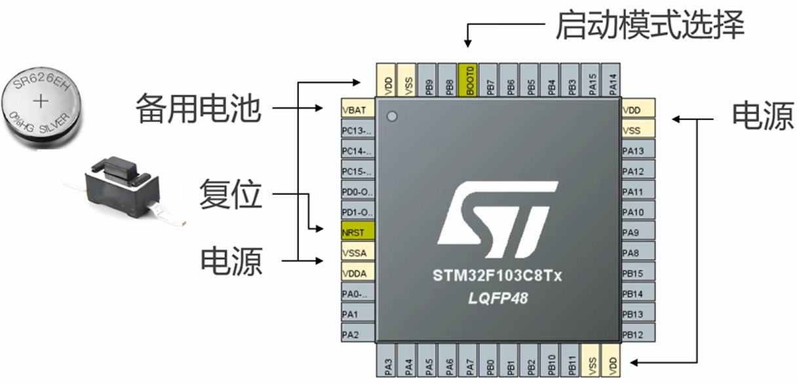
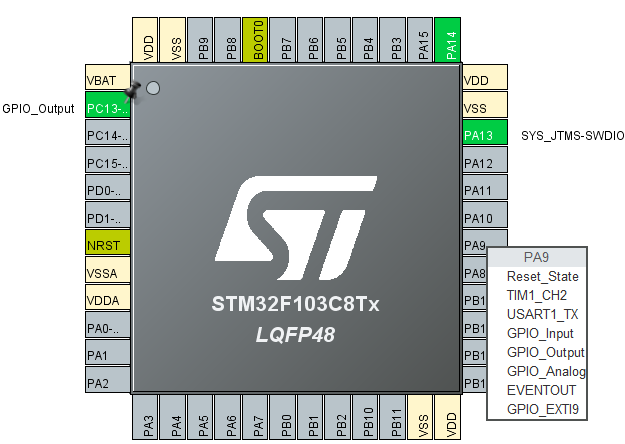
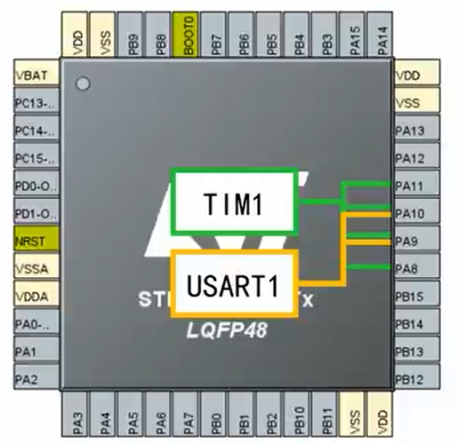
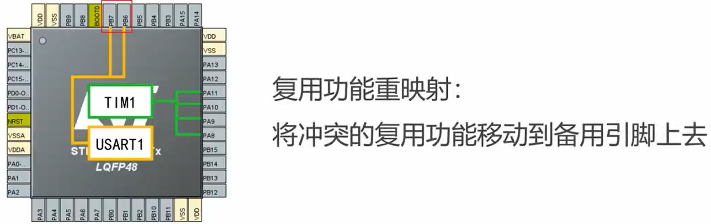
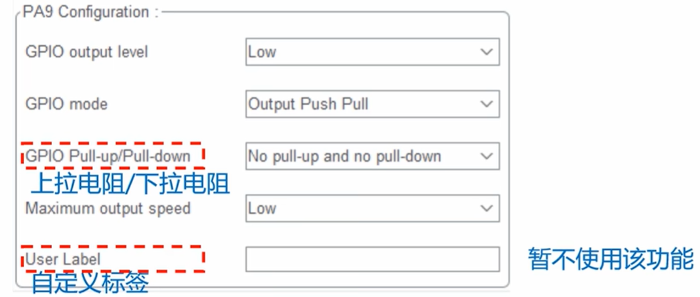

# P2_GPIO

## GPIO口

**通过cubemx认识芯片引脚分布**



芯片的引脚分为了特殊引脚（不能通过变成控制），普通IO引脚（可编程控制）。

### IO复用和重映射

- 复用
  - 比如键盘的数字按键既可以输入数字也可以输入符号。
  - 有一些引脚默认就是通用功能，但是可以复用为其他功能
  - 
- 重映射
  - 当使用到同一个IO口的不同功能时，引脚发生冲突。
  - 
  - 那么可以重新映射到备用引脚上解决引脚冲突问题
  - 

### 参数设置的说明

**GPIO口的参数**



## GPIO常用接口

**初始化函数**

- `HAL_GPIO_Init()`: 根据指定的参数初始化 GPIO 引脚
- `HAL_GPIO_DeInit()`: 将 GPIO 引脚重置为默认状态

**读写操作函数**

- `HAL_GPIO_ReadPin()`: 读取指定 GPIO 引脚的状态
- `HAL_GPIO_WritePin()`: 设置指定 GPIO 引脚的状态
- `HAL_GPIO_TogglePin()`: 翻转指定 GPIO 引脚的状态

**中断相关**

- `HAL_GPIO_EXTI_Callback()`: GPIO 外部中断回调函数

使用这些接口时需要注意：

1. 初始化 GPIO 前需要先使能对应的 GPIO 时钟
2. 配置 GPIO 时需要正确设置 GPIO_InitTypeDef 结构体的各个参数
3. 使用中断功能时需要配置 NVIC 并使能对应的中断线
4. 在使用复用功能时需要正确配置 Alternate 参数

```c
// 1. GPIO 初始化与反初始化
void HAL_GPIO_Init(GPIO_TypeDef *GPIOx, GPIO_InitTypeDef *GPIO_Init);
void HAL_GPIO_DeInit(GPIO_TypeDef *GPIOx, uint32_t GPIO_Pin);

// 2. GPIO 读写操作
GPIO_PinState HAL_GPIO_ReadPin(GPIO_TypeDef *GPIOx, uint16_t GPIO_Pin);
void HAL_GPIO_WritePin(GPIO_TypeDef *GPIOx, uint16_t GPIO_Pin, GPIO_PinState PinState);
void HAL_GPIO_TogglePin(GPIO_TypeDef *GPIOx, uint16_t GPIO_Pin);

// 3. GPIO 中断回调函数
void HAL_GPIO_EXTI_Callback(uint16_t GPIO_Pin);

// 4. GPIO 配置结构体
typedef struct {
    uint32_t Pin;       // GPIO 引脚选择
    uint32_t Mode;      // GPIO 模式选择
    uint32_t Pull;      // GPIO 上下拉选择
    uint32_t Speed;     // GPIO 速度选择
    uint32_t Alternate; // GPIO 复用功能选择
} GPIO_InitTypeDef;

// 5. GPIO 模式定义
#define GPIO_MODE_INPUT                 0x00000000U   // 输入浮空
#define GPIO_MODE_OUTPUT_PP             0x00000001U   // 输出推挽
#define GPIO_MODE_OUTPUT_OD             0x00000011U   // 输出开漏
#define GPIO_MODE_AF_PP                 0x00000002U   // 复用推挽
#define GPIO_MODE_AF_OD                 0x00000012U   // 复用开漏
#define GPIO_MODE_ANALOG               0x00000003U   // 模拟
#define GPIO_MODE_IT_RISING            0x10110000U   // 上升沿触发
#define GPIO_MODE_IT_FALLING           0x10210000U   // 下降沿触发
#define GPIO_MODE_IT_RISING_FALLING    0x10310000U   // 双边沿触发

// 6. GPIO 上下拉定义
#define GPIO_NOPULL                    0x00000000U   // 无上下拉
#define GPIO_PULLUP                    0x00000001U   // 上拉
#define GPIO_PULLDOWN                  0x00000002U   // 下拉

// 7. GPIO 速度定义
#define GPIO_SPEED_FREQ_LOW            0x00000000U   // 低速
#define GPIO_SPEED_FREQ_MEDIUM         0x00000001U   // 中速
#define GPIO_SPEED_FREQ_HIGH           0x00000002U   // 高速
#define GPIO_SPEED_FREQ_VERY_HIGH      0x00000003U   // 超高速
```

**为什么还有初始化类的接口？初始化不是可以使用cubemx生成吗？是为了用户在程序中二次更改配置时使用吗？比如开始是cubemx生成的，但是后面程序运行过程中需要更改配置时就能用到这个接口？**

是的,你理解得很准确! HAL_GPIO_Init() 这类初始化接口存在的主要原因确实是为了让用户能在程序运行过程中动态修改 GPIO 的配置。

这主要用于以下几种场景:

1. 动态切换 GPIO 工作模式 比如某个引脚开始是配置为输入模式用来检测按键,但在某些情况下需要切换成输出模式来驱动 LED。这时就可以重新调用 HAL_GPIO_Init() 来改变配置。
2. 运行时启用新功能
   例如,一开始某些 GPIO 没有启用中断功能,但在特定条件下需要启用中断检测。这时可以重新初始化该 GPIO 为中断模式。
3. 动态配置复用功能 某些引脚可能需要在普通 GPIO 和外设复用功能之间切换,比如:

```c
// 将引脚配置为普通输出模式
GPIO_InitTypeDef GPIO_InitStruct = {0};
GPIO_InitStruct.Pin = GPIO_PIN_5;
GPIO_InitStruct.Mode = GPIO_MODE_OUTPUT_PP;
HAL_GPIO_Init(GPIOA, &GPIO_InitStruct);

// ... 一些操作 ...

// later 将同一引脚重新配置为 UART TX
GPIO_InitStruct.Mode = GPIO_MODE_AF_PP;
GPIO_InitStruct.Alternate = GPIO_AF7_USART1;
HAL_GPIO_Init(GPIOA, &GPIO_InitStruct);
```

错误恢复 如果某个 GPIO 配置出现问题,可以通过 HAL_GPIO_DeInit() 将其恢复到默认状态,然后重新初始化。

所以虽然 CubeMX 能够生成初始配置代码,但这些初始化接口仍然是必要的,它们提供了运行时动态重配置的能力。这种灵活性在很多应用场景下都是很有用的。

不过需要注意的是,频繁地重新初始化 GPIO 可能会影响系统的实时性能,所以在时序要求严格的场合要谨慎使用。

