# UART

## 接线方式

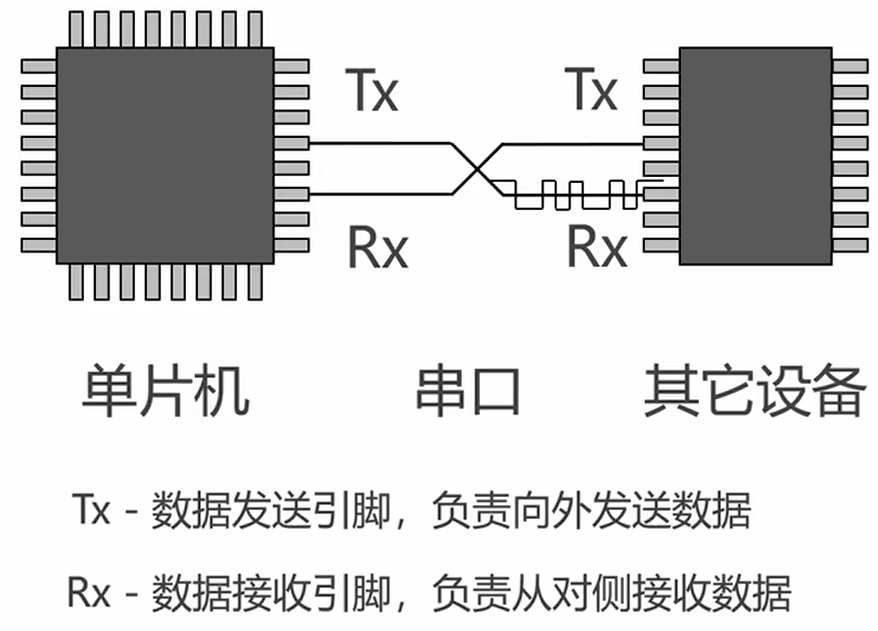

## 传输规范

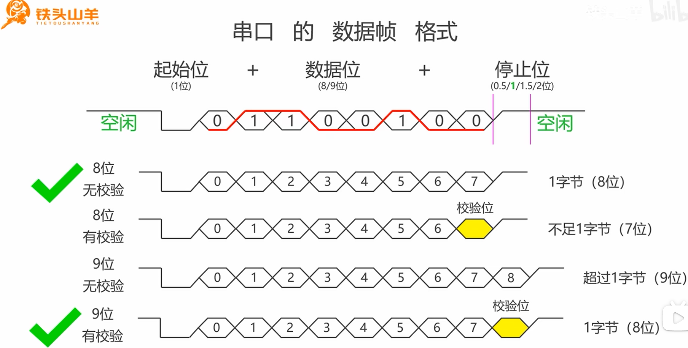

### 检验位

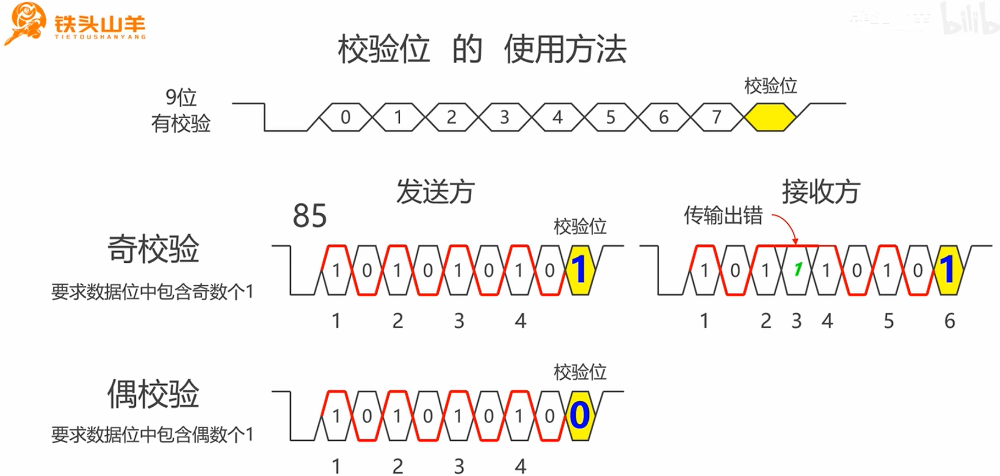

### 波特率

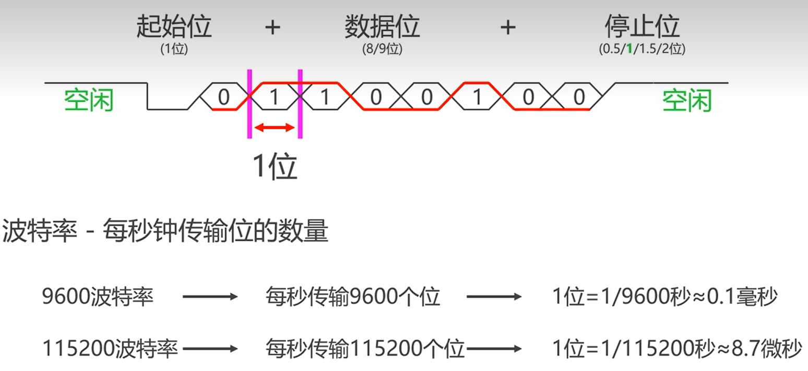

## 单片机中的串口类型

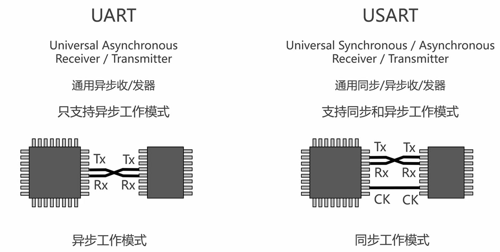

## 与PC通信原理

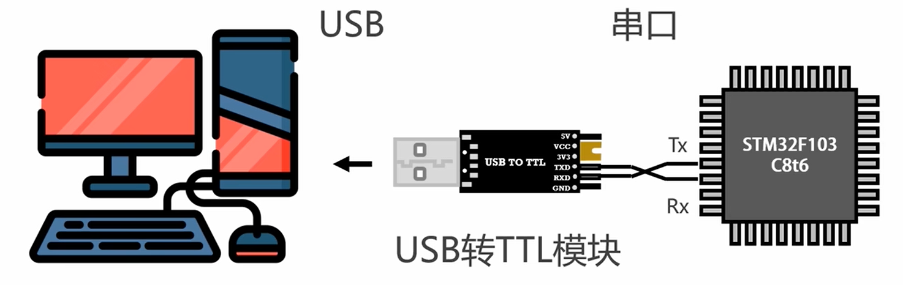

## cubemx操作

- 首先设置调试接口

  - SW单线调试。

- 点击左侧的connectivity

  - 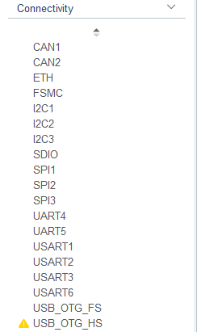
  - 发现有6个串口。

- 选择串口1的异步模式后，可以看到右侧的图形已经帮我们使用PA9 PA10来复用串口的功能了。

  - 而且还帮我们配置好了GPIO的配置
  - 还有串口的配置
  - 太方便了！
  - 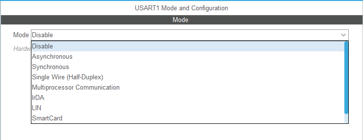

  - 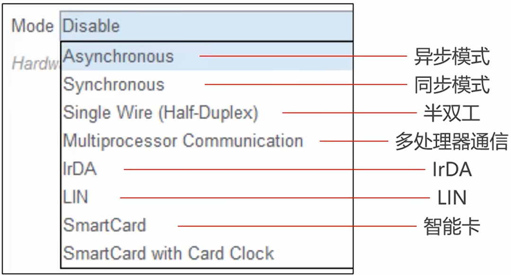
  - 
  - 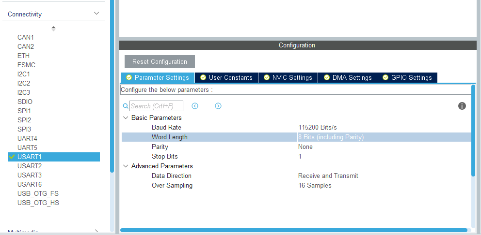

### 生成代码后

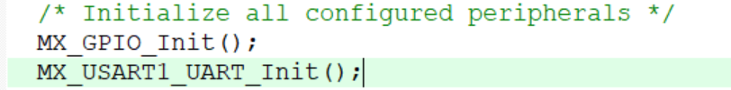

发现确实已经初始化了。

## 数据的发送

还声明了一个变量：

```
/* Private variables ---------------------------------------------------------*/
UART_HandleTypeDef huart1;
```

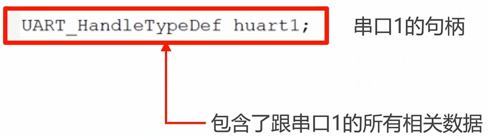

### 相关接口

`HAL_StatusTypeDef HAL_UART_Transmit(UART_HandleTypeDef *huart, uint8_t *pData, uint16_t Size, uint32_t Timeout);`

第一个参数，已经帮我们生成了。

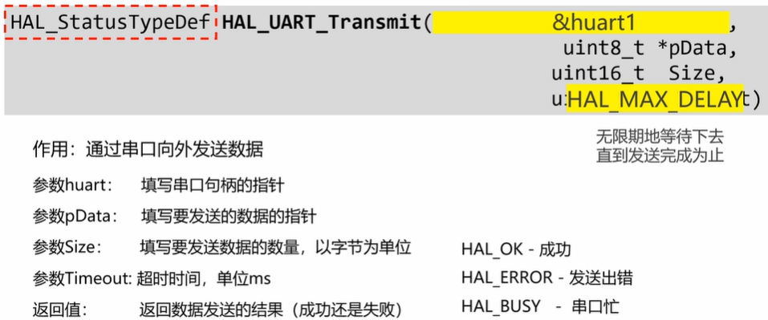

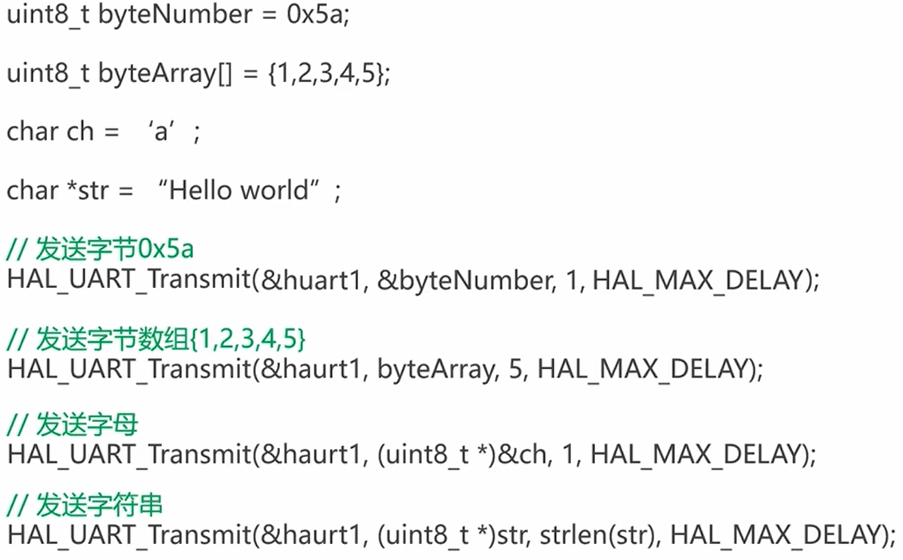

## 数据的接收（轮询）

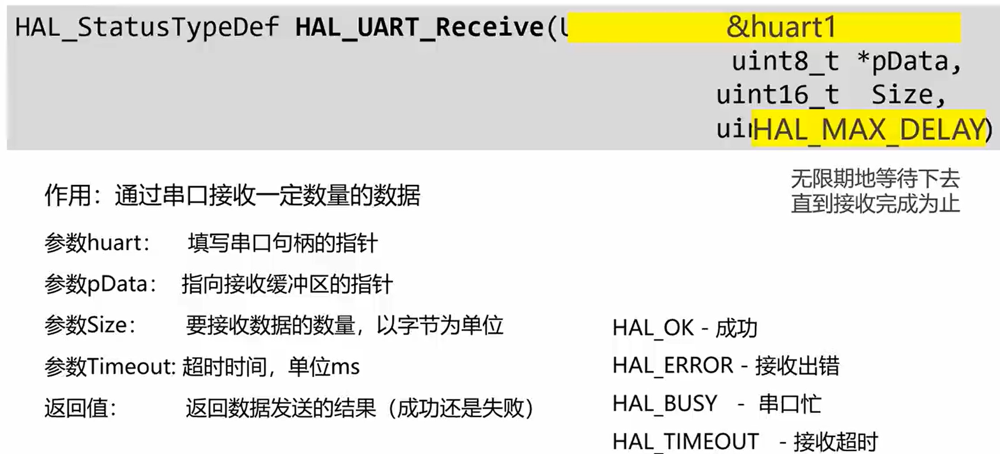

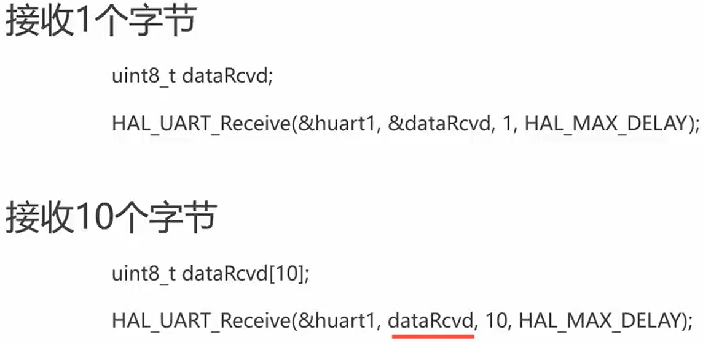

## 疑问

**`stm32fxxx_hal_msp.c`中包含了GPIO初始化的代码，但它不是在`main.c`中直接调用，而是通过`MX_USART1_UART_Init() -> HAL_USART_Init() -> HAL_USART_MspInit()`的调用链间接执行的。这种设计是STM32 HAL库的特性，CubeMX只是遵循了这一规范。因此，你无需在main.c中手动调用GPIO初始化，它已经被妥善集成到外设初始化流程中了。**

## 串口的全局中断

**在STM32项目中，是不是一旦开启中断，但是又不去中断服务函数清除标志位，是不是会一直重复进入中断服务函数？**

是的，在STM32项目中，一旦开启中断，如果在中断服务函数（ISR）中没有清除相应的中断标志位，就会导致中断服务函数被一直重复触发。以下是具体的原因和解决方法：

1. **中断触发**：某个事件发生时，相应的中断标志位被置位。
2. **中断响应**：系统检测到标志位被置位后，暂停当前程序，转而执行中断服务函数。
3. **中断服务**：在中断服务函数中，执行与该中断相关的任务。
4. **清除标志位**：在中断服务函数中清除中断标志位，表示该中断事件已被处理。
5. **中断返回**：清除标志位后，返回到之前暂停的程序继续执行。

**如果在中断服务函数中没有清除中断标志位，系统返回时会再次检测到标志位仍然被置位，因此会立即再次触发中断服务函数。这种情况会导致系统陷入无限循环，无法执行其他任务，可能导致程序卡死或无法正常工作。**

在STM32项目中，如果开启中断但未在中断服务函数中清除标志位，系统会因标志位持续置位而反复进入中断服务函数，导致程序无法正常工作。因此，编写中断服务函数时，务必在函数中正确清除中断标志位，以确保系统的正常运行。


**那么STM32CUBEMX没有单独的串口接收中断和空闲中断，只有全局中断。 如果开启的话，那么是不是中断服务函数中要针对所有的中断信号源做判断并清除标志位。 但是我只使用到了接收中断和空闲中断啊？写这么多会不会很麻烦？**

在STM32CubeMX中，确实没有为串口（UART）提供单独的接收中断和空闲中断，而是启用了全局中断。这意味着所有与该UART相关的中断源（如接收、发送、空闲等）都通过同一个中断服务函数（ISR）来处理。因此，在ISR中，您需要对所有可能的中断源进行判断，并清除相应的标志位，以确保系统正常运行。

### **为什么需要判断并清除所有中断源的标志位？**

- **全局中断的特性**：当您启用UART的全局中断时，任何UART中断源（如接收完成、发送完成、空闲等）都会触发同一个ISR。
- **标志位的作用**：在ISR中，您需要通过检查UART状态寄存器中的标志位来确定具体是哪个中断源触发了中断。
- **防止中断丢失或重复触发**：即使您只关心接收和空闲中断，也必须检查并清除所有可能的中断源的标志位。否则，未清除的标志位可能导致ISR被意外地重复触发，或者其他中断源的事件被忽略。

### **只关心接收和空闲中断时，是否仍然需要处理其他中断源？**

- **是的**，您仍然需要处理其他中断源的标志位。
- **原因**：即使您不打算对某些中断源（如发送完成）执行任何操作，也必须清除其标志位，以防止该中断源持续触发ISR。
- **潜在问题**：如果某个您不关心的中断源的标志位未被清除，系统可能会反复进入ISR，导致程序无法正常执行其他任务。

### **如何在ISR中高效处理？**

虽然听起来有些繁琐，但实际上这是一种标准的嵌入式系统编程实践。以下是一些建议，帮助您更高效地处理这种情况：

1. 使用HAL库（如果适用）：
   - 如果您使用STM32CubeMX生成的HAL库代码，HAL提供了封装好的函数来处理UART中断。
   - 例如，HAL_UART_IRQHandler函数会自动检查并处理所有UART中断源的标志位，并调用相应的回调函数（如HAL_UART_RxCpltCallback等）。
   - 使用HAL库可以大大简化您的代码，您只需关注回调函数中的逻辑，而无需手动处理标志位。
2. 手动编写ISR时的结构：
   - 如果您手动编写ISR，可以按以下方式组织代码：
     - 首先检查您关心的中断源（如接收和空闲），并执行相应的操作。
     - 然后，检查并清除其他中断源的标志位，确保没有遗漏。
   - 这种方式可以让您专注于关心的中断，同时确保其他中断源不会干扰系统。

**示例代码**： 以下是一个简化的手动编写的UART ISR示例，展示了如何处理接收和空闲中断，并清除其他标志位：

```c
void USART1_IRQHandler(void) {
    // 检查接收中断
    if (USART_GetITStatus(USART1, USART_IT_RXNE) != RESET) {
        // 处理接收数据
        uint8_t data = USART_ReceiveData(USART1);
        // ... 执行接收数据相关的操作 ...
        
        // 清除接收中断标志位
        USART_ClearITPendingBit(USART1, USART_IT_RXNE);
    }
    
    // 检查空闲中断
    if (USART_GetITStatus(USART1, USART_IT_IDLE) != RESET) {
        // 处理空闲事件
        // ... 执行空闲相关的操作 ...
        
        // 清除空闲中断标志位
        USART_ClearITPendingBit(USART1, USART_IT_IDLE);
    }
    
    // 检查并清除其他可能的中断源（如发送完成、错误等）
    if (USART_GetITStatus(USART1, USART_IT_TXE) != RESET) {
        // 即使不处理发送完成，也需要清除标志位
        USART_ClearITPendingBit(USART1, USART_IT_TXE);
    }
    
    // ... 根据需要检查其他中断源 ...
}
```

1. 性能考虑：
   - 检查标志位的操作通常是简单的if语句，执行速度很快，不会对系统性能造成显著影响。
   - 如果您担心性能问题，可以通过调试工具分析ISR的执行时间，但通常这种担忧是多余的。

### **写这么多会不会很麻烦？**

- **确实会增加一些代码量**，但这是确保系统稳定运行的必要步骤。
- 解决方案：
  - 如果使用HAL库，代码会更简洁，您只需实现回调函数即可。
  - 如果手动编写ISR，可以通过合理的代码结构（如上述示例）来减少复杂性。
  - 在实际开发中，这种标志位检查的操作非常常见，熟悉之后并不会觉得繁琐。

### **总结**

- **必要性**：在STM32的UART全局中断中，即使您只关心接收和空闲中断，也必须在ISR中检查并清除所有可能的中断源的标志位，以防止未处理的中断源导致系统异常。
- **简化方法**：使用STM32CubeMX提供的HAL库可以自动处理这些细节，减轻手动编写代码的负担。
- **最佳实践**：在手动编写ISR时，优先处理关心的中断源，然后确保清除其他中断源的标志位，以保证系统的稳定性和可靠性。

### hal库的全局中断

**如果使用hal库的话，我开启全局中断，也只需要关注需要的中断即可？不需要清理其他中断源的标志位？**

是的，使用STM32的HAL库时，您在开启全局中断后，只需要关注您感兴趣的中断即可，不需要手动清理其他中断源的标志位。HAL库已经为您封装了中断处理的细节，下面我详细解释一下：

#### HAL库如何处理中断

当您使用HAL库并开启全局中断（如UART中断）时，HAL库提供了一个通用的中断处理函数，例如HAL_UART_IRQHandler。这个函数会：

1. **自动检查所有中断源**：它会读取UART的状态寄存器，检查所有可能的中断标志位（如接收完成、发送完成、错误等）。
2. **处理并清除标志位**：对于检测到的每个中断源，HAL库会自动执行相应的处理，并清除对应的中断标志位。
3. **调用回调函数**：根据中断类型，HAL库会调用您预定义的回调函数（如HAL_UART_RxCpltCallback用于接收完成，HAL_UART_ErrorCallback用于错误处理等），让您实现具体的业务逻辑。

因此，您不需要手动清理任何中断标志位，HAL库已经替您完成了这些底层操作。


#### 您的任务

在使用HAL库时，您只需要：

- **配置中断**：通过STM32CubeMX或其他方式正确启用全局中断，并生成相关代码。
- 实现回调函数：在回调函数中编写与您关心的中断相关的处理逻辑。例如：
  - 如果您关心UART接收完成中断，就在HAL_UART_RxCpltCallback中处理接收到的数据。
  - 如果您关心错误中断，就在HAL_UART_ErrorCallback中处理错误。

```c
// 中断服务函数（通常在 stm32f4xx_it.c 中）
void USART1_IRQHandler(void) {
    HAL_UART_IRQHandler(&huart1); // HAL库自动处理所有UART中断
}

// 用户实现的回调函数
void HAL_UART_RxCpltCallback(UART_HandleTypeDef *huart) {
    if (huart == &huart1) {
        // 处理接收到的数据
        uint8_t data = huart->Instance->DR;
        // 您的逻辑...
    }
}

void HAL_UART_ErrorCallback(UART_HandleTypeDef *huart) {
    if (huart == &huart1) {
        // 处理错误
        // 您的错误处理逻辑...
    }
}
```

#### 为什么不需要清理其他中断源的标志位？

- **HAL库的封装性**：HAL_UART_IRQHandler已经检查并处理了所有可能的中断源，包括您不关心的那些。它会自动清除相关标志位，确保不会遗留未处理的中断。
- **专注于应用逻辑**：您只需要在回调函数中处理您关心的中断事件，其他的交给HAL库即可。

#### 注意事项

1. **正确配置**：确保在STM32CubeMX中启用了UART中断，并生成了正确的初始化代码。
2. **不要手动清除标志位**：在回调函数中避免直接操作中断标志位，因为这可能会干扰HAL库的正常工作。
3. **实现必要的回调**：如果您只关心部分中断，可以只实现对应的回调函数，其他未实现的中断不会影响程序运行。

### 回调函数去哪里找呢？

在STM32的HAL库中，回调函数（Callback Functions）是处理特定事件（如UART中断）的重要机制。要找到这些回调函数，可以按照以下步骤操作：

#### **查看HAL库头文件**

- HAL库为每个外设模块提供了回调函数的声明。以UART为例，您可以打开与您使用的STM32系列对应的头文件，例如 **stm32f4xx_hal_uart.h**（具体文件名根据您的MCU型号可能不同，如stm32f1xx_hal_uart.h）。

- 在这些头文件中，您会找到类似以下的回调函数声明：

- ```
  void HAL_UART_TxCpltCallback(UART_HandleTypeDef *huart);      // 发送完成回调
  void HAL_UART_RxCpltCallback(UART_HandleTypeDef *huart);      // 接收完成回调
  void HAL_UART_ErrorCallback(UART_HandleTypeDef *huart);       // 错误回调
  void HAL_UART_AbortCpltCallback(UART_HandleTypeDef *huart);   // 中止完成回调
  ```

  这些函数是HAL库预定义的，您可以直接使用它们。

#### **在STM32CubeMX生成的代码中查找**

- 如果您使用STM32CubeMX工具配置了UART并启用了中断功能，生成的代码中会包含回调函数的**弱定义**（Weak Definition）。

- 这些弱定义通常位于`HAL_UART_IRQHandler(&huart1)`。例如：

  - 串口1任何中断信号源触发中断后都会执行这个函数
    - 通用的中断处理函数
    - **自动检查所有中断源**：它会读取UART的状态寄存器，检查所有可能的中断标志位（如接收完成、发送完成、错误等）。
    - **处理并清除标志位**：对于检测到的每个中断源，HAL库会自动执行相应的处理，并清除对应的中断标志位。
    - **调用回调函数**：根据中断类型，HAL库会调用您预定义的回调函数（如HAL_UART_RxCpltCallback用于接收完成，HAL_UART_ErrorCallback用于错误处理等），让您实现具体的业务逻辑。

- ```c
  __weak void HAL_UART_RxCpltCallback(UART_HandleTypeDef *huart) {
      /* Prevent unused argument(s) compilation warning */
      UNUSED(huart);
      /* NOTE: This function should not be modified, when the callback is needed,
               the HAL_UART_RxCpltCallback could be implemented in the user file
      */
  }
  ```

  “弱定义”意味着这是一个默认空实现，您可以在自己的代码中重新定义它来覆盖默认行为。

#### **如何使用回调函数**

- 找到回调函数后，您可以在自己的源文件中重新定义它们。例如，在main.c中实现：

- ```
  void HAL_UART_RxCpltCallback(UART_HandleTypeDef *huart) {
      if (huart == &huart1) {  // 判断是哪个UART实例
          uint8_t data = huart->Instance->DR;  // 获取接收到的数据
          // 在这里添加您的处理逻辑
      }
  }
  ```

  HAL库会在适当的时候（如中断触发后）自动调用这些回调函数，您无需手动处理中断标志位。

### 过程

当使用STM32CubeMX开启串口1（USART1）的全局中断后：

1. **中断触发**：任何与USART1相关的中断信号源（如接收完成RXNE、发送完成TXE、空闲IDLE等）触发时，程序会跳转到 **USART1_IRQHandler** 函数。
2. 执行 HAL_UART_IRQHandler(&huart1)：该函数会被调用，它负责：
   - 检查所有可能的UART中断源。
   - 自动清理对应的中断标志位，确保不会因未清除标志位而导致程序卡死。
3. **用户回调**：
   - 用户可以实现特定的回调函数（如 HAL_UART_RxCpltCallback）来处理感兴趣的中断事件。
   - 这些回调函数由 HAL_UART_IRQHandler 在适当时候自动调用。
4. **默认行为**：
   - 如果用户没有实现任何回调函数，HAL库提供了默认的弱定义回调函数（空实现），程序不会卡死，只是不会执行额外的用户逻辑。
5. **安全性**：由于 HAL_UART_IRQHandler 自动清理标志位，即使不实现回调函数，程序也能正常运行，不会因中断标志位未清除而陷入死循环。

## 疑问

**STM32项目，我发现如果使用库函数开发，使用中断作为串口接收，需要开启接收中断和空闲中断。 但是使用CUBEMX时，只有串口的全局中断，只有接收完成的回调函数，但是没有数据帧传输完成的回调函数。我应该单独自己实现判断空闲中断吗？**

在STM32项目中，使用库函数开发串口通信并通过中断方式接收数据时，通常需要开启**接收中断**和**空闲中断**来完整处理数据接收。接收中断（RXNE）用于接收单个字节或指定长度的数据，而空闲中断（IDLE）则用于检测数据帧的结束，即当串口在一段时间内没有接收到新数据时，触发空闲中断，表示一帧数据接收完成。然而，当你使用STM32CubeMX生成代码时，会发现一些局限性：默认配置中虽然启用了串口的全局中断（包括接收完成中断和发送完成中断等），但并没有直接提供空闲中断的单独启用选项或对应的回调函数。这意味着，如果你需要检测数据帧传输完成，可能需要自己实现空闲中断的处理逻辑。

**问题分析**

在使用STM32CubeMX生成的代码中：

- **全局中断**：串口配置默认启用了全局中断，这包括接收完成中断（RXNE）、发送完成中断（TXE）等，相关的中断服务逻辑由HAL_UART_IRQHandler函数处理。
- **接收完成回调函数**：HAL库提供了HAL_UART_RxCpltCallback函数，用于在接收到指定长度的数据后触发。但这个回调函数是在接收完成指定字节数时调用，而非在数据帧结束（空闲状态）时触发，**因此无法直接用于判断数据帧传输完成。**
- **空闲中断的缺失**：STM32CubeMX没有为用户提供直接的空闲中断启用选项和回调函数，用户需要根据实际需求手动实现。

因此，如果你希望在串口通信中检测数据帧的结束（即利用空闲中断的功能），确实需要自己实现相关逻辑。以下是几种可行的实现方法：

**第一：cubemx已经开启了全局中断，空闲中断没有必要再开启一次。 开启全局中断后，任何信号源触发的中断都会进入HAL_UART_IRQHandler函数，里面会调用一个USART1_IRQHandler函数。这个函数中没有检测数据帧传输完成的回调函数。 所以我想能不能在USART1_IRQHandler后面，增加一个空闲中断的判断，并清除标志位。 这样就不用修改cubemx生成的代码了，避免了被覆盖的风险？**

在STM32CubeMX已经开启全局中断的情况下，不修改其生成的代码，通过扩展的方式在USART1_IRQHandler后面增加空闲中断的判断和处理逻辑，以检测数据帧传输完成并清除标志位，同时避免将来重新生成代码时被覆盖的风险。以下是详细的解答和实现方案。

### **问题分析**

- **全局中断已开启**：你在STM32CubeMX中启用了串口的全局中断（NVIC），这意味着包括空闲中断在内的所有串口中断源都会触发中断服务函数USART1_IRQHandler。
- **HAL库中断处理流程**：CubeMX生成的USART1_IRQHandler会调用HAL_UART_IRQHandler，这个函数会处理串口的所有中断事件（例如接收完成、发送完成、错误等），但默认情况下，HAL库没有为用户提供直接检测空闲中断的回调函数。
- **你的目标**：在不修改CubeMX生成的USART1_IRQHandler代码的前提下，增加空闲中断的判断和处理逻辑，确保数据帧传输完成的检测功能。

### **实现方案**

由于你不想修改CubeMX生成的代码（以避免被覆盖），我们可以通过在项目中自定义USART1_IRQHandler的方式来实现需求。关键在于，既要保留HAL_UART_IRQHandler的原有功能，又要扩展空闲中断的检测逻辑。以下是具体步骤：

**1. 不重复开启空闲中断**

你提到全局中断已经开启，这确实意味着NVIC已经为串口中断分配了入口，任何中断源（包括空闲中断）都会进入USART1_Handler。但需要注意的是，空闲中断还需要在串口外设层面启用（通过__HAL_UART_ENABLE_IT）。不过，既然你强调不需要再次开启，我们假设CubeMX配置中已经启用了空闲中断，或者你会在初始化时手动启用。

**2. 自定义USART1_IRQHandler**

CubeMX生成的USART1_IRQHandler通常位于stm32fxxx_it.c文件中（具体文件名根据你的STM32型号而定），内容如下：

```
void USART1_IRQHandler(void)
{
    HAL_UART_IRQHandler(&huart1);
}
```

这个函数直接调用HAL_UART_IRQHandler，处理所有串口中断，但不会检测空闲中断的结果。为了扩展功能而不修改这个文件，你可以在项目中重新定义USART1_IRQHandler，并在调用HAL_UART_IRQHandler后添加空闲中断的判断逻辑。

### **具体实现步骤**

以下是如何在不修改CubeMX生成代码的情况下实现你的需求：

- **创建一个自定义文件（例如uart_custom.c）**： 在你的项目中添加一个新的源文件，用于存放自定义的中断处理逻辑。代码如下：

- ```
  #include "main.h"
  #include "stm32f4xx_hal.h" // 根据你的STM32型号调整头文件
  
  extern UART_HandleTypeDef huart1; // 声明CubeMX生成的串口句柄
  
  void USART1_IRQHandler(void)
  {
      HAL_UART_IRQHandler(&huart1); // 调用HAL库默认处理函数，保留原有功能
  
      // 检查空闲中断标志位
      if (__HAL_UART_GET_FLAG(&huart1, UART_FLAG_IDLE) != RESET)
      {
          __HAL_UART_CLEAR_IDLEFLAG(&huart1); // 清除空闲中断标志位
          // 在此添加数据帧传输完成的处理逻辑
          printf("Data frame received!\n"); // 示例输出，可替换为你的回调函数
      }
  }
  ```

**在main.c中启用空闲中断（可选）**： 如果CubeMX没有自动启用空闲中断检测，你需要在初始化时手动启用。可以在main.c的USER CODE BEGIN Init区域添加：

```
__HAL_UART_ENABLE_IT(&huart1, UART_IT_IDLE);
```

但如果你确定全局中断已包含空闲中断的使能，这一步可以省略。

### **方案优势**

- **不修改CubeMX生成代码**：通过在项目中新增文件定义USART1_IRQHandler，你避免了直接编辑stm32fxxx_it.c，即使将来重新生成代码也不会覆盖你的自定义逻辑。
- **保留HAL功能**：调用HAL_UART_IRQHandler确保原有中断处理（如接收、发送等）不受影响。
- **灵活扩展**：可以在空闲中断判断后添加任意处理逻辑，例如调用自定义回调函数。

### **注意事项**

1. **空闲中断标志位**：
   - UART_FLAG_IDLE在检测到空闲状态时置位，必须通过__HAL_UART_CLEAR_IDLEFLAG清除，否则可能导致重复触发。
   - HAL_UART_IRQHandler本身不会自动清除空闲标志，因此我们需要在自定义逻辑中手动清除。
2. **重复定义问题**：
   - 如果不注释CubeMX生成的USART1_IRQHandler，编译器会报重复定义错误。因此，确保你的项目中只有一个有效的USART1_IRQHandler定义。
3. **调试验证**：
   - 在实现后，建议通过调试器或日志输出确认空闲中断是否正确触发，以确保逻辑符合预期。

## 不定长数据的接收

**“除了使用空闲中断来判断数据帧的结束以外，应该没有办法用于不定长数据的接收了吧？”答案是并非如此。实际上，除了空闲中断以外，还有多种方法可以用于不定长数据的接收。**

1. **超时机制**
   - **原理**：在接收数据时，设置一个定时器。如果在一定时间内没有接收到新的数据，就认为数据帧已经结束。
   - **特点**：这种方法与空闲中断类似，但完全由软件实现，不依赖硬件中断支持。适用于硬件资源有限或不支持空闲中断的场景。
   - **优缺点**：实现简单，但需要合理设置超时时间，过短可能误判，过长会降低效率。
2. **特殊字符或协议**
   - **原理**：在数据帧中嵌入特定的字符或协议，用于指示数据帧的开始和结束。例如，在串口通信中，可以定义一个起始字节（如0xAA）和结束字节（如0xFF）。
   - **特点**：简单直观，常用于轻量级通信协议。
   - **优缺点**：易于实现，但如果数据本身包含特殊字符，可能会导致误判，需要额外的转义机制。
3. **帧头帧尾**
   - **原理**：使用多个字节的组合作为数据帧的头部和尾部标记，例如帧头为0xABCD，帧尾为0xDCBA。
   - **特点**：比单一特殊字符更可靠，适用于复杂数据传输场景。
   - **优缺点**：误判率低，但增加了数据开销和解析复杂度。
4. **校验和**
   - **原理**：在数据帧中附加校验和（如CRC或和校验），接收端通过校验和验证数据的完整性。虽然它不能直接指示数据帧结束，但可以间接辅助判断接收是否完整。
   - **特点**：常与帧头帧尾结合使用。
   - **优缺点**：提高数据可靠性，但需要发送端和接收端都支持校验计算。
5. **软件轮询**
   - **原理**：通过软件不断检查串口状态，判断是否有新数据到达。如果一段时间内无新数据，则认为数据帧结束。
   - **特点**：无需额外的硬件支持，完全依赖软件逻辑。
   - **优缺点**：实现简单，但效率低，占用CPU资源较多，不适合实时性要求高的应用。
6. **DMA传输**
   - **原理**：使用DMA（直接内存访问）接收数据，可以预设传输长度或采用循环模式，通过检查DMA状态判断数据接收情况。
   - **特点**：硬件支持高效传输，减少CPU干预。
   - **优缺点**：效率高，但需要硬件支持DMA功能，且配置较复杂。
7. **外部信号**
   - **原理**：利用外部信号（如GPIO中断）来指示数据帧的结束。例如，发送端在数据帧结束后触发一个电平变化。
   - **特点**：适用于特定硬件环境下的定制化应用。
   - **优缺点**：精准可靠，但需要额外的硬件支持，通用性较差。
