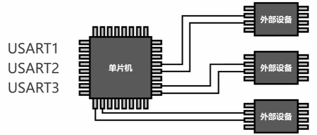
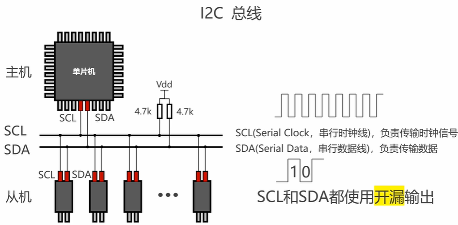
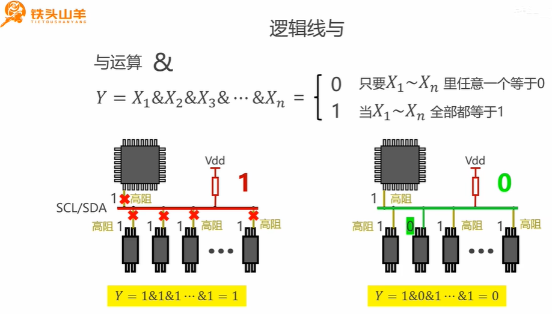
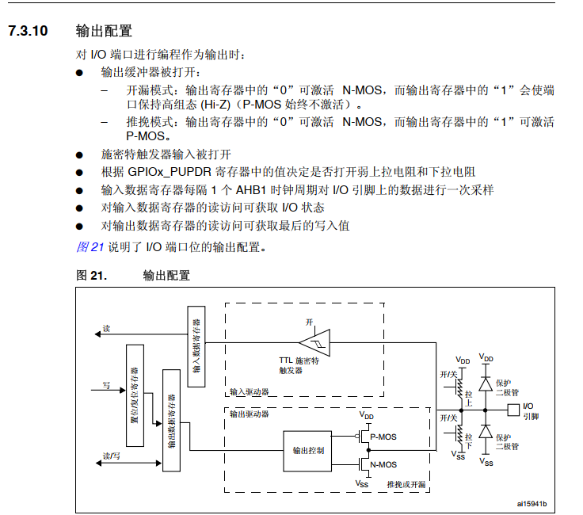
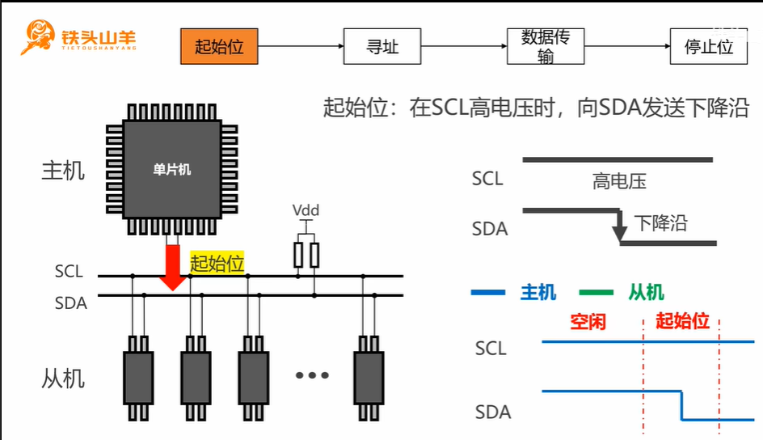
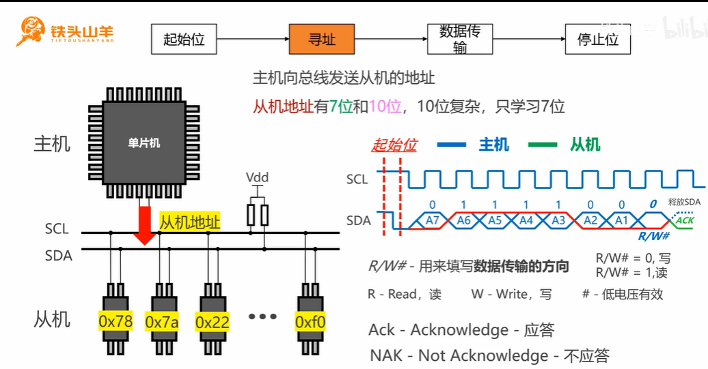
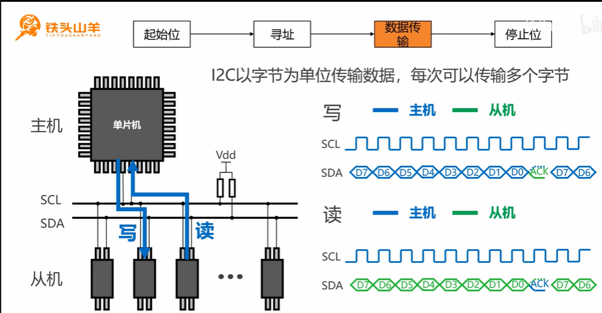
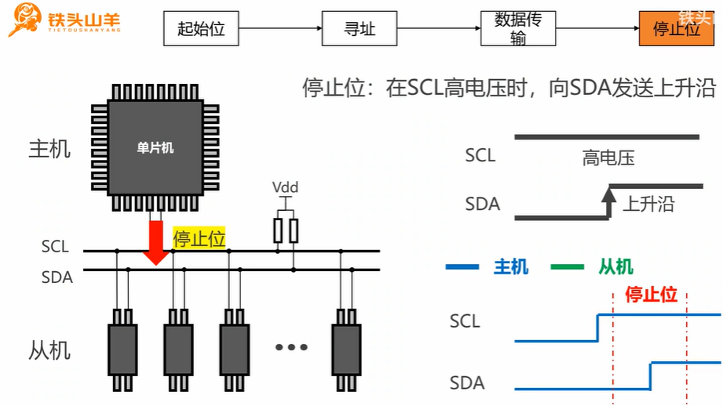
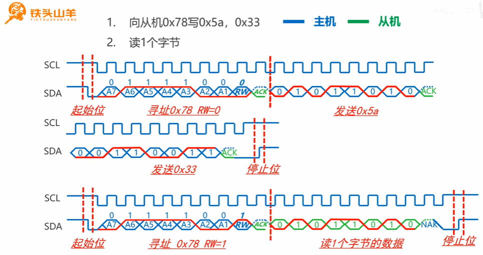
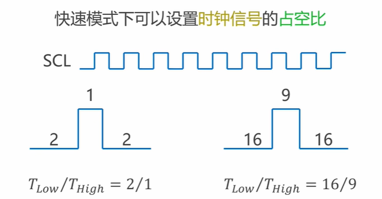

# P4_IIC

**串口是点对点，IIC是一主多从。**

## 逻辑线与（开漏模式）

## 为什么

**STM32项目，解释一下为什么IIC的时钟线和数据线都配置开漏输出？ 那么主机要接收从机的数据时，怎么切换传输方向呢？**

### 为什么使用开漏输出？

1. **有效的线与逻辑**：I²C是一种多主机总线，允许多个设备连接到同一总线上。开漏配置允许多个设备可以同时驱动总线而不会造成冲突。
2. **电平转换**：开漏配置加上上拉电阻可以实现不同电压域之间的通信。例如，3.3V设备可以与5V设备通信。
3. **时钟拉伸**：从机可以通过拉低SCL线来延长时钟周期，这可以让慢速设备有更多时间处理数据。
4. **仲裁机制**：在多主机情况下，开漏配置允许主机在发送数据时监测总线状态，实现碰撞检测。

### 主机接收从机数据时的方向切换

在I²C通信中，数据传输方向的切换非常优雅，不需要额外的控制线：

1. **主机发送模式**：主机将SDA线拉低（写入0）或释放（写入1），从机读取SDA线上的电平。
2. **主机接收模式**：主机简单地将SDA配置为输入（在开漏模式下只需停止拉低SDA）。此时，主机不主动驱动数据线，仅通过上拉电阻保持高电平。
3. 方向切换过程：
   - 主机发送设备地址和R/W位（R/W=1表示读取）
   - 从机确认（ACK）
   - 主机释放SDA线（不再主动拉低）
   - 从机开始驱动SDA线发送数据
   - 主机在每个字节后发送ACK或NACK

这种设计的关键在于：开漏配置使得任何设备都可以拉低总线（输出"0"），但没有设备可以强制拉高总线（输出"1"只能通过释放总线，依靠上拉电阻实现）。**因此，当主机需要接收数据时，它只需释放对SDA的控制，让从机来驱动SDA线，无需特殊的方向切换命令。**

### 理解

在STM32的GPIO开漏配置中，当设备不主动拉低引脚时，引脚确实相当于处于输入模式。这是因为开漏输出只能主动驱动低电平（拉低），而高电平则是通过外部上拉电阻被动实现的。

所以当主机需要从从机接收数据时：

1. 主机首先发送地址和读指令(R/W位设为1)
2. 从机确认(ACK)后
3. 主机仅需停止拉低SDA线(不进行任何GPIO模式重新配置)
4. 此时SDA线自动"转为"输入状态，因为开漏输出不主动拉低时就相当于高阻态
5. 主机通过读取GPIO输入数据寄存器(IDR)的值来获取从机发送的数据

**在STM32中，无论GPIO配置为输入模式还是输出模式，输入数据寄存器(IDR)始终反映引脚的实际电平状态。这就使得开漏输出配置既可以输出(拉低)，也可以不改变GPIO配置就直接读取输入，非常适合I²C这种双向通信的总线。**

STM32的GPIO设计确实如您所说：

1. **输出模式下**：输入数据寄存器(IDR)路径始终是导通的。这意味着无论GPIO配置为何种输出模式(推挽、开漏等)，您都可以通过IDR读取该引脚上的实际电平状态。这对于检测外部设备是否改变了总线状态非常有用，也是I²C通信等场景的基础。
2. **输入模式下**：输出数据寄存器(ODR)的路径是断开的，因为在纯输入模式下，引脚不应该被内部驱动。

这种设计在I²C通信中特别有价值：

- 当GPIO配置为开漏输出时，既可以通过ODR控制引脚输出低电平
- 同时可以通过IDR读取引脚的实际状态，无论这个状态是由自己设置的还是被其他设备改变的

**这也解释了为什么I²C通信中无需频繁切换GPIO模式 - 因为开漏输出配置已经天然具备了双向通信的能力，主机可以在不重新配置GPIO的情况下，轻松实现从发送到接收的转换。**

此外，这一特性也用于实现I²C协议中的时钟拉伸(clock stretching)和总线仲裁(arbitration)等重要功能。

## 通信过程

### 起始位

### 寻址

### 数据传输

### 停止位

### 示例

### 时钟信号的占空比

### GPIO口的输出速度与IIC速度模式的大小关系

从时序角度来看：

1. **必要条件**：GPIO输出速度必须快于I²C通信速度，否则GPIO无法产生足够快的信号边沿来满足I²C协议要求的上升/下降时间。
2. 时序约束：如果GPIO速度低于I²C要求，将直接导致通信失败或不稳定，因为：
   - 信号边沿太慢，违反I²C协议的时序规范
   - 信号保持时间不足
   - 无法准确产生起始/停止条件
3. **实际设计中**：通常GPIO速度应设置为比I²C速度高一级或更多，以提供足够的时序余量，确保在实际电路中（有寄生电容、电感等）仍能可靠工作。

例如，当使用400kHz的快速模式I²C时，GPIO速度至少应该配置为高速模式，而不能使用低速或中速配置，因为这是协议工作的基本要求，而非可选的优化。

## 使用IIC控制器实现简单的数据收发

0.96寸的显示屏，实现点亮和熄灭。

## 软件IIC的原因

在 STM32 项目中，选择使用软件模拟 I2C（即“软件 I2C”或“位操作 I2C”）通常并不是因为硬件 I2C 或 HAL 库“缺少”起始信号、停止信号、数据发送或接收的函数，而是基于以下几个方面的考虑：

1. **灵活性与定制需求**
   硬件 I2C 外设遵循标准 I2C 协议，时序和信号都是预设好的。如果某个 I2C 设备在时序、信号电平或对时钟伸展（clock stretching）等方面有特殊要求，硬件 I2C 的固定机制可能难以满足需求。而软件 I2C 通过手动控制 GPIO，可以精细调节每个信号的产生时机，以适应特定设备的要求。
2. **端口和资源限制**
   在一些应用中，硬件 I2C 所对应的引脚可能已经被其他外设占用，或者硬件 I2C 数量有限。使用软件 I2C 可以灵活地选择任意 GPIO 引脚来实现 I2C 通信，从而解决硬件资源不足的问题。
3. **代码封装和设备差异**
   HAL 库提供的 I2C 发送、接收函数已经封装了起始信号、地址传输、数据传输和停止信号等操作，适用于大多数标准 I2C 设备。**但很多 I2C 设备（尤其是一些特殊模块或传感器）在通信上可能会有“命令模式”与“数据模式”的区分，厂商提供的示例代码通常会将这些细节封装在一个或几个函数中，开发者无法直接控制每个信号的生成。软件 I2C 则可以根据具体设备需求，灵活调整信号细节，提供更为“仔细”的控制。**
4. **调试和兼容性**
   软件模拟 I2C 便于调试和排查问题。因为所有信号都是由软件生成，开发者可以在调试过程中随时观察、修改信号时序，适应复杂或非标准的设备通信协议。

综上所述，使用软件模拟 I2C 主要是为了获得更高的灵活性和定制控制能力，而不是因为 HAL 库或硬件 I2C 缺少某些函数。对于大部分标准设备，硬件 I2C 完全能够满足需求，但在一些特殊情况下，为了确保与设备的最佳兼容性和可靠性，开发者会选择通过软件方式实现 I2C 通信。

**比如某IIC设备，在示例中他的发送数据和发送命令是封装在一个函数中的，但是hal库或者标准外设库只提供了发送数据函数？ 但是可以在此基础上封装为示例中的函数啊。 所以函数不是使用软件IIC主要的原因？ 可能某一些IIC设备不是遵循标准IIC的话，使用硬件IIC的话就不行**

实际上，使用软件 I2C 并不主要是因为 HAL 库或标准外设库没有提供“发送命令”这样的函数，而更多是出于以下几点考虑：

1. **协议定制与灵活性**
   很多标准库函数都是针对标准 I2C 协议设计的，而某些 I2C 设备可能有自己特殊的协议要求，例如发送命令和数据可能需要在同一事务内完成，或者在时序和信号控制上有特殊要求。虽然在硬件 I2C 的基础上可以进行二次封装，但硬件模块通常只能按预定的时序和信号格式工作，这就限制了对非标准协议的适配。
2. **时序与信号精度控制**
   使用软件 I2C 可以手动控制每个信号的生成时机和电平变化，对于那些对时序要求较为苛刻或者需要特殊调整的设备，软件 I2C 更容易实现精细控制，确保设备能够正常通信。
3. **资源与灵活引脚选择**
   另外一个原因是硬件 I2C 所对应的引脚和外设资源可能有限或已被占用，软件 I2C 则允许开发者自由选择任意 GPIO 进行模拟，不受硬件资源的限制。

总的来说，虽然在硬件 I2C 的基础上可以通过封装函数来满足部分设备的通信需求，但对于那些协议不完全符合标准 I2C 规范或需要特殊控制的设备，软件 I2C 提供了更大的灵活性和可定制性，这才是很多开发者选择软件 I2C 的主要原因。

## 例子

以 SSD1306 OLED 显示屏为例，这种显示屏通常通过 I2C 接口进行通信，而且它的**通信协议要求在发送数据之前先发送一个控制字节，用以区分命令和数据**。在厂商提供的示例代码中，**经常会将“发送命令”和“发送数据”的流程封装到同一个函数里，以确保在同一次传输中，控制字节和后续的数据能够按正确的顺序发送。**

**硬件 I2C 的局限性：**
STM32 的 HAL 库通常提供类似 HAL_I2C_Master_Transmit() 这样的函数，这些函数主要关注“数据”层面的传输，**对于起始信号、停止信号、控制字节等细节都是自动处理的，无法灵活地在传输过程中插入额外的控制字节或调整时序**。如果想在硬件 I2C 的基础上封装一个类似 SSD1306 示例的函数，开发者就需要在已有函数的基础上进行**较复杂的二次封装，甚至可能需要绕过硬件模块的一些自动处理机制。**

**软件 I2C 的优势：**
使用软件 I2C（位操作方式）时，开发者可以手动控制 I2C 总线上每一条信号的生成：

- **起始信号**：可精确控制何时生成起始条件。
- **控制字节**：可以在发送命令或数据前，自由插入控制字节，以明确指示后续数据的类型。
- **时序控制**：能够根据设备的特殊要求调整时钟脉冲和数据稳定期。
- **停止信号**：在合适时刻生成停止信号，确保传输顺序符合设备要求。

这种手动控制能力使得软件 I2C 特别适用于那些对时序、信号顺序要求较高的设备，比如 SSD1306 OLED 显示屏，即使硬件 I2C 能够满足大多数标准 I2C 通信需求，但在面对设备特定的通信协议时，软件 I2C 提供了更大的灵活性和可定制性。

**硬件 I2C 的 HAL_I2C_Master_Transmit 函数会自动处理起始信号、停止信号等，而这种封装对标准 I2C 设备来说非常方便且可靠。但是，如果遇到不完全符合标准 I2C 协议的设备，其对起始、停止信号或数据传输的时序有特殊要求，硬件 I2C 的自动处理方式就可能无法满足。为此，可能需要对 HAL 库的函数进行额外封装甚至修改，来适配这些特殊要求，而这需要对 I2C 协议和 HAL 库实现有较深的理解，否则容易出错。**

相比之下，软件 I2C 通过手动控制每个信号，能够灵活地调整时序和信号电平，更容易满足这类设备的需求。