# 时钟系统

## CUBEMX的时钟配置界面

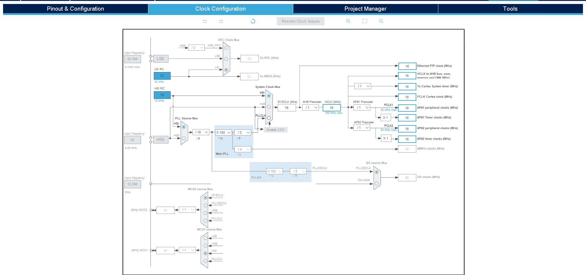

## 单片机内部框图

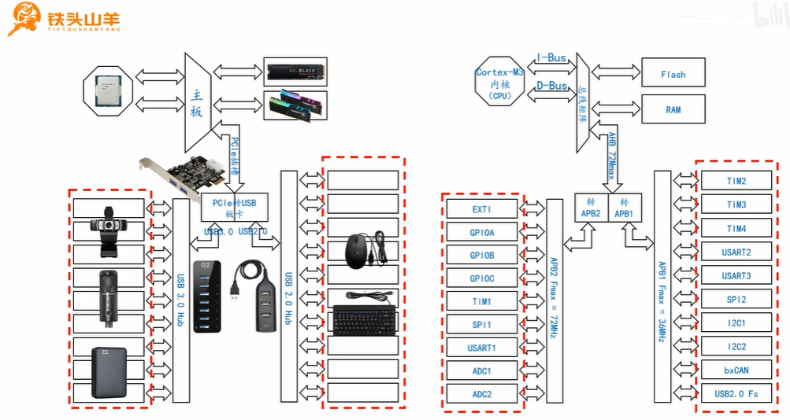

## 片上外设为什么要给时钟信号

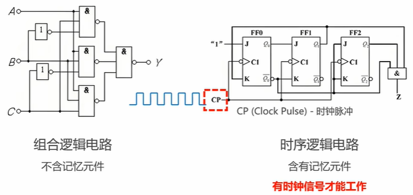

### 每个片上外设需要的频率还不同，如何分配？

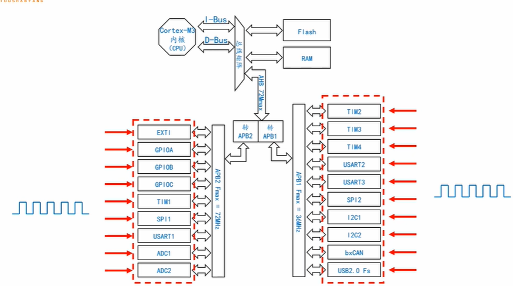

### 经过合理分频，倍频

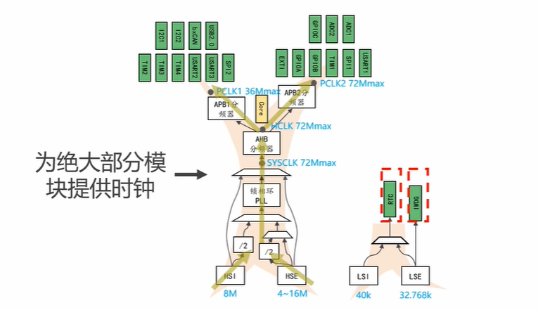

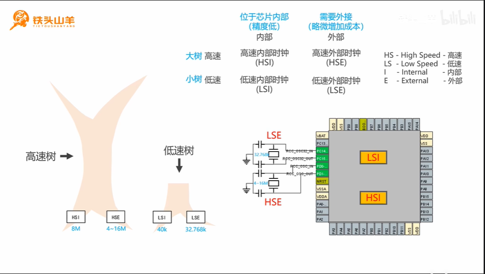

## STM32的时钟树

STM32 的时钟系统：

1. **系统主频（SYSCLK）** 主要由 **高速时钟**（HSI 或 HSE）经过 **PLL 倍频** 产生，提供时钟给 **CPU 和大部分片上外设**（如 AHB、APB 总线上的外设）。

   1. **STM32 的系统主频（SYSCLK）** 主要有三种来源：

      1. **内部高速时钟（HSI）** 直接作为系统时钟（如 HSI = 8MHz，直接用作 SYSCLK）。
      2. **外部高速时钟（HSE）** 直接作为系统时钟（如 HSE = 8MHz，直接用作 SYSCLK）。
      3. PLL 倍频后输出，其输入可以是：
         - HSI（先除 2，再倍频，如 4MHz × 9 = 36MHz）。
         - HSE（如 8MHz × 9 = 72MHz）。

      4. 其中，**大多数情况下，PLL 倍频后的时钟被选作系统主频**，以获得更高的运行速度。

   2. **比如STM32F103C8T6最小系统板，系统主频72M是由外部高速晶振倍频而来。**

2. 低速时钟（LSI、LSE）专门用于 少部分低功耗或定时相关外设，如：

   - **RTC（实时时钟）** 可使用 LSI 或 LSE，LSE（32.768kHz）精度更高。
   - **独立看门狗（IWDG）** 依赖 LSI（约 32kHz）。

3. **高速外设**（如 USB）可能需要 **专用时钟（如 48MHz PLL）**，不是直接由 SYSCLK 提供。

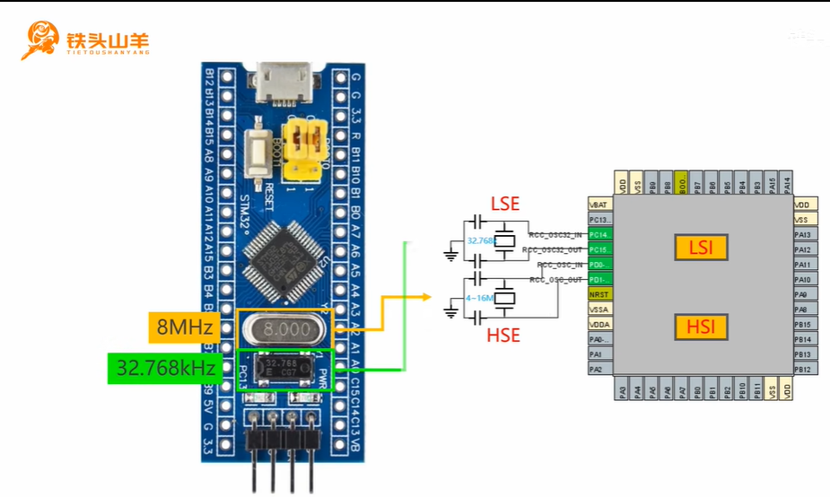

## 系统主频的来源

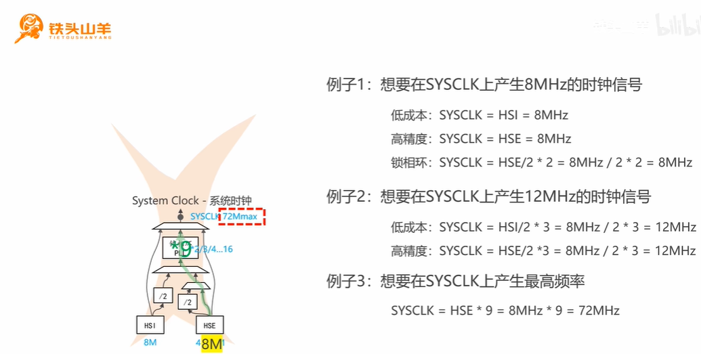

## 各总线的时钟来源

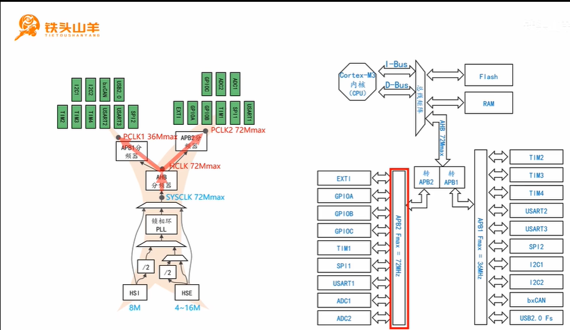

## cubemx的时钟树

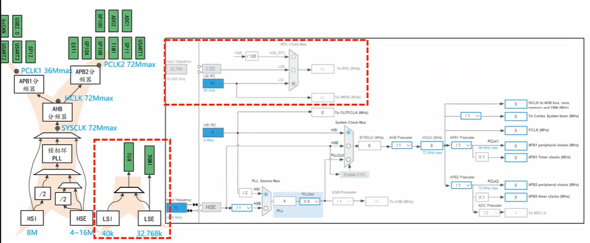

## CPU的执行速度

**系统时钟（SYSCLK）与 AHB 总线时钟**

- **SYSCLK** 是系统主频，它是通过 **HSI、HSE 或 PLL** 得到的时钟。
- CPU 和大部分外设（如 DMA、SRAM、Flash）连接到 **AHB 总线**，因此它们的时钟频率是由 **AHB 总线频率** 决定的，而不是直接由 **SYSCLK** 决定。

**AHB 总线与分频**

- **AHB 总线时钟（HCLK）** 通常通过 **AHB 分频器** 来调节。可以通过配置 **AHBCLKDivider** 来设置 **SYSCLK** 到 **HCLK** 的分频。
- 如果设置 **AHB 分频器 = 1**，那么 **HCLK = SYSCLK**。
- 如果设置 **AHB 分频器 = 2**，那么 **HCLK = SYSCLK / 2**。

**程序执行**

- CPU 执行指令时，实际上是在 **HCLK（AHB 总线频率）** 上运行的，而不是直接使用 **SYSCLK**。
- **SYSCLK** 经过 **AHB 分频器** 后成为 **HCLK**，然后 CPU 使用 **HCLK** 时钟频率执行指令。

**总结**

- **SYSCLK** 是系统时钟，通常作为时钟源供给 AHB 总线。
- 经过 **AHB 分频器** 后，**HCLK** 成为 AHB 总线的时钟频率，CPU 和大部分外设使用 **HCLK** 执行任务。
- **系统时钟** 的频率经过分频器分配到 **AHB 总线**，而不是直接挂载在 **系统主频** 上。

**示例：**

如果你设置了系统时钟为 **72MHz**，同时设置 **AHB 分频器为 1**，那么 **HCLK = 72MHz**，CPU 会以 72MHz 的频率执行程序。

如果你设置 **AHB 分频器为 2**，则 **HCLK = 36MHz**，CPU 会以 36MHz 的频率执行程序。

## cubemx配置时钟的优势

**CubeMX** 在时钟配置方面确实有得天独厚的优势，尤其是在图形化界面方面。它大大简化了时钟树的配置过程，并且可以帮助你避免手动修改繁琐的寄存器设置。

### **使用 CubeMX 的优势**

- **图形化配置**：你可以通过直观的界面来配置 **时钟源、PLL、分频器** 等，而不需要直接编辑复杂的代码。
- **自动生成初始化代码**：CubeMX 根据你选择的时钟配置自动生成 **系统时钟初始化代码**，你可以直接在生成的代码中使用，避免了手动修改错误的风险。
- **实时反馈**：图形界面提供实时的时钟树和时钟频率显示，让你清楚地看到时钟的各个配置项和输出的时钟频率。

### **使用标准外设库时的手动配置**

如果你使用 **标准外设库**（HAL 库是标准外设库的一个更新版），时钟配置通常需要你手动去修改与时钟相关的代码。具体来说，时钟配置一般涉及以下步骤：

1. **修改 `system_stm32f1xx.c`（或其他系列的对应文件）中的时钟配置**。这通常包括选择时钟源、设置 PLL 倍频器、配置分频器等。
2. **在 `main.c` 中配置 RCC（时钟控制寄存器）**，来设置具体的时钟源、PLL 配置、分频器等。
3. **检查时钟是否正确，手动修改时钟树**，调整不同的时钟源以确保系统时钟、AHB、APB 分频器的正确性。

这意味着，你必须手动编写或修改时钟初始化代码，确保时钟树的配置符合需求。时钟配置不仅要设置时钟源，还需要配置适当的 **PLL**、**AHB/APB 分频器**，并确保 **系统时钟**、**外设时钟** 和 **低功耗模式时钟** 的一致性。

## cubemx的默认时钟配置与标准外设库的时钟配置

### 标准外设库

在使用STM32F407ZGT6的标准外设库时，`system_stm32f4xx.c`文件中的系统时钟配置确实会设置各总线的最大上限频率。这个文件通常用于配置系统时钟源（如外部晶振、PLL、HSI等）以及时钟树，最终设定主系统时钟（`SYSCLK`）和其他总线时钟（如`AHB`, `APB1`, `APB2`等）。

一般来说，STM32F407ZGT6的标准外设库会默认按照芯片的最大性能来配置时钟。例如，系统时钟`SYSCLK`的最大频率为168 MHz，AHB总线最大可以达到168 MHz，APB1的最大频率为42 MHz，APB2的最大频率为84 MHz。

这些配置值可以在`system_stm32f4xx.c`文件中看到，主要的时钟配置函数是`SystemInit()`，它在系统启动时被调用，用于初始化时钟。

如果你没有修改过这些文件，那么这些时钟的设置应该是默认的最大频率配置。如果你需要调整时钟配置来优化功耗或性能，可以在`SystemInit()`中对时钟源或PLL设置进行修改，或者在CubeMX中配置并生成代码。

### cubemx

**以F407ZGT6为例。**

在 CubeMX 默认配置下，**HSI**（16 MHz）通常作为系统时钟的源，所有总线（包括 AHB、APB1 和 APB2）都直接由 HSI 驱动，并且分频系数设置为 **1**，这意味着所有的总线时钟都会与系统时钟保持一致，即 **16 MHz**。

### 关键点

- **HSI 16 MHz**：作为时钟源供给整个系统，除非你手动调整时钟配置。
- **分频系数为 1**：在这种配置下，所有总线的时钟频率都会等于 **HSI 的频率**，即 **16 MHz**。
- **最大频率限制**：时钟树中的每个节点都有频率限制，像 **AHB 总线**、**APB1** 和 **APB2** 都有各自的频率上限，通常通过 PLL 或外部晶振来倍频，超出最大限制后就不能再增加。

在默认配置下，CubeMX 确实简化了时钟设置，但如果需要更高的性能，通常需要通过配置 **PLL** 来获得更高的系统时钟频率（例如 **168 MHz**）。

如果你有更高的性能需求，可以尝试使用 **PLL 倍频器** 通过 **HSE 或 HSI** 提高系统主频，或者调整 **AHB/APB 分频器** 以匹配不同的外设需求。

### 配置为芯片的最高性能（F407ZGT6）

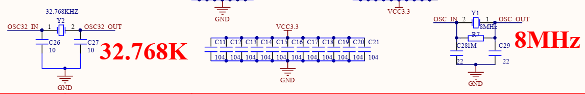

外接8MHZ的高速时钟，32.768KHZ的低速时钟。

#### 通过RCC配置时钟树**根**的一些参数

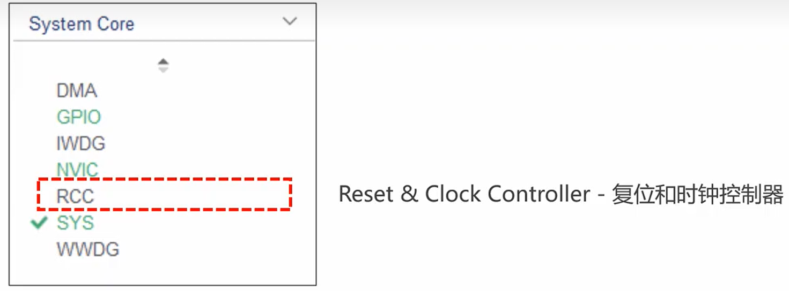

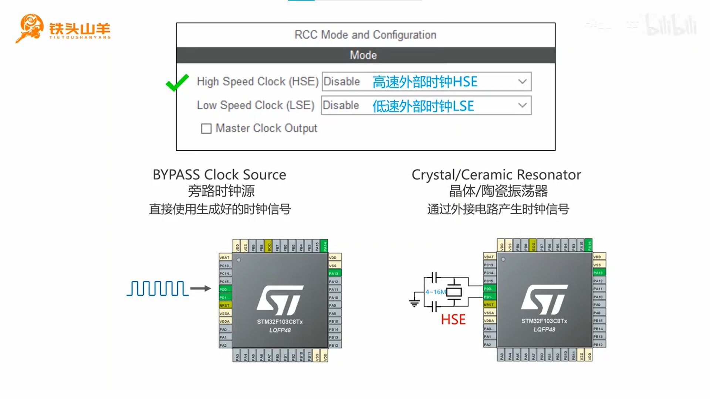

#### 外接高速晶振的引脚

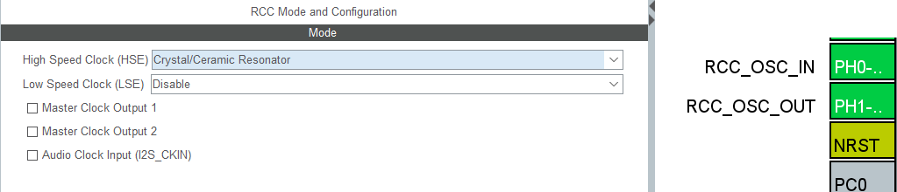

#### 开启之后去时钟配置界面

按照实际频率设置

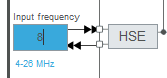

##### 选择HSE作为PLL的输入

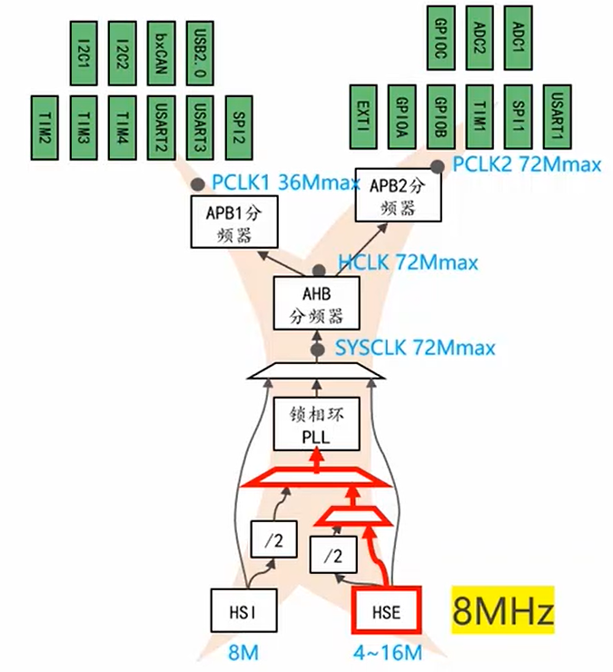

经过对ST的文档与标准库的验证，STM32F407中的时钟配置默认是这样的：

- **M = 8**（默认HSE频率8 MHz时，PLL输入频率1 MHz）
- **N = 336**（经过倍频后，PLL输出频率为336 MHz）
- **P = 2**（PLL输出分频，最终得到168 MHz的`SYSCLK`）

因此，正确的配置应该是：

- **M = 8**
- **N = 336**
- **P = 2**

这将确保你通过外部8 MHz晶振和PLL配置得到168 MHz的系统主频。

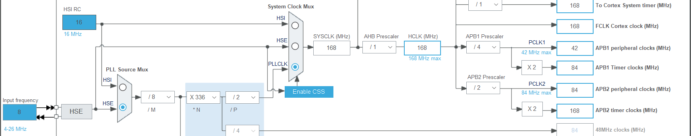

**连定时器的频率都可以知道!**