# P6_SPI

SPI（串行外设接口）适合高速、短距离的全双工通信，通常用于连接微控制器与外设设备，比如传感器、存储器（如闪存或EEPROM）、显示屏等。相比之下，SPI的设计更灵活，可以支持点对点通信（一个主机和一个从机），也可以支持一主多从的架构（一个主机连接多个从机），不过在多从机的情况下，需要额外的片选（CS）线来区分不同的从设备。

- **SCLK、MOSI、MISO和CS多根线，同步串行全双工**
- SCLK（时钟线）：提供同步时钟信号，**由主机生成**，确保数据传输的时序一致。
  - MOSI（主机**输出**从机**输入**）：主机发送数据到从机的线。
  - MISO（主机**输入**从机**输出**）：从机发送数据到主机的线。
    - **看四个字母区分**
  
- CS（片选线）：用于选择具体的从设备，每连接一个从机通常需要一根独立的CS线（在多从机场景下）。
  
- 特点：SPI是同步协议（依赖时钟信号），支持全双工通信（主机和从机可**同时发送和接收数据**），传输速度快，适合短距离高性能应用。

具体来说：

- 与UART相比：UART是异步协议，速度较慢，适合简单的点对点通信，而SPI是同步协议，速度更快，支持全双工（同时收发数据），更适合数据量较大的场景。
  - **TX和RX两根线，异步串行全双工**
- 与IIC相比：IIC用两根线（SCL和SDA）实现一主多从通信，地址由协议管理，而SPI通常需要额外的片选线来选择从设备，布线更复杂，但数据传输效率更高，适合对速度要求较高的应用。
  - **SCL和SDA两根线，同步串行半双工**

所以，SPI的“适合场景”可以概括为：高速、灵活的短距离通信，既可以是点对点，也可以是一主多从，具体取决于硬件设计和需求。

## 总线结构

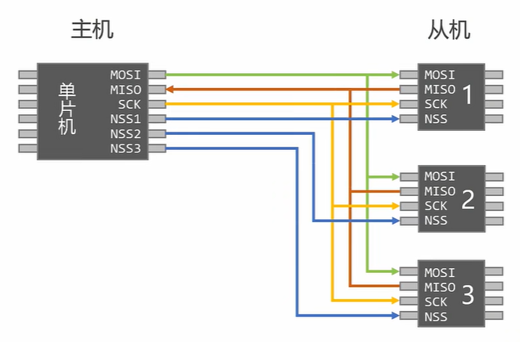

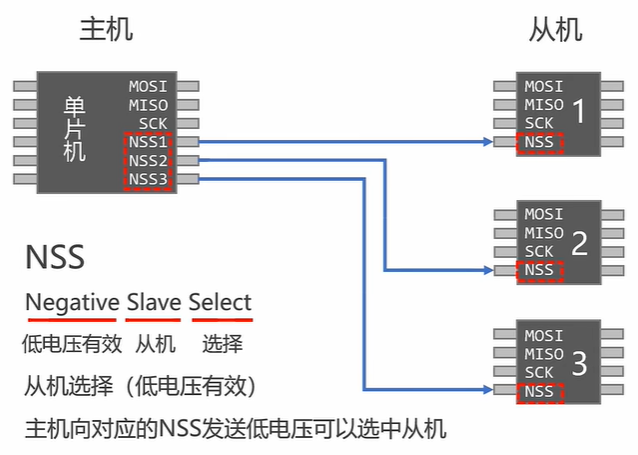

## 通信过程

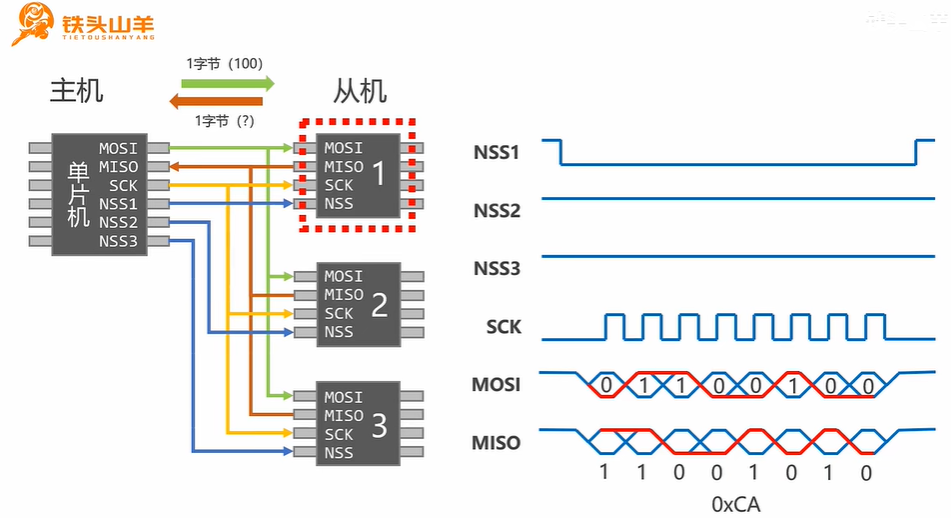

## 五个参数

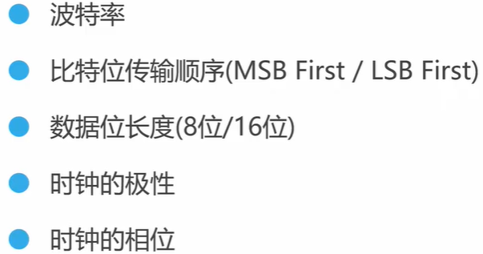

### 波特率的选择

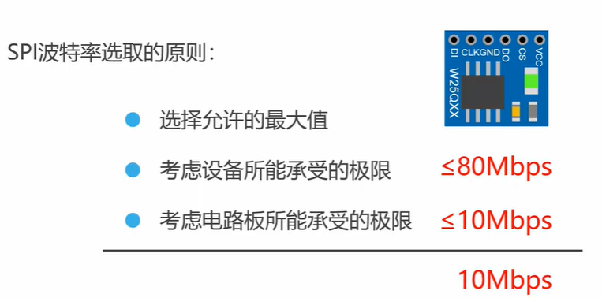

### 数据的传输顺序

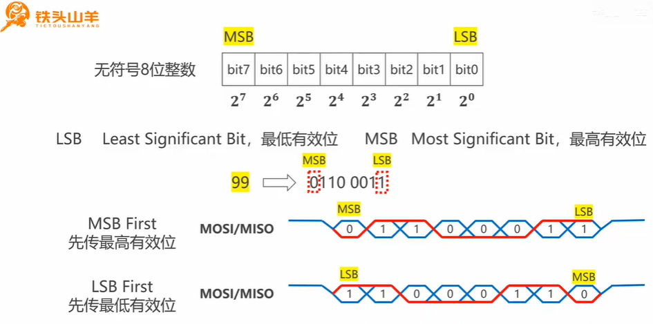

- UART：**固定先传低位**（LSB first），无配置选项。
- IIC：**通常先传高位**（MSB first），但协议本身不强制，依赖具体实现，灵活性有限。
- SPI：可配置，支持先传低位（LSB first）或先传高位（MSB first），灵活性最高。
- **软件模拟实现，随便你设置位序。**

所以，SPI确实是这三者中唯一可以自由选择数据传输顺序的协议，而UART和IIC的位序相对固定，尤其是UART完全不可调。

### 数据位长度

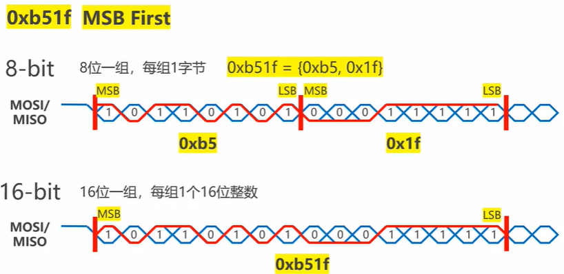

### 传输模式

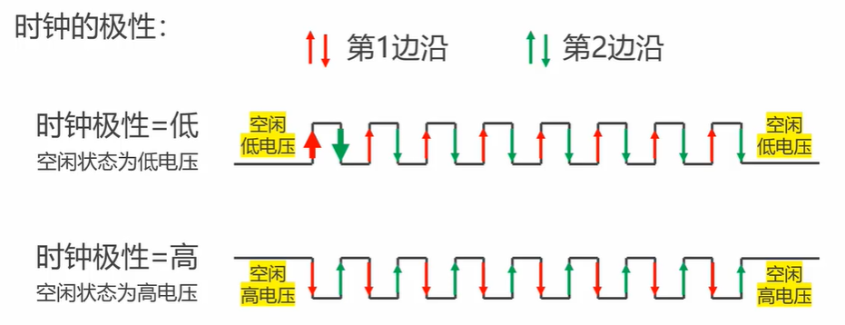

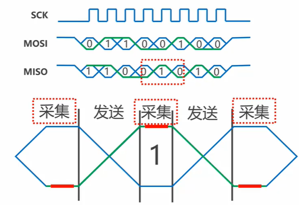

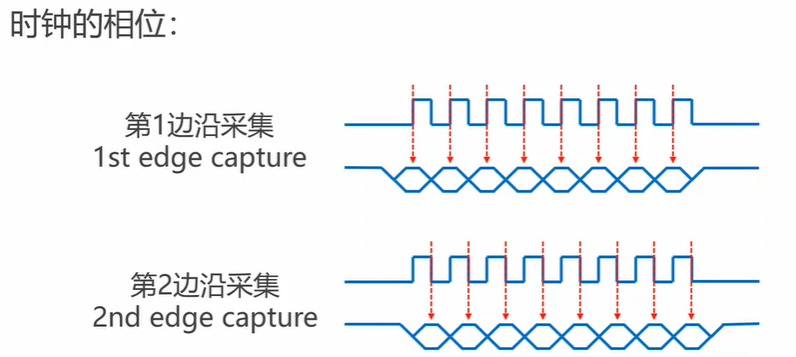

**是在第一个跳变沿采集还是第二个跳变沿采集，前者为0，后者为1**

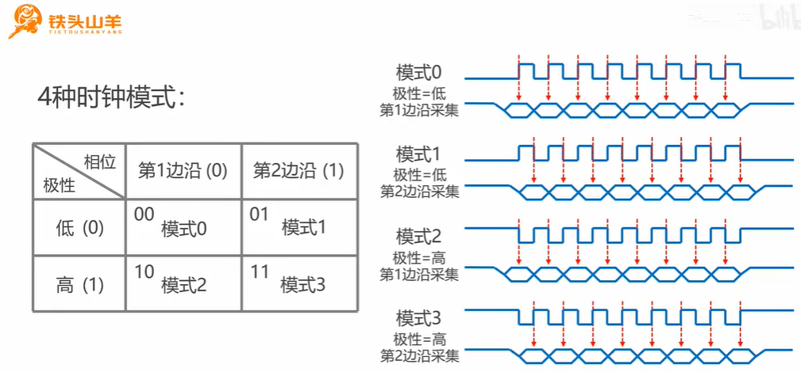

## 硬件SPI的配置

**第二种为三线制SPI的由来**

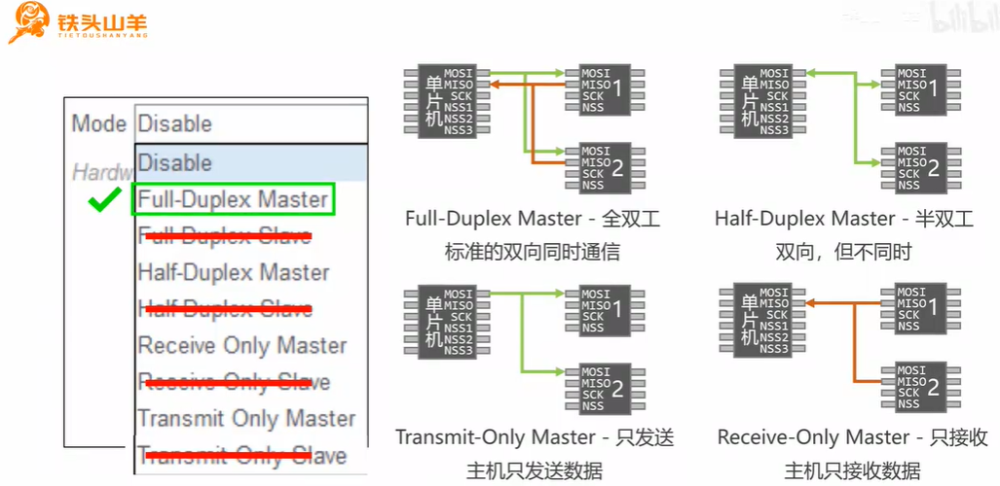

### 主机本身的NSS引脚

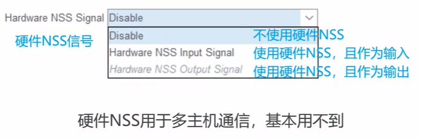

### 配置好后选一个引脚出来作为控制从机是否通信

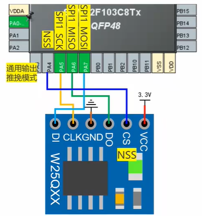

### 选择模式后具体参数

**在下方，看设备的通信要求配置**

波特率的值是当前总线上的频率除以分频系数得到的。

**高级参数不用管。**

- CRC校验和NSS类型

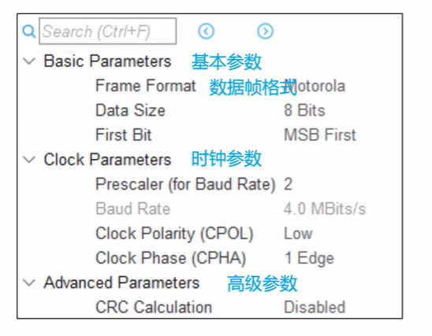

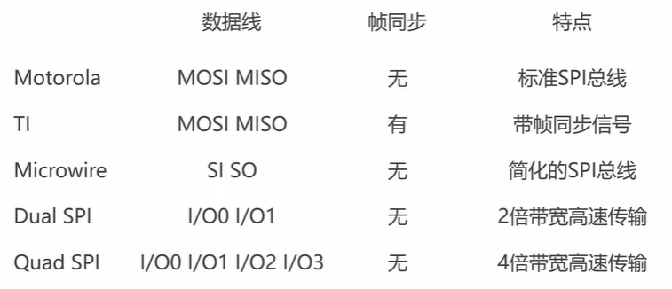

## 提供的编程接口

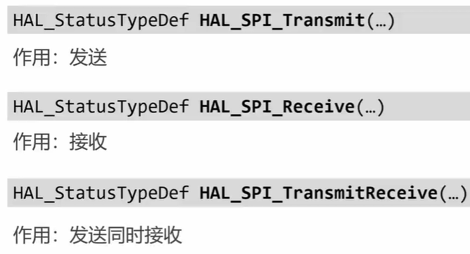

### 硬件SPI怎么选择从机

**从机片选线是用户自定义的，没有跟SPI一起配置的。所以发送数据前需要用户自己拉低对应从机的片选线。**

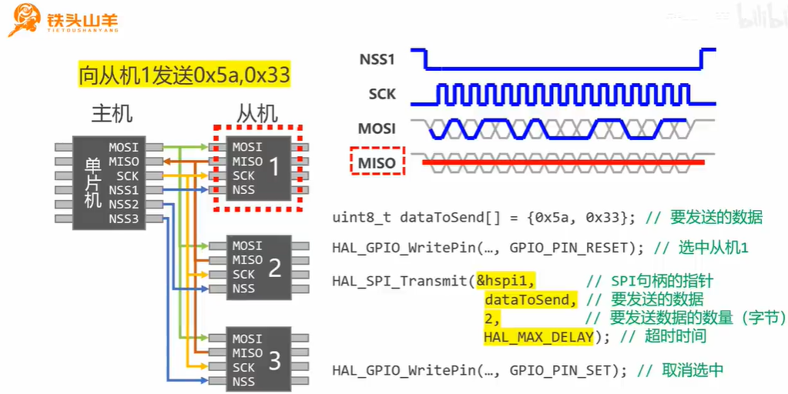

## 更加通用的代码

既然基于HAL库的SPI基础接口封装W25Q64专属函数更快、更方便，为什么还有开发者选择用软件模拟（位邦/bit-banging）SPI通信接口，再去封装W25Q64的功能？答案涉及到开发者的具体需求、硬件环境、性能考量和开发习惯等多个方面。

#### 基于HAL库SPI封装的优势（为什么“更快”）

你提到的“更快”主要体现在开发效率和运行性能上：

1. 开发效率高：
   - HAL库的SPI接口（如HAL_SPI_Transmit()）已经封装好了硬件初始化和数据收发逻辑，用户只需调用几个函数就能完成通信。
   - 不需要自己处理SPI的时钟信号、片选控制等底层细节，直接专注于W25Q64的指令实现。
2. 硬件加速：
   - HAL库利用STM32的SPI外设硬件，传输速度快（最高可达几十MHz，取决于时钟配置），远超软件模拟。
   - 支持DMA和中断模式，进一步减少CPU负担。
3. 可靠性高：
   - 硬件SPI经过厂商优化，时序精确，不易受软件延迟或中断干扰影响。

基于这些优势，大多数开发者确实倾向于用HAL库的SPI接口来封装W25Q64功能，因为这通常是最简单、高效的方案。

#### 为什么有人仍选择软件模拟SPI？

尽管HAL库有明显优势，但以下场景和原因会促使开发者选择软件模拟SPI，再封装W25Q64的功能：

1. 硬件资源限制

   - SPI外设不足：
     - STM32芯片的硬件SPI外设数量有限（比如STM32F103C8T6只有2个SPI）。如果项目中需要同时连接多个SPI设备（如W25Q64、LCD、传感器等），硬件SPI可能会被用尽。
     - 软件模拟可以用任意GPIO引脚实现SPI通信，不受硬件外设数量限制。

   - 引脚冲突：
     - 项目中可能因PCB布线或引脚复用需求，导致硬件SPI的默认引脚不可用。软件模拟可以灵活选择其他GPIO引脚。

2. 调试和学习目的

   - 理解底层原理：
     - 软件模拟SPI需要手动控制SCLK、MOSI、MISO和CS的电平变化，让开发者深入理解SPI协议的时序和机制。这对初学者或嵌入式教学非常有价值。
     - 用HAL库直接调用高层函数，虽然方便，但开发者可能对SPI的细节一知半解。

   - 调试灵活性：
     - 软件模拟可以随时调整时钟频率、位序甚至非标准时序，方便调试某些特殊设备（比如W25Q64的非典型配置）。

3. 可移植性需求

   - 跨平台兼容：
     - 软件模拟的SPI代码不依赖特定硬件外设，只需GPIO操作即可。这意味着相同的代码可以轻松移植到其他微控制器（比如没有硬件SPI的低端MCU，如某些8051或PIC）。
     - HAL库的SPI接口则是STM32专用的，换到其他平台需要重写底层驱动。

   - 避免厂商依赖：
     - 有些开发者不喜欢被HAL库绑定，希望写出更通用的代码，软件模拟提供了这种独立性。

4. 特殊时序或低速需求

   - 超低速通信：
     - 硬件SPI的最低时钟频率受限于系统时钟分频器（比如STM32的最低SPI速率可能是几百kHz）。如果W25Q64需要极低速通信（比如调试或与老设备兼容），软件模拟可以随意控制时钟周期。

   - 非标准时序：
     - W25Q64的标准SPI时序很明确，但某些场景（比如模拟测试或兼容其他协议）可能需要自定义时钟相位或数据采样点。软件模拟可以轻松调整这些细节，而硬件SPI只能通过CPOL/CPHA有限配置。

5. 性能不是瓶颈

   - 低频应用：
     - 如果W25Q64的读写频率不高（比如每秒几次配置数据），软件模拟的几十kHz速率完全够用，没必要用硬件SPI的高速。
     - CPU资源充足时，软件模拟的开销可以忽略。

   - 简单项目：
     - 对于小型项目或原型开发，软件模拟几行代码就能搞定，不需要配置复杂的HAL库和CubeMX。

6. 开发者的个人偏好

   - 裸机编程习惯：
     - 一些嵌入式老手更喜欢直接操作寄存器或GPIO，觉得HAL库封装太多“黑盒”，不够透明。软件模拟符合这种“掌控一切”的风格。

   - 避免HAL库开销：
     - HAL库的函数调用有一定 overhead（比如参数检查、状态管理），在极小型项目中可能显得臃肿。软件模拟的代码更精简直接。

## 软件模拟示例与硬件示例

### 如果想找软件模拟通信协议（如SPI、I2C等）

软件模拟通信协议通常是通过GPIO手动控制实现的，常见于资源受限或需要特殊时序的场景。以下是寻找资源的地方：

1. 标准外设库（SPL）示例：
   - 位置：ST官网下载STM32标准外设库（针对F0、F1、F2、F4等系列），在Libraries或Projects目录下的示例代码中查找。
   - 特点：SPL年代的代码常包含软件模拟SPI、I2C等，比如SPI/SPI_FLASH目录中的软件SPI示例。
   - 适用场景：老项目维护，或想参考低层次实现。
   - 获取方式：搜索“STM32F1 Standard Peripheral Library”（根据芯片调整型号），下载后解压。
2. 社区资源和开源项目：
   - 位置：
     - GitHub：搜索“software SPI STM32”、“bit-bang SPI”等关键字。
     - STM32社区论坛（[community.st.com](https://community.st.com)）。
     - 嵌入式博客（如CSDN、知乎、EEVblog）。
   - 特点：常有开发者分享基于HAL库或裸机（无库）的软件模拟代码。
   - 适用场景：适用于HAL库用户或跨平台参考。
3. ST应用笔记和技术文档：
   - 位置：ST官网“Technical Literature”部分，搜索“Application Note”或“AN”文档（如AN4760）。
   - 特点：有时会提到软件模拟外设的实现方法，尤其是早期文档。
   - 适用场景：需要官方参考但不想用SPL时。
4. 自己实现：
   - 方法：基于GPIO操作（SPL用GPIO_SetBits，HAL用HAL_GPIO_WritePin），按照协议时序手动编写。
   - 特点：灵活，可定制，但需要理解协议（如SPI的CPOL/CPHA）。
   - 适用场景：找不到现成代码，或有特殊需求。

推荐优先级：社区资源（最新、最灵活） > SPL示例（官方但较老） > 自己实现（最灵活但费时）。

### 如果想找硬件示例（如SPI、I2C等）

硬件示例依赖芯片的外设模块（如SPI1、I2C2），效率高且是现代开发的主流。以下是寻找资源的地方：

1. STM32Cube固件包示例：
   - 位置：ST官网下载STM32Cube固件包（如STM32CubeF4），在Projects/STM32xx_EVAL/Examples目录下找（如SPI_FullDuplex_ComIT）。
   - 特点：基于HAL库，涵盖中断、DMA、轮询等多种模式。
   - 适用场景：新项目开发，推荐使用。
   - 获取方式：搜索“STM32CubeF4”（根据芯片调整型号），下载后解压。
2. STM32CubeMX生成代码：
   - 位置：安装STM32CubeMX，配置外设后生成代码，生成的main.c中会有硬件外设初始化和调用示例。
   - 特点：自动生成，直接可用，适合快速上手。
   - 适用场景：初学者或需要快速原型。
3. ST官方文档：
   - 位置：ST官网的HAL用户手册（如UM1850 for F4系列），或参考手册（Reference Manual）。
   - 特点：提供HAL函数的用法说明和伪代码。
   - 适用场景：需要深入理解硬件外设API时。
4. GitHub上的STM32Cube仓库：
   - 位置：访问ST官方GitHub（如[STM32CubeF4](https://github.com/STMicroelectronics/STM32CubeF4)），查看Examples目录。
   - 特点：与固件包内容一致，更新频繁。
   - 适用场景：不想下载完整固件包时。

推荐优先级：STM32Cube固件包（最全面） > CubeMX（最方便） > 官方文档（最权威）。