# P7_中断

## 概念

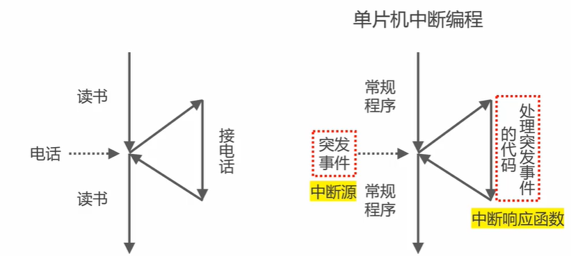

## 轮询的弊端

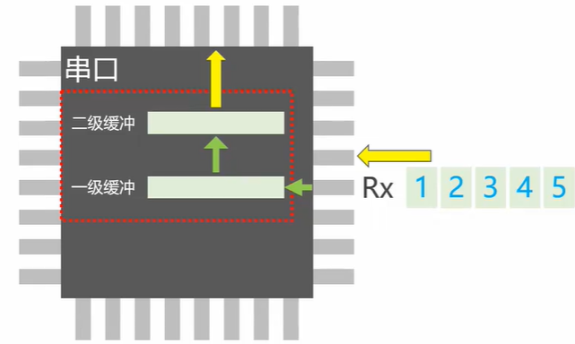

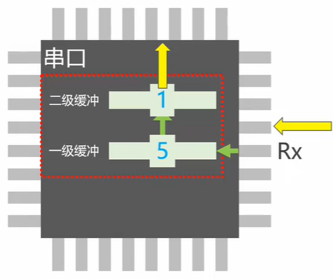

**如果来了数据，不及时取走，那么就会被覆盖从而导致数据丢失。**

### 闪灯实验

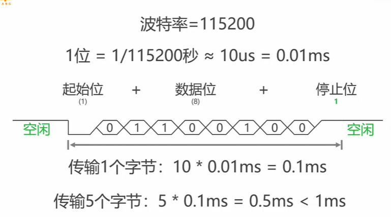

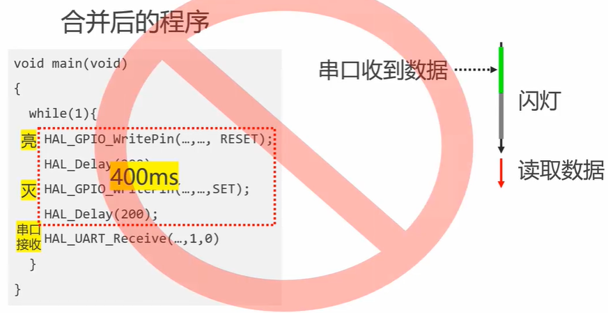

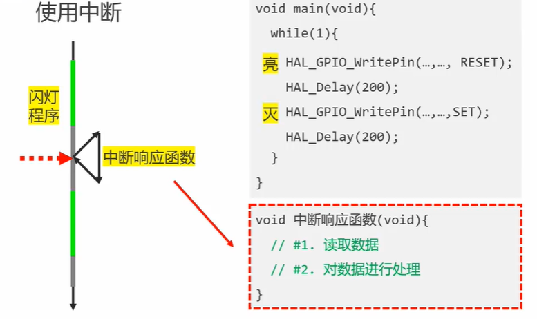

## 中断优先级

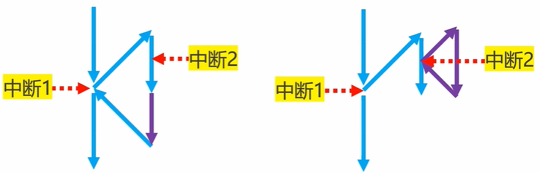

**所以当抢占优先级高的中断触发时，在中断服务函数中，也会去处理优先级高的中断。**

### 中断优先级分组

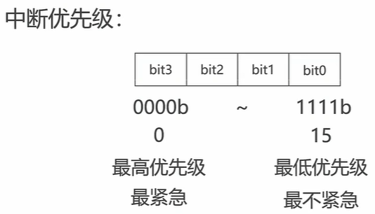

#### 优先级位数

STM32F103 所使用的 Cortex-M3 内核中断控制器（NVIC）实际上只有 4 位有效的优先级位。这意味着虽然优先级寄存器通常设计为 8 位宽，但只有高 4 位被用来决定中断的实际优先级，也就是只有 16 个不同的优先级等级可用。

需要注意的是：

- **内核决定优先级位数**：不同的 ARM 内核可能会实现不同数量的有效优先级位。例如，Cortex-M0 通常只实现 2 位有效优先级，而 Cortex-M4 在大多数实现中仍然是 4 位。
- **厂商实现**：虽然核心架构提供了基础，但具体芯片（比如 STM32 系列）可能会对优先级的预占和子优先级进行配置，但总的有效位数还是由所采用的内核决定。

因此，对于 STM32F103 来说，是固定使用 4 位有效优先级，而其他芯片是否有差异，主要取决于它们采用的 ARM 内核和厂商配置。

STM32F407ZGT6 采用的是 Cortex-M4 内核，其 NVIC 中断控制器同样只实现了 4 位有效优先级。这意味着虽然每个中断优先级寄存器都是 8 位宽，但只有最高的 4 位会被用来判断中断优先级，从而提供最多 16 个优先级级别。

可以通过 NVIC 的优先级分组机制将这 4 位有效优先级位划分为抢占优先级和响应（子）优先级。例如，可以将 4 位分为 2 位抢占优先级和 2 位响应优先级，这样就有 4 个抢占优先级等级和 4 个响应优先级等级。

具体来说，STM32 系列芯片允许你通过配置 AIRCR 寄存器中的优先级分组（Priority Grouping）来决定这 4 位中多少位用作抢占优先级，多少位用作响应优先级。常见的分组配置有：

- 全部 4 位作为抢占优先级（响应优先级为 0）：16 个抢占级别；
- 3 位抢占优先级，1 位响应优先级：8 个抢占级别和 2 个响应级别；
- 2 位抢占优先级，2 位响应优先级：4 个抢占级别和 4 个响应级别；
- 1 位抢占优先级，3 位响应优先级：2 个抢占级别和 8 个响应级别。

这样一来，你就可以根据实际应用的需要来调整不同中断之间抢占和响应的关系。需要注意的是，**抢占优先级决定了哪个中断可以中断另一个中断，而响应优先级仅用于当多个中断具有相同抢占优先级时决定响应顺序。**

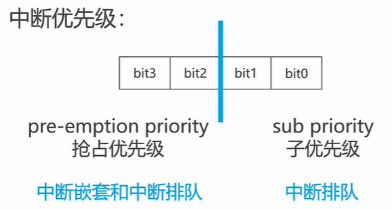

#### 中断排队

同一时间触发多个中断或者在中断执行时，又触发了一个中断但是**级别不够，只能排队**。

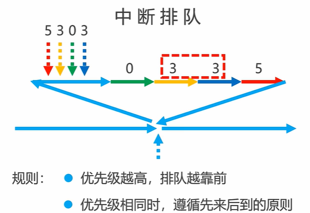

#### 中断嵌套

**同时触发或者中断执行中触发其他中断，但是级别足够高，可以直接打断中断，级别高的走了，再回到级别低的中断执行。**

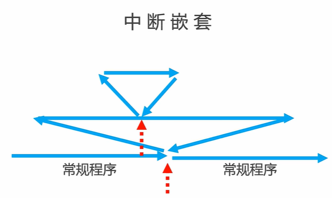

## CUBEMX中断配置

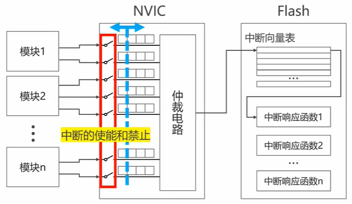

**片上外设的中断以及NVIC的通道使能是双向的，使用时需要对应使能才能使用。**

**库函数和寄存器是这样配置的。**

### NVIC的配置

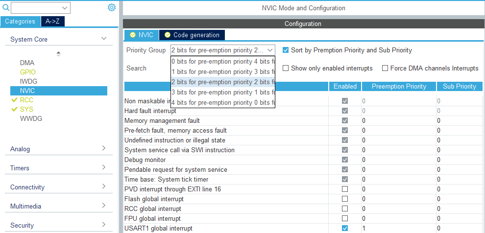

这个NVIC的配置，主要是中断优先级分组。

各个中断应该在各模块的配置中开启，开启之后。可以在这里看到并可以设置中断的抢占和响应优先级。
