# P8_定时器

## 定时器的类别

定时器类型及其功能

**基本定时器（Basic Timer）**

- 功能：
  - **时基单元**：提供基本的计时功能，通过时钟信号进行递增或递减计数。
  - **定时中断**：当计时达到预设值时，可以触发中断，用于实现定时任务。
- **用途**：适用于简单的延时或定时触发事件，例如软件延时或周期性任务。
- **特点**：结构简单，仅包含时基单元，没有额外的高级功能，如输出比较或输入捕获。

**通用定时器（General-Purpose Timer）**

- 功能：
  - **时基单元**：与基本定时器相同，提供基本的计时能力。
  - **输出比较（Output Compare）**：可以生成PWM（脉宽调制）波形，用于控制电机转速、LED亮度等。
  - **输入捕获（Input Capture）**：能够捕获外部信号的上升沿或下降沿，用于测量脉冲宽度、信号频率等。
  - **定时中断**：与基本定时器类似，支持中断触发。
- **用途**：适用于需要PWM输出或外部信号测量的场景，例如电机控制或传感器信号处理。
- **特点**：相比基本定时器，功能更丰富，通常支持多个通道，可实现多路PWM输出或输入捕获。

**高级定时器（Advanced Timer）**

- 功能：
  - **时基单元**：与通用定时器相同，提供计时基础。
  - **输出比较（Output Compare）**：支持更复杂的PWM生成，例如互补PWM波形，并带有死区控制。
  - **输入捕获（Input Capture）**：与通用定时器一致，支持信号捕获。
  - **刹车功能（Break Function）**：能在特定条件下紧急停止输出，常用于电机控制中的安全保护。
  - **死区插入（Dead Time Insertion）**：在PWM输出中插入死区时间，防止桥式电路中上下桥臂同时导通。
  - **互补输出（Complementary Outputs）**：生成互补的PWM信号，适用于驱动电机等场景。
- **用途**：专为复杂应用设计，例如高级电机控制（如无刷直流电机）或功率电子系统。
- **特点**：功能最强大，通道数量更多，支持高级控制特性。

### 定时器之间的关系

**功能上的包含关系**

- **基本定时器**：功能最基础，仅包含时基单元。
- **通用定时器**：在基本定时器的基础上，增加了输出比较和输入捕获功能。
- **高级定时器**：在通用定时器的基础上，进一步增加了刹车功能、死区插入和互补输出等高级特性。

从功能上看，定时器之间存在逐步增强的关系，可以用以下方式表达：

- **基本定时器 ⊆ 通用定时器 ⊆ 高级定时器**
   （这里的“⊆”表示功能上的包含，即高级定时器包含通用定时器的所有功能，通用定时器包含基本定时器的所有功能。）

**注意事项**

- 这种“包含关系”是针对功能的描述，而不是说硬件设计完全相同。不同类型的定时器在硬件实现上会有差异，以适应其特定的应用需求。

## 整体框图

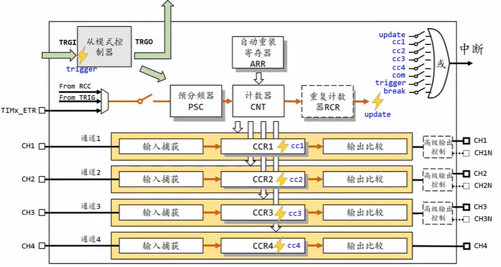

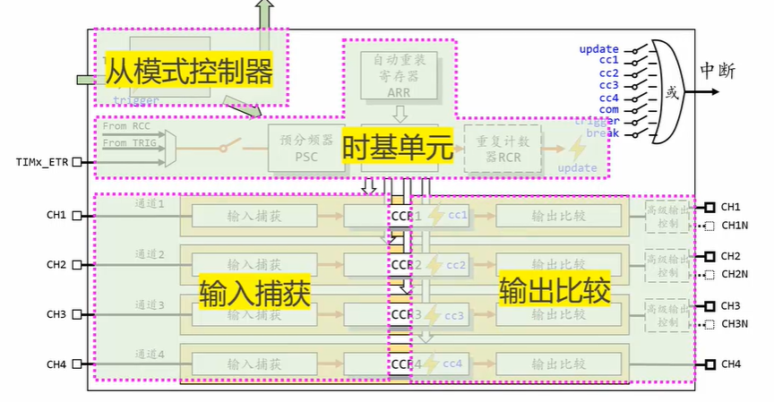

## 时基单元（基本定时器）

### 定时器和时钟树的关系

在单片机中，**时钟树**是一个负责生成和分配时钟信号的系统。它通过时钟源（如外部晶振或内部RC振荡器）产生基础时钟信号，并通过时钟分配网络将这些信号分发给单片机中的各个模块，包括CPU、外设等。而**定时器**是单片机中的一种外设模块，主要用于实现延时、定时中断等功能。

定时器的工作需要一个稳定的时钟信号作为基础，而这个时钟信号正是由时钟树提供的。简单来说，时钟树为定时器提供“心跳”，定时器根据这个“心跳”的频率，按照设定的分频比和计数值进行计时操作。因此，**定时器依赖于时钟树提供的时钟频率来工作**。

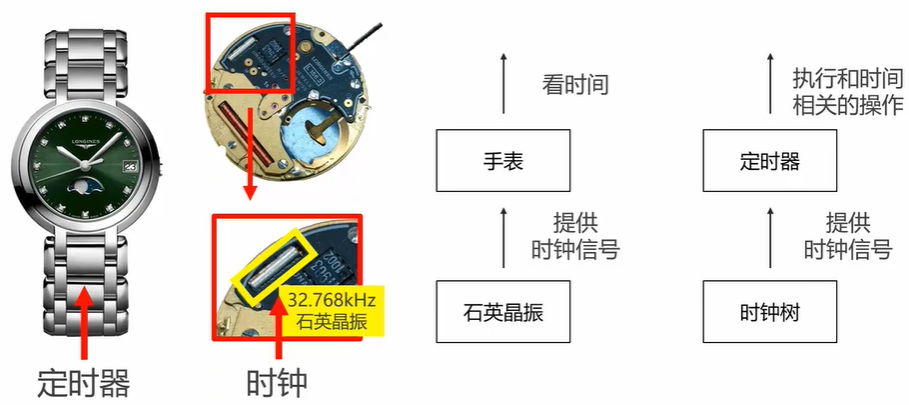

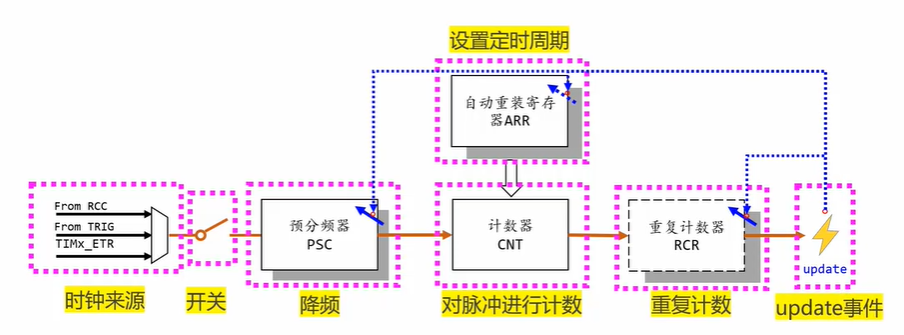

### 谁来提供时钟信号

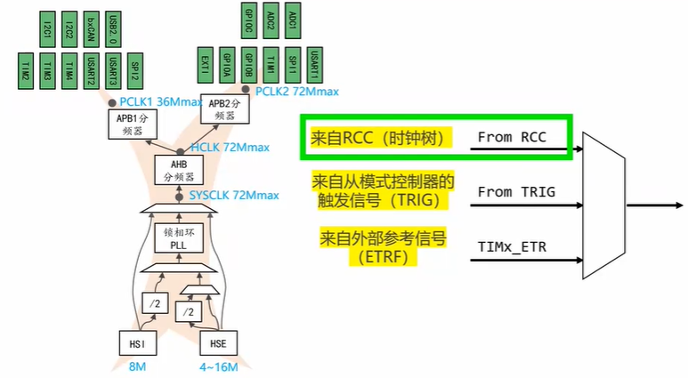

### 与各自总线上的时钟频率的关系

**如果各自总线的分频系数大于1，对应定时器的时钟频率就要乘以2。**

**否则该是多少就是多少。**

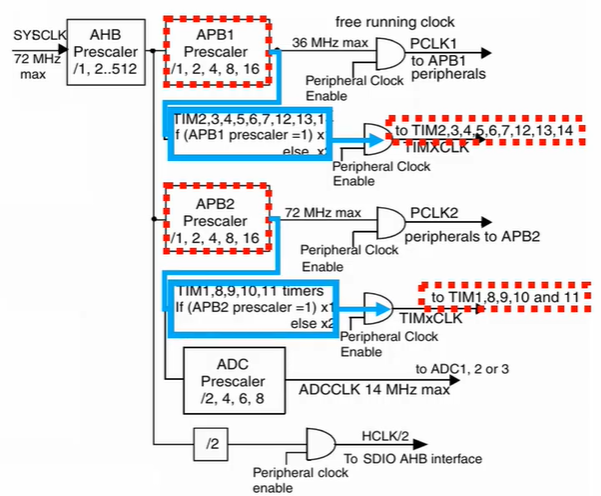

### PSC

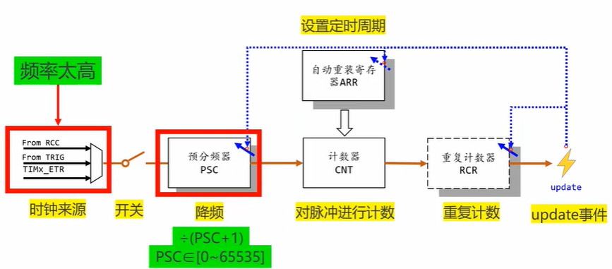

### 计数器

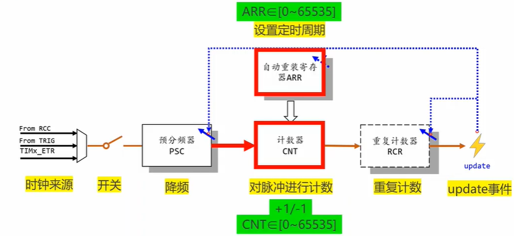

### 计数的模式

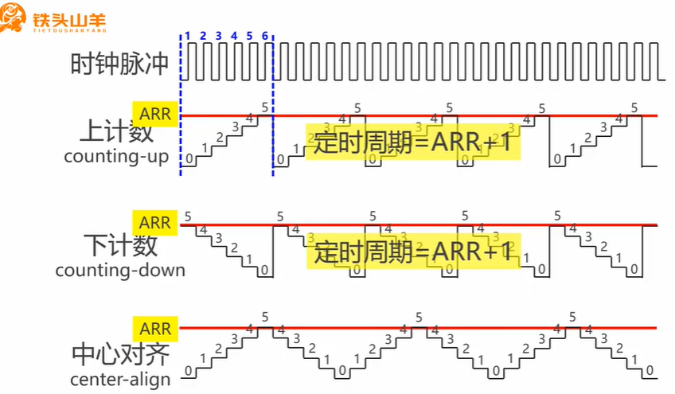

### 溢出次数

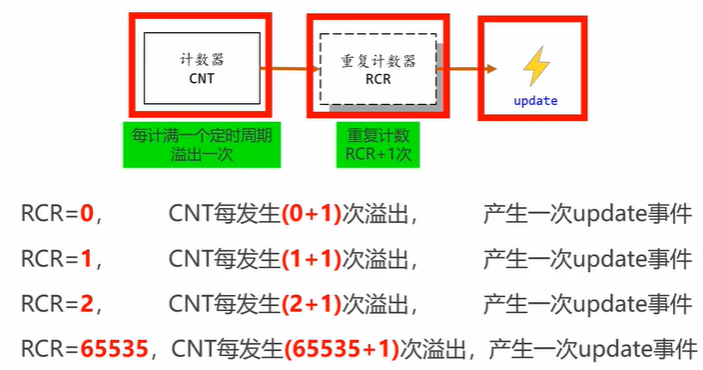

### 以手表为例的定时响铃

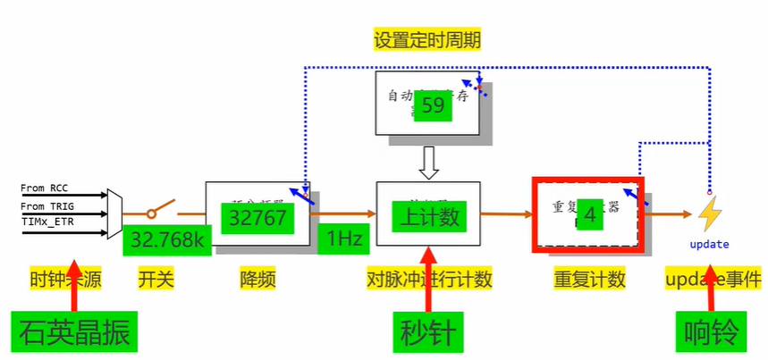

### 补充

- RCR只有高级定时器才有。

#### 寄存器预加载机制（保护一个完整的周期防止跑飞）

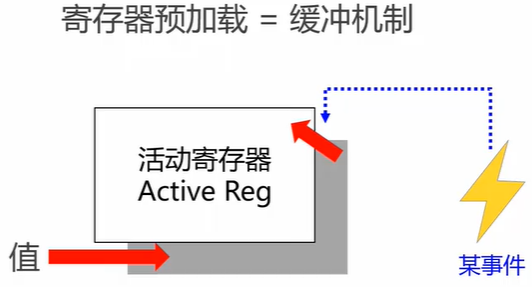

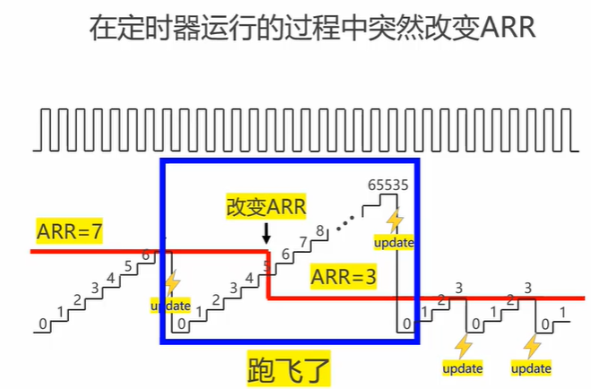

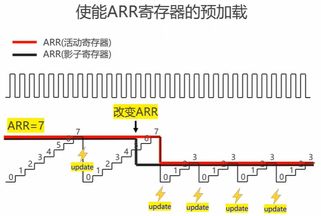

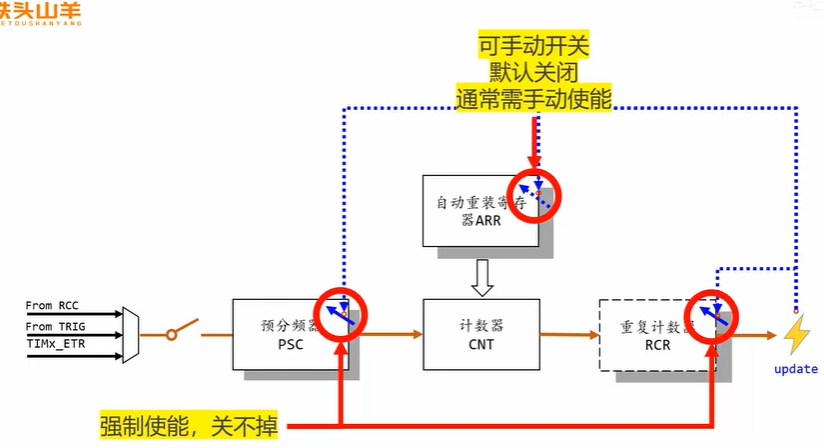

## HAL库的毫秒级延迟函数与freeRTos

### HAL库的HAL_Delay()与FreeRTOS的关系

- **工作原理**：HAL_Delay()是STM32 HAL库提供的一个延时函数，它依赖于ARM Cortex-M内核中的SysTick定时器。SysTick通常被配置为以1ms的周期产生中断，而HAL_Delay()通过轮询SysTick的计数值来实现指定的延迟时间。
- **对SysTick的影响**：HAL_Delay()本身并不会修改SysTick的配置（比如重载值或预分频器），它只是被动地利用SysTick的计数值进行计时。因此，**HAL_Delay()不会直接影响FreeRTOS的时基（tick timer）**。
- **在FreeRTOS中的表现**：在FreeRTOS环境下，HAL_Delay()依然可以正常工作，因为它不改变SysTick的频率或中断行为。换句话说，**它对FreeRTOS的扩展没有直接的不利影响**。

**注意事项**

尽管HAL_Delay()不会影响FreeRTOS的时基，但它有以下特性需要注意：

- **阻塞性**：HAL_Delay()是阻塞式的，调用它时CPU会被占用，无法执行其他任务。这在多任务系统中可能会降低效率，但这属于性能问题，而不是直接影响FreeRTOS的扩展能力。
- **建议**：在FreeRTOS中，推荐使用vTaskDelay()代替HAL_Delay()，因为vTaskDelay()是非阻塞的，会让出CPU资源给其他任务，提高系统效率。

### 擅自改动系统滴答频率对FreeRTOS的影响

- **FreeRTOS的时基**：FreeRTOS默认使用SysTick作为其时基（tick timer），用于任务调度和延时功能的计时。默认配置下，SysTick的tick周期是1ms（由configTICK_RATE_HZ定义）。
- 改动的影响：如果你在FreeRTOS运行时擅自修改SysTick的频率（例如，通过改变其重载值或预分频器），会直接影响FreeRTOS的时基，导致以下问题：
  - **任务调度异常**：tick周期变化会破坏任务切换的时序，可能导致任务延时不准确或调度混乱。
  - **系统不稳定**：FreeRTOS依赖固定的tick周期来管理时间，频率改变会使整个系统行为不可预测。
- **结论**：**擅自改动SysTick频率确实会影响FreeRTOS的正常运行**，因此在扩展FreeRTOS时需要谨慎处理。


## 输出比较

### 如果不通过定时器修改占空比，默认时钟脉冲的高低电平持续时间是否平分，各占二分之一？

是的，在 STM32 中，如果不通过定时器去主动修改 PWM 的占空比，PWM 输出的占空比通常会保持默认值。在大多数情况下，这个默认值是 **50%**。这意味着在一个 PWM 周期内，高电平的持续时间和低电平的持续时间相等，各占总周期的 **二分之一**。例如，如果一个周期是 10 微秒，那么高电平和低电平各持续 5 微秒。

### 使用定时器时，能否在不改变频率（即不改变总周期）的前提下改变高电平的持续时间？

是的，使用定时器可以做到这一点。在 STM32 中，PWM 是通过定时器生成的。PWM 信号的频率由定时器的计数周期（总周期）决定，而占空比则由定时器的比较寄存器（CCR，Capture/Compare Register）的值来控制。通过调整 CCR 的值，可以改变高电平的持续时间，而总周期（由定时器的自动重装载值 ARR 和时钟频率决定）保持不变。

例如：

- **假设总周期是 10 微秒（频率固定）。**
- 如果 CCR 设置为 2.5 微秒，高电平持续时间是 2.5 微秒，占空比为 25%。
- 如果 CCR 设置为 7.5 微秒，高电平持续时间变为 7.5 微秒，占空比为 75%。
- **总周期始终保持 10 微秒不变。**

因此，通过定时器，你可以在不改变 PWM 频率的前提下，灵活地调整高电平持续时间，从而改变占空比。

### 如果将占空比修改为 100%，总周期是否还是没变？

是的，即使将占空比修改为 100%，总周期仍然不会改变。当占空比设置为 100% 时，高电平的持续时间等于整个总周期，低电平的持续时间变为零。这种情况下，PWM 输出会持续保持高电平，但它的周期（从一个上升沿到下一个上升沿的时间）仍然是由定时器的设置决定的，不会发生变化。

例如：

- 假设总周期是 10 微秒。
- 占空比设为 100%，高电平持续 10 微秒，低电平持续 0 微秒。
- **输出看起来像是常高电平，但周期依然是 10 微秒（如果观察连续的 PWM 波形，仍以 10 微秒为一个循环）。**

### 利用基本时基与输出比较

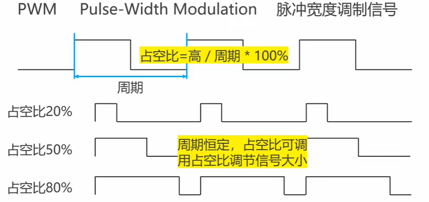

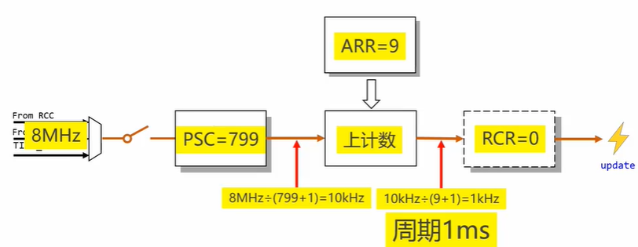

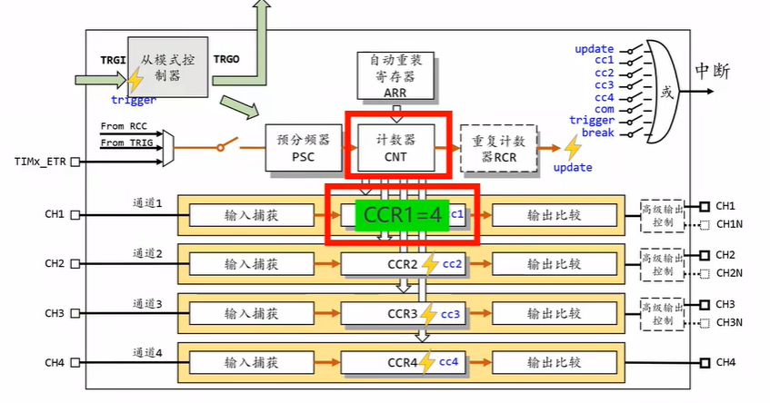

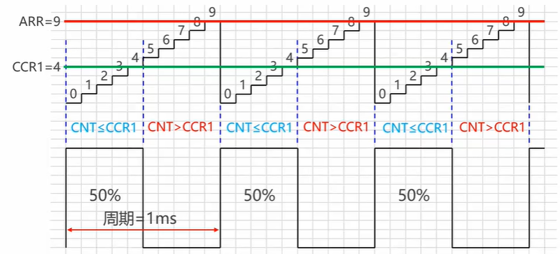

### PWM基本原理

PWM（Pulse Width Modulation，脉宽调制）是一种通过控制高电平持续时间来模拟模拟信号的技术。在 STM32 中，PWM 是由定时器硬件生成的，具体利用了定时器的**时基单元**（Time-base Unit）和**比较输出单元**（Compare Output Unit）来实现。

#### 1. 时基单元的作用

- **计数器（Counter）**：时基单元的核心是一个计数器，它会根据预设的时钟频率不断递增（或递减）。

- **自动重装载寄存器（ARR）**：计数器的值从 0 增加到一个预设的上限值（存储在 ARR 中），然后重置为 0，如此循环。

- **PWM 周期**：这个循环的时长决定了 PWM 信号的周期（即频率），计算公式为：

- ```
  PWM 周期 = (ARR + 1) × 时钟周期
  ```

#### 2.比较输出单元的作用

- **捕获/比较寄存器（CCR）**：定时器中还有一个寄存器（CCR），用于存储一个比较值。
- **比较事件**：当计数器的值与 CCR 的值相等时，定时器会触发一个比较事件。
- **电平切换**：在 PWM 模式下，这个比较事件会改变输出信号的电平状态。

#### 3. PWM 输出的逻辑

PWM 信号的电平变化是由计数器值与 CCR 值的比较结果决定的**比如**：

- 当计数器的值 **小于** CCR 值时，PWM 输出为高电平。
- 当计数器的值 **大于或等于** CCR 值时，PWM 输出为低电平。
- 随着计数器值的不断变化，PWM 输出的电平会在特定时机自动切换。

#### 4. 占空比的控制

- **占空比（Duty Cycle）**：占空比是指高电平持续时间与整个周期的比值。
- 调整 CCR 值：通过改变 CCR 的值，可以控制高电平的持续时间：
  - CCR 值越小，高电平时间越短，占空比越小。
  - CCR 值越大，高电平时间越长，占空比越大。

#### 总结

**ARR是一个周期内需要计数的总个数。 而CRR是利用计数器中的值在特定时机输出高低电平其余时间输出低电平。所以其实一个周期的时间时钟是没有变的，而一个周期内的高低电平持续时间就被改变了，总而改变了每一个周期内的占空比，实现了PWM波形的稳定输出。而PWM的周期就是计数器重新计数一次的时间。所以PWM周期 = (ARR+1) X 时钟周期。**

### 补充

**比较后的触发事件**

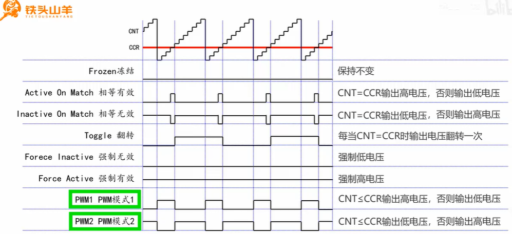

**互补输出（仅限高级定时器）**

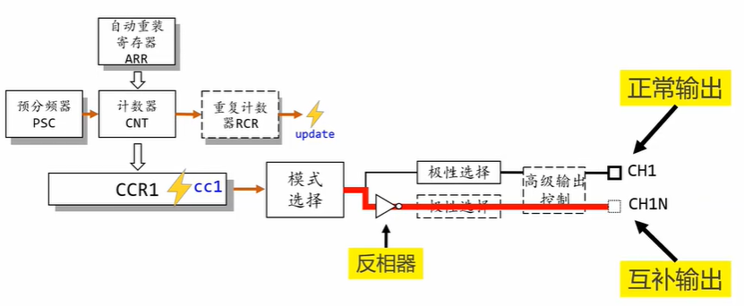

#### 在驱动H桥的mos管时，互补输出的作用？

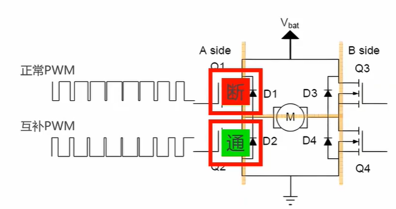

在驱动 H 桥的 MOS 管时，互补输出的作用是为了实现高效、安全且精确的控制，通常与 PWM（脉宽调制）结合使用。H 桥是一种常见的电路拓扑结构，用于驱动直流电机、变压器或其他负载，能够实现正反转或电压调节。下面我详细解释互补输出的作用及其在 H 桥中的意义。

#### 什么是互补输出？

在 H 桥中，互补输出指的是控制信号以相反的逻辑电平驱动**一对 MOS 管**。例如：

- 当一个 MOS 管（如上桥臂的 P 型 MOS 或 N 型 MOS）导通时，另一侧对应的 MOS 管（如下桥臂的 N 型 MOS）关断。
- 反之，当一个关断时，另一个导通。 这种控制方式通常由定时器的 PWM 通道提供，例如 STM32 定时器的互补 PWM 输出功能（Complementary PWM Output）。

#### H 桥的基本结构

- 假设一个典型的 H 桥电路有四个 MOS 管，分别为：

  - Q1（左上桥臂）、Q3（左下桥臂）。
  - Q2（右上桥臂）、Q4（右下桥臂）。

  通过控制这四个 MOS 管的导通和关断，可以驱动负载（如电机）实现正转、反转或停止。为了简化讨论，我们假设使用 PWM 信号控制 H 桥。

#### 四路 PWM 输出与互补输出的关系

在实际应用中，H 桥通常不需要四路独立的 PWM 信号，而是可以通过两路 PWM 信号（每一对桥臂各一路）实现控制。如果使用互补输出，控制会更简单高效。

**没有互补输出的情况**

- **如果不使用互补输出，你需要为每个 MOS 管单独生成 PWM 信号（即四路 PWM 输出：Q1、Q2、Q3、Q4 各一路）。**
- 例如，要让电机正转（电流从左到右流经电机）：
  - Q1（左上）和 Q4（右下）导通，Q2（右上）和 Q3（左下）关断。
  - 你需要手动确保 Q1 和 Q3 不同时导通，Q2 和 Q4 不同时导通，否则会发生桥臂直通。
- **问题**：如果只导通一路（例如只打开 Q1），电流无法形成完整回路（因为 Q4 未导通），电机不会工作。这种情况下，“只能导通一路”确实无法实现有效的驱动。

**使用互补输出的情况**

- 使用互补输出时，通常只需要两路 PWM 信号，每路带互补通道。例如：
  - PWM1（控制 Q1）和 PWM1N（互补信号，控制 Q3）。
  - PWM2（控制 Q2）和 PWM2N（互补信号，控制 Q4）。
- 启动一对 MOS 管：
  - 要让电机正转，激活 Q1 和 Q4：
    - PWM1 输出高电平（Q1 导通），PWM1N 输出低电平（Q3 关断）。
    - PWM2 输出低电平（Q2 关断），PWM2N 输出高电平（Q4 导通）。
  - 结果：电流从电源通过 Q1 流向电机，再通过 Q4 回到地，电机正转。
- **互补输出的作用**：确保同一桥臂的上下 MOS 管（如 Q1 和 Q3）以相反的逻辑工作，避免直通，同时简化控制逻辑。

#### 最简单的作用

在 H 桥 MOS 管驱动中，互补输出的**最简单作用**可以总结为：

- **保证一对 MOS 管协调工作**：当启动一对 MOS 管（如 Q1 和 Q4）时，互补输出自动确保同一桥臂的另一只 MOS 管（如 Q3）关断，避免短路，同时让电流路径完整。
- **避免单路无效**：如果不用互补输出，只导通一路（如 Q1），电流无法流经负载（因为需要另一只 MOS 管如 Q4 配合导通）。互补输出通过自动控制上下桥臂的开关状态，解决了这个问题。

换句话说，互补输出让“启动一对 MOS 管”变得可行且安全，而不需要你手动为每只 MOS 管单独生成精确的反相信号。

#### 使用互补输出时的情况

在实际设计中，使用微控制器（如 STM32）的定时器生成的互补 PWM 信号，可以高效驱动 H 桥。关键点在于：

一对 MOS 管是否使用同一个 PWM 通道？

- **答案**：是的，在同一桥臂中，上桥臂和下桥臂的 MOS 管（如 Q1 和 Q3，或 Q2 和 Q4）通常由一个 PWM 通道及其互补通道控制。
- **原因**：互补输出是指一个 PWM 通道（例如 TIM1_CH1）和它的互补通道（TIM1_CH1N）输出两路相反的信号。这两路信号正好适合控制同一桥臂的上下 MOS 管，确保它们不会同时导通（避免直通）。

#### 同一个通道但是可以有两个输出（开启互补输出后）

在 STM32 中，一个 PWM 通道（例如 TIM1_CH1）通常可以生成**两个输出信号**：

- **正向输出**（例如 TIM1_CH1，接一个引脚，如 PA8）。
- **互补输出**（例如 TIM1_CH1N，接另一个引脚，如 PB13）。

这两个信号是成对出现的，互为反相（加死区时间后略有延迟），由同一个 PWM 通道的计数器和 CCR（比较寄存器）控制。

**关键点**：开启互补输出后，一个 PWM 通道会占用**两个引脚**，而不是只有一个输出口。

#### 四个通道变八个通道

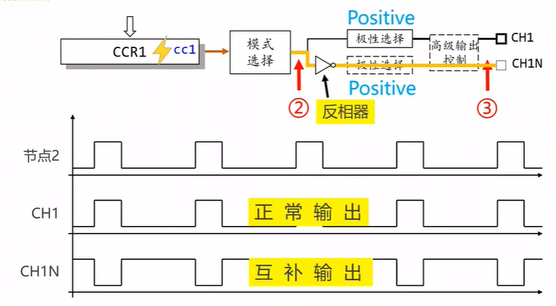

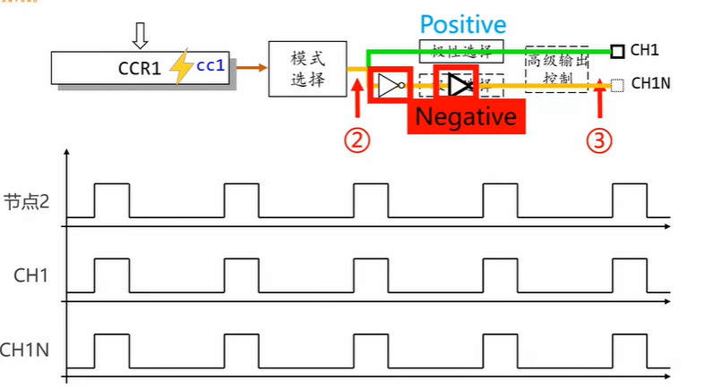

- **在极性选择时，一个选择正极性，一个选择负极性，就可以实现同一个通道的一对互补输出。** 

- **那如果都选择正极性的话的，是不是可以实现一个定时器4个通道，四种占空比的PWM波形总计8个输出。**

## 输入捕获

定时器的四个通道既可以输出，也可以作为输入。
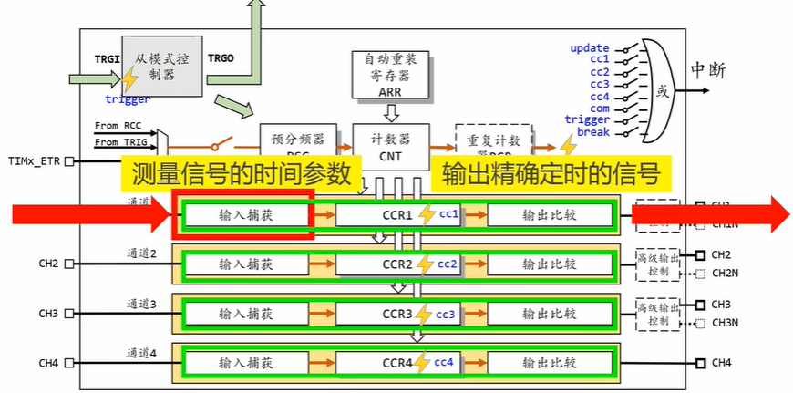

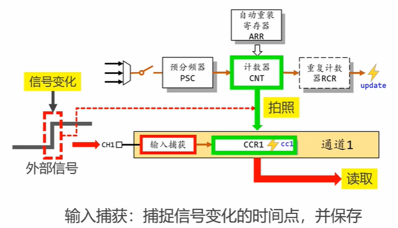

### 测量脉宽

[使用双通道但是使用一个输入的脉冲，一个直接，一个间接](###超声波测距)

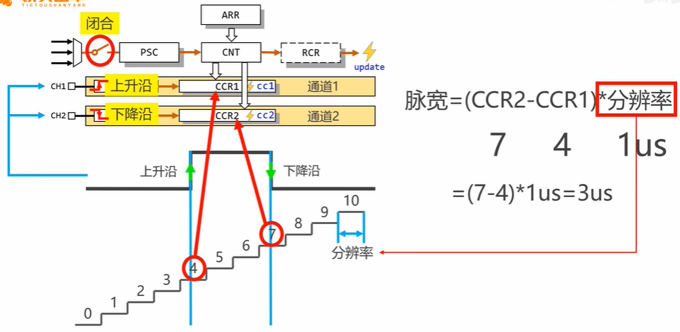

测量脉宽的具体用途包括：

1. 分析 PWM 占空比（如电机控制）。
2. 测速（如编码器、转速传感器）。
3. 测距（如超声波）。
4. 信号解码（如红外遥控）。
5. 频率检测（如振荡器）。
6. 事件计数（如流量计）。

#### 单通道捕获和双通道捕获

单通道 vs 双通道对比

| **特性**       | **单通道切换边沿**         | **双通道分别捕获**     |
| -------------- | -------------------------- | ---------------------- |
| **通道占用**   | 1 个通道                   | 2 个通道               |
| **边沿配对**   | 明确（同一脉冲）           | 不确定（需额外判断）   |
| **资源效率**   | 高                         | 低                     |
| **高频信号**   | 可能错失（受中断延迟限制） | 更可靠（硬件独立捕获） |
| **实现复杂度** | 中等（需切换极性）         | 简单（但需配对逻辑）   |

**低频信号（如超声波、遥控器）**：

- 单通道切换边沿完全够用，脉宽通常在毫秒级，中断延迟影响小。

**高频信号（如高频 PWM）**：

- 单通道可能错失边沿，双通道更可靠，但需解决配对问题。

### 输入捕获过程（输入通道内部工作原理）

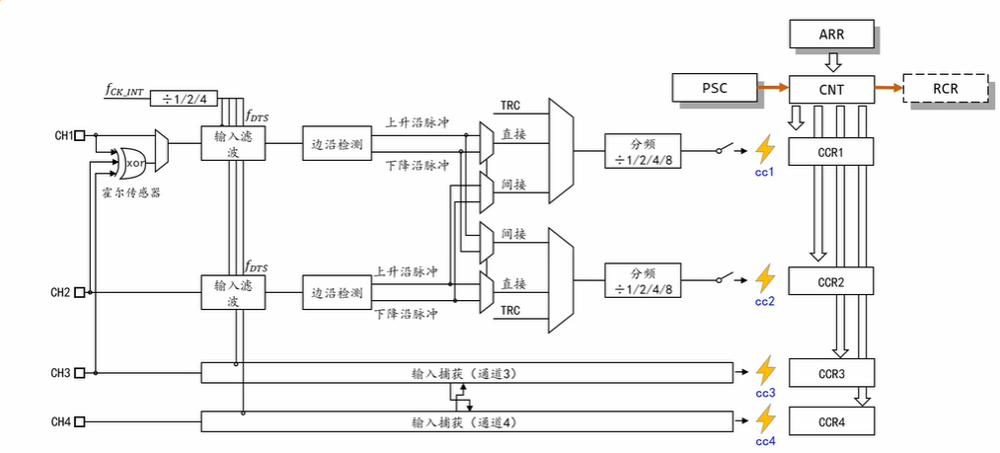

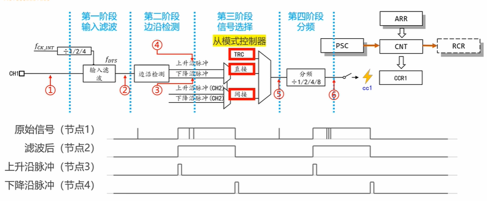

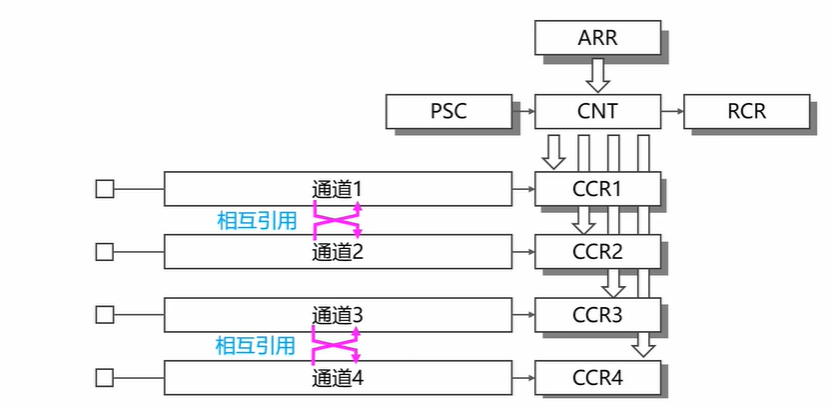

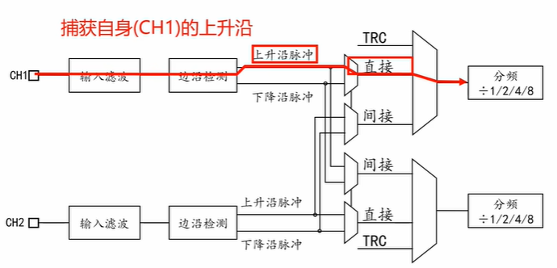

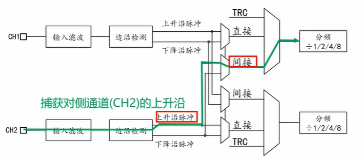

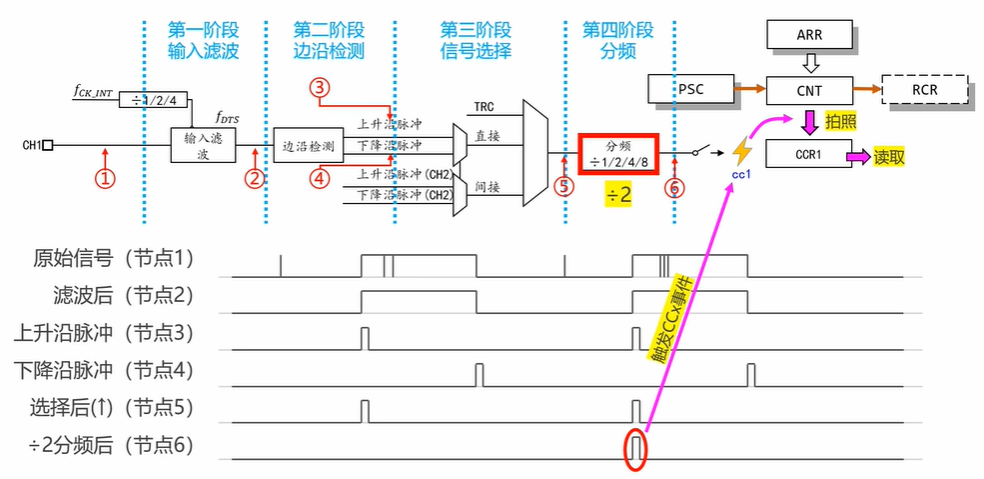

**高频信号还是可以使用单通道检测，可以进行分频。 比如选择上升沿脉冲，分频系数为2，当出现上升沿脉冲后，要两次上升沿采集才会被ccr记录几次。 如果还是太快可以分配系数大一点**

通过定时器的分频功能（预分频器，Prescaler）和输入捕获的滤波或分频机制，确实可以在高频信号下优化单通道测量脉宽，避免因中断处理延迟而错失边沿。

**单通道捕获**：使用一个输入捕获通道（如 TIM3_CH1），初始捕获上升沿，捕获后切换为下降沿。

**分频机制**：

- 配置定时器的输入分频系数（Input Prescaler），例如设为 2，表示每 2 次边沿触发才记录一次捕获。
- 这样可以“减慢”捕获频率，延长两次捕获之间的时间间隔，给中断处理留出足够时间。

**目标**：在高频信号下，避免因切换极性延迟而错过下降沿。

**输入捕获预分频器（Input Capture Prescaler）**：

- 在定时器的捕获通道配置中，每个通道（如 TIMx_CCMR1 的 IC1PSC 位）可以设置输入分频。
- 可选值：
  - 0：无分频，每边沿触发。
  - 1：分频 2，每 2 次边沿触发一次。
  - 2：分频 4，每 4 次边沿触发一次。
  - 3：分频 8，每 8 次边沿触发一次。
- 效果：直接减少捕获事件的频率，与输入信号的原始频率相关。

#### 与定时器预分频器（PSC）的区别

你可能会想到定时器的预分频器（PSC），它们功能不同：

- PSC（Prescaler）：
  - 作用于定时器的输入时钟，降低计数器（CNT）的更新频率。
  - 例如：系统时钟 72 MHz，PSC = 71，定时器时钟 = 1 MHz。
  - 影响：每次计数的步长变大（1 μs），但不改变输入信号的捕获频率。
- 输入捕获预分频器（ICxPSC）：
  - 作用于输入信号的边沿触发，直接减少捕获次数。
  - 不影响 CNT 的计数速度，只控制哪些边沿被记录。

#### 时间间隔的计算

前提：

- **CNT1**：第一次捕获的计数器值（如 356）。
- **CNT2**：第二次捕获的计数器值（如 123）。
- **ARR**：自动重装载值（例如 65535）。
- **时钟周期**：定时器时钟的周期（例如 1 μs，若频率 = 1 MHz）。
- **溢出次数**：若启用中断，记录为 overflow_count。

**设置 ARR**：

- 推荐最大值（65535 或 4294967295），减少溢出。

**捕获两次 CNT**：

- CNT1：第一次上升沿。
- CNT2：第二次上升沿。

**检查溢出**：

- CNT2 ≥ CNT1：无溢出。
- CNT2 < CNT1：有溢出。

**计算时间间隔**：

- 无溢出：(CNT2−CNT1)
- 单次溢出：(ARR−CNT1+CNT2+1)
- 多次溢出：加上 溢出次数×(ARR+1)

**乘以时钟周期**：

- 转换为实际时间（例如 μs）。

#### 单通道捕获上升和下降沿

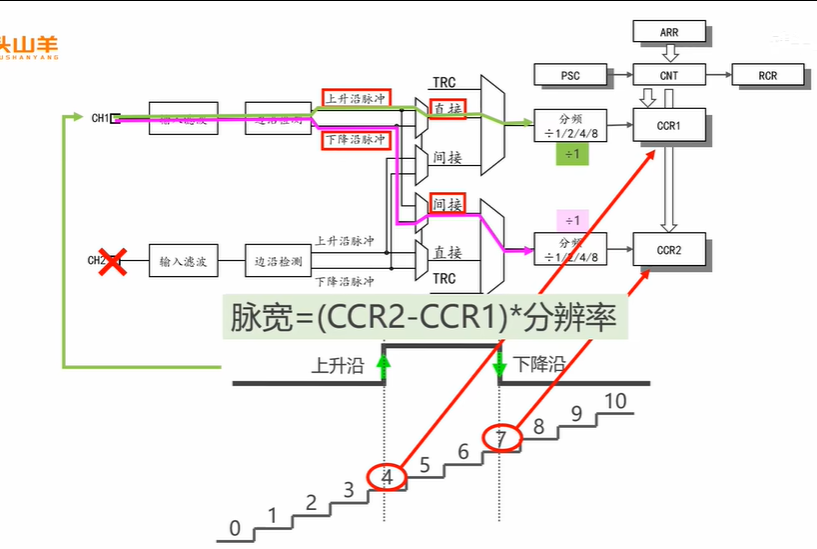

### 超声波测距

#### 原理

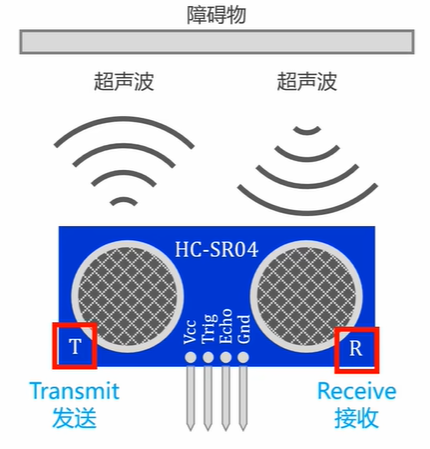

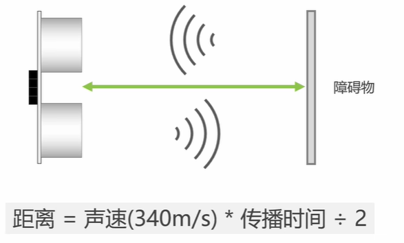

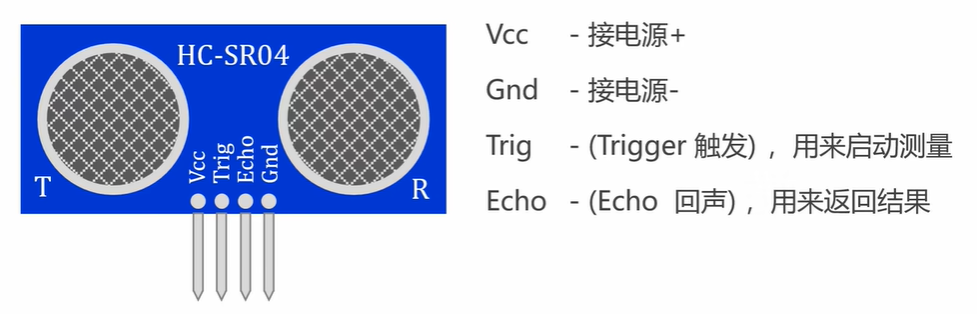

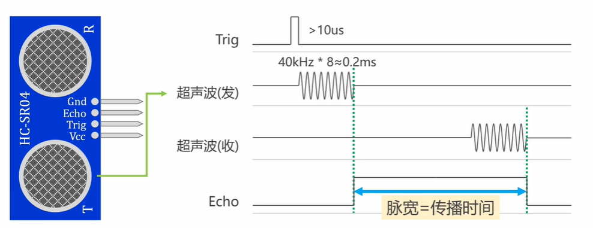

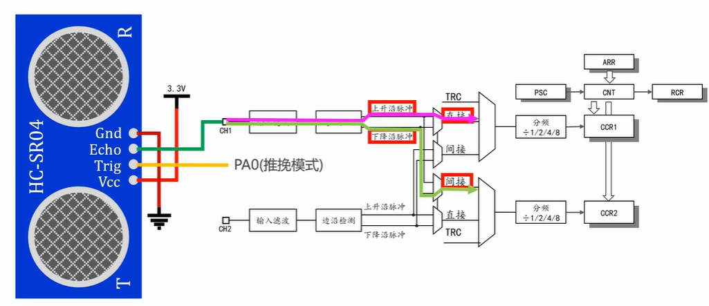

**ECHO 引脚**：接到定时器的通道 1（例如 TIM3_CH1）。

**通道 1（CH1）**：

- 配置为上升沿捕获。
- 信号源选择“直接”（Direct Mode），即检测自身通道的上升沿。
- 捕获值记录在 CCR1。

**通道 2（CH2）**：

- 配置为下降沿捕获。
- 信号源选择“间接”（Indirect Mode），即检测对侧通道（CH1）的下降沿。
- 捕获值记录在 CCR2。

**目标**：测量 ECHO 信号的高电平脉宽（上升沿到下降沿的时间）。

#### 单通道 vs 双通道的定义

在输入捕获中，单通道和双通道的区分主要基于硬件通道的使用和信号输入方式：

- 单通道检测：
  - **只使用一个物理通道（引脚）输入信号。**
  - 通常通过切换边沿（上升沿 → 下降沿）或单一模式完成测量。
  - 例如：CH1 捕获上升沿后切换为下降沿，中断中动态调整。
- 双通道检测：
  - **使用两个物理通道（引脚）分别捕获不同边沿。**
  - 例如：CH1 接信号捕获上升沿，CH2 接同一信号捕获下降沿。
  - 或两个通道分工协作，但信号源可能不同。

你的情况：

- 硬件上：
  - ECHO 只接到 CH1，CH2 未物理连接外部信号。
  - 信号源是单一的（TI1，CH1 的输入）。
- 逻辑上：
  - CH1 捕获上升沿，CH2 捕获下降沿，使用了两个通道的捕获功能（CCR1 和 CCR2）。
  - 但 CH2 的信号来自 CH1 的内部映射（间接模式），而不是独立的外部输入。

判断：

- 属于单通道检测：
  - 因为外部信号只输入到 CH1 一个引脚，CH2 只是利用定时器内部逻辑从 CH1 的信号源（TI1）捕获下降沿。
  - 硬件上只占用一个物理通道（CH1），CH2 是“辅助”角色，未独立接收信号。
- 类似双通道的效果：
  - 从功能上看，CH1 和 CH2 分别捕获上升沿和下降沿，像是双通道分工。
  - 但本质上依赖单一信号源（TI1），区别于传统双通道（两个引脚分别接信号）。

#### 与其他方法的对比

| **方法**            | **优点**                   | **弊端**               |
| ------------------- | -------------------------- | ---------------------- |
| 单通道切换边沿      | 节省通道，简单接线         | 高频下可能错失边沿     |
| 双通道独立输入      | 捕获独立，适合高频         | 配对问题，需两根线     |
| 你的方案（CH1+CH2） | 无切换、无配对问题，单引脚 | 占用两通道，但功能完美 |

**避免单通道边沿切换的弊端**：

- 单通道切换问题：
  - 捕获上升沿后，中断中切换为下降沿捕获。
  - 高频信号下，中断处理延迟可能错失下降沿。
- 你的方案：
  - CH1 固定捕获上升沿，CH2 固定捕获下降沿，无需动态切换极性。
  - 消除了切换时间的影响，适合高速或短脉宽信号。

**避免双通道的配对问题**：

- 双通道问题：
  - 如果 CH1 和 CH2 分别接信号捕获上升沿和下降沿，对于连续脉冲（如 PWM），可能捕获不同周期的边沿，导致配对错误。
  - 例如：CH1 捕获第 1 个上升沿，CH2 捕获第 2 个下降沿。
- 你的方案：
  - CH1 和 CH2 共享同一信号源（TI1），确保捕获的上升沿和下降沿属于同一个脉冲。
  - 配对天然准确，无需额外逻辑判断。

**单通道实现的双通道功能**：

- **硬件上**：只用一个引脚（CH1）输入信号，属于单通道。
- **功能上**：CH1 和 CH2 分别捕获上升沿和下降沿，利用两个 CCR 寄存器，实现了类似双通道的捕获效果。
- **本质**：通过定时器内部的信号映射（TI1 到 CH2），在单通道输入下完成了双通道分工。

#### 定时器方面配置

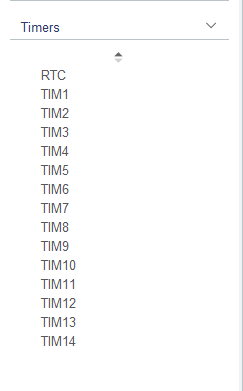

通道配置：
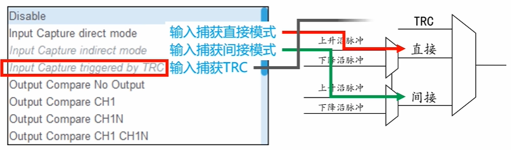

选择模式后的具体配置：

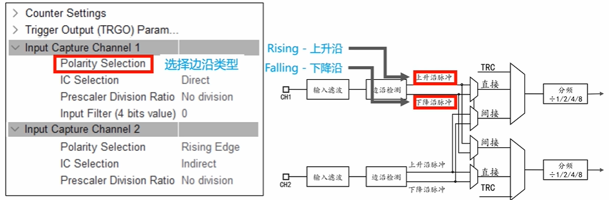

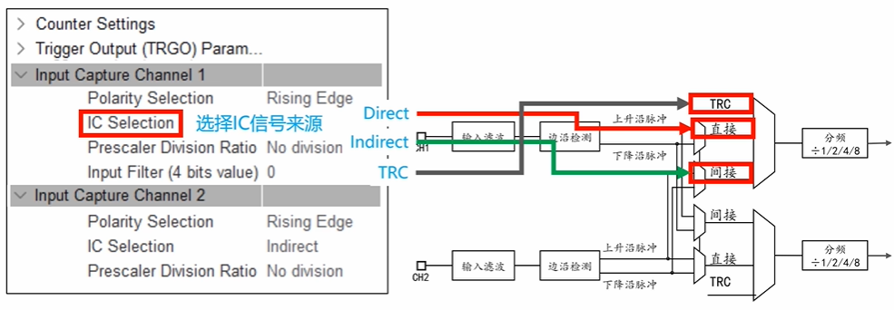

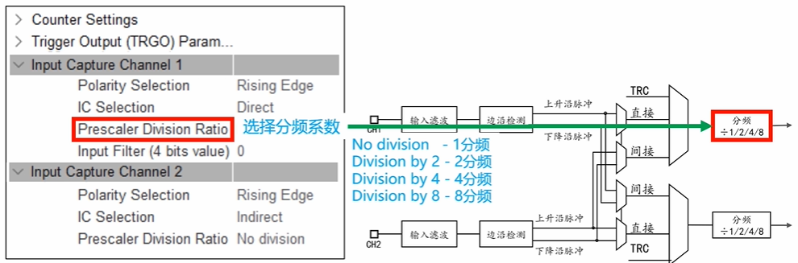

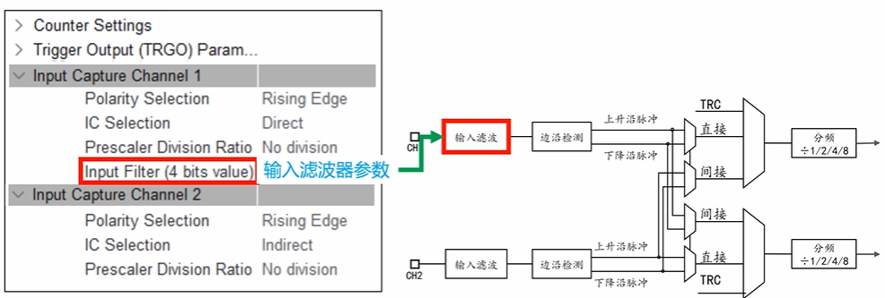

## 从模式控制器

### 前置

**从模式控制器一般是用来干嘛的？这和程序直接使用定时器有什么区别？**

在 STM32 中，“模式控制器”通常指的是定时器中的 **主从模式控制器（Master/Slave Mode Controller）**，它是一个硬件功能模块，用于协调多个定时器之间的同步或触发关系。具体来说，它通过以下机制实现：

- **主模式（Master Mode）**：一个定时器（主定时器）产生触发信号（如更新事件、比较事件）控制其他定时器。
- **从模式（Slave Mode）**：另一个定时器（从定时器）接收主定时器的信号，执行特定操作（如启动、停止、重置计数器）。

模式控制器的主要功能：

1. 定时器同步：
   - 将多个定时器的计数器同步启动或重置。
   - 例如：TIM1 作为主定时器，触发 TIM2 和 TIM3 同时开始计数。
2. 事件触发：
   - 主定时器的特定事件（如溢出、比较匹配）触发从定时器的动作。
   - 例如：TIM1 溢出时重置 TIM2 的计数器。
3. 复杂波形生成：
   - 配合 PWM 或输入捕获，生成多通道相关联的波形。
   - 例如：主定时器控制 PWM 频率，从定时器控制相位差。
4. 外部信号控制：
   - 从模式下，定时器可由外部引脚信号（如 TRGI）触发。
   - 例如：外部脉冲启动定时器计数。

典型应用场景：

- 电机控制：
  - TIM1（高级定时器）产生 PWM 驱动电机，TIM2 同步测量编码器脉冲。
- 多通道信号处理：
  - 一个定时器捕获输入信号，另一个定时器同步输出响应。
- 级联定时器：
  - 将两个 16 位定时器级联成 32 位，扩展计数范围。
- 超声波测距改进：
  - 主定时器触发超声波发射，从定时器捕获回波脉宽。

#### 程序直接使用定时器是什么意思？

“程序直接使用定时器”指的是通过软件（CPU）直接配置和控制定时器的行为，不依赖硬件的模式控制器功能。典型方式包括：

- 手动启动/停止：
  - HAL_TIM_Base_Start() 或 HAL_TIM_Base_Stop()。
- 设置参数：
  - 直接写 ARR、PSC、CCR 等寄存器。
- 中断处理：
  - 在中断中根据事件（如溢出、捕获）执行逻辑。
- 轮询方式：
  - 检查状态标志（如 UIF）或读取 CNT 值。

示例：

- PWM 输出
  - 配置 TIM3_CH1 为 PWM，设置 CCR1 控制占空比，软件启动。
- 输入捕获
  - 配置 TIM3_CH1 捕获上升沿，中断中切换为下降沿。

#### 模式控制器 vs 程序直接使用定时器的区别

以下从多个维度对比两者的差异：

| **方面**     | **模式控制器（主从模式）**                | **程序直接使用定时器**          |
| ------------ | ----------------------------------------- | ------------------------------- |
| **控制方式** | 硬件自动协调，定时器间通过 TRGO/TRGI 通信 | 软件手动控制，CPU 执行逻辑      |
| **同步性**   | 硬件级别同步，延迟极低（纳秒级）          | 软件控制，延迟受 CPU 和中断影响 |
| **实时性**   | 高，事件触发无需 CPU 干预                 | 中等，依赖中断或轮询响应时间    |
| **复杂度**   | 配置稍复杂，需理解主从关系                | 简单直观，逐个配置定时器        |
| **资源占用** | 多定时器协作，占用更多定时器资源          | 可单定时器独立运行，资源灵活    |
| **灵活性**   | 适合特定硬件关联任务                      | 通用性强，逻辑可随意调整        |
| **典型应用** | 定时器联动（如电机控制、级联计数）        | 独立任务（如 PWM、简单计时）    |

详细对比：

1. 实时性与效率：
   - 模式控制器：
     - 硬件直接处理定时器间的触发和同步，无需软件干预。
     - 例如：TIM1 溢出瞬间触发 TIM2 重置，延迟仅几时钟周期。
   - 程序控制：
     - 依赖中断或轮询，响应时间受 CPU 负载、中断优先级影响（微秒级延迟）。
     - 例如：TIM1 溢出中断中启动 TIM2，延迟可能几 μs。
2. 复杂性：
   - 模式控制器：
     - 需要配置主模式（MMS）、从模式（SMS）、触发源（TS）。
     - 例如：TIM1->CR2 |= TIM_CR2_MMS_1（更新事件触发）。
   - 程序控制：
     - 只需设置基本参数（如 ARR、PSC），直接调用 HAL 函数。
     - 例如：HAL_TIM_PWM_Start(&htim3, TIM_CHANNEL_1)。
3. 应用场景：
   - 模式控制器：
     - 多个定时器需精确同步或触发。
     - 例如：超声波测距中，TIM1 触发发射，TIM2 捕获回波。
   - 程序控制：
     - 单一任务或简单逻辑。
     - 例如：单独用 TIM3 测量脉宽。

#### 超声波测距中的例子

你的方案（CH1 + CH2）：

- CH1 捕获上升沿，CH2 捕获下降沿，ECHO 接 CH1。
- 模式控制器无关：
  - 这是输入捕获的直接配置，未使用主从模式。
  - CH2 的间接模式（TI1 信号）是捕获功能的内部映射，不是模式控制器的功能。

用模式控制器改进：

- TIM1（主）：
  - 配置为 PWM 输出，触发超声波模块（TRIG 引脚）。
  - 主模式：更新事件输出 TRGO。
- TIM2（从）：
  - 从模式：外部触发启动（TRGI 接 TRGO）。
  - CH1 捕获上升沿，CH2 捕获下降沿。
- 区别：
  - **模式控制器：TIM1 自动触发 TIM2 开始捕获，硬件同步。**
  - **程序控制：软件先启动 TIM1 PWM，再手动启动 TIM2 捕获，延迟稍大。**

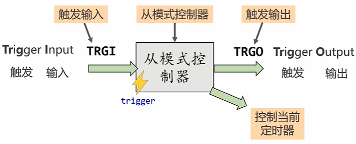

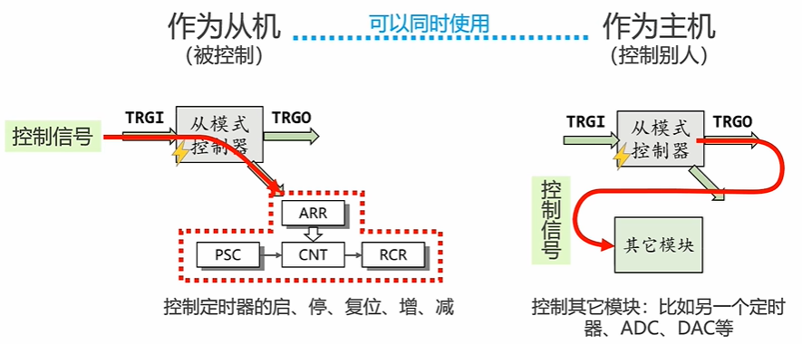

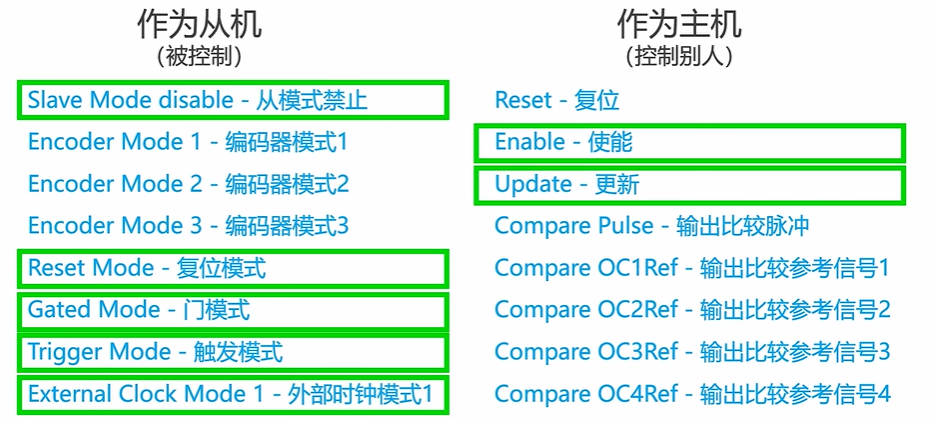

### 从模式控制器的模式说明

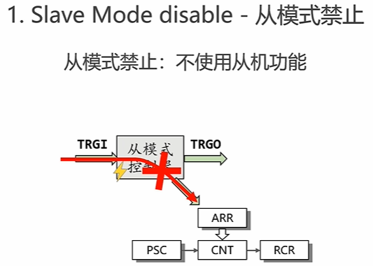

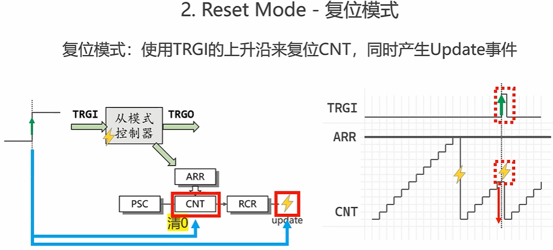

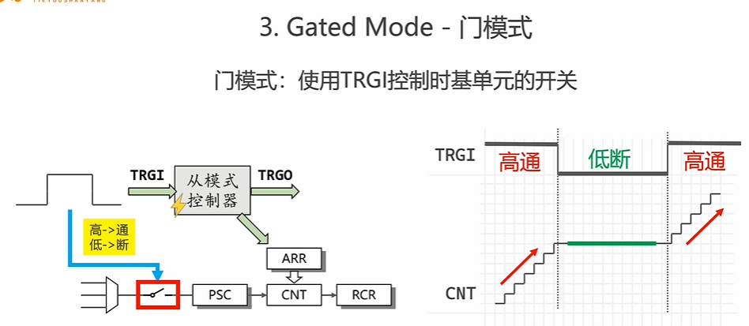

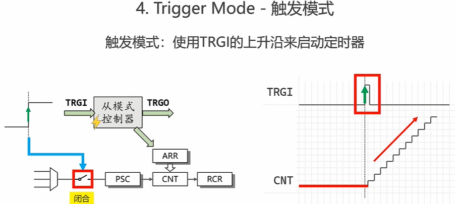

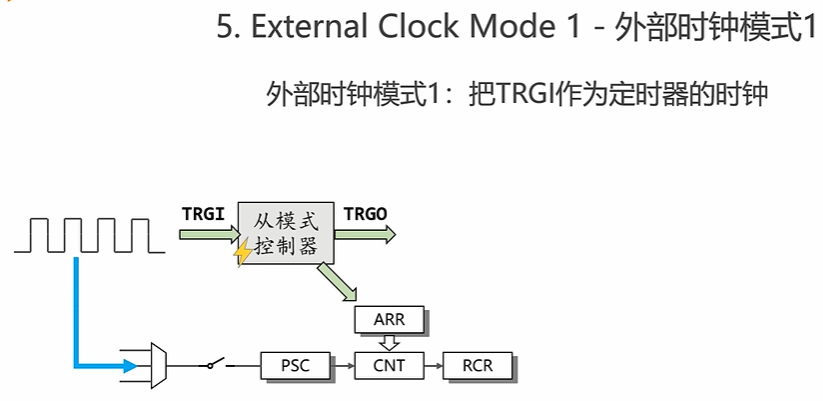

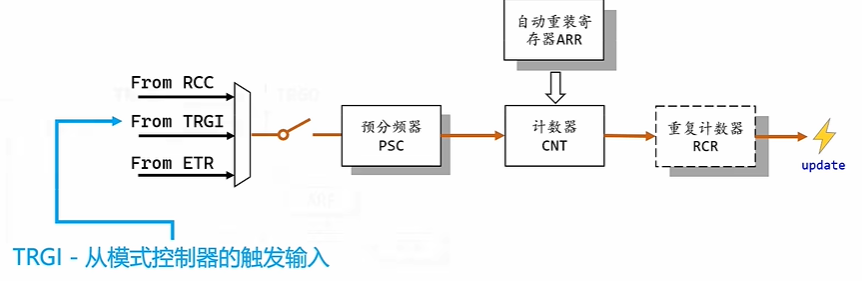

#### 主机模式

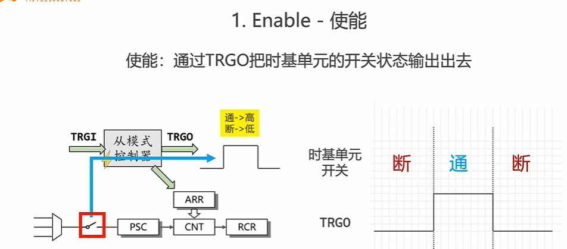

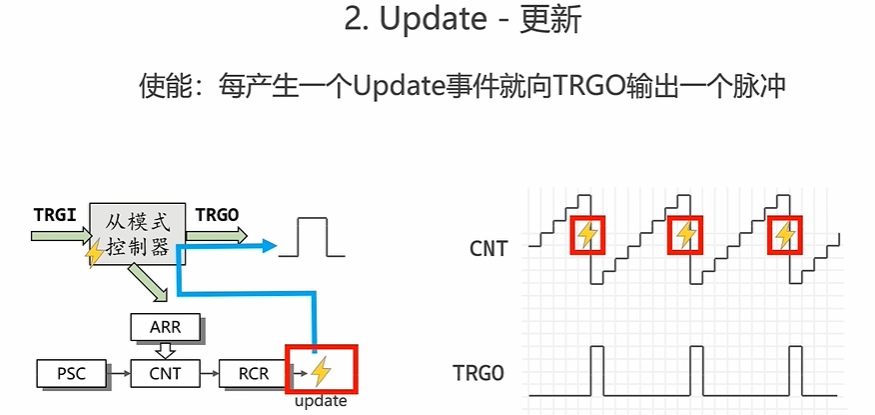