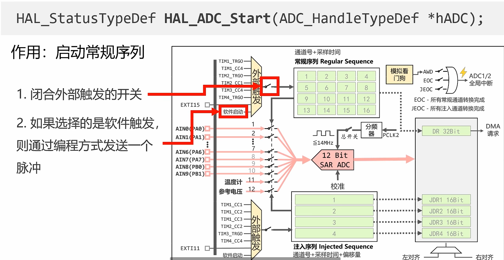

# P9_ADC

## 模拟信号与数字信号

## 采样深度

## 逐次逼近型ADC

## 工作原理

先打开采样保持电路让电容充电，然后断开。因为电容没有形成通路，所以无法放电。两端电压一直保持。

### 为什么不从低位开始逼近？

**从高位开始逼近的原理**

SAR ADC的核心思想是通过二分法逐步逼近输入模拟信号的值。它使用一个数字-模拟转换器（DAC）和比较器，在每一步中测试一个假设的数字值，然后根据比较结果调整这个值，最终逼近真实的输入电压。**从高位开始逼近（即先确定最高有效位，MSB），可以快速收敛到目标值。这种方法类似于“从大范围逐渐缩小到精确值”的过程。**

例如，假设输入范围是0到16V，8位分辨率：

- 第一步：测试8V（MSB=1，10000000），如果输入大于8V，则保留1，否则置0。
- 第二步：在剩余范围（0-8V或8-16V）内测试一半的值（4V），依此类推。 这种方式每次都能将误差范围减半，效率很高。
- 为什么不从低位开始？

如果从低位（LSB）开始逼近，会导致以下问题：

（1）**效率低，收敛慢**

**从低位开始意味着先确定最不重要的位（LSB），然后逐步向高位移动**。例如：

- 第一步：测试1V（00000001），比较后确定LSB。
- 第二步：测试2V（00000010），确定次低位。
- **这样需要逐步累加，直到测试所有位才能确定完整值。 这种方法需要更多的步骤才能覆盖整个范围，尤其是在输入值较大时，低位逼近几乎无法快速缩小误差范围。相比之下，从高位开始的二分法能更快锁定大致范围。**

（2）硬件实现复杂性增加

SAR ADC依赖于一个简单的反馈循环：比较器输出直接控制DAC的寄存器位。从低位开始逼近需要一种“累加式”的控制逻辑，每次调整都要基于之前所有低位的结果重新计算DAC输出值。这不仅增加了计算开销，还可能需要额外的寄存器来存储中间结果。而从高位开始逼近的算法是“即设即比”，每一步只需调整一位，逻辑更直接，硬件实现更简单。

（3）误差范围控制困难

从低位开始时，前几步的逼近对整体值的贡献很小（因为低位权重低），无法快速判断输入信号的大致范围。这会导致早期步骤的比较结果对最终值的影响不显著，浪费时间。**而从高位开始，每一步都能显著缩小误差范围，符合二分法的优化原则。**

3. 低位逼近并非“太复杂”，而是“没必要”

从低位逼近在理论上是可以实现的，但它并不复杂，只是效率低下且不符合SAR ADC的设计目标。SAR ADC追求的是高速度、低功耗和简单硬件实现，从高位开始逼近完美契合这些需求。低位逼近在某些特殊场景（比如需要极高精度的微调）可能有意义，但那通常不是SAR ADC的典型应用领域。

4. 类比理解

**想象你在猜一个0到100的数字：**

- **从高位开始就像先问“大于50吗？”然后“大于75吗？”或“大于25吗？”，每次都能把范围砍掉一半。**
- **从低位开始就像先问“个位是1吗？”然后“个位是2吗？”，逐步试探，太慢且不直观。**

## ADC模块

### 多路模拟信号怎么办？

**依次打开开关，依次转换**

### 如何管理多路ADC的转换

## 采样时间和转换时间

### ADC时钟

### 计算方法

### 转换时间

**看你ADC的采样深度**

### 采样时间

- **采样时间 = 开关闭合的时间 = 电容充电的时间**
- 充的越久越接近，电容电压越接近输入电压。

### 采样周期是固定的选项

## 常规单通道转换

### 软件启动常规序列

**已经封装好了，无论你选择哪一个外部触发，调用这个函数都会使用对应的方式触发。**

### 定时器触发（定时转换，避免轮询等待）

#### CCX事件（不是时基单元的更新事件）

#### 利用从模式控制器的TRGO（利用的是时基单元的更新事件，没开中断）

**如果选择了软件启动的话，就有两种功能**否则就只有一种功能。

