# 模拟电路

## 电流

世间万物由原子构成，一个最简单的原子模型可以拆分为 **带正电荷的原子核** 和 **围绕它旋转的带负电荷的电子**。这符合 **同性相斥，异性相吸** 的基本法则，就像磁铁的同极互斥、异极相吸一样。

可以把原子想象成一个小型的太阳系——**原子核像太阳，电子像行星**，在它周围运动。**电子的运动和分布决定了物质的电学特性，比如导体、半导体和绝缘体的区别。**

在模拟电路中，我们关注的是 **电子的流动（电流）** 和 **电荷的作用**。可以这样类比：

- **电子流动（电流）** 像水流，
- **电压** 就像推动水流的“水泵”，
- **电阻** 像是水管的粗细，管道越细（水阻越大），流动就越困难。 

固体材料的导电性取决于 **电子是否能自由移动**，这与电子的分布和运动方式有关。我们用 **导体、半导体和绝缘体** 来分类，下面用简单的例子来说明它们的区别：

### **导体（电子容易流动，导电能力强）**

🔹 **例子**：金属（铜、银、金、铝）
       🔹 **原因**：金属的原子排列虽然规则，但**最外层的电子（自由电子）很容易脱离原子**，在材料内部随意移动，就像水在河里流动一样。因此，金属是很好的导体。

👉 **比喻**：导体就像是一条宽阔的河流，水（电子）可以自由流动，所以能导电。

### **绝缘体（电子被牢牢束缚，不易流动）**

🔹 **例子**：橡胶、玻璃、陶瓷、塑料
       🔹 **原因**：这些材料的电子被**紧紧束缚在原子周围**，无法轻易跳出来参与导电。所以，即使有电压加在绝缘体上，电子也不会轻易流动，电流无法通过。

👉 **比喻**：绝缘体像是一条干涸的河床，没有水（电子）可以流动，所以不导电。

### **半导体（导电能力介于导体和绝缘体之间）**

🔹 **例子**：硅（Si）、锗（Ge）
       🔹 **原因**：半导体材料本身是绝缘体，但在**特定条件下（比如加热、掺杂杂质）**，部分电子可以被激发出来，形成导电能力。这就是为什么硅是制造芯片的关键材料。

👉 **比喻**：半导体像是一条**冰封的河**，正常情况下水流（电子）被冻结住了，但如果温度升高或者加一点盐（掺杂杂质），冰会部分融化，让水流动起来（开始导电）。

### **极简模型：单层原子导线中的电子流动**

假设我们有一根厚度只有 **一个原子** 的导线，里面的原子依次编号为 1、2、3…… 每个原子**只带一个电子**，而且这些电子本来都是固定在各自的原子周围。

但如果 **1 号原子的电子不安分，往右挤**，它会把 2 号原子的电子推开，而 2 号的电子又会推 3 号的电子…… 这种传递一直持续下去，导致整个导线内的电子**开始有序地移动**。

💡 **这个电子的整体移动，就是电流！**

但有意思的是，在电路里，**每个电子都不会直接穿越到另一端**，它们只是一个接一个地“推”下去，最终在最右边的电子离开导线，而最左边又补充一个新的电子，形成一个循环。

## 电流单位

既然电流是**电子的流动**，那么我们可以用**“单位时间内通过导线横截面电子的数量”**来定义电流的大小。

**1 安培的电流就是每秒钟有 6.24 × 10¹⁸ 个电子流过导线的横截面！** 🚀

**如果 1 号原子的电子往右挤，带动 2 号、3 号电子一起挪动**，那么电子的运动就产生了电流。

在某个横截面上，如果**每秒钟通过的电子多，电流就大**；如果**电子流动得慢或少，电流就小**。

### 电荷量

**电荷量**是指通过某个区域的**电荷总量**，而**电子的数量**与电荷量是有直接关系的，因为电子带有负电荷。

每个电子携带的电荷是一个固定值，当我们说 **电荷量** 时，实际上就是计算通过导体横截面的电子数量所带的总电荷。

电荷量和电子数量是直接相关的，**电荷量越大，意味着通过的电子数量越多**。

### 导线厚度

**导线的厚度**确实会影响电流的传输能力，而在非常细的导线中，比如你提到的**一个原子大小厚度的导线**，很可能会遇到几个问题：

**导线厚度与电流的关系**

- **电流通过导线时，导线的厚度直接影响电流的大小**。如果导线非常细（比如一个原子大小的导线），那么流过导线的电子就会**非常密集**，**电流的密度会非常高**。这种情况下，导线可能无法承载这么高的电流，容易导致问题。

**导线发热**

- 当电流通过导线时，导线中的**电子会和导体中的原子发生碰撞**，这会导致部分能量转化为热能。这就是我们常说的 **焦耳热**，也叫 **电阻加热**。

- 对于细导线，由于电子流动受限，**碰撞次数增多，电阻增大**，因此容易产生过多的热量。过热可能导致导线损坏，甚至**熔断**。

  - **细导线：一个原子大小的导线**

    假设我们有一个导线，**每个原子只有一个电子**，导线的横截面是一个原子大小（就像你提到的 **1, 2, 3** 号原子排列）。电流通过时，电子会不断地**碰撞原子核**，这会导致**能量转化为热量**。在这种情况下：

    - **电子密集度高，碰撞频繁**，每个电子在导线中流动时，都会和周围的原子核发生较多的碰撞。
    - 这些碰撞导致**大量的能量转化为热量**，并且因为导线非常细，**热量无法很好地散开**，很容易造成导线局部过热。
    - 👉 **比喻：** 就像把水流通过一个非常细的管道，水流得非常快，但管道受限，水的能量（热量）积聚在管道内，最终可能让管道升温或破裂。

  - **粗导线：两倍厚度的导线**

    现在假设我们有一个导线，**厚度是原来两倍**，也就是**每个原子都有两个电子流动的通道**（假设导线的宽度扩展了）。例如，在导线的横截面上，有两个原子行列：

    - **1, 2, 3**（原来的行列）
    - **4, 5, 6**（新增的行列）

    在这种情况下：

    - **电流通过时，每个电子碰撞的原子核数量会减少**。每个电子与原子核的碰撞次数会减少，因为导线宽了，电子可以分散到更多的原子核之间。
    - 由于电子分布在更多的原子核上，**热量被分散**，使得导线**不会像细导线那样迅速升温**，减少了发热的可能性。
    - 👉 **比喻：** 就像水流通过一个较宽的管道，水的流速变慢，能量（热量）被更好地分散在更大的区域，避免了局部过热。

  - **总结：粗导线 vs. 细导线**

    - **细导线**：电子流动时**碰撞频繁**，热量集中在一个小区域，容易导致**发热过多**，甚至损坏导线。
    - **粗导线**：电子流动时，**碰撞较少**，热量**更均匀分布**，导线不会那么容易过热，因此可以承载更大的电流。

**非常细导线的承载能力**

- 假设我们有一个**非常细的导线（比如一个原子大小的导线）**，假如要传递 **1 安培电流**，那么每秒钟就有 **6.24× 10^18** 个电子通过。这样高密度的电子流很容易导致导线表面温度急剧上升，因为**电子的运动与原子碰撞会产生热量**，这会使导线发热，最终可能损坏。

在实际应用中，我们通常使用**较粗的导线**来传递较大的电流，**减小电流密度**，以避免过多的热量产生，并保证导线的安全性。比如，**家用电线**就有足够的厚度，以便能够承载 **家庭电器所需的电流**，并且不会过热。

## 电路

我们之前提到了**电流是电子的流动**，而**电流需要通过导线**来传输。为了让电流能够顺畅流动，我们需要一个完整的通路，这个通路就是我们所说的 **电路**。

#### **电路是什么？**

电路就是一条**导电的路径**，**电流**通过这条路径流动。电路通常包括：

- **导线**：提供电流流动的通道。
- **负载**：消耗电能的设备，比如灯泡、电动机等。
- **开关**：用来控制电流是否流动。

#### **电路的关键要素**

1. **闭合电路**：电流只有在电路**闭合**的情况下才能流动，也就是电路要形成一个完整的环路。
2. **开路**：如果电路中有断开（例如开关关闭），电流就不能流动，电路变成**开路**。

**VCC（电源正极）和GND（地/电源负极）确实构成了一个闭合电路，让我详细解释：**

基本概念：

- VCC代表电源电压供应端（正极）
- GND代表地/参考点（负极）
- 它们共同建立了电路的电位参考系统

为什么是闭合电路：

- 电源（比如电池、适配器）内部本身就是闭合的
- 从VCC流出的电流最终必须回到GND
- 电流需要形成一个完整的回路才能流动
- 即使我们在图纸上看到VCC和GND符号是分开的，实际上它们在物理上是相连的

实际运用：

- 在电路图设计中，常用VCC和GND符号来简化图纸
- 不需要画出所有连线，默认它们都是相连的
- 这样可以让电路图更清晰，避免线路过于复杂
- 但实际电路中，它们必须是物理连接的

这就像自来水系统：

- VCC相当于自来水厂（供水源）
- GND相当于下水道（回流通道）
- 虽然我们看不到完整的管道，但水循环系统是闭合的

## 电池

要让电子流动，就需要**电势差（电压）**，也就是**推动电子流动的力量**。而这个**电压**是由**电池**提供的。

#### **电池是什么？**

电池是一种**化学装置**，它通过化学反应**产生电压**，并提供电流的**推动力**。电池的两端有不同的电势（正极和负极），这就是我们常说的电压。

- **正极**（+）和**负极**（-）之间的电势差，推动电子从负极流向正极。
- 当我们把电池连接到电路中时，**电子从电池的负极出发**，通过导线流动，最终到达电池的正极，完成电流的循环。

#### **电池的作用**

电池**通过提供电压（电势差）**来推动电子流动，让电流在电路中产生。

## **电路中的电流流动**

让我们用电池和电路结合起来简单示意一下：

- **电池**提供了电势差（电压），让电子从负极流向正极。
- 电子通过导线流动，在电路中穿过负载（比如灯泡），负载消耗电能（灯泡发光），然后电子流回电池的正极。
- 这个过程需要**电路是闭合的**，否则电流就无法流动。

### **举个简单的例子：灯泡电路**

1. **电池**：提供电压，推动电子流动。
2. **导线**：连接电池的正负极，形成导电路径。
3. **灯泡**：作为负载，消耗电能并发光。
4. **开关**：用来控制电流是否流动（如果开关关闭，电路就断开，电流无法流动）。

可以这么理解：当电池接入电路后，电池内部发生化学反应，负极会产生大量电子，导线原本也有电子，根据同性相斥，异性相吸的原则，电池的正极会接收电子，那么电子就从负极向正极流动。当电池中的化学能消耗完后，负极产生不了大量电子，驱动力变小了，不足以推动导线中的原子，那么电流就没有了，没有电流经过负载，那么负载也不会体现相应的效果。

## **直流电（DC，Direct Current）**

- **什么是直流电：** 直流电的电流方向是**固定不变的**。也就是说，电流一直从一个方向流动，比如从电池的负极流向正极。
- **举个例子：** 想象你用电池给手电筒供电，电池的负极和正极始终是电流流动的起点和终点，电流的方向不会改变。这就是典型的直流电。
- **使用场景：** 直流电主要用于低压、小功率设备，比如手机、手电筒、电子设备、汽车电池等。
  - 需要稳定电压和恒定方向的小型设备中
- 直流电源通常由电池或者其他直流电源供应

## **交流电（AC，Alternating Current）**

- **什么是交流电：** 交流电的电流方向是**不断变化的**。在交流电中，电流会周期性地**改变方向**，即电流不断从一个方向流到另一个方向，再返回。

- 交流电通常是电网提供的电力
- 用于各种大型的较大功耗的电器设备和机械设备中：家用电器，比如电灯、电冰箱、空调、电视等大多数家庭电器，甚至工业设备，也都需要交流电。

**优缺点：**

- **直流电（DC）**的优点是电流稳定，容易控制，适合精密电子设备；缺点是难以远距离传输（因为损失大）。
- **交流电（AC）**的优点是容易通过变压器转换电压，适合长距离传输，且可以通过改变频率来调节；缺点是电流方向不断变化，难以直接控制。

**变压器只能处理交流电**，因为它依赖于电流方向的变化来产生磁场并进行电压转换，而直流电的电流是恒定的，没有方向上的变化，无法在变压器中产生变化的磁场，因此不能通过变压器进行电压升降。[传送门](###电压增大，电流变小)

对于直流电的长距离传输，通常采用**高压直流输电（HVDC）**技术，而不是通过变压器。

## 电流方向

从微观角度来看：

- 电流实际是负电荷（电子）的定向移动
- 电子从负极流向正极
- 这是因为同性相斥，异性相吸的基本物理原理
- 负电荷会被正电位吸引，被负电位排斥

从宏观角度来看：

- 我们约定电流方向是从正极流向负极
- 这个约定来自于本杰明·富兰克林最早研究电现象时的假设
- 当时他认为电流是正电荷的流动
- 虽然后来发现是电子在移动，但这个约定已被广泛使用

为什么保留这个"错误"的约定：

1. 历史延续性：大量的教材、文献都采用这个约定
2. 实用性：对于电路分析，方向的约定并不影响计算结果
3. 简化分析：正向电流更符合人们的思维习惯
4. 标准统一：各种电路仿真软件、教学资料保持一致，避免混淆

所以虽然微观上电子实际是从负极流向正极，但在实际电路分析中，我们依然使用从正极到负极的约定电流方向，这种约定俗成的规则极大地方便了电路分析和教学。

## 电压与电流的关系

**电势差**（或电压）是指两点之间的电能差，它是推动**电子**流动的驱动力。当电路中存在电压时，它会促使电子从电池的负极（低电势）流向正极（高电势）。

- **在局部电路中**，电压增大，电子的漂移速度增大，电流会增大。

- **在长距离电力传输中**，为了减少电能损失，我们通过变压器**提高电压**，使得电流**减小**，从而减少由电阻引起的损失。虽然电压增大时，电流会变大，但**高电压低电流**的组合能减少长距离传输中的能量损耗。

  - 虽然**电压增大**会导致**电流增大**，但**在传输中我们通过变压器提高电压**，从而使得传输的电流非常小，以减少能量损失。

  - 例如，在电力传输过程中，电压通过变压器提高到**很高的水平**，比如几十万伏。通过这种方式，电流会减少，传输过程中的**功率损耗**也会降低，因为损耗和电流的平方成正比。

### 实验现象

**我使用直流电源供电时，把电压调大，电机的转速和LED的亮度也会增强。当超过器件的最大负载后，器件会损坏。是因为电压增大，导致电流增大，单位时间内通过的电子数量增多，导致器件中的原子与电子碰撞频率过大，超过了负载？**

- **直流电源供电时**，你调高电压，**电机转速和LED亮度增加**。

- 当超过器件的最大负载时，**器件损坏**。

电压增大时，电流增大。如果器件的电阻不变（比如电机和LED的电阻），电流会直接随着电压增加而增加。

- **电流增大**意味着通过导体的电子数量增多。这是因为电流本质上就是电子流动的速率，电压增大时，推动电子的力量增强，电子的流动速度增快，流过单位截面区域的电子数量增多。

- 电子在导体内流动时，会与原子发生碰撞。这种碰撞会导致能量损失，以热的形式表现出来，称为**焦耳热**（或电阻热）。随着电流的增大，电子与原子的碰撞频率和碰撞的强度都会增加。

  - 如果**电流过大**，碰撞次数增多，产生的热量会变得非常大，**超出器件的散热能力**，就会导致器件温度过高，最终可能导致损坏。

- 电压增大时，电流也增大，这样传递的功率就会增加。电压越高，单位时间内通过器件的能量就越多。

  电机和LED等器件都需要一定的功率来工作，但它们也有**最大功率承受能力**。当电压过高时，传递给器件的功率可能会超过它们的最大负载能力。

- 比如**电机**，它在设计时有一个额定功率，如果超过这个功率，电机内部的线圈就会过热，甚至可能烧坏。

  **LED**也是一样，它有一个最大功率值，过高的功率会导致过多的电流流过，产生过多的热量，超出了LED的散热能力，从而损坏它。

### PWM与直接调节电压

**PWM本质上还是对电压的控制**，但与直接调节电压不同，它通过调节电压的开关时间来控制平均电压。通过这种方式，**功率的传递是间歇性的**，因此能够避免连续的高电流流过器件，减少热量积累。

由于PWM控制的是**平均功率**，而不是峰值功率，因此即使峰值电压较高，器件所承受的**平均功率**不会超过其最大负载，从而避免过热和损坏。

## 电阻和欧姆定律

阻碍电流的流动就是电阻，电流经过导体时阻碍电流流动的程度。

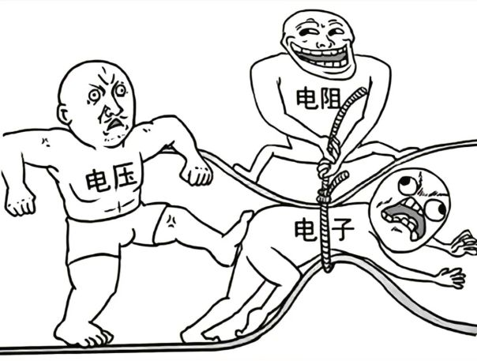

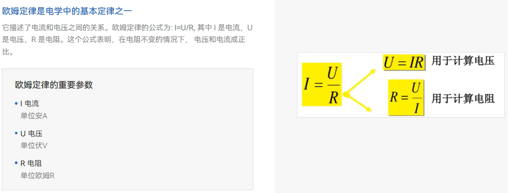

在直流电路中，如果不增加或改变外部器件（比如电阻）的话，电阻是**固定不变**的。因此，通过欧姆定律，电压的变化就直接影响电流的变化。

**不增加外部器件**（如电阻不变）时，电阻的数值保持不变。电阻可能是由导线、负载等构成的，它们的性质决定了电流的流动阻力。而电压控制了电子的“推动力”。

### 电压增大，电流变小

**交流电经过变压器长距离传输时**，**欧姆定律**可以在一定程度上帮助解释为什么电压增大、电流变小，从而达到高效长距离传输的效果。

- **电压增大、电流增大**：这是在**电阻不变**的情况下，按照欧姆定律直接得出的结论。
- **电压增大、电流减小**：这种情况出现在**电力传输设计**中，升压变压器将电压提高，电流减小，目的是减少通过电缆的损耗。

因此，欧姆定律可以解释电压增大时电流的变化，但在实际应用中，电流的大小也受电路设计、负载、电缆电阻等因素的影响，特别是在长距离电力传输中。

**交流电长距离传输**的现象可以使用功率损耗公式来解释，而不完全依赖于**欧姆定律**，因为在长距离传输中，电阻会随着电流和传输条件发生变化。

**电流减小**：通过升压变压器增大电压，电流相应减小。这是因为**功率（P）是恒定的**，而我们知道：P = I*U

在电力传输过程中，为了保持功率不变（即保持传输的总电能不变），如果电压 UUU 增加，电流 III 必然会减小。这样做的目的是减少电流，以**减少通过电缆的功率损耗**。

**减少功率损耗**：当电流变小后，损耗 P=I* I * R会大大减少。因为**功率损耗**与电流的平方成正比，电流减小对减少损耗的效果是非常显著的。

电厂发出的电能功率会根据电网需求和负载变化而有所调整，因此，虽然电厂会尽量保持功率的输出稳定，但实际输出功率是会随着负载的变化而变化的。

### 计算

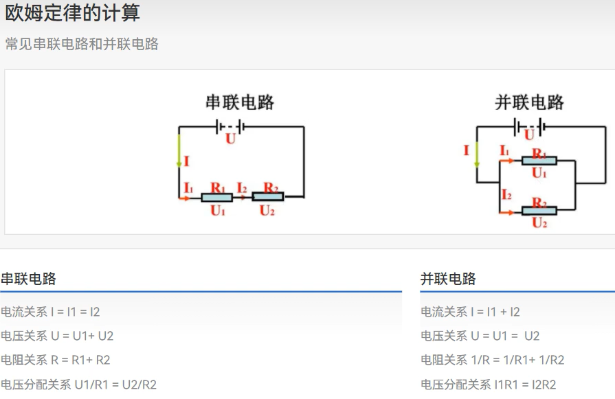

## 以下重点

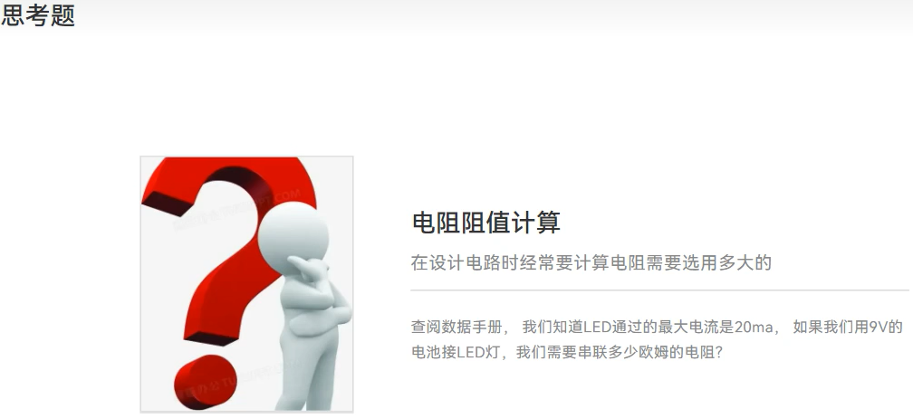

直接接的话，电压过大，会超过器件负载导致损坏。

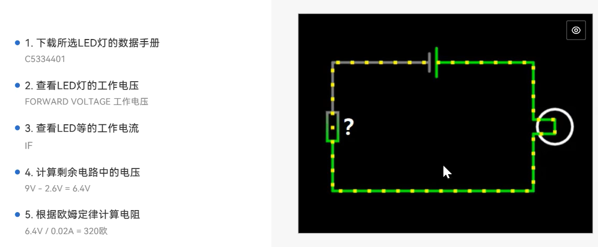

**可以去立创和华秋商城看看电子元器件的样子，里面会有数据手册包含一些电气特性**

C5334401的参数

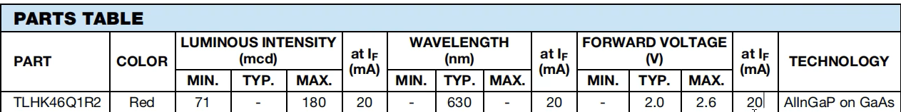

关注电压和电流
电灯使用2.6V的工作电压，在串联电路中的话，电池供9V，那么需要一个电阻分担6.4的电压。电灯的电流需求为0.02A。

那么根据欧姆定律计算得出需要320欧的电阻，才能保证正常工作。

根据工程经验来看的话，直接串联一个1K的电阻，电灯作为状态灯的话，亮与暗一点都无所谓。

## 常见元器件

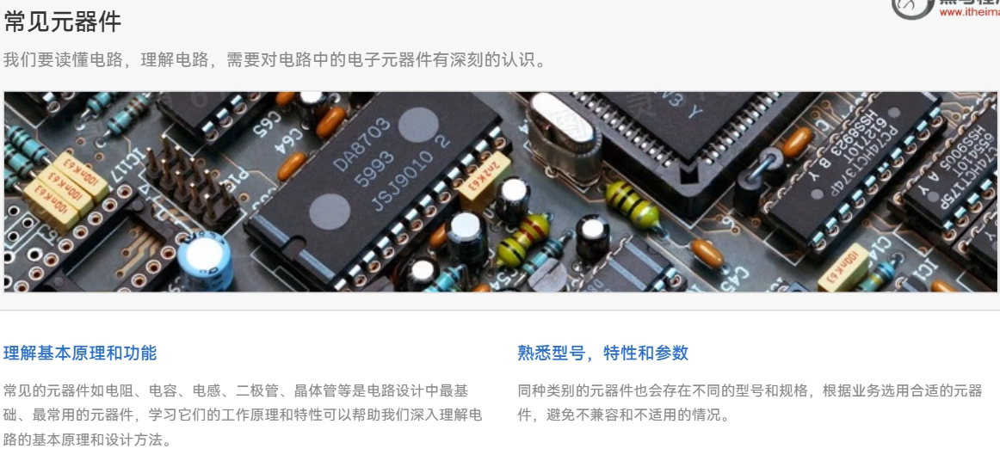

## 电阻器

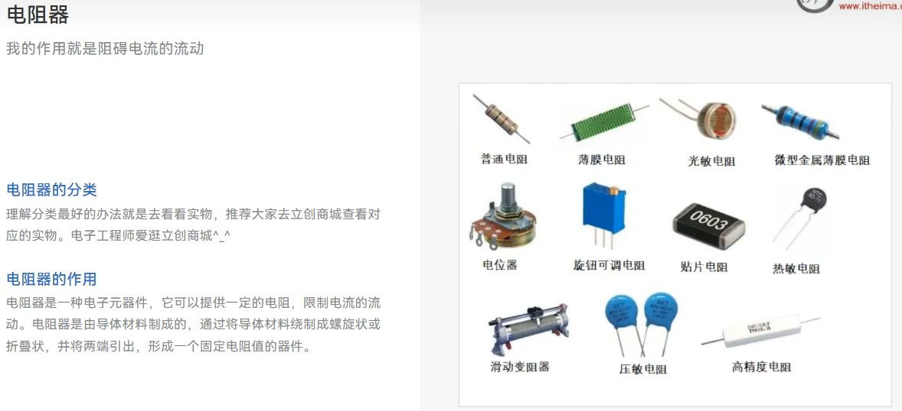

阻碍了电子流动，能量以热能形式散发出来，看到触摸电阻感受到。

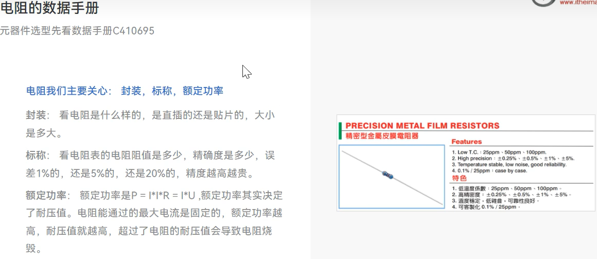

这里好像可以看出，电网输出功率不变，通过变压器把电压升高的话，电流就会降低。

### 电阻在串联和并联电路中的作用

串联电路中的电阻：

- 同样的电流通过所有电阻
- 根据欧姆定律(V=IR)，电压会在各个电阻上分配
- 每个电阻上的电压降取决于电阻值的大小
- 电压分配符合基尔霍夫电压定律(KVL)
- 总电压 = 各电阻电压降之和

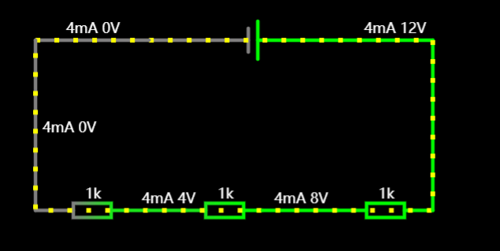

并联电路中的电阻：

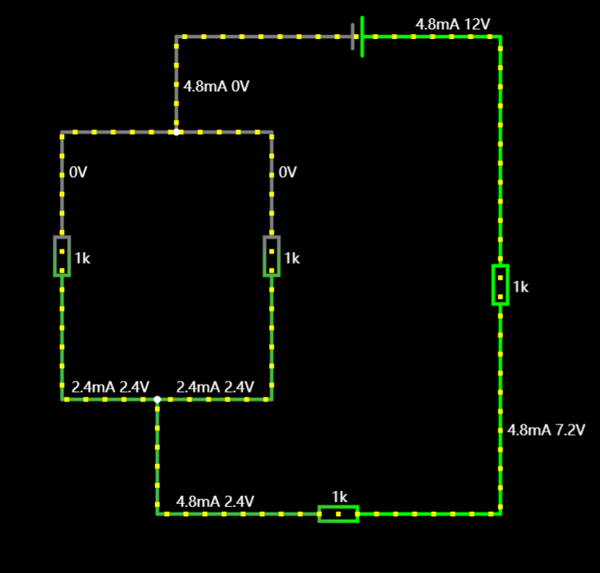

- 所有电阻承受相同的电压
- 电流会根据各支路电阻大小进行分配
- 电阻越大，通过的电流越小
- 电流分配符合基尔霍夫电流定律(KCL)
- 总电流 = 各支路电流之和

简单记忆：

- 串联：同电流，分压
- 并联：同电压，分流（限流）

这也是为什么在实际电路设计中：

- 需要降压时，常用串联电阻
- 需要限制电流时，常用并联电阻
- 保险丝等保护元件通常是串联的，用来切断过大电流
- LED等需要限流的元件通常配套串联电阻

## 电容器

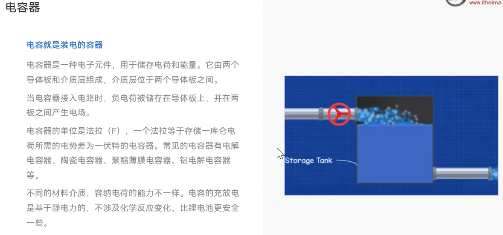

电容器（Capacitor）是一种储能元件，它的作用是**存储电能**。它的工作原理很像**水桶**，用来存储电荷（相当于水）。电容器的内部有两个金属板，板之间隔着一个电介质（可以是空气、陶瓷、塑料等），这些金属板像**电池的正负极**一样，可以储存电荷。

当电压作用在电容器的两端时，电容器的两块金属板会分别吸引正电荷和负电荷，类似于给水桶注水。一旦电容器储满电荷，它就“满了”，不能再储存更多的电荷，电路中的电流就会停止流动。

**电容器的特点**：

- **瞬时充电和放电**：电容器充电和放电的速度非常快，可以在很短的时间内完成。这使得它在电路中广泛用于滤波、去噪、瞬时储能等场合。
- **储存能量的方式**：电容器储存的是**电场能量**，当它充满电后，它就像一个小型的电池一样，能提供电能，但它和电池不同，因为它储存的能量不会像电池那样持续释放。

**电容器和电池的区别：**

- **储能方式不同**：
  - **电池**通过化学反应储存和释放电能，它能够提供持久的电能，适合长期供电。
  - **电容器**通过电场储存电能，它的储能过程和释放过程都非常快速，但它储存的电量有限，只能在短时间内释放电能。
- **充放电速度不同**：
  - 电容器的充电和放电速度非常快，它可以在毫秒级别完成充电和放电。
  - 电池的充放电速度较慢，它的放电持续时间较长，但充放电过程相对较慢。
- **应用场景不同**：
  - **电池**适用于需要长时间稳定电能的场合，如手机、电动车、遥控器等。
  - **电容器**适用于需要短时间内释放大量能量的场合，如相机闪光灯、滤波电路、电源稳压等。
- **能量释放方式不同**：
  - **电池**的电能释放是渐进的，持续输出电流。
  - **电容器**的电能释放是瞬时的，短时间内快速放电，能量消耗完后就不能继续提供电力，必须再次充电。

**闪光灯**：相机的闪光灯常常用电容器储存电能。当按下快门时，电容器放电，迅速释放电能，产生闪光。电容器会在充电过程中存储足够的电能，然后在需要时放电。

**电源滤波**：在一些电路中，电容器用来平滑电流波动。当电流不稳定时，电容器可以暂时储存电能，然后在需要时通过放电来补充电流，保持电路的稳定。

### 电容器充电过程

- **电池和电容器连接时**：你设想的是当电容器的正极与电池的负极连接时，电池的电势差（电压）会推动电子从电池的负极流向电容器的正极。在这个过程中，电池的负极会提供电子，这些电子会被电容器的正极吸收，电容器开始充电。
  - **充电的过程**：随着电容器不断吸收电子，它的电势差（电压）会逐渐升高，直到电容器的电压接近电池的电压。此时，电池的电压和电容器的电压相等，电池将无法继续推动电子进入电容器，因为两者电势差已经为零。

### 电池断开后的放电

- **电池断开时**：如果电池断开电路，但电容器两端依然闭合电路（例如，连接了电阻或负载），电容器会开始放电。
  - **放电的过程**：电容器开始释放它储存的电荷，从而向电路中提供电流，就像电池一样，虽然没有电池在供应电力，但电容器内部存储的能量仍然可以驱动电路中的电流流动，直到电容器放完电，电压降至零。

### **电容器作为电池的“替代”作用**

- 你可以将电容器看作是短时间内的电池替代品，但它有几个不同之处：
  - **储电量有限**：电容器储存的电能相对于电池来说非常有限，它只能提供一个短暂的电流。
  - **放电时间短**：电容器放电的过程非常迅速，通常持续的时间比电池要短很多。电池能提供长时间稳定的电能，而电容器只能提供短时间的电能。

### **电容器作为电池的一部**

在一些应用中，电容器被用来**辅助电池**，例如在电池放电时，电容器可以提供瞬时的电流，帮助电路在高峰负载下稳定电压（例如相机闪光灯中，电容器提供瞬时高电流来驱动闪光灯）。

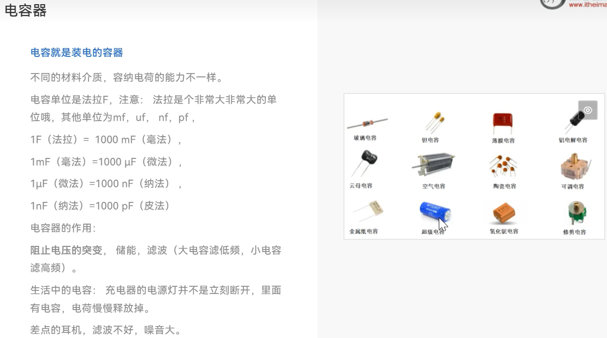

**突然的电压抖动经过电容的充电和放电，变得平滑？ 但是在串联电路中电容充满电就会把电路堵死啊？**

关于串联电路的问题： 实际上，在直流电路中，电容最终会充满电，不再有电流流动。但在交流电路或脉冲电路中，电容会不断地充电和放电，持续起到滤波作用。

电容滤波的原理： 电容确实可以抑制电压的突然变化。当电压快速上升或下降时，电容会通过充电或放电来"吸收"这些突变，从而使电压变得更加平缓。

交流电的周期性变化使电容始终处于充电和放电的动态过程中，不会像直流电那样最终"堵死"电路。

**在交流电中，电容有两种常见连接方式：**

1. 正弦交流电：电容可以直接并联或串联
   - 频率确定时，电容按相位变化工作
   - 不需要考虑电流方向
2. 接线规则：
   - 非极化电容（如陶瓷电容）：任意方向
   - 电解电容：必须按极性接线
     - 不能靠近发热的器件，里面的电解液会挥发，影响性能。
   - 根据具体电路设计选择连接方式

## 电感/线圈/变压器

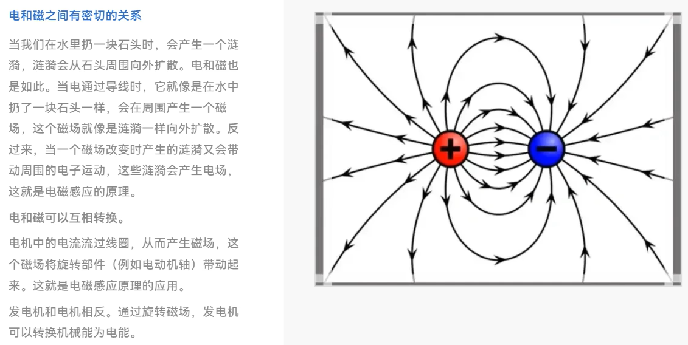

电机的基本原理就是**“电生磁”**，然后利用磁场的相互作用让部件转动。

具体来说：

1. **电流产生磁场**：当电流通过电机内部的线圈（绕组）时，会在周围形成磁场。
2. **磁场作用力**：电机内部通常有永久磁铁（或者另一个电磁铁），它和线圈的磁场会相互作用，产生推拉的力。
3. **转子转动**：这个力推动电机的**转子**（可转动部分）旋转起来。
4. **换向保持旋转**：为了让电机持续转动，直流电机会使用**换向器**（或者交流电机利用交流电本身的变化）来不断改变电流方向，使磁场持续推动转子。

换句话说，电机就是通过让电流**以特定方式流动**，来创造一个合适的磁场，让转子被磁力“拉着跑”，从而产生机械运动。

磁吸门禁（电磁门锁）的原理也是**“电生磁”**，但它不需要转动，而是利用磁力来锁住或释放门。

**通电产生磁场**：门禁系统的**电磁锁**里有一组线圈（电磁铁），当门禁控制器给它通电时，线圈会产生磁场，把门上的金属板**牢牢吸住**，让门保持关闭状态。

**断电解除磁力**：当门禁系统接收到开门信号（比如刷卡、密码输入、指纹识别等），就会切断电磁铁的电流，磁场消失，金属板不再被吸住，门就可以打开了。

**失电即开**：一旦断电，门会自动解锁，方便紧急情况下人员撤离（比如火灾时）。

**无机械磨损**：电磁锁没有机械锁舌，不会因为长时间使用而磨损卡住。

**高强度磁力**：一般电磁锁的磁吸力可达上百公斤，能牢牢锁住门。

## 电感器

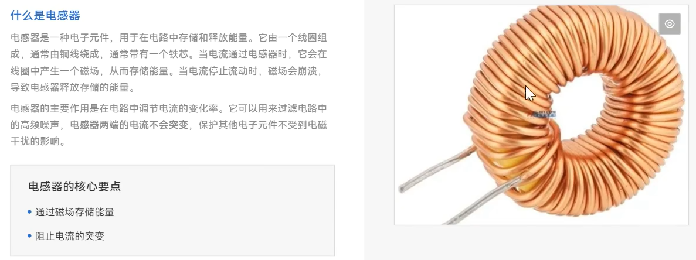

电容和电感在电路中的作用很相似，但对电压和电流的影响刚好相反。

- **电容**（Capacitor）主要防止**电压突变**，因为它可以存储电荷，电压不会立刻发生剧烈变化。
- **电感**（Inductor）主要防止**电流突变**，因为它通过磁场存储能量，电流不会一下子改变。

### **为什么电感能防止电流突变？**

1. **电流通过电感时，它会产生磁场，并把能量存储在磁场中。**
2. **如果电流突然变化，电感会“反抗”这种变化，试图保持原来的电流状态。**
3. **这种“反抗”表现为电感在电流变化时会产生反向电动势（自感电压），阻止电流突变。**

**这也是为什么在模拟电路中，电容和电感经常被用来平稳信号、电源滤波、或者组成振荡电路！**

## 电容电感组成LRC振荡电路

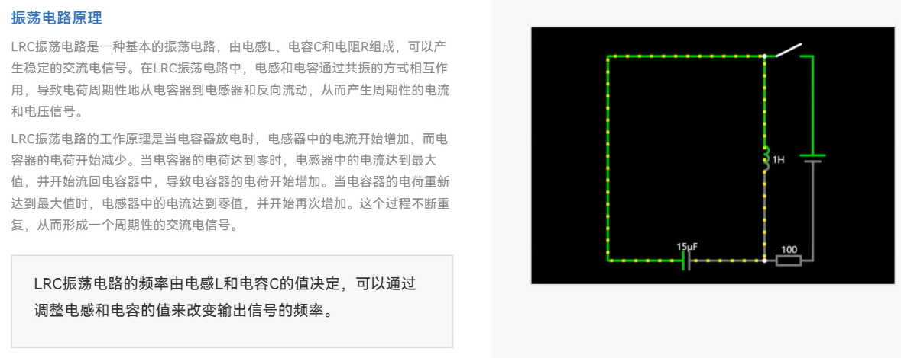

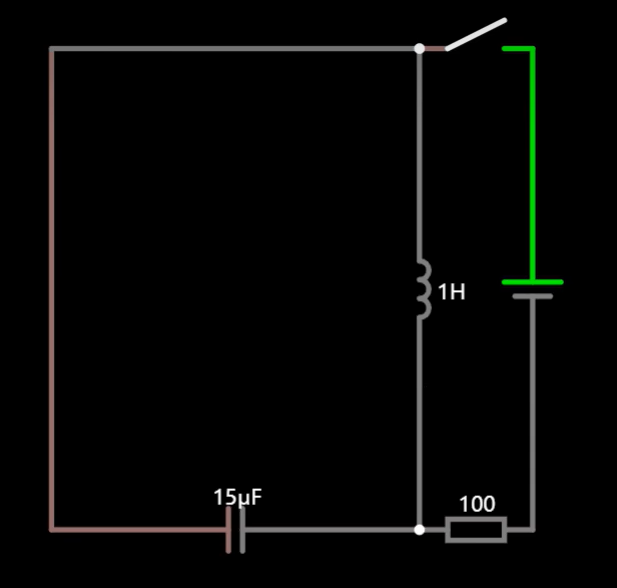

刚开始通电时：

- 确实如您所说，电感和电容构成并联支路
- 一部分电流经过电感，一部分给电容充电
- 电感支路电流缓慢增加（因电感阻碍电流突变）
- 电容支路电流开始大，然后逐渐减小

电容充满后：

- 电容充满电后就像一个开路
- 电路变成了电源-电感-电阻的串联电路
- 此时电流稳定在一个固定值

开关断开后：

- 这是最有趣的部分，也是您说得对 - 这确实是交流电的一个基本原理！
- 电感和电容之间的能量转换导致电流方向周期性改变：
  - 电容放电 → 给电感充能
  - 电感放能 → 给电容充电（反方向）
  - 如此往复...
- 这种振荡确实是交流电的基本原理
- 由于电阻的存在，振荡会逐渐衰减（阻尼振荡）

这个电路很好地展示了电感和电容的能量储存和转换特性，以及它们如何协同产生振荡。实际的交流发电机就是利用机械能来维持这种电磁振荡，防止它衰减下去。

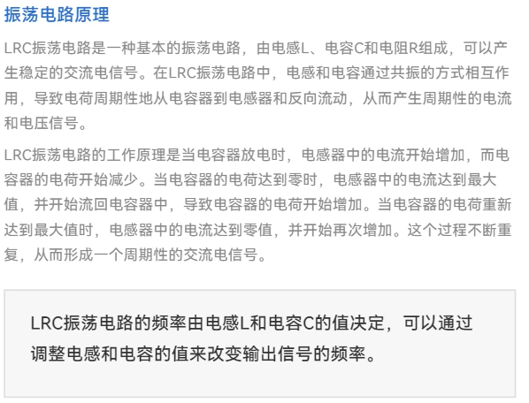

## 保险丝（熔断器）

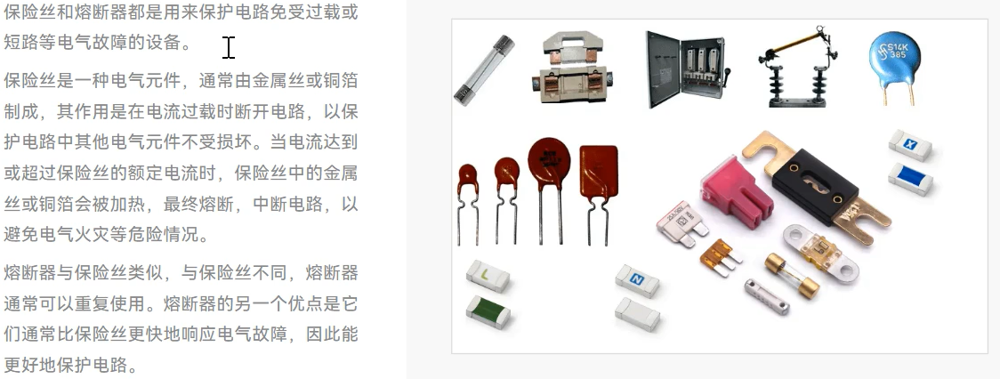

## 其他器件

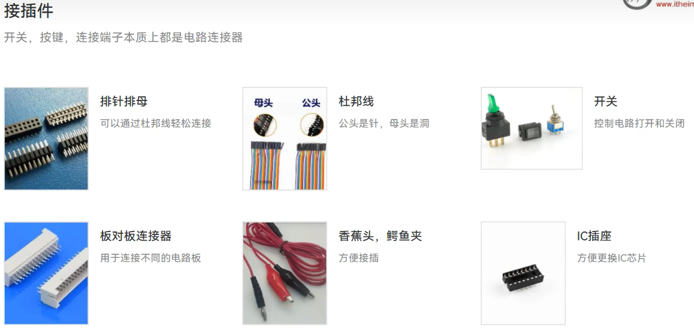

## 蜂鸣器

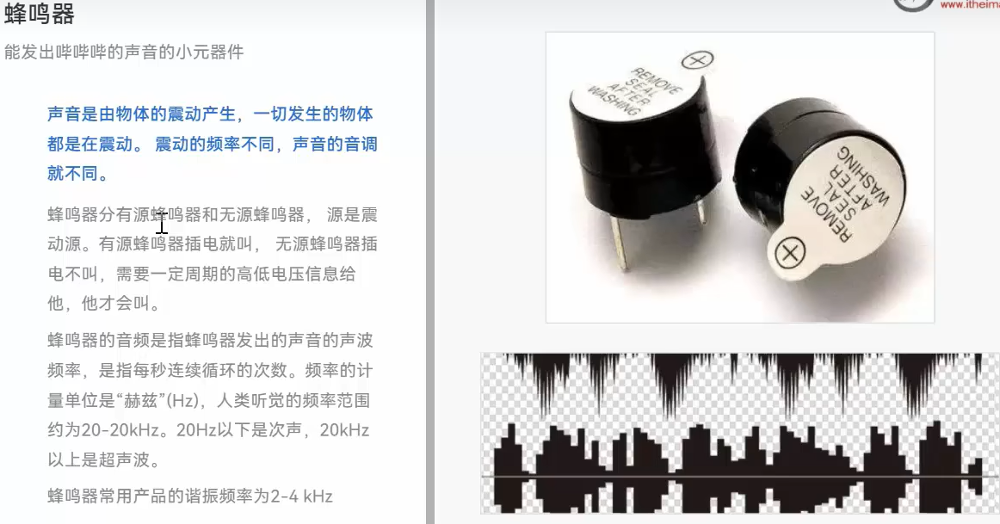

## 万用表

笔不用区分正负极，指数会显示正负从而知道有没有接反

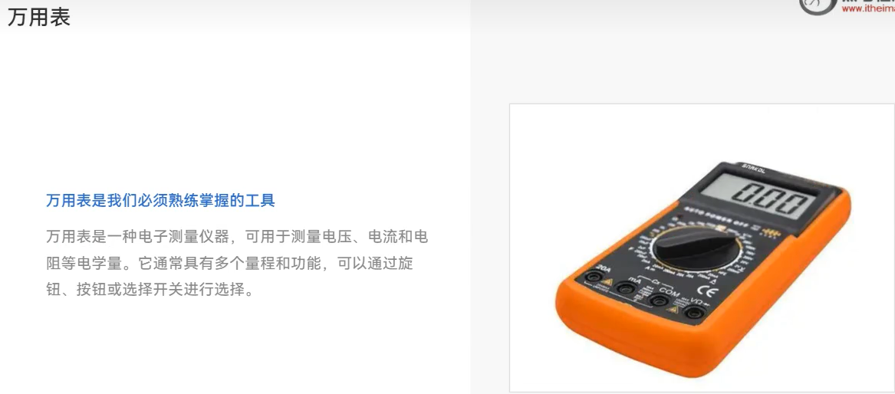

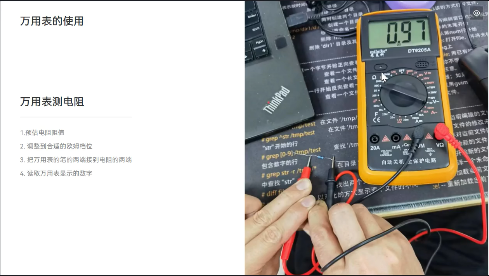

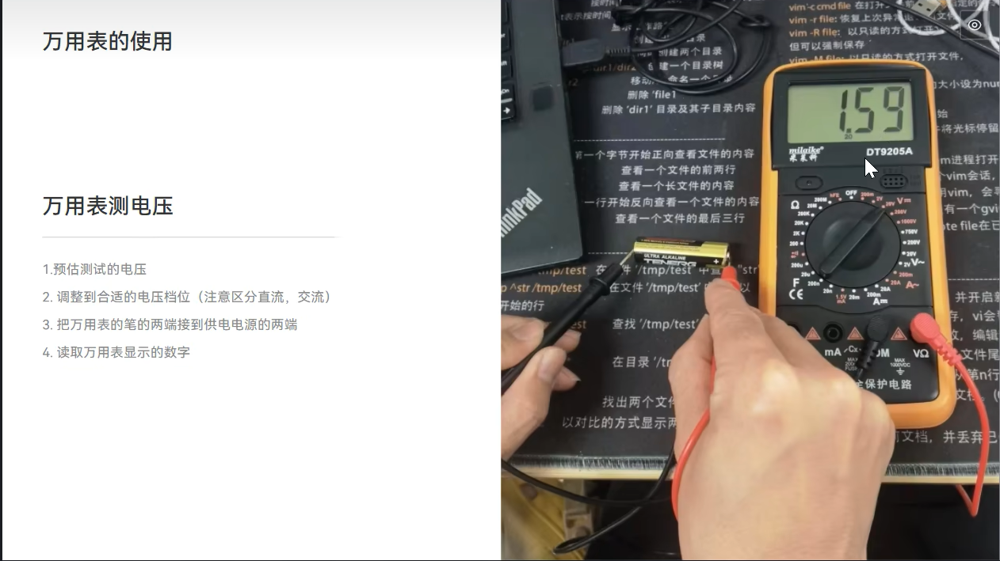

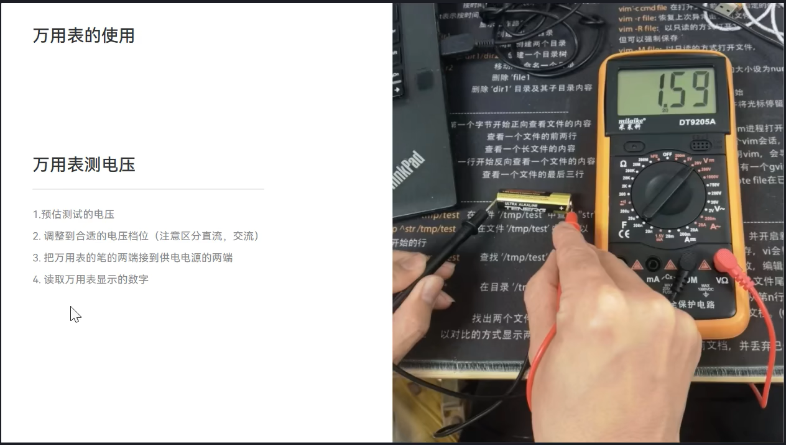

## 仿真电路软件

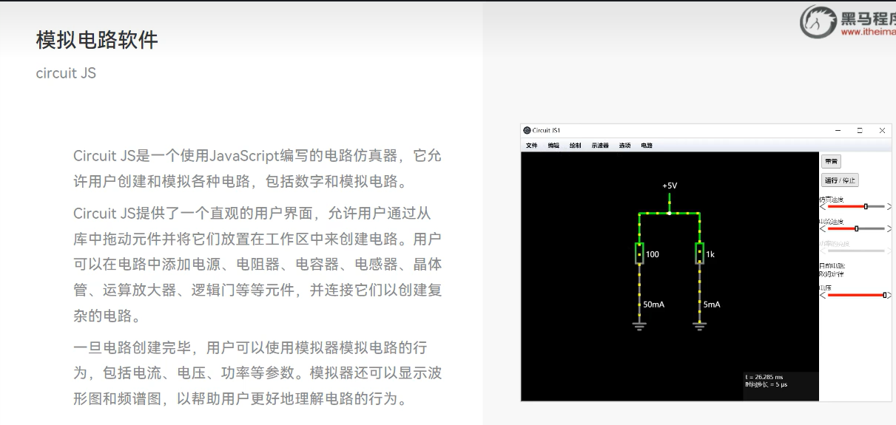

shift选中元器件

### 短路

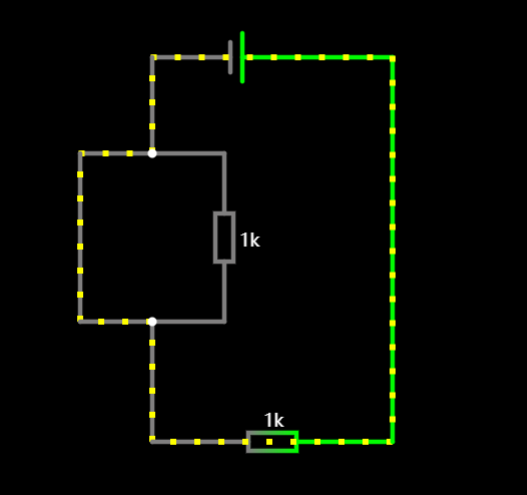

为什么电流"选择"不走有电阻的路？

- 电流总是倾向于走阻力最小的路径
- 就像水流会选择最容易流动的通道
- 如果有一条线路没有电阻（或电阻很小），而另一条有较大电阻
- **根据欧姆定律，在相同电压下，电阻越小电流越大**
- 所以绝大部分电流会走无电阻的路径

这就是短路：

- 短路就是电流绕过了原本设计的路径
- 找到了一条阻力极小的路径直接连接正负极
- **会产生很大的电流，可能导致元件损坏或起火**
- 这就是为什么需要保险丝等保护装置

为什么都加电阻就正常了？

- 当并联支路的电阻值相近时
- 电流会按照电阻大小的比例进行分配
- **每条支路都有一定的阻力，所以电流会合理分流**
- 这种情况下电路工作在设计的安全范围内

生活中的例子： 想象两条平行的路，一条是高速公路（无阻力），一条是乡间小路（有阻力）。如果这两条路都是免费的，大多数车会选择高速公路。但如果两条路都收费（都有电阻），车流就会根据各种因素合理分配了。

所以在电路设计中，为了避免短路，需要确保并联支路的电阻合理配置，不能出现明显的"捷径"。

### 可以演示的知识点

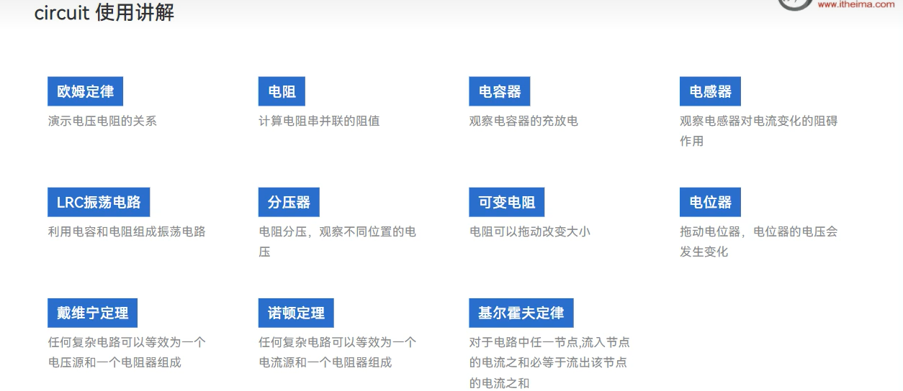

#### 电阻

1. **串联电阻**：每增加一个电阻，就像给电流增加一道关卡，电流通过的总量（流过整个电路的电流）会减少。就像一条狭窄的独木桥，桥越多，整体通行就越慢。
2. **并联电阻**：每个分支都会对电流产生阻碍，但**分支越多，相当于提供了更多的通道**，所以整体通过的电流总量增加了。就像增加多条桥，每条桥上都有人过河，最终**整体通过的人数变多**（相当于总电流变大）。
   1. **在并联电路中，每个分支上的电流大小取决于该分支电阻的大小**。
   2. 想象一条水管分成几条支路，每条支路的水管直径不同：
      - **细水管（大电阻）** → 水流（电流）小
      - **粗水管（小电阻）** → 水流（电流）大

换句话说，**串联是让“路”变长，走起来更慢；并联是让“路”变宽，能同时走更多人**。

**串联情况下**：电阻越多，总电阻越大，电流越小，每个电阻分到的电压也越小。

**并联情况下**：电阻越多，总电阻越小，总电流越大，但每个分支的电压不变。

#### 电容

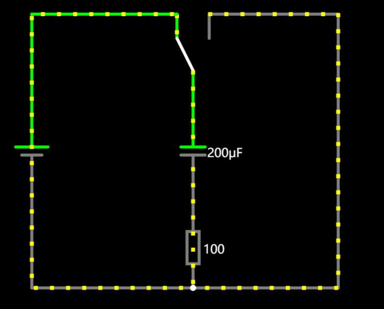

**放电时电流方向由什么决定？**

🔹 **电流方向取决于电势差，而不是直接看阻值大小**。

- **电容放电时**，电流的方向由 **电容两端的电压决定**，电流总是从电压高的一端流向电压低的一端。
- **如果电路两端阻值不同**，电流确实会偏向阻值小的一边（因为小阻值的分支更容易导电），但**电流的方向本质上仍由电压决定**，而不是直接由哪个电阻小决定。
- **传统方向看**

#### 电感

**电感的电流方向具有惯性，切换电路时，它会尽量保持原来的电流方向**。这是因为 **电感具有“自感”特性，会抵抗电流的变化**。

#### 分压

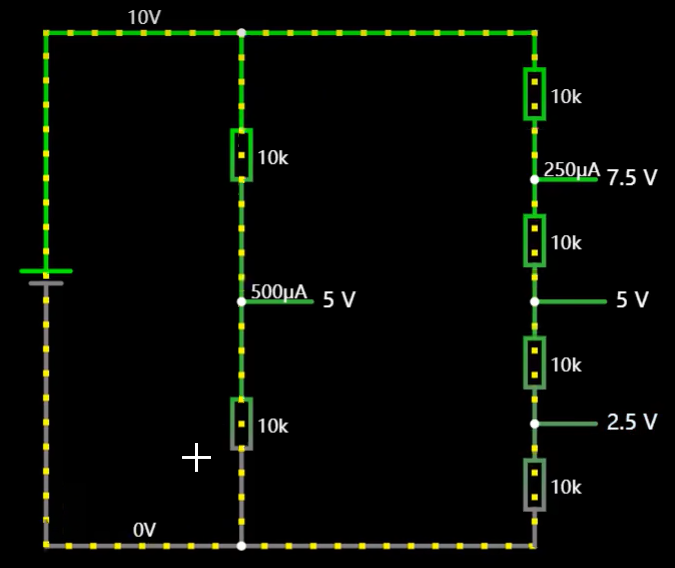

**分压电路在充电应用中非常广泛**，尤其是在**锂电池、超级电容、稳压电路等**场景下，通过电阻分压可以控制充电电压，使其保持在合适的范围内，以保护电池或电子元件。

#### 电位器分压器

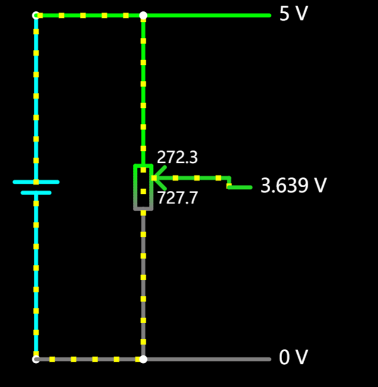

**电位器分压器** 本质上就是一个 **滑动变阻器**，通过**滑动触点改变电阻比例**，从而调整输出电压。在风扇、音量调节、灯光亮度控制等简单电路中经常可以看到。

## 电池的单位

电池的**毫安时（mAh）**和**毫瓦时（mWh）**都是用来描述电池容量的单位，不过它们的含义有点不同。

1. **毫安时（mAh）**：这个单位描述的是电池能够持续提供的电流量。它表示的是电池在一定时间内能提供多少电流。例如，一个电池的容量是1000mAh，这意味着电池可以以1毫安的电流持续工作1000小时，或者以100毫安的电流工作10小时，依此类推。它主要用于描述电池能够持续供电的时长。
2. **毫瓦时（mWh）**：这个单位描述的是电池的能量总量，也就是电池能够储存的能量有多少。它考虑了电池电压和电流的关系。例如，如果电池的电压是3V，电池的容量是1000mAh，那么它的能量就是3V × 1000mAh = 3000mWh（也就是3Wh）。毫瓦时是更直接反映电池能量大小的单位。

哪个电池更好？

并不能简单地用毫安时或毫瓦时来判断哪个电池更好。其实它们是互相关联的，分别从不同角度描述电池的性能：

- **毫安时（mAh）**可以告诉你电池能供电多长时间，适用于需要考虑使用时间的情况。
- **毫瓦时（mWh）**则可以告诉你电池能储存多少能量，适用于需要比较电池能量密度和电池效率的情况。

如果你比较两块电池，它们的电压相同，容量大的（mAh多）电池通常能使用更长时间；如果电压不同，就需要看它们的毫瓦时（mWh）来确定哪个电池更有能量。

所以，**更好的电池**是取决于你关注的是电池的**使用时间（mAh）还是能量储存（mWh）**。

3400mAh和12580mWh在3.7V电压下是等价的。这意味着在3.7的电压下，它们的能量是相同的。所以，这两块电池的储能一样。只是使用了不同的单位描述。

## 开关电路

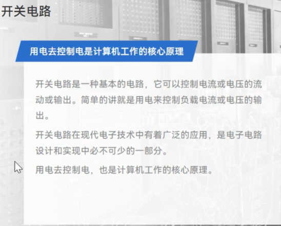

**开关电路**是指利用开关来控制电流的通断，从而控制电器的开关。想象一下，这是一个水管系统，开关就像水龙头一样，当水龙头开了，水流（电流）就能通过；当水龙头关了，水流（电流）就停止流动。

**继电器**是一个特殊的开关，它可以用小电流控制大电流的流动。继电器的工作原理是通过电磁力来吸引或释放开关，从而控制大电流电路的开启与关闭。它就像是一个“自动化的开关”，可以用较低的电压和电流去控制较高电压和电流的电路。

**开关电路**：你家里的灯泡通过开关来控制。当你按下开关，电流就能流动，灯亮；关掉开关，电流就停止流动，灯灭。

**继电器**：想象你有一个大功率的电器（比如电热水器），你不想用手直接去操作它，怕电压太高不安全。这时候，继电器就能发挥作用。你可以用一个低电压的控制信号（比如一个小电池或按钮）去控制继电器，继电器再用它的小电流去控制电热水器的大电流。这样，继电器就能在你按下按钮时，自动连接或断开电热水器的电源。

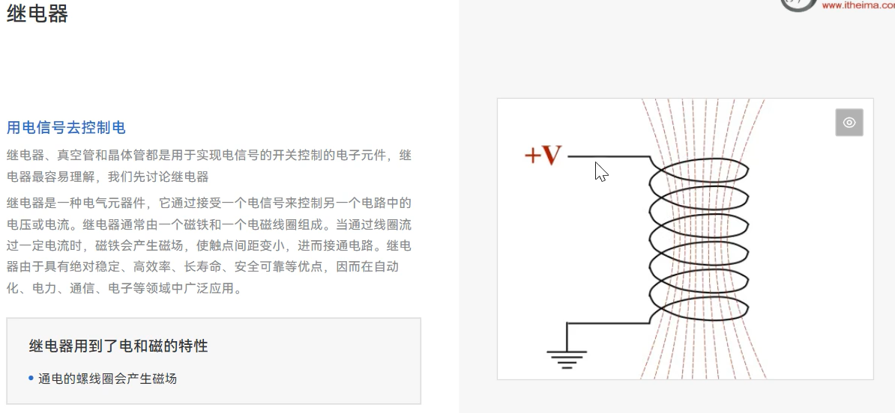

### 继电器

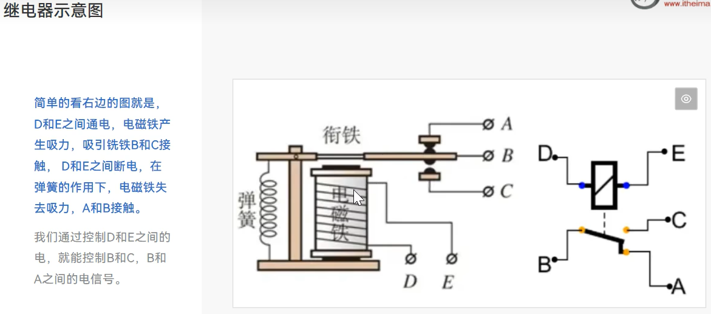

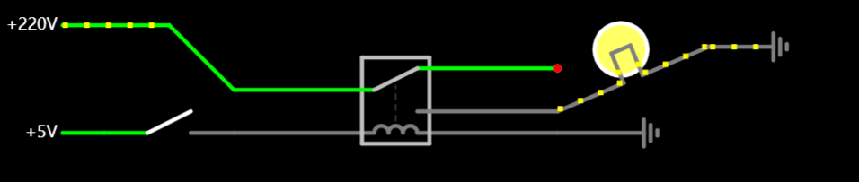

### 二极管

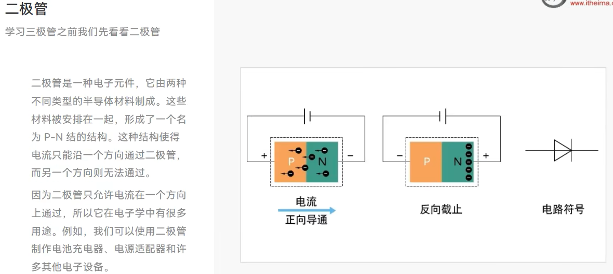

P有空洞，N中有多余的电子，负极的电子挤压导致整体电子往正极跑。传统方向就是电流从正极到负极，正向导通。 

### 三极管

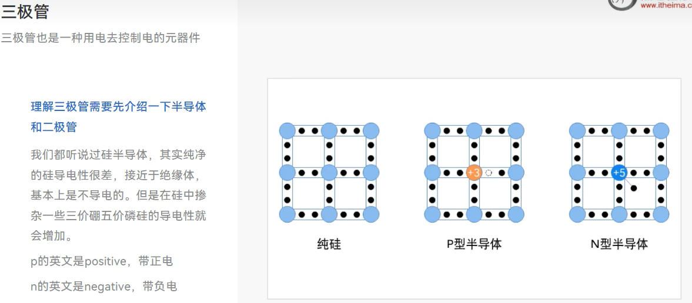

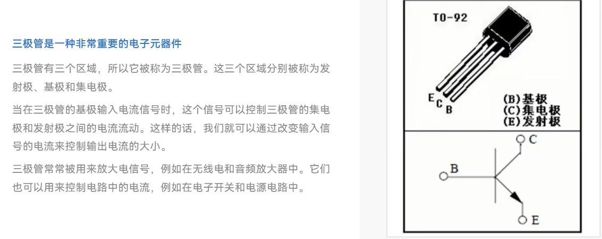

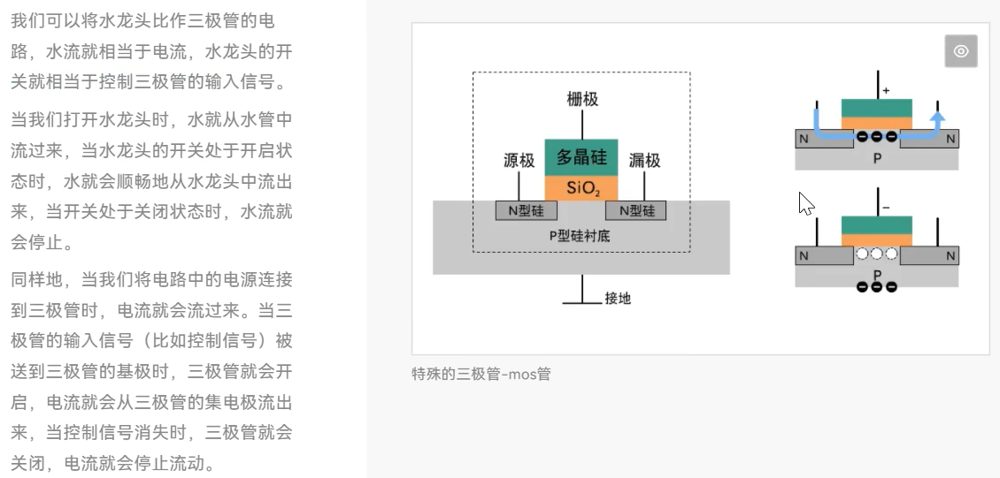

当栅极给一个正电，那么就会吸引电子，两个N型材料又都是电子，就可以电子挤压电子形成一条通路电流。
       当栅极给一个负电，就会排斥电子，中间缺个口子，没有办法进行电子间的运动，就不会形成电流。

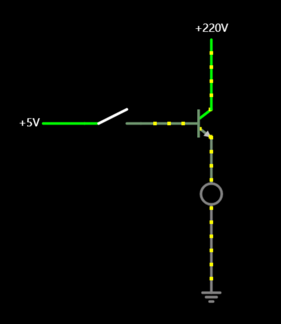

跟继电器效果差不多，知道谁是控制端即可，**控制端的驱动电压**也要注意。还有器件的最大工作电压和电流

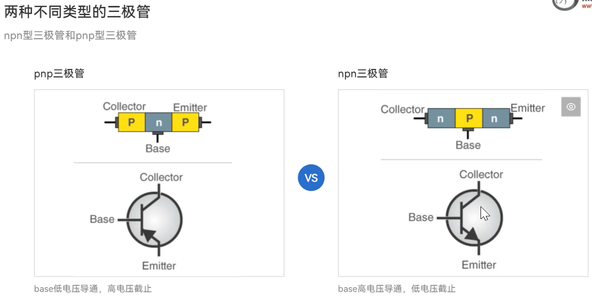

**看箭头，想进base的话，就低电压让他进。想出base的话，用高电压送走。**

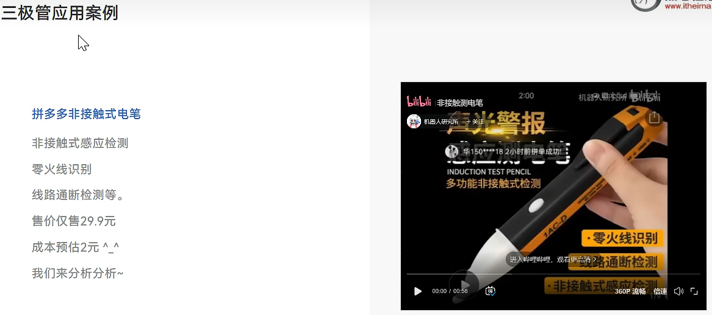

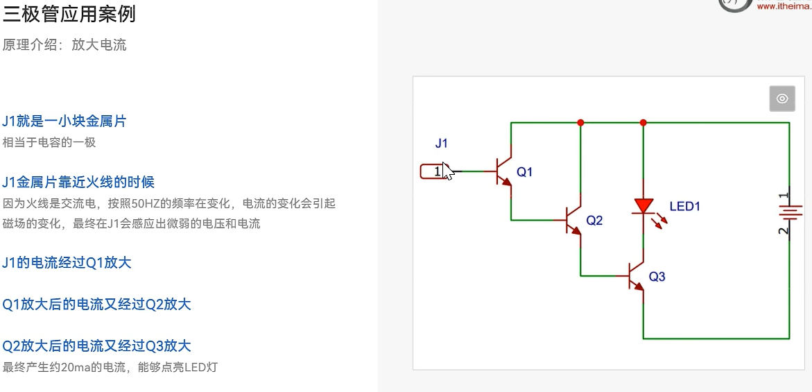

**单级放大：** 三极管利用很小的基极电流控制较大的集电极电流，实现以小电流撬动大电流的作用。

**级联放大：** 每一级的放大效果是乘法性的，即前一级小信号经过放大后作为下一阶段的输入，整体增益为各级增益的乘积，而不是简单的电流累加。

### mos管和三极管

**MOS管（场效应管）：**

- **电压控制：** 栅极通过施加电压来调控沟道导通状态。
- **低耗电：** 由于栅极与沟道之间主要是电容耦合，输入端的漏电流极小，因此基本不消耗电流。
- **N沟MOS管：** 栅极电压越高（远高于阈值），导通效果越好，输出端电流增大。
- **P沟MOS管：** 栅极电压越低（远低于源极电压并超过阈值差），导通效果越好，输出端电流也会更大。

注意，虽然在整个闭合电路中源极和漏极之间的电流在流动，但栅极作为控制端，本身并不消耗电流（除了短暂的充放电过程），这也是MOS管低耗电的关键所在。

**三极管（双极型晶体管）：**

- **电流控制：** 通过基极电流来控制集电极电流，达到放大作用。

- **控制电流参与输出：** 基极输入的小电流会与集电极中的较大电流汇合，形成最终的输出电流。

- 以NPN管为例：当基极电压比发射极电压高约0.7V时（硅管），基极-发射极结正向偏置，器件进入放大状态；

  PNP管则相反，需要基极电压比发射极低一定值才能导通。

- **输入端（基极）：** 小电流进入，起到控制作用。

  **输出端（集电极-发射极）：** 大电流流动，受到基极电流控制。

  由于基极电流与集电极电流之间存在放大作用，即使基极只提供微小电流，也能控制较大电流的输出。

## ne555

NE555 是一种经典的 **定时器（Timer）IC**，在模拟电路中主要充当 **振荡器、脉冲发生器、定时器** 等角色。它用途广泛，常用于 **脉冲信号控制、电路定时、频率产生** 等应用。

### **NE555的主要工作模式**

1. **单稳态（One-shot Mode）**
   - 充当 **单次脉冲发生器**，按下触发按钮后输出一个固定时间的高电平脉冲，之后自动回到低电平。
   - **用途**：按钮去抖、信号延迟、脉冲发生器。
2. **多谐振荡（Astable Mode）**
   - 充当 **方波振荡器**，可以自动产生周期性方波信号。
   - **用途**：时钟信号、脉冲调制、LED 闪烁电路、声音报警器。
3. **施密特触发器（Bistable Mode）**
   - 充当 **开关电路**，类似于**数字电路中的D触发器**，可以在两个稳定状态之间切换。
   - **用途**：开关控制、记忆功能、数字信号转换。

### **应用举例**

- **LED 闪烁**（多谐振荡模式）
- **蜂鸣器报警**（多谐振荡模式）
- **按键去抖**（单稳态模式）
- **PWM 信号产生**（多谐振荡模式）
- **电机转速控制**（PWM 控制）

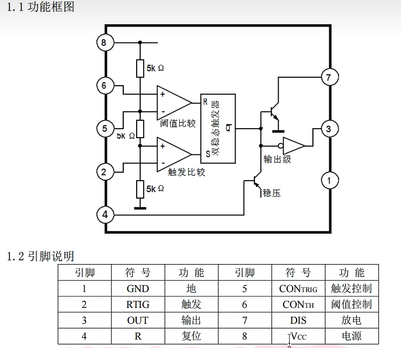

### 运放

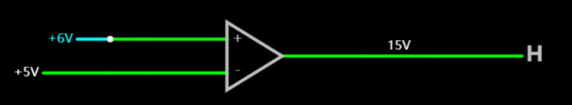

如果正向大于负向的话，比较器输出设定的最大输出值。否则输出设定最小输出值。那么正电压会在逻辑电路中为高电平，负电压在逻辑电路中为低电平。

### 反向门

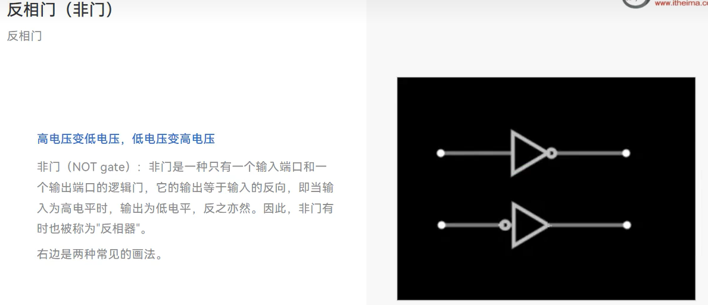

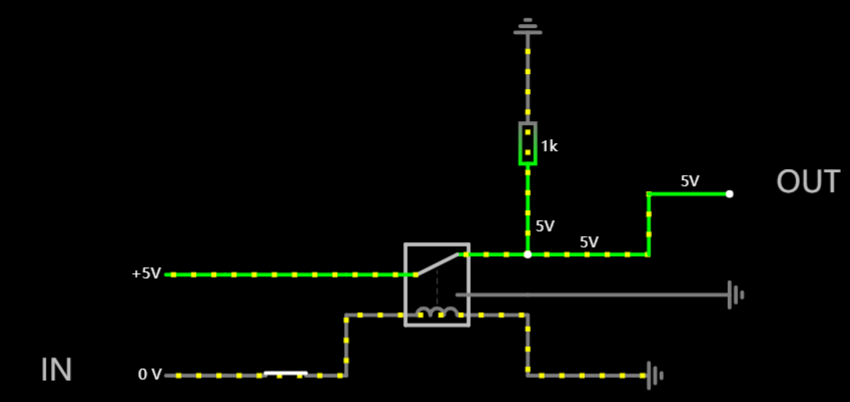

### 或非门

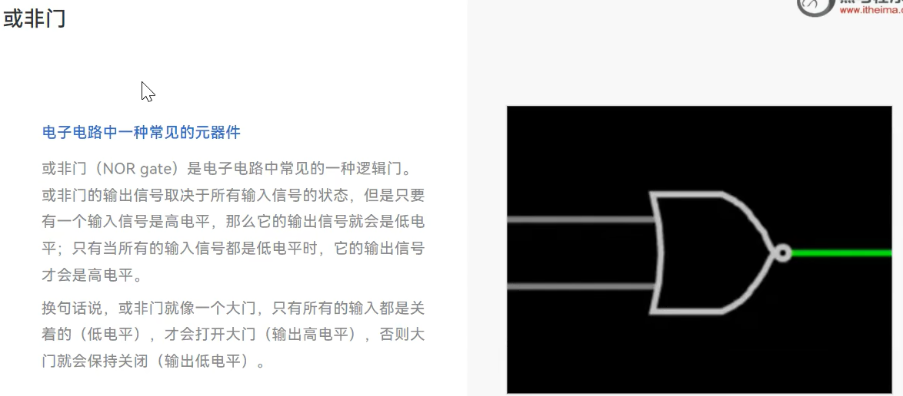

### 双稳态触发器

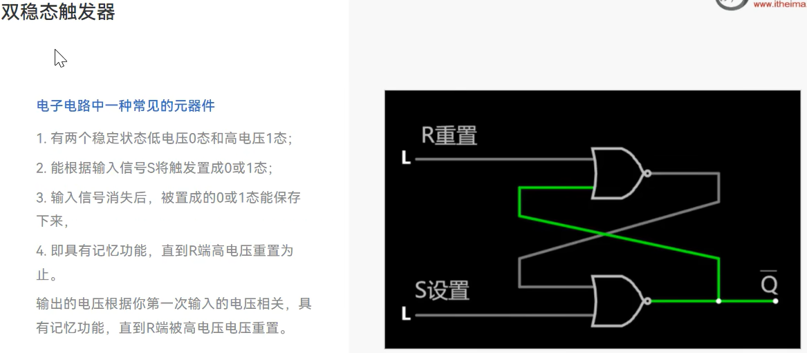

 这个电路是一个 **RS 触发器（双稳态触发器）**，由两个 **NOR 门** 交叉反馈组成。它的作用是存储一个 **1 位二进制状态**，并且可以通过 **S（Set 设定）** 和 **R（Reset 复位）** 控制输出状态。

**初始都是低电平状态，输出为高电平。当S输入高电平时，输出会变成低电平，且无法再修改，直到R为高电平，S为低电平时才可以恢复输出端的高电平。**

### 仿真

3号输出端

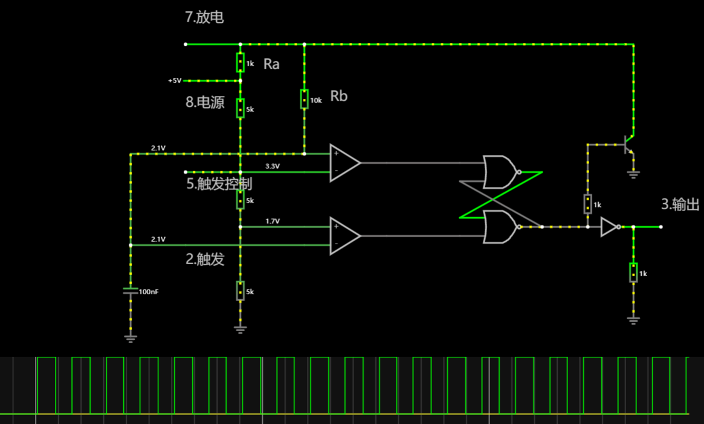

### 电子琴

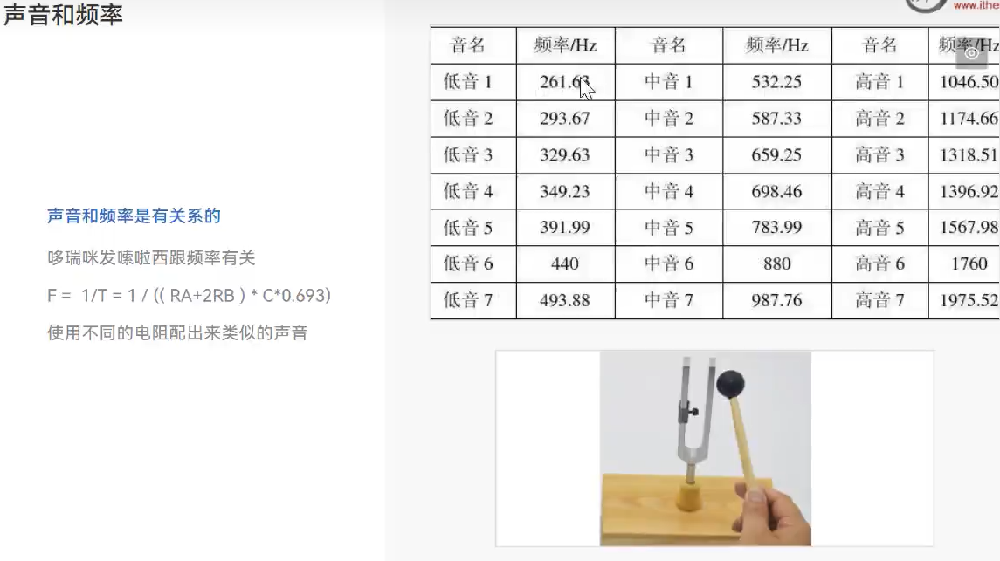

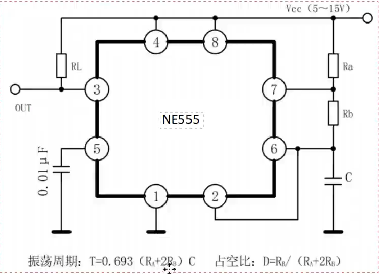

应用的话，可以忽略内部细节，把电路按照手册接好，选择对应的电阻即可。

## PCB

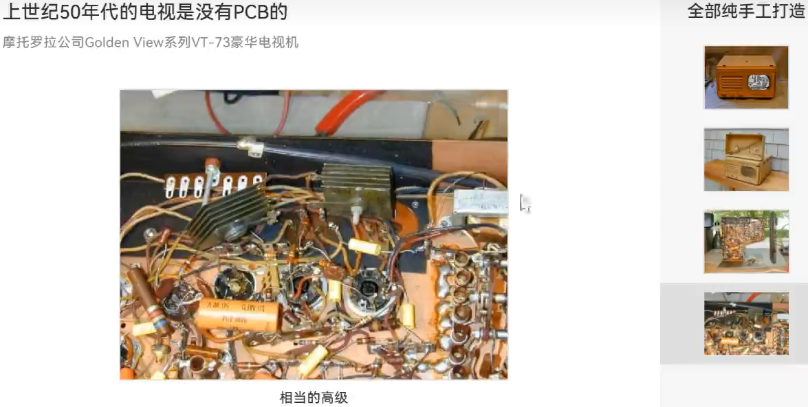

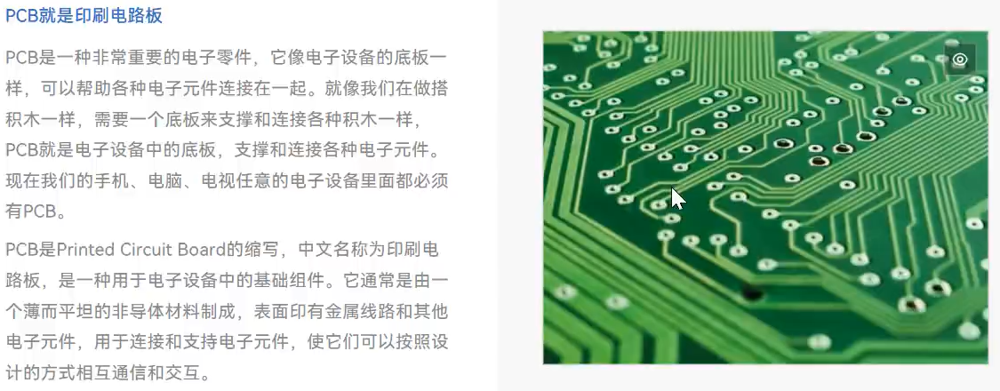

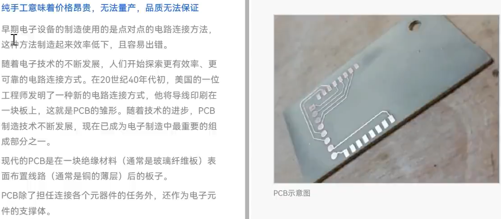

## EDA

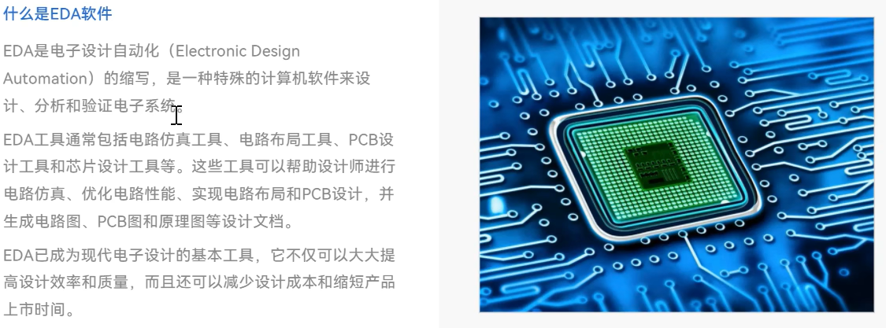

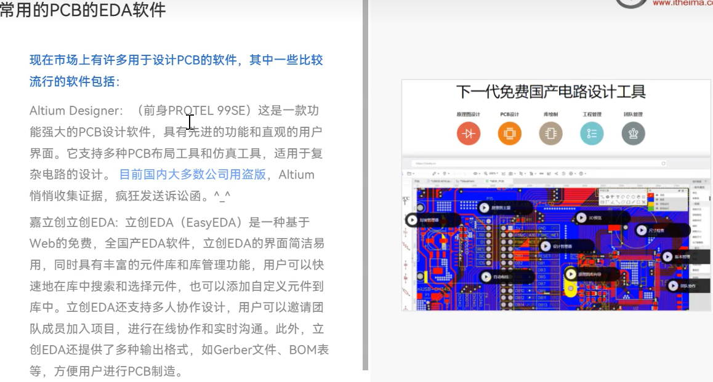

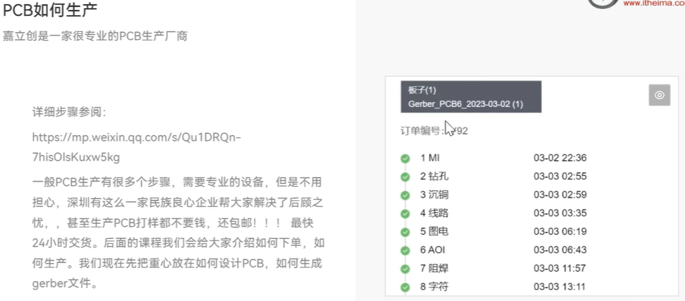

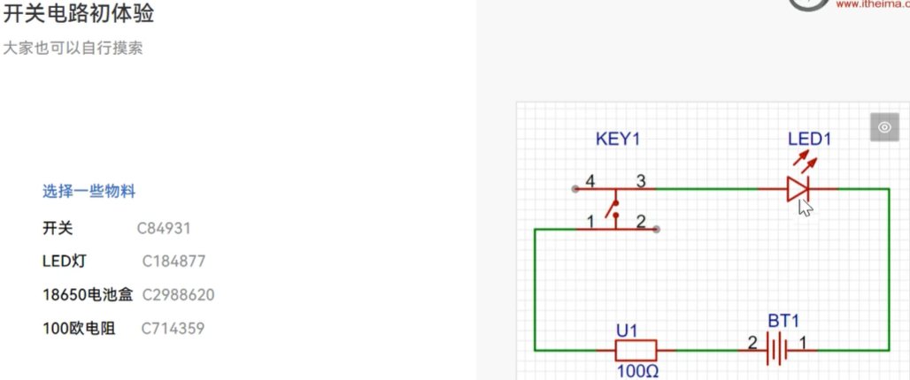