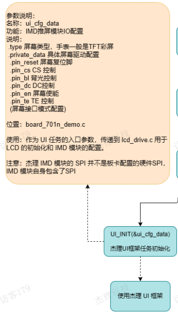

# UI框架的启动过程

首先是从`apps\watch\common\init.c`中`main`函数开始启动。

```c
int main()
{
#if defined(CONFIG_CPU_BR23)
    clock_set_sfc_max_freq(104 * 1000000, 104 * 1000000);
    clock_reset_lsb_max_freq(80 * 1000000);
#elif defined(CONFIG_CPU_BR28)
    clock_set_sfc_max_freq(104 * 1000000, 104 * 1000000);
#endif
    wdt_close();

    os_init();

    setup_arch();

    board_early_init();

    task_create(app_task_handler, NULL, "app_core");

    os_start();

    local_irq_enable();

    while (1) {
        asm("idle");
    }

    return 0;
}
```

1. **时钟配置**

   1. 根据芯片型号（`CONFIG_CPU_BR23` 或 `CONFIG_CPU_BR28`），设置系统时钟的最大频率。

   2. ```c
      clock_set_sfc_max_freq(104 * 1000000, 104 * 1000000);
      clock_reset_lsb_max_freq(80 * 1000000);
      ```

   3. 可以从SDK的cpu目录中得知芯片的具体型号。例如`cpu\br28`

   4. 这一步确保了芯片的时钟系统被正确初始化，为后续操作提供稳定的时钟源。

2. **关闭看门狗**

   1. 调用 `wdt_close()` 关闭硬件看门狗
   2. `wdt_close();`
   3. 防止在系统初始化过程中因看门狗超时导致系统复位。

3. **操作系统初始化**

   1. 调用 `os_init()` 初始化操作系统。
   2. `os_init();`此函数通常会初始化任务调度器、内存管理等操作系统核心组件。

4. **架构设置**

   - 调用 `setup_arch()` 设置硬件架构相关的初始化。
   - 这可能包括寄存器配置、中断控制器初始化等。

5. **板级早期初始化**

   - 调用 `board_early_init()` 执行板级早期初始化。
   - 此阶段通常用于初始化一些关键硬件模块，例如电源管理、时钟分频器等。

6. **创建应用任务**

   - 创建一个名为 `app_core` 的任务，任务入口为 `app_task_handler`。
   - `app_task_handler` 是应用程序的核心逻辑入口。

7. **启动操作系统**

   - 调用 `os_start()` 启动操作系统任务调度。
   - 前面已经创建任务了。
   - 操作系统开始调度任务，进入多任务运行状态。
   - **这里跟FreeRTOS区分一下，后者开启任务调度器之后，后面的代码不会执行了。**

8. **使能本地中断**

   1. 调用 `local_irq_enable()` 使能本地中断

9. **进入空闲循环**

   - 在主函数中进入一个无限循环，调用汇编指令 `idle` 让 CPU 进入低功耗模式。

## **`app_task_handler`**核心任务

```c
static void app_task_handler(void *p)
{
    app_init();
    app_main();
}
```

### app_init()

#### **执行初始化调用链**

- 调用多个初始化函数，按优先级顺序执行：
  - `do_early_initcall()`：早期初始化。
  - `do_platform_initcall()`：平台相关初始化。
  - `board_init()`：板级初始化。
  - `do_initcall()`：通用初始化。
  - `do_module_initcall()`：模块初始化。
  - `do_late_initcall()`：后期初始化。
- 这些函数通过调用 `__do_initcall()` 实现，具体实现细节可能在其他文件中定义。

#### **音频编解码初始化**

- 调用 `audio_enc_init()` 和 `audio_dec_init()` 初始化音频编码和解码功能。

#### **固件更新处理**

- 检查是否有固件更新任务需要处理：

- ```c
  if (!UPDATE_SUPPORT_DEV_IS_NULL()) {
      update = update_result_deal();
  }
  ```

#### **开机音效控制**

- 设置是否播放开机音效：

- ```c
  app_var.play_poweron_tone = 1;
  ```

#### **电源键检测**

- 如果配置了电源键检测 (`TCFG_POWER_ON_NEED_KEY`)，则调用 `check_power_on_key()` 检测电源按键状态。
- **不太明白这个功能的作用，有可能抬起开机呢？然后检查电源按键的状态看用户是否有关机或者依赖电源键实现的功能？**
- **或者说就是电源键开机的，开机之后长按可能有某种功能？**

#### **充电唤醒处理**

检查是否由充电唤醒触发开机，并根据充电状态决定是否进入软关机：

```c
if (is_ldo5v_wakeup()) {
    if (get_charge_online_flag()) {
        // 充电插入
    } else {
        power_set_soft_poweroff();
    }
}
```

#### **产品测试模式**

- 如果启用了产品测试模式 (`PRODUCT_TEST_ENABLE`)，则调用 `product_test_open()` 打开测试模式。

#### app_init()中的board_init()

函数实现的具体位置在`apps\watch\board\br28\board_701n_demo\board_701n_demo.c`中，`board_devices_init();`对杰理UI框架进行了初始化。

```c
static void board_devices_init(void)
{
#if TCFG_PWMLED_ENABLE
    /* pwm_led_init(&pwm_led_data); */
    ui_pwm_led_init(&pwm_led_data);
#endif

#if (TCFG_IOKEY_ENABLE || TCFG_ADKEY_ENABLE || TCFG_IRKEY_ENABLE || TCFG_RDEC_KEY_ENABLE ||  TCFG_CTMU_TOUCH_KEY_ENABLE)
	key_driver_init();
#endif

#if TCFG_UART_KEY_ENABLE
	extern int uart_key_init(void);
	uart_key_init();
#endif /* #if TCFG_UART_KEY_ENABLE */

#if (TCFG_HR_SENSOR_ENABLE||TCFG_SPO2_SENSOR_ENABLE)
    hr_sensor_init(&hrSensor_data);
#endif

#if TCFG_GSENSOR_ENABLE
    gravity_sensor_init((void*)&gSensor_data);
#endif      //end if CONFIG_GSENSOR_ENABLE

#if TCFG_IMUSENSOR_ENABLE
    imu_sensor_init(imu_sensor_data,sizeof(imu_sensor_data));
#endif      //end if

#if TCFG_UI_ENABLE
#if IMB_DEMO_ENABLE
	extern int imb_demo(void *arg);
	imb_demo(&ui_cfg_data);
#elif JPEG_DEMO_ENABLE
	extern int jpeg_demo(void *arg);
	jpeg_demo(&ui_cfg_data);
#else
    UI_INIT(&ui_cfg_data);
#endif
#endif /* #if TCFG_UI_ENABLE */

#if  TCFG_APP_FM_EMITTER_EN
 	fm_emitter_manage_init(930);
#endif

#if TCFG_CHARGESTORE_ENABLE || TCFG_TEST_BOX_ENABLE || TCFG_ANC_BOX_ENABLE
    chargestore_api_init(&chargestore_data);
#endif
}
```

UI 的初始化逻辑主要集中在以下代码段中：

```c
#if TCFG_UI_ENABLE
#if IMB_DEMO_ENABLE
    extern int imb_demo(void *arg);
    imb_demo(&ui_cfg_data);
#elif JPEG_DEMO_ENABLE
    extern int jpeg_demo(void *arg);
    jpeg_demo(&ui_cfg_data);
#else
    UI_INIT(&ui_cfg_data);
#endif
#endif /* #if TCFG_UI_ENABLE */
```

1. **条件编译判断**：

   - 首先通过 `#if TCFG_UI_ENABLE` 判断是否启用了 UI 功能。如果未启用，则跳过 UI 初始化部分。

2. **IMB 演示模式**：

   - 如果定义了 `IMB_DEMO_ENABLE`，则调用 `imb_demo` 函数进行初始化。
   - `imb_demo` 函数接收一个参数 `ui_cfg_data`，该参数包含了 LCD 屏幕的配置信息。

3. **JPEG 演示模式**：

   - 如果未定义 `IMB_DEMO_ENABLE` 但定义了 `JPEG_DEMO_ENABLE`，则调用 `jpeg_demo` 函数进行初始化。
   - 同样，`jpeg_demo` 函数也接收 `ui_cfg_data` 作为参数。

4. **普通 UI 初始化**：

   - 如果既未启用 `IMB_DEMO_ENABLE` 也未启用 `JPEG_DEMO_ENABLE`，则调用 `UI_INIT` 函数进行普通 UI 初始化。
   - `UI_INIT` 函数同样使用 `ui_cfg_data` 作为参数。

5. **UI 配置数据 (`ui_cfg_data`)**：

   - `ui_cfg_data` 是一个结构体变量，类型为 `struct ui_devices_cfg`，其定义如下：

   - ```c
     const struct ui_devices_cfg ui_cfg_data = {
         .type = TFT_LCD,
         .private_data = (void *)&lcd_spi_data,
     };
     ```

   - `.type` 表示屏幕类型，这里设置为 `TFT_LCD`。

   - `.private_data` 指向具体的 LCD 配置数据 `lcd_spi_data`。

6. **LCD 配置数据 (`lcd_spi_data`)**：

   - `lcd_spi_data` 是一个结构体变量，类型为 `struct lcd_spi_platform_data`，其内容根据不同的屏幕驱动器（如 SH8601A、ICNA3310B、SH8501A 等）进行配置。
   - 包含了屏幕的复位引脚、CS 引脚、背光控制引脚、DC 引脚、TE 引脚等硬件相关信息。



**这只是屏幕的初始化逻辑啊？！！！**

### app_main()

- 最后调用 `app_main()` 启动主应用逻辑。

`app_main( )`函数：任务主函数`app_main`则在`app_mian.c`中进行处理，其中比较重要的是对开机初始模式进行设置，并循环根据`app_task_loop( )`获取并设置的最新的模式任务。

`app_main` 是应用程序的核心逻辑入口，负责管理应用程序的任务调度和主循环。

**前面创建的核心任务其实是执行一次的，任务包含`app_init(),app_main()`,执行到app_mian（）中时，就不会出去了？**

核心任务 `app_task_handler` 中执行的 `app_init()` 和 `app_main()` 的确是按顺序依次调用的，但一旦进入 `app_main()`，程序将不会退出该函数，而是进入一个无限循环。

**`app_main()` 的执行**

- 完成 `app_init()` 后，紧接着调用 `app_main()`。
- `app_main()` 是应用程序的核心逻辑入口，负责管理任务调度和主循环。

#### **`app_main()` 的内部逻辑**

#### **初始化操作**

- 在`app_main()`中，首先完成一些初始化操作，例如：
  - 设置任务堆栈统计定时器。
  - 检查是否处于充电状态，并设置初始任务 (`app_curr_task`)。
    - `app_curr_task = APP_IDLE_TASK;`
  - 初始化 UI 管理器并更新状态。
  - 启动用户文件更新功能。
- 在`app_main()`中还有其他逻辑可以修改app_curr_task 的值
  - `app_curr_task = APP_SMARTBOX_ACTION_TASK;`
  - `app_curr_task = APP_POWERON_TASK;`

#### **进入主循环**

- 最后，调用 `app_task_loop()` 进入主循环：

- ```c
  app_task_loop();
  ```

- `app_task_loop()` 的实现是一个无限循环：

- ```c
  void app_task_loop()
  {
      while (1) {
          switch (app_curr_task) {
              case APP_POWERON_TASK:
                  app_poweron_task();
                  break;
              case APP_POWEROFF_TASK:
                  app_poweroff_task();
                  break;
              // 其他任务处理...
          }
          app_task_clear_key_msg(); // 清理按键消息
          vm_check_all(0); // 检查整理虚拟存储器
      }
  }
  ```

- 在这个循环中：

  - 根据当前任务 (`app_curr_task`) 调用对应的任务处理函数（如 `app_poweron_task()`、`app_bt_task()` 等）。
  - 持续运行，直到设备关机或复位。

- **是否会退出 `app_main()`？**
  - **不会退出**：`app_main()` 中的 `app_task_loop()` 是一个无限循环，程序会一直运行在这个循环中，处理各种任务。
  - **核心任务的特点**：核心任务 `"app_core"` 是系统的主要任务，通常不会退出。它的生命周期与整个系统的运行周期一致。

这里调用了 `app_watch_ui_updata_task()`，函数名表明该任务与 UI 界面更新有关。

结合上下文推测，`app_watch_ui_updata_task()` 可能负责更新手表的 UI 界面内容（如时间、日期、电量、通知等）。

UI初始化在 `app_main()` 中已经完成：

```c
ui_manage_init();
ui_update_status(STATUS_POWERON);
```

- 这部分代码确保了 UI 管理器和初始状态的正确初始化。
- 后续的任务状态切换（如 `APP_WATCH_UPDATE_TASK`）则用于动态更新屏幕内容。

## 基于状态机轮询实现的并发任务机制

是的，`app_curr_task` 的状态切换确实可以看作是一种基于状态机的并发任务管理机制。以下是具体分析：

- **状态机的核心思想**：
  - 系统通过 `app_curr_task` 变量记录当前的任务状态。
  - 每次进入 `app_task_loop()` 的循环时，根据 `app_curr_task` 的值执行对应的任务处理函数。
  - 不同的任务状态（如 `APP_POWERON_TASK`、`APP_POWEROFF_TASK`、`APP_BT_TASK` 等）对应不同的功能模块。
- **并发任务的实现**：
  - 虽然 `app_task_loop()` 是一个单线程的无限循环，但通过状态机的方式，系统可以在不同任务之间快速切换。
  - 例如，当外部事件（如按键输入、充电状态变化、蓝牙连接等）触发时，可以通过修改 `app_curr_task` 的值来切换到对应的任务状态。
  - 这种方式模拟了多任务并发的效果，但实际上仍然是单线程运行。
- **快速修改 `app_curr_task` 的影响**：
  - 如果外部快速修改 `app_curr_task` 的值，系统会立即响应并切换到新的任务状态。
  - 例如，当用户按下某个按键时，可能触发 `app_curr_task` 从 `APP_IDLE_TASK` 切换到 `APP_WATCH_UPDATE_TASK`，从而更新 UI 界面。
  - 这种机制使得系统能够高效地处理多个任务，而无需真正实现多线程。

## 确定UI界面的显示与更新的实现逻辑位置

在 `smartbox_extra_flash_opt.c` 文件中，`app_watch_ui_updata_task()` 的实现进一步明确了其功能：

```c
void app_watch_ui_updata_task()
{
    int msg[32];

    rcsp_printf("\n\n\nwatch ui update task start\n\n\n\n");

    if (watch_get_update_status() == 2) {
        bt_direct_init();
        bt_ble_init();
    }

    smartbox_eflash_change_sys_clock(1);
    watch_ui_update_open();

    while (1) {
        app_task_get_msg(msg, ARRAY_SIZE(msg), 1);

        switch (msg[0]) {
        case APP_MSG_SYS_EVENT:
            if (watch_get_update_status() == 2) {
                // 可以相应ota升级的事件
                if (bt_update_event_handler((struct sys_event *)(msg + 1)) == false) {
                    app_default_event_deal((struct sys_event *)(&msg[1]));
                }
            } else {
                app_default_event_deal((struct sys_event *)(&msg[1]));
            }
            break;
        default:
            break;
        }

        if (app_task_exitting()) {
            rcsp_printf("\n\n\nwatch ui update task exit\n\n\n\n");
            smartbox_eflash_change_sys_clock(0);
            watch_ui_update_close();
            return;
        }
    }
}
```

- 该函数的核心逻辑包括：
  1. 初始化蓝牙模块（`bt_direct_init()` 和 `bt_ble_init()`）。
  2. 调整系统时钟（`smartbox_eflash_change_sys_clock(1)`）。
  3. 打开 UI 更新界面（`watch_ui_update_open()`）。
  4. 进入消息循环，处理系统事件（如 OTA 升级事件）。
  5. 当任务退出时，关闭 UI 更新界面（`watch_ui_update_close()`），并恢复系统时钟。

- **动态更新**：
  - 当任务状态切换到 `APP_WATCH_UPDATE_TASK` 时，`app_watch_ui_updata_task()` 负责动态更新 UI 界面内容。
  - 具体更新操作包括：
    - 表盘文件的插入、删除、设置等（如 `smartbox_extra_flash_opt_insert_stop()`、`samrtbox_extra_flash_opt_delete_end()`）。
    - OTA 升级事件的处理（如 `bt_update_event_handler()`）。
    - 界面状态的切换（如 `watch_ui_update_open()` 和 `watch_ui_update_close()`）。
- **并发任务机制**：
  - 通过状态机的方式，系统可以在不同任务之间快速切换。
  - 当外部事件（如按键输入、蓝牙连接、OTA 升级等）触发时，可以通过修改 `app_curr_task` 的值来切换到 `APP_WATCH_UPDATE_TASK`，从而更新 UI 界面。

- `watch_ui_update_open()`：打开 UI 更新界面。
- `watch_ui_update_close()`：关闭 UI 更新界面。
- `app_task_get_msg()`：获取系统消息，处理事件。

## 获取系统消息，处理事件

```c
while (1) {
        app_task_get_msg(msg, ARRAY_SIZE(msg), 1);

        switch (msg[0]) {
        case APP_MSG_SYS_EVENT:
            if (watch_get_update_status() == 2) {
                // 可以相应ota升级的事件
                if (bt_update_event_handler((struct sys_event *)(msg + 1)) == false) {
                    app_default_event_deal((struct sys_event *)(&msg[1]));
                }
            } else {
                app_default_event_deal((struct sys_event *)(&msg[1]));
            }
            break;
        default:
            break;
        }

        if (app_task_exitting()) {
            rcsp_printf("\n\n\nwatch ui update task exit\n\n\n\n");
            smartbox_eflash_change_sys_clock(0);
            watch_ui_update_close();
            return;
        }
    }
```

1. **UI 界面控件的表示**：

   - UI 界面中的控件在代码中通常以宏定义的 ID 编号表示。
   - 这些控件 ID 可以用于在程序中实现对控件的操作，例如设置属性、响应事件等。

2. **控件事件处理**：

   - 当 UI 界面中的控件产生消息事件（如按键消息、触摸消息、显示消息等），这些事件会被捕获并传递给相应的处理函数。
   - 在代码中，这些事件通常通过消息循环机制进行处理。

3. **消息获取**：

   1. ```c
      app_task_get_msg(msg, ARRAY_SIZE(msg), 1);
      ```

   2. `app_task_get_msg` 函数用于从消息队列中获取消息。

   3. `msg` 是一个数组，用于存储消息内容。

   4. `ARRAY_SIZE(msg)` 返回 `msg` 数组的大小。

   5. 第三个参数 `1` 表示阻塞等待消息，直到有消息到达。

4. **消息处理**：

   1. `msg[0]` 是消息的类型标识。
   2. `APP_MSG_SYS_EVENT` 表示系统事件。
   3. 如果 `watch_get_update_status()` 返回 `2`，表示当前处于 OTA 升级状态。
   4. `bt_update_event_handler` 函数用于处理蓝牙相关的 OTA 升级事件。
   5. 如果 `bt_update_event_handler` 返回 `false`，则调用 `app_default_event_deal` 处理默认的系统事件。
   6. 如果 `watch_get_update_status()` 不等于 `2`，则直接调用 `app_default_event_deal` 处理默认的系统事件。

5. **任务退出处理**

   1. 在消息循环机制中

   2. ```c
      if (app_task_exitting()) {
          rcsp_printf("\n\n\nwatch ui update task exit\n\n\n\n");
          smartbox_eflash_change_sys_clock(0);
          watch_ui_update_close();
          return;
      }
      ```

   3. `app_task_exitting` 函数用于检查当前任务是否正在退出。

   4. 如果任务正在退出，则打印退出信息，恢复系统时钟，并关闭 UI 更新界面，最后返回退出循环。


## 总结

利用状态机实现多任务并发机制，并结合消息循环机制来处理UI界面的消息事件

1. **状态机设计**：
   - **状态机**：状态机是一种用于管理复杂系统状态和行为的模型。在嵌入式系统中，状态机可以有效地管理任务的切换和执行。
   - **任务状态**：在代码中，任务状态通过 `app_curr_task` 变量来管理。`app_curr_task` 可以取不同的值，表示不同的任务状态（如 `APP_IDLE_TASK`, `APP_POWERON_TASK`, `APP_BT_TASK`, `APP_WATCH_UPDATE_TASK` 等）。
2. **多任务并发机制**：
   - **任务循环**：`app_task_loop` 函数是一个无限循环，用于不断检查和处理当前任务的状态。
   - **任务切换**：在 `app_task_loop` 中，根据 `app_curr_task` 的值，调用不同的任务处理函数（如 `app_poweron_task`, `app_poweroff_task`, `app_bt_task`, `app_watch_ui_updata_task` 等）。
   - **消息处理**：在每个任务处理函数中，通常会有一个消息循环机制，用于不断获取和处理来自UI界面或其他模块的消息事件。
3. **UI相关任务**：
   - **消息循环机制**：在 `app_watch_ui_updata_task` 函数中，包含了一个无限循环，用于不断获取和处理UI界面产生的消息事件。
   - **消息获取**：通过 `app_task_get_msg` 函数从消息队列中获取消息。
   - **消息处理**：根据消息的类型（如 `APP_MSG_SYS_EVENT`），调用相应的处理函数。例如，当 `watch_get_update_status()` 返回 `2` 时，可以响应OTA升级的事件。
   - **状态更新**：在处理完消息后，可能会更新UI界面的状态。例如，调用 `watch_ui_update` 函数来更新UI界面。
4. **UI更新逻辑**：
   - **UI更新**：在 `app_watch_ui_updata_task` 函数中，除了消息循环外，还包含UI更新逻辑。当任务再次执行时，会根据当前的状态更新UI界面。
   - **状态切换**：在处理完消息后，可能会切换到其他任务状态，或者在当前任务状态中继续处理UI更新逻辑。
5. **并发任务**：
   - **任务切换**：通过 `app_task_switch_to` 函数可以切换到不同的任务状态。例如，当需要进行OTA升级时，可以切换到 `APP_WATCH_UPDATE_TASK`。
   - **交互体验**：由于多任务并发机制，系统可以在不同的任务之间快速切换，从而在交互上提供更好的体验。例如，当用户触摸某个控件时，系统可以立即响应并更新UI界面，而不会因为其他任务的执行而延迟。

# 详细代码分析

`APP_WATCH_UPDATE_TASK` 和 `APP_SMARTBOX_ACTION_TASK` 之间的任务切换和消息处理机制需要更清晰地定义。具体来说，`APP_WATCH_UPDATE_TASK` 应该负责捕获消息并做标记，而 `APP_SMARTBOX_ACTION_TASK` 应该负责处理这些消息并更新UI界面状态。最后，`APP_WATCH_UPDATE_TASK` 在第二次执行时才会调用 `app_watch_ui_updata_task` 更新UI界面。

## 任务切换与消息处理机制

1. **任务状态管理**：
   - `app_curr_task` 变量用于管理当前的任务状态。
   - 任务状态包括 `APP_POWERON_TASK`, `APP_POWEROFF_TASK`, `APP_BT_TASK`, `APP_MUSIC_TASK`, `APP_RTC_TASK`, `APP_PC_TASK`, `APP_WATCH_UPDATE_TASK`, `APP_SMARTBOX_ACTION_TASK`, `APP_IDLE_TASK` 等。
2. **消息捕获与标记**：
   - `APP_WATCH_UPDATE_TASK` 负责捕获消息并做标记。
   - 使用一个全局变量或结构体来存储捕获的消息和标记。
3. **消息处理**：
   - `APP_SMARTBOX_ACTION_TASK` 负责处理这些消息并更新UI界面状态。
   - 根据捕获的消息和标记，调用相应的消息处理函数。
4. **UI更新**：
   - `APP_WATCH_UPDATE_TASK` 在第二次执行时调用 `app_watch_ui_updata_task` 更新UI界面。

## 代码实现

### **APP_WATCH_UPDATE_TASK 捕获消息并做标记**

在 `app_watch_ui_updata_task` 函数中，捕获消息并做标记：

```c
void app_watch_ui_updata_task()
{
    int msg[32];

    rcsp_printf("\n\n\nwatch ui update task start\n\n\n\n");

    if (watch_get_update_status() == 2) {
        bt_direct_init();
        bt_ble_init();
    }

    smartbox_eflash_change_sys_clock(1);
    watch_ui_update_open();

    while (1) {
        app_task_get_msg(msg, ARRAY_SIZE(msg), 1);

        switch (msg[0]) {
        case APP_MSG_SYS_EVENT:
            if (watch_get_update_status() == 2) {
                // 可以相应ota升级的事件
                if (bt_update_event_handler((struct sys_event *)(msg + 1)) == false) {
                    app_default_event_deal((struct sys_event *)(&msg[1]));
                }
            } else {
                app_default_event_deal((struct sys_event *)(&msg[1]));
            }
            break;
        default:
            break;
        }

        if (app_task_exitting()) {
            rcsp_printf("\n\n\nwatch ui update task exit\n\n\n\n");
            smartbox_eflash_change_sys_clock(0);
            watch_ui_update_close();
            return;
        }
    }
}
```

### **APP_SMARTBOX_ACTION_TASK 处理消息并更新UI界面状态**

```c
case APP_SMARTBOX_ACTION_TASK:
            log_info("APP_SMARTBOX_ACTION_TASK \n");
#ifdef CONFIG_APP_BT_ENABLE

//SMART_BOX_EN为0时不开启
#if (SMART_BOX_EN)
            app_smartbox_task();
#endif

#endif
            break;
        case APP_IDLE_TASK:
            log_info("APP_IDLE_TASK \n");
            app_idle_task();
            break;
#if TCFG_APP_RECORD_EN
        case APP_RECORD_TASK:
            log_info("APP_RECORD_TASK \n");
            app_record_task();
            break;
#endif
#if TCFG_APP_CAT1_EN
        case APP_CAT1_TASK:
            log_info("APP_CAT1_TASK \n");
            app_cat1_task();
            break;
#endif /* #if TCFG_APP_CAT1_EN */
        }
        app_task_clear_key_msg();//清理按键消息
        //检查整理VM
        vm_check_all(0);
```

### **APP_WATCH_UPDATE_TASK 更新UI界面**

在 `app_watch_ui_updata_task` 函数中，第二次执行时调用 `app_watch_ui_updata_task` 更新UI界面：

```c
void app_watch_ui_updata_task()
{
    int msg[32];

    rcsp_printf("\n\n\nwatch ui update task start\n\n\n\n");

    if (watch_get_update_status() == 2) {
        bt_direct_init();
        bt_ble_init();
    }

    smartbox_eflash_change_sys_clock(1);
    watch_ui_update_open();

    while (1) {
        app_task_get_msg(msg, ARRAY_SIZE(msg), 1);

        switch (msg[0]) {
        case APP_MSG_SYS_EVENT:
            if (watch_get_update_status() == 2) {
                // 可以相应ota升级的事件
                if (bt_update_event_handler((struct sys_event *)(msg + 1)) == false) {
                    app_default_event_deal((struct sys_event *)(&msg[1]));
                }
            } else {
                app_default_event_deal((struct sys_event *)(&msg[1]));
            }
            break;
        default:
            break;
        }

        if (app_task_exitting()) {
            rcsp_printf("\n\n\nwatch ui update task exit\n\n\n\n");
            smartbox_eflash_change_sys_clock(0);
            watch_ui_update_close();
            return;
        }
    }
}
```

