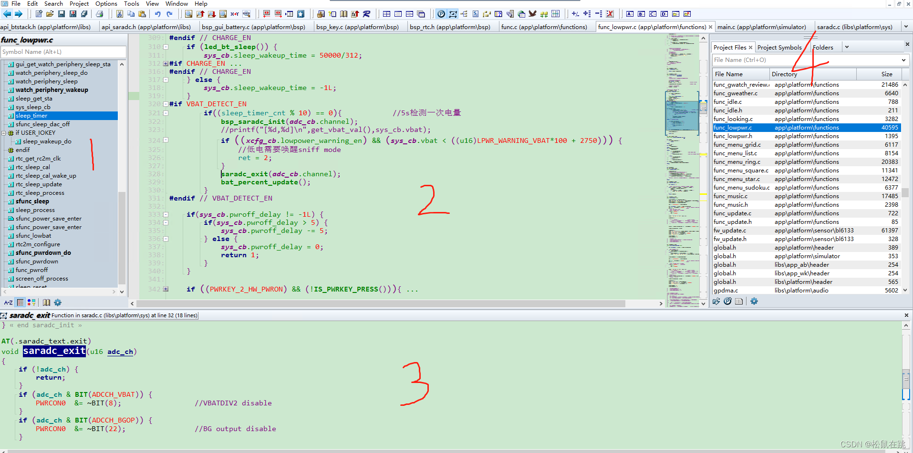

# 界面显示设置：四个窗口

**4个窗口的基本功能：**

- 1号：显示**当前文件**中函数名，[宏定义](https://so.csdn.net/so/search?q=宏定义&spm=1001.2101.3001.7020)，点击即可跳转到相应函数或者宏定义处

- 2号：显示**当前文件**的具体内容

- 3号：显示鼠标双击的**函数的具体实现**

- 4号：**Project Files:显示整个工程的文件 ; Project Symbols:显示整个工程的变量；**

